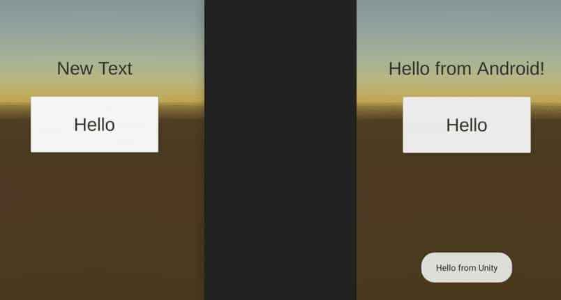

# Unity6打包的新方式

油管教学：[Everything you need to know about Build Profiles in Unity 6 | Unite 2024](https://www.youtube.com/watch?v=BlVsi2cSJ88)

摘要：

- 菜单栏File > Build Profiles (Ctrl+Shift+B)
- 切换不同BuildProfile配置文件可以进行不同平台、宏定义、预设的打包
- 命令行示例（项目目录下执行）：

```bat
"c:\Program Files\Unity 6\Editor\Unity.exe" -activeBuildProfile "Asset/Settings/BuildProfile/WindowsRelease.asset" -Build "Output/build.exe"
```


# Unity打安卓包卡在Gradle怎么办

## Unity2022~Unity6

[[Unity2022.3发布安卓，一直卡在Calling IPostGenerateGradleAndroidProject callbacks问题，无法成功打包。_unity打包apk卡在calling-CSDN博客](https://blog.csdn.net/Wrinkle2017/article/details/144979747)](https://blog.csdn.net/Wrinkle2017/article/details/144979747?utm_medium=distribute.pc_relevant.none-task-blog-2~default~baidujs_baidulandingword~default-1-144979747-blog-130913831.235^v43^control&spm=1001.2101.3001.4242.2&utm_relevant_index=3)

问题描述：
用unity2022.3打安卓包，一直卡在Calling IPostGenerateGradleAndroidProject callbacks，最后提示unity gradle build failed. see the console for details.打包失败。

原因分析：
网络或者安卓镜像有问题。

解决方案：
找到以下路径 2022.3.44f1c1\Editor\Data\PlaybackEngines\AndroidPlayer\Tools\GradleTemplates\settingsTemplate.gradle
打开settingsTemplate.gradle这个文件，相关部分做如下修改：

```c
pluginManagement {
    repositories {
        **ARTIFACTORYREPOSITORY**
        maven {
          url 'https://mirrors.huaweicloud.com/repository/maven/'
        }
        //gradlePluginPortal()
        //google()
        //mavenCentral()
    }
}

include ':launcher', ':unityLibrary'
**INCLUDES**

dependencyResolutionManagement {
    repositoriesMode.set(RepositoriesMode.PREFER_SETTINGS)
    repositories {
        **ARTIFACTORYREPOSITORY**
        maven {
          url 'https://mirrors.huaweicloud.com/repository/maven/'
        }
        //google()
        //mavenCentral()
        flatDir {
            dirs "${project(':unityLibrary').projectDir}/libs"
        }
    }
}
```

之前用的阿里云的镜像，发现还是不行，换成以上 华为云的就可以正常打包了。
如果还是不行，可以试下以下的镜像：

阿里云：http://maven.aliyun.com/
中央仓库：https://repo1.maven.org/maven2/
网易：http://maven.netease.com/repository/public/
华为云：https://repo.huaweicloud.com/repository/maven/
腾讯云：https://mirrors.cloud.tencent.com/repository/maven/
中国科技大学：http://mirrors.ustc.edu.cn/maven/maven2/
南京大学：http://maven.nju.edu.cn/repository/
清华大学：https://repo.maven.apache.org/maven2/
北京理工大学：http://mirror.bit.edu.cn/maven/
东软信息学院：https://mirrors.neusoft.edu.cn/maven2/
中国科学院开源协会：http://maven.opencas.cn/maven/
北京交通大学：http://maven.bjtu.edu.cn/maven2/
————————————————

## Unity2020

[unity 卡在 building gradle project 的解决方法：_unity building gradle project-CSDN博客](https://blog.csdn.net/hwjmyz/article/details/112298734)

### 避免从google下载 Gradle ：

除了使用VPN以外，还可以使用阿里云的镜像，如下： (参考 https://jkchen.blog.csdn.net/article/details/107182562)

找到这个文件夹C:\Program Files\Unity\Hub\Editor\2019.3.5f1\Editor\Data\PlaybackEngines\AndroidPlayer\Tools\GradleTemplates

把baseProjectTemplate.gradle里面的

```c
repositories {**ARTIFACTORYREPOSITORY**
            google()
            jcenter()
        }
```

改为

```c
repositories {**ARTIFACTORYREPOSITORY**
            maven{ url 'http://maven.aliyun.com/nexus/content/groups/public/'}
            google()
            jcenter()
        }
repositories {**ARTIFACTORYREPOSITORY**
			maven {
    		  //阿里最近失效 url 'http://maven.aliyun.com/nexus/content/groups/public/'
    		  //改用华为
			  url 'https://mirrors.huaweicloud.com/repository/maven/'
			}
            google()
            jcenter()
        }
```


### 对于使用了 Google Admob Ads 的情况下

对于使用 GoogleAdmobAds 的情况下，会使用 Google Play Service，在 Assets->Play Service Resolver 里点击 Resolver 或者 Force Resolver，会修改工程里 Assets\Plugins\Android\mainTemplate.gradle文件，也会引用 maven.google.com 来加载相关的依赖包，同样的道理，可以进行修改为使用阿里云的。 修改后，注意设置 Assets->Play Service Resolver-->Setting ，避免它每次打包的时候去合并修改 mainTemplate.gradle

以下是一个完整的例子 mainTemplate.gradle：

```c
// GENERATED BY UNITY. REMOVE THIS COMMENT TO PREVENT OVERWRITING WHEN EXPORTING AGAIN
 
buildscript {
    repositories {**ARTIFACTORYREPOSITORY**
        maven{ url 'http://maven.aliyun.com/nexus/content/groups/public/'}
        google()
        jcenter()
    }
 
    dependencies {
        classpath 'com.android.tools.build:gradle:3.4.0'
**BUILD_SCRIPT_DEPS**}
}
 
allprojects {
    repositories {**ARTIFACTORYREPOSITORY**
        maven{ url 'http://maven.aliyun.com/nexus/content/groups/public/'}
        google()
        jcenter()
        flatDir {
            dirs 'libs'
        }
    }
}
 
// A(hwj---)  AAAndroid Resolver Repos Start ， 这一段是用 Assets->Play Service Resolver 生成的，把 maven.google.com 修改成了阿里云的，注意这个注释里把 Android 改成了 AAAndroid，避免被Resolver自动修改了
([rootProject] + (rootProject.subprojects as List)).each { project ->
    project.repositories {
        def unityProjectPath = "file:///" + file(rootProject.projectDir.path + "/../../").absolutePath
        maven{ url 'http://maven.aliyun.com/nexus/content/groups/public/'}
        maven {
            url "https://maven.aliyun.com/repository/google/" // Assets/GoogleMobileAds/Editor/GoogleMobileAdsDependencies.xml:7
        }
        mavenLocal()
        jcenter()
        mavenCentral()
    }
}
// A(hwj---)  AAAndroid Resolver Repos End
apply plugin: 'com.android.library'
**APPLY_PLUGINS**
 
dependencies {
    implementation fileTree(dir: 'libs', include: ['*.jar'])
// Android Resolver Dependencies Start
    implementation 'com.google.android.gms:play-services-ads:19.5.0' // Assets/GoogleMobileAds/Editor/GoogleMobileAdsDependencies.xml:7
// Android Resolver Dependencies End
**DEPS**}
 
// Android Resolver Exclusions Start
android {
  packagingOptions {
      exclude ('/lib/armeabi/*' + '*')
      exclude ('/lib/mips/*' + '*')
      exclude ('/lib/mips64/*' + '*')
      exclude ('/lib/x86/*' + '*')
      exclude ('/lib/x86_64/*' + '*')
  }
}
// Android Resolver Exclusions End
android {
    compileSdkVersion **APIVERSION**
    buildToolsVersion '**BUILDTOOLS**'
 
    compileOptions {
        sourceCompatibility JavaVersion.VERSION_1_8
        targetCompatibility JavaVersion.VERSION_1_8
    }
 
    defaultConfig {
consumerProguardFiles 'proguard-unity.txt'**USER_PROGUARD**
        minSdkVersion **MINSDKVERSION**
        targetSdkVersion **TARGETSDKVERSION**
        
        ndk {
            abiFilters **ABIFILTERS**
        }
        versionCode **VERSIONCODE**
        versionName '**VERSIONNAME**'
    }
 
    lintOptions {
        abortOnError false
    }
 
    aaptOptions {
        noCompress = ['.unity3d', '.ress', '.resource', '.obb'**STREAMING_ASSETS**]
        ignoreAssetsPattern = "!.svn:!.git:!.ds_store:!*.scc:.*:!CVS:!thumbs.db:!picasa.ini:!*~"
    }**SIGN**
 
    buildTypes {
        debug {
            minifyEnabled **MINIFY_DEBUG**
            useProguard **PROGUARD_DEBUG**
            proguardFiles getDefaultProguardFile('proguard-android.txt'), 'proguard-unity.txt'**USER_PROGUARD****SIGNCONFIG**
            jniDebuggable true
        }
        release {
            minifyEnabled **MINIFY_RELEASE**
            useProguard **PROGUARD_RELEASE**
            proguardFiles getDefaultProguardFile('proguard-android.txt'), 'proguard-unity.txt'**USER_PROGUARD****SIGNCONFIG**
        }
    }**PACKAGING_OPTIONS**
**BUILT_APK_LOCATION**
**EXTERNAL_SOURCES**
    
}**REPOSITORIES****SOURCE_BUILD_SETUP**
```

# Android Studio

[官网下载](https://developer.android.google.cn/studio?hl=zh-cn)

## 安装过程（以2024.2.2为例）

 

 

之后会弹框提示一个警告，那个“Setup Proxy”不要去管它，直接无视：

 

 

然后会开始下载SDK，虽然是谷歌相关的网址（dl.google.com/android...），但也不必翻墙，安装结束。

## 做jar/aar包给Unity用

[【新手】Unity 和 Android Studio的SDK接入_unity android studio 接sdk-CSDN博客](https://blog.csdn.net/weixin_57213714/article/details/120350394)

另有一篇文章更透彻：[见下文【Unity 和 Android 的工程集成】](#Unity 和 Android 的工程集成)


## 把Unity工程转成java工程给Android Studio用

[unity打包Android项目到Android studio_mob649e816704bc的技术博客_51CTO博客](https://blog.51cto.com/u_16175511/12181230)

[unity项目导入到android studio_unity项目导入android studio src-CSDN博客](https://blog.csdn.net/qq_58451437/article/details/122912174)


# Unity 和 Android 的工程集成

原文：[Unity 和 Android 的工程集成 — Zhirui Li's Blog](https://zhiruili.github.io/posts/unity-with-android/)

有时候，我们需要在 Unity 里调用一些 Android 的功能，这些功能在 Unity 中可能并没有提供接口，需要在 Android 平台上实现。此时，我们需要有一个方法来让 Android 代码和 Unity 代码互调用。这里记录一下操作方法，并提供一个工具来简化两个工程之间的集成流程。

## 示例工程 

下面的记录中所使用的工程可以参考 [UnityAndroidExample](https://github.com/ZhiruiLi/UnityAndroidExample)。其中，根目录是 Unity 工程，可以直接用 Unity 打开。根目录下的 AndroidSample 子目录是 Android 工程，可以用 Android Studio 打开。

Unity 工程运行后如下图左所示，只有一个文本和一个按钮，点击按钮就会触发 Unity 到 Anrdoid 的调用，在主界面上产生一个 toast，同时，触发一次从 Anrdoid 到 Unity 的调用，主界面上的文本变为「Hello From Android」：

 

## 具体操作方式 

### 新建一个 Android 工程 

这里随便用 Android Studio 建立空一个工程就行了。建立好工程后，参考[官方文档](https://developer.android.com/studio/projects/android-library)在工程里添加一个自定义的模块：

- 菜单栏点击 「File」-「New」-「New Module…」
- 弹出窗口中左侧选「Android Library」
- 右侧填入相关信息后创建模块

 

假设创建的模块名为「mod」，那么就会在工程根目录下新增一个名为 mod 的目录。此时可以删除工程根目录中默认创建的 app 目录，并将工程根目录中 settings.gradle 文件里的 `include ':app'` 这一行删除。

 

### 添加 Unity jar 依赖 

为了在 Android 中和 Unity 互交互，我们需要引入 Unity 提供的库，这个库以 jar 包的形式提供。以下目录中都有这个 classes.jar 文件，有 mono 和 il2cpp 版本，还区分 Release 和 Development：

- YOUR_EDITOR_PATH/Data/PlaybackEngines/AndroidPlayer/Variations/il2cpp/Release/Classes
- YOUR_EDITOR_PATH/Data/PlaybackEngines/AndroidPlayer/Variations/mono/Release/Classes
- YOUR_EDITOR_PATH/Data/PlaybackEngines/AndroidPlayer/Variations/il2cpp/Development/Classes
- YOUR_EDITOR_PATH/Data/PlaybackEngines/AndroidPlayer/Variations/mono/Development/Classes

这里的「YOUR_EDITOR_PATH」是 Unity editor 程序所在的路径，例如，如果在 Windows 上用 Unity Hub 安装了 2020.3.5fc1 的 Unity，那么这个路径就是 C:\Program Files\Unity\Hub\Editor\2020.3.5f1c1\Editor。

参考[Android 官方文档](https://developer.android.com/studio/build/dependencies#dependency_configurations)添加依赖，将该 jar 文件复制到 Android 工程中的对应模块的 libs 目录中，具体是复制哪一个 jar 无关紧要，因为后面的流程中并不会实际加入这个 jar 包。在复制的之后可以修改一个名字，例如修改为 unity.jar。然后修改 gradle 构建文件，注意这里是修改模块目录下的 build.gradle 而非根目录下的。在 `dependencies` 中添加如下内容：

```groovy
dependencies {
    // ... 前面有一堆默认的

    // 添加 unity 的 jar
    // 注意这里必须是 compileOnly 以避免该 jar 包被打入 aar 包中，否则会在之后发生命名冲突
    compileOnly files('./libs/unity.jar')

    // 如果还有别的自定义的 jar 就用 implementation
    implementation files('./libs/some_other_lib.jar')
}
```

 

修改完后，Android Studio 会提示是否要同步，点击「Sync Now」即可。

 

### 引入 UnityPlayerActivity

我们在实现自己的 Activity 时不能直接实现，而是需要继承 Unity 的 `UnityPlayerActivity`，这个类型会按照一定的规则去调用 Unity 的回调函数，以确保程序的正确运行。从前这个类就在刚刚我们引入的 unity.jar 中，而在新版本的 Unity 中这个类却以单独文件的形式存在，需要自己拷贝一下，这个文件所在的路径为：YOUR_EDITOR_PATH/Data/PlaybackEngines/AndroidPlayer/Source/com/unity3d/player/UnityPlayerActivity.java。

我们直接将 YOUR_EDITOR_PATH/Data/PlaybackEngines/AndroidPlayer/Source/com 这个目录直接拷到工程里的 mod/src/main/java 目录下，这样一来，我们的代码就可以看到这个 Activity 了。

### 新增一个 Activity 继承 UnityPlayerActivity

在这里，我们添加一个 `showMessage` 函数用于给 Unity 调用，同时，在这个函数里面，我们通过 `UnityPlayer.UnitySendMessage` 来调用 Unity 中的函数。这个 `UnityPlayer` 定义于我们引入的 unity.jar 文件中。其中第一个参数是 Unity 场景中的对象名，第二个参数是需要调用的函数名，第三个参数是传递的参数：

```java
public class MainActivity extends UnityPlayerActivity {
    // 被用于 Unity 调用的函数
    public void showMessage(final String message) {
        runOnUiThread(() -> Toast.makeText(MainActivity.this, message, Toast.LENGTH_SHORT).show());
        // 调用 Unity 的函数
        UnityPlayer.UnitySendMessage("Canvas", "ChangeText", "Hello from Android!");
    }
}
```

此时，文件结构如下图所示：

 

### 构建模块 

菜单栏中选择「Build」-「Make Module ‘mod’」。等待构建完成后，会在 mod/build/output/aar 目录下看到构建出来的包。

### 和 Unity 集成 

接下来，我们需要将这个库和 Unity 集成，并让 Unity 以这个 Activity 为入口启动程序。

将这个 aar 包解压，放入 Unity 工程的 Plugins/Android/mod 目录下，然后在这个目录下建立一个 project.properties 文件，填入如下内容：

```ini
android.library=true
```

再在 Plugins/Android 目录下（和 mod 同级）建立一个 AndroidManifest.xml 文件，填入如下内容，注意其中的 `ACTIVITY_NAME` 需要换成 main Activity 的完整类名（完整包名加上类名）。如果有什么需要申请的权限，也可在此加入：

```xml
<?xml version="1.0" encoding="utf-8"?>
<manifest
    xmlns:android="http://schemas.android.com/apk/res/android"
    package="com.unity3d.player"
    android:installLocation="preferExternal"
    android:versionCode="1"
    android:versionName="1.0">
    <supports-screens
        android:smallScreens="true"
        android:normalScreens="true"
        android:largeScreens="true"
        android:xlargeScreens="true"
        android:anyDensity="true"/>

    <application
        android:theme="@style/UnityThemeSelector"
        android:icon="@drawable/app_icon"
        android:label="@string/app_name"
        android:debuggable="true">
        <activity android:name="ACTIVITY_NAME"
                  android:label="@string/app_name">
            <intent-filter>
                <action android:name="android.intent.action.MAIN" />
                <category android:name="android.intent.category.LAUNCHER" />
            </intent-filter>
            <meta-data android:name="unityplayer.UnityActivity" android:value="true" />
        </activity>
    </application>
</manifest>
```

要在 Unity 中调用 Android 的函数，需要用类似这样的方法实现。首先，我们要找到当前的 Android Activity，然后我们通过 `Call` 方法来调用其中的逻辑。其中第一个参数是方法名，后面的参数是需要传递的参数：

```csharp
#if UNITY_ANDROID && !UNITY_EDITOR
using (AndroidJavaClass jc = new AndroidJavaClass("com.unity3d.player.UnityPlayer"))
{
    using (AndroidJavaObject activity = jc.GetStatic<AndroidJavaObject>("currentActivity"))
    {
        activity.Call("showMessage", "Hello from Unity");
    }
}
#else
#endif
```

这一块代码用 `#if UNITY_ANDROID && !UNITY_EDITOR` 包裹，只在 Android 设备上生效。

另外我们还需要在 Unity 场景中添加刚刚 Android 代码中调用 Unity 时 Unity 侧的接收者（在本示例中为 `Canvas`），这块具体操作直接参考示例工程即可。

### Unity 构建 

在 Unity 菜单中点击「File」-「Build Settings…」，在弹出的窗口中选择 Android 平台，然后构建即可。

## 一个小工具 

上面这个流程有些是只用操作一次的（例如新建工程），但也存在一批需要反复操作的（例如编译 Android 工程、删除 Unity 的 Activity 等），这些需要反复操作的流程在每次修改 Android 工程中的代码后，都需要进行一次，非常麻烦还容易出错，因此，这里提供一个简单的[小工具](https://github.com/ZhiruiLi/upack)来简化这个工作。这个工具的安装需要用到 go，需要先[安装一下 go 的环境](https://golang.org/doc/install)。

这个小工具可以编译指定的 Android 模块，然后将 aar 压缩包解压到 Unity 工程中，删除 Unity 的 Activity class，并生成 project.properties 和 AndroidManifest.xml 文件。在生成 AndroidManifest.xml 的时候，提供了默认的文件模板，允许通过命令行参数指定需要申请的 Android 权限。

例如这样的命令：

```cmd
upack -a ./AndroidSample -e com.example.mod.MainActivity -m mod -p android.permission.BATTERY_STATS ./Assets/Plugins/Android
```

可以将 Android 工程 AndroidSample 编译，然后将数据解压到 ./Assets/Plugins/Android 目录下，其中

- 参数 `-e` 用来指定入口 Activity 的类型全名
- 参数 `-m` 用来指定 Android 模块名
- 参数 `-p` 用来指定需要申请的权限，如果有多个权限需要申请，则可以增加多个 `-p` 参数。

在示例工程中也可以体验这个工具，每次修改这个 Android 工程中的代码，都可以执行一下工程根目录下的 update_android.bat 脚本，这个脚本会调用这个工具，重新构建 Android 工程并自动将相关内容解压到 Unity 工程中。

# AssetStore插件

Unity AssetStore上有很多针对安卓平台的插件，通常都是已经提供好C#端的调用方法，直接在C#端调用即可实现对手机系统层面的调用（比如摄像头、定位、闹钟等）。以下列出我用过的插件：

## 拍照

[AVPro Live Camera | 视频 | Unity Asset Store](https://assetstore.unity.com/packages/tools/video/avpro-live-camera-3683)

[网盘备份：AVPro Live Camera 2.9.1.unitypackage](https://pan.baidu.com/s/1qXXpzTcCoSKnJ-SrShnqpA?pwd=vfhn)

题外：AVPro 是一个品牌，他们产出了很多美术相关的插件，还有像AVPro Video、AVPro Movie Capture Window等

## TTS文字转语音

[Android TTS Plugin | 音效 | Unity Asset Store](https://assetstore.unity.com/packages/tools/audio/android-tts-plugin-21772)，基于2017年已下架，但已购可下载。[网盘备份](https://pan.baidu.com/s/1oJ_ZoFlNAKM75U2kGfDPWA?pwd=qf65) 

当前市面流行的TTS插件可以在AssetStore上搜Android TTS，前几个5星的看起来都不错，比如[Overtone - Realistic AI Offline Text to Speech (TTS)](https://assetstore.unity.com/packages/tools/generative-ai/overtone-realistic-ai-offline-text-to-speech-tts-251304)

## 安卓系统原生功能合集

- 免费版：[Android Native Functions | 整合 | Unity Asset Store](https://assetstore.unity.com/packages/tools/integration/android-native-functions-43736#description)
- 收费加强版（某宝不到1元）：[Android Native Goodies! | 整合 | Unity Asset Store](https://assetstore.unity.com/packages/tools/integration/android-native-goodies-67473#reviews)（[网盘备份1.85版](https://pan.baidu.com/s/1vwxlXB4tWjt8jCkLRCnljw?pwd=7irn)）另附 [在线文档](https://docs.ninevastudios.com/#/unity-plugins/android-goodies)

Android Native Goodies! 同时在Unity、UE都能搜到，功能齐全（分享、相机、闹钟、壁纸、定位、截图等等所有系统相关都有）
