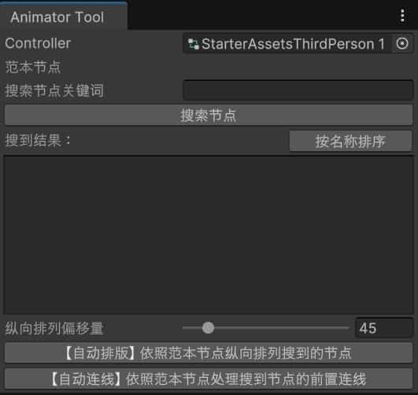
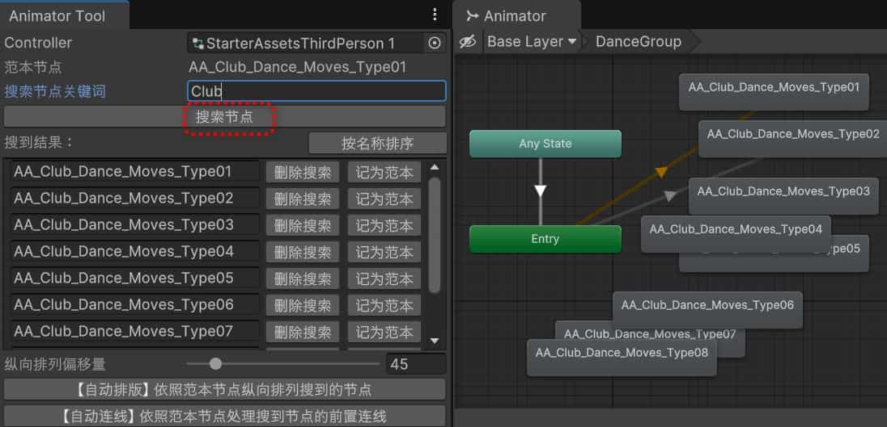
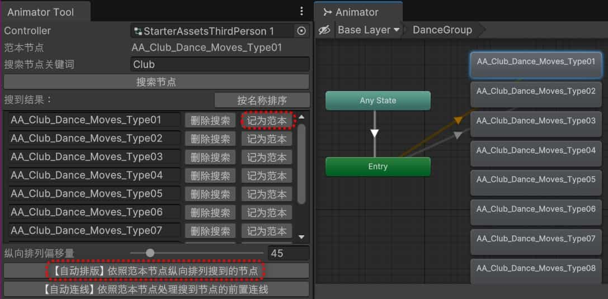
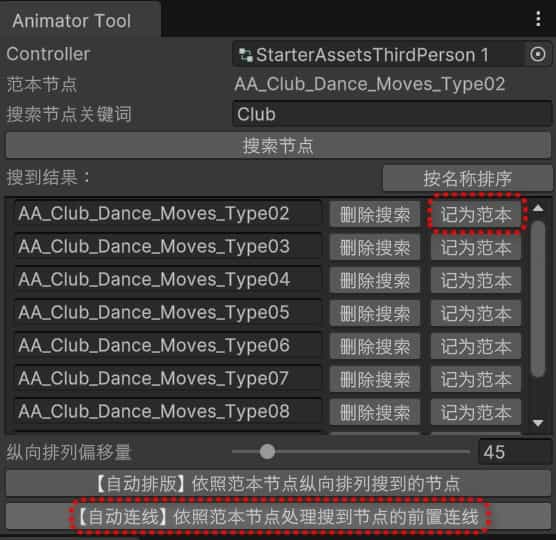
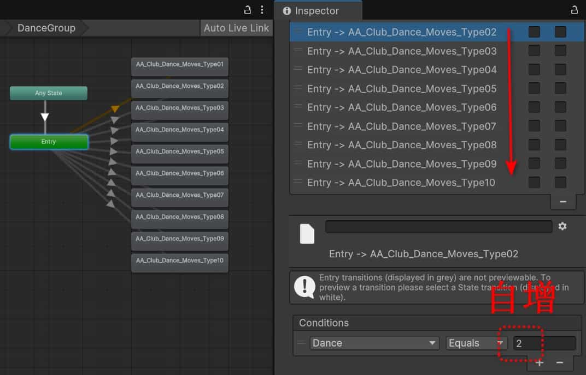
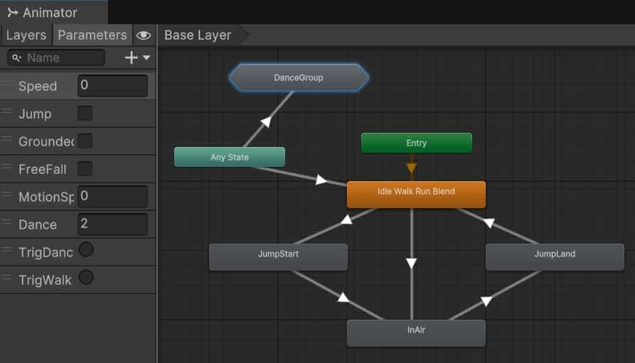

# 这个工具能做什么

Unity的Animator窗口虽然可以直观地编辑动画状态机。但是面对茫茫多的动画片段，给每一个动画节点**拖拽位置、设置连线、配置连线内部的跳转条件**。这是一个重复度很高的繁杂工作。能不能通过一个辅助编辑器来让这件事情更加自动化呢？于是窗口辅助工具 **Animator Tool** 诞生了。

# 使用指南

## 初始界面

该工具仅一个代码文件：[AnimatorToolEditor.cs](./AnimatorToolEditor.cs)

将该脚本导入unity后，可通过菜单栏“Tools > Animator Tool”打开一个窗口，填入要编辑的Controller文件之后，界面如下图：

 

点击 “搜索节点” 按钮，会列出所有状态节点；或者先输入一个关键词（比如Club），会筛选并列出所有名字包含关键词的状态节点。如下图：

## 自动排版

选择其中的第一个节点（名称以“Type01”结尾）作为范本（点击“记为范本”按钮即可），再点击“自动排版”按钮，这样所有搜到的节点会以范本结点为起点，向下纵向排列，并且通过调整 “纵向排列偏移量” 滑杆，可以调整纵向排列的间隔，排列好的效果如下图：

 

## 自动连线

如果搜索结果中有我们不需要的，也可以手动点击 “删除搜索” 按钮，这个操作不会真的删除节点，只是从搜索结果中过滤掉它。

下面我们就把第一个节点从搜索结果中删除：点击第一个节点右边的 “删除搜索” 按钮。

然后将第二个（名称以“Type02”结尾）节点记为范本（此时这个节点是唯一被灰白色箭头指向的节点，我们要利用这个箭头连线的配置，给其他节点添加连线）。点击 “自动连线” 按钮，操作如下图：

 

之后会弹窗提示连线处理完毕，需要手动切一下Animator窗口的当前Layer或状态机来触发界面刷新（我试了在代码中自动刷新界面，目前试过SetDirty、AssetDatabase.SaveAssets都不好使），弹窗提示如下图：

 

按照弹窗提示刷新一下Animator窗口，即可看到所有节点都自动加了连线，如下图：

 

通过上图可以看到，不仅所有节点都按照范本节点做了连线，并且新添加的连线，其跳转条件中的数字还会自增（目前仅类型为Equals相等时，支持数字+1自增）。

# 题外话

## 为什么只处理前置连线

因为需要批量连线的，通常都是一系列类型相同的动画（比如刚刚在使用指南中截图的例子，就是各种舞蹈动作的状态节点，都属于跳舞的范畴），通常我们会把这一系列状态节点单独放在一个**子状态机**里。这样退出跳舞动作的逻辑就可以简化成退出这个子状态机的逻辑，不需要给里面状态节点逐个添加结束跳转。这样最终你会发现，有需要批量维护的，其实只有前置连线。

## 常见上层架构示例

 

可以看到，原本包含众多状态节点的DanceGroup状态机，现在缩略成了一个名为DanceGroup的六边形节点。这样界面看起来很干净，既实现了“跳舞不走路，走路不跳舞”，又实现了跳舞和走路的灵活切换。从Any State指向到“Idle Walk Run Blend”的节点，则是交代了退出跳舞模式之后恢复到行走的逻辑。行走和跳舞两者的切换是靠两个Trigger类型的变量（TrigDance、TrigWalk）来触发的。

## 新手入门Animator的推荐教程

### 关于Layer的使用

- [动画缝合怪？如何使用Unity的Animation Layer和Avatar Mask把多个动画组合使用【Unity动画系统详解 二十三】_哔哩哔哩_bilibili](https://www.bilibili.com/video/BV1gT4y1k7EZ)
- [游戏角色的疲劳感是如何制作的？利用Animation Layers中的additive模式把多个动画混合在一起【Unity动画系统详解 二十四】_哔哩哔哩_bilibili](https://www.bilibili.com/video/BV1J44y137JC)
- [如何制作角色的受伤状态？Unity动画层级（Animation Layer）的Sync和Timing介绍【Unity动画系统详解 二十五】_哔哩哔哩_bilibili](https://www.bilibili.com/video/BV1AF411M7eK)

### 不做连线，直接调用播放

- [【中文字幕】逃出动画炼狱：如何使用Animator_哔哩哔哩_bilibili](https://www.bilibili.com/video/BV1BR4y1A7qK)