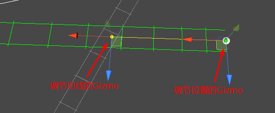

# 官方社区文章

## 基于 2.0 旧版

- [5 分钟入门 Cinemachine 智能相机系统 - 技术专栏 - Unity 官方开发者社区](https://developer.unity.cn/projects/5e368a34edbc2a0020ad485d)
- [【Cinemachine】VirtualCamera 虚拟相机详解(一) - 技术专栏 - Unity 官方开发者社区](https://developer.unity.cn/projects/5e3febb9edbc2a7981bbdabe)
- [【Cinemachine 智能相机教程】VirtualCamera(二)：Body 属性 - 技术专栏 - Unity 官方开发者社区](https://developer.unity.cn/projects/5e48cfa1edbc2a1e0e5d31a6)
- [【Cinemachine 智能相机教程】VirtualCamera(三)：Aim 属性 - 技术专栏 - Unity 官方开发者社区](https://developer.unity.cn/projects/5e5276dfedbc2a31ffc5ecb7)
- [【Cinemachine 智能相机教程】VirtualCamera(四)：Noise 属性 - 技术专栏 - Unity 官方开发者社区](https://developer.unity.cn/projects/5e5b551aedbc2a4b3356331e)
- [Unity Cinemachine 智能相机教程(五)：VirtualCamera 的 Extension 扩展 - 技术专栏 - Unity 官方开发者社区](https://developer.unity.cn/projects/5e64aab2edbc2a02139a6441)
- [Cinemachine 教程 | Unity 中如何制作路径动画？ - 技术专栏 - Unity 官方开发者社区](https://developer.unity.cn/projects/5e6e226bedbc2a001f4c53b4)
- [Cinemachine 教程 | Unity 中如何快速制作相机切换动画？ - 技术专栏 - Unity 官方开发者社区](https://developer.unity.cn/projects/5e9c5fd4edbc2a5c5cd004e3)
- [Cinemachine 教程 | Unity 中如何快速制作镜头晃动？ - 技术专栏 - Unity 官方开发者社区](https://developer.unity.cn/projects/5ea6db7aedbc2a001f1e4fbd)
- [如何在 Timeline 中使用 Cinemachine？ - 技术专栏 - Unity 官方开发者社区](https://developer.unity.cn/projects/5eaec8b7edbc2a5b0b505691)
- [Cinemachine Camera 详细讲解和使用 - 知乎](https://zhuanlan.zhihu.com/p/516625841)

## 基于 3.0 新版

- [【官方】Get started with Cinemachine | Cinemachine | 3.1.2](https://docs.unity3d.com/Packages/com.unity.cinemachine@3.1/manual/get-started.html)
- [Cinemachine 3 - community tutorials - Learn Content - Unity Discussions](https://discussions.unity.com/t/cinemachine-3-community-tutorials/945883)


# Cinemachine 3.0 大变更

[Cinemachine](https://unity.com/unity/features/editor/art-and-design/cinemachine) 无需多言。作为 Unity 中下载次数最多的工具之一，Cinemachine 是一套使用无代码摄像机创建复杂实时镜头的工具，用于游戏电影和其他线性制作工作。

我们不断改进其功能，同时也从用户那里收到有益的反馈和更新请求。所有这一切促成了我们的最新发布：Cinemachine 3. Cinemachine 3 与最低版本 2022.2 兼容。从 2023.2 起正式生效。

为什么是时候推出 Cinemachine 3 了？

Cinemachine 最初是被收购的，加入 Unity 已有五年时间。一开始，它并不完全符合现有的 Unity 框架和流程。随着 Unity 的发展和对 UI 持续开发的关注，Cinemachine 并不总是最重要的。

在这个版本中，我们退后一步，重新设计了 Cinemachine 中某些功能的操作方式。Cinemachine 3 的升级与其说是功能更新，不如说是格式的改变--使其与 Unity 的其他部分保持一致。


Cinemachine Spline Dolly 的 GIF 图像

开发人员在升级前需要了解的信息

并非每个使用 Cinemachine 的人都需要升级。但如果您在 Unity Editor 2023.2 中启动一个项目，默认情况下您将使用 Cinemachine 3。

**请注意** 在升级到 Cinemachine 3 之前，请检查您是否有大量使用 Cinemachine API 的自定义脚本。如果是这样，最好还是使用以前的版本。虽然我们提供了转换项目数据的工具，但目前还没有自动迁移代码的方法。Unity API 更新程序无法处理所有 API 变动，因此需要手动升级。

如果您使用的是 "开箱即用 " 的 Cinemachine，没有任何自定义脚本，升级过程将相对简单。

Cinemachine 3 中的名称更改

为了使 Cinemachine 3 更清晰、更易用，我们更改并规范了部分名称。例如，由于 Unity 有另一款名为 Virtual Camera 的产品，Cinemachine 中的虚拟摄像机现在被称为 CinemachineCamera。请观看这段 [内容丰富的视频](https://www.youtube.com/watch?v=znOii5cz0RU&list=PLX2vGYjWbI0TXyj79RTqMuhUP9mWIejF5)，了解有关这些名称更改的更多详情。


新内容概览

- 不再有隐藏的游戏对象
- 与预制件和预设更好地配合使用
- 改进与 Unity 标准的集成
- API 现在与 Unity 更加一致
- 更简洁的用户体验
- 简化工作流程
- 与 Unity 花键集成
- 更多定制机会
- 全面检查样本场景

不再有隐藏的游戏对象

Cinemachine 以前是通过隐藏的游戏对象来实现的，这些对象的行为负责控制摄像机的位置等。这就需要一个复杂的应用程序接口来获取这些对象、制作动画并从脚本中访问它们。这一点已得到清理，并变得更加标准化。

与预制件和预设更好地配合使用

由于删除了隐藏的游戏对象，Cinemachine 与预制件和预设的兼容性更强。

改进与 Unity 标准的集成

Cinemachine 最初是使用成员变量标准编写的。这是我们收到的很多反馈意见（也是我们不喜欢的）。因此，我们删除了所有这些 m_ 实例。

API 现在与 Unity 更加一致

程序组件现在是以常规方式添加到 GameObject 中的标准 MonoBehaviours，因此无需调用任何特殊的 API 即可访问它们。

更简洁的用户体验

巨型检查员不见了。现在，用户体验分布在新的 Cinemachine 程序组件中。许多设置都是选择性的，因此如果你不需要，它们也不会干扰检查器。


简化工作流程

默认情况下，只有一个跟踪目标，而不是两个，因此需要设置的内容较少。FreeLook 也进行了全面改造，功能更多，所需的设置更少。通过新的轨道跟随行为，它现在还支持半径缩放。

现在，需要用户输入的相机设置由一个独立组件驱动，该组件同时支持新旧输入系统。新的 Cinemachine 通道设置简化了分屏的实现，让你不再需要使用 Unity 图层。


与 Unity 花键集成

Cinemachine 花键实现已被弃用，取而代之的是与新的 Unity 原生花键的集成。

更多定制机会

- ClearShot 现在可以接收定制的拍摄质量评估器
- Spline Dolly 和 Spline Cart 现在可以接收自定义 AutoDolly 实现
- FreeLook 可接收垂直摄像机移动的自定义修改器
- 现在编写自定义输入轴控制器更容易了

全面检查样本场景

Cinemachine 3 中的所有样板场景都是从头开始重新制作的。


# 引入 Character Controller 导致的编译报错

## 现象

**Cinemachine 示例代码编译报错：**

如果在 Package Manager 中同时引入 Cinemachine 和 Character Controller，并且引入了 Cinemachine 的示例代码，那么 Cinemachine 的示例代码会报下面这个错误：

```
Assets\Samples\Cinemachine\3.1.2\Shared Assets\Scripts\SimplePlayerController.cs(380,17): error CS0234: The type or namespace name 'Raycast' does not exist in the namespace 'Unity.Physics' (are you missing an assembly reference?)

Assets\Samples\Cinemachine\3.1.3\Shared Assets\Scripts\SimplePlayerController.cs(143,9): error CS0118: 'CharacterController' is a namespace but is used like a type
```

## 原因

Character Controller 包依赖 Unity Physics 包，Unity Physics 包的代码命名空间为 Unity.Physics，而 Cinemachine 的示例代码命名空间为 Unity.Cinemachine.Samples。都是 Unity 开头的，所以 Cinemachine 的示例代码报错：

```c#
//本意是调用 UnityEngine.Physics
Physics.Raycast(...)//误认为是Unity.Physics包的Physics，并没有Raycast函数

//本意是声明 UnityEngine.CharacterController
CharacterController m_Controller;//误认为是CharacterController包的命名空间
```

Physics 会被错误地认为是 Unity.Physics 而不是原本 UnityEngine.Physics。即便是在代码开头声明 `using Physics = UnityEngine.Physics` 也不行（估计是以 Unity 为命名空间的代码有些潜规则）。

## 解决办法

### 方法一：改Cinemachine示例代码

```c#
UnityEngine.Physics.Raycast()
UnityEngine.CharacterController m_Controller;
```

### 方法二：从PackageManager中卸载包

- 删掉 Assets/Samples 目录中的 `Character Controller` 和 `Unity Physics` 文件夹
- 卸载 Character Controller 包（ UnityPhysics 包会自动跟着卸载）

# Cinemachine 基本使用流程（旧）

Cinemachine 可以从 Package Manager 安装。安装好 Cinemachine 之后，菜单栏会有一个新的菜单项叫：Cinemachine。

 

Cinemachine 没有外部依赖包，安装后就可以使用。Cinemachine 还可以和 Post Processing Stack（场景后处理工具）一起使用。

使用 Cinemachine 时需要用一种新的方式来思考相机：你可能之前研究的都是如何通过脚本来更好的控制相机，但是在 Cinemachine 中，你需做的是各种相机的不同用途，快速创建出想要的相机然后调他们的参数就可以了。

## 创建虚拟相机

从菜单栏 Cinemachine > Create Virutal Camera 创建虚拟相机。

Cinemachine 能控制大量相机，但是它并不创建新的相机，它通过控制 Unity 相机来实现多机位的效果。如何实现的呢？在 Cinemachine 中有一个 **虚拟相机** 的概念。虚拟相机是相机的一些设置，用于控制 Unity 相机的移动、旋转以及相关设置。

每个虚拟相机是一个单独的物体，独立运行，也和场景中的相机没有直接关系。例如，你的场景可能长这样：

 

虚拟相机有什么功能呢？

- 决定 Unity 相机在场景中的位置
- 决定 Unity 相机的朝向，并跟踪某物体
- 为相机添加程序化的晃动，比如手持相机效果或者车辆的震动

Cinemachine 系统鼓励你创建多个虚拟相机。虚拟相机有很好的性能，不用过多担心会出现性能问题。如果你的场景对性能很敏感，可以禁用当前使用的虚拟相机以外的所有的虚拟相机，这样能达到极致性能。

虚拟相机的一个最佳实践是：一个镜头使用一个虚拟相机。例如：

对于两个角色对话的过场动画，使用三个虚拟相机：一个相机用于两个角色中间的镜头，单独的虚拟相机用于每个角色的特写镜头。然后使用 Timeline 同步音频与虚拟相机。

复制一个现有的虚拟相机，这样两个虚拟相机在场景中的位置相同。对于第二个虚拟相机，稍微改变一下 FOV 或构图。当玩家进入触发区域时，Cinemachine 会从第一个虚拟相机过渡到第二个虚拟相机，用于强调变化。

同一时间仅有一个虚拟相机控制 Unity 相机，这个虚拟相机被称为活动虚拟相机（live virtual camera）。例外情况是从一个虚拟相机混合到另外一个虚拟相机的时候，混合阶段两个虚拟相机都是活动状态。

## 添加 Cinemachine Brain

**通常这一步不需要你手动添加，因为在第一步创建 Virtual Camera 时会自动给 Unity 相机添加 Cinemachine Brain 组件。**

CinemachineBrain 是挂在 Unity 相机上的一个组件。这个组件会跟踪场景中所有的活动虚拟相机。你可以通过激活/禁用虚拟相机物体来指定下一个活动虚拟相机。

 

## 配置 VirtualCamera 的移动和旋转策略

使用 VirtualCamera 组件中的 Body 属性来设置相机如何移动。使用 Aim 属性来设置相机如何旋转。

 

虚拟相机有两个跟踪目标：

- **Follow** 指定了相机跟随移动的目标。
- **Look At** 指定了相机瞄准的目标。

Cinemachine 中包含了各种用于相机控制和瞄准的算法。每个算法提供了一种特定的方式，你可以通过设置算法的属性来满足你的特殊需求。你也可以通过继承 CinemachineComponent 来实现自定义的移动和瞄准的行为。

**Body** 属性提供了下列算法来移动虚拟相机：

- Do Nothing：不移动虚拟相机
- Framing Transposer：在屏幕空间，保持相机和跟随目标的相对位置，可以设置缓动。
- Hard Lock to Target：虚拟相机和跟随目标使用相同位置。
- Orbital Transposer：相机和跟随目标的相对位置是可变的，还能接收用户的输入。常见于玩家控制的相机。
- Tracked Dolly：相机沿着预先设置的轨道移动。
- Transposer：相机和跟随目标的相对位置固定，可以设置缓动。

**Aim** 属性提供了下列算法来旋转相机对准 Look At 的目标：

- Composer：将目标保持在相机镜头内，可以设置多种约束
- Group Composer：将多个目标保持在相机镜头内
- Do Nothing：不旋转相机
- POV：根据用户的输入旋转相机
- Same As Follow Target：将相机的旋转和跟随目标的旋转同步
- Hard Look At：将 Look At 目标固定在镜头中心的位置。

## 配置镜头构图

上面第 3 步提到的 Framing Transposer、Composer 和 Group Composer 算法定义了镜头的几个特殊区域，可以用于镜头构图。

Dead zone：Cinemachine 会将目标保持在这个区域，目标在这个区域时，镜头保持不动。

Soft zone：如果目标进入这个区域，会触发相机的移动和旋转，将目标重新移回 dead zone。这个过程可能很快，也可能很慢，取决于 Damping 属性设置。

Screen：Dead zone 区域的中心在屏幕上的位置，可以不在整个游戏屏幕的正中间。

Damping：模式现实世界中操控相机时的延迟。Damping 设置了目标进入 soft zone 后相机的反应速度。数值越小，相机反应越快，会更快地操作相机把目标保持在 dead zone。数值越大，相机反应越慢，跟随目标回到 dead zone 所需的时间也就更长，可以用来模拟一个很笨重的摄像机。

 

组件中的 **Game Window Guides** 勾选后，可以在 Game 窗口可视化的查看/编辑构图区域。最外圈是 no pass zone，也就是目标从来不会到的位置。中间的黄色小方块代表了 target 的位置。

通过拖拽每个区域的边缘或者调整 Inspector 上的数值来调整这些区域。调整这些区域可以得到多种多样的相机行为。比如使用更大的 damping 值模拟笨重的相机；增加 dead zone 和 soft zone 来创建一个对目标运动不敏感的相机。

## 配置模拟相机的晃动

现实世界的摄像机通常比较笨重，由摄影师手持或者绑在车辆上。使用 **Noise** 属性可以模拟这些效果。例如，你可以给相机添加晃动来跟随一个向前跑的角色以获得更好的沉浸感。

每帧更新后，Cinemachine 给相机单独添加晃动。这些晃动不会影响相机后续的位置和镜头。这样可以保证虚拟相机运行结果的一致性。

## 总结

以上便是 Cinemachine 的常规操作流程。下面将按照 Cinemachine 菜单栏的每个选项逐一详细介绍。

# Virtural Camera（新版更名为 Cinemachine Camera）

## 概要

Unity 会在场景中创建一个 Virturl Camera 物体，并自动在 Camera 上挂 CinemachineBrain 组件。

- Status 三种状态：Live（活动），Standby（待命），Disable（禁用）；Solo 用于调试，选中时此相机会直接控制 Unity 相机显示在 Game 窗口中，忽略优先级；Game Window Guides 勾选时，Game 窗口会显示辅助线。
- Follow 跟随，Body 属性基于这个目标物更新相机的位置。
- Look At 朝向，Aim 属性使用这个来更新相机的旋转。
- Save During Play：虚拟相机的属性在运行时修改可以保存
- Priority 优先级：用于 Live 镜头的选择，数值越高优先级越高，Cinemachine Brain 会根据这个属性从所有激活的虚拟相机中选择活动的虚拟相机。在 Timeline 上使用时这个属性不生效。
- StandBy Update：待命时（优先级不足但未禁用）的更新方式，Never（省性能），Always（每帧），Round Robin（所有待命虚拟相机循环更新，每帧更新一个相机）
- Lends 镜头设置：对应 Camera 中的属性，也可以从 Preset 中选择或者从现有的设置创建新的 Preset。
- Dutch 镜头旋转：Camera 中没有这个属性，可用来控制镜头在屏幕空间的旋转。
- Transitions 相机转换的相关设置：
  - Blend Hint 混合方式（None 默认线性混合，Spherical Position 根据 LookAt 的物体球面旋转混合，Cylindrical Position 根据 Look At 的物体柱面旋转混合，Screen Space Aim When Target 在屏幕空间瞄准目标）
  - Inherit Position 下一个相机变成活动相机时，从上一个相机继承位置，即保持两个相机位置相同
  - On Camera Live 事件，相机变为活动时触发。
- Body：较为复杂，单开一章
- Aim：较为复杂，单开一章
- Noise：较为复杂，单开一章
- Extension：可以给虚拟相机添加额外扩展

## Body（旧）

CinemachineVitualCamera 组件中的 Body 属性用于设置相机 **移动** 时使用什么算法。需要先设置好上面的 **Follow 属性**。

 

Cinemachine 包含以下移动相机的算法：

 

- Do Nothing：不移动虚拟相机
- Framing Transposer：跟随目标移动，并在屏幕空间保持相机和跟随目标的相对位置。
- Hard Lock to Target：虚拟相机和跟随目标使用相同位置。
- Orbital Transposer：相机和跟随目标的相对位置是可变的，还能接收用户的输入。常见于玩家控制的相机。
- Tracked Dolly：相机沿着预先设置的轨道移动。
- Transposer：跟随目标移动，并在世界空间保持相机和跟随目标的相对位置固定。

### Do Nothing 算法

选中这个算法时，虚拟相机激活时，会控制 Unity 相机会固定在当前虚拟相机的位置，不会移动。用于固定位置的镜头，也可以通过自定义脚本来控制相机的位置。通常和 Look At 配合使用，模拟固定位置的跟随镜头。

### Framing Transposer 算法

 

选中这个算法时，Cinemachine 会在屏幕空间将相机和跟随物体保持固定的相对位置关系。只会改变相机的位置，不会改变相机的旋转。还可以设置偏移、阻尼、构图规则等等。

**Framing Transposer** 算法是为 2D 和正交相机设计的，主要用于 2D 情况。但是对于透视相机和 3D 环境也可以使用。

这个算法工作流程大概是：首先沿着相机的 Z 轴移动相机直到 **Camera Distance** 距离的 XY 平面上，然后在 XY 面上平移，直到目标物体在屏幕空间到达期望的位置。

特别注意：使用 Framing Transposer 时，**Look At 属性必须为空**。

**属性详解**

- **Lookahead Time**：根据目标的运动，调整虚拟相机与“跟随”目标的偏移量。Cinemachine 预测目标在未来数秒之内到达的位置并提前设置 Unity 相机的位置。这个功能对微动的动画敏感，并且会放大噪点，导致非预期的相机抖动。如果不能接受目标运动时的相机抖动，减小这个属性可能会使相机动画更流畅。
- **Lookahead Smoothing**：预测算法的平滑度。较大的值可以消除抖动但会使预测滞后。
- **Lookahead Ignore Y**：如果选中，在预测计算时会忽略沿 Y 轴的移动。
- **X Damping**：相机在 X 轴上移动的阻尼。
- **Y Damping**：相机在 Y 轴上移动的阻尼。
- **Z Damping**：相机在 Z 轴上移动的阻尼。
- 各区域示意图：

 

- **Screen X**：目标的水平屏幕位置。相机移动的结果是使目标处于此位置。
- **Screen Y**：目标的垂直屏幕位置，相机移动的结果是使目标处于此位置。
- **Camera Distance**：沿摄像机 Z 轴与跟随目标保持的距离。
- **Dead Zone Width**：当目标在此位置范围内时，不会水平移动相机。
- **Dead Zone Height**：当目标在此位置范围内时，不会垂直移动相机。
- **Dead Zone Depth**：当跟随目标距离相机在此范围内时，不会沿其 z 轴移动相机。
- **Unlimited Soft Zone**：如果选中，Soft Zone 没有边界
- **Soft Zone Width**：当目标处于此范围内时，会水平移动相机，将目标移回到 Dead Zone 中。Damping 属性会影响摄像机的运动速度。
- **Soft Zone Height**：当目标处于此范围内时，会垂直移动相机，将目标移回到 Dead Zone 中。Damping 属性会影响摄像机的运动速度。
- **Bias X**：Soft Zone 的中心与目标位置的水平偏移。
- **Bias Y**：Soft Zone 的中心与目标位置的竖直偏移。
- **Center On Active**：选中时，虚拟相机激活时会将镜头中心对准物体。不选中时，虚拟相机会将目标物体放置在最近的 dead zone 边缘。

下面的属性仅当 Follow 属性设置为 Target Group 时显示：

1. **Group Framing Mode**：指定构图时要考虑的屏幕尺寸。

   - Horizontal 仅考虑水平尺寸。忽略垂直尺寸。

   - Vertical 仅考虑垂直尺寸。忽略水平尺寸。

   - Horizontal And Vertical 使用水平和垂直尺寸中较大的那个来获得最佳匹配。

   - None 不进行任何构图调整。

2. **Adjustment Mode** 如何调整相机以获得所需的取景。可以是缩放、拉近拉远或同时进行。

   - Zoom Only 不移动相机，仅调整 FOV。

   - Dolly Only 移动相机，不修改 FOV。

   - Dolly Then Zoom 将相机移动到范围允许的最大范围，然后根据需要调整 FOV。

3. **Group Framing Size**：目标应占据的屏幕大小比例。使用 1 填充整个屏幕，使用 0.5 填充一半的屏幕，依此类推。

4. **Max Dolly In**：朝目标拉近相机的最大距离。

5. **Max Dolly Out**：远离目标拉远相机的最大距离。

6. **Minimum Distance**： 限制相机可以接近目标的最小距离。

7. **Maximum Distance**：限制相机可以远离目标的最大距离。

8. **Minimum FOV**：自动调节 FOV 时的最小值。

9. **Maximum FOV**：自动调节 FOV 时的最大值。

10. **Minimum Ortho Size**：自动调节正交尺寸时的最小值。

11. **Maximum Ortho Size**：自动调节正交尺寸时的最大值。


### Hard Lock To Target 算法

Unity 相机保持和目标位置一致，即位置同步。

 

**Damping**：相机追赶上目标位置的时间。如果为 0，那就是保持同步，如果大于 0，相当于经过多少秒相机和目标位置重合。


### Orbital Transposer 算法

这个算法支持相机和目标之间的可变相对位置关系。可以接受玩家的输入，动态的控制相机的位置。Orbital Transposer 引入了一个新的概念叫 **heading**，代表了目标移动的方向或面朝的方向。Orbital Transposer 会尝试移动相机，让镜头朝向 heading 的方向。默认情况下，相机的位置会在 target 的正后面。也可以通过 **Heading Bias** 属性设置。如果给 Orbital Transposer 添加了输入控制器，玩家就可以控制相机围绕目标旋转。可以设置为 Input Manager 中的轴，也可以直接用脚本控制。

 

**属性详解**

**Binding Mode** 绑定模式：从目标推断位置时使用的坐标空间。

- Lock To Target On Assign：本地空间，相机被激活或 target 赋值时的相对位置。
- Lock To Target With World Up：本地空间，保持相机 y 轴朝上，yaw 和 roll 为 0。
- Lock To Target No Roll：本地空间，锁定到目标物体，roll 为 0。
- Lock To Target：本地空间，锁定到目标物体
- World Space：世界空间
- Simple Follow With World Up：相对于目标的位置，使用相机的本地坐标系，保持相机 y 轴朝上

 

**Follow Offset**：跟随目标时的位置偏移

**X Damping**：相机在 X 轴上移动的阻尼。较小的值会使相机反应更快。较大的值会使相机的反应速度变慢。每个轴使用不同的设置可以制造出各种类型相机的行为。 绑定模式为 Simple Follow With World Up 时不可用。
**Y Damping**：相机在 Y 轴上移动的阻尼。较小的值会使相机反应更快。较大的值会使相机的反应速度变慢。
**Z Damping**：相机在 Z 轴上移动的阻尼。较小的值会使相机反应更快。较大的值会使相机的反应速度变慢。

【下面 3 个属性参考上面的飞机图】

**Pitch Damping**：相机在 x 轴旋转的阻尼。Binding Mode 为 `Lock to Target No Roll`、`Lock to Target` 时可用。
**Yaw Damping**：相机在 y 轴旋转的阻尼。每个轴使用不同的设置可以制造出各种类型相机的行为。Binding Mode 为 `Lock to Target With World Up`、`Lock to Target No Roll`、`Lock to Target` 时可用。
**Roll Damping**：相机在 z 轴旋转的阻尼。Binding Mode 为 `Lock to Target` 时可用。

**Heading：计算 Follow 朝向的方法**

- **Definition**：计算方法
  - Position Delta：基于当前帧和上一帧的目标位置之间的变化
  - Velocity：使用目标的刚体速度，如果目标没有 Rigidbody 组件，会使用 Position Delta
  - Target Forward：使用目标的 transform.forward 作为 heading 的方向
  - World Forward：使用世界坐标系中的 Vector3.forward 作为 heading 方向
- **Bias**：相机围绕旋转的偏移，单位是度数。

**Recenter To Target Heading：接收不到用户输入时，自动居中。**

- **Enable**：是否启用
- **Wait Time**：等待延迟时间，用户无输入后多长时间重新自动居中。
- **Recentering Time**：重新自动居中的过程花费的时间

**X Axis：通过玩家输入控制 Heading 方向。**

- **Value**：当前值
- **Value Range**：输入范围
- **Speed**：最大速度（Max Speed）或者最大增加速度（Input Value Gain）
- **Accel Time**：加速到最高速度所需要的时间
- **Decel Time**：减速到 0 所需的时间
- **Input Axis Name**：接收输入的 Input Manager 中的轴名称，空字符串代表不接收输入。
- **Input Axis Value**：玩家输入的值。可以直接通过自定义脚本控制。
- **Invert**：是否反转输入的值（取相反数）


### Tracked Dolly 算法

这个算法可以让相机沿预定路径移动。使用 Path Position 属性来指定将虚拟相机放置在路径上的位置。

 

**Path** 相机移动的路径。此属性必须引用 CinemachinePath 或 Cinemachine Smooth Path 对象。
**Path Position** 沿路径放置相机的位置。单位由 Position Units 来指定。
**Position Units** 路径位置的度量单位。

- Path Units 沿路径使用路径点。0 表示路径上的第一个路径点，1 表示第二个路径点，依此类推。
- Distance 沿路径使用距离。根据路径的 Resolution 属性对路径进行采样。Cinemachine 创建一个距离查找表，并将其存储在内部缓存中。
- Normalized 使用路径的开头和结尾。值 0 表示路径的起点，值 1 表示路径的终点。

**Path Offset** 相机相对于路径的位置。X 垂直于路径，Y 向上，而 Z 平行于路径。使用此属性可使相机偏离路径本身。
**X Damping** 相机在垂直于路径的方向移动的阻尼。
**Y Damping** 相机在路径局部坐标向上的方向移动的阻尼。
**Z Damping** 相机在平行于路径的方向移动的阻尼。
**Camera Up** 如何为虚拟相机设置向上的方向。这会影响屏幕的组成，因为相机的 Aim 算法会尝试遵循向上方向。

- Default 不修改虚拟相机的向上方向，而是使用 Cinemachine Brain 中的 World Up Override 属性。
- Path 在当前点使用路径的向上方向。
- Path No Roll 在当前点使用路径的向上方向，但 Roll 设置为零。
- Follow Target 使用 Follow 目标的向上向量。
- Follow Target No Roll 使用 Follow 目标的的向上向量，但 Roll 为零。

**Pitch Damping** 相机在 X 轴旋转的阻尼。
**Yaw Damping** 相机在 Y 轴旋转的阻尼。
**Roll Damping** 相机在 Z 轴旋转的阻尼。

**Auto-Dolly**
启用后，会自动将虚拟相机的位置移动到最接近 **Follow** 目标的路径上的位置。
**提示**：启用 Auto-Dolly 时，一定要谨慎选择路径形状。在围绕某个点形成弧形的路径上可能会有问题。举一个极端的例子，考虑一条以 **Follow** 目标为中心的完美圆形路径。路径上最接近目标的点变得不稳定，因为圆形路径上的所有点都同样接近目标。在这种情况下，将 Follow 目标移动很小的距离会导致相机在轨道上移动很大的距离。

- Enabled 选中以启用。注意：这可能会影响性能，具体取决于 search resolution。
- Position Offset 以 position units 为单位从路径上的最近点到跟随目标的偏移量。
- Search Radius 当前段两侧的段数。如果只有一个路径使用 0。当路径相对于目标位置的形状导致路径上最近的点变得不稳定时，请使用较小的数字。
- Search Resolution Cinemachine 通过将片段分成许多直片段来搜索片段。数字越高，结果越准确。但是，对于更大的数字，性能成比例地变慢。


### Transposer 算法

这个算法将使用固定的相对位置将虚拟相机跟随目标，也可以使用 Damping 属性。

 

**Binding Mode** 绑定模式：从目标推断位置时使用的坐标空间。

- Lock To Target On Assign：本地空间，相机被激活或 target 赋值时的相对位置。
- Lock To Target With World Up：本地空间，保持相机 y 轴朝上，yaw 和 roll 为 0。
- Lock To Target No Roll：本地空间，锁定到目标物体，roll 为 0。
- Lock To Target：本地空间，锁定到目标物体
- World Space：世界空间
- Simple Follow With World Up：相对于目标的位置，使用相机的本地坐标系

**Follow Offset**：跟随目标时的位置偏移
**X Damping**：相机在 X 轴上移动的阻尼。 Binding Mode 为 `Simple Follow With World Up` 时不可用。
**Y Damping**：相机在 Y 轴上移动的阻尼。
**Z Damping**：相机在 Z 轴上移动的阻尼。
**Yaw Damping**：相机在 y 轴旋转的阻尼。Binding Mode 为 `Lock to Target With World Up`、`Lock to Target No Roll`、`Lock to Target` 时可用。
**Pitch Damping**：相机在 x 轴旋转的阻尼。Binding Mode 为 `Lock to Target No Roll`、`Lock to Target` 时可用。
**Roll Damping**：相机在 z 轴旋转的阻尼。Binding Mode 为 `Lock to Target` 时可用。


## Aim（旧）

CinemachineVitualCamera 组件中的 Aim 属性用于设置相机 **旋转** 时使用什么算法。需要先设置 **Look At** 属性。

 

Aim 包含以下旋转算法：

 

- **Do Nothing**: 不控制相机的旋转。
- **Composer**: 保持目标物体在镜头内
- **Group Composer**: 保持多个目标在镜头内
- **Hard Look At**: 保持目标在镜头的中心
- **POV**: 基于玩家的输入旋转相机
- **Same As Follow Target**: 相机的旋转和目标的旋转保持同步

### Composer

这个算法旋转相机来朝向目标物体。也可以添加偏移、阻尼和构图规则。常见跟踪的目标有：角色的上半身或头部的骨骼、车辆、动画或程序控制的空物体。

 

**属性详解** **Tracked Object Offset** 相对于跟踪目标的偏移。当注视的位置不是被跟踪对象的中心时，可以通过这个属性微调跟踪目标位置。

**Lookahead Time** 提前的时间。根据注视目标的运动来调整偏移量。该算法估计目标将在未来数秒之内到达的位置。这个功能对微动的动画敏感，并且会放大噪点，导致非预期的相机抖动。如果目标运动时相机抖动不可接受，降低此属性可能会使目标动画更流畅。 **Lookahead Smoothing** 控制前瞻算法的平滑度。较大的值可以消除抖动预测但会使预测滞后。 **Lookahead Ignore Y** 预测算法会忽略 Y 轴的运动。

**Horizontal Damping** 水平阻尼。相机在屏幕水平方向上对目标的反应速度如何。使用较小的数字可以使照相机更快地旋转，以使目标保持在 dead zone。使用较大的数字来模拟较重，响应缓慢的相机。 **Vertical Damping** 垂直阻尼。相机在屏幕垂直方向上对目标的反应速度如何。使用不同的垂直和水平设置可以模拟不同相机行为。

 

**Screen X** dead zone 中心的水平屏幕位置，相机旋转保持目标在此处。 **Screen Y** dead zone 中心的垂直屏幕位置，相机旋转保持目标在此处。 **Dead Zone Width** 目标在这个区域时，相机会忽略目标的任何移动，此属性设置这个区域的宽度。目标位于该区域内的任何位置时，虚拟相机不会更新其旋转角度。这对于忽略较小的目标移动很有用。 **Dead Zone Height** 目标在这个区域时，相机会忽略目标的任何移动，此属性设置这个区域的高度。如果目标位于该区域内的任何位置，则虚拟相机不会更新其旋转角度。这对于忽略较小的目标移动很有用。 **Soft Zone Width** soft zone 的宽度。如果目标出现在屏幕的此区域中，则相机将旋转，以在 Horizontal Damping 设置的时间内将其推回 dead zone。 **Soft Zone Height** soft zone 的高度。如果目标出现在屏幕的此区域中，则相机将旋转，以在 Vertical Damping 设置的时间内将其推回 dead zone。 **Bias X** soft zone 中心相对于 dead zone 中心的水平偏移。 **Bias Y** soft zone 中心相对于 dead zone 中心的垂直偏移。

**Center On Active**：选中时，虚拟相机激活时会将镜头中心对准物体。不选中时，虚拟相机会将目标物体放置在最近的 dead zone 边缘。

### Group Composer

这个算法可以用来让镜头瞄准多个目标。如果 Look At 属性设置的是一个 Cinemachine Target Group，这个算法会调整相机的 FOV 和举例来保证 Group 中的物体都能被镜头看到。如果 Look At 属性设置的是一个物体，那么会和 Composer 算法表现一致。

 

**属性详解** **Tracked Object Offset** 相对于跟踪目标的偏移。当注视的位置不是被跟踪对象的中心时，可以通过这个属性微调跟踪目标位置。

**Lookahead Time** 提前的时间。根据注视目标的运动来调整偏移量。该算法估计目标将在未来数秒之内到达的位置。这个功能对微动的动画敏感，并且会放大噪点，导致非预期的相机抖动。如果目标运动时相机抖动不可接受，降低此属性可能会使目标动画更流畅。 **Lookahead Smoothing** 控制前瞻算法的平滑度。较大的值可以消除抖动预测但会使预测滞后。 **Lookahead Ignore Y** 预测算法会忽略 Y 轴的运动。

**Horizontal Damping** 水平阻尼。相机在屏幕水平方向上对目标的反应速度如何。使用较小的数字可以使照相机更快地旋转，以使目标保持在 dead zone。使用较大的数字来模拟较重，响应缓慢的相机。 **Vertical Damping** 垂直阻尼。相机在屏幕垂直方向上对目标的反应速度如何。使用不同的垂直和水平设置可以模拟不同相机行为。

 

**Screen X** dead zone 中心的水平屏幕位置，相机旋转保持目标在此处。 **Screen Y** dead zone 中心的垂直屏幕位置，相机旋转保持目标在此处。 **Dead Zone Width** 目标在这个区域时，相机会忽略目标的任何移动，此属性设置这个区域的宽度。目标位于该区域内的任何位置时，虚拟相机不会更新其旋转角度。这对于忽略较小的目标移动很有用。 **Dead Zone Height** 目标在这个区域时，相机会忽略目标的任何移动，此属性设置这个区域的高度。如果目标位于该区域内的任何位置，则虚拟相机不会更新其旋转角度。这对于忽略较小的目标移动很有用。 **Soft Zone Width** soft zone 的宽度。如果目标出现在屏幕的此区域中，则相机将旋转，以在 Horizontal Damping 设置的时间内将其推回 dead zone。 **Soft Zone Height** soft zone 的高度。如果目标出现在屏幕的此区域中，则相机将旋转，以在 Vertical Damping 设置的时间内将其推回 dead zone。 **Bias X** soft zone 中心相对于 dead zone 中心的水平偏移。 **Bias Y** soft zone 中心相对于 dead zone 中心的垂直偏移。

**Center On Active**：选中时，虚拟相机激活时会将镜头中心对准物体。不选中时，虚拟相机会将目标物体放置在最近的 dead zone 边缘。

**Group Framing Size**：目标应占据的屏幕大小比例。使用 1 填充整个屏幕，使用 0.5 填充一半的屏幕，依此类推。 **Framing Mode**：指定构图时要考虑的屏幕尺寸。

- *Horizontal* 仅考虑水平尺寸。忽略垂直尺寸。
- *Vertical* 仅考虑垂直尺寸。忽略水平尺寸。
- *Horizontal And Vertical* 使用水平和垂直尺寸中较大的那个来获得最佳匹配。 **Adjustment Mode** 如何调整相机以获得所需的取景。可以是缩放、拉近拉远或同时进行。
- *Zoom Only* 不移动相机，仅调整 FOV。
- *Dolly Only* 移动相机，不修改 FOV。
- *Dolly Then Zoom* 将相机移动到范围允许的最大范围，然后根据需要调整 FOV。

**Max Dolly In**：朝目标拉近相机的最大距离。 **Max Dolly Out**：远离目标拉远相机的最大距离。 **Minimum Distance**： 设置此项以限制相机可以接近目标的最小距离。 **Maximum Distance**：设置此项以限制相机可以达到的最远目标距离。 **Minimum FOV**：自动调节 FOV 时的最小值。 **Maximum FOV**：自动调节 FOV 时的最大值。

### POV

此算法基于玩家的输入来调节相机的旋转。

 

**属性详解** **Apply Before Body** 不勾选时，Aim 算法会在 Body 之后设置 Camera 相关属性。勾选时，Aim 会在 Body 之前设置 Camera 相关属性。通常 Body 使用 Framing Transposer 算法时会很有用。

**Recenter Target** 重置回中心的目标对象。

- *None* 无
- *Follow Target Forward* **Follow** 属性的 forward
- *Look At Target Forward* **Look At** 属性的 forward

**Vertical Axis** 控制虚拟相机目标的垂直朝向。

- *Value* 轴的当前值，以度为单位。可接受的值为-90 至 90。
- *Value Range* 虚拟相机的垂直轴的最小值和最大值。
- *Wrap* 如果选中，则轴将在 *Value Range* 范围内，形成一个循环。
- *Max Speed* 该轴的最大速度，以度/秒为单位。
- *Accel Time* *Input Axis Value* 处于最大值时，加速到最大速度所花费的时间（以秒为单位）。
- *Decel Time* 轴减速为零所花费的时间（以秒为单位）。
- *Input Axis Name* 输入轴的名称。在 Unity Input Manager 中指定的该轴的名称。将此属性设置为空字符串来禁用此轴的自动更新。
- *Input Axis Value* 输入轴的值。值为 0 表示无输入。你可以直接从自定义脚本中修改这个值。或者设置 *Input Axis Name* 并由 Unity Input Manager 驱动。
- *Invert* 将原始值反转。

**Vertical Recentering** 当接收不到玩家输入时，自动在垂直方向重新居中。

- *Enable* 是否启用。选中以启用自动垂直居中。
- *Wait Time* 等待时间。如果在垂直轴上未检测到用户输入，则相机将等待几秒钟，然后再进行重新居中。
- *Recentering Time* 重新居中所花费的时间。

**Horizontal Axis** 控制水平方向。

- *Value* 轴的当前值，以度为单位。可接受的值为-180 至 180。
- *Value Range* 虚拟相机水平轴的最小值和最大值。
- *Wrap* 如果选中，则轴将在 *Value Range* 范围内，形成一个循环。
- *Max Speed* 该轴的最大速度，以度/秒为单位。
- *Accel Time* *Input Axis Value* 处于最大值时，加速到最大速度所花费的时间（以秒为单位）。
- *Decel Time* 轴减速为零所花费的时间（以秒为单位）。
- *Input Axis Name* 输入轴的名称。在 Unity Input Manager 中指定的该轴的名称。将此属性设置为空字符串来禁用此轴的自动更新。
- *Input Axis Value* 输入轴的值。值为 0 表示无输入。你可以直接从自定义脚本中修改这个值。或者设置 *Input Axis Name* 并由 Unity Input Manager 驱动。
- *Invert* 将原始值反转。

**Horizontal Recentering** 当接收不到玩家输入时，自动在水平方向重新居中。

- *Enable* 是否启用。选中以启用自动水平居中。
- *Wait Time* 等待时间。如果在水平轴上未检测到用户输入，则相机将等待几秒钟，然后再进行重新居中。
- *Recentering Time* 重新居中所花费的时间。

### Same As Follow Target

这个算法会让相机和 Follow Target 一个方向。如果想让相机和目标保持同样的位置和朝向，可以在 Body 中使用 Hard Lock to Target，在 Aim 中使用 Same As Follow Target 算法。


## Noise（旧）

使用 Noise 属性可以模拟相机的晃动。Cinemachine 中自带了一个 Basic Multi Channel Perlin 算法，可以给虚拟相机的运动添加柏林噪声。柏林噪声是一种随机算法技术，可以给相机添加比较自然的随机运动。

 

Basic Multi Channel Perlin 需要设置一个 **Noise Profile** 属性。Noise Profile 是一个配置文件资产，里面有噪声的相关配置。Cinemachine 中自带了几种 profile 配置，你也可以自己创建 profile。

**Amplitude Gain** 振幅增益。相机最终的噪声振幅会是 profile 中的振幅乘以这个增益系数。设置为 1 时使用噪声配置文件中定义的振幅。将此设置为 0 时禁用噪声。提示：给这个属性添加动画可以通过动画控制噪波增强、减弱的效果。

**Frequency Gain**：频率增益。相机最终的噪声频率会是 profile 中的频率乘以这个增益系数。设置为 1 时使用噪声配置文件中定义的频率。使用较大的值可以更快地晃动相机。提示：给这个属性添加动画可以通过动画控制噪波变快、变慢的效果。

### 如何创建或修改 Noise Profile

**Noise profile** 是定义程序化生成噪声曲线相关属性的资产。**Basic Multi Channel Perlin** 算法使用这个 profile 来控制相机的运动。Cinemachine 在计算相机的位置后会添加噪声造成的偏移。这样，相机噪声不会影响将来相机运动的计算。

Cinemachine 包含一些预定义的 profile 资产。你还可以在 CinemachineVirtualCamera 组件的 Noise Profile 属性上来修改、克隆、定位位置、新建。

 

我先 Clone 出来一个 6D Shake 的 Profile。

选中这个 Noise Profile 后，Inspector 中可以直观地显示噪声曲线。x，y 和 z 轴有位置和旋转的属性。每个轴可以具有多个层。

 

如果想创建逼真的程序化噪声，需要搞懂并选择合适的频率和振幅，以确保产生的噪声质量，噪声不会出现重复的情况。最有说服力的相机晃动还得使用 **Rotation** 噪点，这会影响相机的瞄准。手持摄像机通常情况会有更多的旋转晃动，而不是位置移动。一般先添加 **Rotation 旋转** 噪声，再添加 **Position 位置** 噪声。

令人信服的噪声曲线通常将低频，中频和高频混合在一起。创建新的 noise profile 时，可以从每个轴的这三层噪声开始。

对于振幅（Amplitude），较大的值相机晃动越明显。对于远景，使用较小的振幅值，因为较小的 FOV 会放大晃动效果。

对于频率（Frequency），典型的低频范围为 0.1-0.5 Hz，中频范围为 0.8-1.5，高频范围为 3-4。最高可用频率取决于游戏的帧频。游戏通常以 30 或 60Hz 运行。高于游戏帧速率的噪声频率可能会出现采样出现跳跃的情况。

例如，如果你的游戏以 60 帧/秒的速度运行，并且将噪声频率设置为 100，则相机会发出断断续续的噪声。这是因为你的游戏渲染帧率无法比噪声频率更快。

### 属性详解

**Preview Time**：Inspector 中的图形预览的时长。仅用于可视化预览，不改噪声配置文件。
**Preview Height**：Inspector 中噪声曲线图的垂直高度。仅用于可视化预览，不改噪声配置文件。
**Animated** 勾选后，Inspector 中的噪声曲线会水平移动。仅用于可视化预览，不改噪声配置文件。

**Position Noise** 位置噪波图层。
**Position X, Position Y, Position Z** 每个轴都可以设置多层的噪波。每个轴有一个图形展示。可以设置多层，点击下面的+或-可以添加或删除一层。
**Rotation Noise** 所有轴的所有旋转噪波图层。
**Rotation X, Rotation Y, Rotation Z** 每个轴都可以设置多层的噪波。每个轴有一个图形展示。可以设置多层，点击下面的+或-可以添加或删除一层。

- *Frequency 频率* 噪声层的频率，以 Hz 为单位。
- *Amplitude 振幅* 噪声层的波的振幅（高度），Position 中以距离为单位，Rotation 中以度数为单位。
- *Non-random* 选中时不给波形添加柏林噪声。在没有 Perlin 噪声的情况下，Cinemachine 使用规则的正弦波。取消选中可将 Perlin 噪声应用于该层，从而使频率和振幅随机化，同时保持在所选值的附近。


## Extension 扩展

Cinemachine 的虚拟相机可以添加很多扩展，通过扩展来获得更多的能力。比如 Collider 扩展可以让相机被其他物体遮挡时，自动避开遮挡的物体。Cinemachine 内置了几种扩展，你也可以通过继承 CinemachineExtension 类来实现你自己的扩展。如何给虚拟相机添加扩展呢？你可以直接把扩展脚本拖到虚拟相机物体上，也可以从 CinemachineVirtualCamera 脚本中的下拉菜单中选择。
下面咱们一起看下内置的几个扩展都是什么作用吧。


### CinemachineCameraOffset

可以给相机添加偏移

 

 

- **Offset** 偏移量。相机自身空间坐标系下的偏移。
- **Apply After** 在什么阶段来计算增加偏移。
- **Preserve Composition** 保持镜头构图。如果在 Aim 阶段之后调整相机偏移，调整偏移后重新调整瞄准的方向来保持 LookAt 的目标在屏幕中的位置。


### CinemachineCollider

当人物和物体在复杂的场景中四处移动时，场景中的障碍物有时会遮挡目标。Cinemachine 提供了扩展来处理这个情况。这个扩展的主要作用是：用来在最后处理虚拟相机的位置，基于扩展中属性的设置，保持 LookAt 目标的视线不受遮挡。

 

 

如上图所示，在默认情况下，红色的盒子挡住了黄色的盒子，但是加上 CinemachineCollider 扩展后，会自动避开遮挡视线的物体，让黄色盒子能够看到。

这个功能是使用射线检测实现的，所以遮挡物上需要有 Collider（碰撞盒）才行。这个功能还是有点耗费性能的，如果你的游戏对性能很敏感，可以考虑用其他方式实现这个功能。

- **Obstacle Detection** 遮挡检测
- **Collide Against** 遮挡检测的层 layer
- **Ignore Tag** 检测忽略的 Tag
- **Transparent Layers** 透明层，代表不会遮挡视线的层 layer
- **Minimum Distance From Target** 如果遮挡物和目标物体很近，小于这个属性的距离，就忽略这个遮挡物（不避开它）
- **Avoid Obstacles** 勾选时才启用这个自动避开遮挡物的功能
- **Distance Limit** 目标物与相机的检测距离限制。在这个距离限制内才会检测遮挡。设置为 0 即代表不限制。
- **Minimum Occlusion Time** 遮挡超过这个时长以后才调整相机避开遮挡物。
- **Camera Radius** 虚拟相机会尽量与遮挡物保持不低于这个距离。如果你看到由于较大的 FOV 导致相机穿透了遮挡物内部，可以适当增加这个值。
- **Strategy** 避开遮挡物的策略。
  - PullCameraForward 将相机沿着自身的 Z 轴往前拉，直到在遮挡物前面。
  - PreserveCameraHeight 保持相机的高度，同时把相机往前拉。
  - PreserveCameraDistance 保持相对于目标物体的距离，同时把相机往前拉。
- **Maximum Effort** 最多处理多少个遮挡物。数字越大越影响性能，一般 4 足够了。
- **Smoothing Time** 平滑时长。到避开遮挡位置至少会停留这么长时间。
- **Damping** 不遮挡时相机回到正常位置的时长。
- **Damping When Occluded** 相机从正常位置移到避开遮挡位置的时长。
- **Shot Evaluation**  OptimalTargetDistance 如果设置大于 0 的值，在计算相机位置时会更倾向于接近这个距离。


### CinemachineConfiner

这个扩展可以将相机的最终位置限定在一个区域内。

 

- **Confine Mode**：限制模式，2D 还是 3D
- **Bounding Shape 2D/3D**：需要一个 Collider2D 或者 Collider 对象来限定范围。
- **Damping**：阻尼。

对于正交相机，还有一个附加选项可以限制屏幕边缘，而不仅仅是相机的位置。这样可以确保整个屏幕区域都位于边界区域内。

### CinemachineConfiner 2D


 

使用 Cinemachine Confiner 2D [extension 扩展](https://docs.unity3d.com/Packages/com.unity.cinemachine@2.6/manual/CinemachineVirtualCameraExtensions.html) 来限制摄像机的位置，以便屏幕边缘保持在由 2D 多边形定义的形状内。这适用于正交（orthographic ）或透视（perspective ）摄影机，前提是摄影机的前向矢量保持平行于边界形状的法线（摄影机正对着多边形，而不是斜视多边形）。

在限制摄像机时，Cinemachine Confiner 2D 会考虑摄像机在多边形平面上的视图大小及其纵横比（aspect ratio）。根据此信息和输入 polygon 多边形，它会计算第二个（较小的）多边形，并将摄像机的变换约束到该多边形。此辅助多边形的计算会占用大量资源，因此应仅在绝对必要时执行此操作。

需要重新计算缓存的辅助多边形的必要用例包括：

- 当输入多边形的点发生变化时，
- 当输入多边形缩放不均匀时。

在这些情况下，出于效率原因，Cinemachine 不会自动重新生成内部多边形。客户端需要调用 InvalidateBoundingShapeCache() 方法来触发重新计算。您可以通过以下方式执行此操作：

- 通过调用 InvalidateCache 来执行脚本，或者
- 组件的 Inspector 面板，请按 **Invalidate Bounding Shape Cache** 按钮。

如果输入 polygon 多边形均匀缩放/平移/旋转，则缓存将保持有效。

当 Cinemachine 摄像机镜头的正交大小或视野发生变化时，Cinemachine 不会出于效率原因自动调整 Confiner。要调整限制器，请从脚本调用 InvalidateLensCache()方法。

#### Oversize Windows

如果限制多边形的部分太小而无法完全包含摄像机窗口，则 Cinemachine 会计算这些区域的多边形骨架（如果启用了“Oversize Windows”选项）。这是一个没有区域的形状，当相机局限于形状的此区域时，它用作放置相机的位置。

Skeleton computation 骨架计算是缓存计算中资源最密集的部分，因此最好小心地调整它：

- 要优化骨架计算，请将 **Max Window Size （最大窗口大小**） 属性设置为您希望摄像机窗口具有的最大大小。Cinemachine 不会花时间计算大于此大小的窗口大小的骨架。

#### 效率

多创建一些包含不同设置（输入边界、混合）的 Cinemachine 摄像机比更改一个 Confiner2D 的输入边界形状更有效率。因为计算限制器形状的成本很高。

#### 2D 复合碰撞体

有几种方法可以设置 [2D 复合碰撞体](https://docs.unity3d.com/Manual/class-CompositeCollider2D.html) 以用于 CinemachineConfiner2D。我们建议使用以下结构：

1. 创建一个游戏对象并向其添加 Composite Collider 2D 组件。
2. 在 Composite Collider 2D （2D 复合碰撞器） 组件中，设置 `Is Trigger` 为 `true`，`Geometry Type` 为 `Polygons`
3. 添加 Composite Collider 2D 组件时，Unity 会自动将 2D 刚体组件添加到游戏对象中。将 2D 刚体的 `Body Type` 设置为 `Static`。
4. 添加一个或多个子游戏对象。这些子游戏对象将保存 2D 复合碰撞体的 Collider2D。
5. 将 [Collider2D](https://docs.unity3d.com/Manual/Collider2D.html) 添加到这些游戏对象。将 Collider2D 组件上的 Composite Operation 设置为 **`Merge`**

将包含 Collider2D 的游戏对象分配给 Bounding Shape 2D 时，Unity 将选择最顶部的 Collider2D。

#### 属性

| **Property:**         | **Function:**                                                |
| :-------------------- | :----------------------------------------------------------- |
| **Bounding Shape 2D** | 设置要将摄像机视口限制到的 2D 形状。                         |
| **Damping**           | 阻尼 应用于角落以避免跳跃。数字越高，越渐变。                |
| **Slowing Distance**  | Bounding Shape（边界形状）边缘处的减速区域的大小。当摄像机向边缘移动并处于该边缘的此距离内时，它将逐渐减速，直到到达边缘。 |
| **Max Window          | 要优化计算和内存性能，请将此大小设置为相机预期具有的最大视图大小。Confiner 2D 不会为大于此大小的视锥体大小计算多边形缓存。这是指在限制平面上视锥体的世界单位大小（对于正交相机，这只是正交大小）。如果设置为 0，则 Cinemachine 将忽略此参数并计算所有潜在窗口大小的多边形缓存。 |
| **Padding**           | 对于较大的窗口大小，confiner 限制器可能会生成面积为零的多边形。padding 可用于向这些多边形添加少量区域，以防止它们成为一系列断开连接的点。 |

### CinemachineFollowZoom

调整相机的 FOV 来保持物体在屏幕上的尺寸。

 

- **Width** 物体宽度
- **Damping** 阻尼
- **Min FOV** 最小 FOV
- **Max FOV** 最大 FOV


### CinemachineStoryboard

最后在屏幕上显示一张图片。

 

- **Storyboard Global Mute**：勾选时全局禁用，不显示所有 CinemachineStoryboard 的图片。
- **Show Image**：是否显示图片以及现实的图片是什么
- **Aspect**：图片比例。
  - Best Fit 在屏幕范围内尽可能大
  - CropImageToFit 图片撑满整个屏幕，可能会有一部分不在屏幕内
  - StretchToFit 拉伸图片撑满全屏
- **Alpha**：图片透明度
- **Center** 图片中心的位置
- **Rotation** 旋转
- **Scale** 缩放比例，Sync 勾选时宽高等比缩放
- **Mute Camera** 勾选时，这个虚拟相机不会控制 Unity 相机（相当于只使用 StoryBoard 的功能）
- **Split View**：图片水平方向上的分割调节
- **Waveform Monitor**：可以用来查看图片的色阶


### CinemachineImpulseListener

[官方：Cinemachine Impulse Listener](https://docs.unity3d.com/Packages/com.unity.cinemachine@3.1/manual/CinemachineImpulseListener.html)

只有 Impulse Signals（脉冲信号） 和 Impulse Source（脉冲源） 无法做任何事情，因为他们发出的信号需要有“人”来接收并作出反应。Impulse Listener 组件是虚拟相机的一个扩展，就是用来“听到”震动信号并对震动作出反应的。

当你给一个虚拟相机添加 Impulse Listener 扩展时，这个虚拟相机就能对震动做出反应，最直观的就是相机晃动。

Impulse Source （脉冲源） 是从 Scene 空间中的某个点发射振动信号的组件。Game 事件可能会导致 Impulse Source 从事件发生的位置发出 Signal（信号）。带有 Impulse Listener 扩展的 CinemachineCameras 通过晃动对脉冲 *做出反应*。具体见：

- [脉冲源概览](https://docs.unity3d.com/Packages/com.unity.cinemachine@3.1/manual/CinemachineImpulseSourceOverview.html)
- [脉冲的过滤（通道过滤、Layer 过滤、Tag 过滤）](https://docs.unity3d.com/Packages/com.unity.cinemachine@3.1/manual/CinemachineImpulseFiltering.html)
- [脉冲源：CinemachineImpulseSource](https://docs.unity3d.com/Packages/com.unity.cinemachine@3.1/manual/CinemachineImpulseSource.html)
- [碰撞脉冲源：CinemachineCollisionImpulseSource](https://docs.unity3d.com/Packages/com.unity.cinemachine@3.1/manual/CinemachineCollisionImpulseSource.html)

下图中，角色的脚是震动源。当脚与地板（A）发生碰撞时会产生震动。虚拟相机上的 Impulse Listener 扩展会对震动作出反应，那就是相机的晃动（B），这会摇动游戏视图中的结果图像 （C）。

 


在现实世界中，一些摄像机的安装刚性低于其他摄像机，因此往往会抖动更多。Impulse Listener 的 **Gain** 属性通过放大或减弱脉冲振动信号来模拟此行为。较高的值会导致摄像机抖动更多。

> **提示：** 您可以创建自己的 Impulse Listener 来以任何您喜欢的方式解释振动信号。

> **提示：** 要向非 CinemachineCamera 的游戏对象添加脉冲监听功能，可以使用 **CinemachineExternalImpulseListener** 行为。

默认情况下，脉冲侦听器会对范围内的每个脉冲源做出反应，但你可以应用 [通道过滤](https://docs.unity3d.com/Packages/com.unity.cinemachine@3.1/manual/CinemachineImpulseFiltering.html#ChannelFiltering)，使侦听器响应某些源而忽略其他源。

#### 属性

| Property:             | Function:                                                    |
| :-------------------- | :----------------------------------------------------------- |
| **Apply After**       | Obstacles with this tag will be ignored. It is recommended to set this field to the target's tag.<br /> 带有此标签的障碍物将被忽略。建议将此字段设置为目标的 tag。 |
| **Channel Mask**      | 通道遮罩，不包含的通道会被忽略。详见 [通道过滤 Filtering with channels](https://docs.unity3d.com/Packages/com.unity.cinemachine@3.1/manual/CinemachineImpulseFiltering.html#ChannelFiltering). |
| **Gain**              | 脉冲的增益。1 代表正常强度，0 代表忽略这个信号。真实世界中，有的相机绑定在类似树枝上，会造成晃动的更厉害。这个值越大，晃动就会越多 |
| **Use 2D Distance**   | 启用此设置后，在计算与“脉冲源”的摄像机距离时忽略 z 轴。适用于 2D 游戏。 |
| **Use Camera Space**  | 在相机空间（而不是世界空间）中解释脉冲信号。因此，如果脉冲 Y 轴振动，则听者将在其局部 Y 轴上上下移动。 |
| **Reaction Settings** | 用于设置由脉冲信号触发的辅助噪声。选择 Noise 设置并使用 amplitude 和 frequency gain 对其进行调整。Duration 设置辅助噪声的淡出时间。时间是近似值。这将随着更强的脉冲 s 自动缩放。听者将原始脉冲信号和反应相结合，并将其应用于它所在的对象。这可以是摄像机、vcam 或任何其他对象。可以轻松编写自定义侦听器以非标准方式应用信号（例如，将 Z 运动转换为 FOV）。 |

 


### Post Processing Extension 后处理扩展

使用 Post Processing Extension 扩展可以将 Postprocessing V2 的 profile 添加到虚拟相机上。

这个扩展在虚拟相机激活时，会将 Post-Processing Profile 应用到相机上。如果相机和其他相机发生混合，Post Processing 中的参数也会发生混合。

在开始之前呢，你需要做一些设置：

1、通过 Package Manager 安装 Post Processing 包。

2、这时候你就能在扩展下拉列表里看到 CinemachinePostProcessing 啦。

 

3、这时候你还需要给 Unity 相机，也就是上面有 CinemachineBrain 组件的那个，添加 Post-Process Layer 组件。

4、这时候你给虚拟相机的 CinemachinePostProcessing 扩展设置 Postprocessing Profile，相机激活时就会应用到 Unity 相机上。

**属性详解**

- **Profile** 用来设置 Post-Processing profile
- **Focus Tracks Target** 勾选时，将对焦的距离设置为相机和 Look At 目标之间的位置。
- **Offset** 偏移。选中 Focus Tracks Target 时，对焦位置距离 Look At 目标的距离。如果没有设置 Look At 目标，这个偏移会是与相机的距离。


### Cinemachine Storyboard

[官方文档：Storyboard](https://docs.unity3d.com/Packages/com.unity.cinemachine@3.1/manual/CinemachineStoryboard.html)

使用 Cinemachine Storyboard [扩展](https://docs.unity3d.com/Packages/com.unity.cinemachine@3.1/manual/concept-procedural-motion.html#extensions)，让艺术家、制作人和导演为您的游戏开发做出贡献。Cinemachine Storyboard 将静止图像放置在 Unity 摄像机输出上方的屏幕空间中。

Storyboard 简化了团队的动画制作。从静止图像开始，预先可视化地形、布局、移动、照明、时间等。按照 Storyboard 图像的意图，开发人员以增量方式添加实现场景的资源、游戏对象和设置。

使用 Storyboard 组件中的属性隐藏和显示图像，以将其与 Unity 摄像机的实际渲染进行比较。

Storyboard 可以在全局级别禁用- 完全禁用它们。要切换此选项，请转到 Cinemachine Storyboard 组件并启用 *Storyboard Global Mute*。

 

#### 属性

| **Property:**              |                     | **Function:**                                                |
| :------------------------- | :------------------ | :----------------------------------------------------------- |
| **Storyboard Global Mute** |                     | 开启后，所有 Storyboard 都禁用                                 |
| **Show Image**             |                     | 切换图像可见性                                               |
| **Image**                  |                     | 要在 CinemachineCamera 的输出上显示为叠加的图像。            |
| **Aspect**                 |                     | 如何处理图像纵横比和屏幕纵横比之间的差异。                   |
|                            | *Best Fit*          | 在屏幕上尽可能大地调整图像大小，而不进行裁剪。保留垂直和水平比例。 |
|                            | *Crop Image To Fit* | 调整图像大小以填充屏幕，必要时进行裁剪。保留垂直和水平比例。 |
|                            | *Stretch To Fit*    | 调整图像大小以填充屏幕，必要时拉伸，调整垂直或水平宽度。     |
| **Alpha**                  |                     | 图像的不透明度。使用 0 表示透明，使用 1 表示不透明。         |
| **Center**                 |                     | 图像的屏幕空间位置。使用 0 表示居中。                        |
| **Rotation**               |                     | 图像的屏幕空间旋转。                                         |
| **Scale**                  |                     | 图像的屏幕空间缩放。                                         |
| **Sync Scale**             |                     | Check to synchronize the scale of the x and y axes.<br />选中以同步 x 轴和 y 轴的刻度。 |
| **Mute Camera**            |                     | Check to prevent the CinemachineCamera from updating the position, rotation, or scale of the Unity camera. Use this feature to prevent Timeline from [blending](https://docs.unity3d.com/Packages/com.unity.cinemachine@3.1/manual/CinemachineBlending.html) the camera to an unintended position in the Scene.<br />选中此选项可防止 CinemachineCamera 更新 Unity 摄像机的位置、旋转或缩放。使用此功能可防止 Timeline [混合](https://docs.unity3d.com/Packages/com.unity.cinemachine@3.1/manual/CinemachineBlending.html) 将摄像机移动到场景中的意外位置。 |
| **Split View**             |                     | Wipe the image on and off horizontally.<br /> 水平擦除图像。 |
| **Waveform Monitor**       |                     | Opens the Waveform monitor window. This is very performance-intensive, use with care.\|<br /> 打开 Waveform monitor （波形监视器） 窗口。这是非常耗费性能的，请谨慎使用。 |

# FreeLook Camera（旧版本）

面向第三人称摄像机体验的 Cinemachine 摄像机。相机围绕其对象运行，三个独立的相机装备定义了围绕目标的环。每个装备都有自己的半径、高度偏移、合成器和镜头设置。根据相机沿连接这三个装备的样条线的位置，对这些设置进行插值以给出最终的相机位置和状态。


其本质的参数与 Virtual Camera 一致，只是将 3 个 Virtual Camera 封装为一个，由 Top，Middle，Bottom 三个部分操控。都可以选择自己的 Soft Zone ，Dead Zone 等各种参数数值


其主要特点是 3 个子空间的 body 都是选择 OrbitalTransposer 算法跟随

其 Aim 默认选择是 Composer，可以选择其他观察模式

关键在于什么时候切换对应的子虚拟相机

可以在游戏运行时观察


源码里是这样切换的

```c#
public override bool IsLiveChild(ICinemachineCamera vcam, bool dominantChildOnly = false)
{
    // Do not update the rig cache here or there will be infinite loop at creation time
    if(m_Rigs == null || m_Rigs.Length != 3)
        return false;
    var y = GetYAxisValue();
    if(dominantChildOnly)
    {
        if(vcam == (ICinemachineCamera)m_Rigs[0])
            return y > 0.666f;
        if(vcam == (ICinemachineCamera)m_Rigs[2])
            return y < 0.333f;
        if(vcam == (ICinemachineCamera)m_Rigs[1])
            return y >= 0.333f && y <= 0.666f;
        return false;
    }
    if(vcam == (ICinemachineCamera)m_Rigs[1])
        return true;
    if(y < 0.5f)
        return vcam == (ICinemachineCamera)m_Rigs[2];
    return vcam ==  (ICinemachineCamera)m_Rigs[0];
}
```


# FreeLook Camera（3.0+）

在 Cinemachine 3.0 中，FreeLook 摄像机不再像在 Cinemachine 的早期版本中那样是一个单独的类。相反，它是通过设置具有适当行为的 [CinemachineCamera](https://docs.unity3d.com/Packages/com.unity.cinemachine@3.1/manual/CinemachineCamera.html) 来实现的。

FreeLook 是一种 CinemachineCamera，用于跟踪游戏对象目标并允许用户控制摄像机的视角。从本质上讲，它是一个可以根据用户输入环绕目标的摄像头。有几种可能的方法来实现这样的相机，每种方法都有自己的行为风格和特性。您选择的选项将取决于目标的移动方式以及所需的特定摄像机行为。仔细考虑您希望相机的行为方式是一个很好的练习。没有放之四海而皆准的方法。

当您从 GameObject 菜单中选择 **Cinemachine > FreeLook Camera** 时，默认情况下，它将创建一个具有以下组件的 CinemachineCamera：

 

[轨道跟随 （Orbital Follow](https://docs.unity3d.com/Packages/com.unity.cinemachine@3.1/manual/CinemachineOrbitalFollow.html)） 提供轨道位置功能，[而 Rotation Composer](https://docs.unity3d.com/Packages/com.unity.cinemachine@3.1/manual/CinemachineRotationComposer.html) 确保摄像机始终从任何位置注视目标。用户输入由 [Input Axis Controller （输入轴控制器](https://docs.unity3d.com/Packages/com.unity.cinemachine@3.1/manual/CinemachineInputAxisController.html)） 组件提供。那里的设置将允许您将摄像机角度映射到您喜欢的任何输入控件，并调整它们的响应能力。

[Cinemachine Free Look Modifier](https://docs.unity3d.com/Packages/com.unity.cinemachine@3.1/manual/CinemachineFreeLookModifier.html) 行为的作用是允许您根据摄像机的垂直倾斜角度调整某些设置。例如，您可以设置不同的镜头，具体取决于您是从顶部还是从底部看。该组件提供了许多不同的可能性，当然，您总是可以制作自己的组件并添加它们。Cinemachine Free Look Modifier 是一个可选组件，如果您不需要它提供的功能，可以将其删除。

通过将“位置控制”行为更改为 [“PositionComposer（位置编辑器）](https://docs.unity3d.com/Packages/com.unity.cinemachine@3.1/manual/CinemachinePositionComposer.html)”，将“旋转控制”行为更改为“[Pan Tilt（平移倾斜）](https://docs.unity3d.com/Packages/com.unity.cinemachine@3.1/manual/CinemachinePanTilt.html)”，可以制作 FreeLook 的替代版本，如下所示：

 

在这种情况下，[Pan Tilt](https://docs.unity3d.com/Packages/com.unity.cinemachine@3.1/manual/CinemachinePanTilt.html) 设置视角，[Position Composer](https://docs.unity3d.com/Packages/com.unity.cinemachine@3.1/manual/CinemachinePositionComposer.html) 定位摄像机，以便将目标正确放置在屏幕上。

# Blend List Camera（旧）

用于快速制作相机切换动画。

## Cinemachine Blend List Camera

Cinemachine Blend List Camera 组件在子相机中执行混合或切换序列。激活时，首先会激活它的第一个子相机，等待保持（hold）一定时间后，切换到下一个子相机，依次类推。没有勾选 Loop 循环的 Blend List Camera 保持最后一个相机的状态，直到 CinemachineBrain 或者 Timeline 禁用 Blend List camera。

**小建议**：如果是非常简单的相机序列，这个组件比使用 Timeline 会简单很多。当然，复杂的还是用 Timeline 比较妥当。

 

**属性详解**（在这只讲解和 VirtualCamera 组件不同的属性，相同的属性不再重复）

- **Show Debug Text**：选中后在 Game 窗口左上角显示切换的信息。 
- **Loop**：是否循环 **子相机控制**
- *Blend In* 混合的方式以及时长
- *Hold* 相机保持的时长

# Cinemachine Blender Settings asset（新）

[Cinemachine Blender Settings asset | Cinemachine | 3.1.2](https://docs.unity3d.com/Packages/com.unity.cinemachine@3.1/manual/CinemachineBlending.html)

# State-Driven Camera

状态驱动摄像机

**Cinemachine 状态驱动摄像机** 组件允许您将 Cinemachine 摄像机与动画状态相关联。当该状态变为活动状态时，关联的 Cinemachine 摄像机也将激活。这允许您为特定 anmation 状态定义特定的摄像机设置和行为。例如，您可以有一个摄像机用于 Walk 状态，另一个摄像机用于 Run 状态。当动画目标更改状态时，状态驱动的摄像机将在这些摄像机之间混合。

 

状态驱动摄像机的动画目标是具有由 [Animator 控制器](https://docs.unity3d.com/Manual/class-AnimatorController.html) 控制的 [Animator](https://docs.unity3d.com/Manual/class-Animator.html) 组件的游戏对象。

将 **Tracking Targets 跟踪目标** 分配给每个子 Cinemachine 摄像机。如果子 Cinemachine 摄像机没有跟踪目标，则 State-Driven 摄像机可以提供自己的 **跟踪目标** 作为 fallback。

State-Driven Camera 有一个列表，用于将子 CinemachineCamera 分配给动画状态。您可以在 State-Driven 子对象之间定义默认和自定义混合。可以给所有状态设定一个默认相机，不必为每个状态单独指定相机。

如果为某状态定义了多个相机，则 State-Driven 相机将选择具有最高优先级的相机。如果同一状态的多个摄像机具有相同的优先级，则 State-Driven 摄像机将选择列表中最早出现的摄像机。

State-Driven 摄像机在 Inspector 中会展示 Cinemachine 摄像机子项的列表。使用此列表可添加和删除子 Cinemachine 摄像机，并分配优先级。

 

创建 State-Driven 摄像机的流程：

1. 设置动画目标 GameObject 并 [使用 Animator Controller 对其进行控制](https://docs.unity3d.com/Manual/AnimatorControllers.html)。
2. 在 Unity 菜单中，选择 **GameObject > Cinemachine > State-Driven Camera**。
   新的 State-Driven 摄像机将显示在层级面板中，其中包含一个新的子 Cinemachine 摄像机。
3. 在 [Inspector](https://docs.unity3d.com/Manual/UsingTheInspector.html) 中，将您在步骤 1 中创建的动画目标分配给 Animated Target 属性。
4. 可以通过单击 CinemachineCamera Children 中的 + 或在 [Hierarchy](https://docs.unity3d.com/Manual/Hierarchy.html) 窗口中拖放现有 CinemachineCamera 来添加更多子 Cinemachine 摄像机。
5. 使用 **State** 将子 CinemachineCamera 分配给动画状态。

## 属性

| **Property**                   | **Function**                                                 |
| :----------------------------- | :----------------------------------------------------------- |
| **Default Target**             | 如果启用，则当子 Cinemachine 摄像机未指定自己的跟踪目标时，此目标将用作 fallback |
| **Show Debug Text**            | 如果启用，当前状态信息将显示在 Game 视图中。                 |
| **Animated Target**            | 包含 Animator Controller 的游戏对象。State-Drive 摄像机会对它的动画状态变更做出反应。 |
| **Layer**                      | 要在 Animated Target 中观察的动画层。                        |
| **Default Blend**              | 如果未明确定义两个 Cinemachine 摄像机之间的混合，则使用该混合。 |
| **Custom Blends**              | The asset which contains custom settings for specific child blends.<br />自定义混合资源 |
| **State**                      | Cinemachine 摄像机将映射到的状态。                            |
| **Camera**                     | 要激活此状态的 Cinemachine 摄像机。                           |
| **Wait**                       | 进入此状态后激活 Cinemachine 摄像机的延迟（以秒为单位）。例如，动画目标从活动的 Walk 状态移动到 Jog 状态，再到 Run 状态。如果 Jog Wait 时间设置为 4 秒，则 Walk CinemachineCamera 将在这 4 秒内保持活动状态，即使 Jog 状态现在处于活动状态。如果 Jog 状态持续时间小于动画目标进入另一个状态之前的 Wait 时间，则 Jog Cinemachine 摄像机将不会激活并被绕过。 |
| **Min**                        | Cinemachine 摄像机在激活后必须保持活动状态的最小时间长度（以秒为单位）。例如，动画目标从 Jog 状态进入 Run 状态。在进入 Run 状态之前，它在 Jog 状态中花费了 5 秒钟。Jog Min 设置为 12 秒。这意味着 Jog CinemachineCamera 将活动摄像机再保持 7 秒钟，即使动画目标处于 Run 状态也是如此。 |
| **CinemachineCamera Children** | 作为 State-Driven 摄像机的子项的 Cinemachine 摄像机列表。     |

# ClearShot Camera（旧）

让视角不被遮挡的组件。Cinemachine Clear Shot Camera 组件会在所有子相机中选择目标的最佳视角相机。可以对目标预设多个机位，以便保证一个最佳视角。

这个扩展会给每个子相机添加一个 Collider 扩展。虚拟相机的 Collider 扩展可以分析视线的遮挡、最佳距离等等。然后 Clear Shot Camera 使用这些信息来选择一个最佳子相机。

 

**属性详解**（在这只讲解和 VirtualCamera 组件不同的属性，相同的属性不再重复） 

- **Show Debug Text**：选中后在 Game 窗口左上角显示切换的信息。
- **Active After** 切换到下一个子相机前等待多长时间（可以避免短时间内的快速切换造成的闪屏
- **Min Duration** 切换到下一个子相机前，当前子相机最少要保持的时长（可以避免短时间内的快速切换造成的闪屏
- **Random Choice** 如果多个子相机计算出来的得分一致，那么随机一个子相机。不勾选时会按优先级选择。 
- **Default Blend**/**Custom Blend** 子相机之间的混合方式
- **Virtual Camera Children** 列表：可以设置各个子相机的优先级。如果相机的视角得分相同时，会优先选择优先级高的。

# Cinemachine Clear Shot 摄像机（新）

**Cinemachine ClearShot Camera** 组件在其子 CinemachineCamera 中进行选择，以获得目标的最佳拍摄质量。使用 Clear Shot 设置场景的复杂多摄像机覆盖范围，以保证目标的清晰视图。

这可能是一个非常强大的工具。具有 [Cinemachine Deoccluder](https://docs.unity3d.com/Packages/com.unity.cinemachine@3.1/manual/CinemachineDeoccluder.html) 或其他镜头质量评估器扩展的 CinemachineCamera 子对象会分析镜头中的目标障碍物、最佳目标距离等。清楚 Shot 使用此信息选择要激活的最佳子对象。

**提示：** 要对所有 CinemachineCamera 子项使用单个 [Cinemachine Deoccluder （Cinemachine 声噪](https://docs.unity3d.com/Packages/com.unity.cinemachine@3.1/manual/CinemachineDeoccluder.html) 物），请将 Cinemachine Deoccluder 扩展添加到 ClearShot GameObject （清除镜头游戏对象），而不是其每个 CinemachineCamera 子项。此 Cinemachine Deoccluder 扩展适用于所有子项，就好像每个子项都将该 Deoccluder 作为自己的扩展一样。

如果多个子摄像机具有相同的拍摄质量，则 Clear Shot 摄像机将选择优先级最高的摄像机。

还可以定义 ClearShot 子对象之间的自定义混合。

## 性能：

| 属性             |             | 功能                                                         |
| :--------------- | :---------- | :----------------------------------------------------------- |
| Solo             |             | 切换 CinemachineCamera 是否暂时处于活动状态。使用此属性可在 [Game 视图](https://docs.unity3d.com/Manual/GameView.html) 以调整 CinemachineCamera。 |
| Game View Guides |             | 在 Game 视图中切换合成参考线的可见性。当 Tracking Target 指定游戏对象并且 CinemachineCamera 具有屏幕合成行为（如 Position Composer 或 Rotation Composer）时，可以使用这些指南。所有 CinemachineCamera 都共享此设置。 |
| Custom Output    |             | 此设置控制 CinemachineBrain 如何使用此 CinemachineCamera 的输出。启用此选项以使用 Priorities 或 custom CM output channels。 |
|                  | Channel     | 这将控制此摄像机将驱动哪个 CinemachineBrain。当场景中有多个 CinemachineBrains 时（例如，在实现分屏时），需要它。 |
|                  | Priority    | 这用于控制几个活动的 CinemachineCameras 中的哪些摄像机在不受 Timeline 控制时应该是实时的。默认情况下，优先级为 0。使用此选项可指定自定义优先级值。值越高表示优先级越高。也允许使用负值。Cinemachine Brain 从所有已激活且与当前实时 CinemachineCamera 具有相同或更高优先级的 CinemachineCamera 中选择下一个实时 CinemachineCamera。将 CinemachineCamera 与 Timeline 一起使用时，此属性不起作用。 |
| Standby Update   |             | 控制当 Cinemachine 摄像机不是实时时，Cinemachine 摄像机的更新频率。使用此属性可以优化性能。 |
|                  | Never       | 仅当 Cinemachine 摄像机为 Live 时更新。如果您在镜头评估上下文中使用 Cinemachine 摄像机，请不要设置此值。 |
|                  | Always      | 每帧更新 Cinemachine 摄像机，即使它不是实时的。              |
|                  | Round Robin | 偶尔更新 Cinemachine 摄像机，更新频率取决于处于待机状态的其他 Cinemachine 摄像机的数量。 |
| Default Target   |             | 如果启用，则当子 CinemachineCameras 未指定自己的跟踪目标时，此目标将用作后备 |
| Show Debug Text  |             | 如果启用，当前状态信息将显示在 Game 视图中                   |
| Activate After   |             | 等待此秒数，然后再激活新的子摄像机。                         |
| Min Duration     |             | 活动摄像机必须至少处于活动状态，除非优先级较高的摄像机变为活动状态。 |
| Randomize Choice |             | 如果多台摄像机的拍摄画质相同，请选中以选择随机摄像机。取消选中以使用子 CinemachineCameras 的顺序及其优先级。 |
| Default Blend    |             | 当您尚未明确定义两个 CinemachineCamera 之间的混合时要使用的混合。 |

# Dolly Camera with Track/Cart（旧）

 

制作路径动画在 Unity 中是 100%会遇到的一个需求。方式也有很多，列举几种： 1、通过 Animation 制作动画（优点：简单；缺点：不直观，无法直观看到路径中间的插值位置，灵活性差） 2、通过 Tween 插件（优点：灵活性高，可通过代码运行时修改路径点；缺点：有一定学习成本，可视化插件需付费，如 Dotween Pro） 3、通过代码手撸一个路径动画（优点：灵活性高，最适配自己项目的需求；缺点：难度较高） 4、通过 Cinemachine 的 Dolly Track（优点：Unity 官方插件，版本适配好，功能够用；缺点：灵活性稍差）

## Dolly Path

Cinemachine 中有两种 Dolly Path 组件：

- **CinemachinePath 组件**：每个路径点都可以设置位置、切线和翻转角度，可以最大程度控制路径。但是如果切线设置的不合理，相机在路径上运动时可能会有不稳定的现象。
- **CinemachineSmoothPath 组件**：每个路径点都可以设置位置和翻转角度。组件中会使用 Bezier 算法来推算路径点之间的位置。虽然 SmoothPath 不能完全控制路径，但是整个路径会更平滑和连续。**推荐优先使用**

### 创建 Dolly Path

方法一：如果是 **在相机上制作路径动画**，可以直接创建 Dolly Camera。菜单栏 **Cinemachine > Create Dolly Camera with Track**。点击后会创建一个虚拟相机和 dolly path。这个 Path 默认是 SmoothPath。虚拟相机会自动设置好 Body 属性为 Dolly Track 并且 Path 属性赋值为创建出来的 Dolly path。

方法二：如果是 **给 GameObject 制作路径动画**，可以直接创建 Dolly Cart。菜单栏 **Cinemachine > Create Dolly Track With Cart**。点击后会创建一个虚拟相机和 DollyCart。这个 Path 默认是 SmoothPath。只需要把做路径动画的物体作为 Cart 的子物体即可。

方法三：直接创建 Dolly Path。创建一个空物体，给空物体添加 CinemachinePath 或 CinemachineSmoothPath 组件。

### 编辑路径点

1. 在 Hierarchy 中选中 Path 物体。这时候能在 Scene 中看到整个路径以及上面的路径点（小白球）
2. 在 Inspector 上的路径点列表右下角点击加号+添加路径点。 
3. 点击场景中的小白球或者 Inspector 上路径点前面的序号按钮选中一个路径点。 
4. 选中路径点时，场景中路径点上会有移动工具，可以用来可视化移动。此外还可以在 Inspector 上直接修改数值。

 

### CinemachinePath 组件

CinemachinePath 中定义了一系列的路径点，定义在世界空间中。每个路径点都有位置、切线和翻滚角度。在路径点之间使用贝塞尔曲线插值，来获得平滑、连续的路径。

> **提示**：尽管路径位置始终是平滑连续的，但沿路径设置动画时仍然可能会产生不稳定的现象。当设置的切线没有保证一阶和二阶导数的连续性时，就会发生这种情况。手动做到这一点并不容易，为避免这种潜在的不稳定现象，尽量使用 CinemachineSmoothPath。CinemachineSmoothPath 自动设置切线以确保完全平滑。

**属性详解** **Resolution** 每个路径点之间采样的次数。Cinemachine 在计算路径距离时使用此值来限制粒度。场景视图中路径 Gizmo 上的交叉线反映了该值。

 

**Appearance** 路径在场景中显示的外观。只在编辑器中生效。

- *Path Color* 选中路径时的颜色。
- *Inactive Path Color* 未选中路径的颜色。
- *Width* 路径轨道的宽度。

**Looped** 选中后，路径会首尾相连。 **Path Length** 整个路径长度，这个数据是只读的，根据所有路径点计算出来的。 **Selected Waypoint** 当前选中的路径点的信息。 **Prefer Tangent Drag** 当切线和位置的 Gizmos 在 Scene 视图中重合时，选中该选项将 Gizmo 用来调节路径点的切线。

 

**Waypoints** 定义路径点的列表。

- *Position* 位置，在路径局部空间中的位置（即相对于路径 GameObject 本身的变换）
- *Tangent* 切线，定义了路径点上曲线的切线。切线的长度代表了贝塞尔的强度。Path 路径点两边默认使用对称的切线以确保平滑。
- *Roll** 翻转角度。朝向的其他轴方向是从切线和世界的向上向量推断出来的。

### CinemachineSmoothPath 组件

与 Cinemachine Path 不同，CinemachineSmoothPath 组件保证了一阶和二阶连续性，这意味着沿路径动画的对象不仅位置而且角速度也将是平滑且连续的。

**属性详解** **Resolution** 每个路径点之间采样的次数。Cinemachine 在计算路径距离时使用此值来限制粒度。场景视图中路径 Gizmo 上的交叉线反映了该值。

 

**Appearance** 路径在场景中显示的外观。只在编辑器中生效。

- *Path Color* 选中路径时的颜色。
- *Inactive Path Color* 未选中路径的颜色。
- *Width* 路径轨道的宽度。

**Looped** 选中后，路径会首尾相连。 **Path Length** 整个路径长度，这个数据是只读的，根据所有路径点计算出来的。

**Waypoints** 定义路径点的列表。

- *Position* 位置，在路径局部空间中的位置（即相对于路径 GameObject 本身的变换）
- *Roll** 翻转角度。朝向的其他轴方向是从切线和世界的向上向量推断出来的。

## 如何使用 Dolly Path

滑轨路径（Dolly Path）是场景中的路径点数组形成的一条路径。
使用滑轨路径分为相机路径动画和其他物体路径动画：

- **相机路径动画** 建议使用 Cinemachine 中的 VirtualCamera 然后 Body 的算法设置为 Tracked Dolly，然后将其中的 Path 属性设置为编辑好的 Path。
- **其他 GameObject** 的路径动画可以使用 Cinemachine 中的 Dolly Cart 组件。

 

### CinemachineDollyCart 组件制作路径动画

Cinemachine Dolly Cart 翻译过来是滑轨小车。相当于把一个物体放在小车里，然后在轨道上移动。这个组件就是把当前所附着的 GameObject 沿着 path 移动。

 

可以直接从菜单栏创建 **Cinemachine > Create Dolly Track With Cart**，这会创建出来一个 CinemachineSmoothPath 和 CinemachineDollyCart。也可以直接给 GameObject 添加 CinemachineDollyCart 组件。

**属性详解** **Path** 路径对象 **Update method** 更新的方法。

- *Update* 正常更新
- *Fixed Update* 与物理更新同步
- *Late Update* 通常用于相机的更新

**Position Unit** 位置的单位

- *Path Units* 使用路径点的序号。比如 0 代表第一个路径点，1 代表第二个路径点。
- *Distance* 使用路径的总长度。
- *Normalized* 归一化。0 代表路径最开始的位置，1 代表路径结束的位置。

**Speed** 移动小车的速度。基于 **Position Unit** 设置的单位。如果速度不为 0，则小车会根据速度自动移动。 **Position** 当前小车所处的位置。基于 **Position Unit** 设置的单位。

# 将摄像机约束到路径（新）

使用 [Spline （样条线](https://docs.unity3d.com/Packages/com.unity.splines@latest)） 可约束摄像机沿预定义且可自定义的路径移动。

样条线路径是由场景中的样条线形成的路径。使用 Spline 指定固定路线，以定位 CinemachineCamera 或为其设置动画。使用 [Spline Dolly](https://docs.unity3d.com/Packages/com.unity.cinemachine@3.1/manual/CinemachineSplineDolly.html) 行为使 CinemachineCamera 跟随 Spline 路径。


要创建具有推拉路径的 Cinemachine 摄像机：

1. 在 Unity 菜单中，选择 **GameObject > Cinemachine > Dolly Camera with Spline**。 新的 Cinemachine 摄像机和样条线将显示在 [Hierarchy](https://docs.unity3d.com/Packages/com.unity.cinemachine@3.1/manual/[https://docs.unity3d.com/Manual/Hierarchy.html](https://docs.unity3d.com/Manual/Hierarchy.html)) 中。
2. 在 [Hierarchy](https://docs.unity3d.com/Packages/com.unity.cinemachine@3.1/manual/[https://docs.unity3d.com/Manual/Hierarchy.html](https://docs.unity3d.com/Manual/Hierarchy.html)) 窗口中，选择新的推拉样条游戏对象。
3. 在 [Inspector](https://docs.unity3d.com/Packages/com.unity.cinemachine@3.1/manual/[https://docs.unity3d.com/Manual/UsingTheInspector.html](https://docs.unity3d.com/Manual/UsingTheInspector.html)) 或 Scene 视图中，添加和调整路径点。

任何 Unity 样条都可以用作 Cinemachine 中的路径。只需将其拖动到 [Spline Dolly](https://docs.unity3d.com/Packages/com.unity.cinemachine@3.1/manual/CinemachineSplineDolly.html) Spline 属性字段中，CinemachineCamera 将立即限制在样条曲线上。

默认情况下，Unity 样条曲线不包含旋转数据。摄像机旋转将从任意点的样条线切线与世界向上矢量相结合进行推断。要添加绕切线的旋转，可以使用 [Cinemachine Spline Roll](https://docs.unity3d.com/Packages/com.unity.cinemachine@3.1/manual/CinemachineSplineRoll.html) 行为。这允许您为样条曲线上的任何点指定 Roll 值。Roll 值用于在该点绕样条线切线旋转摄像机，从而更好地控制摄像机的最终旋转。

如果将 Cinemachine 样条线滚动行为添加到样条线，则使用该样条线的所有摄像机和推车都将看到它。或者，你可以将 Cinemachine 样条线滚动行为添加到 Cinemachine 摄像机本身，在这种情况下，滚动将仅应用于它。

# Target Group Camera

Cinemachine Target Group 组件可以让多个 GameObjects 作为一个组，设置为 Look At 的对象。在虚拟相机中使用 Group Composer 算法，可以设置 **Follow 属性** 为这个 TargetGroup。

## 如何创建一个 Target Group 呢？

1. 菜单栏选择 **Cinemachine > Create Target Group Camera。** Unity 会在场景中添加一个虚拟相机和 Target Group。Follow 和 Look At 属性会自动设置为这个 Group。
2. Hierarchy 中选中这个 Group
3. Inspector 上可以点击加号+添加新的物体到这个组
4. 点击加号后，设置 GameObject、权重和半径。
5. 可以重复多次 3-4 步来添加更多物体。

## 属性详解

1. **Position Mode** 如何计算 Group 的位置

   - Group Center 根据所有物体的包围盒计算一个包含它们的大包围盒，Group Center 就是这个大包围盒的中心

   - Group Average 根据所有物体的位置加权重计算平均值

2. **Rotation Mode** 如何计算 Target Group 的旋转

   - Manual 使用 TargetGroup 根物体的旋转。**推荐设置**
   - Group Average 根据所有物体的旋转加权重计算

3. **Update Method** 更新 Target Group 的 Transform 的时机

4. **Targets** 组内包含的物体列表

   - Weight 每个对象的权重
   - Radius 每个物体的半径，用于计算包围盒。不可为负数。

# Mixing Camera

**Cinemachine Mixing Camera** 组件使用其子 CinemachineCameras 的加权平均值来计算 Unity 摄像机的位置和其他属性。

 

Mixing Camera 最多可管理 8 个子 CinemachineCamera。在 Mixing Camera （混合摄像机） 组件中，这些 CinemachineCameras 是固定插槽，而不是动态阵列。Mixing Camera 使用此实现来支持 Timeline 中的权重动画。Timeline 无法对数组元素进行动画处理。

要创建 Mixing Camera：

1. 在 Unity 菜单中，选择 **GameObject > Cinemachine > Mixinging Camera**。 新的 Mixing Camera 将显示在 [Hierarchy](https://docs.unity3d.com/Manual/Hierarchy.html) 窗口中。默认情况下，Unity 还会添加两个 CinemachineCamera 作为 Mixing Camera 的子项。
2. 调整子项 CinemachineCameras。
3. 最多再添加 6 个子摄像机。
4. 在 Hierarchy 窗口中选择 Mixing Camera，然后在 [Inspector](https://docs.unity3d.com/Manual/UsingTheInspector.html) 窗口中调整 Child Camera Weights。

 

## Properties:

| **Property:**            | **Function:**                                                |
| :----------------------- | :----------------------------------------------------------- |
| **Show Debug Text**      | 如果启用，当前状态信息将显示在 Game 视图中                   |
| **Child Camera Weights** | CinemachineCamera 的权重。每个子 CinemachineCamera 都有相应的 Weight 属性。请注意，将一个摄像机的权重设置为 1 不会将其他权重设置为零。任何单个摄像机的贡献是其权重除以所有子权重的总和。 |
| **Mix Result**           | 子 CinemachineCamera 的权重的图形表示。每个子摄像机的条形的亮部分表示其对混合摄像机最终位置的贡献比例。当条完全暗时，摄像机对 Mixing Camera 的位置没有影响。 |

# 2D Camera

Cinemachine 支持正交摄像机。当您将 Unity 摄像机的投影设置为 Orthographic 时，Cinemachine 会进行调整以适应它。在 **镜头的** Cinemachine 摄像机属性中，**FOV** 被 **Orthographic Size** 替换。请注意，如果摄像机是正交的，则与 FOV 和某些面向 FOV 的行为（如 [跟随缩放](https://docs.unity3d.com/Packages/com.unity.cinemachine@3.1/manual/CinemachineFollowZoom.html)）相关的设置不起作用。

在正交环境中，旋转摄像机通常没有意义。因此，Cinemachine 提供了 [Position Composer](https://docs.unity3d.com/Packages/com.unity.cinemachine@3.1/manual/CinemachinePositionComposer.html) 来处理取景和合成，而无需旋转摄像机。

当主摄像机具有 Pixel Perfect 组件时，您可以向 Cinemachine 摄像机添加 [Cinemachine Pixel Perfect 扩展](https://docs.unity3d.com/Packages/com.unity.cinemachine@3.1/manual/CinemachinePixelPerfect.html)，使其能够与 Pixel Perfect 环境良好配合。

要将摄像机限制在 2D 世界的特定区域，您可以使用 [Cinemachine Confiner 2D 扩展](https://docs.unity3d.com/Packages/com.unity.cinemachine@3.1/manual/CinemachineConfiner2D.html)（上文提到）

