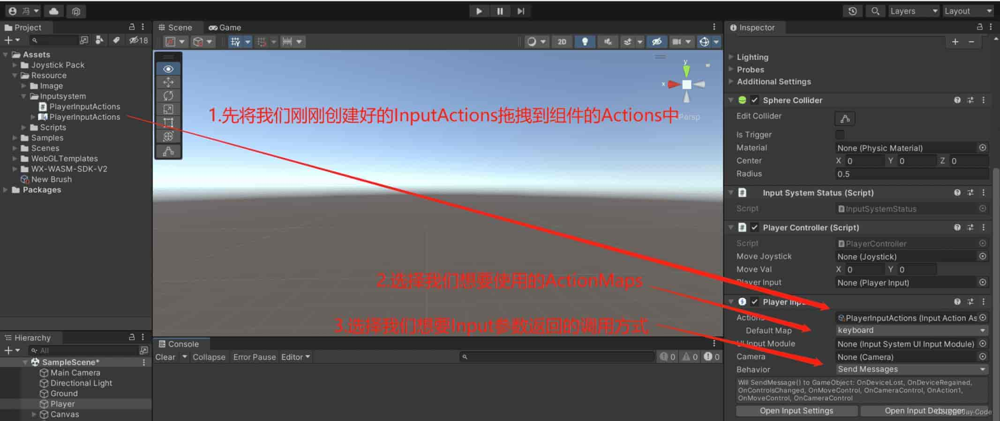

# 先看这些文章

- [【推荐先看】Unity Input System Step-By-Step 最简教程 | 三叔的数字花园](https://tuncle.blog/input_system_minimum_tutorial/index.html)
- [基础教程——Unity官方开发者社区](https://developer.unity.cn/projects/64ce58b4edbc2a10dd1e49b8)
- [Quickstart Guide | Input System | 1.10.0 (unity3d.com)](https://docs.unity3d.com/Packages/com.unity.inputsystem@1.10/manual/QuickStartGuide.html)
- [更好上手的Unity Input System教程_哔哩哔哩_bilibili](https://www.bilibili.com/video/BV1VCNdeSER3/)

# 摘抄：Unity Input System Step-By-Step 最简教程

## Overview

完整工程见：[xuejiaW/InputSystemSample: A minimum unity project to illustrate how to use Unity new input system. (github.com)](https://github.com/xuejiaW/InputSystemSample)

Unity 有内建的 `Input Manager` 机制，这一套机制存在了非常久的时间。针对于传统的键盘，鼠标等输入，内置的 `Input Manager` 可以健壮的处理，但 `Input Manager` 的可拓展性不高。也因此随着输入设备种类的增多（如各类 XR 设备），`Input Manager` 无法优雅的解决这些输入。

`Input System` 是 Unity 为了解决 `Input Manager` 的上述问题，提供的高可拓展性，高自由配置的新输入解决方案。

对于新工程，Unity 官方都推荐使用 `Input System` 作为输入的解决方案，但 `Input Manager` 并不会短期内被废弃，因为历史包袱过重 。
Input System 依赖 Unity 2019.1 及以上版本，以下基于 Unity 2022.3.15f1 + Input System 1.7 编写


### 安装 Input System

首先通过 Unity Package Manager 安装 Input System。在安装 Package 后，会自动弹出如下窗口，该窗口表示 `Input System` 启用后需要重启 Editor Backend 才能正常使用，点击 `Yes` 启用 Input System，此时 Unity Editor 会自动重启：

 

**启用 Input System**

当 Unity 重启后，根据 Unity 版本的不同，可能内置的 `Input Manager` 会被关闭，如果要重新启用，可以在 `Edit` -> `Project Settings` -> `Player` -> `Other Settings` -> `Active Input Handling` 中选择 `Both`来切换输入方式：
 

至此 Input System 已经被正确安装。

为方便后续的调试，Demo 工程中预先引入了 URP 和一个最简的测试场景，此时的工程的见：
 [xuejiaW/InputSystemSample at 7d04... (github.com)](https://github.com/xuejiaW/InputSystemSample/tree/7d041a5604c71096b0147cd0ae672557eee517c8)


### 创建 Input System SettingAssets

为了使用 Input System，推荐先创建 Settings Asset（非必需），你需要在 `Project Settings` -> `Input System Package` 中创建相关资源：


该 Settings Asset 作为 Input System 全局的配置，但其**并不是必需项**。如果未创建该文件 Unity 会使用默认的 Input System 配置。

当点击创建后，会在工程的根目录创建出一个 `InputSystem.inputsettings` 文件，该文件即是 Input System 的总配置文件。同时原 `Input System Package` 页面也会包含有一系列的针对于 `Input System` 的配置项：
 

Input System Settings


选择创建出来的 `InputSystem.inputsettings` 文件，在 Inspector 中会出现直接跳转到 `Input System Settings` 的按钮，点击该按钮，同样会跳转到上述 `Input System Settings` 的配置页面：
 

> 你可以随意修改 `InputSystem.inputsettings` 的位置，并不要求该文件必须在工程根目录下。
>

此时的工程状态见：
 [xuejiaW/InputSystemSample at 62a... (github.com)](https://github.com/xuejiaW/InputSystemSample/tree/62aff15fcf5c3479e5a3073af7646a6c2775e043)

### 查看 Input Debugger 窗口

你可以在 `Window -> Analysis -> Input Debugger` 中打开 Input Debugger 窗口，该窗口中可以显示当前连接的输入设备：
 

## 使用 Input System

### 创建 Input Action Asset

如场景中有如下小球，为了让其移动，可以为它添加一个 `Player Input` 组件，在 `Player Input` 组件上，选择 `Create Action` 创建出一个 Input Action 资源：
 

点击后，会需要你选择保存的路径，选择后，会在该路径下创建出一个 `Input Action` 资源（ `Input System.inputactions`），并自动打开该资源的配置窗口，窗口如下所示：
 

Input Action Window


创建出来的 Input Action Asset 资源如下所示，当点击该资源上的 `Edit asset` 按钮或双击该资源，都将打开上述的窗口：
 

↑↑ *Input Action Asset* ↑↑


具体查看 Input Action Asset 中的 Move Action，定义了键盘的 `WASD` 和 `上下左右` 触发：
 

此时按下 `WASD` 或 `上下左右`，会发现小球还 **不能** 移动，因为此时小球只是 *获取* 到了输入信息，但还是没有 *处理* 这些输入信息。

此时工程状态见：
 [xuejiaW/InputSystemSample at ed81... (github.com)](https://github.com/xuejiaW/InputSystemSample/tree/ed81be6f2efcf89c72f287240c9b56ea80a24094)


### 使用代码控制小球

为了处理 Input System 的输入信息，可以添加 `PlayerController` 脚本，其实现如下：

```c#
using UnityEngine;
using UnityEngine.InputSystem;

public class PlayerController : MonoBehaviour
{
    private Rigidbody m_Rb;
    private float m_MovementX;
    private float m_MovementY;
    [SerializeField] private float m_Speed = 5;

    private void Start() { m_Rb = GetComponent<Rigidbody>(); }

    private void OnMove(InputValue value)
    {
        var inputVector = value.Get<Vector2>();
        m_MovementX = inputVector.x;
        m_MovementY = inputVector.y;
    }

    private void FixedUpdate()
    {
        Vector3 movement = new(m_MovementX, 0.0f, m_MovementY);
        m_Rb.AddForce(movement * m_Speed);
    }
}
```

其中的 `OnMove` 对应 [创建 Input Action Asset](#创建 Input Action Asset) 后 Asset 中的 `Move` Action：
 

对于 Asset 中任意名称的 Action，都可以通过 `On<ActionName>` 监听到。
 如果 Action 叫做 `AAA`，则可以定义 `OnAAA` 函数监听。

将该脚本挂载在 `Player` 上，如下所示：
 

↑↑ *挂载 PlayerController* ↑↑

此时小球就可以通过键盘的 `WASD` 和 `上下左右` 移动。

此时的工程状态见：
 [xuejiaW/InputSystemSample at 9cb75b9a8719cc8e695ac32ad786adcc007494d8 (github.com)](https://github.com/xuejiaW/InputSystemSample/tree/9cb75b9a8719cc8e695ac32ad786adcc007494d8)

## 自定义 Action Asset

在之前 [创建 Input Action Asset](#创建 Input Action Asset) 步骤中，创建出来的 Input Actions 是 Unity 默认实现的，即适合于 `PlayerInput` 组件的 Actions 资源。

`PlayerInput` 组件也是 Unity 内建的读取 Assets 资源的脚本

在这一节，会自定义 Actions 资源，并自定义使用该 Actions 资源的脚本。

### 创建自定义 Action Asset

在 Project 面板中，空白处右键选择 `Create -> Input Actions`，创建出一个新的 Input Actions 资源：

双击创建的资源（本例中为 `BallControls.inputactions` ） 后会打开空白的 Input Actions 窗口：
 

此时点击画面左侧的 `+` 号可以创建出 Input Action Map，我们将新增的 Input Action Map 命名为 `BallPlayer`（图省略）

在窗口中间，可以为这个 Input Action Map 创建一些 Input Action，如下过程，创建了 `Buttons` 这个 Input Action（图省略）

在窗口的右侧，可以为 Input Action 创建一系列 Input Binding，如下步骤分别绑定了 `GamePad` 的 `East Button` 和 `West Button` （图省略）


> `GamePad` 的 `East` 和 `West` Button，在 Xbox 控制器上分别对应 `X` 键和 `B` 键

你也可以继续为 `Buttons` Action 绑定 Keyboard 的 `F1` 和 `F2` 按键，步骤如上，当绑定完成后，整个 `Buttons` Action 如下所示：
[

进一步创建 `Move` Input Action ，与 `Buttons` 不同是，`Move` 需要将 Action Type 设置为 `Value`，且 Control Type 为 `Vector2`，这表示 Action 会返回 `Vector2` 数据，即用于平面移动的上下左右数据：

如之前步骤一样，为该 `Move` Input Action 绑定 `Left Stick`，绑定后结果如下：


↑↑ *左摇杆* ↑↑


也可以将键盘上的按键通过 组合绑定（Composite Bindings） 至 `Move` Input Action，如下所示，其逻辑为使用四个按键分别表示 `Vector2` 四个方向（+x,−x,+y,−y+x,-x,+y,-y+x,−x,+y,−y）：


↑↑ *四按键组合绑定* ↑↑


分别为上下左右四个方向设定四个按键 `K,J,H,L`，结果如下所示：


↑↑ *绑定后的四个按键* ↑↑


至此，自定义的 Action Asset 创建完成，其中定义了使用 `GamePad` 和 `Keyboard` 两种输入设备，分别控制 `Buttons` 和 `Move` 两个 Action。将新建的 `BallControls.inputactions` 替换掉 `PlayerInput` 组件中的 Actions，即可使用新的 Action Asset：
 

↑↑ *使用新 Asset* ↑↑


此时运行游戏，可以发现通过手柄的左摇杆和 `HJKL` 都可以控制小球的移动，而 `WASD` 则不行了。

这是因为 `PlayerController` 脚本监听的 `Motion` 事件在 `BallControls.inputactions` 中也存在，因此我们定义的左摇杆和 `HJKL` 四个按键都能响应，即使不修改 `PlayerController` 也可以正常运行。而原 `PlayerInput.inputactions` 中的 `WASD` 我们并没有绑定，所以无法相应。

此时的工程状态见：
 [xuejiaW/InputSystemSample at 8d9... (github.com)](https://github.com/xuejiaW/InputSystemSample/tree/8d994e47fbf7c766c87aa62ce517e7e5bdda031b)


### 创建自定义 Player Input

PlayerInput是内置组件，只管解析inputactions文件以及接收输入信号，不管控制移动等行为。下面将演示如何一步一步用自定义脚本替代它。

#### 手动解析 Actions Asset

自定义一个 `BallController` 脚本，用于解析刚刚创建的 `BallControls.inputactions`，其实现如下：

```c#
public class BallController : MonoBehaviour
{
    [SerializeField] private float m_Speed = 10;
    [SerializeField] private InputActionAsset m_Asset = null;

    private Rigidbody m_Rb;
    private Vector2 m_Move;

    private InputActionMap m_ActionMap = null;
    private InputAction m_ButtonsAction = null;
    private InputAction m_MoveAction = null;

    private void Awake()
    {
        m_ActionMap = m_Asset.FindActionMap("BallPlayer");
        m_ButtonsAction = m_ActionMap.FindAction("Button");
        m_MoveAction = m_ActionMap.FindAction("Move");
        m_MoveAction.canceled += _ => OnMove(Vector2.zero);

        m_ButtonsAction.performed += _ => OnButton();
        m_MoveAction.performed += ctx => OnMove(ctx.ReadValue<Vector2>());

        m_Rb = GetComponent<Rigidbody>();
    }

    private void OnEnable() { m_ActionMap.Enable(); }

    private void OnButton() { Debug.Log("On Buttons clicked triggered"); }

    private void OnMove(Vector2 coordinates)
    {
        Debug.Log($"On move clicked triggered {coordinates.ToString("f4")}");
        m_Move = coordinates;
    }

    private void FixedUpdate()
    {
        Vector3 movement = new(m_Move.x, 0.0f, m_Move.y);
        m_Rb.AddForce(movement * m_Speed);
    }

    private void OnDisable() { m_ActionMap.Disable(); }
}
```

可以看到，该脚本直接引用了之前的 `InputActionAsset` ，并使用了 [InputActionAsset.FindActionMap](https://docs.unity3d.com/Packages/com.unity.inputsystem@1.7/api/UnityEngine.InputSystem.InputActionAsset.html#UnityEngine_InputSystem_InputActionAsset_FindActionMap_System_String_System_Boolean_) 找寻之前创建的 `BallPlayer`（Input Action Map），并在 `OnEnable` 和 `OnDisable` 时启用和禁用该 Input Action Map。

另外脚本中通过 [InputActionMap.FindAction](https://docs.unity3d.com/Packages/com.unity.inputsystem@1.7/api/UnityEngine.InputSystem.InputActionMap.html#UnityEngine_InputSystem_InputActionMap_FindAction_System_String_System_Boolean_) 找寻之前创建的 `Buttons` 和 `Move` Action，并监听了 Input Action 的 `performed` 事件，触发对应的回调函数 `OnButton` 和 `OnMove`。

**取代PlayerInput**

至此 `BallController` 脚本已经完全实现了之前 `PlayerInput` + `PlayerController` 的功能，因此在 `Player` 游戏物体上仅需要 `BallController` 脚本即可，注意要将之前创建的 `BallControls.inputactions` 挂载至脚本中：


此时小球可以如同之前一样的通过手柄和键盘控制移动。

此时工程状态见：
 [xuejiaW/InputSystemSample at f070... (github.com)](https://github.com/xuejiaW/InputSystemSample/tree/f070c14f0671d7c1c702b270f3751aed8c003692)

#### 基于 Actions Asset 自动生成对应类

在 [手动解析 Actions Asset](#手动解析 Actions Asset) 中需要手动管理 `Actions Asset` 并从中读取 Input Action Map 和 Input Action。

上述的读取过程，会随着 `Action Assets` 中的数据变更而出现潜在的失效（如命名错误），因此 Unity 提供了从 `Action Assets` 中自动创建相应脚本的能力，可以简化上述步骤。

可以选择 `Action Assets` 便选择，并勾选其中的 `Generate C# Class` ，选择需要创建的类名称，文件和命名空间，并点击 `Apply` 正式创建脚本：


此时会创建出对应的脚本：


↑↑ *Automated Create Script* ↑↑


修改之前的 `BallController` 脚本，以适配自动生成的 `BallControls`，如下：

```c#
using UnityEngine;

public class BallController_AutoScripts : MonoBehaviour
{
    [SerializeField] private float m_Speed = 10;

    private BallControls m_Controls;

    private Rigidbody m_Rb;
    private Vector2 m_Move;

    private void Awake()
    {
        m_Controls = new BallControls();
        m_Rb = GetComponent<Rigidbody>();

        m_Controls.BallPlayer.Button.performed += _ => OnButton();
        m_Controls.BallPlayer.Move.performed += ctx => OnMove(ctx.ReadValue<Vector2>());
        m_Controls.BallPlayer.Move.canceled += _ => OnMove(Vector2.zero);
    }

    private void OnEnable() { m_Controls.BallPlayer.Enable(); }

    private void OnButton() { Debug.Log("On Buttons clicked triggered"); }

    private void OnMove(Vector2 coordinates)
    {
        Debug.Log($"On move clicked triggered {coordinates.ToString("f4")}");
        m_Move = coordinates;
    }

    private void FixedUpdate()
    {
        Vector3 movement = new(m_Move.x, 0.0f, m_Move.y);
        m_Rb.AddForce(movement * m_Speed);
    }

    private void OnDisable() { m_Controls.BallPlayer.Disable(); }
}
```

此时不再需要手动获取 Input Action Map 和 Input Action，只需要使用 `<ActionControls>.<ActionMapName>.<Action>` 的风格直接访问即可。

此时将之前挂载在 `Player` 上的的 `BallController` 脚本换为 `BallController_AutoScripts` 脚本，并运行，可以看到效果与之前的效果无差别。

此时工程状态见：
 [xuejiaW/InputSystemSample at a92af1df6ccfb22f2747548d2abf1a08c43a3407 (github.com)](https://github.com/xuejiaW/InputSystemSample/tree/a92af1df6ccfb22f2747548d2abf1a08c43a3407)

# 摘抄：基础教程——Unity官方开发者社区

随着Unity的不断发展，开发者们对Unity的项目输入系统要求也越来越高，经常会有项目在做多平台适配和跨平台移植时对变更输入系统而感到烦恼。而InputSystem这款插件正是Unity官方为了解决广大开发者而推出的一款新的输入方式。

## 基础概念

### 前言

相较于旧版的InputManager，能更好**应对跨平台项目**。  [附视频教程](https://blog.csdn.net/JavaD0g/article/details/131027152)

## 基础操作

### 插件安装

`Package Manager` 的 `Unity Registry` 分类下，搜索 `InputSystem` 插件并安装。

### 如何创建InputActions

安装插件后，如果发现  `Project右键 > Creater > InputActions`，证明插件安装成功，点击创建扩展名为inputactions的文件，双击可打开编辑。

### InputActions概念及结构关系

结构关系为 ：

- InputSystem：插件
  - InputActions：文件
    - ActionMaps：大类，区分键盘手柄
      - Actions：子项，区分跑跳
        - Action Properties：细则

### ActionProperties 细则说明

在Actions中也有许多参数，其中ActionType则是我们最常用到。其概念为我们该动作输入映射的类型，有以下三种类型:

- Button 默认设置，包括按钮或者按键触发的一次性动作，适合攻击或者点击UI
- Value 提供一种连续状态变化事件，适合角色移动。如果设置了多个输入，就会切换到最主要的一个。
- Pass Through 和 Value 很相似，但它不会像Value一样（如果有多个输入时，会同时参考这些输入值）

 

在使用 Value 或者 Pass Through 时，你会看到一个额外的选项 Control Type 为该 Value 的返回值类型：

 

## 动作映射调用

### 官方PlayerInput组件调用

我们需要在场景中在我们需要的对象上添加PlayerInput组件，填入我们刚刚创建好的InputActions，选择想要使用的ActionMap输入映射集，再选择 Behavior 调用方式（有四种方式）



#### Send Message 方式

使用Send Message时，每次的触发会调用一个对应的函数（就是在对应的Actions名前面加个On-）正如下图所示在我们PlayerInput组件当中我们将BehaviorType选择Send Message后我们的输入参数将会通过Send Message方法发送到我们对应生成的函数中。比如Input Action 名为 Jump，那么对应的函数即为 OnJump


获取输入时的数据，我们可以写一个输入控制类，在该类中调用我们上述说到的Actions生成函数 可以通过isPressed获取设置了ActionType为Button类型的动作是否点击 可以通过Get 获取设置了ActionType为Value对应类型的数据

```csharp
public class PlayerController : MonoBehaviour
{
    void OnAction1(InputValue value)
    {
        bool isAction1Pressd = value.isPressed;
        Debug.Log(isAction1Pressd);
    }
    void OnMove(InputValue value)
    {
        Vector2 moveVal = value.Get<Vector2>();
        Debug.Log(moveVal );
    }
    void OnJump(InputValue value) 
    { 
        float triggerVal = value.Get<float>(); 
        Debug.Log(triggerVal );
    }
}
```

#### Broadcast Messages 方式

Broadcast Messages 与 send Message 很相似（但目前我还没有搞懂具体区别）

#### Invoke Unity Events 方式

区别于上述两种BehaviorType不同的是，在我们选择该方法后会出现Events的选项，我们需要自己写好动作方法后将其挂载到我们对应的ActionMaps中对应的ActionEvents上才能触发对应的动作事件。

 

定义参数为 `InputAction.CallbackContext` 类型的方法，即可获取我们对应输入返回（且加入该参数后会将其方法置顶如上图所示）

```csharp
public class PlayerController : MonoBehaviour
{
    public void moveControl(InputAction.CallbackContext value)
    {
        Vector2 moveVal = value.ReadValue<Vector2>();
        Debug.Log(moveVal);
    }
}
```

#### Invoke CSharp Events 方式

与Invoke Unity Events方式其实大致相同，需要我们自己先写好一个带有InputAction.CallbackContext类型入参的动作方法，不同的是我们挂载方式变成了脚本事件加载而不是在Unity界面上的可视化挂载

```csharp
using UnityEngine;
using UnityEngine.InputSystem;
public class CSharpEvent : MonoBehaviour
{
    public PlayerInput playerInput;
    void OnEnable()
    {
        playerInput.onActionTriggered += MyEventFunction;
    }
    void OnDisable()
    {
        playerInput.onActionTriggered -= MyEventFunction;
    }
    void MyEventFunction(InputAction.CallbackContext value)
    {
        Debug.Log(value.action.name + (" was triggered"));
    }
}
```

提示：在我自己尝试下发现上述四种的官方组件调用方式都只在输入发生时触发时发送一次输入返回，并不会持续发送，**所以不适合做移动，只适合做跳跃或UI点击**。

### 自定义脚本代替PlayerInput

基于上述提示，所以官方PlayerInput组件调用动作事件函数时并不能满足我们所有的场景需求（也可能是我在持续返回信号上没找到解决方案），所以我们还需要学习一下不借助官方PlayerInput组件的事件调用。我们直接在我们的脚本中调用InputSystem中的动作事件。

在我们使用脚本调用之前我们需要做一件事情，在我们创建好的InputActions属性面板中找到Generate C# Class并勾选,随后点击Apply生成对应的脚本，之后我们就可以在我们自己写的PlayerController 类中调用该脚本了

 

在此就不做过多的说明了，直接上代码（自己看注释理解）

```csharp
using UnityEngine;
using UnityEngine.InputSystem;
public class CSharpEvent : MonoBehaviour
{
    private PlayerInputActions playerInputActions;
    //将对应的ActionMaps中对应的Action进行传址引用
    public Vector2 keyboardMoveAxes => playerInputActions.keyboard.moveControl.ReadValue<Vector2>();

    void Awake() {
        //实例化InputActions脚本
        playerInputActions = new PlayerInputActions();
    }
    private void OnEnable(){
        //将要使用的ActionMap开启
        playerInputActions.keyboard.Enable();
    }
    private void OnDisable()
    {
        //上述同理
        playerInputActions.keyboard.Disable();
    }
    private void Update()
    {
        //在帧更新方法中调用所写的动作方法
        movePlayer();
    }
    private void movePlayer(){
        //因为要在Update方法中使用，需要需要先判断是否有输入对应的Input操作
        if(keyboardMoveAxes != Vector2.zero){
            //判断有输入后便执行对应方法
            Debug.Log(keyboardMoveAxes);
        }
    }
}
```

## 引用文献

- [Unity InputSystem官方使用手册](https://docs.unity3d.com/Packages/com.unity.inputsystem@1.4/manual/Installation.html)
- [Unity input system 使用记录（实例版）- 作者 : xkxsxkx](https://blog.csdn.net/qq_38836770/article/details/125240140)
- [Unity New Input System 作者 : 小虫儿飞到花丛中](https://blog.csdn.net/weixin_44542069/article/details/124122792)
- [B站视频版教学](https://space.bilibili.com/347855339/channel/collectiondetail?sid=1434940)
- [InputSystem进阶：实现角色移动跳跃](https://blog.csdn.net/JavaD0g/article/details/131217718)


# Unity 6 中 `.inputsettings` 文件的行为

我用Unity6新工程验证了一下，.inputsstings文件依然有用，但不是初始自动生成的，初始就是一个inputactions文件。unity会检测项目内所有的.inputsettings文件，如果一个都没检测到，playerSettings会显示一个按钮，点击按钮会创建第一个inputsettings文件。当我手动复制出多个inputsettings文件，那些后出现的inputsettings文件的inspector属性面板会提示当前未在使用，可以点击切换成当前使用的。

------

## 如何使用多个`.inputsettings`文件

根据验证结果，以下是如何使用多个`.inputsettings`文件的建议：

1. **创建多个配置文件**：

   - 复制现有的`.inputsettings`文件，重命名并根据需要修改配置。
   - 例如，可以创建一个`PC.inputsettings`和一个`Mobile.inputsettings`。

2. **切换配置文件**：

   - 在Unity Editor中，选择需要使用的`.inputsettings`文件，然后在Inspector面板中点击“切换”按钮。

   - 在运行时，也可以通过代码动态切换：

     ```c#
     InputSystem.settings = customInputSettings; // customInputSettings 是你的 .inputsettings 文件
     ```

3. **为不同平台配置**：

   - 在`Player Settings`中，结合`Platform Settings`和不同的`.inputsettings`文件，为不同平台定制输入行为。

------

## 总结

- Unity 6中，`.inputsettings`文件仍然有用，但不会在初始状态下自动生成。
- 你可以手动创建多个`.inputsettings`文件，并通过Inspector面板或代码切换使用。
- 这种设计提供了更高的灵活性和可管理性，特别适合需要多套输入配置的项目。