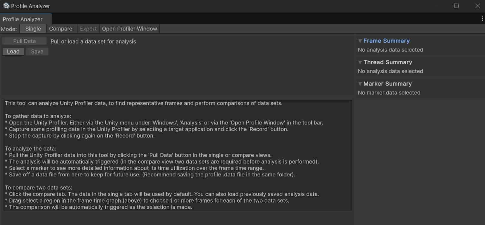

虽然随Unity下载的官方文档（[Unity - Manual: Unity Profiler](file:///D:/6000.0.40f1/Editor/Data/Documentation/en/Manual/Profiler.html)）中也有关于性能调试工具的介绍，但是最直接快速的学习方式还是上油管：

油管教学：[Boosting your game performance with Unity 6 Profiling tools | Unite 2024](https://www.youtube.com/watch?v=_cV1B2hqXGI)

除了默认自带的Profiler，最好把另两个Package装上：Profile Analyzer、Memory Profiler

## Profile窗口

官方文档：[Unity Profiling Core API（默认自带，被Entities和MemoryProfiler依赖） | 1.0.2](https://docs.unity3d.com/Packages/com.unity.profiling.core@1.0/manual/profilermarker-guide.html)

## Profile Analyzer窗口

 官方文档：[About the Profile Analyzer package | Profile Analyzer | 1.2.3](https://docs.unity3d.com/Packages/com.unity.performance.profile-analyzer@1.2/manual/index.html)

其中的说明文字翻译如下：

> 这个工具可以分析Unity Profiler的数据，以找到具有代表性的帧并进行数据集的比较。
>
> **收集数据以进行分析：**
>
> - 打开Unity Profiler。可以通过Unity菜单中的“Windows” -> “Analysis”打开，或者通过工具栏中的“Open Profile Window”打开。
> - 在Unity Profiler中选择一个目标应用程序，并点击“Record”按钮以捕获一些分析数据。
> - 再次点击“Record”按钮以停止捕获。
>
> **分析数据：**
>
> - 通过点击单视图或比较视图中的“Pull Data”按钮，将Unity Profiler的数据导入到此工具中。
> - 分析将自动触发（在比较视图中，需要两个数据集才能进行分析）。
> - 选择一个标记以查看其在帧时间范围内的详细时间利用信息。
> - 从这里保存数据文件以备将来使用。（建议将.profile.data文件保存在同一文件夹中）。
>
> **比较两个数据集：**
>
> - 点击比较选项卡。默认情况下，单视图中的数据将被使用。你也可以加载之前保存的分析数据。
> - 在帧时间图（上方）中拖动选择一个区域，为两个数据集各选择1个或多个帧。
> - 选择完成后，比较将自动触发。

## Memory Profiler窗口

官方文档：[Memory Profiler | Memory Profiler | 1.1.5](https://docs.unity3d.com/Packages/com.unity.memoryprofiler@1.1/manual/index.html)

文档首页翻译：

> Memory Profiler 是一款工具，可用于检查 Unity 应用程序和 Unity Editor 的内存使用情况。该包为 Unity Editor 添加了一个 Memory Profiler 窗口，您可以使用它来捕获、检查和比较内存快照。快照是 Memory Profiler 捕获快照时应用程序内存使用情况的记录。
>
> **Memory Profiler 窗口**
> Memory Profiler 窗口还提供了对原生内存和托管内存分配的概览，以评估应用程序的内存使用情况并识别潜在问题，例如内存泄漏。
>
> 该包是对内置 Memory Profiler 模块的补充，后者提供了随时间变化的高级内存使用信息。Memory Profiler 包旨在提供应用程序在特定时刻内存分配的更详细信息。
>
> ------
>
> ### **安装 Memory Profiler**
>
> 您可以使用包注册表列表安装该包，或者在通过名称添加注册表包时使用 `com.unity.memoryprofiler` 名称。
>
> 您还可以使用以下链接直接打开 Unity Editor 并通过包管理器安装 Memory Profiler：[打开 Unity Editor 并安装 Memory Profiler](https://unity3d.com/unity/qa/packages)。
>
> ------
>
> ### **要求**
>
> 当您安装 Memory Profiler 包时，Unity 会自动安装 Editor Coroutines 包作为依赖项。
>
> ------
>
> ### **共享快照时的数据注意事项**
>
> 使用 Memory Profiler UI 或 Memory Profiler API 捕获的内存快照包含您正在捕获的 Player 或 Editor 实例的托管堆的全部内容。
>
> 您可以通过 Memory Profiler UI 查看大部分数据，但以下情况除外：没有垃圾回收句柄的托管分配。这些分配可能与 Mono 类型数据相关，或者与垃圾回收器已经回收并释放但内存部分尚未被新数据覆盖的分配相关。后者发生的原因是，出于性能考虑，垃圾回收的内存不会被“覆盖”。
>
> 您可以在“All Managed Objects”视图等区域中浏览的数据类型，可以让您了解内存快照中可能包含的数据类型。Memory Profiler 包括类的任何对象实例、该对象的所有字段以及类的静态变量（不包括常量值，如 `const` 值）。
>
> Memory Profiler 根据数据类型存储字段：
>
> - 它按值存储值类型。
> - 它按指针地址存储引用类型。UI 会将任何指针地址解析为指向对象的链接。
>
> 例如，字符串类型的字段可能会通过其名称指示它们指向的字符串的含义。因此，搜索名为“Password”、“Credentials”或“Token”的字段可能会识别包含敏感数据的字符串。如果 Unity 已经垃圾回收了指向字符串的对象，甚至字符串本身，数据可能仍然存在。然而，除非您对要查找的内容有大致了解或部分字符串值可供搜索，否则这些数据不再容易识别。
>
> **注意**：上一节仅提到字符串数据可能存在问题，但此问题不仅限于字符串，也可能以其他形式发生，例如字段或类型名称。
>
> 一种在团队外部共享快照文件时防止意外泄露个人身份信息、凭据或类似机密数据的方法是将这些数据放入常量字段中。常量字段会将这些数据烘焙到二进制可执行文件中，而 Memory Profiler 不会捕获这些数据。然而，二进制可执行文件可能会被用户反编译，从而暴露这些数据。
>
> 您只能在开发版本的 Player 中捕获内存快照，因此在发布版本中这些字段可能是非常量字段，这会增加获取数据的难度，但并非完全不可能。
>
> 如果您对此主题有进一步疑问，请使用 [Unity 论坛帖子](https://forum.unity.com/) 讨论此问题。
>
> ------
>
> ### **其他资源**
>
> - [Profiler 概述](https://docs.unity3d.com/Manual/Profiler.html) - 关于如何使用 Unity 内置 Profiler 的文档。
> - [Unity 游戏性能分析的终极指南](https://unity.com/how-to/ultimate-guide-profiling-unity-games) - 描述如何分析应用程序的指南，包括最佳实践、推荐工作流程和建议。