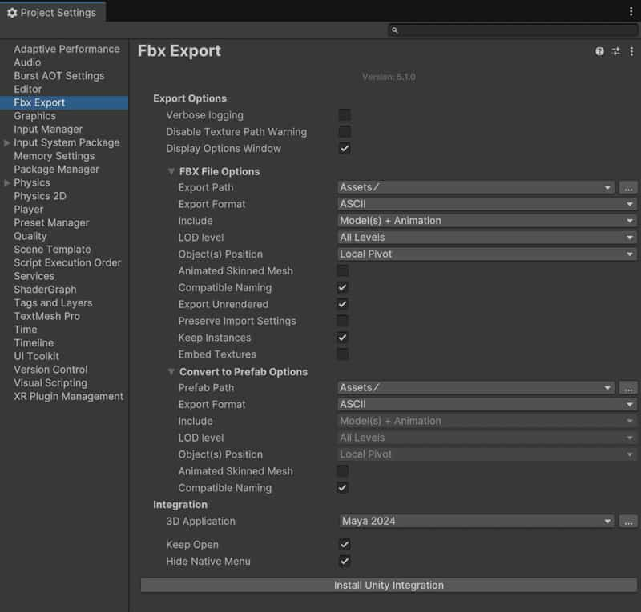

# FBX Exporter

## 简介

[官网 |5.1.2](https://docs.unity3d.com/Packages/com.unity.formats.fbx@5.1/manual/index.html)

这是一个PackageManager插件，在Unity Registry分类，维护跨度从2018年到2020年5.1版本，之后停更（猜测是和Autodesk公司合作的，所以和Autodesk系的建模软件如Maya集成度更高，但基础的功能适用于所有建模软件）。FBX Exporter 包支持 Unity 和 3D 建模软件之间的往返工作流程。将几何体、灯光、摄像机和动画从 Unity 发送到 Autodesk® Maya®、Autodesk® Maya LT™ 或 Autodesk® 3ds Max®，然后再次发送回 Unity，只需最少的工作量即可完成。

## 包依赖关系

依赖两个包：com.autodesk.fbx 和 Timeline
未被其他包依赖

## 将模型和动画导出到 FBX

将游戏对象从 Hierarchy 导出到 FBX，或从 Timeline 导出动画剪辑。

| 部分                                                         | 描述                                                         |
| :----------------------------------------------------------- | :----------------------------------------------------------- |
| [将游戏对象导出到 FBX](https://docs.unity3d.com/Packages/com.unity.formats.fbx@5.1/manual/export-gameobjects.html) | 将几何体、动画、光源和摄像机导出为 FBX 文件，以便您可以将数据传输到任何 3D 建模软件。 |
| [将Timeline时间轴剪辑导出到 FBX](https://docs.unity3d.com/Packages/com.unity.formats.fbx@5.1/manual/export-timeline-clip.html) | 将动画剪辑从时间轴导出到 FBX 文件。                          |
| [Export Options 窗口](https://docs.unity3d.com/Packages/com.unity.formats.fbx@5.1/manual/ref-export-options.html) | 获取将游戏对象或动画剪辑导出到 FBX 时显示的 Export Options 窗口中所有可用设置的描述。 |

## 在 Play 模式下录制 FBX 动画

除了 FBX Exporter 包之外，还可以使用 [Recorder](https://docs.unity3d.com/Packages/com.unity.recorder@latest) 包（版本 4.0.0 或更高版本），以在 Play 模式下录制游戏对象的动画，并将其导出为 FBX 动画。

| 部分                                                         | 描述                                                         |
| :----------------------------------------------------------- | :----------------------------------------------------------- |
| [通过 Recorder 窗口录制 FBX 动画](https://docs.unity3d.com/Packages/com.unity.formats.fbx@5.1/manual/record-in-play-mode-recorder-window.html) | 在 Play 模式下，使用 Recorder 窗口在任意时间或帧间隔内将游戏对象的动画录制到 FBX。 |
| [通过 Timeline Recorder Track 录制 FBX 动画](https://docs.unity3d.com/Packages/com.unity.formats.fbx@5.1/manual/record-in-play-mode-recorder-clip.html) | 在 Timeline Recorder Track 中设置一个或多个 Recorder 剪辑，以激活在 Play 模式下以特定时间或帧间隔将游戏对象的动画录制到 FBX。 |
| [FBX 记录器属性](https://docs.unity3d.com/Packages/com.unity.formats.fbx@5.1/manual/ref-recorder-properties.html) | 通过 Recorder 窗口或 Timeline 中的 Recorder 剪辑，获取在 Play 模式下录制 FBX 动画时所有可用属性的描述。 |

## 使用 FBX 预制件变体

根据 FBX 文件轻松将游戏对象和预制件资源转换为预制件变体，以便在 Unity 和 3D 建模应用程序之间实现便捷的 FBX 模型工作流程。

| 部分                                                         | 描述                                                         |
| :----------------------------------------------------------- | :----------------------------------------------------------- |
| [FBX 文件和预制件变体](https://docs.unity3d.com/Packages/com.unity.formats.fbx@5.1/manual/prefab-variants-concepts.html) | 查看有关 FBX 文件、模型预制件和预制件变体的 Unity 核心概念。 |
| [FBX 预制件变体工作流程](https://docs.unity3d.com/Packages/com.unity.formats.fbx@5.1/manual/prefab-variants-workflow.html) | 了解使用基于 FBX 文件的预制件变体的好处和限制。              |
| [将游戏对象转换为 FBX 预制件变体](https://docs.unity3d.com/Packages/com.unity.formats.fbx@5.1/manual/prefab-variants-convert-gameobject.html) | 将游戏对象及其子项转换为基于 FBX 模型的预制件变体。          |
| [将预制件资源转换为 FBX 预制件变体](https://docs.unity3d.com/Packages/com.unity.formats.fbx@5.1/manual/prefab-variants-convert-prefab-asset.html) | 将预制件资源文件转换为基于 FBX 模型的预制件变体。            |
| [基于现有 FBX 模型创建预制件变体](https://docs.unity3d.com/Packages/com.unity.formats.fbx@5.1/manual/prefab-variants-create-from-model-prefab.html) | 基于现有 FBX 模型预制件创建预制件变体，而无需执行 FBX 重新导出。 |
| [Convert Options 窗口](https://docs.unity3d.com/Packages/com.unity.formats.fbx@5.1/manual/ref-convert-options.html) | 获取 Convert Options （转换选项） 窗口中所有可用设置的描述，该窗口在执行转换为 FBX 预制件变体时显示。 |

## 将 Unity 与 3D 建模软件集成

使用 **Autodesk® Maya®**、**Autodesk® Maya LT™** 或 **Autodesk® 3ds Max®** 中的 Unity 集成工具，可以直接将 FBX 文件导入和导出 Unity，而无需指定文件名、选择对象或设置 FBX 导入器或导出器设置。

| 部分                                                         | 描述                                                         |
| :----------------------------------------------------------- | :----------------------------------------------------------- |
| [为您的 3D 建模应用程序设置 Unity 集成](https://docs.unity3d.com/Packages/com.unity.formats.fbx@5.1/manual/integration-setup.html) | 设置 Unity Editor 与 Autodesk® Maya®、Autodesk® Maya LT™ 或 Autodesk® 3ds Max® 的集成。 |
| [在 Maya 中使用 Unity 集成工具](https://docs.unity3d.com/Packages/com.unity.formats.fbx@5.1/manual/integration-maya-roundtrip.html) | 在 Maya 中工作，从 Unity 项目导入 FBX 文件，并在编辑后重新导出它们。 |
| [在 Maya 中管理导出集](https://docs.unity3d.com/Packages/com.unity.formats.fbx@5.1/manual/integration-maya-manage-export-sets.html) | Create Export Sets （创建导出集） 以导出不属于现有 Export Set 的 Maya 对象。编辑现有导出集的导出选项。 |
| [在 3ds Max 中使用 Unity 集成工具](https://docs.unity3d.com/Packages/com.unity.formats.fbx@5.1/manual/integration-3ds-max-roundtrip.html) | 在 3ds Max 中工作，从 Unity 项目导入 FBX 文件，并在编辑后重新导出它们。 |
| [管理要从 3ds Max 导出的对象](https://docs.unity3d.com/Packages/com.unity.formats.fbx@5.1/manual/integration-3ds-max-manage-objects-to-export.html) | 管理要在选择集中导出的 3ds Max 对象列表。                    |

## FBX 导出项目设置

使用 FBX 导出项目设置可以：

- 管理导出到 FBX 或转换为 Model Prefab Variant 时选项窗口的显示。
- 更改 FBX File export （FBX 文件导出） 和 Model Prefab Variant conversion （模型预制件变体转换） 的默认选项值。
- 安装适用于 Autodesk® Maya®、Autodesk® Maya LT™ 或 Autodesk® 3ds Max® 的 [Unity 集成](https://docs.unity3d.com/Packages/com.unity.formats.fbx@5.1/manual/integration.html)，并管理相关的集成设置。

 

### 导出选项

| 属性                             | 功能                                                         |
| :------------------------------- | :----------------------------------------------------------- |
| **Verbose logging**              | 启用此选项可在控制台中获取更多调试消息。                     |
| **Disable Texture Path Warning** | 启用此选项可禁止显示特定控制台消息，当导出包含对纹理文件的引用时，该消息会警告导出的 FBX 文件中存在任何绝对路径。  此警告通知用户此类绝对路径可能包含不应共享的敏感信息，并允许他们在必要时采取纠正措施。 |
| **Display Options Window**       | 启用此选项后，当您分别选择 **Export To FBX** 或 **Convert To FBX Prefab Variant** 菜单操作时，先显示 **Export Options** 或 **Convert Options** 窗口，然后再让 FBX 导出器继续。  如果禁用此选项，FBX 导出器将直接转换或导出，而无需询问。它使用您指定的最后一个路径和基于所选游戏对象名称的文件名。 |

### FBX 文件选项

管理 [Export Options 窗口](https://docs.unity3d.com/Packages/com.unity.formats.fbx@5.1/manual/ref-export-options.html)的默认值。

| 属性                         |            | 功能                                                         |
| :--------------------------- | :--------- | :----------------------------------------------------------- |
| **Export Path**              |            | 默认情况下用于保存导出的 FBX 文件的位置。                    |
| **Export Format**            |            | 默认使用的 FBX 文件格式：**ASCII** 或 **Binary**。           |
| **Include**                  |            | 默认情况下用于导出的范围：**Model（s） Only**、**Animation Only** 或 **Model（s） + Animation**。 |
| **LOD level**                |            | 对于细节级别 （LOD） 组，默认用于导出的细节级别：**所有级别**、**最高**或**最低**。  **注意：** • FBX 导出器会忽略选定层次结构之外的 LOD。 • FBX 导出器不会过滤掉用作 LOD 的游戏对象，如果它们不是各自 LOD 组的直接后代，则不会导出它们。 |
| **Object(s) Position**       |            | 默认情况下用于要导出的游戏对象的位置引用。                   |
|                              | 本地枢轴   | 将所选游戏对象或游戏对象组的变换重置为 World center。  如果选择多个游戏对象进行导出，则 FBX 导出器会将这些游戏对象以共享根为中心，并保持其相对位置不变。 |
|                              | 世界绝对值 | 在导出过程中保持世界变换不变。                               |
| **Animated Skinned Mesh**    |            | 启用此选项可导出具有蒙皮网格的游戏对象上的动画。  如果禁用此选项，则 FBX 导出器不会导出蒙皮网格上的动画。 |
| **Compatible Naming**        |            | 启用此选项可使 FBX 导出器在导出时根据特定的[字符替换规则](https://docs.unity3d.com/Packages/com.unity.formats.fbx@5.1/manual/features-behaviors-compatible-naming.html).  这可确保与 Autodesk® Maya® 和 Autodesk® Maya LT™ 的命名兼容，以避免 Unity 与这些软件之间的意外名称更改。 |
| **Export Unrendered**        |            | 启用此选项可导出没有渲染器组件或已禁用渲染器组件的网格。  例如，用作 Mesh collider （网格碰撞器） 的简化网格。 |
| **Preserve Import Settings** |            | 启用此选项可保留应用于在导出过程中被覆盖的现有 FBX 文件的所有导入设置。 如果将游戏对象导出为新的 FBX 文件，则 FBX 导出器不会沿用导入设置。 |
| **Keep Instances**           |            | 启用此选项可将同一网格的多个副本导出为实例。 如果未选中，FBX 导出器会将所有网格导出为唯一网格。 |
| **Embed Textures**           |            | 启用此选项可在导出的 FBX 中嵌入纹理。                        |

### Convert to Prefab 选项

管理 [Convert Options 窗口](https://docs.unity3d.com/Packages/com.unity.formats.fbx@5.1/manual/ref-convert-options.html)的默认值。

| 属性                      | 功能                                                         |
| :------------------------ | :----------------------------------------------------------- |
| **Prefab Path**           | 默认情况下用于保存 FBX 预制件变体文件的位置。                |
| **Export Format**         | 默认使用的 FBX 文件格式：**ASCII** 或 **Binary**。           |
| **Include**               | **Convert to FBX Prefab Variant** 始终会同时导出层次结构中的 Models 和 Animation。 |
| **LOD level**             | **Convert to FBX Prefab Variant** 始终导出 LOD 组层次结构中可用的所有细节级别 （LOD）。 |
| **Object(s) Position**    | **Convert to FBX Prefab Variant** 始终在导出期间重置根游戏对象的变换。但是，预制件会保留根游戏对象的全局转换。 |
| **Animated Skinned Mesh** | 启用此选项可导出具有蒙皮网格的游戏对象上的动画。  如果禁用此选项，则 FBX 导出器不会导出蒙皮网格上的动画。 |
| **Compatible Naming**     | 启用此选项可使 FBX 导出器在转换时根据特定[字符替换规则](https://docs.unity3d.com/Packages/com.unity.formats.fbx@5.1/manual/features-behaviors-compatible-naming.html).  这可确保与 Autodesk® Maya® 和 Autodesk® Maya LT™ 的命名兼容，以避免 Unity 与这些软件之间的意外名称更改。 |

### 集成

| 属性                          | 功能                                                         |
| :---------------------------- | :----------------------------------------------------------- |
| **3D Application**            | 要与 Unity 集成的 3D 建模软件。可用选项取决于您计算机上已安装的软件，其中包括[FBX 导出器当前支持的 FBX 导出器](https://docs.unity3d.com/Packages/com.unity.formats.fbx@5.1/manual/installation.html).  如果您将 3D 建模软件安装在非标准位置，请使用 **[...]**（浏览）按钮选择 3D 建模软件。 |
| **Keep Open**                 | 启用此选项可在安装所选 3D 建模软件后保持打开状态。           |
| **Hide Native Menu**          | 启用此选项可隐藏 Autodesk® Maya® 和 Autodesk® Maya LT™ 中的本机 **Send to Unity** 菜单。 |
| **Install Unity Integration** | 选择此按钮进行安装[Unity 集成](https://docs.unity3d.com/Packages/com.unity.formats.fbx@5.1/manual/integration.html)对于选定的 **3D 应用程序**。 |

## 已知问题和限制

### 局限性

- FBX Exporter 包不支持导出文件。`.asset`
- 动画蒙皮网格的绑定姿势在导出时丢失。例如，如果从 Unity 导出动画蒙皮网格并将其导入 Autodesk® Maya® 和 Autodesk® Maya LT™，则无法使用 **Rigging** > **Skin** > **Go to Bind Pose** 命令将角色设置为绑定姿势。
- FBX Exporter 包在转换 Model 实例时忽略名称或路径更改。
- FBX 导出器软件包不支持仅从 Autodesk® Maya® 和 Maya LT™导出动画灯光和摄像机的动画。
- 导出空网格（sharedMesh 为空的 MeshFilter）无法导出，并显示 ArgumentNullException。
- 与 Autodesk® Maya® 和 Autodesk® 3ds Max® 的集成在 Linux 上不可用。

### Animated Skinned Mesh 上的蒙皮不正确

如果已设置动画的蒙皮网格未使用正确的蒙皮导出，则可能是因为它们在导出时未处于绑定姿势。

在导出动画蒙皮网格之前，请确保：

- 蒙皮网格动画未在 Timeline 窗口的 Animation 中预览，因为这可能会导致导出问题。

- 原始 Rig 的 FBX 不包含动画。

  **注意**：目前无法在 Unity 中修复此问题。您需要先在单独的建模软件（如 Autodesk® Maya®）中将动画与 Rig 分开。

### 使用 UI 组件转换游戏对象

使用 UI 组件（例如 **RectTransform**）转换层次结构会破坏 UI。

要解决此问题，请执行以下操作：

1. 准备层次结构，以便在转换之前没有带有 UI 元素的游戏对象。
2. 然后，将 UI 元素添加到 FBX 链接的预制件中。

### 覆盖 FBX 文件

如果您有 FBX 模型的 Variant，请避免将 Variant 导出到 FBX 文件;否则，您的更改可能会在导出后应用两次。例如，如果您的 Variant 添加了一个对象，那么在导出后，您将拥有该对象的两个副本：您刚刚导出的新 FBX 模型中的一个，以及您之前添加到 Variant 中的一个。

### 树基元在转换后不再可编辑

转换Tree primitive（树基元）将使 Tree 成为只读的。

为避免这种情况，请确保在完成编辑后仅转换 Tree。否则，撤消转换以返回到 Tree 可编辑的先前状态。

### 轨迹和线条粒子在转换后丢失材质

如果在转换尾迹或线条粒子时丢失了材质，则需要在转换后将材质重新应用于 FBX 预制件变体。

### 卸载 FBX Exporter 会破坏 Unity Recorder

如果要卸载 FBX Exporter 包，但仍需要使用 Unity Recorder，请确保首先删除可能已添加到 Recorder List 或 Timeline Recorder Track 中的所有现有 FBX 记录器：

- 在 Recorder 窗口中：右键单击 Recorder List（位于窗口左侧）中列出的任何 FBX Recorder，然后选择 **Delete**。
- 在项目的任何时间轴中：查找 Recorder Tracks，右键单击任何使用 FBX Recorder 的 Recorder Clip，然后选择 **Delete**，或者以相同的方式删除 Recorder Track。

如果您已经卸载了 FBX Exporter 包，并且遇到了 Unity Recorder 问题：

1. 重新安装 FBX Exporter 包。
2. 查找并删除所有 FBX 记录器实例（请参阅上文）。
3. 从 Package Manager 中卸载 FBX 导出器。

### 仅从 Maya 导出摄影机动画会导致不正确的摄影机旋转

使用 Unity FBX 导出器 Maya 插件通过 **File > Unity > Export Animation Only** 菜单选项导出摄像机动画时， 生成的导出相机动画可能不正确。

这样做的原因是，使用 **Export Animation Only** 菜单选项将仅导出变换动画，而不导出摄像机或其动画属性。

此问题的解决方法是使用 **File > Unity > Export** 菜单选项导出摄像机，该选项将导出摄像机及其动画。