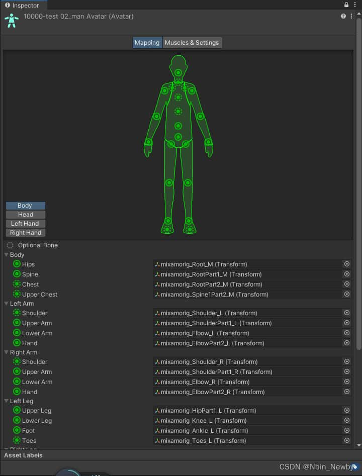
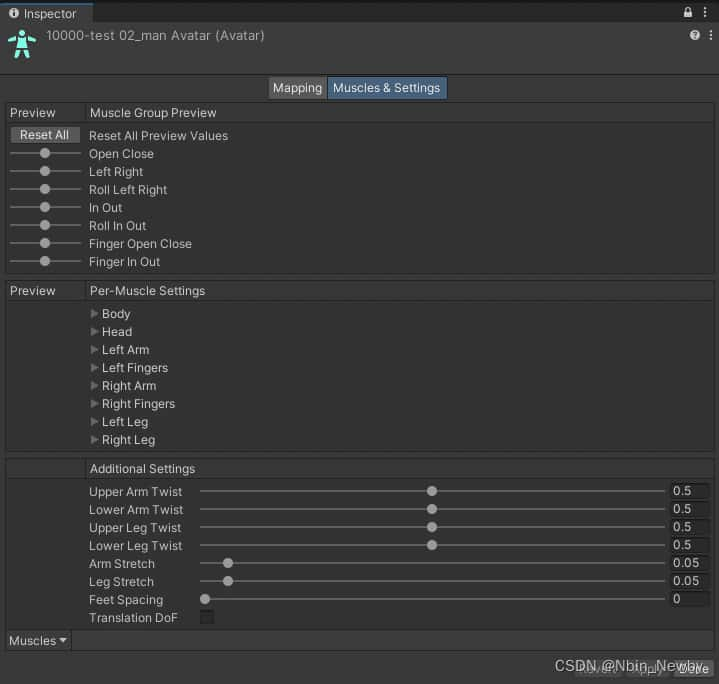

全文摘自：[Unity动态创建Avatar骨骼映射_unity avatar-CSDN博客](https://blog.csdn.net/Nbin_Newby/article/details/128045244)

另附官方文档：[导入人形动画 - Unity 手册](https://docs.unity.cn/cn/2018.4/Manual/ConfiguringtheAvatar.html)

# 前言

为了让单个动画可以通用于多个不同的人型模型上，Unity官方开发了一套骨骼重定向系统，把不同人型模型的骨骼映射到一套通用的骨骼映射上，然后再让动画去驱动这个通用的骨骼映射，从而实现驱动不同的模型。不过目前只支持人型模型，只需要把模型导入到Unity，就能自动生成骨骼映射（在Unity里是一个Avatar文件）。但是，并不是所有的模型格式导入到Unity都能自动生成这个Avatar，例如Glb/Gltf格式。为了让这些格式的模型也能支持通用的动画，通常需要放到一些建模软件里进行操作再导出为Fbx格式，这个过程是复杂且痛苦的。还有一种更无可奈可的情况是：完整人型模型是由各个模型在运行时动态组装生成的，并没有一个完整的模型可以导入建模软件进行操作。因此，我们应该寻找一种方式，使其可以在Unity运行阶段创建Avatar的骨骼映射。

# 了解Avatar骨骼映射

为了动态去创建这个Avatar文件，我们首先需要了解它包含了哪些内容，我们打开一个Unity已经创建好的Avatar：


可以看到，这个文件主要保存的是骨骼的映射关系。上面的人体里的每一个圆点代表着一个关节点，Optional Bone下面左边那一列就是Unity里设定好的关节点的名称，它们在每个Avatar文件里都是一样的，而右边部分就是当前这个模型的骨骼节点，Unity已经帮我们映射好了它们与通用人型骨骼的对应关系。当我们把这个Avatar映射文件赋值给Animator后，Animator就会去驱动固定的那些骨骼信息点，而这些固定的骨骼信息点就会去根据它们和模型真实骨骼的映射关系找到真正需要驱动的骨骼点，从而对其进行驱动，最终整个模型就动起来了。

# 动态创建Avatar骨骼映射

##  寻找相关API

由于通常情况下模型导入时unity就能帮我们创建好这个Avatar映射，我们根本就没真正接触这个过程，因此首先需要去查询官方是否有开放相关接口。幸运的是，确实有相关的接口，官方API描述如下：

**[AvatarBuilder](https://docs.unity3d.com/ScriptReference/AvatarBuilder.html).BuildHumanAvatar**

**Declaration**

public static [Avatar](https://docs.unity3d.com/ScriptReference/Avatar.html) **BuildHumanAvatar**([GameObject](https://docs.unity3d.com/ScriptReference/GameObject.html) **go**, [HumanDescription](https://docs.unity3d.com/ScriptReference/HumanDescription.html) **humanDescription**);

**Parameters**

| go               | Root object of your transform hierachy. It must be the top most gameobject when you create the avatar. |
| ---------------- | ------------------------------------------------------------ |
| humanDescription | Humanoid description of the avatar.                          |

**Returns**

**Avatar** Returns the Avatar, you must always always check the avatar is valid before using it with [Avatar.isValid](https://docs.unity3d.com/ScriptReference/Avatar-isValid.html).

**Description**

Create a humanoid avatar.

The avatar is created using the supplied HumanDescription object which specifies the muscle space range limits and retargeting parameters like arm/leg twist and arm/leg stretch. Additional resources: [HumanDescription](https://docs.unity3d.com/ScriptReference/HumanDescription.html).

从API中我们可以得知，使用它需要传入两个参数，第一个参数好理解，就是我们当前这个模型本身，第二个参数是个描述数据，我们再看看它的定义：

**HumanDescription**

struct in UnityEngine
Implemented in:[UnityEngine.AnimationModule](https://docs.unity3d.com/ScriptReference/UnityEngine.AnimationModule.html)

**Description**

Class that holds humanoid avatar parameters to pass to the [AvatarBuilder.BuildHumanAvatar](https://docs.unity3d.com/ScriptReference/AvatarBuilder.BuildHumanAvatar.html) function.

**Properties**

| [armStretch](https://docs.unity3d.com/ScriptReference/HumanDescription-armStretch.html) | Amount by which the arm's length is allowed to stretch when using IK. |
| ------------------------------------------------------------ | ------------------------------------------------------------ |
| [feetSpacing](https://docs.unity3d.com/ScriptReference/HumanDescription-feetSpacing.html) | Modification to the minimum distance between the feet of a humanoid model. |
| [hasTranslationDoF](https://docs.unity3d.com/ScriptReference/HumanDescription-hasTranslationDoF.html) | True for any human that has a translation Degree of Freedom (DoF). It is set to false by default. |
| [human](https://docs.unity3d.com/ScriptReference/HumanDescription-human.html) | Mapping between Mecanim bone names and bone names in the rig. |
| [legStretch](https://docs.unity3d.com/ScriptReference/HumanDescription-legStretch.html) | Amount by which the leg's length is allowed to stretch when using IK. |
| [lowerArmTwist](https://docs.unity3d.com/ScriptReference/HumanDescription-lowerArmTwist.html) | Defines how the lower arm's roll/twisting is distributed between the elbow and wrist joints. |
| [lowerLegTwist](https://docs.unity3d.com/ScriptReference/HumanDescription-lowerLegTwist.html) | Defines how the lower leg's roll/twisting is distributed between the knee and ankle. |
| [skeleton](https://docs.unity3d.com/ScriptReference/HumanDescription-skeleton.html) | List of bone Transforms to include in the model.             |
| [upperArmTwist](https://docs.unity3d.com/ScriptReference/HumanDescription-upperArmTwist.html) | Defines how the upper arm's roll/twisting is distributed between the shoulder and elbow joints. |
| [upperLegTwist](https://docs.unity3d.com/ScriptReference/HumanDescription-upperLegTwist.html) | Defines how the upper leg's roll/twisting is distributed between the thigh and knee joints. |

它具有一堆属性，光看这里我们也不知道其如何赋值，但恰好这些数据在上面的Avatar映射文件里见过：


可以看到，都是对骨骼的一些限制，大部分直接默认值即可，但有两个属性是图上没显示的，也就是hunman和skeleton这两个属性，但是从描述可以知道，hunman保存的刚好就是骨骼映射关系，而skeleton保存的是模型的骨骼集合，因此我们只需要创建出这两个属性需要的数据即可。

## 创建Skeleton数据

由于skeleton保存的是模型的骨骼集合，因此比较好操作，我们先把它创建起来，代码也很简单，就是把模型的所有Transform都收集起来即可。即使不是骨骼的Transform也无所谓，后面会根据映射关系从这些骨骼中找出对应的骨骼Transform。因此我们直接写代码：

```c#
private static SkeletonBone[] CreateSkeleton(GameObject avatarRoot)
{
    List<SkeletonBone> skeleton = new List<SkeletonBone>();

    Transform[] avatarTransforms = avatarRoot.GetComponentsInChildren<Transform>();
    foreach (Transform avatarTransform in avatarTransforms)
    {
        SkeletonBone bone = new SkeletonBone()
        {
            name = avatarTransform.name,
            position = avatarTransform.localPosition,
            rotation = avatarTransform.localRotation,
            scale = avatarTransform.localScale
        };

        skeleton.Add(bone);
    }
    return skeleton.ToArray();
}
```

代码很简单，就是传入当前的模型，然后获取模型所有的Transform组件，然后把数据赋值给SkeletonBone即可再添加到集合中即可。

## 创建Human映射关系

这里的映射关系本来是在建模软件里做的，那我们如何能知道它们之间的关系呢？有两个方法：

- 1 询问CP同学得知这个模型的基础骨骼和Avatar的对应关系，简单快捷高效
- 2 自己根据Transform的名称和节点在模型的位置来猜测对应关系，可以在视图里对比，这样低效且不一定正确，可能需要多次尝试才能找到关系
  其实还有第三种方法：写算法去自动匹配，但是会比较困难，毕竟导入的模型不一定就是标准的T Pose，而且计算也不是那么好写的，感兴趣的大佬可以去尝试一下，到时候成功了麻烦教教我~
  从上面我们千辛万苦终于得到了映射关系，我这里是使用一个Dictionary来保存，大概如下：

```c#
public static Dictionary<string, string> HumanSkeletonMap = new Dictionary<string, string>()
{
    {"pelvis", "Hips" },
    {"spine_01", "Spine" },
    {"spine_02", "Chest"},
    {"spine_03", "UpperChest" },
                ...
    ...此处省略了一堆key-value...
                ...
    {"neck_01", "Neck" },
    {"head", "Head" },
    {"eye_EyeJoint_L", "LeftEye" },
    {"eye_EyeJoint_R", "RightEye" },
    {"mouth_JawJoint_M", "Jaw" },
};
```

但是看了一下上面映射属性的数据结构是HumanBone，我们还需要写个函数去做映射，代码如下：

```c#
private static HumanBone[] CreateHuman(GameObject avatarRoot)
{
    List<HumanBone> human = new List<HumanBone>();

    Transform[] avatarTransforms = avatarRoot.GetComponentsInChildren<Transform>();
    foreach (Transform avatarTransform in avatarTransforms)
    {
        if (HumanSkeletonMap.TryGetValue(avatarTransform.name, out string humanName))
        {
            HumanBone bone = new HumanBone
            {
                boneName = avatarTransform.name,
                humanName = humanName,
                limit = new HumanLimit()
            };
            bone.limit.useDefaultValues = true;

            human.Add(bone);
        }
    }
    return human.ToArray();
}
```

和上面的skeleton集合的写法有点相似，就是赋值本分稍有区别，这里主要记录的是映射关系，所以就把上面的Dictionary里的映射关系赋值进去即可，最终我们得到了一个映射集合。

## 创建Avatar

拥有了SkeletonBone骨骼数据集合和HumanBone映射数据集合，我们就可以创建Avatar的描述文件了，其他属性都设置默认值，代码如下：

```c#
HumanDescription humanDescription = new HumanDescription()
{
    armStretch = 0.05f,
    feetSpacing = 0f,
    hasTranslationDoF = false,
    legStretch = 0.05f,
    lowerArmTwist = 0.5f,
    lowerLegTwist = 0.5f,
    upperArmTwist = 0.5f,
    upperLegTwist = 0.5f,
    skeleton = CreateSkeleton(gameObject),
    human = CreateHuman(gameObject),
};
```

现在我们连描述文件也有了，就可以创建最终的Avatar了，代码也很简单：

```c#
Avatar avatar = AvatarBuilder.BuildHumanAvatar(gameObject, humanDescription);
```

到此，我们成功创建出了Avatar，使用时直接把这个Avatar赋值给Animator，即可使用通用人型动画驱动我们的模型了！

# 总结

从上面的步骤中不难看出，真正困难的只有创建骨骼映射那部分，毕竟我们不一定那么方便地就能找到模型的骨骼映射关系，但是一旦找到它们的关系，其他部分就再简单不过了。过程中我们可能会遇到一些千奇百怪的问题，比如模型动作非常诡异等，Mesh扭曲等等，这些问题大部分都是因为映射关系不对，少部分是因为骨骼集合里没收集上所有骨骼信息，不要惊慌，多细心检查，最终肯定能成功！