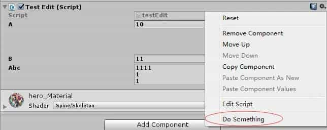

# Unity常用特性Attribute介绍使用

## HelpURLAttribute

 从字面意思理解，是查看帮助时，跳转到指定的页面。

如下图：


对应着蓝色小书的图标，点击以后会跳转到配置的URL。

## RangeAttribute

限定int或float的取值范围。

Attribute used to make a float or int variable in a script be restricted to a specific range.
 When this attribute is used, the float or int will be shown as a slider in the Inspector instead of the default number field.

当在int或float上应用RangeAttribute特性时，在Inspector面板中，显示的将是一个slider滑动条，而不是默认的数值字段。

```c#
[Range(0.1f,0.9f)]
float ratio;
```

## RequireComponentAttribute

自动添加所要依赖的组件，如将一个Script做为一个GameObject的组件，而这个Script需要访问Rigidbody组件，
 通过应用该属性，可以自动的添加Rigidbody组件到当前的GameObject中，避免设置错误。

*前提是：如果当前的Script已经添加到了GameObject，这时候你再应用RequireComponent特性是无效的，
 你必须删除 再重新添加，才会检测。

```c#
using UnityEngine;

// PlayerScript requires the GameObject to have a Rigidbody component
[RequireComponent(typeof(Rigidbody))]
public class PlayerScript : MonoBehaviour
{
    Rigidbody rb;

    void Start()
    {
        rb = GetComponent<Rigidbody>();
    }

    void FixedUpdate()
    {
        rb.AddForce(Vector3.up);
    }
}
```

## TooltipAttribute

在Inspector面板中，为一个字段Field指定一个提示。


```c#
using UnityEngine;
using System.Collections;

public class ExampleClass : MonoBehaviour {
    [Tooltip("Health value between 0 and 100.")]
    public int health = 0;
}
```

## HideInInspectorAttribute

让一个可被序列化的字段，不要显示在Inspector面板中，防止修改。

```c#
using UnityEngine;
using System.Collections;

public class ExampleClass : MonoBehaviour {
    [HideInInspector]
    public int p = 5;
}

```

## ExecuteInEditMode

让MonoBehaviour脚本的所有实例，在编辑模式下可运行。
这些函数的调用并不会像在PlayMode下那样：

The functions are not called constantly like they are in play mode.

- [Update](MonoBehaviour.Update.html) is only called when something in the scene changed.
- [OnGUI](MonoBehaviour.OnGUI.html) is called when the Game View recieves an [Event](Event.html).
- [OnRenderObject](MonoBehaviour.OnRenderObject.html) and the other rendering callback functions are called on every repaint of the Scene View or Game View.

只有窗口在发生改变 ，接触新的事件，重绘后才会调用。

*默认MonoBehaviour的脚本只能在运行模式下执行。

```c#
using UnityEngine;

[ExecuteInEditMode]
public class PrintAwake : MonoBehaviour
{
    void Awake()
    {
        Debug.Log("Editor causes this Awake");
    }

    void Update()
    {
        Debug.Log("Editor causes this Update");
    }
}
```

## DisallowMultipleComponent

禁止一个组件被重复的添加多次。

*如果当前GameObject已经存在了多个相同的组件，是不会有影响的，但应用了特性以后，就无法再次添加。

```c#
[DisallowMultipleComponent]
public class testEdit : MonoBehaviour {...}
```

## DelayedAttribute

在运行时，我们修改Inspector面板中的字段，会即时返回新的值，应用Delayed特性，只有在用户按下回车Enter或是
 焦点离开时才会返回新值，通过用于调试阶段。

*只能应用于字段，不可在类或其它目标元素上使用。

## SpaceAttribute

 间隔距离，在Inspector中，可以设置元素与元素之间的间隔。

```c#
using System.Collections;
using System.Collections.Generic;
using UnityEngine;

public class testEdit : MonoBehaviour {
    public int a = 10;
    [Space(50)]
    public int b = 11;
}
```


## TextAreaAttribute

 可以在一个高自由度并且可滚动的文本区域里编辑string字符串，如果字符串比较长，比较适用。

参数:
 minLines:文本区域最小行数
 maxLines:文本区域最大行数，超过最大行数，会出现滚动条。


```csharp
[TextArea(1,5)]
public string abc;
```

## MultilineAttribute

 在一个支持多行的文本区域内编辑string字符串，他和TextAreaAttribute不同，MultilineAttribute的TextArea没有滚动条。


```csharp
[Multiline(1,5)]
public string abc;
```


## ContextMenu

 向Inspector面板中脚本Script的上下文菜单（快捷，右键），添加一条指令，当选择该命令时，函数会执行。
 *只能用于非静态函数


```csharp
public class ContextTesting : MonoBehaviour {
    /// Add a context menu named "Do Something" in the inspector
    /// of the attached script.
    [ContextMenu ("Do Something")]
    void DoSomething () {
        Debug.Log ("Perform operation");
    }
}
```



预定义的一些方法，如Reset，是可以进行重载的。


## ContextMenuItemAttribute

 在Inspector面板中，为字段field添加一个快捷的菜单。

```csharp
[Multiline][ContextMenuItem("Reset", "ResetString")]
    public string abc;
    public void ResetString()
    {
        abc = "";
    }
```


## CreateAssetMenuAttribute

快速的创建ScriptableObject派生类的实例，并存储成以“.asset"结尾的文件，ScriptableObject的派生类可以存储为外部的文件，图形化编辑对象数据，一些静态的数据，动态的加载，ScriptableObject是一种解决方案，具体见另一篇文章的说明：
 https://www.jianshu.com/p/da578e55ca47


```csharp
using System.Collections;
using System.Collections.Generic;
using UnityEngine;

[CreateAssetMenu(fileName = "xxxx",menuName = "xxx/xxx")]
public class testEdit : ScriptableObject {
    public int a = 10;
    public int b = 11;
    public int c = 12;
    [Multiline][ContextMenuItem("Reset", "ResetString")]
    public string abc;

}
```

说明：
 fileName:生成asset文件的文件名。
 menuName:在Assets/Create上子菜单的名字。


## ColorUsageAttribute

颜色选择器，color picker，只能应用在Color字段上。
 默认参数为是否显示alpha，具体使用看下官方文档的参数描述，这里不加代码了


## AddComponentMenu

 把添加Script的操作放在Component菜单下，来替代Component/Scripts，因为里面的脚本可能非常多，基本上没有实用价值
 AddComponentMenu的方便之处在于如果你当前场景内，有多个GameObjects需要添加同一个脚本，那么使用同时选中
 这些地象，并打开Component菜单选中要添加的脚本就可以一次性添加了。


```csharp
[AddComponentMenu("Example/testEdits")]
public class testEdit : MonoBehaviour {
```

## AssemblyIsEditorAssembly

添加该特性的任意类，都会被视为Editor编辑器类。只有用于Editor模式下。

## PreferBinarySerialization

 只能用在ScriptableObject的派生类上（使用在其它类型上面会被忽略），修改序列化的模式为二进制，而不是YAML，  当你的资源比较大的时候，保存成二进制，生成的数据会更加的紧凑，从而提高程序的读写性能。


```csharp
[CreateAssetMenu]
[PreferBinarySerialization]
public class testEdit : ScriptableObject {
    
    public Color a;
    public int b = 11;
    public int c = 12;  
    [Multiline][ContextMenuItem("Reset", "ResetString")]
    public string abc;

}
```

用记事本打开生成后的asset，会发现都是二进制的数据。

## RuntimeInitializeOnLoadMethodAttribute

 在运行时，当前类初始化完成，自动调用被该特性应用的静态函数,这和static静态构造函数还不一样，static静态构造函数是在所有的方法之前运行的，而RuntimeInitializeOnLoadMethod特性的方法是Awake方法之后执行的(如果是MonoBehaviour派生类)。

如果一个类中有多个静态方法使用了RuntimeInitializeOnLoadMethod特性，执行顺序是不固定的。


```csharp
[RuntimeInitializeOnLoadMethod]
    static void OnRuntimeMethodLoad()
    {
        Debug.Log("After scene is loaded and game is running");
    }

    [RuntimeInitializeOnLoadMethod]
    static void OnSecondRuntimeMethodLoad()
    {
        Debug.Log("SecondMethod After scene is loaded and game is running.");
    }
```

## SelectionBaseAttribute

 设置基础选中对象，应用该标识一个对象为选中对象，当我们在scene view中选择一个objects的时候，u3d会返回给我们是适合的对象，比如你选中的对象是prefab的一部分，默认会返回节点的根对象，默认根对象被设置成了基础选中对象，你可以修改他，让其它的对象成为基础选中对象，比如根对象可能就是一个空的GameObject，而我们要实际查看编辑的对象是子节点，这样我们可以将子节点中添加的脚本应用SelectionBase特性。


我将脚本加到Camera_Offset后，成为了默认的选中对象，这样每次我在场景中选中时，Camera_Offset会被选择，并高亮显示。

## SerializeField

 强制去序列化一个私有的字段field.默认情况下，当u3d在序列化脚本的时候，只会序列化public的字段，这是u3d内部的实现的序列化，并不是 .NET's serialization的实现。
 另一点，私有字段，你不希望派生类访问，但你希望在Inspector中可以进行配置，也可以应用SerializeField来解决。


```csharp
using UnityEngine;

public class SomePerson : MonoBehaviour
{
    //This field gets serialized because it is public.
    public string name = "John";

    //This field does not get serialized because it is private.
    private int age = 40;

    //This field gets serialized even though it is private
    //because it has the SerializeField attribute applied.
    [SerializeField]
    private bool hasHealthPotion = true;

    void Update()
    {
    }
}
```


## SharedBetweenAnimatorsAttribute

 状态机组件，没有在项目中使用过，mark下，在简书里新建一篇叫StateMachineBehaviour的文章，实际测试案例后，回来补充。


## HeaderAttribute

 在Inspector面板中，为field字段添加头信息，增强描述。
 The header is done using a DecoratorDrawer.


```csharp
using UnityEngine;
using System.Collections;

public class ExampleClass : MonoBehaviour {
    [Header("Health Settings")]
    public int health = 0;
    public int maxHealth = 100;
    [Header("Shield Settings")]
    public int shield = 0;
    public int maxShield = 0;
}
```


##  GUITargetAttribute

 设置OnGUI方法在哪一个Display下显示，默认是所有的Display均显示.

```cpp
[GUITarget(0,1,new int[]{2,3,4})]
void OnGUI()
{
    if (GUI.Button (new Rect (0, 0, 128, 128), "Test")) {
        Debug.Log ("blahblahblah....");
    }
}
```


说明：
 提供了如下参数：
 displayIndex    Display index.display 索引
 displayIndex1   Display index. display索引
 displayIndexList  Display index list.display索引列表

## FormerlySerializedAs 序列化数据迁移

在Unity中，直接修改变量名称会导致旧的序列化数据丢失，因为Unity的序列化系统是通过变量名来匹配数据的。好在可以通过 `FormerlySerializedAs` 属性明确告诉序列化系统：“这个变量曾经用另一个名字存储数据”。

1. **添加命名空间**：

   ```c#
   using UnityEngine.Serialization;
   ```

2. **标记旧变量名**：

   ```c#
   [FormerlySerializedAs("oldVariableName")]
   public float newVariableName;
   ```
3. **下一次保存**：

   ```c#
   //[FormerlySerializedAs("oldVariableName")]  下一次保存后该行可删除，因为数据已迁移
   public float newVariableName;
   ```


# Cinemachine插件常用Attribute

以下是两个自定义 Attribute 的使用示例，分别展示 `FoldoutWithEnabledButtonAttribute` 和 `EnabledPropertyAttribute` 的实际应用场景：

------

## `FoldoutWithEnabledButtonAttribute` 示例

**功能**：为嵌套类/结构体添加带复选框的折叠面板，复选框控制整体启用状态。

### 定义数据结构

```c#
using UnityEngine;
using Unity.Cinemachine;

[System.Serializable]
public class AdvancedSettings 
{
    public bool Enabled = true; // 必须有一个bool字段作为启用开关
    public float Sensitivity = 1.0f;
    public int MaxIterations = 10;
    public Vector3 Offset = Vector3.zero;
}

public class CameraController : MonoBehaviour 
{
    // 使用FoldoutWithEnabledButtonAttribute绑定到"Enabled"字段
    [FoldoutWithEnabledButton("Enabled", "高级设置")] 
    public AdvancedSettings Settings = new AdvancedSettings();
}
```

### Inspector 效果：

```
[✓] 高级设置
    ├─ Sensitivity: 1.0
    ├─ MaxIterations: 10
    └─ Offset: (0, 0, 0)
```

- 点击标题栏的复选框会切换 `AdvancedSettings.Enabled` 的值
- 展开/折叠面板会显示/隐藏所有子属性

------

##  `EnabledPropertyAttribute` 示例

**功能**：为单个属性添加启用开关，禁用时显示替代文本。

### 定义类

```c#
using UnityEngine;
using Unity.Cinemachine;

public class PostProcessingSettings : MonoBehaviour 
{
    [Serializable]
    public class BloomEffect 
    {
        public bool Active = true;
        public float Intensity = 0.8f;
        public float Threshold = 1.0f;
    }

    // 普通嵌套属性（对比用）
    public BloomEffect DefaultBloom = new BloomEffect();

    // 使用EnabledPropertyAttribute绑定到"Active"字段
    [EnabledProperty("Active", ToggleDisabledText = "Bloom已禁用")] 
    public BloomEffect ControlledBloom = new BloomEffect();
}
```

### Inspector 效果对比：

**普通嵌套属性**：

```
Bloom Effect
  ├─ Active: [✓]
  ├─ Intensity: 0.8
  └─ Threshold: 1.0
```

**启用Attribute后的效果**：

```
[✓] Bloom Effect: 
    Intensity: 0.8
    Threshold: 1.0
```

或当禁用时：

```
[ ] Bloom Effect: Bloom已禁用
```

- 标题行显示紧凑的开关+名称
- 禁用时隐藏子属性并显示`ToggleDisabledText`
- 启用时显示所有子属性

------

## 特殊场景示例

### 组合使用（嵌套+单属性控制）

```c#
[FoldoutWithEnabledButton("Enabled", "特效设置")]
public class VFXSettings 
{
    public bool Enabled = true;
    
    [EnabledProperty("Active", ToggleDisabledText = "OFF")]
    public BloomEffect Bloom = new BloomEffect();
    
    [EnabledProperty("IsActive")]
    public MotionBlur Blur = new MotionBlur();
}
```

### Inspector 效果：

```
[✓] 特效设置
    ├─ [✓] Bloom: 
    |     Intensity: 0.8
    |     Threshold: 1.0
    └─ [ ] Blur: OFF
```

------

## 关键点说明

1. **字段命名要求**：
   - `FoldoutWithEnabledButtonAttribute` 需要类中存在指定的 `bool` 字段（如`Enabled`）
   - `EnabledPropertyAttribute` 需要绑定到目标属性的子 `bool` 字段（如`Active`）
2. **UI 特性**：
   - 两者都自动处理属性间的联动（无需手动同步值）
   - 支持工具提示（`tooltip`）透传
3. **适用场景**：
   - `FoldoutWithEnabledButton`：管理复杂嵌套数据
   - `EnabledProperty`：简化单个功能的启用/禁用交互

这些示例展示了如何在Unity编辑器中实现更直观的属性控制，适合需要精细化管理的配置系统（如相机、特效、AI行为等）。

# 经典自定义Attribute

## 在Transform变量下面加三个按钮

其中第一个按钮支持自定义功能

```csharp
using UnityEngine;
#if UNITY_EDITOR
using UnityEditor;
using System;
using System.Reflection;
#endif

namespace DNATools
{
    /// <summary>
    /// 使用方法示例：[DNATools.TransformButton("Test Model", nameof(TestModel))]
    /// </summary>
    public class TransformButtonAttribute : PropertyAttribute
    {
        public string ButtonLabel { get; private set; } // 按钮的显示文本
        public string MethodName { get; private set; } // 回调函数的方法名

        // 构造函数，接受按钮文本和回调函数的方法名
        public TransformButtonAttribute(string buttonLabel, string methodName)
        {
            ButtonLabel = buttonLabel;
            MethodName = methodName;
        }
    }
    #if UNITY_EDITOR
    [CustomPropertyDrawer(typeof(TransformButtonAttribute))]
    public class TransformButtonDrawer : PropertyDrawer
    {
        public override void OnGUI(Rect position, SerializedProperty property, GUIContent label)
        {
            // 获取 TransformButtonAttribute
            TransformButtonAttribute transformButton = attribute as TransformButtonAttribute;

            // 确保字段类型是 Transform
            if (property.propertyType == SerializedPropertyType.ObjectReference &&
                (property.objectReferenceValue == null || property.objectReferenceValue is Transform))
            {
                // 绘制 Transform 字段
                EditorGUI.PropertyField(position, property, label);

                // 计算按钮的位置
                //Rect buttonRect = new Rect(position.x, position.y + EditorGUIUtility.singleLineHeight + 2, position.width, EditorGUIUtility.singleLineHeight);

                // 绘制按钮
                //if (GUI.Button(buttonRect, transformButton.ButtonLabel))
                EditorGUILayout.BeginHorizontal();
                if(GUILayout.Button(transformButton?.ButtonLabel))
                {
                    // 获取 Transform 值
                    Transform transform = (Transform)property.objectReferenceValue;

                    // 获取脚本实例
                    UnityEngine.Object targetObject = property.serializedObject.targetObject;
                    Type targetType = targetObject.GetType();

                    // 通过反射获取方法
                    MethodInfo method = targetType.GetMethod(transformButton.MethodName, BindingFlags.Public | BindingFlags.NonPublic | BindingFlags.Instance | BindingFlags.Static);

                    if (method != null)
                    {
                        // 调用方法
                        if (method.IsStatic)
                        {
                            method.Invoke(null, new object[] { transform });
                        }
                        else
                        {
                            method.Invoke(targetObject, new object[] { transform });
                        }
                    }
                    else
                    {
                        Debug.LogError($"Method '{transformButton.MethodName}' not found in {targetType.Name}.");
                    }
                }

                if (GUILayout.Button("Select", GUILayout.Width(50f)))
                {
                    var tran = (Transform)property.objectReferenceValue;
                    var go = tran?.gameObject;
                    Selection.activeGameObject = go;
                }
                if (GUILayout.Button("Ping",GUILayout.Width(50f)))
                {
                    var tran = (Transform)property.objectReferenceValue;
                    var go = tran?.gameObject;
                    EditorGUIUtility.PingObject(go);
                }
                EditorGUILayout.EndHorizontal();
            }
            else
            {
                // 如果字段类型不是 Transform，显示错误提示
                EditorGUI.LabelField(position, label.text, "Use TransformButton with Transform fields only.");
            }
        }

        // public override float GetPropertyHeight(SerializedProperty property, GUIContent label)
        // {
        //     // 增加高度以容纳按钮
        //     return EditorGUIUtility.singleLineHeight * 2 + 4; // 字段高度 + 按钮高度 + 间距
        // }
    }
    #endif
}
```


## 最简易的EditorPrefs开关

要借一个可序列化变量当壳子的Attribute，使其显示定制内容，可以按照以下步骤实现：

###  创建EditorPrefsBoolAttribute

```csharp
using UnityEngine;
#if UNITY_EDITOR
using UnityEditor;
#endif

public class EditorPrefsBoolAttribute : PropertyAttribute
{
    public string editorPrefsKey;
    public string label;
    
    public EditorPrefsBoolAttribute(string editorPrefsKey, string label)
    {
        this.editorPrefsKey = editorPrefsKey;
        this.label = label;
    }
}
#if UNITY_EDITOR
[CustomPropertyDrawer(typeof(EditorPrefsBoolAttribute))]
public class EditorPrefsBoolAttributeDrawer : PropertyDrawer
{
    public override void OnGUI(Rect position, SerializedProperty property, GUIContent label)
    {
        EditorPrefsBoolAttribute attr = (EditorPrefsBoolAttribute)attribute;
        bool currentValue = EditorPrefs.GetBool(attr.editorPrefsKey, true);
        EditorGUI.BeginChangeCheck();
        bool newValue = 
        EditorGUI.Toggle(position, attr.label, currentValue);
        if (EditorGUI.EndChangeCheck())
        {
            EditorPrefs.SetBool(attr.editorPrefsKey, newValue);
            // Force scene views to repaint
            UnityEditorInternal.InternalEditorUtility.RepaintAllViews();
        }
    }
}
#endif
```

### 使用示例

```c#
[EditorPrefsBool("SpotManagerGizmos","显示Gizmos")]
public bool aboutGizmos;//只是个壳子，它的序列化内容没意义
#if UNITY_EDITOR
void OnDrawGizmos()
{
    if(!(UnityEditor.EditorPrefs.GetBool("SpotManagerGizmos",true)))return;
    //TODO：Gizmos绘制
}
#endif
```


## 最大最小值 MinMaxRange

```csharp
using UnityEngine;

#if UNITY_EDITOR
using UnityEditor;
#endif

public class MinMaxRangeAttribute : PropertyAttribute
{
    public readonly float Min;
    public readonly float Max;

    public MinMaxRangeAttribute(float min, float max)
    {
        Min = min;
        Max = max;
    }
}

#if UNITY_EDITOR
[CustomPropertyDrawer(typeof(MinMaxRangeAttribute))]
public class MinMaxRangeAttributeDrawer : PropertyDrawer
{
    private const float TextFieldWidth = 45f;
    private const float Spacing = 5f;
    private const float SliderPadding = 2f; // 防止滑块与输入框紧贴

    public override void OnGUI(Rect position, SerializedProperty property, GUIContent label)
    {
        // 验证属性类型
        if (property.propertyType != SerializedPropertyType.Vector2)
        {
            EditorGUI.HelpBox(position, $"{label.text} 必须使用 Vector2 类型", MessageType.Error);
            return;
        }

        MinMaxRangeAttribute range = (MinMaxRangeAttribute)attribute;
        
        // 获取属性值
        Vector2 value = property.vector2Value;
        float minValue = Mathf.Clamp(value.x, range.Min, range.Max);
        float maxValue = Mathf.Clamp(value.y, range.Min, range.Max);
        
        // 计算布局
        position = EditorGUI.PrefixLabel(position, label);
        
        Rect minRect = new Rect(position) { 
            width = TextFieldWidth 
        };
        
        Rect maxRect = new Rect(position) { 
            x = position.xMax - TextFieldWidth,
            width = TextFieldWidth 
        };
        
        Rect sliderRect = new Rect(position) {
            x = minRect.xMax + Spacing,
            xMax = maxRect.x - Spacing,
            y = position.y + SliderPadding,
            height = position.height - SliderPadding * 2
        };

        EditorGUI.BeginProperty(position, label, property);
        
        // 绘制最小值和最大值输入框
        EditorGUI.BeginChangeCheck();
        minValue = EditorGUI.FloatField(minRect, minValue);
        if (EditorGUI.EndChangeCheck())
        {
            minValue = Mathf.Clamp(minValue, range.Min, maxValue);
            property.vector2Value = new Vector2(minValue, maxValue);
        }

        // 绘制范围滑块
        EditorGUI.BeginChangeCheck();
        EditorGUI.MinMaxSlider(sliderRect, ref minValue, ref maxValue, range.Min, range.Max);
        if (EditorGUI.EndChangeCheck())
        {
            property.vector2Value = new Vector2(minValue, maxValue);
        }

        // 绘制最大值输入框
        EditorGUI.BeginChangeCheck();
        maxValue = EditorGUI.FloatField(maxRect, maxValue);
        if (EditorGUI.EndChangeCheck())
        {
            maxValue = Mathf.Clamp(maxValue, minValue, range.Max);
            property.vector2Value = new Vector2(minValue, maxValue);
        }

        EditorGUI.EndProperty();
    }
}
#endif
```

### 使用示例

```csharp
[MinMaxRange(0,1f)]
public Vector2 rangeValue;
```


# 第三方扩展：Odin插件

[Unity使用Odin完成编辑器开发 【基础知识篇 第一节】中文 分组 颜色 按钮 条件_哔哩哔哩_bilibili](https://www.bilibili.com/video/BV1kwAkepEwp/?spm_id_from=333.1387.favlist.content.click&vd_source=563d44869c3ecebb1867233573d16b7b)

百度网盘分享的文件：[Odin Inspector and Serializer v3.3.1.4.unitypackage](https://pan.baidu.com/s/1fUa2UK6TkuL-z51in6uWbg?pwd=0000)

Odin官网：https://odininspector.com/tutorials，可以看到，自定义Attribute只是其功能之一，非常强大

