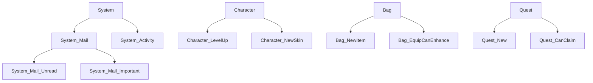

# 字符串相关

## 安全代码

```c#
using System.Text;
using UnityEngine;

public class StringUtil
{
    /// <summary>
    ///自定义字符串函数公用的StringBuilder
    /// </summary>
    static StringBuilder _customSB = new StringBuilder();
    /// <summary>
    /// 共享的StringBuilder
    /// </summary>
    static StringBuilder _shareSB = new StringBuilder();
    /// <summary>
    /// 获取共享StringBuilder并事先做好数据清理
    /// </summary>
    public static StringBuilder shareSB
    {
        get
        {
            shareSB.Remove(0, _shareSB.Length);
            return _shareSB;
        }
    }

    #region Concat
    public static string Concat(string a1, string a2)
    {
        _customSB.Remove(0, _customSB.Length);
        _customSB.Append(a1);
        _customSB.Append(a2);
        return _customSB.ToString();
    }
    public static string Concat(string a1, string a2, string a3)
    {
        _customSB.Remove(0, _customSB.Length);
        _customSB.Append(a1);
        _customSB.Append(a2);
        _customSB.Append(a3);
        return _customSB.ToString();
    }
    public static string Concat(string a1, string a2, string a3, string a4)
    {
        _customSB.Remove(0, _customSB.Length);
        _customSB.Append(a1);
        _customSB.Append(a2);
        _customSB.Append(a3);
        _customSB.Append(a4);
        return _customSB.ToString();
    }
    public static string Concat(string a1, string a2, string a3, string a4, string a5)
    {
        _customSB.Remove(0, _customSB.Length);
        _customSB.Append(a1);
        _customSB.Append(a2);
        _customSB.Append(a3);
        _customSB.Append(a4);
        _customSB.Append(a5);
        return _customSB.ToString();
    }
    public static string Concat(string a1, string a2, string a3, string a4, string a5, string a6)
    {
        _customSB.Remove(0, _customSB.Length);
        _customSB.Append(a1);
        _customSB.Append(a2);
        _customSB.Append(a3);
        _customSB.Append(a4);
        _customSB.Append(a5);
        _customSB.Append(a6);
        return _customSB.ToString();
    }
    public static string Concat(string a1, string a2, string a3, string a4, string a5, string a6, string a7)
    {
        _customSB.Remove(0, _customSB.Length);
        _customSB.Append(a1);
        _customSB.Append(a2);
        _customSB.Append(a3);
        _customSB.Append(a4);
        _customSB.Append(a5);
        _customSB.Append(a6);
        _customSB.Append(a7);
        return _customSB.ToString();
    }
    #endregion //Concat
    /// <summary>
    /// 格式化字符串
    /// </summary>
    /// <param name="format"></param>
    /// <param name="args"></param>
    /// <returns></returns>
    public static string Format(string format, params object[] args)
    {
        try
        {
            _customSB.Remove(0, _customSB.Length);
            _customSB.AppendFormat(format, args);
            return _customSB.ToString();
        }
        catch
        {
            return format;
        }
    }

    /// <summary>
    /// 数字转美式字符串
    /// </summary>
    /// <param name="num"></param>
    /// <returns></returns>
    public static string Num2US(object num)
    {
        if (num is float)
            return ((float)num).ToString("n2");
        if (num is int)
            return ((int)num).ToString("n2");
        if (num is long)
            return ((long)num).ToString("n2");
        if(num is double)
            return ((double)num).ToString("n2");
        return "0";
    }
    /// <summary>
    /// NGUI颜色富文本
    /// </summary>
    /// <param name="color"></param>
    /// <param name="text"></param>
    /// <returns></returns>
    public static string NGUIColorText(Color color, string text)
    {
        return Format("[{0}]{1}[-]", ColorUtility.ToHtmlStringRGB(color), text);
    }
    /// <summary>
    /// UGUI颜色富文本
    /// </summary>
    /// <param name="color"></param>
    /// <param name="text"></param>
    /// <returns></returns>
    public static string UGUIColorText(Color color, string text)
    {
        return Format("<color=#{0}>{1}</color>", ColorUtility.ToHtmlStringRGB(color), text);
    }
}
```

## 非安全代码

VString.cs:

```c#
using System;
using System.Collections;
using System.Collections.Generic;
using UnityEngine;

//非安全代码，需要在Project Settings/Player/Other Setting中启用"Allow 'unsafe' code"
public static class StringExtend
{
    private static volatile object lockThis = new object();

    public static string ToTempString(this int i)
    {
        lock(lockThis)
        {
            return VString.IntToString(i);
        }        
    }

    public static string ToTempString(this float f, int digits = 2)
    {
        lock (lockThis)
        {
            return VString.FloatToString(f, digits);
        }            
    }

    public static string ToTempString(this long l)
    {
        lock (lockThis)
        {
            return VString.LongToString(l);
        }
    }

    public static string ToTempStringLower(this string str)
    {
        lock (lockThis)
        {
            return VString.ToLower(str);
        }
    }

    public static string ToTempStringUpper(this string str)
    {
        lock (lockThis)
        {
            return VString.ToUpper(str);
        }
    }

    public static string ToTempSubString(this string str, int index, int count)
    {
        lock(lockThis)
        {
            return VString.ToTempSubString(str, index, count);
        }
    }


    #region 转美式数字
    public static string ToStringUS(this float f)
    {
        return StringUtil.Num2US(f);
    }
    public static string ToStringUS(this int i)
    {
        return StringUtil.Num2US(i);
    }
    public static string ToStringUS(this long i)
    {
        return StringUtil.Num2US(i);
    }
    #endregion
}


/// <summary>
/// 内容可变的字符串
/// !!!只能作为临时变量使用,绝对不可以在逻辑中存储引用,包含VString和返回的string对象
/// </summary>
public class VString
{
    private string _data;
    private int maxCount;

    private static int _internalVsIndex;
    private static VString[] _internalVSArray = new VString[]
    {
        new VString(64),
        new VString(64),
        new VString(64),
        new VString(64),
        new VString(64),
        new VString(64),
        new VString(64),
        new VString(64),
        new VString(64),
        new VString(64),
        new VString(64),
        new VString(64),
        new VString(64),
        new VString(64),
        new VString(64),
        new VString(64),
        new VString(64),
        new VString(64),
        new VString(64),
        new VString(64)
    };
    private static string[] digitalNumberArray = new string[] { "0", "1", "2", "3", "4", "5", "6", "7", "8", "9" };


    public VString(int maxCount = 1024)
    {
        this.maxCount = maxCount;
        _data = new string('\0', this.maxCount);
        Clear();
    }

    public string GetString()
    {
        return _data;
    }

   

    /// <summary>
    /// int转string,无GC,注意生成的string一定不能进行存贮
    /// </summary>
    /// <param name="val"></param>
    /// <returns></returns>
    public static string IntToString(int val)
    {
        return LongToString(val);
    }

    /// <summary>
    /// long转string,无GC,注意生成的string一定不能进行存贮
    /// </summary>
    /// <param name="val"></param>
    /// <returns></returns>
    public static string LongToString(long val)
    {
        if (val == 0)
        {
            return "0";
        }

        VString tempVS = GetInternalVString();        
        bool isNegative = false;
        if (val < 0)
        {
            val = -val;
            isNegative = true;
        }

        while (val != 0)
        {
            long mod = val % 10;
            val = val / 10;
            tempVS.Push(digitalNumberArray[mod]);
        }

        if (isNegative)
        {
            tempVS.Push("-");
        }

        tempVS.ReverseString();
        return tempVS.GetString();
    }

    /// <summary>
    /// float转string,无GC,注意生成的string一定不能进行存贮
    /// </summary>
    /// <param name="f"></param>
    /// <param name="digits">小数的位数</param>
    /// <returns></returns>
    public static string FloatToString(float f, int digits = 2)
    {
        bool isNegative = false;
        if (f < 0)
        {
            f = -f;
            isNegative = true;
        }

        int iPart = Mathf.FloorToInt(f);
        float fPart = f - iPart;

        VString tempVS0 = GetInternalVString();        


        if(iPart != 0)
        {
            while (iPart != 0)
            {
                long mod = iPart % 10;
                iPart = iPart / 10;
                tempVS0.Push(digitalNumberArray[mod]);
            }
        }
        else
        {
            tempVS0.Push("0");
        }

        if(isNegative)
        {
            tempVS0.Push("-");
        }
        tempVS0.ReverseString();
        

        if (digits != 0)
        {
            VString tempVS1 = GetInternalVString();            
            fPart = fPart * Mathf.Pow(10, digits);
            int iPart2 = Mathf.RoundToInt(fPart);

            int i = 0;
            while (iPart2 != 0 && i < digits)
            {
                long mod = iPart2 % 10;
                iPart2 = iPart2 / 10;
                i++;
                tempVS1.Push(digitalNumberArray[mod]);
            }
            tempVS1.ReverseString();

            tempVS0.Push(".");
            tempVS0.Push(tempVS1.GetString());
            while(i < digits)
            {
                i++;
                tempVS0.Push("0");
            }
        }
        else
        {
            tempVS0.Push(".");
            for (int i = 0; i < digits; ++i)
            {
                tempVS0.Push("0");
            }
        }
               
        return tempVS0.GetString();
    }


    /// <summary>
    /// 把一个字符串拷贝后,转换为lower case,,注意生成的string一定不能进行存贮
    /// </summary>
    /// <param name="str"></param>
    /// <returns></returns>
    public static string ToLower(string str)
    {
        if(!string.IsNullOrEmpty(str))
        {
            VString tempVS = VStringShareObject.GetShareVString();
            tempVS.Push(str);
            tempVS.ToLower();
            return tempVS.GetString();
        }
        return str;
    }

    /// <summary>
    /// 把一个字符串拷贝后,转换为upper case,,注意生成的string一定不能进行存贮
    /// </summary>
    /// <param name="str"></param>
    /// <returns></returns>
    public static string ToUpper(string str)
    {
        if (!string.IsNullOrEmpty(str))
        {
            VString tempVS = VStringShareObject.GetShareVString();
            tempVS.Push(str);
            tempVS.ToUpper();
            return tempVS.GetString();
        }
        return str;
    }

    public static string ToTempSubString(string str, int index, int count)
    {
        if(string.IsNullOrEmpty(str) || count <= 0 || index < 0)
        {
            LogHelper.LogError(VStringUtil.Concat("ToTempSubString IsNullOrEmpty ", index.ToTempString(), "/", count.ToTempString()));
            return str;
        }

        if(index + count > str.Length)
        {
            LogHelper.LogError(VStringUtil.Concat("ToTempSubString ", str, index.ToTempString(), "/", count.ToTempString()));
            return str;
        }

        VString tempVS1 = VStringShareObject.GetShareVString();
        tempVS1.Push(str);
        VString tempVS2 = VStringShareObject.GetShareVString();
        tempVS2.CopyFrom(tempVS1, index, count);
        return tempVS2.GetString();
    }


    /// <summary>
    /// 拼接两个字符串
    /// </summary>
    /// <param name="a"></param>
    /// <param name="b"></param>
    /// <param name="clear"></param>
    /// <returns></returns>
    public string Concat(string a, string b, bool clear = true)
    {
        if(clear)
        {
            Clear();
        }

        Push(a);
        Push(b);
        return _data;
    }


    
    public string Concat(string a, string b, string c, bool clear = true)
    {
        if (clear)
        {
            Clear();
        }

        Push(a);
        Push(b);
        Push(c);
        return _data;
    }
    public string Concat(string a, string b, string c, string d, bool clear = true)
    {
        if (clear)
        {
            Clear();
        }

        Push(a);
        Push(b);
        Push(c);
        Push(d);
        return _data;
    }
    public string Concat(string a, string b, string c, string d, string e, bool clear = true)
    {
        if (clear)
        {
            Clear();
        }

        Push(a);
        Push(b);
        Push(c);
        Push(d);
        Push(e);
        return _data;
    }
    public string Concat(string a, string b, string c, string d, string e, string f, bool clear = true)
    {
        if (clear)
        {
            Clear();
        }

        Push(a);
        Push(b);
        Push(c);
        Push(d);
        Push(e);
        Push(f);
        return _data;
    }
    public string Concat(string a, string b, string c, string d, string e, string f, string g, bool clear = true)
    {
        if (clear)
        {
            Clear();
        }

        Push(a);
        Push(b);
        Push(c);
        Push(d);
        Push(e);
        Push(f);
        Push(g);
        return _data;
    }
    public string Concat(string a, string b, string c, string d, string e, string f, string g, string h, bool clear = true)
    {
        if (clear)
        {
            Clear();
        }

        Push(a);
        Push(b);
        Push(c);
        Push(d);
        Push(e);
        Push(f);
        Push(g);
        Push(h);
        return _data;
    }
    public string Concat(string a, string b, string c, string d, string e, string f, string g, string h, string i, bool clear = true)
    {
        if (clear)
        {
            Clear();
        }

        Push(a);
        Push(b);
        Push(c);
        Push(d);
        Push(e);
        Push(f);
        Push(g);
        Push(h);
        Push(i);
        return _data;
    }
    public string Concat(string a, string b, string c, string d, string e, string f, string g, string h, string i, string j, bool clear = true)
    {
        if (clear)
        {
            Clear();
        }

        Push(a);
        Push(b);
        Push(c);
        Push(d);
        Push(e);
        Push(f);
        Push(g);
        Push(h);
        Push(i);
        Push(j);
        return _data;
    }


    public static bool UseShareObject(string str)
    {
        for (int i = 0; i < _internalVSArray.Length; ++i)
        {
            if (string.ReferenceEquals(str, _internalVSArray[i].GetString()))
            {
                return true;
            }
        }
        return false;
    }


    //往当前的字符串中添加字符串
    public unsafe void Push(string newStr)
    {
        if(string.IsNullOrEmpty(newStr))
        {
            return;
        }

        int copyLen = newStr.Length;
        int newLen = _data.Length + copyLen;
        if (newLen > maxCount)
        {
            copyLen = maxCount - _data.Length;
            //这个地方不使用VstringUtil.Concat避免死循环
            LogHelper.LogError(StringUtil.Concat("超过了最大添加长度 ", maxCount.ToTempString(), " ", newLen.ToTempString()));            
        }

        if(copyLen <= 0)
        {
            return;
        }

        fixed (char* src = newStr)
        {
            fixed(char* dst = _data)
            {
                UnsafeFunction.memcpyimpl((byte*)src, (byte*)(dst + _data.Length), copyLen * 2); //system.string的存储每个元素两个字节

                int* iDst = (int*)dst; 
                iDst = iDst - 1;    //字符串的长度在第一个元素的前面4个字节
                * iDst = newLen;
            }
        }
    }
    

    public unsafe void Clear()
    {
        fixed(char* p = _data)
        {           
            int* pSize = (int*)p;
            pSize = pSize - 1;
            *pSize = 0;
        }
    }

    public unsafe void CopyFrom(VString srcVstring, int startIndex, int count)
    {
        if(count > maxCount)
        {
            throw new ArgumentException(VStringUtil.Concat("copy count is larger then maxCount ", 
                count.ToTempString(), " ", maxCount.ToTempString()));
        }

        string srcStr = srcVstring.GetString();
        if (startIndex + count > srcStr.Length)
        {
            throw new ArgumentException(VStringUtil.Concat("copy count is larger then srcString len ", 
                count.ToTempString(), " ", srcStr.Length.ToTempString(), " ", startIndex.ToTempString()));
        }

        Clear();

        fixed (char* src = srcStr)
        {
            fixed (char* dst = _data)
            {
                UnsafeFunction.memcpyimpl((byte*)(src + startIndex), (byte*)dst, count * 2); //system.string的存储每个元素两个字节

                int* iDst = (int*)dst;
                iDst = iDst - 1;    //字符串的长度在第一个元素的前面4个字节
                *iDst = count;
            }
        }
    }

    public unsafe void ToLower()
    {
        int index = 0;
        int len = _data.Length;
        fixed (char* dst = _data)
        {
            while(index < len)
            {
                char tempChar = *(dst + index);
                *(dst + index) = char.ToLower(tempChar);
                ++index;
            }
        }
    }

    public unsafe void ToUpper()
    {
        int index = 0;
        int len = _data.Length;
        fixed (char* dst = _data)
        {
            while (index < len)
            {
                char tempChar = *(dst + index);
                *(dst + index) = char.ToUpper(tempChar);
                ++index;
            }
        }
    }

    //反转字符串的内容
    private unsafe string ReverseString()
    {
        int len = _data.Length;
        if(len > 0)
        {
            fixed (char* pHead = _data)
            {
                int count = len / 2;
                for (int i = 0; i < count; ++i)
                {
                    char temp = pHead[i];
                    pHead[i] = pHead[len - 1 - i];
                    pHead[len - 1 - i] = temp;
                }
            }
        }
        return _data;
    }    


    private static VString GetInternalVString()
    {
        _internalVsIndex = (_internalVsIndex + 1) % _internalVSArray.Length;
        VString vString = _internalVSArray[_internalVsIndex];
        vString.Clear();
        return vString;
    }
}
```


# 通过ScriptableObject生成asset文件

```c
using UnityEngine;
[CreateAssetMenu(menuName= "Script Objects/Sample")]
public class SamepleScriptableObject : ScriptableObject
{
    private void Awake(){}
    private void OnEnable(){}
    privaet void OnDisable(){}
    private void OnDestroy(){}
}
```

好处：

- 可在运行时修改
- 分拆数据防止prefab过大，减少同时编辑prefab的情况

# UGUI空图片

响应点击，但不可见

```c#
using System.Collections;
using System.Collections.Generic;
using UnityEngine;
using UnityEngine.UI;

[RequireComponent(typeof(CanvasRenderer))]
public class EmptyImageGraphic : Graphic
{
    protected EmptyImageGraphic()
    {
        useLegacyMeshGeneration = false;
    }
    protected override void OnPopulateMesh(VertexHelper m)
    {
        m.Clear();
    }
}
```

# 批量生成可复用物体

```c#
/// <summary>
/// 复制物体并填充列表
/// </summary>
/// <typeparam name="T">item的类型</typeparam>
/// <param name="parent">批量生成在哪个父节点下</param>
/// <param name="goTmp">模板（会自动掩藏）</param>
/// <param name="needCount">生成数量</param>
/// <param name="goList">记录生成item的列表</param>
/// <param name="hideGoTmp">是否隐藏模板，如不隐藏会把模板填充到列表中</param>
/// <param name="initCallback">初次生成需要做的回调</param>
public static void FillWithTempItem<T>(Transform parent, MonoBehaviour goTmp, int needCount, List<T> goList, bool hideGoTmp = true, Action<T> initCallback = null) where T : MonoBehaviour
{
    if (goList == null)
    {
        Debug.LogError("传入的列表不可为null！");
        return;
    }
    if(parent == null || goTmp == null)
    {
        return;
    }
    for(int i=goList.Count - 1;i>= 0; --i)
    {
        if(null == goList[i])
        {
            goList.RemoveAt(i);
        }
    }

    if(!hideGoTmp)
    {
        bool bContainTmp = false;
        T comTmp = (T)goTmp;
        if(comTmp != null)
        {
            bContainTmp = goList.Contains(comTmp);
            if(!bContainTmp)
            {
                goList.Insert(0, comTmp);
                if(initCallback != null)
                {
                    initCallback(comTmp);
                }
            }
        }
    }
    else
    {
#if UNITY_EDITOR
        if (!UnityEditor.PrefabUtility.IsPartOfAnyPrefab(goTmp))
#endif
            goTmp.gameObject.SetActive(false);
    }

    int GoListCount = goList.Count;
    for(int i=GoListCount; i<needCount; i++)
    {
        T item = UnityEngine.Object.Instantiate((T)goTmp, parent, false) as T;
        if(initCallback != null)
        {
            initCallback(item);
        }
        goList.Add(item);
    }
    GoListCount = goList.Count;
    for(int i=0; i<GoListCount; i++)
    {
        T item = goList[i];
        bool active = i < needCount;
        if(active)
        {
            Transform itemTra = item.transform;
            if(itemTra.parent != parent)
            {
                itemTra.SetParent(parent, false);
                itemTra.localPosition = Vector3.zero;
                itemTra.rotation = Quaternion.identity;
            }
        }
        item.gameObject.SetActive(active);
    }
}

/// <summary>
/// 通过FillWithTempItem 生成到列表中的物体，暂时不用的时候可以通过这个方法临时缩减列表长度
/// </summary>
/// <typeparam name="T"></typeparam>
/// <param name="goList"></param>
public static void ReleaseMostOfList<T>(List<T> goList) where T : MonoBehaviour
{
    for(int i=goList.Count -1; i> 2; i--)
    {
        var go = goList[i];
        GameObject.Destroy(go.gameObject);
        goList.RemoveAt(i);
    }
}
public static void SetActive(UnityEngine.Object obj, bool active)
{
    if(obj != null)
    {
        ((GameObject)obj).SetActive(active);
    }
    else if(obj is Component)
    {
        ((Component)obj).gameObject.SetActive(active);
    }
}
```

# 拷贝物体

```c#
/// <summary>
/// 拷贝物体
/// </summary>
/// <typeparam name="T"></typeparam>
/// <param name="parent"></param>
/// <param name="goTmp"></param>
/// <returns></returns>
public static T DuplicateItem<T>(Transform parent, MonoBehaviour goTmp)where T : MonoBehaviour
{
    T item = UnityEngine.Object.Instantiate((T)goTmp, parent, false) as T;
    Transform tran = item.transform;
    tran.localPosition = Vector3.zero;
    tran.rotation = Quaternion.identity;
    return item;
}
```

# 深度拷贝/深拷贝

```c#
/// <summary>
/// 深度拷贝组件
/// </summary>
/// <typeparam name="T"></typeparam>
/// <param name="original"></param>
/// <param name="destination"></param>
/// <returns></returns>

public static T CopyComponent<T>(T original, GameObject destination)where T : Component
{
    System.Type type = original.GetType();
    Component copy = destination.AddComponent(type);
    System.Reflection.FieldInfo[] fields = type.GetFields();
    foreach (System.Reflection.FieldInfo field in fields)
    {
        field.SetValue(copy, field.GetValue(original));
    }
    return copy as T;
}
/// <summary>
/// 深度拷贝对象，产生的额外内存消耗比对象大很多
/// </summary>
/// <typeparam name="T"></typeparam>
/// <param name="obj"></param>
/// <returns></returns>
public static T DeepClone<T>(T obj)
{
    using (MemoryStream ms = new MemoryStream())
    {
        //.Net5 以后被标记为过时，有风险
        BinaryFormatter formatter = new BinaryFormatter();
        formatter.Serialize(ms, obj);
        ms.Position = 0;
        return (T)formatter.Deserialize(ms);
    }
}

// 深拷贝方法（使用 JsonSerializer，更推荐，但不支持序列化私有字段或循环引用）
using System.Text.Json;
public static T DeepClone<T>(T obj)
{
    string json = JsonSerializer.Serialize(obj);
    return JsonSerializer.Deserialize<T>(json);
}
```


# 设置显隐

```c#
public static void SetActive(UnityEngine.Object obj, bool active)
{
    if(obj != null)
    {
        GameObject go = null;
        if (obj is GameObject)
        {
            go = (GameObject)obj;
        }
        else if(obj is Component)
        {
            go = ((Component)obj).gameObject;
        }

        if (go != null)
        {
            #if UNITY_EDITOR
            if (PrefabUtility.GetPrefabInstanceStatus(go) != PrefabInstanceStatus.NotAPrefab ||
                PrefabUtility.IsPartOfAnyPrefab(go))
                return;
            #endif

            if (go.activeSelf != active)
                go.SetActive(active);
        }
    }
}
```

# FPS的设置与显示

```csharp
using UnityEngine;
using UnityEngine.UI;

public class DebugPanel : MonoBehaviour
{
    public Text FPSText;
    public bool LockMaxFPS = false; 
    private float deltaTime = 0.0f;
    private int fpsValue = 0;
    private float timeCounter = 0f;
    
    void Start()
    {
        //设置帧率
        if(LockMaxFPS)
        {
            //利用代码禁用垂直同步VSync，否则设定帧率无效，会被覆盖为显示器的刷新率（通常是60Hz）
            //或者在 Edit > Project Settings > Quality 中，找到当前使用的质量等级（如 "High" 或 "Medium"）
            //将 VSync Count 设置为 Don't Sync。
            QualitySettings.vSyncCount = 0; 
            //将最大帧率限制为 30
            Application.targetFrameRate = 30;
        }
    }
    void Update()
    {
        deltaTime += (Time.unscaledDeltaTime - deltaTime) * 0.1f;
        timeCounter += Time.unscaledDeltaTime;
        if(timeCounter >= 0.5f)
        {
            int fpsValueNew = (int)(1.0f / deltaTime);
            if(fpsValue != fpsValueNew)
            {
                fpsValue = fpsValueNew;
                FPSText.text = fpsValue.ToString();
            }
            timeCounter = 0.0f;
        }
    }
}
```


# 条件编译_日志打印

```csharp
using UnityEngine;
using System.Diagnostics;

public class LogHelper
{
    [Conditional("LOG_ENABLE")]//当 LOG_ENABLE 这个宏开启时，函数调用才会进入编译
    public static void Log(string message)
    {
        UnityEngine.Debug.Log(message);
    }
}
```


# 常用Mono事件触发器

```c#
using UnityEngine;
using System.Collections.Generic;
using UnityEngine.Events;
public class EnableTool : MonoBehaviour
{
	public bool needEnable = true;
	public bool needDisable = false;
	public bool needUpdate = false;
	public bool needPerSecond = false;
	public float perSecondN = 1f;
	[SerializeField]
	public UnityEvent m_OnEnable=new UnityEvent();
	[SerializeField]
	public UnityEvent m_OnDisable=new UnityEvent();
	[SerializeField]
	public UnityEvent m_OnUpdate=new UnityEvent();
	[SerializeField]
	public UnityEvent m_OnUpdatePerSec=new UnityEvent();
	
	public void OnEnable()
	{
		if(!needEnable)return;
		m_OnEnable.Invoke();
	}
	public void OnDisable()
	{
		if(!needDisable)return;
		m_OnDisable.Invoke();
	}
	float secondCounter = 999f;
	void Update()
	{
		if (needUpdate)
		{
			m_OnUpdate.Invoke();

		}
		if (needPerSecond)
		{
//#if UNITY_EDITOR
            float delta = Time.deltaTime;
//#else
//            float delta = ApplicationTimer.Instance.GetDeltaTimeS();
//#endif
            secondCounter += delta;
			if (secondCounter >= this.perSecondN)
			{
				m_OnUpdatePerSec.Invoke();
				secondCounter = 0f;
			}
		}
	}
}
```

编辑器部分：

```c#
using UnityEngine;
using UnityEditor;

[CustomEditor(typeof(EnableTool))]
public class EnableToolEditor : Editor
{
	EnableTool et;
	SerializedProperty m_OnEnable;
	SerializedProperty m_OnDisable;
	SerializedProperty m_OnUpdate;
	SerializedProperty m_OnUpdatePerSec;
	void init()
	{
		et = target as EnableTool;
		m_OnEnable = serializedObject.FindProperty("m_OnEnable");
		m_OnDisable = serializedObject.FindProperty("m_OnDisable");
		m_OnUpdate = serializedObject.FindProperty("m_OnUpdate");
		m_OnUpdatePerSec = serializedObject.FindProperty("m_OnUpdatePerSec");
	}
	public override void OnInspectorGUI ()
	{
		if(null == et || null == m_OnEnable || null == m_OnDisable || null == m_OnUpdate || null == m_OnUpdatePerSec)
		{
			init();
		}
		GUILayout.Space(5f);
		EditorGUILayout.BeginHorizontal();
		if (et.needEnable)
		{
			if (GUILayout.Button("Enable",EditorStyles.toolbarButton))
			{
				et.needEnable = false;
			}
		}
		else
		{
			if (GUILayout.Button("Enable"))
			{
				et.needEnable = true;
			}
		}
		if (et.needDisable)
		{
			if (GUILayout.Button("Disable", EditorStyles.toolbarButton))
			{
				et.needDisable = false;
			}
		}
		else
		{
			if (GUILayout.Button("Disable"))
			{
				et.needDisable = true;
			}
		}
		if (et.needUpdate)
		{
			if (GUILayout.Button("Update", EditorStyles.toolbarButton))
			{
				et.needUpdate = false;
			}
		}
		else
		{
			if (GUILayout.Button("Update"))
			{
				et.needUpdate = true;
			}
		}
		if (et.needPerSecond)
		{
			if (GUILayout.Button("PerSecond", EditorStyles.toolbarButton))
			{
				et.needPerSecond = false;
			}
		}
		else
		{
			if (GUILayout.Button("PerSecond"))
			{
				et.needPerSecond = true;
			}
		}
		EditorGUILayout.EndHorizontal();
		GUILayout.Space(5f);
		serializedObject.Update();
		if(et.needEnable)
		{
			EditorGUILayout.PropertyField(m_OnEnable);
		}
		if(et.needDisable)
		{
			EditorGUILayout.PropertyField(m_OnDisable);
		}
		if(et.needUpdate)
		{
			EditorGUILayout.PropertyField(m_OnUpdate);
		}
		if(et.needPerSecond)
		{
			et.perSecondN = EditorGUILayout.FloatField("Per Second N", et.perSecondN);
			EditorGUILayout.PropertyField(m_OnUpdatePerSec);
		}
		serializedObject.ApplyModifiedProperties();
	}
}
```


# 完整混合模式消息系统（无数据 + 带数据）

以下是完整的混合模式消息系统实现，包含详细的代码注释和使用示例：

## 核心消息系统实现

```c#
using System;
using System.Collections.Generic;

/// <summary>
/// 消息类型枚举（根据项目需求扩展）
/// </summary>
public enum MessageType
{
    // 无数据消息示例
    GamePaused,
    GameResumed,
    PlayerDied,
    LevelStarted,
    
    // 带数据消息示例
    ScoreUpdated,
    ItemCollected,
    HealthChanged
}

/// <summary>
/// 混合模式消息系统
/// - 支持无数据消息（零内存分配）
/// - 可选带数据消息
/// </summary>
public static class MessageSystem
{
    // 无数据消息的监听列表
    private static readonly Dictionary<MessageType, List<Action>> _simpleListeners = 
        new Dictionary<MessageType, List<Action>>();
    
    // 带数据消息的监听列表
    private static readonly Dictionary<MessageType, List<Action<object>>> _dataListeners = 
        new Dictionary<MessageType, List<Action<object>>>();

    #region 无数据消息 API
    
    /// <summary>
    /// 注册无数据消息监听
    /// </summary>
    public static void AddListener(MessageType messageType, Action handler)
    {
        if (!_simpleListeners.ContainsKey(messageType))
        {
            _simpleListeners[messageType] = new List<Action>();
        }
        
        if (!_simpleListeners[messageType].Contains(handler))
        {
            _simpleListeners[messageType].Add(handler);
        }
    }
    
    /// <summary>
    /// 取消无数据消息监听
    /// </summary>
    public static void RemoveListener(MessageType messageType, Action handler)
    {
        if (_simpleListeners.TryGetValue(messageType, out var handlers))
        {
            handlers.Remove(handler);
            
            if (handlers.Count == 0)
            {
                _simpleListeners.Remove(messageType);
            }
        }
    }
    
    /// <summary>
    /// 发送无数据消息（无内存分配）
    /// </summary>
    public static void Send(MessageType messageType)
    {
        if (_simpleListeners.TryGetValue(messageType, out var handlers))
        {
            // 使用for循环避免Enumerator内存分配
            for (int i = 0; i < handlers.Count; i++)
            {
                handlers[i]?.Invoke();
            }
        }
    }
    
    #endregion

    #region 带数据消息 API
    
    /// <summary>
    /// 注册带数据消息监听
    /// </summary>
    public static void AddDataListener(MessageType messageType, Action<object> handler)
    {
        if (!_dataListeners.ContainsKey(messageType))
        {
            _dataListeners[messageType] = new List<Action<object>>();
        }
        
        if (!_dataListeners[messageType].Contains(handler))
        {
            _dataListeners[messageType].Add(handler);
        }
    }
    
    /// <summary>
    /// 取消带数据消息监听
    /// </summary>
    public static void RemoveDataListener(MessageType messageType, Action<object> handler)
    {
        if (_dataListeners.TryGetValue(messageType, out var handlers))
        {
            handlers.Remove(handler);
            
            if (handlers.Count == 0)
            {
                _dataListeners.Remove(messageType);
            }
        }
    }
    
    /// <summary>
    /// 发送带数据消息
    /// 注意：会同时触发无数据和带数据的监听器
    /// </summary>
    public static void Send(MessageType messageType, object data)
    {
        // 先触发无数据监听器
        Send(messageType);
        
        // 再触发带数据监听器
        if (_dataListeners.TryGetValue(messageType, out var handlers))
        {
            for (int i = 0; i < handlers.Count; i++)
            {
                handlers[i]?.Invoke(data);
            }
        }
    }
    
    #endregion

    /// <summary>
    /// 清空所有监听器（场景切换时调用）
    /// </summary>
    public static void ClearAll()
    {
        _simpleListeners.Clear();
        _dataListeners.Clear();
    }
}
```

## 使用示例

### 示例1：无数据消息

```c#
// 游戏管理器
public class GameManager : MonoBehaviour
{
    private void OnPlayerDeath()
    {
        // 发送无数据消息
        MessageSystem.Send(MessageType.PlayerDied);
    }
}

// UI控制器
public class UIController : MonoBehaviour
{
    private void OnEnable()
    {
        MessageSystem.AddListener(MessageType.PlayerDied, OnPlayerDeath);
    }
    
    private void OnDisable()
    {
        MessageSystem.RemoveListener(MessageType.PlayerDied, OnPlayerDeath);
    }
    
    private void OnPlayerDeath()
    {
        // 不需要任何数据
        ShowGameOverScreen();
    }
}
```

### 示例2：带数据消息

```c#
// 分数系统
public class ScoreSystem : MonoBehaviour
{
    private int _currentScore;
    
    public void AddScore(int points)
    {
        _currentScore += points;
        // 发送带数据消息
        MessageSystem.Send(MessageType.ScoreUpdated, _currentScore);
    }
}

// 分数显示UI
public class ScoreDisplay : MonoBehaviour
{
    [SerializeField] private Text _scoreText;
    
    private void OnEnable()
    {
        MessageSystem.AddDataListener(MessageType.ScoreUpdated, OnScoreUpdated);
    }
    
    private void OnDisable()
    {
        MessageSystem.RemoveDataListener(MessageType.ScoreUpdated, OnScoreUpdated);
    }
    
    private void OnScoreUpdated(object scoreObj)
    {
        // 安全类型转换
        if (scoreObj is int score)
        {
            _scoreText.text = $"Score: {score}";
        }
    }
}
```

### 示例3：复杂数据对象

```c#
// 物品收集数据类
public class ItemCollectedData
{
    public string ItemId;
    public Vector3 Position;
    public int Amount;
}

// 物品收集系统
public class ItemCollector : MonoBehaviour
{
    private void OnTriggerEnter(Collider other)
    {
        var item = other.GetComponent<Item>();
        if (item != null)
        {
            var data = new ItemCollectedData {
                ItemId = item.Id,
                Position = transform.position,
                Amount = item.Amount
            };
            
            // 发送复杂数据对象
            MessageSystem.Send(MessageType.ItemCollected, data);
        }
    }
}

// 物品收集UI
public class ItemCollectionUI : MonoBehaviour
{
    private void OnEnable()
    {
        MessageSystem.AddDataListener(MessageType.ItemCollected, OnItemCollected);
    }
    
    private void OnDisable()
    {
        MessageSystem.RemoveDataListener(MessageType.ItemCollected, OnItemCollected);
    }
    
    private void OnItemCollected(object dataObj)
    {
        if (dataObj is ItemCollectedData data)
        {
            ShowPopup($"Collected {data.Amount}x {data.ItemId}!");
        }
    }
}
```

##  高级用法：扩展方法

```c#
/// <summary>
/// 为常用消息类型添加扩展方法
/// </summary>
public static class MessageSystemExtensions
{
    // 分数更新快捷方式
    public static void SendScoreUpdate(this object sender, int score)
    {
        MessageSystem.Send(MessageType.ScoreUpdated, score);
    }
    
    // 物品收集快捷方式
    public static void SendItemCollected(this object sender, string itemId, Vector3 position, int amount)
    {
        MessageSystem.Send(MessageType.ItemCollected, new ItemCollectedData {
            ItemId = itemId,
            Position = position,
            Amount = amount
        });
    }
}

// 使用扩展方法
public class Player : MonoBehaviour
{
    private void CollectItem(Item item)
    {
        // 更优雅的发送方式
        this.SendItemCollected(item.Id, transform.position, item.Amount);
    }
}
```

## 性能优化建议

1. **高频消息处理**：

   ```c#
   // 对于每帧更新的消息（如位置更新），使用专用系统
   public static class PositionMessageSystem
   {
       public static event Action<Vector3> OnPositionUpdated;
       
       public static void Send(Vector3 position)
       {
           OnPositionUpdated?.Invoke(position);
       }
   }
   ```

2. **内存优化**：

   ```c#
   // 使用结构体替代类传递数据
   public struct HealthChangeData
   {
       public float CurrentHealth;
       public float MaxHealth;
       public float ChangeAmount;
   }
   ```

3. **调试工具**：

   ```c#
   #if UNITY_EDITOR
   public static class MessageSystemDebugger
   {
       public static void LogAllListeners()
       {
           Debug.Log("=== Simple Listeners ===");
           foreach (var pair in _simpleListeners)
           {
               Debug.Log($"{pair.Key}: {pair.Value.Count} listeners");
           }
           
           Debug.Log("=== Data Listeners ===");
           foreach (var pair in _dataListeners)
           {
               Debug.Log($"{pair.Key}: {pair.Value.Count} listeners");
           }
       }
   }
   #endif
   ```

## 设计总结

1. **双通道设计**：

   - 无数据通道：`Action`委托，零分配
   - 带数据通道：`Action<object>`委托，按需使用

2. **优势对比**：

   | 特性     | 无数据消息 | 带数据消息           |
   | :------- | :--------- | :------------------- |
   | 内存分配 | 无         | 每次发送分配data对象 |
   | 执行速度 | 最快       | 稍慢（需要类型检查） |
   | 使用场景 | 简单通知   | 需要传递数据的场景   |

3. **推荐使用策略**：

   - 优先使用无数据消息
   - 只有真正需要传递数据时才使用带数据消息
   - 对高频消息使用专用通道

这个混合系统在保持简洁性的同时提供了足够的灵活性，适合大多数Unity项目的消息通信需求。

# 基于消息系统的红点刷新系统解决方案

下面是一个完整的红点系统实现，基于之前设计的混合模式消息系统，包含层级红点管理和自动刷新机制。

## 红点系统核心实现

```c#
using System;
using System.Collections.Generic;
using UnityEngine;

/// <summary>
/// 红点节点类型枚举
/// </summary>
public enum RedDotType
{
    // 系统级
    System,
    System_Mail,
    System_Mail_Unread,
    System_Mail_Important,
    System_Activity,
    
    // 角色级
    Character,
    Character_LevelUp,
    Character_NewSkin,
    
    // 背包级
    Bag,
    Bag_NewItem,
    Bag_EquipCanEnhance,
    
    // 任务级
    Quest,
    Quest_New,
    Quest_CanClaim
}

/// <summary>
/// 红点管理系统
/// </summary>
public static class RedDotSystem
{
    // 红点节点状态字典
    private static readonly Dictionary<RedDotType, bool> _nodeStates = new Dictionary<RedDotType, bool>();
    
    // 红点节点父子关系
    private static readonly Dictionary<RedDotType, List<RedDotType>> _childrenMap = new Dictionary<RedDotType, List<RedDotType>>();
    private static readonly Dictionary<RedDotType, RedDotType> _parentMap = new Dictionary<RedDotType, RedDotType>();
    
    // UI绑定关系
    private static readonly Dictionary<RedDotType, List<IRedDotHandler>> _uiHandlers = new Dictionary<RedDotType, List<IRedDotHandler>>();
    
    // 初始化红点树结构
    static RedDotSystem()
    {
        // 构建父子关系
        AddRelation(RedDotType.System, RedDotType.System_Mail);
        AddRelation(RedDotType.System_Mail, RedDotType.System_Mail_Unread);
        AddRelation(RedDotType.System_Mail, RedDotType.System_Mail_Important);
        
        AddRelation(RedDotType.Character, RedDotType.Character_LevelUp);
        AddRelation(RedDotType.Character, RedDotType.Character_NewSkin);
        
        // 初始化所有节点状态为false
        foreach (RedDotType type in Enum.GetValues(typeof(RedDotType)))
        {
            _nodeStates[type] = false;
        }
        
        // 注册消息监听
        MessageSystem.AddDataListener(MessageType.RedDotRefresh, OnRedDotMessage);
    }
    
    private static void AddRelation(RedDotType parent, RedDotType child)
    {
        if (!_childrenMap.ContainsKey(parent))
        {
            _childrenMap[parent] = new List<RedDotType>();
        }
        _childrenMap[parent].Add(child);
        
        _parentMap[child] = parent;
    }
    
    /// <summary>
    /// 设置红点状态
    /// </summary>
    public static void SetRedDotState(RedDotType nodeType, bool isOn)
    {
        if (_nodeStates.TryGetValue(nodeType, out var currentState) 
        {
            if (currentState != isOn)
            {
                _nodeStates[nodeType] = isOn;
                RefreshParentNodes(nodeType);
                NotifyUI(nodeType);
            }
        }
    }
    
    /// <summary>
    /// 获取红点状态
    /// </summary>
    public static bool GetRedDotState(RedDotType nodeType)
    {
        return _nodeStates.TryGetValue(nodeType, out var state) && state;
    }
    
    /// <summary>
    /// 注册UI红点控件
    /// </summary>
    public static void RegisterUIHandler(RedDotType nodeType, IRedDotHandler handler)
    {
        if (!_uiHandlers.ContainsKey(nodeType))
        {
            _uiHandlers[nodeType] = new List<IRedDotHandler>();
        }
        
        if (!_uiHandlers[nodeType].Contains(handler))
        {
            _uiHandlers[nodeType].Add(handler);
            handler.RefreshRedDot(GetRedDotState(nodeType));
        }
    }
    
    /// <summary>
    /// 注销UI红点控件
    /// </summary>
    public static void UnregisterUIHandler(RedDotType nodeType, IRedDotHandler handler)
    {
        if (_uiHandlers.TryGetValue(nodeType, out var handlers))
        {
            handlers.Remove(handler);
        }
    }
    
    // 向上刷新父节点状态
    private static void RefreshParentNodes(RedDotType nodeType)
    {
        if (!_parentMap.TryGetValue(nodeType, out var parentType)) return;
        
        bool shouldActive = false;
        if (_childrenMap.TryGetValue(parentType, out var children))
        {
            foreach (var child in children)
            {
                if (GetRedDotState(child))
                {
                    shouldActive = true;
                    break;
                }
            }
        }
        
        if (_nodeStates[parentType] != shouldActive)
        {
            _nodeStates[parentType] = shouldActive;
            RefreshParentNodes(parentType);
            NotifyUI(parentType);
        }
    }
    
    // 通知UI刷新
    private static void NotifyUI(RedDotType nodeType)
    {
        if (_uiHandlers.TryGetValue(nodeType, out var handlers))
        {
            bool isOn = GetRedDotState(nodeType);
            foreach (var handler in handlers)
            {
                handler.RefreshRedDot(isOn);
            }
        }
    }
    
    // 接收红点刷新消息
    private static void OnRedDotMessage(object data)
    {
        if (data is RedDotRefreshInfo refreshInfo)
        {
            SetRedDotState(refreshInfo.NodeType, refreshInfo.IsOn);
        }
    }
    
    /// <summary>
    /// 发送红点刷新消息
    /// </summary>
    public static void SendRedDotMessage(RedDotType nodeType, bool isOn)
    {
        MessageSystem.Send(MessageType.RedDotRefresh, new RedDotRefreshInfo {
            NodeType = nodeType,
            IsOn = isOn
        });
    }
}

/// <summary>
/// 红点刷新信息
/// </summary>
public class RedDotRefreshInfo
{
    public RedDotType NodeType;
    public bool IsOn;
}

/// <summary>
/// 红点UI处理接口
/// </summary>
public interface IRedDotHandler
{
    void RefreshRedDot(bool isOn);
}
```

## 红点UI组件实现

```c#
using UnityEngine;
using UnityEngine.UI;

/// <summary>
/// 通用红点UI组件
/// </summary>
public class RedDotUI : MonoBehaviour, IRedDotHandler
{
    [SerializeField] private RedDotType _redDotType;
    [SerializeField] private GameObject _redDotObject; // 红点GameObject
    [SerializeField] private bool _autoRegister = true;
    
    private void Awake()
    {
        if (_redDotObject == null)
        {
            _redDotObject = transform.Find("RedDot")?.gameObject;
        }
    }
    
    private void OnEnable()
    {
        if (_autoRegister)
        {
            Register();
        }
    }
    
    private void OnDisable()
    {
        Unregister();
    }
    
    public void Register()
    {
        RedDotSystem.RegisterUIHandler(_redDotType, this);
    }
    
    public void Unregister()
    {
        RedDotSystem.UnregisterUIHandler(_redDotType, this);
    }
    
    public void RefreshRedDot(bool isOn)
    {
        if (_redDotObject != null)
        {
            _redDotObject.SetActive(isOn);
        }
    }
    
    // 编辑器按钮
    [ContextMenu("Test Show Red Dot")]
    private void TestShow()
    {
        RedDotSystem.SendRedDotMessage(_redDotType, true);
    }
    
    [ContextMenu("Test Hide Red Dot")]
    private void TestHide()
    {
        RedDotSystem.SendRedDotMessage(_redDotType, false);
    }
}
```

##  业务逻辑集成示例

### 邮件系统红点控制

```c#
public class MailSystem : MonoBehaviour
{
    private void CheckUnreadMails()
    {
        bool hasUnread = MailManager.HasUnreadMails();
        RedDotSystem.SendRedDotMessage(RedDotType.System_Mail_Unread, hasUnread);
    }
    
    private void CheckImportantMails()
    {
        bool hasImportant = MailManager.HasImportantMails();
        RedDotSystem.SendRedDotMessage(RedDotType.System_Mail_Important, hasImportant);
    }
    
    // 当新邮件到达时
    private void OnNewMailReceived(Mail mail)
    {
        CheckUnreadMails();
        if (mail.IsImportant)
        {
            CheckImportantMails();
        }
    }
    
    // 当邮件被阅读时
    private void OnMailRead(Mail mail)
    {
        CheckUnreadMails();
        if (mail.IsImportant && MailManager.NoImportantMailsLeft())
        {
            RedDotSystem.SendRedDotMessage(RedDotType.System_Mail_Important, false);
        }
    }
}
```

### 角色升级红点控制

```c#
public class CharacterSystem : MonoBehaviour
{
    private void Update()
    {
        // 每10秒检查一次（实际项目应该用事件驱动）
        if (Time.frameCount % 600 == 0)
        {
            CheckLevelUpRedDot();
        }
    }
    
    private void CheckLevelUpRedDot()
    {
        bool canLevelUp = Player.CanLevelUp();
        RedDotSystem.SendRedDotMessage(RedDotType.Character_LevelUp, canLevelUp);
    }
    
    private void OnExpAdded(int addedExp)
    {
        CheckLevelUpRedDot();
    }
}
```

##  消息系统扩展

在原有消息系统中添加红点专用消息类型：

```c#
public enum MessageType
{
    // ...原有消息类型...
    
    // 红点系统专用
    RedDotRefresh
}
```

## 层级红点工作原理



- 当`System_Mail_Unread`或`System_Mail_Important`激活时，`System_Mail`会自动激活
- 当`System_Mail`和`System_Activity`任一激活时，`System`会自动激活

## 性能优化建议

1. **节流控制**：

```c#
// 在频繁检查的地方添加节流
private float _nextCheckTime;

void Update()
{
    if (Time.time > _nextCheckTime)
    {
        _nextCheckTime = Time.time + 5f; // 每5秒检查一次
        CheckAllRedDots();
    }
}
```

1. **批量更新**：

```c#
// 在登录时批量检查所有红点
public void OnPlayerLogin()
{
    RedDotSystem.SendRedDotMessage(RedDotType.System_Mail_Unread, MailManager.HasUnreadMails());
    RedDotSystem.SendRedDotMessage(RedDotType.Character_LevelUp, Player.CanLevelUp());
    // ...其他红点检查...
}
```

1. **对象池优化**：

```c#
// 对频繁显示/隐藏的红点使用对象池
public class RedDotPool : MonoBehaviour
{
    [SerializeField] private GameObject _redDotPrefab;
    private Queue<GameObject> _pool = new Queue<GameObject>();
    
    public GameObject GetRedDot()
    {
        if (_pool.Count > 0)
        {
            return _pool.Dequeue();
        }
        return Instantiate(_redDotPrefab);
    }
    
    public void ReturnRedDot(GameObject redDot)
    {
        redDot.SetActive(false);
        _pool.Enqueue(redDot);
    }
}
```

## 总结

1. **与消息系统的整合**：
   - 使用`MessageSystem`驱动红点状态变化
   - 红点系统本身也作为消息系统的监听者
2. **核心优势**：
   - 自动层级管理：子节点状态变化自动影响父节点
   - 解耦设计：业务逻辑只需关心自己的红点状态
   - 灵活绑定：UI组件可以方便地绑定到任意红点节点
3. **扩展性**：
   - 轻松添加新的红点类型
   - 支持复杂的红点逻辑组合
   - 可扩展为支持红点计数显示

这个解决方案充分利用了消息系统的优势，实现了高效、灵活的红点管理系统，适合中小型到大型Unity项目使用。

# 二级分区碰撞检测

支持在场景中分多个Area区域，每个区域可配置若干个Spot点，每个点有一个逻辑碰撞盒。

以下主要是基础逻辑代码，包含进出区域触发事件功能；也包含一些项目定制代码来控制角色播放动画，可根据具体项目情况自行更改完善

其中用到了两个自定义Attribute：`TransformButton` 和 `EditorPrefsBool`，可以到 [Unity常用Attribute](./Unity常用Attribute/Unity常用Attribute.md) 查阅。

```csharp
using System;
using System.Collections;
using System.Collections.Generic;
using UnityEngine;
using UnityEngine.Events;
using BCWork;
public class SpotManager : MonoBehaviour
{
#if UNITY_EDITOR
    private static void TestModel(Transform tran)
    {
        if (tran != null)
        {
            GameObject go = GameObject.FindWithTag("EditorOnly");
            if (go != null)
            {
                var model = go.transform;
                model.SetParent(model.parent != tran ? tran : null, false);    
                model.localPosition = Vector3.zero;
                model.localRotation = Quaternion.identity;
                model.localScale = Vector3.one;
            }
        }
    }
#endif
    [Serializable]
    public class BaseInfo
    {
        #if UNITY_EDITOR
        [DNATools.TransformButton("Test Model", nameof(TestModel))]
        #endif
        public Transform tran;
        public float Width = 1f;//宽度
        public float Thickness = 1f;//厚度
        public float Height = 1f;//高度
        public float ForwardOffset;//前向偏移
        public float VerticalOffset;//纵向偏移
        public float HorizonOffset;//横向偏移
        // 公有方法：检测传入的Transform是否在盒子范围内
        public bool IsTransformInBounds(Vector3 targetPos, bool considerRotate)
        {
            //如果未设置坐标点，则视为无限区域, 必在区域内
            if(tran == null) return true;

            // 计算盒子的半长、半宽、半高
            Vector3 halfExtents = new Vector3(Width, Height, Thickness) * 0.5f;

            if (considerRotate)//考虑旋转，用这个方法判断, 更精确，给二级的Spot用
            {
                // 将目标点从世界坐标系转换到盒子的局部坐标系
                Vector3 localTargetPosition = tran.InverseTransformPoint(targetPos);
                // 检测目标点是否在盒子范围内
                bool isInside = Mathf.Abs(localTargetPosition.x - HorizonOffset) <= halfExtents.x &&
                                Mathf.Abs(localTargetPosition.y - VerticalOffset) <= halfExtents.y &&
                                Mathf.Abs(localTargetPosition.z - ForwardOffset) <= halfExtents.z;
                return isInside;
            }
            else//不考虑旋转，直接用盒子中心点来判断,更节省性能，给一级的Area用
            {
                // 获取盒子的中心点（考虑前向和纵向偏移）
                Vector3 center = tran.position + new Vector3(HorizonOffset,VerticalOffset,ForwardOffset);
                // 检测目标点是否在盒子范围内
                bool isInside = targetPos.x >= center.x - halfExtents.x &&
                                targetPos.x <= center.x + halfExtents.x &&
                                targetPos.y >= center.y - halfExtents.y &&
                                targetPos.y <= center.y + halfExtents.y &&
                                targetPos.z >= center.z - halfExtents.z &&
                                targetPos.z <= center.z + halfExtents.z;
                return isInside;
            }
        }
    }
    
    [Serializable]
    public class SpotInfo : BaseInfo
    {
        //0是无动画，1到100是跳舞动画，101到999是其他循环动画
        [Range(0, 1000)]
        public int AnimID;
        [Range(0, 1000)]
        [Tooltip("进出区域触发事件,0是无事件")]
        //0是无事件，大于0是有事件
        public int EventID = 0;
    }

    [Serializable]
    public class AreaInfo : BaseInfo
    {
        public List<SpotInfo> spots = new List<SpotInfo>();
    }

    [Serializable]
    public class EventInfo
    {
        public int ID;
        public UnityEngine.Events.UnityEvent OnEnter;
        public UnityEngine.Events.UnityEvent OnExit;
    }
    
    
    public List<AreaInfo> areas = new List<AreaInfo>();
    public List<EventInfo> events = new List<EventInfo>();
    [EditorPrefsBool("SpotManagerGizmos","显示Gizmos")]
    public bool aboutGizmos;
    public UnityEvent OnStart;
    
    private int CurrentIndex = -1;
    private int CurrentAreaIndex = -1;
    
    public bool isSitting { get; private set; }
    public bool canSit => CurrentIndex != -1;
    public int CurrentAnimID => CurrentIndex >= 0 ? areas[CurrentAreaIndex].spots[CurrentIndex].AnimID : 0;
    public Transform Sit()
    {
        NCPlayerInputCtrl.Instance._CharacterController.enabled = false;
        NCPlayerInputCtrl.Instance._footIK.enabled = false;
        var spot = areas[CurrentAreaIndex].spots[CurrentIndex];
        isSitting = spot.tran != null;
        return spot.tran;
    }

    public void Quit()
    {
        isSitting = false;
        NCPlayerInputCtrl.Instance._CharacterController.enabled = true;
        NCPlayerInputCtrl.Instance._footIK.enabled = true;
    }

    void Start()
    {
        if(!NCPlayerInputCtrl.Instance)
        {
            enabled = false;
            return;
        }
        NCPlayerInputCtrl.Instance.mSpotManager = this;
#if UNITY_EDITOR
        GameObject go = GameObject.FindWithTag("EditorOnly");
        go?.SetActive(false);
#endif
        Quit();
        OnStart?.Invoke();
    }

    void OnDestroy()
    {
        ShowChairSign(false);
    }


    private int BeforeIndex = -1;
    private int BeforeAreaIndex = -1;

    void FixedUpdate()
    {
        if (!isSitting && (NCPlayerInputCtrl.Instance.jump || NCPlayerInputCtrl.Instance.move != Vector2.zero))
        {
            CurrentIndex = -1;
            CurrentAreaIndex = -1;
            var pos = NCPlayerInputCtrl.Instance.transform.position;
            for (int i = 0, len = areas.Count; i < len; i++)
            {
                var area = areas[i];
                if (!area.IsTransformInBounds(pos, false))
                {
                    continue;
                }
                CurrentAreaIndex = i;
                for (int j = 0, len2 = area.spots.Count; j < len2; j++)
                {
                    var spot = area.spots[j];
                    if (spot.IsTransformInBounds(pos, true))
                    {
                        CurrentIndex = j;
                        break;
                    }
                }
                if (CurrentAreaIndex >= 0)
                    break;
            }

            if (CurrentIndex != BeforeIndex || CurrentAreaIndex != BeforeAreaIndex)
            {
                //之前在碰撞盒, 而现在不在那个碰撞盒了, 触发退出事件
                if(BeforeIndex >= 0 && BeforeAreaIndex >= 0)
                {
                    int beforeEventID = areas[BeforeAreaIndex].spots[BeforeIndex].EventID;
                    if(beforeEventID > 0)
                        events.Find(e => e.ID == beforeEventID)?.OnExit?.Invoke();
                }
                //现在在一个碰撞盒，而之前不在这个碰撞盒, 触发进入事件
                if (CurrentIndex >= 0 && CurrentAreaIndex >= 0)
                {
                    int currentEventID = areas[CurrentAreaIndex].spots[CurrentIndex].EventID;
                    if(currentEventID > 0)
                        events.Find(e => e.ID == currentEventID)?.OnEnter?.Invoke();
                }    
            }
            BeforeIndex = CurrentIndex;
            BeforeAreaIndex = CurrentAreaIndex;
        }
    }

    #region Evevator
    public void OpenElevator(bool isOpen)
    {
        GameManager.Instance?.OpenElevator(isOpen);
    }
    public void CheckElevator(int toScene)
    {
        if(GameManager.Instance != null)
            GameManager.Instance.CheckingSceneID = toScene;
    }
    #endregion
    #region UI_Sign
    public void ShowChairSign(bool active)
    {
        MessageSystem.Send(MessageType.ChairEnable, active);
    }
    #endregion

#if UNITY_EDITOR
    void OnDrawGizmos()
    {
        if(!(UnityEditor.EditorPrefs.GetBool("SpotManagerGizmos",true)))return;
        for (int i = 0, len = areas.Count; i < len; i++)
        {
            var area = areas[i];
            if (area.tran != null)
            {
                var posArea = area.tran.position;
                // 获取盒子的中心点（考虑前向纵向偏移,不考虑旋转）
                Vector3 centerArea = posArea + new Vector3(area.HorizonOffset, area.VerticalOffset, area.ForwardOffset);
                // 计算盒子的半长、半宽、半高
                Vector3 halfExtentsArea = new Vector3(area.Width, area.Height, area.Thickness) * 0.5f;
                // 绘制盒子的线框，一级的Area不考虑旋转
                DrawWireCube(centerArea, halfExtentsArea, Quaternion.identity,  Color.yellow, Color.yellow);
            }
            for (int j = 0, len2 = area.spots.Count; j < len2; j++)
            {
                var spot = area.spots[j];
                if (spot.tran != null)
                {
                    Gizmos.color = Color.red;
                    Vector3 pos = spot.tran.position;
                    Gizmos.DrawSphere(pos, 0.2f);
                    Vector3 posLabel = pos + Vector3.up * 0.5f;
                    UnityEditor.Handles.Label(posLabel, spot.tran.name);
                    // 获取盒子的中心点（考虑前向纵向偏移，考虑旋转）
                    Vector3 center = pos + spot.tran.forward * spot.ForwardOffset + spot.tran.up * spot.VerticalOffset + spot.tran.right * spot.HorizonOffset;
                    // 计算盒子的半长、半宽、半高
                    Vector3 halfExtents = new Vector3(spot.Width, spot.Height, spot.Thickness) * 0.5f;
                    // 绘制盒子的线框，二级的Spot考虑旋转
                    DrawWireCube(center, halfExtents, spot.tran.rotation, Color.green, Color.blue);
                }
            }
        }
    }
    
    // 辅助方法：绘制线框立方体
    private void DrawWireCube(Vector3 center, Vector3 halfExtents, Quaternion rotation, Color baseColor, Color frontcolor)
    {
        // 计算立方体的8个顶点（局部坐标系转世界坐标系）
        Vector3[] corners = new Vector3[8];
        corners[0] = center + rotation * new Vector3(-halfExtents.x, -halfExtents.y, -halfExtents.z);
        corners[1] = center + rotation * new Vector3(halfExtents.x, -halfExtents.y, -halfExtents.z);
        corners[2] = center + rotation * new Vector3(halfExtents.x, -halfExtents.y, halfExtents.z);
        corners[3] = center + rotation * new Vector3(-halfExtents.x, -halfExtents.y, halfExtents.z);
        corners[4] = center + rotation * new Vector3(-halfExtents.x, halfExtents.y, -halfExtents.z);
        corners[5] = center + rotation * new Vector3(halfExtents.x, halfExtents.y, -halfExtents.z);
        corners[6] = center + rotation * new Vector3(halfExtents.x, halfExtents.y, halfExtents.z);
        corners[7] = center + rotation * new Vector3(-halfExtents.x, halfExtents.y, halfExtents.z);

        Gizmos.color = baseColor;
        
        // 绘制立方体的12条边
        Gizmos.DrawLine(corners[0], corners[1]);
        Gizmos.DrawLine(corners[1], corners[2]);
        Gizmos.DrawLine(corners[2], corners[3]);
        Gizmos.DrawLine(corners[3], corners[0]);

        Gizmos.DrawLine(corners[4], corners[5]);
        Gizmos.DrawLine(corners[5], corners[6]);
        Gizmos.DrawLine(corners[6], corners[7]);
        Gizmos.DrawLine(corners[7], corners[4]);
        
        Gizmos.DrawLine(corners[0], corners[4]);
        Gizmos.DrawLine(corners[1], corners[5]);
        
        Gizmos.color = frontcolor;
        
        Gizmos.DrawLine(corners[2], corners[6]);
        Gizmos.DrawLine(corners[3], corners[7]);
    }
    #endif
}
```


# PC版鼠标指针

以下是 Unity PC 版中控制鼠标指针显隐、设置图标样式的完整示例，包含 **基础功能实现** 和 **实战场景优化**：

## 准备光标纹理

1. 创建光标纹理
   - 准备 `.png` 格式的图标（建议尺寸为 `32x32` 或 `64x64`，支持透明通道）。
   - 在 Unity 中导入纹理，设置：
     - **Texture Type** → `Cursor`
     - **Read/Write Enabled** → 勾选（必须！否则无法动态修改）

## 核心代码实现

创建脚本 `MouseController.cs`

```csharp
using UnityEngine;

public class MouseController : MonoBehaviour
{
    [Header("Cursor Textures")]
    public Texture2D defaultCursor;    // 默认光标
    public Texture2D attackCursor;    // 攻击状态光标
    public Texture2D interactCursor;   // 可交互光标

    [Header("Cursor Settings")]
    public Vector2 hotspot = Vector2.zero; // 热点偏移（点击有效点）

    private void Start()
    {
        // 初始化默认光标
        SetCursor(defaultCursor);
        Cursor.visible = true;
        Cursor.lockState = CursorLockMode.Confined; // 鼠标限制在游戏窗口内
    }

    private void Update()
    {
        // 示例：按空格切换攻击光标
        if (Input.GetKeyDown(KeyCode.Space))
        {
            ToggleAttackCursor(true);
        }
        if (Input.GetKeyUp(KeyCode.Space))
        {
            ToggleAttackCursor(false);
        }
    }

    // 设置自定义光标
    public void SetCursor(Texture2D cursorTexture)
    {
        Cursor.SetCursor(cursorTexture, hotspot, CursorMode.Auto);
    }

    // 显隐控制
    public void SetCursorVisible(bool isVisible)
    {
        Cursor.visible = isVisible;
    }

    // 锁定光标到屏幕中心（FPS模式）
    public void LockCursor(bool isLocked)
    {
        Cursor.lockState = isLocked ? CursorLockMode.Locked : CursorLockMode.None;
        Cursor.visible = !isLocked;
    }

    // 示例：攻击状态光标切换
    public void ToggleAttackCursor(bool isAttacking)
    {
        SetCursor(isAttacking ? attackCursor : defaultCursor);
    }

    // 示例：与可交互物体接触时切换光标
    private void OnTriggerEnter(Collider other)
    {
        if (other.CompareTag("Interactable"))
        {
            SetCursor(interactCursor);
        }
    }

    private void OnTriggerExit(Collider other)
    {
        if (other.CompareTag("Interactable"))
        {
            SetCursor(defaultCursor);
        }
    }
}
```

- **挂载脚本**：将 `MouseController` 挂载到场景中任意 GameObject（如 `GameManager`）。
- **绑定纹理**：在 Inspector 中拖拽准备好的光标纹理到对应字段：

## 实战优化技巧

### 热点偏移校准

- 若光标为 **箭头**，热点通常设为 `(0, 0)`（左上角为点击点）。

- 若光标为 十字准星，热点设为纹理中心：

  ```csharp
  // 在 Start() 中动态计算中心点
  hotspot = new Vector2(defaultCursor.width / 2, defaultCursor.height / 2);
  ```

### 多分辨率适配

- 使用 `CursorMode.ForceSoftware`强制软件光标，避免硬件缩放模糊：

  ```csharp
  Cursor.SetCursor(texture, hotspot, CursorMode.ForceSoftware);
  ```

###  UI 事件协同

- 当显示 UI 菜单时解锁光标：

  ```csharp
  // 示例：打开背包时
  public void OnOpenInventory()
  {
      Cursor.lockState = CursorLockMode.None;
      Cursor.visible = true;
  }
  ```

### 光标状态持久化

- 保存用户偏好（如是否隐藏光标）：

  ```csharp
  void SaveCursorSettings()
  {
      PlayerPrefs.SetInt("CursorVisible", Cursor.visible ? 1 : 0);
  }
  ```

### WebGL 平台适配

-  添加跨平台处理：

  ```csharp
  #if UNITY_WEBGL
  // WebGL 需特殊处理光标锁定
  Cursor.lockState = CursorLockMode.Confined;
  #endif
  ```

## 完整流程测试

1. 点击 Play 运行场景，观察默认光标是否加载。
2. 按下空格键切换为攻击光标，松开后恢复。
3. 控制角色靠近带有 `Interactable` 标签的物体，检查光标是否变为交互图标。
4. 在代码中调用 `LockCursor(true)` 验证 FPS 模式效果。
