[UUG 深圳站 | Unity 6 新功能详细介绍和演示 - 技术专栏 - Unity官方开发者社区](https://developer.unity.cn/projects/673c2e09edbc2a001ecca1ff)

以下为摘抄：

在 2024 年 11 月 2 日的 Unity User Group 深圳站活动中，Unity 中国技术支持负责人牟宝玉来演讲《Unity 6 新功能详细介绍和演示》。本文为演讲全程实录。

[B站观看演讲视频](https://www.bilibili.com/video/BV1GxD3YpEdA?spm_id_from=333.788.videopod.sections&vd_source=6ad5666ecbc7fe0e80d963da7e237d92)

大家好，很高兴能和大家在这么美丽的城市相见。今天主要和大家分享一下 Unity 6 的一些新功能，以及接下来 Unity 6.1 要做的新功能。

提到 Unity 6 可能大家多少会有点迷茫，Unity 有 2019、2020 一直到 2022，为什么变成了 Unity 6 了，它和 Unity 5、Unity 4 有什么相关吗？其实它们都是一脉相承的。

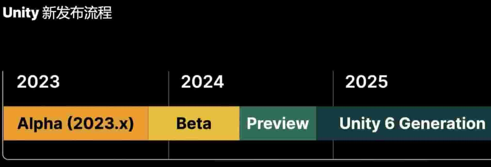

主要就是 Unity 2022 以后随着每一个版本进行变化时发现这个版本更新太快了，很难按照每年更新一个大版本来命名，为了简化开发者使用 Unity 的项目流程，Unity 把版本号从 2022 等降到 Unity 6 及后续的 Unity 7 的方式进行命名。

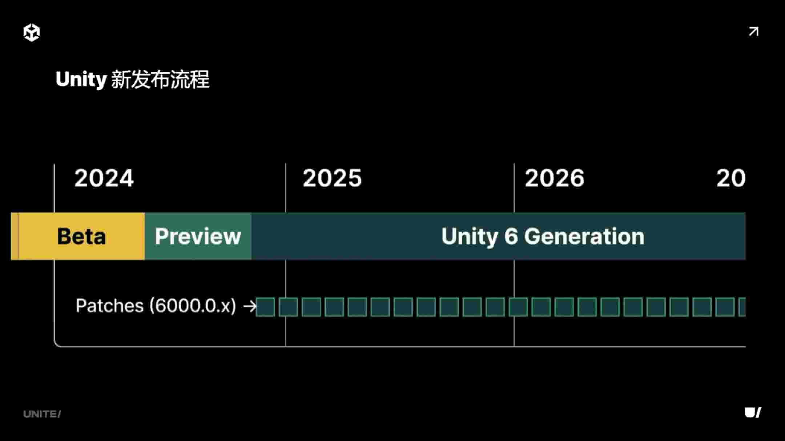

Unity 6 的产生是基于 Unity 2023 的 Alpha 版本、Beta 版及预览版，在这个预览版之后，10 月 17 日发布了正式版 Unity 6，其实就是 Unity 6.0.23V1 版。这个版本会按照 LTS 即长期支持的方式支持 2 年，也有额外一年的支持，确保 Unity 两个版本之间有重叠。

在 Unity 6 之后还有 Patches 的版本，也就是在 Preview 之后每隔一周或者是最多 4 周针对一些 Bug 或安全合规性的修复，尽量减少每一个引擎版本升级对已有项目的影响。

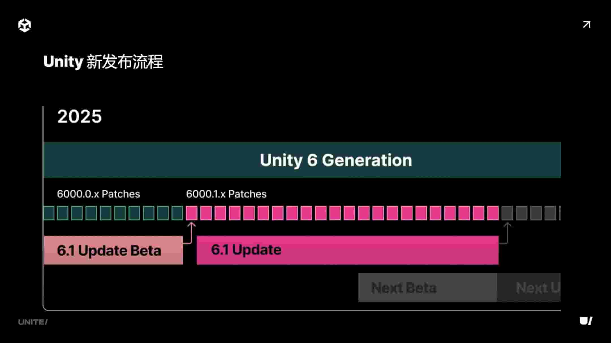

如果有大的修改怎么办呢？比如说 iOS 出了 17、18、19，安卓出了更高的版本，或者是突然出了一个新功能必须要求支持。这些大的改动会放在 Unity 6.1 的版本做。但是 Unity 6.1 并不是把新功能全放在里面，也是挑尽量少的非常有必要的功能放在里面。Unity 6.1 大概会在明年 1 月份进入测试阶段，也是 Beta 版，预计到明年 4 月份发布。Unity 6 最新技术做的短片，里面用到了 HDRP 的最新改进、APV 的更复杂的照明选项、场景混合和烟雾照明、GPU Resident Drawer 的性能提升，以及 VFX Graph 和 Shader Graph 等强大的艺术家工具。还包括 AI 相关功能，使用了机器学习做角色动画。场景里有大量的植被，我们使用 Houdini 将这些资产分散开来，并将它们作为点云导出到 Unity，然后将它们转换为 DOTS ECS 实体。这种方法使我们能够处理大量植被，最多有近 850 万个活跃的植被，但传递给图形系统的实体不到 50 万个。

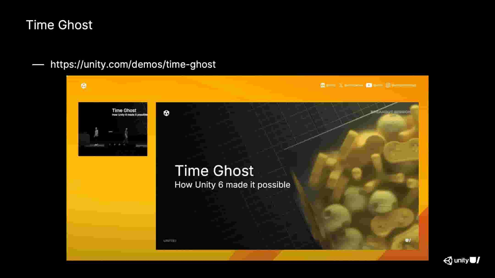

大家如果感兴趣可以去 Time Ghost 官网了解和下载 demo 项目。我看网上有开发者使用 4070 的显卡就能以每秒 100 多帧跑这个 Demo，这个 Demo 包含各种各样的光照、SpeedTree、VFX graph、头发系统、相机的预览、昼夜变换等等，大家可以下载参考。

# GPU Resident Drawer

Unity 6 中还有哪些新功能呢？这是之前公布的 GPU Resident Drawer 技术。这项技术的好处是允许你高效地渲染更大更多细节的世界。这个技术是覆盖所有平台的，包括高端移动设备、PC、各种游戏主机。它将静态的对象从 CPU 传到 GPU 来优化 CPU 的成本，运用 GPU 遮挡剔除 (GPU Occlusion Culling) 通过减少每帧的过度绘制来提高性能。大家可以看到右上角的 batches 从上面的 137K 降到了 13K，帧率也从 18 帧提升到了 46 帧。这是一个开/关的功能，只要勾选一个选项就能使用这个功能了。

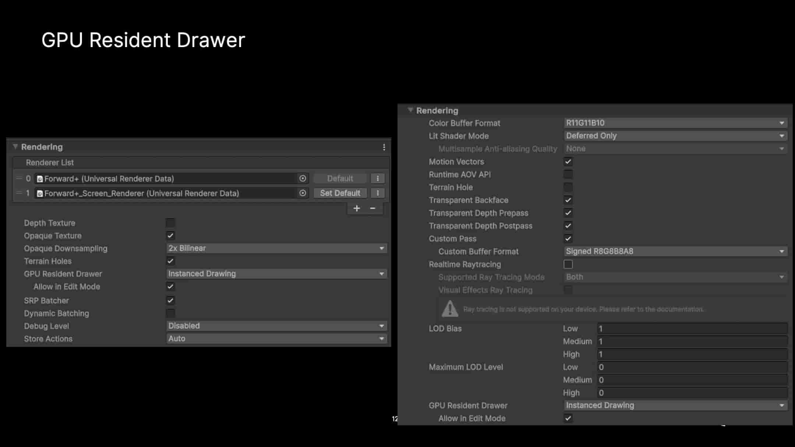

在 Unity 里，这个功能在 URP 和 HDRP 管线下都是支持的。直接选择对应的技术就可以开启对应的功能。当然在开启对应的功能下还要注意 BatchRendererGroup 变体剥离需要设置为 Keep All，否则独立播放器构建将不会渲染转换后的对象。在 URP 的管线下使用者功能必须处于 Forward+ 渲染模式。

# 自适应探针体积

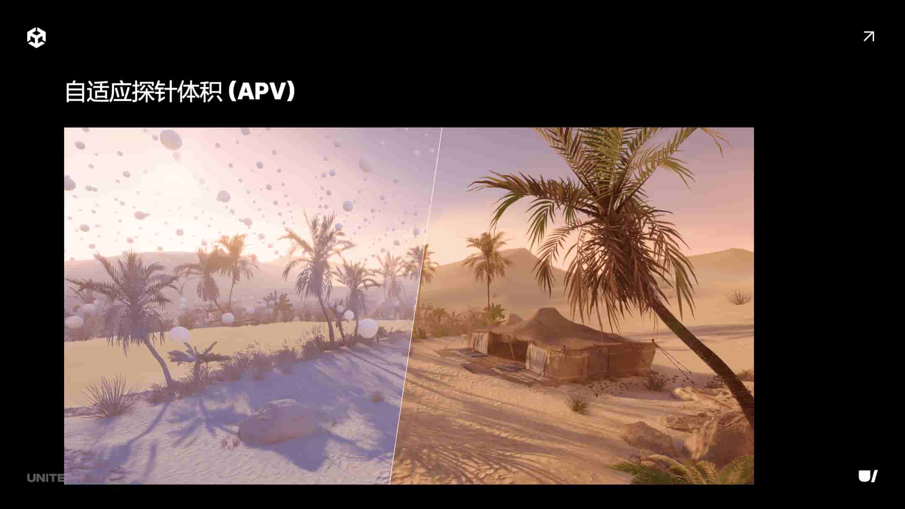

接下来要介绍的是 Unity 的 APV “自适应探针体积”功能，它主要是为了解决实时全局光照，否则烘 light map 就可能要做很多内存的消耗。Light map 也不能完整地解决昼夜变化、光照位置或者颜色变换等。

APV 还通过令人惊叹的光照效果提升了视觉效果，通过天空遮挡和场景混合实现了无缝过渡。Unity 新的光照烘焙架构现在为光照数据生成提供动力，即使在低内存 GPU 的设备上也能高效运行。

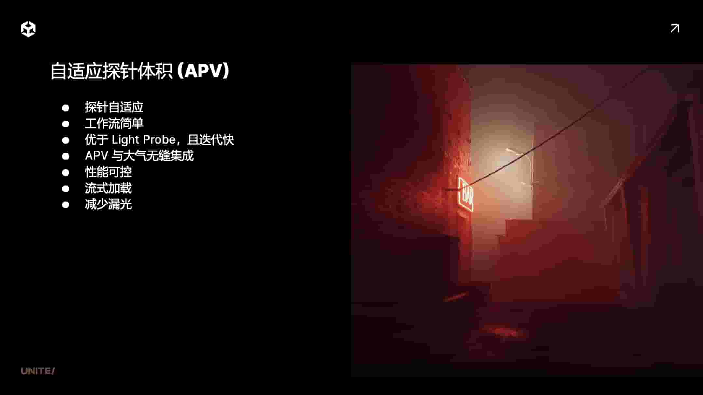

自适应探针体积有几个特性：首先是探针自适应。在物体比较密集的地区，比如说当前场景的座椅摆放得比较密集或者是桌子上有很多东西，这个探针带的光照小球就比较密，如果是比较宽泛的场景，这个探针间距就比较稀疏。工作流程也非常简单，拖一个组片进去就可以了。效果比 Light probe 好非常多，而且很容易迭代多个版本。能和 Unity 中大气效果无缝集成在一起。在性能方面，有多个选项，可以根据不同的设备来选择相关的性能指标。也是使用流式加载，可以减少内存和资源的占用。在漏光方面也进行了很多处理。

接下来就每一项详细地看一下。

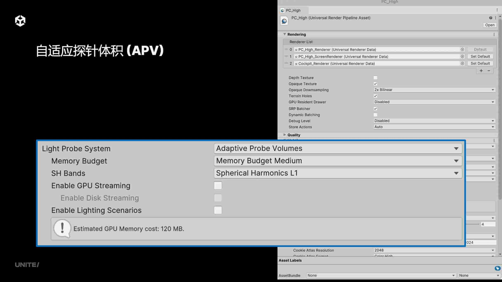

如果要开启 APV 这个功能，第一要找到它对应的管线项目，以 URP 为例，我们要找到 “Universal Render Pipeline Asset” 中找到对应的 Light Probe 选项，打开 Light Probe System，这里可以看到 Adaptive Probe Volume 这个选项。

开启之后就有内存使用量的显示，有高中低，如果在内存紧张的设备上就选低内存的。下面的选项主要是球谐函数用的等级，L1 等级是一个普通的等级，如果大家想获得更好、更精准的计算结果可以选择 L2 的等级。L2 虽然说计算精度提高了，但占用系统资源就会更多一些。

下面还有 Enable GPU Streaming 这个选项，在启用 APV 功能时，就把自适应探针的数据从 CPU 端传到 GPU 使用，可以打开流式传输的功能，特别适合非常大的技术场景使用。而且在加载时又是优先加载在摄像机对镜头范围内的数据。

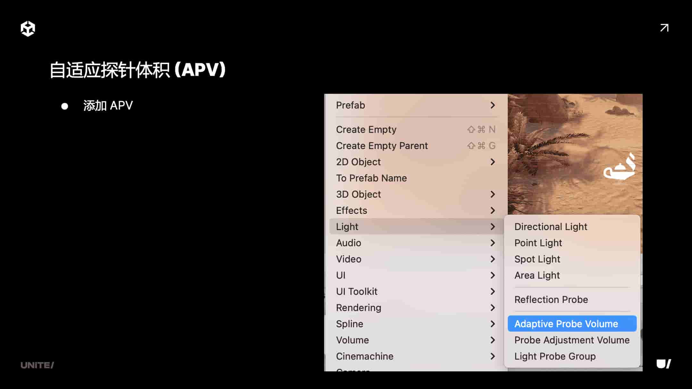

在场景中添加 APV 非常简单，直接在 hierarchy 点击右键选择 “light” 组件，然后选择 APV 菜单项就可以。

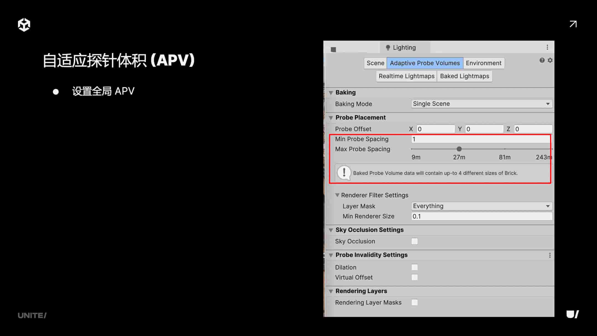

在使用这个功能时还要做一个全局的设定，因为它会有很多关于距离的参数等等。我们打开 Lighting 设置面板，找到 Probe Placement 这一项，下面有可以控制最小和最大的探针间距，决定了探针的数量，如果数字越小就越密集，以根据周围的几何形状创建多个细分级别。默认情况下，密集区域将使用最高分辨率，而几何形状较少的区域将使用较低的密度级别。也就是说当前 Min Probe Spacing 是 1 就是 1 米的单位，当前最大设定的是 27，就会用 27 米的单位。这样也是为了保证，比如说当前开一辆车到非常空旷的地区，这个空旷地区也有对应的数据可以较好地还原。

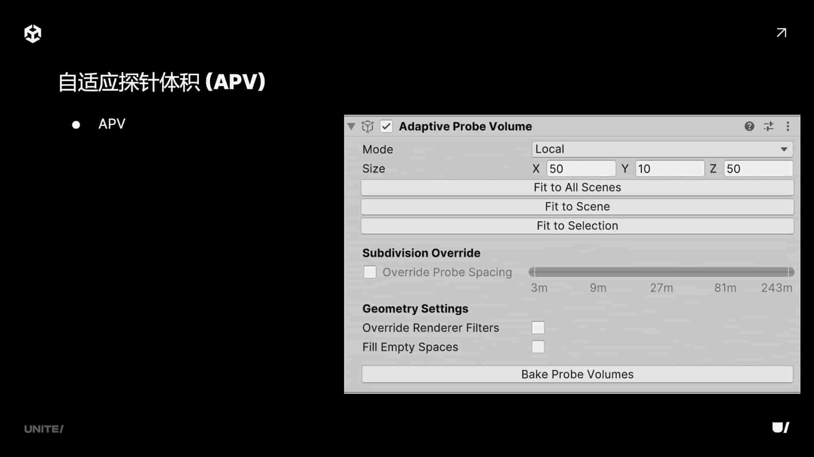

再回到刚才创建的 APV 组件，这个组件上有几个选项。首先它的模式，local 模式是常用的，以自身坐标系计算，设置大小是长宽高。到底用多大才适合呢？Unity 也提供了几个选项，一个是 Fit to All Scenes，这个选项的意思是当前编辑多个场景，就用一个 APV 组件覆盖所有场景；如果要选 “Fit to Scene”，就是当前这个 Scene 去处理；如果是 “Fit to Selection”，就是在场景中选中了一个组件，直接选 APV 属性把刚才选中的物体的边框作为一个最大值去做显示。同时每个 APV 可以重新设定自己渲染的间隔距离。

当这些参数的大小设定好，只需要点击 “Bake Probe Volumes” 这个按钮，就把当前 APV 数据进行烘焙，可以在场景中看到了。

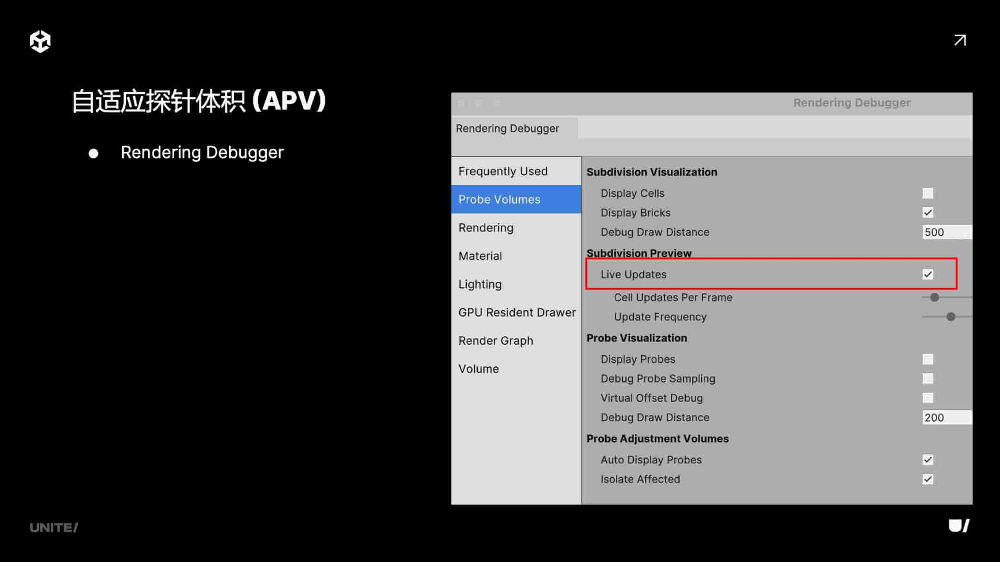

这里面也有一个对应的调试面板 Rendering Debugger，其中 Probe Volumes 是 APV 的选项，一般来说可以开启 Live Updates，意思是可以实时看到当前的 APV 组件对当前区域的细分情况。

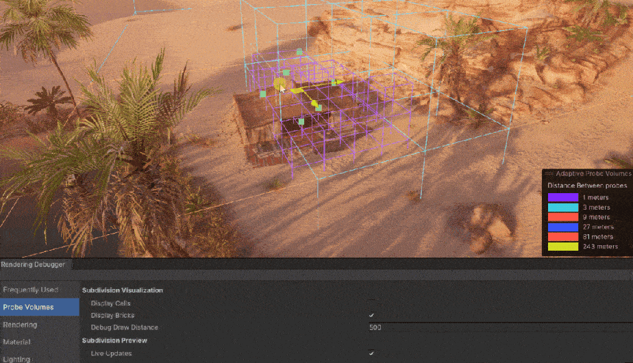

通过动画来看一下，比如让 APV 适应当前这个大帐篷，或者是把它的适应范围再调大一些，随着拖动的场景里就可以看到这些框的颜色不太一样，右下这部分也会列出来每个颜色对应的 Probe Volumes 间距。几何形状更多，它的细节就更多，用更低的间距去产生光照探针。

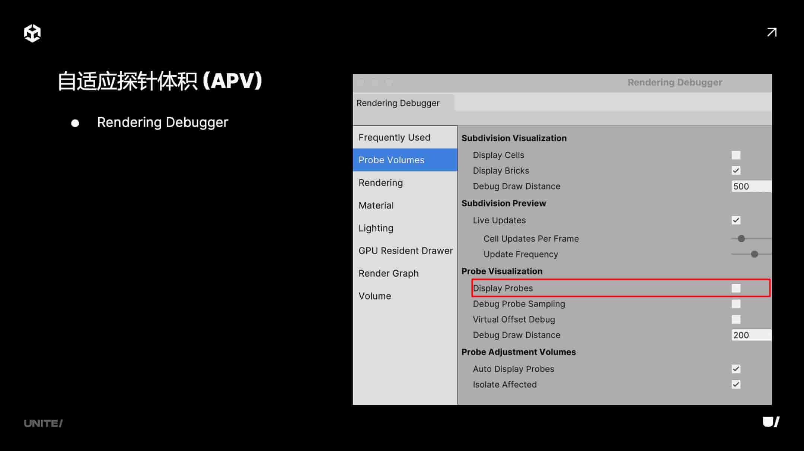

当然我们可能也会想现在只是格子，到底产生了多少个光照探针，密度有没有更加明确能看到的地方呢？只需要开启 Display Probes 这个选项，就可以看到有很多个小球在里面，以及当前多个细分的级别。

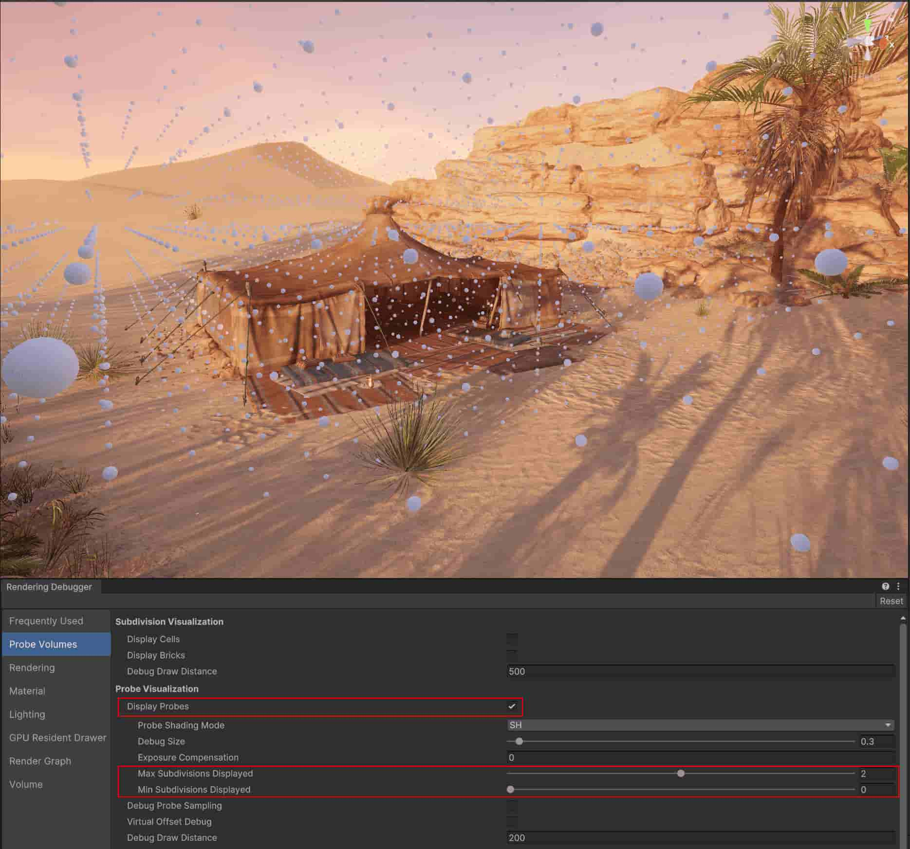

接下来要说的是漏光问题。既要保证数据的精度又要减少数据量，这两者之间去平衡时就会遇到这个问题。帐篷下面挡得严严实实，怎么会变成一个底下都是亮光的效果呢？一旦出现这个问题原因就是分辨率比较低，或者是墙壁太薄，比如帐篷就是薄薄一层布。

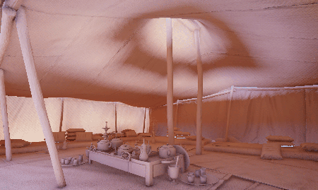

我们看一下这个问题应该怎么办。首先可以打开 Debug Probe Sampling 这个功能，允许开发者显示每一个采样探针及相关的权重。

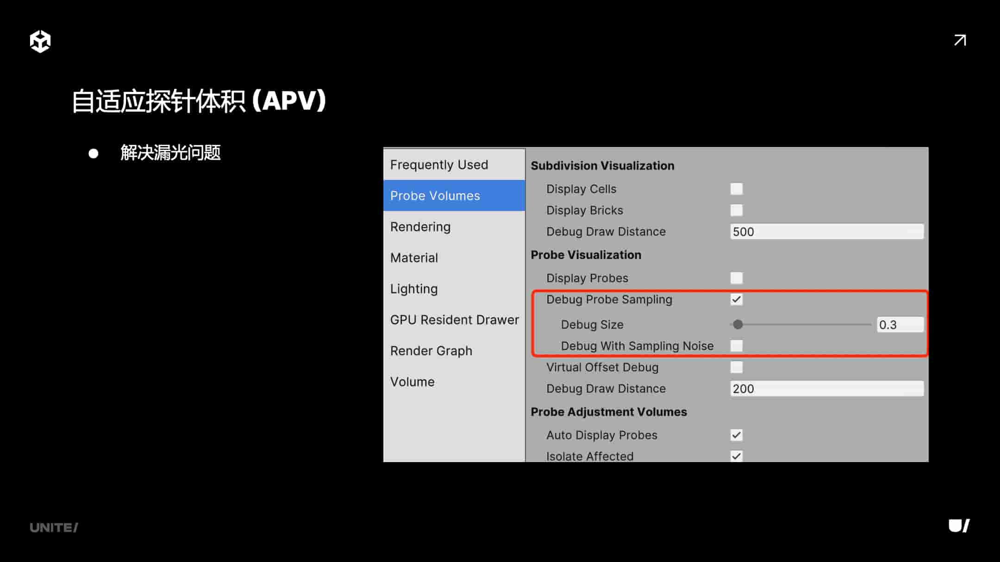

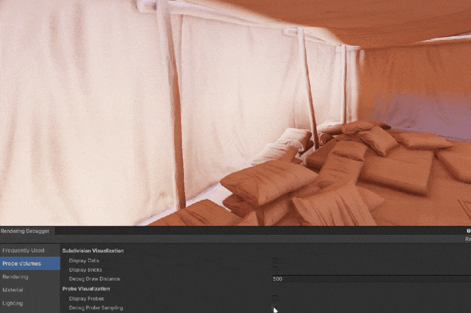

我们到帐篷里就可以看到每个小球上都有权重的数值。这个结果是因为外面比较亮的光照探针和内部比较暗的探针进行了插值，而理想的情况是帐篷里的探针只和帐篷里面的探针进行插值，帐篷外面和外面的进行插值。这里把帐篷外面比较亮的光插值到帐篷里面比较暗，就导致出现了漏光。

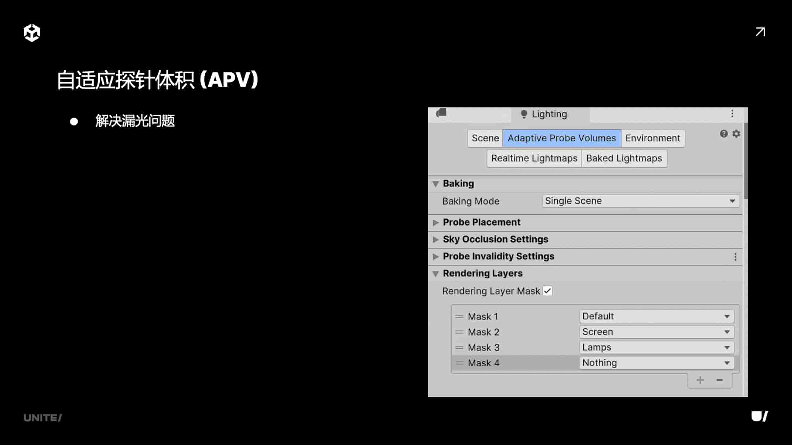

为了解决这个漏光问题，Unity 又在 APV 增加了渲染层级的概念，可以创造最多 4 个不同的层级，尝试在不同区域使用不同的层级来解决和避免漏光的问题。

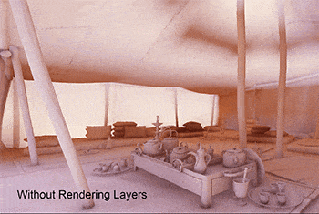

当前，使用了层级就可以看到漏光的问题基本上比较好地解决了。缺点是这块需要手动指定层级，没办法全自动。大家在遇到类似的问题时就可以通过这样的方式尝试避免。

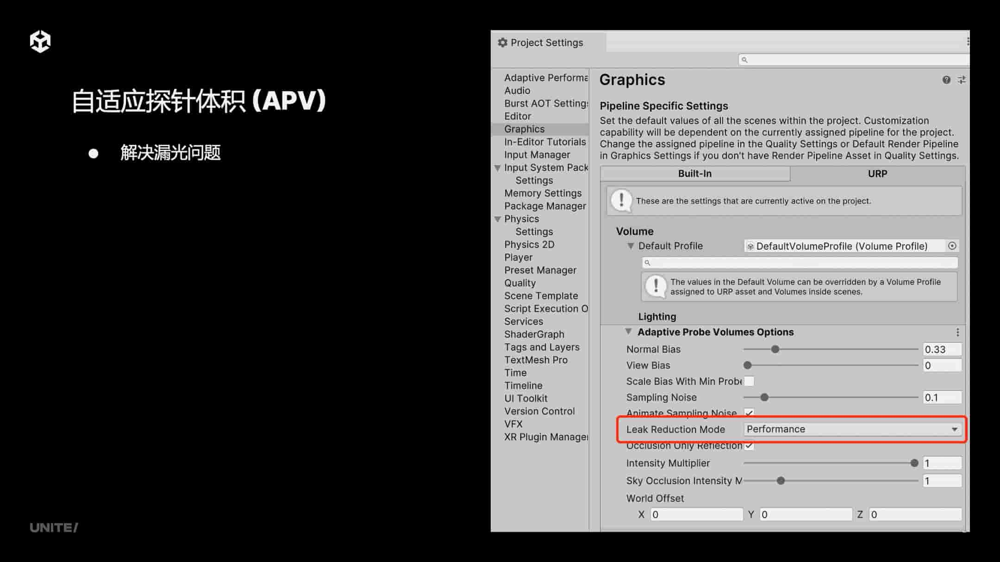

我们这里还有 Leak Reduction Mode 模式，这个模式也是为了解决漏光的问题。当前是 Performance，更加注重速度；还有一个 Quality 质量模式，能更好地解决漏光的问题，可以确定当前探针采样的位置，尝试避开一些无效的探针。根据探针的配置有时候不一定能够计算出这个位置是否适合，还是需要手动的修正，但是这个功能可以解决一部分。可能轻微的漏光直接开启质量模式就可以解决。

如果开启了质量模式，明显能够看到帐篷外面的小球的权重已经是 0，帐篷里面的小球和帐篷里面的小球之间进行插值，所以新的质量模式有助于确保更少的漏光情况。

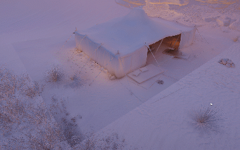

解决完漏光之后，光照探针随着密度的不一样，还有接缝的问题。从当前的动画上可以看到在房子的周围有一个阴影的部分，这就是接缝问题。不同光照探针等级在过渡时如果生硬，过渡的地方就有接缝的问题，Unity 也提供了解决方案。

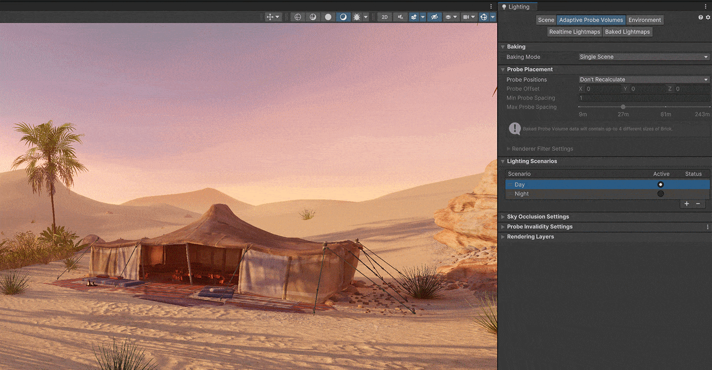

首先加入了一个 Lighting Transitions 的功能，这个功能能够实现一些简单的过渡。Unity 尝试在烘焙之间用预测的值实现简单的过渡，来解决接缝问题，但还是有一定明暗的区分。

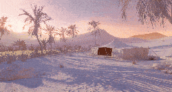

Lighting Transitions 功能主要是为了解决当前场景随着不同环境光的变化而有较大的变化。生活中最常见的是昼夜变换的例子， Unity 可以混合来自多个场景的间接漫射光，以创建白天和夜晚之间的平滑过渡。这是通过使用 ProbeReferenceVolume API 公开可以动画化的混合变量（例如，使用 Timeline）来实现的。

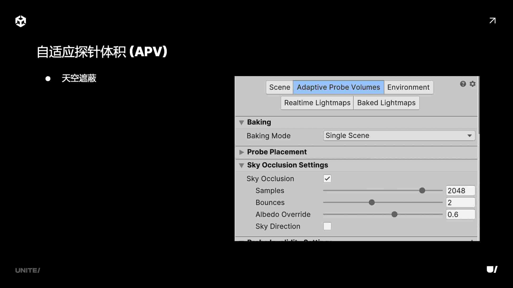

和 APV 一起的还有一个天空遮蔽，大家打开 APV 选项里可以看到 Sky Occlusion Settings。天空遮蔽为管理场景中的光照过渡提供了一种替代光照场景的方法。它涉及一个更简单的设置，只需一次烘焙，无需多个场景。天空遮蔽专门处理天空光照，因此不会扩展到管理定向光或精准光的间接光照。

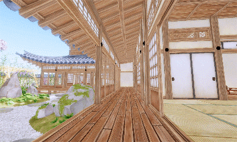

使用天空遮蔽的效果可以通过当前这个动图看到。场景内外根据天空是有较大差别的，尤其是走廊和室内更加暗一些。但是天空遮蔽会有一个额外的数据的产生，这个数据存储了场景中每个区域应接收的天空光照量。数据量会多一点，但是效果会好一些。

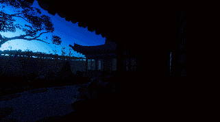

遮挡数据与环境设置中的渐变模式相结合，达到昼夜变换和明暗变换的效果，和天空能够比较好地结合在一起。

# **Render Graph Viewer**

详细介绍 APV 之后，接下来详细介绍一下 Render Graph Viewer。Unity 2022 就尝试推出 Render Graph，当时只是体验版。在 Unity 6 中推出了 Render Graph Viewer，主要是让当前的渲染管线可视化，一眼就能看出来这条管线上干了什么，在干这件事情上调用了哪些资源，它的前后结构流程是什么样的。

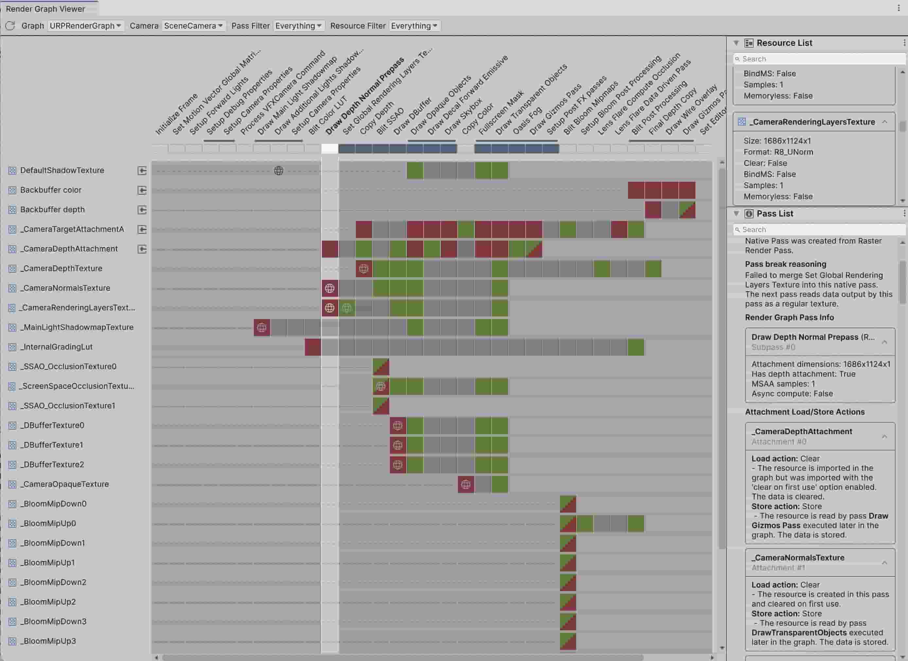

大家可以看这张图片，左侧列出了对应的资源，比如说 CameraTargetAttachmentA 等等这些 RT 贴图，上面列举了每一个对应的 pass，每一个 pass 下面都有一个蓝色的小方块，这个小方块用鼠标一点就会跳到对应 pass 的代码，可以更好、更快找到对应 Pass 实现的功能。

在每个 Pass 下可以看到，比如当前 CameraTargetAttachment 贴图，首先遇到第一个红色，这个红色是写入的过程，它遇到了 Draw Depth Normal Prepass，这个 pass 第一次用到了当前的 RT。紧接着是一个灰色，灰色表示空了一个 Pass，然后在下一个 Copy Depth pass 去执行了读取的操作，到了下一个 Pass 又是读取的操作，紧接着是写入的操作。通过这个图片就可以明确地看到，哪些 Pass 操纵了哪些资源，是怎么操纵的。这有利于我们在写渲染管线代码时更加明确了解到这么写是否符合预期，方便查看。同时也限制了写 Pass 的整个过程更加严格，而不是随随便便在某个代码里插入一个立即执行的渲染。

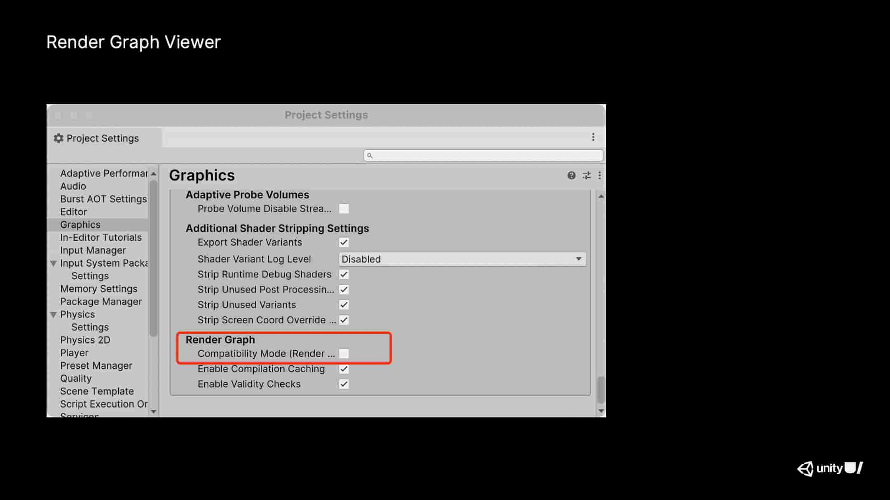

这个功能用下来也比较简单，一些老的项目升级到 Unity 6 之后，只需要把选项关闭掉就可以了，剩下的代码可能略微改一改。

下面还有两个选项，第一个是 Enable 编译的缓存，因为渲染管线每次都有缓存，启用后，URP 会尽可能使用上一帧中已编译的渲染图，而不是再次编译渲染图，这样可以加快渲染速度，如果不使用的话要每次进行更新。第二是做有效性的检查，URP 会在编辑器和 development build 都做有效性检查，正式发包就不做有效性检查，以提高运行速度。

# **Unity 构建配置**

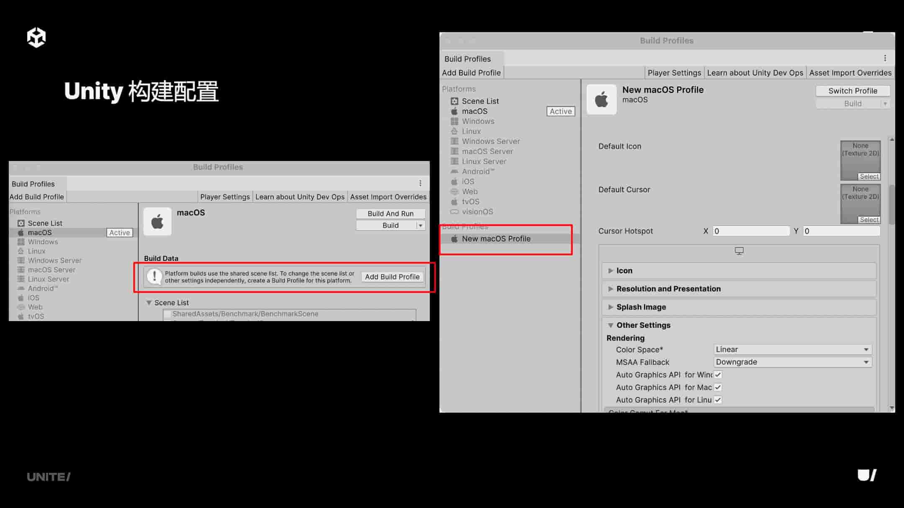

还有一个新功能是 Unity 的构建配置。以前大家在编译的时候会写代码去实时修改当前导出的 Unity 到 iOS 或安卓的版本，现在每个构建都有对应的配置文件，出版本时选择一个对应的配置文件就可以了，而不是每次写很多代码去改，方便打包使用。

# 多人游戏

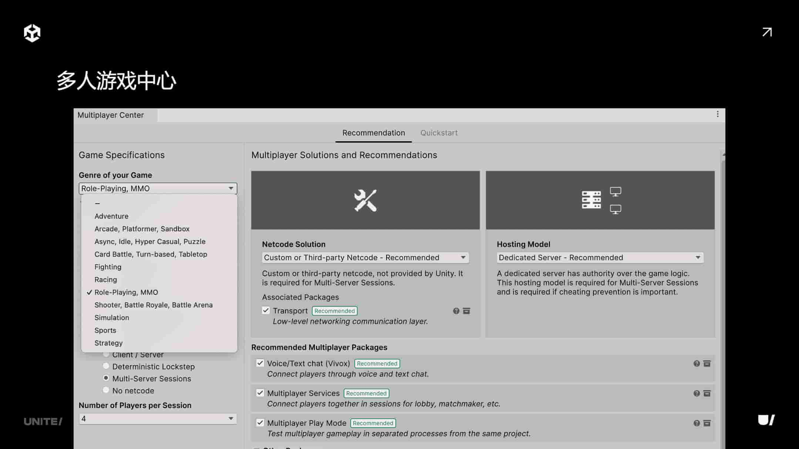

在多人游戏方面，Unity 也做了更多的支持，它提供了一个精选列表，其中包含与你的项目相关的所有多人游戏工具和服务，可在需要时随时使用。比如左侧有冒险游戏、MMO 等等，右侧会自动配置当前 Netcode Solution 模式、主机模式等，减少了很多技术选择和技术配置的过程。

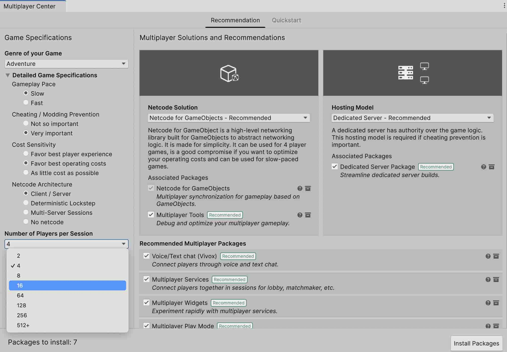

下面也有不同玩家数的支持，当你验证游戏玩法时，部署也是非常快的。而且多人游戏模式 (Multiplayer Play Mode) 允许从磁盘上的相同资源启动最多 4 个独立的轻量级编辑器进程来即时验证你的游戏玩法，直接在编辑器上就可以进行调试了。

# Profiler

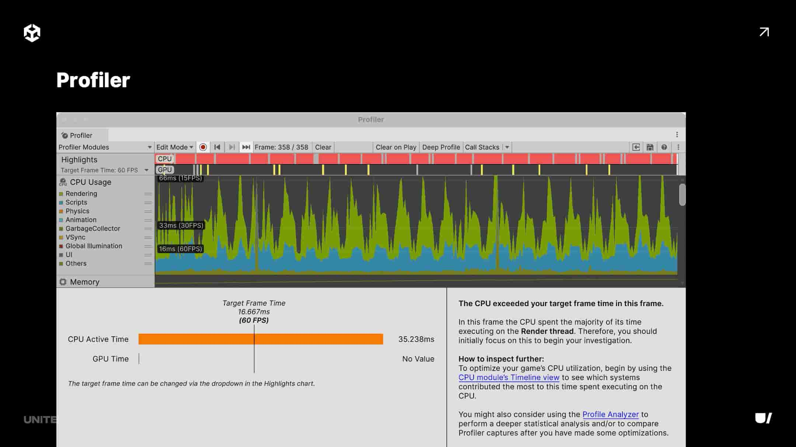

另外是 Unity 的 Profiler，因为大家比较关注的就是 CPU 和 GPU，所以 Unity 6 包含一个新的分析器亮点模块，可以立即显示优化重点区域（CPU 或 GPU）。

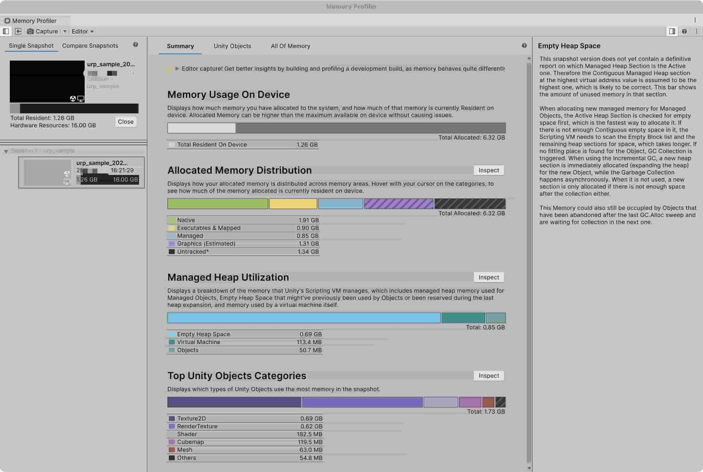

在大家关注的内存方面，Unity 6 也在 Memory Profiler 里面提供了准确的常驻内存使用情况，并按资源细分图形内存，以便更快、更高效地进行优化。

# 后续功能

接下来介绍几个 Unity 后续的功能。

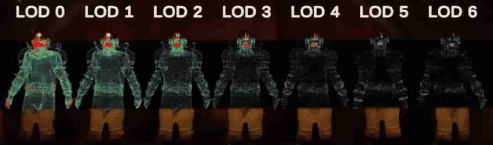

第一个后续功能是 MeshLOD，之前可能大家都是通过手工或者是其他工具来做 Mesh 模型的分级，Unity 6 后续的 MeshLOD 功能只需要在 Mesh 导入的时候设置产生 MeshLOD 选项就可以了。这里面分成了 7 级，LOD 0 是最完整的 Mesh，中间 mesh 的顶点数面数逐渐减少，一直到 LOD 6。

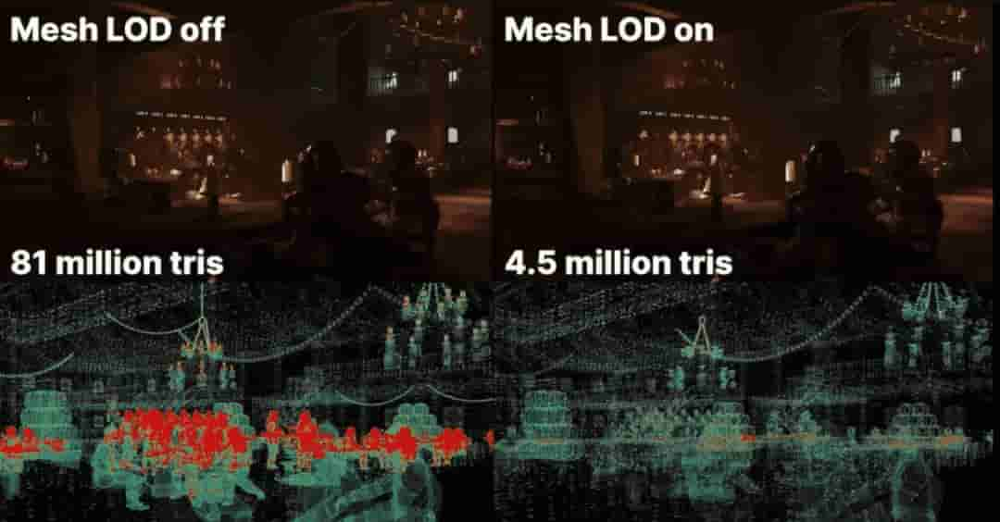

好处是三角面真的少了，比如说 MeshLOD 关闭的时候大概有 81 M 的三角面，但是开启了 MeshLOD 之后在渲染时可以明显看到重叠部分变少了。

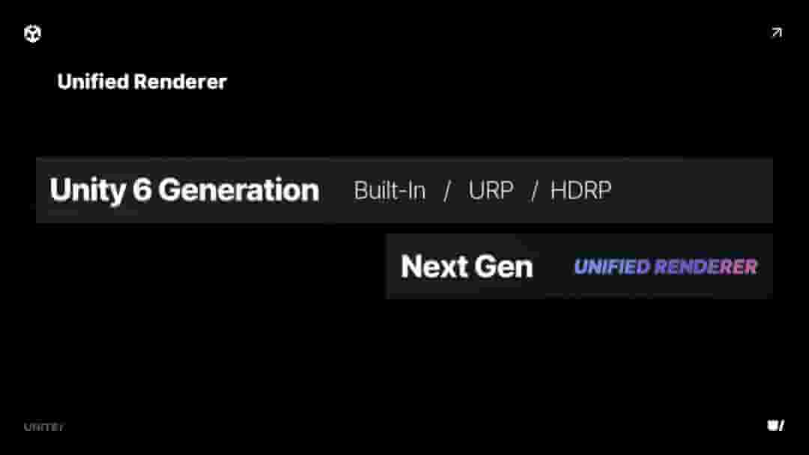

第二部分是统一渲染。大家也知道在 Unity 里有很多渲染管线，比如常用的内置渲染管线，以及 URP 和 HDRP 管线，这些管线之间不怎么互通。在 Unity 6 后续尝试把它们统一起来，变成 Unified 渲染管线。主要是把 URP 和 HDRP 的后端进行重构，把数据和逻辑的部分进行分离，根据当前开发者的配置和选项切换对应的渲染管线。

有的开发者会说之前用高清渲染管线挺好，现在还能继续用吗？当然是可以的，这也符合开发者当前的习惯，只是在管线的后端进行切换。Render Graph 也可以自定义，这些都是没有影响的。

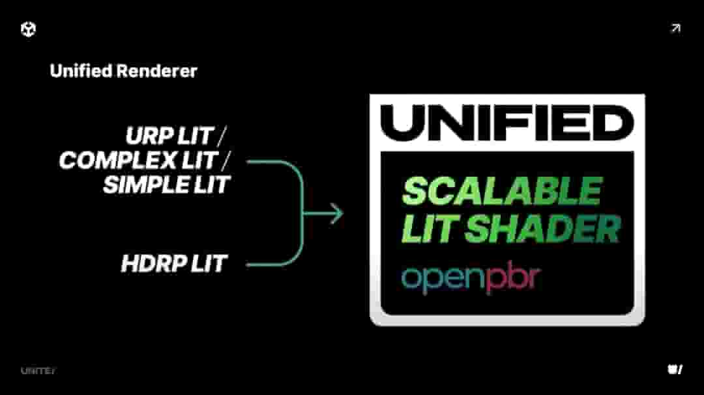

同时，在统一渲染管线的这一刻，还把 PBR 进行了统一。因为 PBR 实际上到了各个渲染引擎和各个层级，每一个公式都进行了的不同程度的优化和改动。Unity 在统一渲染管线的过程中，也标准化了新的统一光照着色器，它是基于 OpenPBR，是美国学院软件基金会托管的开源 PBR 标准，方便大家在 Unity 和其他的艺术软件之间以标准化的形式进行创作。Unity 支持了从用于低端设备的简化的照明模型，一直到具有最高保真度的功能最强大的设备。

更多的功能可以到 Unity 的 Roadmap 页面查看，也希望大家能够把自己以想要的功能在 Roadmap 里提交：

https://unity.com/roadmap