# 功能简介

该工具适用于某项目国内和海外版的策划表格检查，能够发现一些数值类型不匹配、数值重复、跨表索引丢失、数值越界等常见问题。具体检查规则有专门的编辑器可以配置，开发者无需代码经验也能轻松玩转表格检查。

# 安装和启动

## 插件安装

首先，这个工具需要在Unity中运行。其目录为：“Assets/CSVCheker/”。

## 工具启动

首先，用Unity打开工程。在菜单栏中选择：“CSVCheker/选中现有的规则文件路径”。

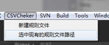 

之后会看到这个界面：

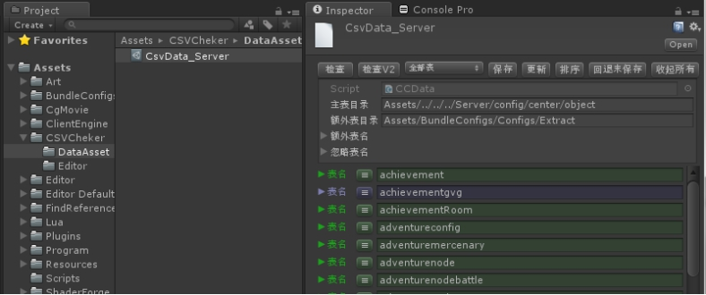 

如上图，Project窗体会自动选中规则文件，同时Inspector面板会显示规则文件中的详细设置。后面我们编辑规则、执行检测就是在这个Inspector面板操作的。蓝色表示该表格尚未做过规则限制，绿色代表已经做过规则限制。

 

# 检查范围

示例项目的表格是导出为多份csv的，一份在客户端、一份在服务端；csv文件的名字即为表的名字。其中客户端csv文件名规定以大写字母开头，服务端csv文件名规定以小写字母开头。服务端csv文件的信息相对重要，因为是关系到游戏数值逻辑的；而客户端csv文件信息仅跟前端表现相关，相对次要。所以我们检测表格数据主要是检查服务端表格数据。客户端表格我们挑选其中容易出错的、重要的、并且没有被服务端表格所包含的那部分补充到检查的范围中。关于检查范围的配置，面板外观如下图：

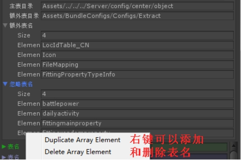 

## 主表目录

面板中【主表目录】，填写的是服务端csv目录的相对路径：

Assets/../../../Server/config/center/object

这样检查的范围将包含这个目录下的所有csv文件（【忽略表名】除外）。

 

## 额外表目录

面板中【额外表目录】，填写的是客户端csv目录的相对路径：

Assets/BundleConfigs/Configs/Extract

这样检查的范围将额外包含这个目录下的一部分（配置在【额外表名】中）的csv文件

 

## 忽略表名

面板中【忽略表名】，填写的是服务端csv目录下，那些不希望被检测的表名，这类表通常是没有列名的表，工具是无法正常识别的，所以要排除。

 

# 编辑检查规则

设定完检查范围，接下来就要设定检查规则了，主要分为以下6步：

## 同步最新的表结构

设定规则之前，我们应该通过svn把项目更新到最新，然后点击面板中的【更新】

 

在弹出的确认框中选择【确认】

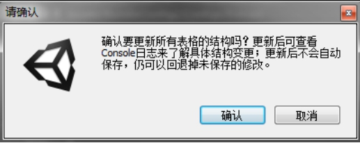 

然后可以到Unity自带的Console窗体去查看更新日志：

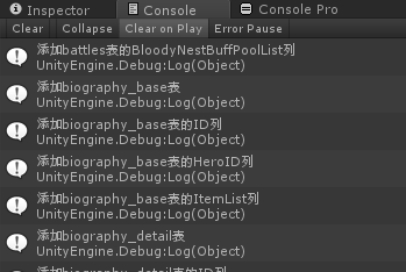 

如上图，新增的表和列，以及过时的表和列都会从日志上打印出来。并且把表结构数据更新到表格检查工具面板。之后可自行选择保存或者回退。

 

 

## 设定唯一性规则

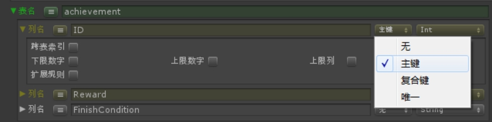 

如上图，以成就（achievement）表为例，它的ID列是可以唯一标识一行数据的，所以要设置为【主键】，或者【唯一】。这样表格中一旦发现有两行数据的ID是相同的，就会打印详细的错误日志。

 

同理，【复合键】是指该列和其他【复合键】的列共同唯一标识一行数据。所以一个表的复合键只可能是没有或者多个。这样表格中一旦发现有两行数据的所有复合键取值都是一致的，就会打印详细的错误日志。

## 设定数值类型

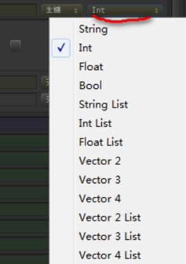 

如上图，点击数值类型的下拉菜单，可以选择如上的数据类型，默认没有选过就是字符串（String）类型，如果该列不必检测可以不用修改数值类型，就用默认的String就好了。注意以Vector开头的类型，其数值既可以是浮点数，也可以是整数。不同类型的数据，会对应有不同的规则设置面板。

## 设定映射

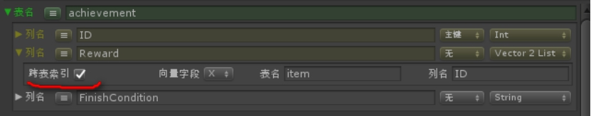 

勾选【跨表索引】，则需要填写表名（区分大小写）、列名（区分大小写）。如果是Vector类型，还需要指明索引的是Vector结构的x、y还是z。上图的意思是，每个成就对应的奖励，要在item表中能找到对应的物品ID，否则报错。

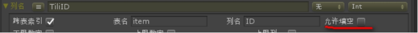 

上图展示了另一种情况，即该列为Int型，那么还要选择是否勾选【允许填空】，因为int型如果留空的话等于填了一个0，而我们所有的表格索引，取值都是大于0的，为0就会报错。所以只有勾选【允许填空】，才会忽略这类报错。

## 设定上下限

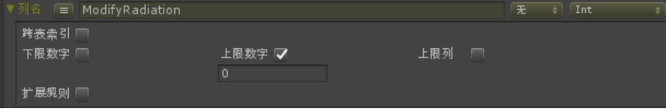 

上图的列是“辐射调整值”，表格里填写的数字都是负数或者0，所以我们设定规则为：勾选【上限数字】，并设置上限数字为0。这样一旦填写了正数，就会报错。

 

同理，如果勾选【上限列】，则需填写该表的某一列的列名（区分大小写），这样取值一旦超过了上限列的取值，就会报错。

## 设定扩展取值规则

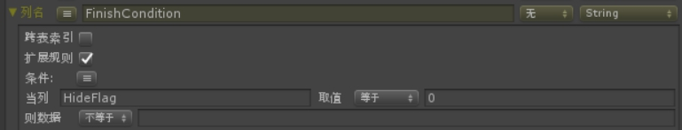 

上图是任务（task）表的一个例子。FinishCondition意为任务的完成条件，类型为string。我们规定当HideFlag列 取值等于0的时候，FinishCondition列不允许填空字符串。否则报错。

设置的时候需要勾选【扩展规则】，【条件】这里点击按钮可以无限追加条件，如下图

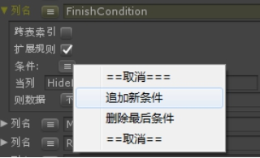 

当有多个条件的时候，可以选择连接方式【并且】、【或者】。

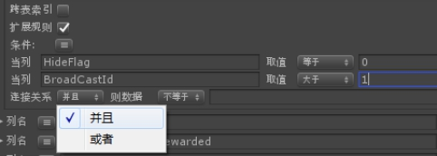 

设定好条件后，如果出现不满足条件的数据，都会在console下打印报错日志。

 

 

# 保存和回退

当设置好所有规则后，规则文件并不会自动修改，此时我们可以选择保存（将当前面板数据写入文件）或者回退（按当前文件内容重新加载数据到面板）。

## 保存

点击【保存】按钮则会保存

 

## 回退

点击【回退未保存】按钮则会回退（需要二次确认）

 

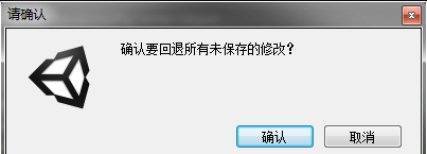 

 

# 执行检查

## 执行范围

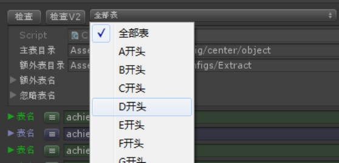 

如上图，在选择检查范围的时候，我们可以选择检查所有表格，或者只检查一种首字母的表格。

然后，点击【检查】则检查v1版本的表格；点击【检查V2】则检查v2版本的表格。

执行检查需要二次确认如图：

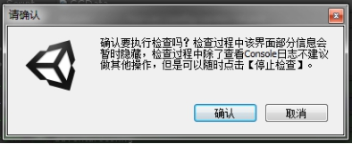 

（注：目前只有国内版区分v1、v2两套表格数据，海外只有v1版本。

如图：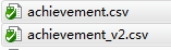这两个表的表名都是achievement，国内v2版本在文件名上加了“_v2”后缀。表格检查工具中用到的所有的表名均不包含这个后缀。并且海外版是没有achievement_v2.csv这个文件的。）

## 执行过程与中断执行

点击【检查】或【检查V2】之后，检查工具会稍微卡住一会儿。然后界面会暂时变成

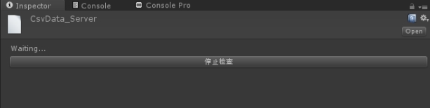 

此时Unity不会卡住了，我们可以点击【停止检查】来随时中断检查，或者等待检查结束。

也可以切到Unity自带的Console窗体实时查看检测日志，如下图：

 

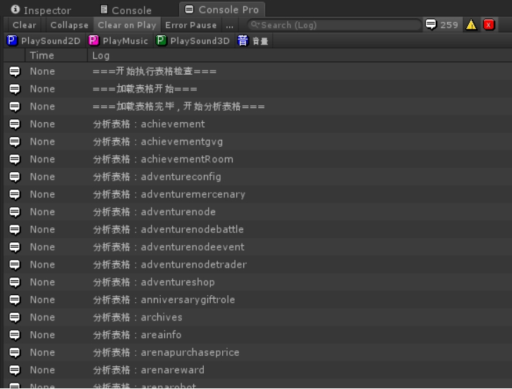 

可以看到，白字代表正常的检测进度，如果有红字，则为报错。

（上图用的是ConsolePro窗体，要比Unity原生的Console视觉上好一些，功能都是一样的。）


# 提交到SVN

如果你编辑并保存过这个检测工具的设置，那么记得要提交这个文件：

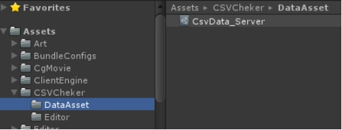 

如果担心这个文件有其他人和你在一起编辑，提交的时候可能产生冲突，也可以先对这个文件getlock（拿锁）然后再改。当然这个文件是文本类型的，也有一定的自动合并能力。所以即使多人不拿锁的修改也有彼此正常合并的可能。


# 源代码

目录结构如下：

```c
|——CSVCheker
|		|————DataAsset
|		|		|——————CsvData_Server.asset
//最终数据保存在这里（上面挂了CCData脚本），点击即可看到操作面板
|		|		|——————CsvFolderPath_Server.txt
//txt文件记录内容为多个路径，中间用分号分隔。第一个是主目录，第二个是次要目录，之后都是次要目录中要包含的表   //Assets/../../../Server/config/center/object;Assets/BundleConfigs/Configs/Extract;LocIdTable_CN;Icon;FileMapping;FittingPropertyTypeInfo
|		|————Editor
|		|		|——————CCCheckLogic.cs
|		|		|——————CCDataEditor.cs
|		|		|——————CCMenu.cs
|		|		|——————CCReader.cs
|		|		|——————CCRow.cs
|		|————CCCol.cs
|		|————CCData.cs
|		|————CCLog.cs
|		|————CCTable.cs
```

## 常规代码

### CCData.cs

```c#
using System.Collections;
using System.Collections.Generic;
using UnityEngine;

namespace CSVChecker
{
    public class CCData : ScriptableObject
    {
        public System.Action<CCData> CheckCallBack;
        public System.Action CancelCheckCallBack;
        public System.Action RevertRemoveTableCallBack;
        public System.Action RevertRemoveColCallBack;
        public System.Action<CCData> UpdateAllCsvCallBack;
        public System.Action ForceReserializeAssetsCallBack;
        public TextAsset PathFile;//如果其内容带冒号则为绝对路径，否则为相对路径
        public List<string> 忽略表名 = new List<string>(); 
        [HideInInspector]
        public List<CCTable> tables = new List<CCTable>();
        public bool IsChecking { get; set; }
        //首字母，如非空则单独检查
        public string FirstCheckLetter { get; set; }
        public CCTable GetTable(string TableName)
        {
            for (int i = 0; i < tables.Count; i++)
            {
                CCTable t = tables[i];
                if (t.TableName.Equals(TableName))
                {
                    return t;
                }
            }
            return null;
        }

        [ContextMenu("执行检查")]
        private void DoCheck()
        {
#if UNITY_EDITOR
            if (IsChecking) return;
            if (CheckCallBack != null)
            {
                CheckCallBack.Invoke(this);
            }
#endif
        }
       
        [ContextMenu("终止检查")]
        private void StopCheck()
        {
#if UNITY_EDITOR
            if (CancelCheckCallBack != null)
            {
                CancelCheckCallBack.Invoke();
            }
#endif
        }
        [ContextMenu("表格按名称排序")]
        private void SortTable()
        {
            if (IsChecking) return;
#if UNITY_EDITOR
            GUI.FocusControl(null);
            UnityEditor.EditorGUIUtility.editingTextField = false;
#endif
            tables.Sort(CompareTableName);
        }
        private int CompareTableName(CCTable a, CCTable b)
        {
            return string.Compare(a.TableName, b.TableName);
        }
        [ContextMenu("保存")]
        private void Save()
        {
#if UNITY_EDITOR
            if (IsChecking) return;
            GUI.FocusControl(null);
            UnityEditor.EditorGUIUtility.editingTextField = false;
            UnityEditor.EditorUtility.SetDirty(this);
            UnityEditor.AssetDatabase.SaveAssets();
            UnityEditor.AssetDatabase.Refresh();
#endif
        }
        [ContextMenu("更新全表")]
        private void UpdateAllCsv()
        {
#if UNITY_EDITOR
            if (IsChecking) return;
            if (UpdateAllCsvCallBack != null)
            {
                UpdateAllCsvCallBack.Invoke(this);
            }
#endif
        }
        [ContextMenu("撤销删表")]
        private void Revert_RemoveTable()
        {
#if UNITY_EDITOR
            if (IsChecking) return;
            if (RevertRemoveTableCallBack != null)
            {
                RevertRemoveTableCallBack.Invoke();
            }
#endif
        }
        [ContextMenu("撤销删列")]
        private void Revert_RemoveCol()
        {
#if UNITY_EDITOR
            if (IsChecking) return;
            if (RevertRemoveColCallBack != null)
            {
                RevertRemoveColCallBack.Invoke();
            }
#endif
        }
        #region 字母
        [ContextMenu("部分检查_A字头表")]
        private void DoCheck_A()
        {
#if UNITY_EDITOR
            if (IsChecking) return;
            FirstCheckLetter = "A";
            DoCheck();
#endif
        }
//...中间略去B到Y的代码
       
        [ContextMenu("部分检查_Z字头表")]
        private void DoCheck_Z()
        {
#if UNITY_EDITOR
            if (IsChecking) return;
            FirstCheckLetter = "Z";
            DoCheck();
#endif
        }
        [ContextMenu("收起所有")]
        private void FoldAll()
        {
#if UNITY_EDITOR
            for (int i = 0; i < tables.Count; i++)
            {
                CCTable table = tables[i];
                table.FoldOpen = false;
                for (int j = 0; j < table.cols.Count; j++)
                {
                    CCCol col = table.cols[j];
                    col.FoldOpen = false;
                }
            }
#endif
        }
        [ContextMenu("回退所有未保存的修改")]
        private void ForceReserializeAssets()
        {
#if UNITY_EDITOR
            if (IsChecking) return;
            if (ForceReserializeAssetsCallBack != null)
            {
                ForceReserializeAssetsCallBack.Invoke();
            }
#endif
        }
        #endregion
    }
}
```

### CCTable.cs

```c#
using System.Collections;
using System.Collections.Generic;
using UnityEngine;

namespace CSVChecker
{
    [System.Serializable]
    public class CCTable
    {
        public string TableName;
        public List<CCCol> cols = new List<CCCol>();
        private List<string> _CompositeKeyCols = new List<string>();
        //复合键会在运算时统计到这里
        public List<string> CompositeKeyCols
        {
            get
            {
                return _CompositeKeyCols;
            }
        }
        private string _FirstColName = string.Empty;
        public string FirstColName
        {
            get
            {
                return _FirstColName;
            }
            set
            {
                _FirstColName = value;
            }
        }

        public CCTable()
        {
            cols.Add(new CCCol());
        }
        /// <summary>
        /// 是否含有指定列
        /// </summary>
        /// <param name="ColName"></param>
        /// <returns></returns>
        public bool HasCol(string ColName)
        {
            for (int i = 0; i < cols.Count; i++)
            {
                CCCol c = cols[i];
                if (ColName.Equals(c.ColName))
                {
                    return true;
                }
            }
            return false;
        }
        public bool TryGetCol(string ColName, out CCCol col)
        {
            if(string.IsNullOrEmpty(ColName))
            {
                col = null;
                return false;
            }
            for(int i=0;i<cols.Count;i++)
            {
                CCCol c = cols[i];
                if(ColName.Equals(c.ColName))
                {
                    col = c;
                    return true;
                }
            }
            col = null;
            return false;
        }

        public void CalCompositeKey()
        {
            _CompositeKeyCols.Clear();
            for (int i = 0; i < cols.Count; i++)
            {
                CCCol col = cols[i];
                if (i == 0)
                {
                    this.FirstColName = col.ColName;
                }
                if (col.KeyType == EKeyType.复合键)
                {
                    _CompositeKeyCols.Add(col.ColName);
                }
            }
        }
        private bool foldOpen = false;
        public bool FoldOpen
        {
            get
            {
                return foldOpen;
            }
            set
            {
                if (foldOpen != value)
                {
#if UNITY_EDITOR
                    GUI.FocusControl(null);
                    UnityEditor.EditorGUIUtility.editingTextField = false;
#endif
                    foldOpen = value;
                }
            }
        }
    }
}
```

### CCCol.cs

```c#
using System.Collections;
using System.Collections.Generic;
using UnityEngine;

namespace CSVChecker
{
    [System.Serializable]
    public class CCCol
    {
        public string ColName;
        public EColType ColType;
        public EKeyType KeyType;
        public bool IsHaveMinNum;
        public float MinNum;
        public bool IsHaveMaxNum;
        public float MaxNum;
        public bool IsHaveMaxCol;
        public string MaxColName;//不得超过某列的取值
        public bool IsIndex;
        public EVecType IndexType;
        public string IndexTable;
        public string IndexColKey;
        public bool IndexAllowEmpty;//索引键值为空不认为是错误
        public MixRuleData MixRule = new MixRuleData();
        private bool foldOpen = false;
        public bool FoldOpen
        {
            get
            {
                return foldOpen;
            }
            set
            {
                if(foldOpen != value)
                {
#if UNITY_EDITOR
                    GUI.FocusControl(null);
                    UnityEditor.EditorGUIUtility.editingTextField = false;
#endif
                    foldOpen = value;
                }
            }
        }
    }

    public enum EColType
    {
        String = 0,         //默认都是字符串
        Int = 1,            //默认都是字符串，只可填数字、空，可设上下限
        Float = 2,          //默认都是字符串，只可填数字、空，可设上下限
        Bool = 3,           //默认都是字符串, 只可填0、1、空
        //LocString = 4, 也可理解为String，不做特殊检测
        StringList = 5,     //逗号分隔
        IntList = 6,        //逗号分隔
        FloatList = 7,      //逗号分隔
        //IntVector2也可以理解为也是Vector2，不做特殊检测
        Vector2 = 30,       //逗号分隔
        Vector3 = 31,       //逗号分隔
        Vector4 = 32,       //逗号分隔
        Vector2List = 40,   //分号分隔，逗号内部分隔
        Vector3List = 41,   //分号分隔，逗号内部分隔
        Vector4List = 42,   //分号分隔，逗号内部分隔
    }

    public enum EKeyType
    {
        无,
        主键,
        复合键,
        唯一,
    }
    public enum EVecType
    {
        x,
        y,
        z,
        w,
    }

    public enum ECompare
    {
        等于,
        不等于,
        大于,
        小于,
    }
    public enum EAndOR
    {
        并且,
        或者,
    }
    /// <summary>
    /// 扩展规则数据结构
    /// </summary>
    [System.Serializable]
    public class MixRuleData
    {
        public bool IsOpen = false;
        //condition之间是与的关系
        public List<ConditionData> Conditions = new List<ConditionData>();
        public EAndOR RelationShip = EAndOR.并且;
        public ECompare CompareType = ECompare.等于;
        public string RuleValue = string.Empty;
    }
    [System.Serializable]
    public class ConditionData
    {
        public string ColName = string.Empty;
        public ECompare CompareType = ECompare.等于;
        public string ColValue = string.Empty;
    }
    

}
```

### CCLog.cs

```c#
using System.Collections;
using System.Collections.Generic;
using UnityEngine;

namespace CSVChecker
{
    public static class CCLog
    {
        public static void Log(string str)
        {
            Debug.Log(str);
        }
        public static void LogError(string str)
        {
            Debug.LogError(str);
        }
    }
}
```


## 编辑器Editor代码

### CCCkeckLogic.cs

```c#
using System.Collections;
using System.Collections.Generic;
using UnityEngine;
using UnityEditor;
using System.IO;
using System;

namespace CSVChecker
{
    public class CCCheckLogic
    {
        #region 执行检查
        //加载完的全表数据会记录在这里, 键为table名
        public static Dictionary<string, List<CCRow>> tablesData = new Dictionary<string, List<CCRow>>();
        //执行加载表格与检查
        public static void Check(CCData cData)
        {
            CancelCheck(false);
            if (!LoadCsv(cData))
            {
                return;
            }
            CheckAfterLoad(cData);
        }
        public static string ErrLogTitle = string.Empty;
        private static DateTime recordTime;
        /// <summary>
        /// 执行加载
        /// </summary>
        private static bool LoadCsv(CCData cData)
        {
            CCLog.Log("===加载表格开始===");
            recordTime = DateTime.UtcNow;
            tablesData.Clear();
            string ExtFolderPath = string.Empty;
            List<string> ExtTableNames = new List<string>();
            string folderPath = LoadCsv_GetFolderPath(cData, ref ExtFolderPath, ExtTableNames);
            List<string> firstLine = new List<string>();
            for (int i = 0; i < cData.tables.Count; i++)
            {
                CCTable cTable = cData.tables[i];
                ErrLogTitle = "加载表格：" + cTable.TableName +" ";
                //CCLog.Log(ErrLogTitle);
                cTable.CalCompositeKey();
                string filePath = (ExtTableNames.Contains(cTable.TableName) ? ExtFolderPath : folderPath) + cTable.TableName + ".csv";
                if (!CCReader.ExistsFile(filePath))
                {
                    CCLog.LogError(ErrLogTitle + "编辑器配置错误，查不到表：" + cTable.TableName);
                    continue;
                }
                CCReader cReader = new CCReader(filePath, System.Text.Encoding.UTF8);
                firstLine.Clear();
                while (cReader.ReadNextRecord())
                {
                    if (firstLine.Count == 0)
                    {
                        firstLine.AddRange(cReader.Fields);
                    }
                    else
                    {
                        CCRow cRow = new CCRow();
                        for (int j = 0; j < firstLine.Count && j < cReader.Fields.Count; j++)
                        {
                            string colName = firstLine[j];
                            CCCol Col;
                            if(cTable.TryGetCol(colName, out Col))
                            {
                                cRow.lineValues[colName] = new CCObject(cReader.Fields[j], colName, Col.ColType, Col.KeyType);
                            }
                            else
                            {
                                cRow.lineValues[colName] = new CCObject(cReader.Fields[j], colName);
                            }
                        }
                        if(!tablesData.ContainsKey(cTable.TableName))
                        {
                            tablesData.Add(cTable.TableName, new List<CCRow>());
                        }
                        tablesData[cTable.TableName].Add(cRow);
                    }
                }
                cReader.Dispose();
            }
            return true;
        }
        private static string LoadCsv_GetFolderPath(CCData cData, ref string ExtFolderPath, List<string>ExtTableNames)
        {
            if (cData == null || cData.PathFile == null)
            {
                return string.Empty;
            }
            string[] strArr = cData.PathFile.text.Split(';');
            if(strArr.Length < 1)
            {
                return string.Empty;
            }
            else if(strArr.Length > 2)
            {
                ExtFolderPath = FormatFolderPath(strArr[1]);
                for(int i=2;i<strArr.Length;i++)
                {
                    string tableExtName = strArr[i];
                    if(!string.IsNullOrEmpty(tableExtName))
                    {
                        ExtTableNames.Add(tableExtName);
                    }
                }
            }
            return FormatFolderPath(strArr[0]);
        }
        /// <summary>
        /// 标准化目录路径
        /// </summary>
        private static string FormatFolderPath(string fPath)
        {
            string folderPath = fPath.Replace("\\", "/");
            if (!folderPath.EndsWith("/"))
            {
                folderPath += "/";
            }
            if (!folderPath.Contains(":"))//相对路径
            {
                folderPath = Application.dataPath.Replace("/Assets", "/") + folderPath;
            }
            return folderPath;
        }
        /// <summary>
        /// 执行检查
        /// </summary>
        private static void CheckAfterLoad(CCData cData)
        {
            if (!cData.IsChecking)
            {
                cData.IsChecking = true;
                EditorApplication.update += AsyncProcess;
                _cData = cData;
                CCLog.Log("===加载表格完毕，开始分析表格===");
            }
        }
        private static CCData _cData;
        private static int _i;
        private static int _j;
        private static int _frameSkip;
        private static int _frameCombo;
        private const int FRAMESKIP = 2;//两帧一做
        private const int FRAMECOMBO = 100;//一做100行

        public static void CancelCheck(bool withLog = true)
        {
            if(_cData != null)
            {
                _cData.FirstCheckLetter = null;
                _cData.IsChecking = false;
                _cData = null;
            }
            dic_Repeat_Composite.Clear();
            dic_Repeat_Normal.Clear();
            tablesData.Clear();
            _i = 0;
            _j = 0;
            _frameSkip = 0;
            _frameCombo = 0;
            EditorApplication.update -= AsyncProcess;
            if (withLog)
            {
                TimeSpan ts = DateTime.UtcNow - recordTime;
                CCLog.Log("===分析表格手动中断，可查看以上log，耗时："+ts+"===");
            }
        }
        static internal void AsyncProcess()
        {
            if(EditorApplication.isPlayingOrWillChangePlaymode || EditorApplication.isCompiling)
            {
                CancelCheck();
                return;
            }
            if (EditorApplication.isUpdating || _cData == null || !_cData.IsChecking)
            {
                return;
            }
            _frameSkip++;
            if(_frameSkip > FRAMESKIP)
            {
                _frameSkip = 0;
            }
            else
            {
                return;
            }
            while (_frameCombo < FRAMECOMBO)
            {
                if (_i < _cData.tables.Count)
                {
                    CCTable cTable = _cData.tables[_i];
                    if (tablesData.ContainsKey(cTable.TableName))
                    {
                        if (CheckAfterLoad_Table(cTable, _j))
                        {
                            _j++;
                        }
                        else
                        {
                            _j = 0;
                            _i++;
                            dic_Repeat_Composite.Clear();
                            dic_Repeat_Normal.Clear();
                        }
                        _frameCombo++;
                        continue;
                    }
                }
                else
                {
                    CancelCheck(false);
                    TimeSpan ts = DateTime.UtcNow - recordTime;
                    CCLog.Log("===分析表格完毕，可查看以上log，耗时：" + ts + "===");
                    return;
                }
                _frameCombo++;
                _i++;
            }
            _frameCombo = 0;
        }
        private static bool CheckAfterLoad_Table(CCTable cTable, int j)
        {
            List<CCRow> rows = tablesData[cTable.TableName];
            if(!string.IsNullOrEmpty(_cData.FirstCheckLetter) && !cTable.TableName.ToUpper().StartsWith(_cData.FirstCheckLetter))
            {
                return false;
            }
            if (j >= rows.Count)
            {
                return false;
            }
            ErrLogTitle = "分析表格：" + cTable.TableName + " ";
            if(j == 0)
            {
                //打印加载表格大进度，如不需要可注释
                CCLog.Log(ErrLogTitle);
            }
            CCRow row = rows[j];
            //查复合键的重复问题
            CheckRepeat_Composite(row, cTable);
            for (int k = 0; k < cTable.cols.Count; k++)
            {
                CCCol col = cTable.cols[k];
                if (!row.lineValues.ContainsKey(col.ColName))
                {
                    CCLog.LogError(ErrLogTitle + "编辑器配置错误，查不到列：" + col.ColName);
                    continue;
                }
                CCObject obj = row.lineValues[col.ColName];
                if (obj.KeyType == EKeyType.主键 || obj.KeyType == EKeyType.唯一)
                {
                    //查单键的重复问题
                    CheckRepeat(obj.StrValue, j, rows, cTable.TableName, col.ColName);
                }
                //查跨表引用问题
                CheckTableIndexMain(obj, col);
                //查上下限
                CheckMaxMin(obj, row, col, cTable);
                //查扩展规则
                CheckMixRule(obj, row, col, cTable);
            }
            return true;
        }
        private static Dictionary<string, HashSet<string>> dic_Repeat_Normal = new Dictionary<string, HashSet<string>>();
        /// <summary>
        /// 检查列内容重复（适用于主键列、唯一列）
        /// </summary>
        private static void CheckRepeat(string strValue,int rowIndex, List<CCRow> rows,string tableName, string ColName)
        {
            if(rowIndex == 0)
            {
                if(dic_Repeat_Normal.ContainsKey(ColName))
                {
                    CCLog.LogError(ErrLogTitle + "编辑器配置错误，列名重复：" + ColName);
                    return;
                }
                HashSet<string> hash = new HashSet<string>();
                hash.Add(strValue);
                dic_Repeat_Normal[ColName] = hash;
                return;
            }
            else
            {
                HashSet<string> hash;
                if(dic_Repeat_Normal.TryGetValue(ColName, out hash))
                {
                    if(!hash.Add(strValue))
                    {
                        CCLog.LogError(ErrLogTitle + string.Format("{0}表{1}列取值为{2}的数据重复了", tableName, ColName, strValue));
                    }
                }
            }
        }
        /// <summary>
        /// 检查重复（适用于复合键）
        /// </summary>
        /// <param name="obj"></param>
        /// <param name="tableName"></param>
        private static HashSet<string> dic_Repeat_Composite = new HashSet<string>();
        private static void CheckRepeat_Composite(CCRow row, CCTable cTable)
        {
            List<string> CompositeKeyCols = cTable.CompositeKeyCols;
            if (CompositeKeyCols.Count <= 1)
            {
                return;
            }
            string str = string.Empty;
            for (int j = 0, jCount = CompositeKeyCols.Count; j < jCount; j++)
            {
                string colKey = CompositeKeyCols[j];
                string baseValue = row.lineValues[colKey].StrValue;
                str += (j == jCount -1) ? baseValue : (baseValue + "*");
            }
            if(!dic_Repeat_Composite.Add(str))
            {
                string log = string.Empty;
                for (int j = 0, jCount = CompositeKeyCols.Count; j < jCount; j++)
                {
                    string colKey = CompositeKeyCols[j];
                    log += string.Format(" 列名{0},取值{1}", colKey, row.lineValues[colKey].StrValue);
                }
                CCLog.LogError(ErrLogTitle + "复合键检查不满足唯一性，特征行的取值：" + log);
            }
        }

        private static void CheckTableIndexMain(CCObject obj, CCCol col)
        {
            if (col.IsIndex)
            {
                switch (col.ColType)
                {
                    case EColType.Int:
                    case EColType.String:
                        CheckTableIndex(obj.StrValue, col);
                        break;
                    case EColType.IntList:
                        List<int> ListI = (List<int>)obj.Value;
                        if (ListI != null)
                        {
                            for (int i = 0,iCount = ListI.Count; i < iCount; i++)
                            {
                                CheckTableIndex(ListI[i], col);
                            }
                        }
                        break;
                    case EColType.StringList:
                        List<string> ListS = (List<string>)obj.Value;
                        if (ListS != null)
                        {
                            for (int i = 0,iCount = ListS.Count; i < iCount; i++)
                            {
                                CheckTableIndex(ListS[i], col);
                            }
                        }
                        break;
                    case EColType.Vector2:
                        CCVector2 vec2 = (CCVector2)obj.Value;
                        switch (col.IndexType)
                        {
                            case EVecType.x:
                                CheckTableIndex(vec2.x, col);
                                break;
                            case EVecType.y:
                                CheckTableIndex(vec2.y, col);
                                break;
                        }
                        break;
                    case EColType.Vector3:
                        CCVector3 vec3 = (CCVector3)obj.Value;
                        switch (col.IndexType)
                        {
                            case EVecType.x:
                                CheckTableIndex(vec3.x, col);
                                break;
                            case EVecType.y:
                                CheckTableIndex(vec3.y, col);
                                break;
                            case EVecType.z:
                                CheckTableIndex(vec3.z, col);
                                break;
                        }
                        break;
                    case EColType.Vector4:
                        CCVector4 vec4 = (CCVector4)obj.Value;
                        switch (col.IndexType)
                        {
                            case EVecType.x:
                                CheckTableIndex(vec4.x, col);
                                break;
                            case EVecType.y:
                                CheckTableIndex(vec4.y, col);
                                break;
                            case EVecType.z:
                                CheckTableIndex(vec4.z, col);
                                break;
                            case EVecType.w:
                                CheckTableIndex(vec4.w, col);
                                break;
                        }
                        break;
                    case EColType.Vector2List:
                        List<CCVector2> ListV2 = (List<CCVector2>)obj.Value;
                        if (ListV2 != null)
                        {
                            for (int i = 0, iCount = ListV2.Count; i < iCount; i++)
                            {
                                switch (col.IndexType)
                                {
                                    case EVecType.x:
                                        CheckTableIndex(ListV2[i].x, col);
                                        break;
                                    case EVecType.y:
                                        CheckTableIndex(ListV2[i].y, col);
                                        break;
                                }
                            }
                        }
                        break;
                    case EColType.Vector3List:
                        List<CCVector3> ListV3 = (List<CCVector3>)obj.Value;
                        if (ListV3 != null)
                        {
                            for (int i = 0,iCount = ListV3.Count; i < iCount; i++)
                            {
                                switch (col.IndexType)
                                {
                                    case EVecType.x:
                                        CheckTableIndex(ListV3[i].x, col);
                                        break;
                                    case EVecType.y:
                                        CheckTableIndex(ListV3[i].y, col);
                                        break;
                                    case EVecType.z:
                                        CheckTableIndex(ListV3[i].z, col);
                                        break;
                                }
                            }
                        }
                        break;
                    case EColType.Vector4List:
                        List<CCVector4> ListV4 = (List<CCVector4>)obj.Value;
                        if (ListV4 != null)
                        {
                            for (int i = 0,iCount = ListV4.Count; i < iCount; i++)
                            {
                                switch (col.IndexType)
                                {
                                    case EVecType.x:
                                        CheckTableIndex(ListV4[i].x, col);
                                        break;
                                    case EVecType.y:
                                        CheckTableIndex(ListV4[i].y, col);
                                        break;
                                    case EVecType.z:
                                        CheckTableIndex(ListV4[i].z, col);
                                        break;
                                    case EVecType.w:
                                        CheckTableIndex(ListV4[i].w, col);
                                        break;
                                }
                            }
                        }
                        break;
                }
            }
        }
        /// <summary>
        /// 检查跨表索引
        /// </summary>
        private static void CheckTableIndex(string strValue, CCCol col)
        {
            if ((col.IndexAllowEmpty || col.ColType == EColType.IntList || col.ColType == EColType.StringList) && (string.IsNullOrEmpty(strValue) || strValue.Equals("0")))
            {
                return;//为空算正常，那么认为不用跨表找了，忽略检测
            }
            if (tablesData.ContainsKey(col.IndexTable))
            {
                List<CCRow> rows = tablesData[col.IndexTable];
                bool HasCol = false;
                if(rows.Count > 0)
                {
                    CCRow row = rows[0];
                    HasCol = row.lineValues.ContainsKey(col.IndexColKey);
                }
                if(HasCol)
                {
                    for (int i = 0,iCount = rows.Count; i < iCount; i++)
                    {
                        CCRow row = rows[i];
                        CCObject obj = row.lineValues[col.IndexColKey];
                        
                        if(obj.StrValue.Equals(strValue))
                        {
                            return;//找到了，说明表格正常
                        }
                    }
                }
            }
            CCLog.LogError(ErrLogTitle + string.Format("检查{0}列时，发现{1}表{2}列未找到取值为{3}的行数据", col.ColName, col.IndexTable, col.IndexColKey, string.IsNullOrEmpty(strValue) ? "空" : strValue));
        }
        private static void CheckTableIndex(int intValue, CCCol col)
        {
            CheckTableIndex(intValue.ToString(), col);
        }
        private static void CheckTableIndex(double floatValue, CCCol col)
        {
            if(floatValue == CCConst.FLOAT_DEFAULT)
            {
                //这种不做检测
                return;
            }
            CheckTableIndex(((int)floatValue).ToString(), col);
        }
        /// <summary>
        /// 查上下限问题
        /// </summary>
        /// <param name="obj"></param>
        /// <param name="cTable"></param>
        /// <param name="col"></param>
        private static void CheckMaxMin(CCObject obj, CCRow row, CCCol col, CCTable cTable)
        {
            if(obj.ColType != EColType.Int && obj.ColType!= EColType.Float)
            {
                return;
            }
            if(col.IsHaveMaxCol)
            {
                CheckMaxMin_IsHaveMaxCol(obj, row, col, cTable);
            }
            if(col.IsHaveMaxNum)
            {
                CheckMaxMin_IsHaveMaxNum(obj, row, col, cTable);
            }
            if(col.IsHaveMinNum)
            {
                CheckMaxMin_IsHaveMinNum(obj, row, col, cTable);
            }
        }

        private static void CheckMaxMin_IsHaveMaxCol(CCObject obj, CCRow row, CCCol col, CCTable cTable)
        {
            string MaxColName = col.MaxColName;
            if (row.lineValues.ContainsKey(MaxColName))
            {
                CCObject MaxColObj = row.lineValues[MaxColName];
                if (MaxColObj.ColType != EColType.Int && MaxColObj.ColType != EColType.Float)
                {
                    CCLog.LogError(ErrLogTitle + "编辑器配置错误，上限列必须为数值型，被检列名：" + col.ColName);
                }
                else
                {
                    double baseValue = obj.ColType == EColType.Int ? (int)obj.Value : (double)obj.Value;
                    double maxValue = MaxColObj.ColType == EColType.Int ? (int)MaxColObj.Value : (double)MaxColObj.Value;
                    if (baseValue > maxValue)
                    {
                        string FirstColValue = row.lineValues.ContainsKey(cTable.FirstColName) ? row.lineValues[cTable.FirstColName].StrValue : "?";
                        CCLog.LogError(ErrLogTitle + string.Format("该列取值超过了上限列的取值，首列取值：{4}, 被检列名：{0}, 取值：{1}，上限列名：{2}, 上限取值：{3}", col.ColName, baseValue, MaxColName, maxValue, FirstColValue));
                    }
                }
            }
        }
        private static void CheckMaxMin_IsHaveMaxNum(CCObject obj, CCRow row, CCCol col, CCTable cTable)
        {
            double baseValue = obj.ColType == EColType.Int ? (int)obj.Value : (double)obj.Value;
            if (baseValue > col.MaxNum)
            {
                string FirstColValue = row.lineValues.ContainsKey(cTable.FirstColName) ? row.lineValues[cTable.FirstColName].StrValue : "?";
                CCLog.LogError(ErrLogTitle + string.Format("该列取值超过了上限列的取值，首列取值：{3}, 被检列名：{0}, 取值：{1}, 上限取值：{2}", col.ColName, baseValue, col.MaxNum, FirstColValue));
            }
        }
        private static void CheckMaxMin_IsHaveMinNum(CCObject obj, CCRow row, CCCol col, CCTable cTable)
        {
            double baseValue = obj.ColType == EColType.Int ? (int)obj.Value : (double)obj.Value;
            if (baseValue < col.MinNum)
            {
                string FirstColValue = row.lineValues.ContainsKey(cTable.FirstColName) ? row.lineValues[cTable.FirstColName].StrValue : "?";
                CCLog.LogError(ErrLogTitle + string.Format("该列取值超过了下限列的取值，首列取值：{3}, 被检列名：{0}, 取值：{1}, 下限取值：{2}", col.ColName, baseValue, col.MinNum, FirstColValue));
            }
        }
        private static void CheckMixRule(CCObject obj, CCRow row, CCCol col, CCTable cTable)
        {
            if(!col.MixRule.IsOpen)
            {
                return;
            }
            bool conditionResult = true;
            int ConditionCount = col.MixRule.Conditions.Count;
            if (ConditionCount > 0)
            {
                bool isAnd = col.MixRule.RelationShip == EAndOR.并且;
                for(int i=0;i< ConditionCount; i++)
                {
                    ConditionData cond = col.MixRule.Conditions[i];
                    CCObject targetObject;
                    if(!row.lineValues.TryGetValue(cond.ColName, out targetObject))
                    {
                        CCLog.LogError(ErrLogTitle + "编辑器配置错误，使用扩展规则时要填写有意义的列名，无效列名：" + cond.ColName);
                        return;
                    }
                    conditionResult = IsConditionOK(cond.CompareType, targetObject.StrValue, cond.ColValue);
                    //---------
                    if (conditionResult != isAnd)
                    {
                        break;
                    }
                }
            }
            if(conditionResult)
            {
                bool isOK = IsConditionOK(col.MixRule.CompareType, obj.StrValue, col.MixRule.RuleValue);
                if(!isOK)
                {
                    string FirstColValue = row.lineValues.ContainsKey(cTable.FirstColName) ? row.lineValues[cTable.FirstColName].StrValue : "?";
                    CCLog.LogError(ErrLogTitle + string.Format("该列取值不符合扩展规则设置，首列取值：{0}, 被检列名：{1}, 取值：{2}", FirstColValue, col.ColName, obj.StrValue));
                }
            }
        }
        private static bool IsConditionOK(ECompare CompareType, string baseValueStr, string ruleValueStr)
        {
            bool isOK = true;
            if (CompareType == ECompare.大于 || CompareType == ECompare.小于)
            {
                double baseValue;
                double ruleValue;
                double.TryParse(ruleValueStr, out ruleValue);
                double.TryParse(baseValueStr, out baseValue);
                isOK = baseValue > ruleValue && CompareType == ECompare.大于
                    || baseValue < ruleValue && CompareType == ECompare.小于;
            }
            else if (CompareType == ECompare.等于 || CompareType == ECompare.不等于)
            {
                bool isEqual = false;
                if (string.IsNullOrEmpty(ruleValueStr) || ruleValueStr.Equals("0"))
                {
                    isEqual = string.IsNullOrEmpty(baseValueStr) || baseValueStr.Equals("0");
                }
                else
                {
                    isEqual = ruleValueStr.Equals(baseValueStr);
                }
                isOK = isEqual && CompareType == ECompare.等于 || !isEqual && CompareType == ECompare.不等于;
            }
            return isOK;
        }
        #endregion

        #region 执行更新
        public static void UpdateAllCsv(CCData cData)
        {
            string ExtFolderPath = string.Empty;
            List<string> ExtTableNames = new List<string>();
            string folderPath = LoadCsv_GetFolderPath(cData, ref ExtFolderPath, ExtTableNames);
            if (!CCReader.ExistsFolder(folderPath))return;
            DirectoryInfo dinfo = new DirectoryInfo(folderPath);
            FileInfo[] finfos = dinfo.GetFiles("*.csv");
            //更新额外csv文件
            List<FileInfo> extList = new List<FileInfo>();
            for(int i=0;i< ExtTableNames.Count;i++)
            {
                string extFullPath = ExtFolderPath + ExtTableNames[i] + ".csv";
                if(File.Exists(extFullPath))
                {
                    extList.Add(new FileInfo(extFullPath));
                }
            }
            if(extList.Count> 0)
            {
                List<FileInfo> fileList = new List<FileInfo>();
                if (finfos != null || finfos.Length > 0)
                {
                    fileList.AddRange(finfos);
                }
                fileList.AddRange(extList);
                finfos = fileList.ToArray();
            }
            //额外csv文件数据获取完毕
            if (finfos == null || finfos.Length == 0) return;
            List<string> tableNames = new List<string>();
            List<List<string>> allCols = new List<List<string>>();
            UpdateAllCsv_LoadFilesInfo(cData, finfos, tableNames, allCols);
            UpdateAllCsv_RemoveOvertimeInfo(cData, tableNames, allCols);
            UpdateAllCsv_AddNewTableAndCol(cData, tableNames, allCols);
        }
        private static void UpdateAllCsv_LoadFilesInfo(CCData cData, FileInfo[] finfos, List<string> tableNames, List<List<string>> allCols)
        {
            for (int i = 0; i < finfos.Length; i++)
            {
                FileInfo fileInfo = finfos[i];
                string tableName = fileInfo.Name;
                tableName = tableName.Remove(tableName.Length - 4);
                if(cData.忽略表名.Contains(tableName))
                {
                    continue;
                }
                tableNames.Add(tableName);
                CCReader reader = new CCReader(fileInfo.FullName, System.Text.Encoding.UTF8);
                reader.ReadNextRecord();
                List<string> colNames = new List<string>();
                colNames.AddRange(reader.Fields);
                allCols.Add(colNames);
                reader.Dispose();
            }
        }
        private static void UpdateAllCsv_RemoveOvertimeInfo(CCData cData, List<string> tableNames, List<List<string>> allCols)
        {
            List<CCTable> removeTableList = new List<CCTable>();
            for (int i = 0; i < cData.tables.Count; i++)
            {
                CCTable cTable = cData.tables[i];
                int listIndex = GetListIndex(tableNames, cTable.TableName);
                if (listIndex < 0)
                {
                    removeTableList.Add(cTable);
                    continue;
                }
                List<string> colNames = allCols[listIndex];
                List<CCCol> removeColList = new List<CCCol>();
                for (int j = 0; j < cTable.cols.Count; j++)
                {
                    CCCol cCol = cTable.cols[j];
                    int listIndex2 = GetListIndex(colNames, cCol.ColName);
                    if (listIndex2 < 0 || string.IsNullOrEmpty(cCol.ColName))
                    {
                        removeColList.Add(cCol);
                        continue;
                    }
                }
                for (int j = 0; j < removeColList.Count; j++)
                {
                    CCCol remove_c = removeColList[j];
                    CCLog.Log(string.Format("移除{0}表的{1}列，因为已过时", cTable.TableName, remove_c.ColName));
                    cTable.cols.Remove(remove_c);
                }
            }
            for (int i = 0; i < removeTableList.Count; i++)
            {
                CCTable remove_t = removeTableList[i];
                CCLog.Log(string.Format("移除{0}表，因为已过时", remove_t.TableName));
                cData.tables.Remove(remove_t);
            }
        }
        private static void UpdateAllCsv_AddNewTableAndCol(CCData cData, List<string> tableNames, List<List<string>> allCols)
        {
            for (int i = 0; i < tableNames.Count; i++)
            {
                string tableName = tableNames[i];
                CCTable cTable = cData.GetTable(tableName);
                bool IsHaveTable = cTable != null;
                if (!IsHaveTable)
                {
                    cTable = new CCTable();
                    cTable.cols.Clear();
                    cTable.TableName = tableName;
                    cData.tables.Add(cTable);
                    CCLog.Log(string.Format("添加{0}表", tableName));
                }
                List<string> cols = allCols[i];
                for (int j = 0; j < cols.Count; j++)
                {
                    string colName = cols[j];
                    if (!string.IsNullOrEmpty(colName) && !cTable.HasCol(colName))
                    {
                        CCCol cCol = new CCCol();
                        cCol.ColName = colName;
                        cTable.cols.Add(cCol);
                        CCLog.Log(string.Format("添加{0}表的{1}列", tableName, colName));
                    }
                }
            }
        }

        private static int GetListIndex(List<string> listStr, string str)
        {
            for(int i=0;i<listStr.Count;i++)
            {
                if(str.Equals(listStr[i]))
                {
                    return i;
                }
            }
            return -1;
        }
        #endregion
    }
#if 可能比HashSet更快
    public class SuperStringHash
    {
        private Dictionary<string, HashSet<string>> dicTotal = new Dictionary<string, HashSet<string>>();
        public bool Add(string str)
        {
            if(string.IsNullOrEmpty(str))
            {
                return true;
            }
            string firstChar = str.Substring(0, 1);
            if(dicTotal.ContainsKey(firstChar))
            {
                HashSet<string> hash = dicTotal[firstChar];
                return hash.Add(str);
            }
            else
            {
                HashSet<string> hash = new HashSet<string>();
                hash.Add(str);
                dicTotal.Add(firstChar, hash);
                return true;
            }
        }
        public void Clear()
        {
            dicTotal.Clear();
        }
    }
#endif
}
```

### CCDataEditor.cs

```c#
using UnityEngine;
using UnityEditor;
using System.IO;
namespace CSVChecker
{
    [CustomEditor(typeof(CCData)), CanEditMultipleObjects]
    public class CCDataEditor : Editor
    {
        CCData _target = null;
        void OnEnable()
        {
            _target = target as CCData;
            _target.CheckCallBack = Check;
            _target.CancelCheckCallBack = CancelCheck;
            _target.RevertRemoveTableCallBack = Revert_RemoveTable;
            _target.RevertRemoveColCallBack = Revert_RemoveCol;
            _target.UpdateAllCsvCallBack = UpdateAllCsv;
            _target.ForceReserializeAssetsCallBack = ForceReserializeAssets;
        }
        //执行加载表格与检测
        private void Check(CCData cData)
        {
            CancleFocus();
            CCCheckLogic.Check(cData);
        }
        private void CancelCheck()
        {
            CancleFocus();
            CCCheckLogic.CancelCheck();
        }
        //全表更新
        private void UpdateAllCsv(CCData cData)
        {
            CancleFocus();
            CCCheckLogic.UpdateAllCsv(cData);
        }
        private void ForceReserializeAssets()
        {
            if(EditorUtility.DisplayDialog("请确认","确认要回退所有未保存的修改？","确认","取消"))
            {
                _ForceReserializeAssets();
            }
        }
        private void _ForceReserializeAssets()
        {
            if(_target == null)
            {
                return;
            }
            Selection.objects = new Object[0];
            //Need Unity2019  UnityEditor.AssetDatabase.ForceReserializeAssets("", options);
            string path = AssetDatabase.GetAssetPath(_target);
            path = Application.dataPath + path.Replace("Assets/", "/")+".meta";
            StreamReader sr = new StreamReader(path);
            string str = sr.ReadToEnd();
            sr.Close();
            string newStr = str.Replace("userData: ", "userData: A");
            StreamWriter sw = new StreamWriter(path);
            sw.Write(newStr);
            sw.Close();
            AssetDatabase.Refresh();
            StreamWriter sw2 = new StreamWriter(path);
            sw2.Write(str);
            sw2.Close();
            AssetDatabase.Refresh();
        }

        //当列数据的右键菜单打开的时候，先记录当前的CCTable数据。
        private CCTable currentTableWhenMenuOn;
        private Vector2 ScrollValue;
        public override void OnInspectorGUI()
        {
            if(_target.IsChecking)
            {
                EditorGUILayout.LabelField("Waiting...");
                return;
            }
            SetLableWidth(60f);
            DrawDefaultInspector();
            ScrollValue = EditorGUILayout.BeginScrollView(ScrollValue);
            SetLableWidth(50f);
            for(int i=0;i<_target.tables.Count;i++)
            {
                CCTable cTable = _target.tables[i];
                DrawHeader_Table(cTable);
                if (cTable.FoldOpen)
                {
                    BeginContents();
                    for (int j = 0; j < cTable.cols.Count; j++)
                    {
                        CCCol cCol = cTable.cols[j];
                        DrawHeader_Col(cTable, cCol);
                        if(cCol.FoldOpen)
                        {
                            DrawCol(cCol);
                        }
                    }
                    EndContents();
                }
            }
            EditorGUILayout.EndScrollView();
        }
        #region 编辑器外观性质工具代码
        bool mEndHorizontal = false;
        void BeginContents(bool minimalistic = false)
        {
            if (!minimalistic)
            {
                mEndHorizontal = true;
                GUILayout.BeginHorizontal();
                GUILayout.Space(10f);
                EditorGUILayout.BeginHorizontal("AS TextArea", GUILayout.MinHeight(10f));
            }
            else
            {
                mEndHorizontal = false;
                EditorGUILayout.BeginHorizontal(GUILayout.MinHeight(10f));
                GUILayout.Space(10f);
            }
            GUILayout.BeginVertical();
            GUILayout.Space(2f);
        }
        void EndContents()
        {
            GUILayout.Space(3f);
            GUILayout.EndVertical();
            EditorGUILayout.EndHorizontal();

            if (mEndHorizontal)
            {
                GUILayout.Space(3f);
                GUILayout.EndHorizontal();
            }

            GUILayout.Space(3f);
        }
        void RegisterUndo(string name, params Object[] objects)
        {
            if (objects != null && objects.Length > 0)
            {
                UnityEditor.Undo.RecordObjects(objects, name);

                foreach (Object obj in objects)
                {
                    if (obj == null) continue;
                    EditorUtility.SetDirty(obj);
                }
            }
        }
        void SetDirty(UnityEngine.Object obj)
        {
            if (obj)
            {
                UnityEditor.EditorUtility.SetDirty(obj);
            }
        }
        void SetLableWidth(float v)
        {
            EditorGUIUtility.labelWidth = v;
        }
        private void DrawHeader_Table(CCTable cTable)
        {
            bool isOpen = cTable.FoldOpen;
            bool isCheckMark = false;
            for (int i = 0; i < cTable.cols.Count; i++)
            {
                CCCol cCol = cTable.cols[i];
                if (cCol.KeyType != EKeyType.无 || cCol.IsHaveMaxCol || cCol.IsHaveMaxNum || cCol.IsHaveMinNum || cCol.IsIndex || cCol.MixRule.IsOpen)
                {
                    isCheckMark = true;
                    break;
                }
            }
            /*if (!isOpen)*/
            GUI.backgroundColor = isCheckMark ? new Color(0.75f, 1f, 0.75f): new Color(0.75f, 0.75f, 1f);
            GUILayout.BeginHorizontal();
            GUI.changed = false;
            string text = "表名";
            if (isOpen) text = "\u25BC" + (char)0x200a + text;
            else text = "\u25BA" + (char)0x200a + text;

            GUILayout.BeginHorizontal();
            //GUI.contentColor = EditorGUIUtility.isProSkin ? new Color(1f, 1f, 1f, 0.7f) : new Color(0f, 0f, 0f, 0.7f);
            GUI.contentColor = isCheckMark ? new Color(0.1f, 0.85f, 0.1f, 0.8f) : new Color(0.6f, 0.6f, 0.85f, 0.9f);
            if (!GUILayout.Toggle(true, text, "PreToolbar2", GUILayout.Width(40f))) isOpen = !isOpen;
            GUI.contentColor = Color.white;
            if (GUILayout.Button("≡", GUILayout.Width(20f), GUILayout.Height(14f)))
            {
                CancleFocus();
                GenericMenu menu = new GenericMenu();
                menu.AddItem(new GUIContent("==取消==="), false, DoNothing, null);
                menu.AddItem(new GUIContent("向下插入新表"), false, TableMenu_AddTable, cTable);
                if(_target.tables.Count > 1)//不能删完没有了，至少有一个
                {
                    menu.AddItem(new GUIContent("删除这个表"), false, TableMenu_RemoveTable, cTable);
                }
                menu.AddItem(new GUIContent("==取消=="), false, DoNothing, null);
                menu.ShowAsContext();
                Event.current.Use();
            }
            cTable.TableName = EditorGUILayout.TextField(cTable.TableName, GUILayout.MinWidth(100f));
            GUILayout.EndHorizontal();

            GUILayout.EndHorizontal();
            GUI.backgroundColor = Color.white;
            GUILayout.Space(3f);
            cTable.FoldOpen = isOpen;
        }
        private void TableMenu_AddTable(object obj)
        {
            if (obj == null || !(obj is CCTable))
            {
                return;
            }
            CCTable table = (CCTable)obj;
            int index = _target.tables.IndexOf(table);
            if(index == _target.tables.Count-1)//最后一个
            {
                _target.tables.Add(new CCTable());
            }
            else
            {
                _target.tables.Insert(index + 1, new CCTable());
            }
        }
        private CCTable Table_Removed;
        private int Table_RemovedIndex;
        private void TableMenu_RemoveTable(object obj)
        {
            if(obj == null || !(obj is CCTable))
            {
                return;
            }
            CCTable table = (CCTable)obj;
            {
                Table_Removed = table;
                Table_RemovedIndex = _target.tables.IndexOf(table);
            }
            _target.tables.Remove(table);
        }
        /// <summary>
        /// 回退删除表数据行为
        /// </summary>
        private void Revert_RemoveTable()
        {
            if(Table_Removed != null)
            {
                CancleFocus();
                if (_target.tables.Count > Table_RemovedIndex)
                {
                    _target.tables.Insert(Table_RemovedIndex, Table_Removed);
                }
                else
                {
                    _target.tables.Add(Table_Removed);
                }
                Table_Removed = null;
                Table_RemovedIndex = 0;
            }
        }

        private void DrawHeader_Col(CCTable cTable, CCCol cCol)
        {
            bool isOpen = cCol.FoldOpen;
            bool isCheckMark = cCol.KeyType != EKeyType.无 || cCol.IsHaveMaxCol || cCol.IsHaveMaxNum || cCol.IsHaveMinNum || cCol.IsIndex || cCol.MixRule.IsOpen;
            GUI.backgroundColor = isCheckMark ? new Color(1f, 1f, 0.7f, 0.8f) : Color.white;
            GUILayout.BeginHorizontal();
            GUI.changed = false;
            string text = "列名";
            if (isOpen) text = "\u25BC" + (char)0x200a + text;
            else text = "\u25BA" + (char)0x200a + text;

            GUILayout.BeginHorizontal();
            if(isCheckMark)
            {
                GUI.contentColor = new Color(0.6f, 0.6f, 0.1f, 0.8f);
            }
            else if(EditorGUIUtility.isProSkin)
            {
                GUI.contentColor = new Color(1f, 1f, 1f, 0.7f);
            }
            else
            {
                GUI.contentColor = new Color(0f, 0f, 0f, 0.7f);
            }
            if (!GUILayout.Toggle(true, text, "PreToolbar2", GUILayout.Width(40f))) isOpen = !isOpen;
            GUI.contentColor = Color.white;
            if (GUILayout.Button("≡", GUILayout.Width(20f), GUILayout.Height(14f)))
            {
                CancleFocus();
                currentTableWhenMenuOn = cTable;
                GenericMenu menu = new GenericMenu();
                menu.AddItem(new GUIContent("==取消==="), false, DoNothing, null);
                menu.AddItem(new GUIContent("向下插入新列"), false, TableMenu_AddCol, cCol);
                if (cTable.cols.Count > 1)//不能删完没有了，至少有一个
                {
                    menu.AddItem(new GUIContent("删除这个列"), false, TableMenu_RemoveCol, cCol);
                }
                menu.AddItem(new GUIContent("==取消=="), false, DoNothing, null);
                menu.ShowAsContext();
                Event.current.Use();
            }
            cCol.ColName = EditorGUILayout.TextField(cCol.ColName, GUILayout.MinWidth(100f));
            cCol.KeyType = (EKeyType)EditorGUILayout.EnumPopup(cCol.KeyType, GUILayout.Width(50f));
            cCol.ColType = (EColType)EditorGUILayout.EnumPopup(cCol.ColType, GUILayout.Width(90f));
            GUILayout.EndHorizontal();

            GUILayout.EndHorizontal();
            GUI.backgroundColor = Color.white;
            GUILayout.Space(3f);
            cCol.FoldOpen = isOpen;
        }
        private void TableMenu_AddCol(object obj)
        {
            if (obj == null || !(obj is CCCol))
            {
                return;
            }
            CCCol cCol = (CCCol)obj;
            int index = currentTableWhenMenuOn.cols.IndexOf(cCol);
            if (index == currentTableWhenMenuOn.cols.Count - 1)//最后一个
            {
                currentTableWhenMenuOn.cols.Add(new CCCol());
            }
            else
            {
                currentTableWhenMenuOn.cols.Insert(index + 1, new CCCol());
            }
        }

        private CCTable Table_ColRemovedFrom;
        private CCCol Col_Removed;
        private int Col_RemovedIndex;
        private void TableMenu_RemoveCol(object obj)
        {
            if (obj == null || !(obj is CCCol))
            {
                return;
            }
            CCCol cCol = (CCCol)obj;
            Table_ColRemovedFrom = currentTableWhenMenuOn;
            Col_Removed = cCol;
            Col_RemovedIndex = currentTableWhenMenuOn.cols.IndexOf(cCol);
            currentTableWhenMenuOn.cols.Remove(cCol);
        }
        /// <summary>
        /// 回退删除列数据行为
        /// </summary>
        private void Revert_RemoveCol()
        {
            if(Table_ColRemovedFrom != null && Col_Removed != null)
            {
                CancleFocus();
                if (Table_ColRemovedFrom.cols.Count > Col_RemovedIndex)
                {
                    Table_ColRemovedFrom.cols.Insert(Col_RemovedIndex, Col_Removed);
                }
                else
                {
                    Table_ColRemovedFrom.cols.Add(Col_Removed);
                }
                Table_ColRemovedFrom = null;
                Col_Removed = null;
                Col_RemovedIndex = 0;
            }
        }
        private void DrawCol(CCCol col)
        {
            BeginContents();
            switch(col.ColType)
            {
                case EColType.Int:
                case EColType.Float:
                case EColType.String:
                    DrawColIndex_Handle(col, false, false);
                    break;
                case EColType.IntList:
                case EColType.FloatList:
                case EColType.StringList:
                    DrawColIndex_Handle(col, false, true);
                    break;
                case EColType.Vector2:
                case EColType.Vector3:
                case EColType.Vector4:
                    DrawColIndex_Handle(col, true, false);
                    break;
                case EColType.Vector2List:
                case EColType.Vector3List:
                case EColType.Vector4List:
                    DrawColIndex_Handle(col, true, true);
                    break;
            }
            switch (col.ColType)
            {
                case EColType.Int:
                case EColType.Float:
                    DrawColMinMax(col);
                    break;
            }
            switch(col.ColType)
            {
                case EColType.Int:
                case EColType.Float:
                case EColType.String:
                case EColType.Bool:
                    DrawColMixRule(col);
                    break;
            }
            EndContents();
        }
        private void DrawColIndex_Handle(CCCol col, bool IsVec, bool IsList)
        {
            EditorGUILayout.BeginHorizontal();
            col.IsIndex = EditorGUILayout.Toggle("跨表索引", col.IsIndex);
            if(col.IsIndex)
            {
                if(IsVec)
                {
                    col.IndexType = (EVecType)EditorGUILayout.EnumPopup("向量字段", col.IndexType, GUILayout.Width(84f));
                }
                col.IndexTable = EditorGUILayout.TextField("　　表名", col.IndexTable);
                col.IndexColKey = EditorGUILayout.TextField("　　列名", col.IndexColKey);
                if(!IsVec && !IsList)
                {
                    col.IndexAllowEmpty = EditorGUILayout.Toggle("允许填空", col.IndexAllowEmpty);
                }
            }
            EditorGUILayout.EndHorizontal();
        }
        private void DrawColMinMax(CCCol col)
        {
            EditorGUILayout.BeginHorizontal();
            EditorGUILayout.BeginVertical();
            col.IsHaveMinNum = EditorGUILayout.Toggle("下限数字", col.IsHaveMinNum, GUILayout.Width(100f));
            if (col.IsHaveMinNum)
            {
                col.MinNum = EditorGUILayout.FloatField(col.MinNum, GUILayout.Width(100f));
            }
            EditorGUILayout.EndVertical();
            EditorGUILayout.BeginVertical();
            col.IsHaveMaxNum = EditorGUILayout.Toggle("上限数字", col.IsHaveMaxNum, GUILayout.Width(100f));
            if (col.IsHaveMaxNum)
            {
                col.MaxNum = EditorGUILayout.FloatField(col.MaxNum, GUILayout.Width(100f));
            }
            EditorGUILayout.EndVertical();
            EditorGUILayout.BeginVertical();
            col.IsHaveMaxCol = EditorGUILayout.Toggle("上限列", col.IsHaveMaxCol, GUILayout.Width(150f));
            if (col.IsHaveMaxCol)
            {
                col.MaxColName = EditorGUILayout.TextField("上限列名", col.MaxColName, GUILayout.Width(150f));
            }
            EditorGUILayout.EndVertical();
            EditorGUILayout.EndHorizontal();
        }
        private void DrawColMixRule(CCCol col)
        {
            col.MixRule.IsOpen = EditorGUILayout.Toggle("扩展规则", col.MixRule.IsOpen);
            if(col.MixRule.IsOpen)
            {
                EditorGUILayout.BeginHorizontal();
                EditorGUILayout.LabelField("条件:", GUILayout.Width(44f));
                if (GUILayout.Button("≡", GUILayout.Width(20f), GUILayout.Height(14f)))
                {
                    GenericMenu menu = new GenericMenu();
                    menu.AddItem(new GUIContent("==取消==="), false, DoNothing, null);
                    menu.AddItem(new GUIContent("追加新条件"), false, TableMenu_AddCondition, col);
                    if (col.MixRule.Conditions.Count > 0)
                    {
                        menu.AddItem(new GUIContent("删除最后条件"), false, TableMenu_RemoveCondition, col);
                    }
                    menu.AddItem(new GUIContent("==取消=="), false, DoNothing, null);
                    menu.ShowAsContext();
                    Event.current.Use();
                }
                EditorGUILayout.EndHorizontal();
                for (int i=0;i<col.MixRule.Conditions.Count;i++)
                {
                    ConditionData cond = col.MixRule.Conditions[i];
                    DrawColMixRule_Condition(cond);
                }
                EditorGUILayout.BeginHorizontal();
                if (col.MixRule.Conditions.Count > 1)
                {
                    col.MixRule.RelationShip = (EAndOR)EditorGUILayout.EnumPopup("连接关系", col.MixRule.RelationShip, GUILayout.Width(100f));
                }
                col.MixRule.CompareType = (ECompare)EditorGUILayout.EnumPopup("则数据", col.MixRule.CompareType, GUILayout.Width(100f));
                col.MixRule.RuleValue = EditorGUILayout.TextField(col.MixRule.RuleValue);
                EditorGUILayout.EndHorizontal();
            }
        }
        private void DrawColMixRule_Condition(ConditionData cond)
        {
            EditorGUILayout.BeginHorizontal();
            EditorGUILayout.LabelField("当列", GUILayout.Width(30f));
            cond.ColName = EditorGUILayout.TextField(cond.ColName);
            EditorGUILayout.LabelField("取值", GUILayout.Width(30f));
            cond.CompareType = (ECompare)EditorGUILayout.EnumPopup(cond.CompareType, GUILayout.Width(60f));
            cond.ColValue = EditorGUILayout.TextField(cond.ColValue);
            EditorGUILayout.EndHorizontal();
        }
        private void TableMenu_AddCondition(object obj)
        {
            if (obj == null || !(obj is CCCol))
            {
                return;
            }
            CCCol cCol = (CCCol)obj;
            cCol.MixRule.Conditions.Add(new ConditionData());
        }
        private void TableMenu_RemoveCondition(object obj)
        {
            if (obj == null || !(obj is CCCol))
            {
                return;
            }
            CCCol cCol = (CCCol)obj;
            cCol.MixRule.Conditions.RemoveAt(cCol.MixRule.Conditions.Count - 1);
        }
        private void DoNothing(object obj)
        {

        }
        private void CancleFocus()
        {
            GUI.FocusControl(null);
            UnityEditor.EditorGUIUtility.editingTextField = false;
        }
        #endregion
    }
}
```

### CCMenu.cs

```c#
using UnityEngine;
using UnityEngine.UI;
using System.Collections;
using System.Collections.Generic;
using UnityEditor;
using System.IO;
namespace CSVChecker
{
    public class CCMenu
    {
        [MenuItem("CSVCheker/新建规则文件")]
        private static void CreateAsset()
        {
            string path = "Assets/CSVCheker/DataAsset/CsvData_XXX.asset";
            CCData asset = ScriptableObject.CreateInstance<CCData>();
            UnityEditor.AssetDatabase.CreateAsset(asset, path);
            UnityEditor.AssetDatabase.ImportAsset(path, UnityEditor.ImportAssetOptions.ForceSynchronousImport);
            asset = UnityEditor.AssetDatabase.LoadMainAssetAtPath(path) as CCData;
            asset.tables.Add(new CCTable());
            UnityEditor.EditorUtility.SetDirty(asset);
            UnityEditor.AssetDatabase.SaveAssets();
            UnityEditor.AssetDatabase.Refresh();
            UnityEditor.Selection.activeObject = asset;
        }
        [MenuItem("CSVCheker/选中现有的规则文件路径")]
        private static void SelectAssetFolder()
        {
            string path = "Assets/CSVCheker/DataAsset/";
            string fullpath = Application.dataPath.Replace("Assets", "") + path;
            fullpath = fullpath.Replace("/", "\\");
            System.IO.DirectoryInfo dinfo = new System.IO.DirectoryInfo(fullpath);
            if (dinfo.Exists)
            {
                System.IO.FileInfo[] finfo = dinfo.GetFiles("*.asset");
                if(finfo != null && finfo.Length > 0)
                {
                    UnityEditor.Selection.activeObject = UnityEditor.AssetDatabase.LoadMainAssetAtPath(path + finfo[0].Name);
                    return;
                }
            }
            UnityEditor.EditorUtility.DisplayDialog("Error", "Not Find Path " + path, "ok");
        }
    }
}
```

### CCReader.cs

```c#
using System;
using System.Collections.Generic;
using System.IO;
using System.Text;


namespace CSVChecker
{
    public class CCReader
    {
        #region 变量
        private FileStream _fileStream;
        private readonly static StringBuilder _columnBuilder = new StringBuilder(1024);
        private Stream _stream;
        private Encoding _encoding;
        private StreamReader _streamReader;
        public List<string> Fields = new List<string>();
        #endregion

        #region 属性
        /// <summary>
        /// Gets or sets whether column values should be trimmed
        /// </summary>
        public bool TrimColumns { get; set; }
        #endregion

        /// <summary>
        /// Initialises the reader to work from a file
        /// </summary>
        /// <param name="filePath">File path</param>
        /// <param name="encoding">Encoding</param>
        public CCReader(string filePath, Encoding encoding)
        {
            //_type = Type.File;
            Initialise(filePath, encoding);
        }
        public static bool ExistsFolder(string folderPath)
        {
            if(!Directory.Exists(folderPath))
            {
                CCLog.LogError(string.Format("The folder '{0}' does not exist.", folderPath));
                return false;
            }
            return true;
        }
        public static bool ExistsFile(string filePath, bool ignoreError = false)
        {
            if (!File.Exists(filePath))
            {
                if (!ignoreError)
                {
                    CCLog.LogError(string.Format("The file '{0}' does not exist.", filePath));
                }
                return false;
            }
            return true;
        }
        private void Initialise(string filePath, Encoding encoding)
        {
            if (!ExistsFile(filePath))
            {
                return;
            }

            _fileStream = File.OpenRead(filePath);
            Initialise(_fileStream, encoding);
        }

        /// <summary>
        /// Initialises the class to use a stream
        /// </summary>
        /// <param name="stream"></param>
        /// <param name="encoding"></param>
        private void Initialise(Stream stream, Encoding encoding)
        {
            if (stream == null)
                throw new ArgumentNullException("The supplied stream is null.");

            _stream = stream;
            //_stream.Position = 0; //这边不能直接操作stream的position,length,之类的函数,因为我们用到了比如CryptoStream,直接不支持一些操作
            _encoding = (encoding ?? Encoding.Default);
            _streamReader = new StreamReader(_stream, _encoding);
        }

        /// <summary>
        /// Reads the next record, 注意，第一行是列名
        /// </summary>
        /// <returns>True if a record was successfuly read, otherwise false</returns>
        public bool ReadNextRecord()
        {
            Fields.Clear();
            string line = _streamReader.ReadLine();

            if (line == null)
                return false;

            ParseLine(line);
            return true;
        }

        /// <summary>
        /// Parses a csv line
        /// </summary>
        /// <param name="line">Line</param>
        private void ParseLine(string line)
        {
            lock (_columnBuilder)
            {
                Fields.Clear();
                bool inColumn = false;
                bool inQuotes = false;
                _columnBuilder.Remove(0, _columnBuilder.Length);

                // Iterate through every character in the line
                for (int i = 0; i < line.Length; i++)
                {
                    char character = line[i];

                    // If we are not currently inside a column
                    if (!inColumn)
                    {
                        // If the current character is a double quote then the column value is contained within
                        // double quotes, otherwise append the next character
                        if (character == '"')
                            inQuotes = true;
                        else
                        {
                            if (character != ',')
                            {
                                _columnBuilder.Append(character);
                            }
                            else
                            {
                                inColumn = false;
                                Fields.Add(TrimColumns ? _columnBuilder.ToString().Trim() : _columnBuilder.ToString());
                                _columnBuilder.Remove(0, _columnBuilder.Length);
                                continue;
                            }
                        }
                        inColumn = true;
                        continue;
                    }

                    // If we are in between double quotes
                    if (inQuotes)
                    {
                        // If the current character is a double quote and the next character is a comma or we are at the end of the line
                        // we are now no longer within the column.
                        // Otherwise increment the loop counter as we are looking at an escaped double quote e.g. "" within a column
                        if (character == '"' && ((line.Length > (i + 1) && line[i + 1] == ',') || ((i + 1) == line.Length)))
                        {
                            inQuotes = false;
                            inColumn = false;
                            i++;
                        }
                        else if (character == '"' && line.Length > (i + 1) && line[i + 1] == '"')
                            i++;
                    }
                    else if (character == ',')
                    {
                        inColumn = false;
                    }

                    // If we are no longer in the column clear the builder and add the columns to the list
                    if (!inColumn)
                    {
                        Fields.Add(TrimColumns ? _columnBuilder.ToString().Trim() : _columnBuilder.ToString());
                        _columnBuilder.Remove(0, _columnBuilder.Length);
                    }
                    else
                    {
                        // append the current column
                        _columnBuilder.Append(character);
                    }
                }

                //add by hj, fix last column is empty error
                if (line.Length > 0 && line[line.Length - 1] == ',')
                {
                    Fields.Add("");
                }

                // If we are still inside a column add a new one
                if (inColumn)
                {
                    Fields.Add(TrimColumns ? _columnBuilder.ToString().Trim() : _columnBuilder.ToString());
                }
            }
        }
        /// <summary>
        /// Release Memory
        /// </summary>
        public void Dispose()
        {
            Fields.Clear();

            if (_streamReader != null)
            {
                _streamReader.Close();
                _streamReader.Dispose();
            }

            if (_fileStream != null)
            {
                _fileStream.Close();
                _fileStream.Dispose();
            }

            //if ((_type == Type.String || _type == Type.File) && _stream != null)
            if (_stream != null)
            {
                _stream.Close();
                _stream.Dispose();
            }

            _streamReader = null;
            _fileStream = null;
            _stream = null;
        }
    }
}
```

### CCRow.cs

```c#
using System.Collections;
using System.Collections.Generic;
using UnityEngine;

namespace CSVChecker
{
    public class CCRow
    {
        //字典，key为列名，Value为详情
        public Dictionary<string, CCObject> lineValues = new Dictionary<string, CCObject>();
    }
    //单元格具体数据
    public class CCObject
    {
        public string StrValue;//取值的字符串形式
        public object Value;//取值的真实形式
        public string ColName;//列名
        public EColType ColType;//列的值类型
        public EKeyType KeyType;//列的键类型
        public CCObject(string str, string ColName, EColType ColType = EColType.String, EKeyType KeyType = EKeyType.无)
        {
            this.ColName = ColName;
            this.ColType = ColType;
            this.KeyType = KeyType;
            this.StrValue = str;
            switch (ColType)
            {
                case EColType.String:
                    Value = str;
                    break;
                case EColType.Int:
                    Value = ToInt(str);
                    break;
                case EColType.Float:
                    Value = ToFloat(str);
                    break;
                case EColType.Bool:
                    Value = ToBool(str);
                    break;
                case EColType.StringList:
                    List<string> listStr = new List<string>();
                    if (!string.IsNullOrEmpty(str))
                    {
                        CCSplit(str, ',');
                        listStr.AddRange(strPool);
                    }
                    Value = listStr;
                    break;
                case EColType.IntList:
                    List<int> listInt = new List<int>();
                    if (!string.IsNullOrEmpty(str))
                    {
                        CCSplit(str, ',');
                        for (int i = 0; i < strPool.Count; i++)
                        {
                            listInt.Add(ToInt(strPool[i]));
                        }
                    }
                    Value = listInt;
                    break;
                case EColType.FloatList:
                    List<double> listFloat = new List<double>();
                    if (!string.IsNullOrEmpty(str))
                    {
                        CCSplit(str, ',');
                        for (int i = 0; i < strPool.Count; i++)
                        {
                            listFloat.Add(ToFloat(strPool[i]));
                        }
                    }
                    Value = listFloat;
                    break;
                case EColType.Vector2:
                    if (string.IsNullOrEmpty(str))
                    {
                        Value = CCVector2.zero;
                    }
                    else
                    {
                        CCSplit(str, ',');
                        if (strPool.Count != 2)
                        {
                            CCLog.LogError(CCCheckLogic.ErrLogTitle + "单元格数据格式错误，类型Vector2，单元格内容：" + str + ",列名：" + ColName);
                            Value = CCVector2.zero;
                        }
                        else
                        {
                            Value = new CCVector2(ToFloat(strPool[0]), ToFloat(strPool[1]));
                        }
                    }
                    break;
                case EColType.Vector3:
                    if (string.IsNullOrEmpty(str))
                    {
                        Value = CCVector3.zero;
                    }
                    else
                    {
                        CCSplit(str, ',');
                        if (strPool.Count != 3)
                        {
                            CCLog.LogError(CCCheckLogic.ErrLogTitle + "单元格数据格式错误，类型Vector3，单元格内容：" + str + ",列名：" + ColName);
                            Value = CCVector3.zero;
                        }
                        else
                        {
                            Value = new CCVector3(ToFloat(strPool[0]), ToFloat(strPool[1]), ToFloat(strPool[2]));
                        }
                    }
                    break;
                case EColType.Vector4:
                    if (string.IsNullOrEmpty(str))
                    {
                        Value = CCVector4.zero;
                    }
                    else
                    {
                        CCSplit(str, ',');
                        if (strPool.Count != 4)
                        {
                            CCLog.LogError(CCCheckLogic.ErrLogTitle + "单元格数据格式错误，类型Vector4，单元格内容：" + str + ",列名：" + ColName);
                            Value = CCVector4.zero;
                        }
                        else
                        {
                            Value = new CCVector4(ToFloat(strPool[0]), ToFloat(strPool[1]), ToFloat(strPool[2]), ToFloat(strPool[3]));
                        }
                    }
                    break;
                case EColType.Vector2List:
                    List<CCVector2> listv2 = new List<CCVector2>();
                    if (!string.IsNullOrEmpty(str))
                    {
                        CCSplit(str, ';');
                        if (strPool.Count > 0)
                        {
                            for (int i = 0; i < strPool.Count; i++)
                            {
                                string[] arr = strPool[i].Split(',');
                                if (arr == null || arr.Length != 2)
                                {
                                    CCLog.LogError(CCCheckLogic.ErrLogTitle + "单元格数据格式错误，类型Vector2List，单元格内容：" + str + ",列名：" + ColName);
                                    continue;
                                }
                                listv2.Add(new CCVector2(ToFloat(arr[0]), ToFloat(arr[1])));
                            }
                        }
                    }
                    Value = listv2;
                    break;
                case EColType.Vector3List:
                    List<CCVector3> listv3 = new List<CCVector3>();
                    if (!string.IsNullOrEmpty(str))
                    {
                        CCSplit(str, ';');
                        if (strPool.Count > 0)
                        {
                            for (int i = 0; i < strPool.Count; i++)
                            {
                                string[] arr = strPool[i].Split(',');
                                if (arr == null || arr.Length != 3)
                                {
                                    CCLog.LogError(CCCheckLogic.ErrLogTitle + "单元格数据格式错误，类型Vector3List，单元格内容：" + str + ",列名：" + ColName);
                                    continue;
                                }
                                listv3.Add(new CCVector3(ToFloat(arr[0]), ToFloat(arr[1]), ToFloat(arr[2])));
                            }
                        }
                    }
                    Value = listv3;
                    break;
                case EColType.Vector4List:
                    List<CCVector4> listv4 = new List<CCVector4>();
                    if (!string.IsNullOrEmpty(str))
                    {
                        CCSplit(str, ';');
                        if (strPool.Count > 0)
                        {
                            for (int i = 0; i < strPool.Count; i++)
                            {
                                string[] arr = strPool[i].Split(',');
                                if (arr == null || arr.Length != 4)
                                {
                                    CCLog.LogError(CCCheckLogic.ErrLogTitle + "单元格数据格式错误，类型Vector4List，单元格内容：" + str + ",列名：" + ColName);
                                    continue;
                                }
                                listv4.Add(new CCVector4(ToFloat(arr[0]), ToFloat(arr[1]), ToFloat(arr[2]), ToFloat(arr[3])));
                            }
                        }
                    }
                    Value = listv4;
                    break;
                default:
                    Value = str;
                    break;
            }
            strPool.Clear();
        }
        private List<string> strPool = new List<string>();
        private void CCSplit(string str, char c)
        {
            strPool.Clear();
            //如果结尾是分号，则移除；结尾是逗号，是正常现象，不做移除
            if (str.EndsWith(";"))
            {
                str = str.Remove(str.Length - 1, 1);
            }
            string[] arr = str.Split(c);
            strPool.AddRange(arr);
        }
        private static int ToInt(string str)
        {
            int i;
            int.TryParse(str, out i);
            return i;
        }
        private static double ToFloat(string str)
        {
            double i;
            double.TryParse(str, out i);
            return i;
        }
        private static bool ToBool(string str)
        {
            bool rt = str.Equals("1");
            if (!rt)
            {
                if (!string.IsNullOrEmpty(str) && !str.Equals("0"))
                {
                    CCLog.LogError(CCCheckLogic.ErrLogTitle + "bool型的值被填入了奇怪的字符：" + str);
                }
            }
            return rt;
        }
    }
    public class CCConst
    {
        public const double FLOAT_DEFAULT = -10086.11f;
    }
    public struct CCVector2
    {
        public double x;
        public double y;
        private static CCVector2 _zero = new CCVector2(CCConst.FLOAT_DEFAULT, CCConst.FLOAT_DEFAULT);
        public static CCVector2 zero { get { return _zero;} }
        public CCVector2(double x, double y)
        {
            this.x = x;
            this.y = y;
        }
    }
    public struct CCVector3
    {
        public double x;
        public double y;
        public double z;
        private static CCVector3 _zero = new CCVector3(CCConst.FLOAT_DEFAULT, CCConst.FLOAT_DEFAULT, CCConst.FLOAT_DEFAULT);
        public static CCVector3 zero { get { return _zero; } }
        public CCVector3(double x, double y, double z)
        {
            this.x = x;
            this.y = y;
            this.z = z;
        }
    }
    public struct CCVector4
    {
        public double x;
        public double y;
        public double z;
        public double w;
        private static CCVector4 _zero = new CCVector4(CCConst.FLOAT_DEFAULT, CCConst.FLOAT_DEFAULT, CCConst.FLOAT_DEFAULT, CCConst.FLOAT_DEFAULT);
        public static CCVector4 zero { get { return _zero; } }
        public CCVector4(double x, double y, double z, double w)
        {
            this.x = x;
            this.y = y;
            this.z = z;
            this.w = w;
        }
    }
}
```

