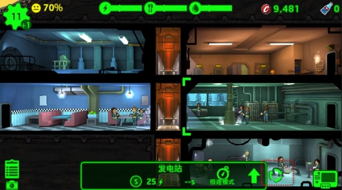
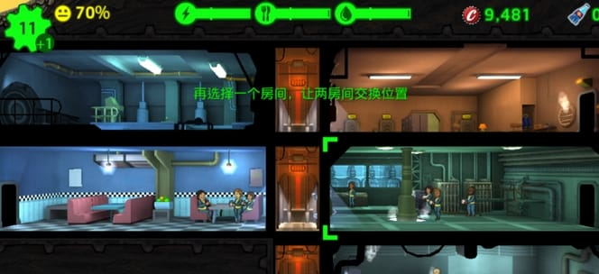
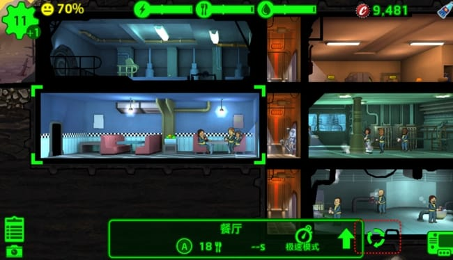
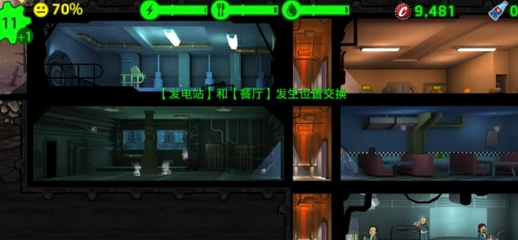
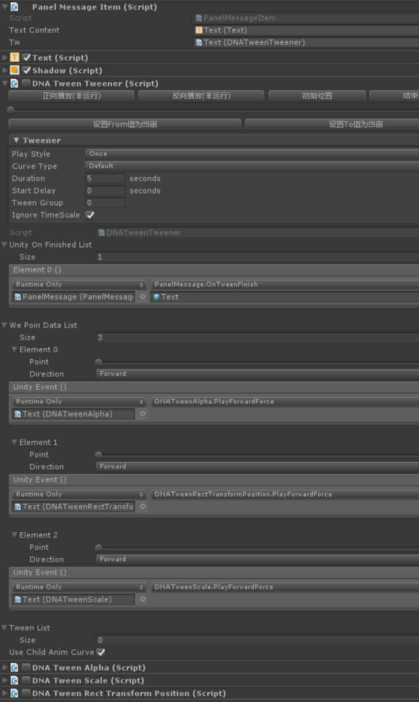
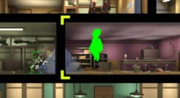
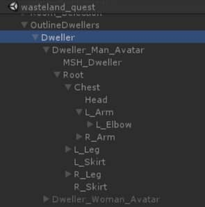
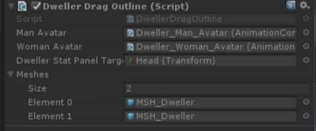
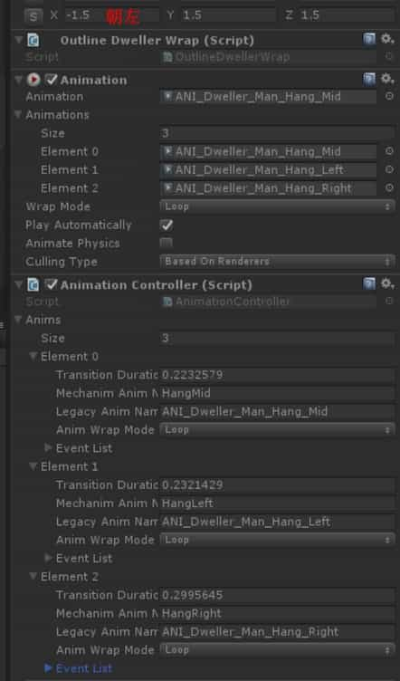

# 房间重构功能

## 功能演示

 

 

 

 

## 代码部分

在管理类 Assets\02_Scripts\Actors\Vault\ConstructionMgr.cs 脚本中追加了以下代码：

```c#
#region 房间重构
/// <summary>
/// 执行重构：房间交换
/// </summary>
/// <param name="a"></param>
/// <param name="b"></param>
bool _switchRoom(Room a, Room b)
{
    if (IsSwitching)
    {
        return false;
    }
    if (a == b)
    {
        return false;
    }
    if (a.RoomType == ERoomType.Entrance || a.RoomType == ERoomType.Elevator || b.RoomType == ERoomType.Entrance || b.RoomType == ERoomType.Elevator)
    {
        return false;
    }
    int aSize, aLv, bSize, bLv;
    a.RetrieveCellSizeAndLevel(out aSize, out aLv);
    b.RetrieveCellSizeAndLevel(out bSize, out bLv);
    if (aSize != bSize)
    {
        return false;
    }
    UGUI.UGUIManager.Instance.Message(string.Format("【{0}】和【{1}】发生位置交换", a.RoomName, b.RoomName), true);
    aRow = a.GridPosition.Row;
    aCol = a.GridPosition.Col;
    bRow = b.GridPosition.Row;
    bCol = b.GridPosition.Col;
    roomTypeA = a.RoomType;
    roomTypeB = b.RoomType;
    mergeLvA = a.MergeLevel;
    mergeLvB = b.MergeLevel;
    lvA = a.m_currentRoomLevel.LevelNumber;
    lvB = b.m_currentRoomLevel.LevelNumber;
    aDwellers.Clear();
    bDwellers.Clear();
    aDwellers.AddRange(a.Dwellers);
    bDwellers.AddRange(b.Dwellers);
    destroyCount = 0;
    IsSwitching = true;
    a.TryDestroySelf(OnDestroyRoomFinish, false);
    b.TryDestroySelf(OnDestroyRoomFinish, false);
    return true;
}
int aRow;
int aCol;
int bRow;
int bCol;
ERoomType roomTypeA;
ERoomType roomTypeB;
int mergeLvA;
int mergeLvB;
int lvA;
int lvB;
int destroyCount = 0;
/// <summary>
/// true：当前正在执行房间交换重构，不得执行其他重构
/// </summary>
public bool IsSwitching { get; private set; }
List<Dweller> aDwellers = new List<Dweller>();
List<Dweller> bDwellers = new List<Dweller>();
List<Room> roomForSwitch = new List<Room>();
private void OnDestroyRoomFinish()
{
    destroyCount++;
    if(destroyCount >= 2)
    {
        var newRoomA = 
            AddRoom(roomTypeA, bRow, bCol, mergeLvA, lvA, null, false);
        newRoomA.UpgradeToLevel(lvA);
        var newRoomB = 
            AddRoom(roomTypeB, aRow, aCol, mergeLvB, lvB, null, false);
        newRoomB.UpgradeToLevel(lvB);
        Vault.Instance.UpdateVaultMeshes();
        if (newRoomA != null && aDwellers != null)
        {
            foreach(var d in aDwellers)
            {
                newRoomA.TryAssignDweller(d);
            }
        }
        if(newRoomB != null && bDwellers != null)
        {
            foreach (var d in bDwellers)
            {
                newRoomB.TryAssignDweller(d);
            }
        }
        destroyCount = 0;
        IsSwitching = false;
    }
}
/// <summary>
/// 重构：房间交换
/// 打开房间详情界面，点击登记按钮可调用这个方法来登记要交换的房间，登记满两个则自动尝试交换
/// </summary>
/// <param name="signRoom"></param>
public void SignForSwitchRoom(Room signRoom)
{
    //屏蔽无效
    if(signRoom == null || signRoom.RoomType == ERoomType.Entrance || signRoom.RoomType == ERoomType.Elevator || signRoom.IsInEmergencyOrFastForward || !signRoom.IsInVault || !TutorialManager.Instance.IsTutorialFinished())
    {
        return;
    }
    //删除无效
    for(int i= roomForSwitch.Count-1; i>= 0; i--)
    {
        var r = roomForSwitch[i];
        if(r == null || !r.IsInVault || signRoom.IsInEmergencyOrFastForward)
        {
            roomForSwitch.RemoveAt(i);
        }
    }
    //过滤重复
    if(roomForSwitch.Contains(signRoom))
    {
        return;
    }
    roomForSwitch.Add(signRoom);
    if(roomForSwitch.Count > 1)
    {
        var roomA = roomForSwitch[0];
        var roomB = roomForSwitch[1];
        if(_switchRoom(roomA, roomB))
        {
            roomForSwitch.Clear();
            return;
        }
        else
        {
            roomForSwitch.RemoveAt(0);
        }
    }
    UGUI.UGUIManager.Instance.Message("再选择一个房间，让两房间交换位置", false);
}
#endregion
```

在房间操作面板UI的基类代码中添加以下代码（补丁式代码）：

```c#
public class HudUpgradable<T> : HudRoom<T> where T : Room
{
    //...其余代码略
    
    private UIButton m_buttonSwitch = null;//动态生成的重构按钮
    public void RefreshUpgradeButton()
    {
        m_buttonUpgradeWindow.gameObject.SetActive(!Vault.Instance.IsARoomInEmergencyOrFastForward() && TutorialManager.Instance.IsTutorialFinished());
        RefreshSwitchButton();
    }
    private void RefreshSwitchButton()
    {
        if(this is VaultEntranceHUDWindow)
        {
            return;
        }
        GameObject go = null;
        if (m_buttonSwitch == null)
        {
            go = UnityEngine.Object.Instantiate(m_buttonUpgradeWindow.gameObject, m_buttonUpgradeWindow.transform.parent, false) as GameObject;
            go.name = "BTN Switch";
            int childCount = go.transform.childCount;
            for(int i=childCount -1; i> 0;i--)
            {
                GameObject.Destroy(go.transform.GetChild(i).gameObject);
            }
            var iconGo = go.transform.GetChild(0).gameObject;
            iconGo.SetActive(true);
            var icon = iconGo.GetComponent<UISprite>();
            icon.spriteName = "Icon_Scrapping";//代表重构图标
            var shadowGo = UnityEngine.Object.Instantiate(iconGo, go.transform, false) as GameObject;
            var shadowIcon = shadowGo.GetComponent<UISprite>();
            shadowIcon.depth = icon.depth - 1;
            shadowIcon.color = Color.black;
            iconGo.transform.localScale = Vector3.one * 0.95f;
            m_buttonSwitch = go.GetComponent<UIButton>();
            m_buttonSwitch.onClick.Clear();
            var soundEm = go.GetComponent<UISoundEmitter>();
            EventDelegate.Add(m_buttonSwitch.onClick, soundEm.EmitSound);
            EventDelegate.Add(m_buttonSwitch.onClick, OnClickSwitch);
        }
        else
        {
            go = m_buttonSwitch.gameObject;
        }
        go.SetActive(m_buttonUpgradeWindow.gameObject.activeSelf);
    }
    /// <summary>
    /// 可能被子类覆盖，如果被子类覆盖则子类Update里也补一句DoUpdate()
    /// </summary>
    private void Update()
    {
        DoUpdate();
    }
    protected short skipUpdateCount = 0;
    protected void DoUpdate()
    {
        skipUpdateCount++;
        if (skipUpdateCount < 8)//每这些帧只做一次
        {
            return;
        }
        skipUpdateCount = 0;
        if (this is VaultEntranceHUDWindow)
        {
            return;
        }
        if (m_buttonSwitch != null && m_buttonUpgradeWindow != null)
        {
            var localPos = m_buttonUpgradeWindow.transform.localPosition;
            localPos.x = localPos.x + 80f;
            m_buttonSwitch.transform.localPosition = localPos;
        }
    }
    void OnClickSwitch()
    {
        ConstructionMgr.Instance.SignForSwitchRoom(CurrentRoom);
        Vault.Instance.EnterVaultMode();
    }
    
    //...其余代码略
}
```

测试用例：

```c#
[MenuItem("自定义/测试房间重构")]
static void TestA()
{
    var roomA = Vault.Instance.GetRoomsByType(ERoomType.Radio);
    var roomB = Vault.Instance.GetRoomsByType(ERoomType.Classroom);
    ConstructionMgr.Instance.SignForSwitchRoom(roomA[0]);
    ConstructionMgr.Instance.SignForSwitchRoom(roomB[0]);
}
```


# 飘字功能

## 飘字物体属性面板

依赖于DNATween工具，TweenTweener作为总控，同步播放位移、缩放、渐隐三组效果，并在动画结束后执行回调。

 

## 代码部分

在 Assets\UGUICode\UGUIManager.cs 代码中做了飘字的公有方法

```c#
using UnityEngine;
using UnityEngine.SceneManagement;

namespace UGUI
{
    public class UGUIManager : MonoBehaviour
    {
        public static UGUIManager Instance = null;

        #region 组件
        public PanelMessage panelMessage;
        #endregion
        private void Awake()
        {
            Instance = this;
            Object.DontDestroyOnLoad(gameObject);
            SceneManager.sceneLoaded += _OnLevelWasLoaded;
        }
        private void OnDestroy()
        {
            SceneManager.sceneLoaded -= _OnLevelWasLoaded;
        }
        void _OnLevelWasLoaded(Scene s, LoadSceneMode m)
        {
            CheckAudioListener();
        }

        #region 检查AudioListener重复
        private void CheckAudioListener()
        {
            var arr = FindObjectsOfType<AudioListener>();
            if(arr == null || arr.Length == 0)
            {
                return;
            }
            bool done = false;
            foreach(var a in arr)
            {
                if(a.gameObject.activeInHierarchy)
                {
                    if (!done)
                    {
                        a.enabled = true;
                        done = true;
                        continue;
                    }
                }
                a.enabled = false;
            }
        }
        #endregion
        private void OnEnable()
        {
            panelMessage.Open();
        }
        /// <summary>
        /// 文字飘飞
        /// </summary>
        /// <param name="str"></param>
        /// <param name="blog"></param>
        public void Message(string str, bool blog)
        {
            panelMessage.Message(str, blog);
        }
        /// <summary>
        /// 延迟执行方法，比如延迟5秒暂停游戏这么写：
        /// UGUI.UGUIManager.Instance.WaitToDo(5, () => { EditorApplication.isPaused = true; });
        /// </summary>
        /// <param name="time"></param>
        /// <param name="action"></param>

        public void WaitToDo(float time, System.Action action)
        {
            StartCoroutine(WaitToDoCoroutine(time, action));
        }

        private IEnumerator WaitToDoCoroutine(float time, System.Action action)
        {
            yield return new WaitForSeconds(time);
            action.Invoke();
        }
    }
}
```

PanelMessage具体代码实现（路径Assets\UGUICode\PanelMessage.cs）：

```c#
using UnityEngine;
using System.Collections.Generic;

namespace UGUI
{
    //飘字小物件
    public sealed class PanelMessageItem : MonoBehaviour
    {
        #region UI控件
        public Text TextContent;
        //依赖于自制的DNATween工具
        public DNATweenTweener tw;
        #endregion

        #region 其他函数
		public void SetData(string str)
		{
            TextContent.text = str;
            tw.PlayForwardForce();
        }
        #endregion
    }
    //界面类
    public sealed class PanelMessage : MonoBehaviour
    {
        #region UI控件
        public PanelMessageItem itemTmp;
        #endregion


        private const int MaxItemCount = 10;//缓冲池最大容量
        private List<PanelMessageItem> TextList = new List<PanelMessageItem>();//缓冲池，显示代表在使用，隐藏代表在闲置
        private const int MessageCD = 750;//两条消息最近时间间隔
        private int Counter_CD = 0;

        private class MessageData
        {
            public string msg;
            public bool bLog;

            public MessageData(string msg, bool bLog)
            {
                this.msg = msg;
                this.bLog = bLog;
            }
        }
        private List<MessageData> dataList = new List<MessageData>();

        private PanelMessageItem ClaimItem()
        {
            PanelMessageItem t;
            for (int i = 0; i < TextList.Count; i++)
            {
                t = TextList[i];
                if (!t.gameObject.activeSelf)
                {
                    SetActive(t, true);
                    return t;
                }
            }
            if (TextList.Count == MaxItemCount)
            {
                t = TextList[0];
                SetActive(t, false);//先隐藏一下，以便触发它的播放
                SetActive(t, true);
                return t;
            }
            if (itemTmp == null)
            {
                return null;
            }
            t = Object.Instantiate(itemTmp, transform, false) as PanelMessageItem;
            TextList.Add(t);
            SetActive(t, true);
            return t;
        }

        private void RecycleItem()
        {
            for (int i = 0; i < TextList.Count; i++)
            {
                PanelMessageItem t = TextList[i];
                SetActive(t, false);
            }
        }
        /// <summary>
        /// unity自动调用-动画结束
        /// </summary>
        /// <param name="go"></param>
        public void OnTweenFinish(GameObject go)
        {
            SetActive(go, false);

            bool isAllClose = true;
            for (int i = 0; i < TextList.Count; i++)
            {
                if (TextList[i].gameObject.activeSelf)
                {
                    isAllClose = false;
                    break;
                }
            }
            if (isAllClose)
            {
                dataList.Clear();
                RecycleItem();
            }
        }

        public void Open()
        {
            SetActive(itemTmp, false);
        }

        //同一条消息连续出现x条以上,直接抛弃
        private readonly int dropThreshold = 3;
        private bool IsDrop(string message)
        {
            if (dataList.Count < dropThreshold)
            {
                return false;
            }

            int count = 0;
            for (int i = dataList.Count - 1; i >= 0; --i)
            {
                MessageData tempData = dataList[i];
                if (!string.Equals(tempData.msg, message))
                {
                    return false;
                }

                ++count;
                if (count >= dropThreshold)
                {
                    return true;
                }
            }
            return false;
        }

        public void Message(string message, bool bLog = false)
        {
            if (string.IsNullOrEmpty(message))
            {
                return;
            }
            if (!IsDrop(message))
            {
                dataList.Add(new MessageData(message, bLog));
            }
        }

        private void DoMessage(MessageData data)
        {
            //数据空防护
            if (data == null)
            {
                return;
            }
            PanelMessageItem t = ClaimItem();
            if (t == null)
            {
                return;
            }
            t.SetData(data.msg);

            if (data.bLog)
            {
                BCLog.Log(data.msg);
            }
        }
        //界面Update更新 (每帧更新,需要的时候添加此函数)
        private bool Update()
        {
            int deltaTimeMs = (int)(Time.deltaTime * 1000);
            if (dataList.Count == 0)
            {
                return true;
            }
            if (Counter_CD == 0)
            {
                MessageData messageData = dataList[0];
                dataList.RemoveAt(0);
                DoMessage(messageData);
            }
            Counter_CD += deltaTimeMs;
            if (Counter_CD >= MessageCD)
            {
                Counter_CD = 0;
            }
            return true;
        }


        private void SetActive(Component c, bool b)
        {
            if (c != null)
            {
                c.gameObject.SetActive(b);
            }
        }
        private void SetActive(GameObject go, bool b)
        {
            if (go != null)
            {
                go.SetActive(b);
            }
        }
    }
}
```

测试用例：

```c#
[MenuItem("自定义/测试飘字UI")]
static void TestB()
{
    UGUI.UGUIManager.Instance.Message("AAAABBBBCCCC!!!!", false);
    UGUI.UGUIManager.Instance.Message("sdfsdf3234234%%%", false);
}
```


# 启动游戏提速

游戏在编辑模式下每次运行都会加载一遍配置（实际上没必要每次都加载），所以注释了部分代码，：

```c#
//EconomyImportUtil.cs
//...
[InitializeOnLoad]
public class EconomyImportUtil
{
	static EconomyImportUtil()
	{
        //启动游戏慢的话就临时注释这里
        //EditorApplication.playmodeStateChanged += OnPlaymodeStateChanged;
    }
    
    //...其余代码略
}
```

并且用编辑器代码加以提示：

```csharp
//MenuEditor.cs
//...
[MenuItem("自定义/注意！EconomyImportUtil类注释了代码，临时用于加速启动")]
static void Notice1()
{
    var path = "Assets/02_Scripts/Editor/EconomyImportUtil.cs";
    var obj = UnityEditor.AssetDatabase.LoadMainAssetAtPath(path);
    UnityEditor.Selection.activeObject = obj;
    EditorGUIUtility.PingObject(obj);
}
//...
```

# 角色模型的研究

## 角色朝向

默认朝向是右，当朝左的时候是靠角色X轴缩放乘以-1来做的。

## 拖拽小人

  

这个绿色小人的结构：

 

其中Dweller物体的属性面板：

 

其中Dweller_Man_Avatar物体的属性面板：

 

## 角色本体


