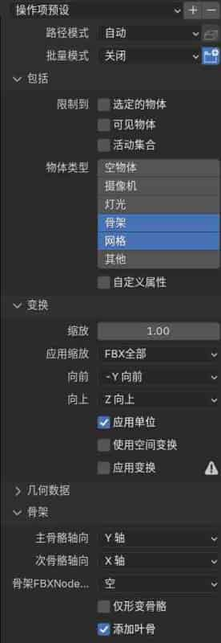
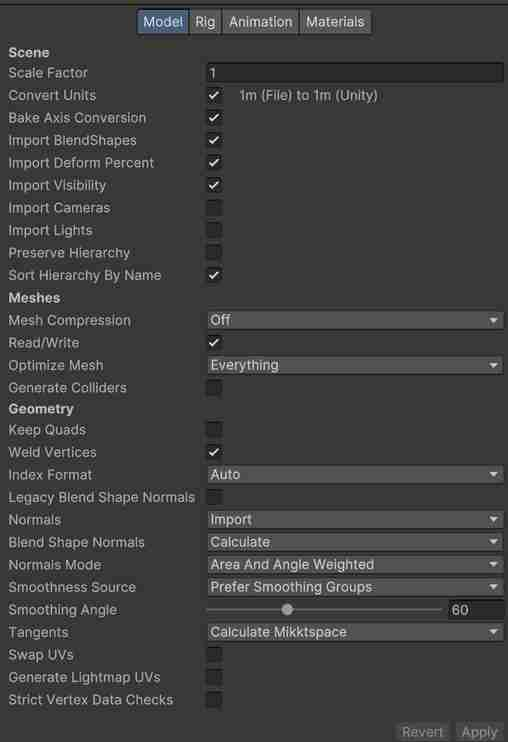
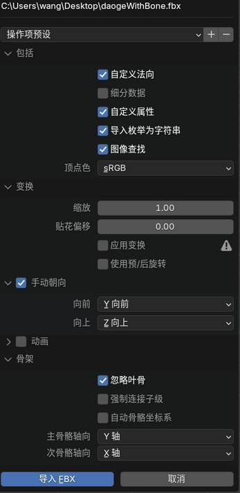
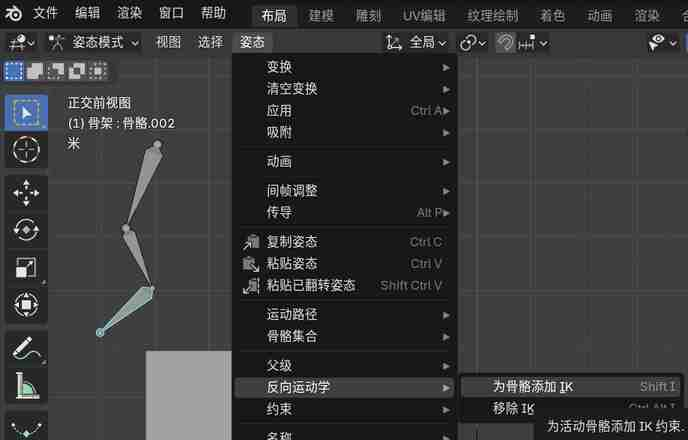

#   前言

本文基于Blender 4.2版本，键位设置与2.x、3.x版本略有不同。

教程视频网址：

[羊羊羊的教室的个人空间-羊羊羊的教室个人主页-哔哩哔哩视频 (bilibili.com)](https://space.bilibili.com/299275195/channel/seriesdetail?sid=338965)

[浩克肥虫视频专辑-浩克肥虫视频合集-哔哩哔哩视频 (bilibili.com)](https://space.bilibili.com/372816247/channel/series)

官方文档：[Blender 4.2 Manual](https://docs.blender.org/manual/zh-hans/4.2/)

贴图网站：[All Assets • Poly Haven](https://polyhaven.com/all)

快捷键参考：[【Blender】快捷键大全（超级详细，应有尽有） - 哔哩哔哩 (bilibili.com)](https://www.bilibili.com/read/cv27243284/)

当前看到：[床的建模（修复法线问题、挤出、局部坐标、吸附到面）_哔哩哔哩_bilibili](https://www.bilibili.com/video/BV1qq4y1772P?p=12&vd_source=563d44869c3ecebb1867233573d16b7b)

# 界面布局与快捷键

## 默认初始界面

### 菜单栏

  5个菜单+11个切页，每个切页有自己的子菜单（子菜单是属于3D视图的，都位于上端）

| 名称          | 位置          | 快捷键及说明                                            |
| ------------- | ------------- | ------------------------------------------------------- |
| 渲染图像/动画 | 渲染>...      | 渲染图像F12， 渲染动画Ctrl+F12。会弹出Blender渲染窗口。 |
| 搜索          | 编辑>菜单搜索 | F3，可搜索各种指令及其快捷键                            |

### **3D视图**

当切页选择为前三个（布局、建模、雕刻）时出现。

#### **3D视图概览**

以下列出的同时适用于物体/编辑等模式。

| 名称                         | 位置                                           | 操作                                                         |
| ---------------------------- | ---------------------------------------------- | ------------------------------------------------------------ |
| 添加                         | 上方子菜单，布局切页                           | 可添加相机、网格、空物体、文本、骨架等。或在3D视图界面内快捷键Shift+A |
| 全选                         | -                                              | A                                                            |
| 删除                         | -                                              | X                                                            |
| 视图与活动相机对齐           | 上方子菜单，视图>对齐视图>活动相机对齐当前视角 | 快捷键：Ctrl+Alt+数字0                                       |
| 锁定相机到视图               | 右侧边栏                                       | 选中相机物体，视图>锁定>勾选“锁定相机到视图”。这样移动视图，相机始终会跟随。弄好以后要再关掉。 |
| 进入摄像机视图               | -                                              | 选中相机（若有多个相机），按小键盘0，再按或旋转视角即退出。  |
| 工具栏                       | 左上角竖条                                     | 拖拽边缘拉宽可以显示名字，ctrl+鼠标中键上下拖拽可以缩放大小。 |
| 游标                         | 工具栏第二个选项                               | 游标决定新建物体的坐标。左键改位置。或用快捷键：shift+鼠标右键点击。 |
| 侧栏                         | 右侧边栏                                       | N键可切换显隐，包含条目、工具、视图三个切页。默认选中条目，其中的数值可以左键拖拽修改。 |
| 视图操控器                   | 右上角（弓箭图标）                             | 推荐勾选“移动”                                               |
| 视图叠加层                   | 右上角（双环图标）                             | 推荐勾选“线框”、“统计信息”，另外勾选“边长”可以查看所有选中边长数值。“法向”里选第二个图标可以看法线。 |
| 切换透射模式                 | 右上角（交叉的方块图标）                       | 快捷键Alt+Z，可透视模型之间的交叉关系。                      |
| 视图着色方式：材质预览       | 右上角（球形田字）                             | 切到此模式可看材质颜色。                                     |
| 视图着色方式：渲染预览       | 右上角（最后第四个，球形）                     | 切到此模式可看真实的渲染效果，和Blender渲染弹窗一样。        |
| 缩放视角                     | -                                              | 鼠标滚轮，或ctrl+鼠标中键拖拽                                |
| 旋转视角                     | -                                              | 鼠标中键拖拽，alt+鼠标中键拖拽则是基于坐标轴的正交视角       |
| 平移视角                     | -                                              | shift+鼠标中键拖拽                                           |
| 四视图                       | -                                              | ctrl+alt+Q                                                   |
| 独立视图，即用户透视（局部） | -                                              | 当有多个物体时，选中一个，按 / 键                            |
| 复制物体/选区                | -                                              | shift+D，鼠标拖动之前框选的若干物体，如果限制仅Y轴移动，按Y键，X和Z同理。若直接鼠标右键则复制内容还在原来位置，如果是编辑模式下的复制可按**P键**分离为新物体。 |
| 移动物体/选区                | -                                              | 按G，鼠标随意移动，X/Y/Z键可限制移动轴向，鼠标右键退出移动模式。 |
| 缩放物体/选区                | -                                              | 按S，等比放大缩小（左缩右放）。X/Y/Z键可限制缩放轴向，鼠标右键退出缩放模式。 |
| 旋转物体/选区                | -                                              | 按R，同上。                                                  |

#### **3D视图_物体模式**

物体模式属于3D视图，因其复杂，单独做表

| 功能                     | 快捷键及操作                                                 |
| ------------------------ | ------------------------------------------------------------ |
| 应用、应用缩放           | 快捷键Ctrl+A，其中，物体>应用>缩放 可修正缩放值不是（1，1，1）导致倒角被压扁等问题。 |
| 平滑着色                 | 物体（或右键）>自动平滑着色                                  |
| 快速收藏夹               | 在喜欢的右键菜单中右键，加入快速收藏夹，以后可以用Q键快速调用。（比如上面的平滑着色） |
| 设置原点                 | 右键>设置原点。                                              |
| 选中项菜单（改游标位置） | Shift+S， 呼出环形菜单。比如选 游标到中心点，则游标会移动到选中物体的中心点。 |
| 建空物体                 | 添加>空物体>箭头                                             |
| 建带图网格平面           | 添加>图像>网格平面                                           |
| 批量重命名               | Ctrl+F2                                                      |
| 物体重命名               | F2                                                           |
| 设置父级目标             | 选两个物体，Ctrl+P，选第一个“物体”。这样两个物体就形成父子关系（后选中的是父），子可以坐标跟随于父，但又不会形成父子包含关系。逆向操作：没有快捷键，但可以到属性面板“物体”分栏里，”关系>父级”后面点叉。 |

#### **3D视图_编辑模式**

编辑模式属于3D视图，因其复杂，单独做表。

| 功能                                     | 快捷键及操作                                                 |
| ---------------------------------------- | ------------------------------------------------------------ |
| 切换物体模式/编辑模式                    | Tab                                                          |
| 点/线/面                                 | 1/2/3键可切换，按shift同时选择多个（通常不需要多选）         |
| 全选                                     | 选择>全部，或直接快捷键A                                     |
| 多选                                     | Shift+点击                                                   |
| 环选                                     | Alt+点击                                                     |
| 多选并排的边                             | Ctrl+Alt+选边                                                |
| 取消选择                                 | Ctrl+框选                                                    |
| 细分                                     | 右键菜单（常用于面模式）                                     |
| 挤压（内插面或挤出选区）                 | 按I是内部挤压（工具栏>内插面），按E是向外挤压（工具栏>挤出选区）。挤出的完整菜单是快捷键**Ctrl+F**（面>...），还能选择按法线挤出（或直接Alt+E）。 |
| LoopTools                                | 在插件中搜到它添加，之后右键菜单就会多出它                   |
| 【合并】修正因误操作导致的点线面重叠     | M键（网格>合并>按距离），状态栏会提示合并数量（非零代表原来有错误） |
| 【重新计算外侧】修正误操作导致的法向问题 | 网格>法向>重新计算外侧                                       |
| 清除锐边                                 | Ctrl+E（边>清除锐边），在使用表面细分修改器并应用之后，模型面数增加，一些边缘的边会标记成蓝色（锐边，意为硬边或折痕，在渲染是应保持尖锐而不是平滑处理），如不需要可以清除这个标记。 |
| 设置倒角权重                             | （右）条目>边线数据>平均倒角权重，配合属性编辑器的倒角修改器使用。 |
| 倒角（无修改器且不可逆）                 | 边操作：Ctrl+B，点操作：Ctrl+Shift+B，鼠标在点击之前可以用滚轮直接修改段数。另外，环切线也可以做倒角。 |
| 两点连线                                 | 选两个点，按J键（或右键>连接顶点路径）。保证每个面不超过4个边、4个点。之后会弹出倒角选项框（一次性的），把里面钳制重叠、环切线滑移都勾上。如果没有其他操作按F9可以再次打开倒角选项框。 |
| 环切                                     | 工具栏或ctrl+R，右键可吸附中点位置，ctrl键可吸附到最近顶点（吸附规则可修改，在中上方U形吸铁石图标）。临时面板上勾选“均匀”则刀劈直线，否则切到内挤压的地方会为了保证切分比而变成折线。 |
| 切割                                     | 工具栏或快捷键K， C是透切，A是角度约束，回车完成             |
| 重复上次操作                             | Shift+R                                                      |
| 删除边                                   | 选中若干边，按X，选择“融并边”                                |
| 从边创建面                               | 选中多个边，然后F键（右键>“从边创建面”），可以做类似容器封口的操作。 |
| 栅格填充                                 | ctrl+F(面>栅格填充)， 相当于从边创建面+环切，好用。但不要多个不连续的区域一起做栅格填充，应该一次填充一个区域。 |
| 轴心点                                   | 句号键，呼出环形菜单，默认是“质心点”，改成“各自的原点”可以方便多选各自缩放、旋转 |
| 选择相似区域                             | 面选择模式， Shift + G（选择>选择相似），面积，左下角浮窗展开，调整阈值。如果按材质来批量选择，就是面映射。 |
| 隐藏与恢复                               | H隐藏选择的， Alt+H取消隐藏， Shift+H隐藏除选择以外的        |
| 衰减编辑物体                             | 快捷键O（通常在点编辑模式使用，界面上方中间有个圆中间有个点的图标，高亮即开启）。拖拽一个点，会按距离衰减的拉动周围的点，鼠标滚轮可改变衰减距离，选择不同的曲线衰减方式会有差异。平时不用的时候应当关闭。收束的瓶口效果：开启衰减，框选瓶口的点，S键，鼠标滚轮调整衰减范围，然后拖拽鼠标缩小，这样与瓶口相近的点也会收束。 |

#### **3D视图_雕刻模式**

雕刻模式属于3D视图，需要菜单栏切页选中“雕刻”。

| 功能 | 快捷键及操作 |
| ---- | ------------ |
|      |              |

### 大纲视图

| 名称             | 位置             | 操作                                                         |
| ---------------- | ---------------- | ------------------------------------------------------------ |
| 场景集合（分组） | Collection       | 框选拖拽进/出分组，右上角按钮创建新的分组。右键菜单里可以设置颜色，可辅助理解 |
| 移动到集合       | -                | 快捷键M（如果在3D视图下需要物体模式，否则编辑模式就成了合并） |
| 筛选             | 右上有个漏斗图标 | 建议把相机图标点亮，否则渲染图像看起来很怪                   |
| 多选             | 选中多个物体     | 按住ctrl键，点击多个物体                                     |
| 删除             | 选中物体         | X                                                            |
| 重命名           | 选中物体         | F2或双击                                                     |

### 属性编辑器

注：修改器之间可以通过拖拽改变执行顺序，自上而下执行。

| 名称                             | 位置                       | 操作                                                         |
| -------------------------------- | -------------------------- | ------------------------------------------------------------ |
| 物体属性                         | 侧边栏橙色方块，默认选中   | 视图显示>显示为>线框，让模型不遮挡视线。                     |
| 倒角（修改器）                   | 侧边栏蓝色扳手             | 添加倒角修改器，增加段数变圆润，注意缩放会导致倒角被压扁，需应用缩放来做缩放值归一。**限定方式**：可增加限定方式角度60度，意为两个面的法向量夹角只有超过60度才倒角。勾选“着色>硬化法向”可以避免布尔抠洞操作带来的线。 |
| 布尔（修改器）                   | 侧边栏蓝色扳手             | 添加布尔修改器，用于合并两个有交叉的模型为一个整体。差值是删除交叉部分类似挖坑，并集就是合并的意思。最终点击应用，该修改器消失并生效（不能再修改了），两物体才会真正合二为一。 |
| 表面细分，也叫细分曲面（修改器） | 侧边栏蓝色扳手             | 做了细分+弯曲两件事。通常执行于平滑着色之后。为了性能，数值不超过3。表面细分只能用修改器来做。已经执行倒角的边（修改器或者ctrl+B都算），会被表面细分自动排除。 |
| 镜像（修改器）                   | 侧边栏蓝色扳手             | 配合中心点调整让一个物体变成多个                             |
| 阵列（修改器）                   | 侧边栏蓝色扳手             | 配合中心点调整让一个物体变成多个                             |
| 实体化（修改器）                 | 侧边栏蓝色扳手             | 给平面物体增加厚度                                           |
| 缩裹（修改器）                   | 侧边栏蓝色扳手             | 把面片（要细分过）贴合到其他物体上                           |
| 材质                             | 侧边栏的红色球形田字图标   | 改糙度，可产生塑料效果；调整基础色；                         |
| 渲染属性                         | 侧边栏的第一个相机图标     | 可切换默认引擎（类似于相机牌子），默认EEVEE是blender内置实时渲染。切换成Cycles，设备选择GPU计算（风扇会转的猛一点）。在Blender渲染弹窗中，不同的slot槽位可以对应不同的引擎。 |
| 灯光数据                         | 侧边栏的倒数第二个绿色灯泡 | 选中灯光物体后才会出现。可修改灯光数值。                     |

### Blender渲染弹窗

可在菜单栏【渲染】中打开

| 名称     | 位置   | 操作                                                         |
| -------- | ------ | ------------------------------------------------------------ |
| 保存图像 | 左上方 | 图像>保存                                                    |
| 切换槽位 | 右上方 | slot下拉菜单，切换后下次打开就是使用新的slot来存储渲染结果。多个slot便于快速浏览不同情况下的渲染过的效果。 |
|          |        |                                                              |

### 时间轴

| 名称 | 位置 | 操作 |
| ---- | ---- | ---- |
|      |      |      |

## 其他界面布局

### UV编辑器

当切页选择为第四个“UV编辑”时出现

| 名称       | 位置           | 操作                                       |
| ---------- | -------------- | ------------------------------------------ |
| UV选区同步 | 左上双箭头     | 将UV与编辑模式下的网格选择保持同步         |
| 标记缝合边 | 3D视图编辑模式 | 选中一边，右键“标记缝合边”，展UV会切断此边 |
| 展开       | 3D视图编辑模式 | U（UV>展开），之前应该A全选所有面          |

### 图像编辑器

当切页选择为第五个“纹理绘制”时出现

| 名称 | 位置 | 操作 |
| ---- | ---- | ---- |
|      |      |      |

### 着色编辑器

当切页选择为第六个“着色”时出现，默认建了一个原理化BSDF材质。

| 名称              | 操作                                                         |
| ----------------- | ------------------------------------------------------------ |
| Node Wrangler插件 | 已内置不用获取，直接在插件里勾选， 选中原理化BSDF，Ctrl+T，会自动创建关于UV的三个节点流程。 |
| 贴图色彩空间      | 除了BaseColor其他贴图色彩空间要改成Non-color                 |
| 法线贴图          | 此节点在贴图节点和原理化BSDF节点之间。选择切向空间。         |
| 槽                | 可以建多个槽，每个槽一个材质，选择面，在属性编辑器材质分页里指定面的材质。 |

### 动画摄影表

当切页选择为第七个“动画”时出现

| 名称 | 位置 | 操作 |
| ---- | ---- | ---- |
|      |      |      |

### 合成器

当切页选择为第九个“合成”时出现

| 名称 | 位置 | 操作 |
| ---- | ---- | ---- |
|      |      |      |

### 几何节点编辑器、电子表格

当切页选择为第十个“几何节点”时出现

| 名称 | 位置 | 操作 |
| ---- | ---- | ---- |
|      |      |      |

### 文本编辑器、Python控制台

当切页选择为第十一个“脚本”时出现

| 名称 | 位置 | 操作 |
| ---- | ---- | ---- |
|      |      |      |

# 插件

## 如何安装插件

安装自带插件：

编辑>偏好设置>插件，勾选启动

安装第三方插件：

编辑>偏好设置>获取扩展>展开右上角箭头>从磁盘安装（通常是zip或者py文件）

## 识别UE引擎文件

安装插件：Unreal PSK/PSA

插件下载及更新日志：[Unreal PSK/PSA (.psk/.psa) Version History — Blender Extensions](https://extensions.blender.org/add-ons/io-scene-psk-psa/versions/)

## Mixamo动作库配套插件

官网：[Mixamo](https://www.mixamo.com)

[【Blender + Mixamo动画教程】1：Mixamo动作库的基本使用方法和Mixamo插件详解_哔哩哔哩_bilibili](https://www.bilibili.com/video/BV1AM4m1y7Z6)

# 导出fbx给Unity

## 前言，关于坐标系

- Blender采用右手坐标系即：（-Y向前，Z向上，X向右）
- Unity采用左手坐标系即：（Z向前，Y向上，X向左）
- UE4采用左手坐标系即：（X向前，Z向上，Y向左）

## 无插件操作流程

[Blender的FBX模型导出到Unity的规范 - 哔哩哔哩](https://www.bilibili.com/opus/976521043078283298)

物体模式ctrl+A，应用全部变换
导出设置应当如下（可以存成预设起名为Unity）：

 

Unity中的引入配置如下，注意勾选【Bake Axis Conversion】：

 

## 反之，Unity的Fbx导入Blender

 

## 使用插件操作

[🗁 改善FBX导入导出 (Better FBX Importer & Exporter 6.0.5中英对照版)Blender中文版插件免费下载_哔哩哔哩_bilibili](https://www.bilibili.com/video/BV1DKmdYAEBb/?vd_source=563d44869c3ecebb1867233573d16b7b)

个人度盘备份：[【插件】改善FBX导入导出Better_FBX_Importer_Exporter_6.0.5中英对照版.zip](https://pan.baidu.com/s/1koHRqR9VudN00bmvHJb-A?pwd=avik)

# 骨骼

## 前言

视频教程前两课大略的看，第三课重点看：

[第一课_哔哩哔哩_bilibili](https://www.bilibili.com/video/BV1oc411j7gA)

[第三课蒙皮_哔哩哔哩_bilibili](https://www.bilibili.com/video/BV1oc411j7gA?vd_source=563d44869c3ecebb1867233573d16b7b&p=3&spm_id_from=333.788.videopod.episodes)

[blender怎么显示棍型骨骼_哔哩哔哩_bilibili](https://www.bilibili.com/video/BV1iR4y1x7AS/?vd_source=563d44869c3ecebb1867233573d16b7b)（物体模式选中骨骼，属性面板绿色小人分类找关于显示的设置，顺便可以把骨骼轴向箭头的显示打开）

FK：正向运动，父对象控制子对象
IK：反向运动，子对象控制父对象

## 建立

shift+A建立骨骼，进入编辑模式（切模式ctrl+tab）， E挤出骨骼
如果需要IK：选中尾骨，进入姿态模式， shift+I反向动力学为骨骼添加IK

 

自动蒙皮：物体模式，先选模型，再选骨骼，ctrl+P，选自动

## 骨骼的三种模式

ctrl+tab切换三个模式

- 物体模式（动画pose）
- 编辑模式（搭建骨骼）
- 姿态模式（摆放Pose，添加控制器）

## 蒙皮

物体模式，先选骨骼，再选模型，进入权重绘制模式，第一个笔刷可刷权重，按住alt点击选择不同的骨头（刷好权重之后可以直接G移动一下，查看效果，移动后可以不归位，在非默认姿态下继续刷其他骨骼的权重，最后物体模式下单独全选骨骼，再切到姿态模式可以清空全部姿态），shift+鼠标中键平移视角，alt+鼠标中键点击以当前屏幕中心为视角旋转点，shift+空格可更改工具，编辑模式下L选择一部分无关面，把他们用H隐藏掉，或者shift+H把其他隐藏掉，方便刷权重。alt+H可以恢复所有显示。
[【中字】Blender 绑定教程：如何 镜像和对称 顶点蒙皮权重_哔哩哔哩_bilibili](https://www.bilibili.com/video/BV18u411M7uA/?vd_source=563d44869c3ecebb1867233573d16b7b)

## 使用插件

### Auto-Rig Pro

ARP是骨骼一条龙服务，下面这个视频给出了很规范的操作流程：
[【1.blender自动绑定】Auto-Rig Pro 自动绑骨，自动权重，还能生成控制器，懒人打野必备神器！！_哔哩哔哩_bilibili](https://www.bilibili.com/video/BV1cb421i7dF/?spm_id_from=333.337.search-card.all.click&vd_source=563d44869c3ecebb1867233573d16b7b)
度盘备份：[AutoRigPro](链接: https://pan.baidu.com/s/1_zbwoZdv0RvrgNU_a4urTA?pwd=ryhh)
还有一个细节较多的ARP教学系列视频：
[blender 绑定插件Auto_rig Pro 学习 : 安装、配置、模块介绍_哔哩哔哩_bilibili](https://www.bilibili.com/video/BV1TY411g7kP)

### Lazy Weight Tool

另外还有个方便刷权重的插件Lazy Weight Tool：
[懒人权重（Lazy Weight Tool 1.9.75）Blender中文版插件_哔哩哔哩_bilibili](https://www.bilibili.com/video/BV1dH4y1q7ve)
[iBlender中文版插件Lazy Weight Tool教程Akane 的《重量绘画和穿衣懒人指南》Blender_哔哩哔哩_bilibili](https://www.bilibili.com/video/BV1t44y1f7Pg)
[官网：Lazy Weight Tool - Blender Market](https://blendermarket.com/products/lazy-weight-tool)
