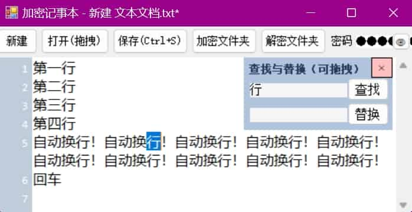
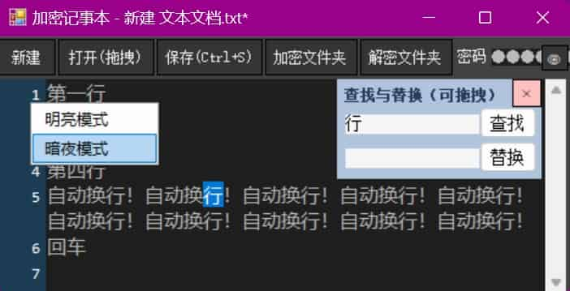

# 先放成果

直接下载：[加密记事本.exe](./加密记事本.exe)

# 界面外观

- 首次使用请先填好密码，最近一次填过的密码会保存在同目录下名为key.cfg的文件，这样下次打开会自动填好密码。
- 自定义的快捷键有三个：Ctrl+S保存，Ctrl+F查找，Esc关闭查找，其他快捷键都是通用的，不再列举。

明亮模式：

 

暗夜模式：

 

特殊用法：把加密过的文件再次加密，每次加密用不同的密码形成不同的key.cfg文件，把每个key.cfg交给不同的人。这样只有把所有人的key文件统统汇集到一起，才能读取到文件的原内容（相当于一个需要N把钥匙才能打开的锁）。

# 技术难点和亮点

顺序由难到易：

- 开启自动换行时，行号的正确显示与流畅刷新。（需要人脑自行寻找思路，AI仅提供辅助）
- 各种文件编码正常识别。（需要不断纠正AI，大约迭代5次）
- 查找与替换浮窗。（需要不断纠正AI，大约迭代4次）
- 按行加密并且支持生成密钥文件`key.cfg`，防止每次打开软件都要重新输入密码。（AI基本直接胜任）
- 标题栏显示当前文件名，并且当有修改未保存时，加星号*后缀。（AI基本直接胜任）

# 界面设计

1. **控件布局**：
   1. 以下所有TextBox的BorderStyle都设为None，方便换肤处理（否则会有亮边）
   2. 添加一个 `TextBox`（命名为 `txtContent`），用于输入和显示文本。Anchor设置为四个方向，随窗口拉伸。ScrollBars设为Vertical这样纵向滚动条常显，WordWrap设为True这样可以自动换行，AcceptsTab设为True这样可以接收Tab键。
   3. 添加一个 `TextBox`（命名为 `txtPassword`），用于输入密码。Anchor设置为上左右三个方向，随窗口拉伸。
   4. 复制 `txtContent`（命名为 `hiddenTextBox1`），用于显示行号时计算字符串占用多少行，Visible设为False隐藏，高度可改小一点。
   5. 添加六个 `Button`：
     - 一个用于新建（命名为`btnNew`，文本为“新建”）。
     - 一个用于加密保存（命名为 `btnEncryptSave`，文本为“保存(Ctrl+S)”）。
     - 一个用于解密读取（命名为 `btnDecryptRead`，文本为“打开(拖拽)”）。
     - 一个用于加密整个文件夹的txt文件（命名为 `btnEncryptFolder`，文本为“加密文件夹”）。
     - 一个用于解密整个文件夹的txt文件（命名为 `btnDecryptFolder`，文本为“解密文件夹”）。
     - 一个用于临时查看密码的按钮（命名为 `btnEye`，文本为“👁”）。Anchor设置为上右两个方向。
   6. 添加一个 `Label`，用于提示密码输入（文本为“密码”）。
   7. 添加一个 `Panel` （命名为`lineNumberPanel`），用于显示行号，BackColor设为InactiveCaption。

2. **事件绑定**：
   - 双击 `btnEncryptSave` 按钮，生成 `btnEncryptSave_Click` 事件处理程序。
   - 双击 `btnDecryptRead` 按钮，生成 `btnDecryptRead_Click` 事件处理程序。
   - 双击 `btnNew` 按钮，生成 `btnNew_Click` 事件处理程序。
   - 双击 `btnEncryptFolder` 按钮，生成 `btnEncryptFolder_Click` 事件处理程序。
   - 双击 `btnDecryptFolder` 按钮，生成 `btnDecryptFolder_Click` 事件处理程序。
   - 选中 `btnEye` 按钮，查看属性面板的事件（闪电图标），双击里面的MouseDown和MouseUp，会自动生成 `btnEye_MouseDown` 和 `btnEye_MouseUp` 事件处理程序。
   - 选中 `txtContent` 文本框，查看属性面板的事件（闪电图标），双击里面的TextChanged，会自动生成 `txtContent_TextChanged` 事件处理程序。
   - 选中 `lineNumberPanel`， 查看属性面板的事件（闪电图标），双击里面的Paint，会自动生成 `lineNumberPanel_Paint` 事件处理程序。

3. **后续补充——查找与替换浮窗**：
   - 添加`panelSearch`，AllowDrop为False，事件中分别双击MouseDown、MouseMove、MouseUp来做拖拽逻辑
   - 添加`btnCloseSearch`，文本为：“✕”，双击生成`btnCloseSearch_Click`，FlatType设为Flat
   - 添加`btnSearch`，文本为：“查找”，双击生成`btnSearch_Click`
   - 添加`btnReplace`，文本为：“替换”，双击生成`btnReplace_Click`
   - 添加`txtSearch`，双击生成`txtSearch_TextChanged`
   - 添加`txtReplace`
   - 添加一个Label作为标题，文本为“查找与替换（可拖拽）”，CausesValidation和Enabled设为False从而不会被选中


# 主代码

```csharp
using System;
using System.Collections.Generic;
using System.Drawing;
using System.IO;
using System.Security.Cryptography;
using System.Text;
using System.Windows.Forms;

namespace EncryptedNotepad
{
    public partial class MainForm : Form
    {
        private string currentFilePath = null; // 当前打开的文件路径
        private string defaultTitleName;
        const string PassPortFileName = "key.cfg";
        private string _originalText = ""; // 保存初始文本内容
        private bool _isTextChanged = false; // 标记文本是否已更改
        private TextBoxScrollListener scrollListener;//监听文本框进度条滑动
        private Timer timer;//可设置每隔一段时间执行一次

        public MainForm()
        {
            InitializeComponent();
            // 初始化颜色风格
            InitComponentColor();

            LoadPassword(); // 启动时加载密码
            defaultTitleName = this.Text;

            // 启用拖拽功能
            this.AllowDrop = true;

            // 绑定拖拽事件
            this.DragEnter += MainForm_DragEnter;
            this.DragDrop += MainForm_DragDrop;

            // 使用反射设置 DoubleBuffered 属性，避免行号重绘时闪烁
            typeof(Panel).InvokeMember("DoubleBuffered",
                System.Reflection.BindingFlags.SetProperty | System.Reflection.BindingFlags.Instance | System.Reflection.BindingFlags.NonPublic,
                null, lineNumberPanel, new object[] { true });
            
            //初始化行号字体
            LineNumFont = new Font("Consolas", 10);

            // 初始化滚动条监听器
            this.scrollListener = new TextBoxScrollListener(this.txtContent);
            this.scrollListener.Scrolled += scrollListener_Scrolled;

            // 初始化 Timer
            this.timer = new Timer();
            this.timer.Interval = 100; // 0.1 秒
            this.timer.Tick += new EventHandler(this.Timer_Tick);
            this.timer.Start(); // 启动定时器

            // 初始化用于计算行号的隐藏文本框
            this.hiddenTextBox1.Enabled = false;

            // 初始化搜索框
            panelSearch.Visible = false;
            panelSearchOffsetX = panelSearch.Location.X - btnEye.Location.X;
            panelSearchOffsetY = panelSearch.Location.Y - btnEye.Location.Y;
        }

        // 拖拽进入窗体时触发
        private void MainForm_DragEnter(object sender, DragEventArgs e)
        {
            // 检查拖拽的文件是否是文本文件
            if (e.Data.GetDataPresent(DataFormats.FileDrop))
            {
                string[] files = (string[])e.Data.GetData(DataFormats.FileDrop);
                if (Path.GetExtension(files[0]).ToLower() == ".txt")
                {
                    e.Effect = DragDropEffects.Copy; // 允许拖拽
                }
            }
        }

        // 拖拽释放时触发
        private void MainForm_DragDrop(object sender, DragEventArgs e)
        {
            // 获取拖拽的文件路径
            string[] files = (string[])e.Data.GetData(DataFormats.FileDrop);
            string filePath = files[0];

            // 调用你的读取文件逻辑
            if (string.IsNullOrEmpty(txtPassword.Text))
            {
                MessageBox.Show("请先输入密码", "错误", MessageBoxButtons.OK, MessageBoxIcon.Error);
                return;
            }
            currentFilePath = filePath;
            DoRead();
        }

        private void LoadPassword()
        {
            if (File.Exists(PassPortFileName))
            {
                try
                {
                    // 从文件读取加密的密码
                    byte[] encryptedPassword = File.ReadAllBytes(PassPortFileName);

                    // 使用固定密钥解密密码
                    var password = DecryptStringFromBytes(encryptedPassword, "fixed_key_for_password_storage");
                    string[] arr = password.Split(LINE_END, StringSplitOptions.None);
                    txtPassword.Text = arr[0]; // 显示密码
                    if(arr.Length > 1)
                    {
                        bool value = StringToBool(arr[1]);
                        //如果刷新出问题可改用延迟执行
                        //DelayToDo(4, () => { IsDark = value; });
                        IsDark = value;
                    }
                }
                catch
                {
                    MessageBox.Show($"未找到密钥文件{PassPortFileName}。请输入新的密码。", "注意", MessageBoxButtons.OK, MessageBoxIcon.Error);
                }
            }
        }

        private void SavePassword()
        {
            try
            {
                var configStr = $"{txtPassword.Text}\n{BoolToString(IsDark)}";
                // 使用固定密钥加密密码
                byte[] encryptedPassword = EncryptStringToBytes(configStr, "fixed_key_for_password_storage");

                // 保存到文件
                File.WriteAllBytes(PassPortFileName, encryptedPassword);
            }
            catch
            {
                MessageBox.Show($"保存密钥文件{PassPortFileName}失败。", "错误", MessageBoxButtons.OK, MessageBoxIcon.Error);
            }
        }
        
        private void EncryptFolder(string folderPath, string password)
        {
            // 遍历文件夹及其子文件夹中的所有 .txt 文件
            foreach (string filePath in Directory.GetFiles(folderPath, "*.txt", SearchOption.AllDirectories))
            {
                try
                {
                    var encode = DetectFileEncoding(filePath);
                    // 读取文件内容
                    string plainText = File.ReadAllText(filePath, encode);

                    // 加密文本
                    string encryptedText = EncryptText(plainText, password);

                    // 保存加密后的内容
                    File.WriteAllText(filePath, encryptedText);
                }
                catch (Exception ex)
                {
                    MessageBox.Show($"加密失败: {filePath}\nError: {ex.Message}", "Error", MessageBoxButtons.OK, MessageBoxIcon.Error);
                }
            }
        }
        private void DecryptFolder(string folderPath, string password)
        {
            // 遍历文件夹及其子文件夹中的所有 .txt 文件
            foreach (string filePath in Directory.GetFiles(folderPath, "*.txt", SearchOption.AllDirectories))
            {
                try
                {
                    var encode = DetectFileEncoding(filePath);
                    // 读取文件内容
                    string plainText = File.ReadAllText(filePath, encode);

                    // 解密文本
                    string encryptedText = DecryptText(plainText, password);

                    // 保存解密后的内容
                    File.WriteAllText(filePath, encryptedText);
                }
                catch (Exception ex)
                {
                    MessageBox.Show($"解密失败: {filePath}\nError: {ex.Message}", "Error", MessageBoxButtons.OK, MessageBoxIcon.Error);
                }
            }
        }
        //执行文件读取
        private void DoRead()
        {
            var encode = DetectFileEncoding(currentFilePath);
            // 从文件读取加密数据
            string encryptedText = File.ReadAllText(currentFilePath, encode);

            // 解密数据
            try
            {
                string decryptedText = DecryptText(encryptedText, txtPassword.Text);
                needRefreshLineNumberSpeedUp = true;
                txtContent.Text = decryptedText;
                //MessageBox.Show("解密成功.", "成功", MessageBoxButtons.OK, MessageBoxIcon.Information);

                _originalText = txtContent.Text;
                _isTextChanged = false;

                // 更新窗口标题
                this.Text = $"{defaultTitleName} - {Path.GetFileName(currentFilePath)}";

                // 保存密码
                SavePassword();
            }
            catch (CryptographicException)
            {
                MessageBox.Show("无效的密码", "读取文件失败", MessageBoxButtons.OK, MessageBoxIcon.Error);
            }
        }

        private void DoSave()
        {
            string text = txtContent.Text;

            if (string.IsNullOrEmpty(txtPassword.Text))
            {
                MessageBox.Show("请先输入密码", "错误", MessageBoxButtons.OK, MessageBoxIcon.Error);
                return;
            }

            // 如果没有打开文件，提示用户选择保存路径
            if (string.IsNullOrEmpty(currentFilePath))
            {
                SaveFileDialog saveFileDialog = new SaveFileDialog();
                saveFileDialog.Filter = "Text Files (*.txt)|*.txt|All Files (*.*)|*.*";
                saveFileDialog.DefaultExt = "txt";
                saveFileDialog.Title = "加密文件保存为...";
                if (saveFileDialog.ShowDialog() == DialogResult.OK)
                {
                    currentFilePath = saveFileDialog.FileName;
                }
                else
                {
                    return; // 用户取消保存
                }
            }

            // 加密文本
            string encryptedText = EncryptText(text, txtPassword.Text);

            // 保存到文件
            File.WriteAllText(currentFilePath, encryptedText);
            MessageBox.Show($"文件已加密保存到 {currentFilePath}", "成功", MessageBoxButtons.OK, MessageBoxIcon.Information);

            _originalText = txtContent.Text;
            _isTextChanged = false;

            // 更新窗口标题
            this.Text = $"{defaultTitleName} - {Path.GetFileName(currentFilePath)}";

            // 保存密码
            SavePassword();
        }

        #region 重写方法
        protected override bool ProcessCmdKey(ref Message msg, Keys keyData)
        {
            // 检测是否按下了 Ctrl + S
            if (keyData == (Keys.Control | Keys.S))
            {
                // 调用保存按钮的逻辑
                DoSave();
                return true; // 表示已处理该快捷键
            }
            // 检测是否按下了 Ctrl + F
            else if (keyData == (Keys.Control | Keys.F))
            {
                OnPressCtrlF();
                return true;
            }
            else if (keyData == (Keys.Escape))
            {
                OnPressEsc();
                return true;
            }

            // 其他按键交给基类处理
            return base.ProcessCmdKey(ref msg, keyData);
        }
        #endregion

        #region UI事件
        private void btnEncryptSave_Click(object sender, EventArgs e)
        {
            DoSave();
        }

        private void btnDecryptRead_Click(object sender, EventArgs e)
        {
            if (string.IsNullOrEmpty(txtPassword.Text))
            {
                MessageBox.Show("请先输入密码", "错误", MessageBoxButtons.OK, MessageBoxIcon.Error);
                return;
            }
            if(_isTextChanged)
            {
                var dialogResult = MessageBox.Show("当前有尚未保存的修改，是否先做保存？", "提示", MessageBoxButtons.OKCancel, MessageBoxIcon.Question);
                if(dialogResult == DialogResult.OK)
                {
                    DoSave();
                }
            }
            // 打开文件选择对话框
            OpenFileDialog openFileDialog = new OpenFileDialog();
            openFileDialog.Filter = "Text Files (*.txt)|*.txt|All Files (*.*)|*.*";
            openFileDialog.DefaultExt = "txt";
            openFileDialog.Title = "请选择需要打开的加密文件";
            if (openFileDialog.ShowDialog() == DialogResult.OK)
            {
                currentFilePath = openFileDialog.FileName;
                DoRead();
            }
        }

        private void btnEncryptFolder_Click(object sender, EventArgs e)
        {
            if (string.IsNullOrEmpty(txtPassword.Text))
            {
                MessageBox.Show("请先输入密码", "错误", MessageBoxButtons.OK, MessageBoxIcon.Error);
                return;
            }

            // 打开文件夹选择对话框
            FolderBrowserDialog folderDialog = new FolderBrowserDialog();
            folderDialog.Description = "请选择要把哪个文件夹里的txt全部加密";
            if (folderDialog.ShowDialog() == DialogResult.OK)
            {
                string folderPath = folderDialog.SelectedPath;

                // 加密文件夹中的所有 .txt 文件
                EncryptFolder(folderPath, txtPassword.Text);
                MessageBox.Show($"所有来自 {folderPath} 的txt文件都完成了加密.", "成功", MessageBoxButtons.OK, MessageBoxIcon.Information);
            }
        }

        private void btnDecryptFolder_Click(object sender, EventArgs e)
        {
            if (string.IsNullOrEmpty(txtPassword.Text))
            {
                MessageBox.Show("请先输入密码", "错误", MessageBoxButtons.OK, MessageBoxIcon.Error);
                return;
            }

            // 打开文件夹选择对话框
            FolderBrowserDialog folderDialog = new FolderBrowserDialog();
            folderDialog.Description = "请选择要把哪个文件夹里的txt全部解密";
            if (folderDialog.ShowDialog() == DialogResult.OK)
            {
                string folderPath = folderDialog.SelectedPath;

                // 加密文件夹中的所有 .txt 文件
                DecryptFolder(folderPath, txtPassword.Text);
                MessageBox.Show($"所有来自 {folderPath} 的txt文件都完成了解密.", "成功", MessageBoxButtons.OK, MessageBoxIcon.Information);
            }
        }

        private void btnNew_Click(object sender, EventArgs e)
        {
            if (_isTextChanged)
            {
                var dialogResult = MessageBox.Show("当前有尚未保存的修改，是否先做保存？", "提示", MessageBoxButtons.OKCancel, MessageBoxIcon.Question);
                if (dialogResult == DialogResult.OK)
                {
                    DoSave();
                }
            }
            // 清空文本框内容
            txtContent.Text = string.Empty;
            this._originalText = string.Empty;
            this._isTextChanged = false;
            this.currentFilePath = string.Empty;
            // 重置窗口标题
            this.Text = defaultTitleName;

            // 弹出文件保存对话框
            SaveFileDialog saveFileDialog = new SaveFileDialog();
            saveFileDialog.Title = "新建加密文件保存为...";
            saveFileDialog.Filter = "Text Files (*.txt)|*.txt|All Files (*.*)|*.*";
            saveFileDialog.DefaultExt = "txt";
            if (saveFileDialog.ShowDialog() == DialogResult.OK)
            {
                currentFilePath = saveFileDialog.FileName;
                this.Text = $"{defaultTitleName} - {Path.GetFileName(currentFilePath)}";
            }
        }
        private void btnEye_MouseDown(object sender, EventArgs e)
        {
            txtPassword.UseSystemPasswordChar = false;//显示明文
        }
        private void btnEye_MouseUp(object sender, EventArgs e)
        {
            txtPassword.UseSystemPasswordChar = true;//恢复为密码模式
        }
        private void txtContent_TextChanged(object sender, EventArgs e)
        {
            // 检查当前文本是否与初始文本不同
            if (txtContent.Text != _originalText)
            {
                if (!_isTextChanged)
                {
                    // 如果文本已更改且未标记，更新标题栏
                    this.Text += "*";
                    _isTextChanged = true;
                }
            }
            else
            {
                if (_isTextChanged)
                {
                    // 如果文本恢复为原始内容，移除标题栏的 * 号
                    this.Text = this.Text.TrimEnd('*');
                    _isTextChanged = false;
                }
            }
            // 文本变化时重新计算行号、重绘行号
            needRefreshLineNumberFull = true;
            // 重置搜索索引
            searchIndex = 0;
        }
        private void txtContent_SizeChanged(object sender, EventArgs e)
        {
            // 尺寸变化时重新计算行号、重绘行号
            needRefreshLineNumberFull = true;
            SetSearchSafePlace();
        }
        private void txtContent_PreviewKeyDown(object sender, PreviewKeyDownEventArgs e)
        {
            //当输入的是回车时，应当提前下一次行号刷新的时间
            if (e.KeyCode == Keys.Enter)
            {
                this.needRefreshLineNumberSpeedUp = true;
            }
        }
        private void scrollListener_Scrolled(object sender, EventArgs e)
        {
            // 滚动条变化时重绘行号
            needRefreshLineNumberPaint = true;
        }
        #endregion

        #region 显示行号逻辑
        //因为从TextBox直接获取到的是物理行号（考虑了自动换行），而不是逻辑行号（只考虑换行符）
        //所以用这个结构来存物理行号和逻辑行号的映射关系，索引是物理行号-1，取值是逻辑行号
        private List<int> lineNumberMapping = new List<int>();
        private Font LineNumFont = null;
        private float[] LineNumWidth = {-1,-1,-1,-1,-1};
        const int LINE_NUM_REFRESH_CD = 5;//0.5秒之后刷新行号
        private bool needRefreshLineNumberPaint = false;
        private bool needRefreshLineNumberSpeedUp = false;
        private bool needRefreshLineNumberFull
        {
            set
            {
                if(value)
                {
                    if(needRefreshLineNumberSpeedUp)
                    {
                        refreshLineTimeCounter = LINE_NUM_REFRESH_CD - 1;
                        needRefreshLineNumberSpeedUp = false;
                    }
                    else
                    {
                        refreshLineTimeCounter = 0;
                    }
                }
                else
                {
                    refreshLineTimeCounter = LINE_NUM_REFRESH_CD + 1;
                }
            }
        }
        private int refreshLineTimeCounter = LINE_NUM_REFRESH_CD + 1;

        /// <summary>
        /// 每隔0.1秒执行一次
        /// </summary>
        private void Timer_Tick(object sender, EventArgs e)
        {
            bool hasDoneInvalidate = false;
            if (refreshLineTimeCounter < LINE_NUM_REFRESH_CD)
            {
                refreshLineTimeCounter ++;
            }
            else if(refreshLineTimeCounter == LINE_NUM_REFRESH_CD)
            {
                UpdateLineNumberMapping();
                lineNumberPanel.Invalidate();
                hasDoneInvalidate = true;
                refreshLineTimeCounter++;
            }
            if(!hasDoneInvalidate && needRefreshLineNumberPaint)
            {
                lineNumberPanel.Invalidate();
                needRefreshLineNumberPaint = false;
            }
            //通用延迟执行机制
            for(int i = delayList.Count - 1; i>= 0; i--)
            {
                var data = delayList[i];
                data.time--;
                if(data.time <= 0)
                {
                    data.callBack?.Invoke();
                    delayList.RemoveAt(i);
                }
            }
        }
        
        private void UpdateLineNumberMapping()
        {
            if(string.IsNullOrEmpty(txtContent.Text))
            {
                AddLineNumMap(1, 0);
                return;
            }
            int index = 0;
            // 获取 TextBox 的文本内容
            string[] lines = txtContent.Text.Split(LINE_END, StringSplitOptions.None);

            // 计算每行的逻辑行号和物理行数
            int logicalLineNumber = 1;
            using (Graphics g = txtContent.CreateGraphics())
            {
                foreach (string line in lines)
                {
                    // 计算当前行的物理行数
                    int physicalLines = GetPhysicalLineCount(line, g);

                    // 将逻辑行号映射到物理行号
                    for (int i = 0; i < physicalLines; i++)
                    {
                        AddLineNumMap(logicalLineNumber, index); // 逻辑行号从 1 开始
                        index++;
                    }
                    logicalLineNumber++;
                }
            }
        }
        private void AddLineNumMap(int value, int index)
        {
            if(lineNumberMapping.Count > index)
            {
                lineNumberMapping[index] = value;
            }
            else
            {
                lineNumberMapping.Add(value);
            }
        }
        
        private int GetPhysicalLineCount(string text, Graphics g)
        {
            if (string.IsNullOrEmpty(text))
            {
                return 1;
            }
            //尽量拦截不换行的情况
            int len = text.Length;
            if(len < 5)
            {
                return 1;
            }
            //继续拦截
            // 计算文本的宽度
            float textWidth = g.MeasureString(text, txtContent.Font).Width;
            if(textWidth < txtContent.Size.Width - 50)//50是安全值，也许不用这么大
            {
                return 1;
            }
            //执行到这里几乎一定会换行
            var hiddenTextBox = hiddenTextBox1;//也可以多弄几个TextBox轮序访问，性能提升不大
            hiddenTextBox.Text = text;
            return hiddenTextBox.GetLineFromCharIndex(len - 1) + 1;
        }
        private int GetLogicLineNumber(int physicalLineIndex)
        {
            if (lineNumberMapping.Count > physicalLineIndex)
            {
                return lineNumberMapping[physicalLineIndex];
            }
            return physicalLineIndex + 1;
        }
        /// <summary>
        /// 获取行号字符串的物理宽度，已计算过的不会重复计算，节省性能
        /// </summary>
        float GetLineNumWidth(string lineNumStr, PaintEventArgs e)
        {
            int len = lineNumStr.Length;
            if(len > 5)//几乎不可能遇到，这么大行数要卡死了
            {
                return e.Graphics.MeasureString(lineNumStr, LineNumFont).Width;
            }
            int index = len - 1;
            if(LineNumWidth[index] < 0)
            {
                LineNumWidth[index] = e.Graphics.MeasureString(lineNumStr, LineNumFont).Width;
            }
            return LineNumWidth[index];
        }
        /// <summary>
        /// 绘制行号
        /// </summary>
        private void lineNumberPanel_Paint(object sender, PaintEventArgs e)
        {
            // 获取可见区域的物理行数
            int firstLine = txtContent.GetLineFromCharIndex(txtContent.GetCharIndexFromPosition(Point.Empty));
            int lastLine = txtContent.GetLineFromCharIndex(txtContent.GetCharIndexFromPosition(new Point(0, txtContent.ClientSize.Height)));

            int preLogicLineNumber = 0;
            for (int i = firstLine; i <= lastLine; i++)
            {
                int logicLineNumber = GetLogicLineNumber(i);
                if (preLogicLineNumber != logicLineNumber)
                {
                    // 获取每行的起始字符索引
                    int lineStartIndex = txtContent.GetFirstCharIndexFromLine(i);
                    if (lineStartIndex < 0) // 检查索引是否有效
                    {
                        continue;
                    }
                    // 获取每行的位置
                    Point lineStartPosition = txtContent.GetPositionFromCharIndex(lineStartIndex);
                    var lineNumberStr = logicLineNumber.ToString();
                    // 计算行号的宽度
                    float lineNumberWidth = GetLineNumWidth(lineNumberStr, e);
                    // 绘制行号
                    PointF drawPoint = new PointF(this.lineNumberPanel.Width - lineNumberWidth - 2, lineStartPosition.Y + 5);
                    e.Graphics.DrawString(lineNumberStr, LineNumFont, Brushes.White, drawPoint);
                    preLogicLineNumber = logicLineNumber;
                }
                if (i == lastLine && txtContent.Text.EndsWith("\n"))
                {
                    int len = txtContent.Text.Length;
                    //可见区最后一行是文章结尾
                    if (lastLine == txtContent.GetLineFromCharIndex(len - 1))
                    {
                        // 获取行的末尾字符坐标
                        Point lastLinePosition = txtContent.GetPositionFromCharIndex(len - 1);
                        var endLineNumberStr = (preLogicLineNumber + 1).ToString();
                        // 计算行号的宽度
                        float lineNumberWidth = GetLineNumWidth(endLineNumberStr, e);
                        e.Graphics.DrawString(endLineNumberStr, LineNumFont, Brushes.White, new PointF(this.lineNumberPanel.Width - lineNumberWidth - 2, lastLinePosition.Y + txtContent.Font.Size * 1.4f + 9));
                    }
                }
            }
        }
        #endregion

        #region 查找和替换
        //相对于右上角btnEye的偏移位置
        int panelSearchOffsetX, panelSearchOffsetY;
        //记录按下时的偏移量
        private Point panelSearchPressOffset;
        bool isDragingSearchPanel = false;
        private void panelSearch_MouseDown(object sender, MouseEventArgs e)
        {
            if (e.Button == MouseButtons.Left)
            {
                // 启动拖拽操作
                isDragingSearchPanel = true;
                panelSearchPressOffset = e.Location; // 记录鼠标按下时的偏移量
            }
        }
        private void panelSearch_MouseMove(object sender, MouseEventArgs e)
        {
            if(isDragingSearchPanel)
            {
                Point newLocation = panelSearch.PointToScreen(e.Location);
                newLocation.Offset(-panelSearchPressOffset.X, -panelSearchPressOffset.Y);
                newLocation = this.PointToClient(newLocation);

                // 限制 Panel 的移动范围
                newLocation.X = Math.Max(0, Math.Min(newLocation.X, this.ClientSize.Width - panelSearch.Width));
                newLocation.Y = Math.Max(0, Math.Min(newLocation.Y, this.ClientSize.Height - panelSearch.Height));

                panelSearch.Location = newLocation;
            }
        }
        // 限制 Panel 的移动范围
        private void SetSearchSafePlace()
        {
            if(panelSearch.Visible)
            {
                var pos = panelSearch.Location;
                pos.X = Math.Max(0, Math.Min(pos.X, this.ClientSize.Width - panelSearch.Width));
                pos.Y = Math.Max(0, Math.Min(pos.Y, this.ClientSize.Height - panelSearch.Height));
                panelSearch.Location = pos;
            }
        }
        private void panelSearch_MouseUp(object sender, MouseEventArgs e)
        {
            if (e.Button == MouseButtons.Left)
                isDragingSearchPanel = false;
        }

        private void btnCloseSearch_Click(object sender, EventArgs e)
        {
            panelSearch.Visible = false;
        }
        int searchIndex = 0;
        private void btnSearch_Click(object sender, EventArgs e)
        {
            if (!string.IsNullOrEmpty(txtSearch.Text))
            {
                int matchIndex = -1;
                try
                {
                    matchIndex = txtContent.Text.IndexOf(txtSearch.Text, searchIndex);
                }catch { }
                
                if (matchIndex >= 0)
                {
                    txtContent.Select(matchIndex, txtSearch.Text.Length);
                    txtContent.ScrollToCaret();
                    txtContent.Focus();
                    needRefreshLineNumberPaint = true;
                    //为下一次查询做准备
                    searchIndex = matchIndex + txtSearch.Text.Length;
                }
                else
                {
                    searchIndex = 0;
                    MessageBox.Show("已查询到结尾", "未找到", MessageBoxButtons.OK, MessageBoxIcon.Information);
                }
            }
        }
        private void btnReplace_Click(object sender, EventArgs e)
        {
            if (!string.IsNullOrEmpty(txtSearch.Text))
            {
                txtContent.Text = txtContent.Text.Replace(txtSearch.Text, txtReplace.Text);
                needRefreshLineNumberFull = true;
                MessageBox.Show("替换完毕","替换", MessageBoxButtons.OK, MessageBoxIcon.Information);
            }
        }
        private void txtSearch_TextChanged(object sender, EventArgs e)
        {
            searchIndex = 0;
        }
        private void OnPressCtrlF()
        {
            if(!panelSearch.Visible)
            {
                panelSearch.Visible = true;
                Point pos = btnEye.Location;
                pos.X += panelSearchOffsetX;
                pos.Y += panelSearchOffsetY;
                panelSearch.Location = pos;
            }
            txtSearch.Text = string.IsNullOrEmpty(txtContent.SelectedText) ?
                string.Empty :
                txtContent.SelectedText.Substring(0,Math.Min(50, txtContent.SelectedText.Length));
            searchIndex = 0;
        }
        private void OnPressEsc()
        {
            panelSearch.Visible = false;
        }
        #endregion

        #region 色彩风格
        List<Button> allChangeColorBtn = new List<Button>();
        List<TextBox> allChangeColorText = new List<TextBox>();
        Color baseBtnBgColor;
        Color darkBtnBgColor = Color.FromArgb(255, 52, 52, 52);
        Color baseBorderColor;
        Color darkBorderColor = Color.Black;
        Color baseBtnTxtColor;
        Color darkBtnTxtColor = Color.FromArgb(255, 241, 241, 241);
        Color baseInputBgColor = Color.White;
        Color darkInputBgColor = Color.FromArgb(255, 30, 30, 30);
        Color baseInputTxtColor;
        Color darkInputTxtColor = Color.FromArgb(255, 186, 186, 186);
        Color baseLineNumColor;
        Color darkLineNumColor = Color.FromArgb(255, 28, 60, 84);
        Color baseFormColor;
        Color darkFormColor = Color.FromArgb(255, 65, 65, 65);
        private void InitComponentColor()
        {
            allChangeColorBtn.Add(btnDecryptFolder);
            allChangeColorBtn.Add(btnDecryptRead);
            allChangeColorBtn.Add(btnEncryptFolder);
            allChangeColorBtn.Add(btnEncryptSave);
            allChangeColorBtn.Add(btnEye);
            allChangeColorBtn.Add(btnNew);
            allChangeColorText.Add(txtContent);
            allChangeColorText.Add(txtPassword);
            baseBtnBgColor = btnEye.BackColor;
            baseBtnTxtColor = btnEye.ForeColor;
            baseBorderColor = btnEye.FlatAppearance.BorderColor;
            baseInputTxtColor = txtContent.ForeColor;
            baseLineNumColor = lineNumberPanel.BackColor;
            baseFormColor = this.BackColor;
        }
        private bool isDark = false;
        public bool IsDark
        {
            get
            {
                return isDark;
            }
            set
            {
                if(value != isDark)
                {
                    foreach(var btn in allChangeColorBtn)
                    {
                        btn.BackColor = value ? darkBtnBgColor : baseBtnBgColor;
                        btn.ForeColor = value ? darkBtnTxtColor : baseBtnTxtColor;
                        btn.UseVisualStyleBackColor = !value;
                        btn.FlatStyle = value ? FlatStyle.Flat : FlatStyle.Standard;
                        btn.FlatAppearance.BorderColor = value ? darkBorderColor : baseBorderColor;
                        if(value)
                        {
                            btn.Width +=2;
                            btn.Height ++;
                        }
                        else
                        {
                            btn.Width -=2;
                            btn.Height --;
                        }
                    }
                    foreach (var tb in allChangeColorText)
                    {
                        tb.BackColor = value ? darkInputBgColor : baseInputBgColor;
                        tb.ForeColor = value ? darkInputTxtColor : baseInputTxtColor;
                    }
                    lineNumberPanel.BackColor = value ? darkLineNumColor : baseLineNumColor;
                    label1.ForeColor = value ? darkBtnTxtColor : baseBtnTxtColor;
                    this.BackColor = value ? darkFormColor : baseFormColor;
                    isDark = value;
                }
            }
        }
        private void 明亮模式ToolStripMenuItem_Click(object sender, EventArgs e)
        {
            if (IsDark)
            {
                IsDark = false;
                SavePassword();
            }
        }
        private void 暗夜模式ToolStripMenuItem_Click(object sender, EventArgs e)
        {
            if(!IsDark)
            {
                IsDark = true;
                SavePassword();
            }
        }
        #endregion

        #region 静态工具函数
        /// <summary>
        /// 延迟执行
        /// </summary>
        List<DelayData> delayList = new List<DelayData>();
        public class DelayData
        {
            public int time;
            public System.Action callBack;
            public DelayData(int time, System.Action callBack)
            {
                this.time = time;
                this.callBack = callBack;
            }
        }
        public void DelayToDo(int time, System.Action callback)
        {
            delayList.Add(new DelayData(time, callback));
        }

        private static string BoolToString(bool b)
        {
            return b ? "1" : "0";
        }
        private static bool StringToBool(string str)
        {
            return str == "1";
        }
        //单独\r的情况只在老版Mac上存在，可忽略
        private static string[] LINE_END = new[] { "\r\n", "\n" };
        static string EncryptText(string plainText, string password)
        {
            // 按行拆分文本
            string[] lines = plainText.Split(LINE_END, StringSplitOptions.None);

            // 对每一行单独加密
            StringBuilder encryptedText = new StringBuilder();
            for (int i = 0; i < lines.Length; i++)
            {
                byte[] encryptedData = EncryptStringToBytes(lines[i], password);
                string encryptedLine = Convert.ToBase64String(encryptedData); // 使用 Base64 编码
                encryptedText.Append(encryptedLine);

                // 如果不是最后一行，则添加换行符
                if (i < lines.Length - 1)
                {
                    encryptedText.Append(Environment.NewLine);
                }
            }

            return encryptedText.ToString();
        }

        static string DecryptText(string encryptedText, string password)
        {
            // 按行拆分加密文本
            string[] lines = encryptedText.Split(LINE_END, StringSplitOptions.None);

            // 对每一行单独解密
            StringBuilder decryptedText = new StringBuilder();
            for (int i = 0; i < lines.Length; i++)
            {
                if (string.IsNullOrEmpty(lines[i])) continue;

                byte[] encryptedData = Convert.FromBase64String(lines[i]); // 使用 Base64 解码
                string decryptedLine = DecryptStringFromBytes(encryptedData, password);
                decryptedText.Append(decryptedLine);

                // 如果不是最后一行，则添加换行符
                if (i < lines.Length - 1)
                {
                    decryptedText.Append(Environment.NewLine);
                }
            }

            return decryptedText.ToString();
        }

        static byte[] EncryptStringToBytes(string plainText, string password)
        {
            using (Aes aes = Aes.Create())
            {
                // 使用密码生成密钥和IV
                byte[] key = GenerateKey(password, aes.KeySize / 8);
                byte[] iv = GenerateIV(password, aes.BlockSize / 8);

                aes.Key = key;
                aes.IV = iv;

                // 创建加密器
                ICryptoTransform encryptor = aes.CreateEncryptor(aes.Key, aes.IV);

                // 加密数据
                using (var ms = new MemoryStream())
                using (var cs = new CryptoStream(ms, encryptor, CryptoStreamMode.Write))
                {
                    byte[] plainBytes = Encoding.UTF8.GetBytes(plainText);
                    cs.Write(plainBytes, 0, plainBytes.Length);
                    cs.FlushFinalBlock();
                    return ms.ToArray();
                }
            }
        }

        static string DecryptStringFromBytes(byte[] cipherText, string password)
        {
            using (Aes aes = Aes.Create())
            {
                // 使用密码生成密钥和IV
                byte[] key = GenerateKey(password, aes.KeySize / 8);
                byte[] iv = GenerateIV(password, aes.BlockSize / 8);

                aes.Key = key;
                aes.IV = iv;

                // 创建解密器
                ICryptoTransform decryptor = aes.CreateDecryptor(aes.Key, aes.IV);

                // 解密数据
                using (var ms = new MemoryStream(cipherText))
                using (var cs = new CryptoStream(ms, decryptor, CryptoStreamMode.Read))
                using (var sr = new StreamReader(cs))
                {
                    return sr.ReadToEnd();
                }
            }
        }

        static byte[] GenerateKey(string password, int keySize)
        {
            // 使用 SHA256 哈希算法从密码生成密钥
            using (var sha256 = SHA256.Create())
            {
                byte[] passwordBytes = Encoding.UTF8.GetBytes(password);
                byte[] hash = sha256.ComputeHash(passwordBytes);
                byte[] key = new byte[keySize];
                Array.Copy(hash, key, keySize);
                return key;
            }
        }

        static byte[] GenerateIV(string password, int ivSize)
        {
            // 使用 MD5 哈希算法从密码生成 IV
            using (var md5 = MD5.Create())
            {
                byte[] passwordBytes = Encoding.UTF8.GetBytes(password);
                byte[] hash = md5.ComputeHash(passwordBytes);
                byte[] iv = new byte[ivSize];
                Array.Copy(hash, iv, ivSize);
                return iv;
            }
        }

        public static Encoding DetectFileEncoding(string filePath)
        {
            // 检测 BOM
            Encoding bomEncoding = DetectBomEncoding(filePath);
            if (bomEncoding != null)
            {
                return bomEncoding;
            }

            // 检测无 BOM 的 UTF-8
            if (IsValidUtf8(filePath))
            {
                return Encoding.UTF8;
            }

            // 检测其他编码
            var encodingDetectors = new Dictionary<string, Func<string, bool>>
            {
                { "GBK", file => IsValidEncoding(file, Encoding.GetEncoding("GBK")) },
                { "GB2312", file => IsValidEncoding(file, Encoding.GetEncoding("GB2312")) },
                { "Big5", file => IsValidEncoding(file, Encoding.GetEncoding("Big5")) }
            };

            foreach (var detector in encodingDetectors)
            {
                if (detector.Value(filePath))
                {
                    return Encoding.GetEncoding(detector.Key);
                }
            }

            // 如果以上方法无法确定编码，则使用 StreamReader 的默认检测
            using (var reader = new StreamReader(filePath, Encoding.Default, true))
            {
                reader.Peek(); // 读取文件头以检测编码
                return reader.CurrentEncoding;
            }
        }

        // 检测 BOM
        private static Encoding DetectBomEncoding(string filePath)
        {
            byte[] buffer = new byte[4];
            using (var fileStream = new FileStream(filePath, FileMode.Open, FileAccess.Read))
            {
                int bytesRead = fileStream.Read(buffer, 0, buffer.Length);
                if (bytesRead < 2)
                {
                    return null; // 文件太小，无法检测 BOM
                }
            }

            if (buffer[0] == 0xEF && buffer[1] == 0xBB && buffer[2] == 0xBF)
            {
                return Encoding.UTF8; // UTF-8 with BOM
            }
            else if (buffer[0] == 0xFF && buffer[1] == 0xFE)
            {
                return Encoding.Unicode; // UTF-16 LE
            }
            else if (buffer[0] == 0xFE && buffer[1] == 0xFF)
            {
                return Encoding.BigEndianUnicode; // UTF-16 BE
            }
            else if (buffer[0] == 0 && buffer[1] == 0 && buffer[2] == 0xFE && buffer[3] == 0xFF)
            {
                return Encoding.UTF32; // UTF-32
            }

            return null; // 无 BOM
        }

        // 检测文件是否是无 BOM 的 UTF-8
        private static bool IsValidUtf8(string filePath)
        {
            try
            {
                byte[] fileBytes = File.ReadAllBytes(filePath);
                int i = 0;
                while (i < fileBytes.Length)
                {
                    if (fileBytes[i] <= 0x7F) // 单字节字符 (0x00-0x7F)
                    {
                        i++;
                    }
                    else if (fileBytes[i] >= 0xC2 && fileBytes[i] <= 0xDF) // 双字节字符
                    {
                        if (i + 1 >= fileBytes.Length || fileBytes[i + 1] < 0x80 || fileBytes[i + 1] > 0xBF)
                        {
                            return false;
                        }
                        i += 2;
                    }
                    else if (fileBytes[i] >= 0xE0 && fileBytes[i] <= 0xEF) // 三字节字符
                    {
                        if (i + 2 >= fileBytes.Length || fileBytes[i + 1] < 0x80 || fileBytes[i + 1] > 0xBF ||
                            fileBytes[i + 2] < 0x80 || fileBytes[i + 2] > 0xBF)
                        {
                            return false;
                        }
                        i += 3;
                    }
                    else if (fileBytes[i] >= 0xF0 && fileBytes[i] <= 0xF4) // 四字节字符
                    {
                        if (i + 3 >= fileBytes.Length || fileBytes[i + 1] < 0x80 || fileBytes[i + 1] > 0xBF ||
                            fileBytes[i + 2] < 0x80 || fileBytes[i + 2] > 0xBF ||
                            fileBytes[i + 3] < 0x80 || fileBytes[i + 3] > 0xBF)
                        {
                            return false;
                        }
                        i += 4;
                    }
                    else
                    {
                        return false;
                    }
                }
                return true;
            }
            catch
            {
                return false;
            }
        }

        // 检测文件是否可以用指定编码解码
        private static bool IsValidEncoding(string filePath, Encoding encoding)
        {
            try
            {
                byte[] fileBytes = File.ReadAllBytes(filePath);
                string content = encoding.GetString(fileBytes);

                foreach (char c in content)
                {
                    if (!IsValidCharForEncoding(c, encoding))
                    {
                        return false;
                    }
                }

                return true;
            }
            catch
            {
                return false;
            }
        }

        // 检查字符是否在目标编码的有效范围内
        private static bool IsValidCharForEncoding(char c, Encoding encoding)
        {
            if (encoding == Encoding.GetEncoding("GBK"))
            {
                return (c >= 0x4E00 && c <= 0x9FFF) || (c >= 0x3400 && c <= 0x4DBF) || (c >= 0x20000 && c <= 0x2A6DF);
            }
            else if (encoding == Encoding.GetEncoding("GB2312"))
            {
                return (c >= 0xB0A1 && c <= 0xF7FE);
            }
            else if (encoding == Encoding.GetEncoding("Big5"))
            {
                return (c >= 0xA140 && c <= 0xF9FE);
            }

            return true; // 其他编码默认返回 true
        }

        #endregion
    }
    #region 监听进度条滑动专用类
    public class TextBoxScrollListener : NativeWindow
    {
        private const int WM_VSCROLL = 0x0115; // 垂直滚动消息
        private const int WM_MOUSEWHEEL = 0x020A; // 鼠标滚轮消息
        private const int WM_LBUTTONDOWN = 0x0201; // 左键按下
        private const int WM_MOUSEMOVE = 0x0200; // 鼠标移动
        private const int WM_LBUTTONUP = 0x0202; // 左键释放

        public event EventHandler Scrolled;
        private int state = 0;

        public TextBoxScrollListener(TextBox textBox)
        {
            if (textBox.IsHandleCreated)
            {
                AssignHandle(textBox.Handle);
            }
            else
            {
                textBox.HandleCreated += (s, e) => AssignHandle(textBox.Handle);
            }
        }
        protected override void WndProc(ref Message m)
        {
            if (m.Msg == WM_VSCROLL || m.Msg == WM_MOUSEWHEEL)
            {
                // 触发滚动事件
                Scrolled?.Invoke(this, EventArgs.Empty);
            }
            else if(m.Msg == WM_LBUTTONDOWN)
            {
                state = WM_LBUTTONDOWN;
            }
            else if(m.Msg == WM_MOUSEMOVE)
            {
                if(state == WM_LBUTTONDOWN)
                {
                    state = WM_MOUSEMOVE;
                }
            }
            else if(m.Msg == WM_LBUTTONUP)
            {
                if(state == WM_MOUSEMOVE)
                {
                    //这里会触发拖拽结束，也视为滚动，因为拖拽框选文字，也有可能使滚动条滚动
                    Scrolled?.Invoke(this, EventArgs.Empty);
                }
                state = 0;
            }
            base.WndProc(ref m);
        }
    }
    #endregion
}
```


# 跨平台安卓版

为了多端可用，再用Unity做一个安卓简易版 [网盘下载apk](https://pan.baidu.com/s/1E4XlZS5TX0dGFUf-RnCpjw?pwd=m3zu)，以下是代码部分：

```csharp
using UnityEngine;
using UnityEngine.UI;
using System;
using System.Text;
using System.Security.Cryptography;
using System.IO;

public class Main : MonoBehaviour
{
    [Tooltip("文本输入框")]
    public InputField inputContent;
    [Tooltip("密码输入窗口，默认显示，直到输入有效密码")]
    public GameObject RootPassword;
    [Tooltip("密码输入框")]
    public InputField inputPassword;
    private string password = string.Empty;

    void OnEnable()
    {
        Screen.sleepTimeout = SleepTimeout.NeverSleep;
        //Application.targetFrameRate = 26;
        password = PlayerPrefs.GetString("password");
        if(string.IsNullOrEmpty(password))
        {
            RootPassword.SetActive(true);
        }
        else
        {
            RootPassword.SetActive(false);
        }
    }

    #region UnityEvent序列化绑定事件
    public void OnClickOpenPassword()
    {
        RootPassword.SetActive(true);
        inputPassword.text = password;
    }
    public void OnClickClosePassword()
    {
        string passwordStr = inputPassword.text.Trim(' ');
        if(string.IsNullOrEmpty(passwordStr))
        {
            return;
        }
        RootPassword.SetActive(false);
        password = passwordStr;
        PlayerPrefs.SetString("password", password);
    }
    public void OnClickEncrypt()
    {
        string str = EncryptText(inputContent.text, password);
        inputContent.text = str;
    }
    public void OnClickDecrypt()
    {
        string str = string.Empty;
        try
        {
            str = DecryptText(inputContent.text, password);
            inputContent.text = str;
        }
        catch
        {
            RootPassword.SetActive(true);
        }
    }
    public void OnClickQuit()
    {
        Application.Quit();
    }
    #endregion

    #region 加密算法
    //单独\r的情况只在老版Mac上存在，可忽略
    private static string[] LINE_END = new[] { "\r\n", "\n" };
    static string EncryptText(string plainText, string password)
    {
        // 按行拆分文本
        string[] lines = plainText.Split(LINE_END, StringSplitOptions.None);

        // 对每一行单独加密
        StringBuilder encryptedText = new StringBuilder();
        for (int i = 0; i < lines.Length; i++)
        {
            byte[] encryptedData = EncryptStringToBytes(lines[i], password);
            string encryptedLine = Convert.ToBase64String(encryptedData); // 使用 Base64 编码
            encryptedText.Append(encryptedLine);

            // 如果不是最后一行，则添加换行符
            if (i < lines.Length - 1)
            {
                encryptedText.Append(Environment.NewLine);
            }
        }

        return encryptedText.ToString();
    }

    static string DecryptText(string encryptedText, string password)
    {
        // 按行拆分加密文本
        string[] lines = encryptedText.Split(LINE_END, StringSplitOptions.None);

        // 对每一行单独解密
        StringBuilder decryptedText = new StringBuilder();
        for (int i = 0; i < lines.Length; i++)
        {
            if (string.IsNullOrEmpty(lines[i])) continue;

            byte[] encryptedData = Convert.FromBase64String(lines[i]); // 使用 Base64 解码
            string decryptedLine = DecryptStringFromBytes(encryptedData, password);
            decryptedText.Append(decryptedLine);

            // 如果不是最后一行，则添加换行符
            if (i < lines.Length - 1)
            {
                decryptedText.Append(Environment.NewLine);
            }
        }

        return decryptedText.ToString();
    }

    static byte[] EncryptStringToBytes(string plainText, string password)
    {
        using (Aes aes = Aes.Create())
        {
            // 使用密码生成密钥和IV
            byte[] key = GenerateKey(password, aes.KeySize / 8);
            byte[] iv = GenerateIV(password, aes.BlockSize / 8);

            aes.Key = key;
            aes.IV = iv;

            // 创建加密器
            ICryptoTransform encryptor = aes.CreateEncryptor(aes.Key, aes.IV);

            // 加密数据
            using (var ms = new MemoryStream())
            using (var cs = new CryptoStream(ms, encryptor, CryptoStreamMode.Write))
            {
                byte[] plainBytes = Encoding.UTF8.GetBytes(plainText);
                cs.Write(plainBytes, 0, plainBytes.Length);
                cs.FlushFinalBlock();
                return ms.ToArray();
            }
        }
    }

    static string DecryptStringFromBytes(byte[] cipherText, string password)
    {
        using (Aes aes = Aes.Create())
        {
            // 使用密码生成密钥和IV
            byte[] key = GenerateKey(password, aes.KeySize / 8);
            byte[] iv = GenerateIV(password, aes.BlockSize / 8);

            aes.Key = key;
            aes.IV = iv;

            // 创建解密器
            ICryptoTransform decryptor = aes.CreateDecryptor(aes.Key, aes.IV);

            // 解密数据
            using (var ms = new MemoryStream(cipherText))
            using (var cs = new CryptoStream(ms, decryptor, CryptoStreamMode.Read))
            using (var sr = new StreamReader(cs))
            {
                return sr.ReadToEnd();
            }
        }
    }

    static byte[] GenerateKey(string password, int keySize)
    {
        // 使用 SHA256 哈希算法从密码生成密钥
        using (var sha256 = SHA256.Create())
        {
            byte[] passwordBytes = Encoding.UTF8.GetBytes(password);
            byte[] hash = sha256.ComputeHash(passwordBytes);
            byte[] key = new byte[keySize];
            Array.Copy(hash, key, keySize);
            return key;
        }
    }

    static byte[] GenerateIV(string password, int ivSize)
    {
        // 使用 MD5 哈希算法从密码生成 IV
        using (var md5 = MD5.Create())
        {
            byte[] passwordBytes = Encoding.UTF8.GetBytes(password);
            byte[] hash = md5.ComputeHash(passwordBytes);
            byte[] iv = new byte[ivSize];
            Array.Copy(hash, iv, ivSize);
            return iv;
        }
    }
    #endregion
}
```

