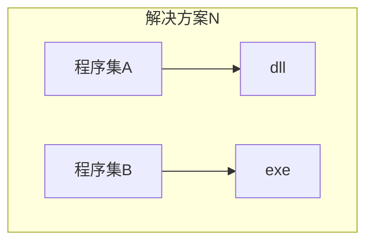

# internal关键字与程序集

类似于public， 可以修饰类或成员，区别在于它所修饰的类只能在同一个程序集(即项目)中被访问。不过其他程序集依然可以通过子类继承访问。



# 系统类扩展

在C#中，系统类扩展通常是通过静态类和方法来实现的，这种方式利用了C#的扩展方法特性。扩展方法允许你为现有的类型（包括系统类，如`string`、`List<T>`等）添加新的方法，而无需修改这些类型的定义或创建新的派生类。

以下是一个如何为系统类扩展的示例代码：

## 扩展 `string` 类

假设你想为 `string` 类添加一个方法来计算字符串中的单词数：

```csharp
using System;
using System.Linq;
 
public static class StringExtensions
{
    // 定义一个扩展方法，用于计算字符串中的单词数
    public static int WordCount(this string str)
    {
        if (string.IsNullOrEmpty(str))
        {
            return 0;
        }
 
        // 使用字符串分割和LINQ来计算单词数
        return str.Split(new[] { ' ', '\t', '\n', '\r' }, StringSplitOptions.RemoveEmptyEntries).Length;
    }
}
 
class Program
{
    static void Main()
    {
        string text = "Hello, this is a test string.";
        int wordCount = text.WordCount();
        Console.WriteLine($"The word count is: {wordCount}");
    }
}
```

## 扩展 `List<T>` 类

假设你想为 `List<T>` 类添加一个方法来计算列表中所有元素的平均值（假设 `T` 是数值类型）：

```csharp
using System;
using System.Collections.Generic;
using System.Linq;
 
public static class ListExtensions
{
    // 定义一个扩展方法，用于计算列表中所有元素的平均值
    public static double Average<T>(this List<T> list) where T : struct, IComparable, IFormattable, IConvertible
    {
        if (list == null || list.Count == 0)
        {
            throw new InvalidOperationException("The list is null or empty.");
        }
 
        // 使用LINQ来计算平均值
        return list.Cast<double>().Average();
    }
}
 
class Program
{
    static void Main()
    {
        List<double> numbers = new List<double> { 1.0, 2.0, 3.0, 4.0, 5.0 };
        double average = numbers.Average();
        Console.WriteLine($"The average is: {average}");
    }
}
```

**注意**：

1. 在上述 `List<T>` 的扩展方法中，约束 `where T : struct, IComparable, IFormattable, IConvertible` 实际上并不足以确保 `T` 是数值类型。一个更精确的方式是使用泛型约束和类型检查，或者使用特定的数值类型扩展方法。例如，可以为 `List<int>`、`List<double>` 等分别定义扩展方法。
2. 在实际应用中，扩展方法应该谨慎使用，以避免命名冲突和代码可读性下降。
3. 如果需要为多个类型提供类似的功能，可以考虑使用接口和抽象类来实现更通用的解决方案。


# 自定义运算符

在C#中，自定义运算符（也称为用户定义的运算符）通常是通过重载现有的运算符来实现的。这允许你为自定义类型（如类或结构体）定义运算符的行为。然而，需要注意的是，你只能重载C#中已经存在的运算符，不能创建全新的运算符。

以下是一个简单的例子，展示了如何为一个自定义的复数类重载加法运算符（`+`）：

```csharp
using System;
 
public struct Complex
{
    public double Real;
    public double Imaginary;
 
    public Complex(double real, double imaginary)
    {
        Real = real;
        Imaginary = imaginary;
    }
 
    // 重载加法运算符
    public static Complex operator +(Complex c1, Complex c2)
    {
        return new Complex(c1.Real + c2.Real, c1.Imaginary + c2.Imaginary);
    }
 
    // 重载ToString方法以便更好地显示复数
    public override string ToString()
    {
        return $"{Real} + {Imaginary}i";
    }
}
 
class Program
{
    static void Main()
    {
        Complex c1 = new Complex(3, 4);
        Complex c2 = new Complex(1, 2);
 
        // 使用重载的加法运算符
        Complex c3 = c1 + c2;
 
        Console.WriteLine(c3); // 输出: 4 + 6i
    }
}
```

在这个例子中，`Complex` 结构体表示一个复数，它有两个字段：`Real` 和 `Imaginary`。我们重载了加法运算符（`+`），以便当两个 `Complex` 类型的对象相加时，它们会按照复数的加法规则进行相加。

重载运算符时，需要注意以下几点：

1. 运算符重载是通过定义一个静态方法来实现的，该方法使用 `operator` 关键字后跟要重载的运算符符号。
2. 重载的运算符方法必须返回与包含它的类型相同的类型（对于一元运算符）或返回包含它的类型的实例（对于二元运算符）。
3. 运算符重载不能改变运算符的优先级、结合性或操作数的数量。
4. 不是所有的运算符都可以被重载。例如，`.`、`.`、`::`、`?:`、`==`、`!=`、`true`、`false` 等运算符不能被重载。
5. 运算符重载通常用于提供直观且易于理解的接口，但过度使用或不当使用可能会导致代码难以理解和维护。因此，在决定重载运算符之前，请仔细考虑其必要性和适当性。


# 反射

在Unity中使用反射（Reflection）可以动态地访问类型的信息，并在运行时调用方法、访问字段和属性等。这在某些情况下非常有用，比如当你需要访问未公开的API或实现一些通用的功能时。以下是一些基本的反射操作的示例代码：

## 获取类型信息

```c#
using System;
using System.Reflection;
using UnityEngine;

public class ReflectionExample : MonoBehaviour
{
    void Start()
    {
        // 获取类型信息
        Type type = typeof(GameObject);
        Debug.Log("Type Name: " + type.Name);

        // 获取所有方法
        MethodInfo[] methods = type.GetMethods();
        foreach (MethodInfo method in methods)
        {
            Debug.Log("Method: " + method.Name);
        }
    }
}
```


## 动态创建实例

```c#
using System;
using System.Reflection;
using UnityEngine;

public class ReflectionExample : MonoBehaviour
{
    void Start()
    {
        // 获取类型信息
        Type type = typeof(GameObject);

        // 创建实例
        object instance = Activator.CreateInstance(type);
        Debug.Log("Instance created: " + instance);
    }
}
```


## 动态调用方法

```c#
using System;
using System.Reflection;
using UnityEngine;

public class ReflectionExample : MonoBehaviour
{
    void Start()
    {
        // 获取类型信息
        Type type = typeof(GameObject);

        // 获取方法信息
        MethodInfo methodInfo = type.GetMethod("SetActive", BindingFlags.Public | BindingFlags.Instance);
    
        // 创建实例
        GameObject obj = new GameObject("TestObject");
        object instance = obj;
    
        // 调用方法
        methodInfo.Invoke(instance, new object[] { true });
        Debug.Log("Object is active: " + obj.activeSelf);
    }
}
```


## 访问字段和属性

```c#
using System;
using System.Reflection;
using UnityEngine;

public class ReflectionExample : MonoBehaviour
{
    void Start()
    {
        // 获取类型信息
        Type type = typeof(Transform);

        // 获取一个Transform组件的实例
        Transform transform = GetComponent<Transform>();
        object instance = transform;
    
        // 访问字段
        FieldInfo fieldInfo = type.GetField("m_Position", BindingFlags.NonPublic | BindingFlags.Instance);
        Vector3 position = (Vector3)fieldInfo.GetValue(instance);
        Debug.Log("Position: " + position);
    
        // 访问属性
        PropertyInfo propertyInfo = type.GetProperty("position");
        position = (Vector3)propertyInfo.GetValue(instance);
        Debug.Log("Position (via property): " + position);
    }
}
```

## 遍历程序集和包含的类

```c#
//获取所有程序集
Assembly[] assemblies = AppDomain.CurrentDomain.GetAssemblies();
foreach (Assembly assembly in assemblies)
{
    Type[] types = assembly.GetTypes();//扫描当前程序集下的所有类
    for(int i=0; i<types.Length; i++)
    {
        Debug.Log(types[i].Name);
    }
}
```


## 注意事项

1. 性能问题：反射操作通常比直接调用方法或访问字段属性要慢，因此不应在性能敏感的代码中使用。

2. 安全性：反射可以访问私有成员，这可能会破坏封装性。如果滥用，可能会导致代码难以维护和理解。

3. 平台兼容性：反射在Unity的不同平台（如编辑器、Android、iOS等）上的行为可能略有不同，需要测试确认。
