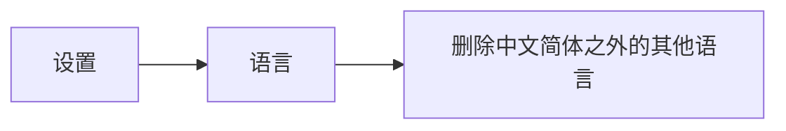
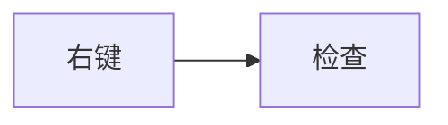

# 让地址栏中显示翻译切换

# 目前已装的油猴（篡改猴）插件脚本

YouTube去广告 6.18

CSDN广告完全过滤 4.2.4

解除B站区域限制 8.5.3

B站字幕样式自定义 1.46

懒人工具箱 6.9.1

Github 增强-高速下载 2.5.30

网易云音乐直接下载 4.1.5

# 其他插件

夜间助手

Dark Reader

Listen 1

# 删除网页中不想看到的部分

临时删除，之后便于另存为干净的网页

