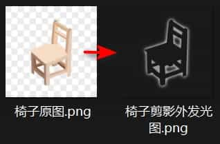

# 制作剪影外发光UI图标

这种风格简约而高级，既能突出自身又不抢占画面。大致效果：

 

制作思路：

- 复制到新图层1用钢笔抠图，背景图层0用纯黑填充
- 双击图层1，使用混合效果：外发光
  - 混合选项：混合模式变亮，填充不透明度设为0，挖空选无
  - 外发光选项：混合模式变亮，不透明度64，杂色0，方法柔和，扩展小一点（0到1自己斟酌），大小46像素
- 合并0、1两个图层到图层0，提高一点亮度，对比度也可微调，选择模式Ctrl+A，Ctrl+C 复制
- 新建图层1，填充纯白色，并添加蒙版，通道中点亮并选中这个蒙版，Ctrl+V 粘贴
- 隐藏图层0，将图层1导出为png图片即可

