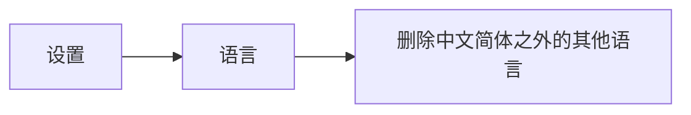
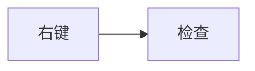

# 屏幕划词翻译

- 禁用原生划词
  - Edge浏览器自带了划词翻译，不过效果一般。禁止方式：外观 > 上下文菜单 > 选择文本时显示迷你菜单（取消勾选）
- 利用腾讯元宝客户端划词功能
  - 设置 > 快捷工具 > 划词工具栏 > 当选中文本时显示工具栏（开启）

# 让地址栏中显示翻译切换

做如下操作，然后可以在地址栏看到翻译按钮（全网页翻译，但翻译效果一般）



# 目前已装的油猴（篡改猴）插件脚本

[YouTube去广告](https://greasyfork.org/zh-CN/scripts/459541-youtube-adb)，[Github链接](https://github.com/iamfugui/youtube-adb)

[100%解锁CSDN文库vip文章阅读限制 2.2](https://github.com/Mrlimuyu/CSDN-VIP)

[解除B站区域限制](https://greasyfork.org/zh-CN/scripts/25718-解除b站区域限制)，[GitHub链接](https://github.com/ipcjs/bilibili-helper/blob/user.js/packages/unblock-area-limit/README.md)

B站字幕样式自定义 1.46

懒人工具箱 6.9.1

网易云音乐直接下载 4.1.5

# 其他插件

夜间助手

Dark Reader

Listen 1

# 删除网页中不想看到的部分

临时删除，之后便于另存为干净的网页



# 查看浏览器使用哪个内核版本号

浏览器按F12，控制台输入 javascript:alert(navigator.userAgent)

出现弹窗，文本如下：

```c#
Mozilla/5.0		这是浏览器版本
(Windows NT 10.0; Win64; x64)	这是操作系统版本
AppleWebKit/537.36 (KHTML, like Gecko)	这是浏览器引擎
Chrome/131.0.0.0	这是内核类型及版本
Safari/537.36	这是伪装的引擎
Edg/131.0.0.0	这是浏览器名称及版本
```

# 浏览器进入阅读模式

网址前面加前缀：

```
read:
```

之后会进入无图纯净模式

