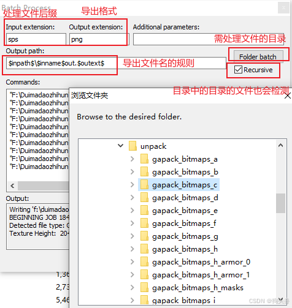

# 如龙 0

总纲：

[Yakuza 0 modding info-dump – Steam Solo](https://steamsolo.com/guide/yakuza-0-modding-info-dump-yakuza-0/)

## PAR 和 CPK 音频

相关 github 工具：

- [解包和打包 PAR 文件](https://github.com/gibbed/Gibbed.Yakuza0)，拖拽 par 文件到 exe 即可，会自动产生子文件夹。解包后是 acb 格式的音频，整个流程是 par > acb > hca(已可用 foobar2000 打开) > wav > mp3。详见教程：[打开*.acb 格式音频文件_acb 文件-CSDN 博客](https://blog.csdn.net/qq_41978159/article/details/100743190)

- [解包和打包 CPK 文件](https://github.com/esperknight/CriPakTools)，无法拖拽文件到 exe，不过可以用 cmd 指令或者 bat 脚本，解包的话执行 `CriPakTool.exe 某某.cpk ALL`（导出文件都是在同级目录下的，最好先建个空文件夹复制 cpk 进去再解），整个流程是 cpk > hca(已可用 foobar2000 打开) > wav > mp3。

- 相关下载备份：[Par 和 Cri 解包.rar](./files/Par和Cri解包.rar)， [acb 转 hca](https://sourceforge.net/projects/vgmtoolbox/)， [hca 批量转 wav.rar](./files/hca批量转wav.rar)， [wav 批量转 MP3](./C#工具集/C#_批量wav转MP3导入Nuget包.md)
  批量改扩展名可以做个 bat 脚本：

  ```bat
  @echo off
  REM 强制中文编码，防止中文提示乱码
  chcp 65001
  setlocal enabledelayedexpansion
  
  for %%f in (*) do (
      if /i not "%%~xf"==".bat" if not "%%~xf"==".hca" (
          ren "%%f" "%%~nf.hca"
      )
  )
  
  echo 所有文件已成功添加 .hca 扩展名（跳过 .bat 文件）。
  pause
  ```

国内网还看到有个带图形化界面解包 CPK 的工具（尚未亲测）：[CriPakGUI 汉化版下载 -k73 游戏之家](http://www.k73.com/down/soft/242290.html)

其他参考文章：

- [如龙 0 模型替换教程](https://www.bilibili.com/read/cv1642366)
- [视频教程](https://www.bilibili.com/video/av38037381/)
- [战斗模组列表](https://www.bilibili.com/read/cv1697503)


## 材质贴图

额外工具 SpecialK（待研究）：[SK 官方 Wiki](https://wiki.special-k.info/)， [Discord 网址](https://discord.com/channels/@me/1357078123170107483) ，[Github 版](https://github.com/SpecialKO)，[steam 旧链接](https://steamcommunity.com/groups/SpecialK_Mods)，[度盘备份 SpecialK_25.4.1.1.exe](https://pan.baidu.com/s/1W-P88ui5Meq7UPuNDc078w?pwd=bva5)

### 定位与解包.PAR 文件

所有内容都存储在.PAR 文件中，但文件数量庞大，需要确定具体加载时机。

==最简便的方法是使用进程监视器== [【链接】](https://docs.microsoft.com/en-us/sysinternals/downloads/procmon)，可查看应用程序访问的所有文件。下载运行后设置过滤器：选择 "进程名称"、"开头为"、"C:\Steam\steamapps\common\Yakuza 0\media\data"（或你的实际路径），勾选 "包含"。

这样就能显示游戏启动/读档/进入新区域时加载的所有.PAR 文件，包括场景、角色和 UI 纹理包。

例如第一章神室町的纹理文件位于：
*C:\Steam\steamapps\common\Yakuza 0\media\data\stage\w64\st_kamuro\prep*
根据昼夜变化，需要修改：
*...\prep\ngt* 或 *...\prep\day* 目录下的纹理.PAR 文件

虽然能看到加载记录，但由于信息量庞大，仍需通过后续工具解包.PAR 文件来确认具体内容。


### 修改纹理材质

定位目标.PAR 文件后，需提取并编辑其中的.DDS 纹理文件。

解包 PAR 步骤（利用前文提到的工具）：

1. 解压工具到任意文件夹，并将目标.PAR 文件复制至此
2. 在命令提示符执行 "Gibbed.Yakuza0.Unpack.exe <文件名.PAR>"
3. 工具会在同目录生成包含所有解压文件的文件夹

纹理以标准.DDS 格式存储，可用 Photoshop 配合 [DDS 插件](https://software.intel.com/en-us/articles/intel-texture-works-plugin) 编辑。GIMP 等软件也有对应插件和独立转换器。

DDS 文件保存指南：

- 无透明通道的纹理：

  > 纹理类型: Color
  > 压缩格式: BC1 Linear
  > Mip 贴图: 自动生成

- 含透明通道的纹理：

  > 纹理类型: Color + Alpha
  > 压缩格式: BCH6 Linear Fast DX11+
  > Mip 贴图: 自动生成


### 将.DDS 纹理注入游戏

修改完成后需将新.DDS 文件导入.par 文件。

所需工具：

- https://github.com/SlowpokeVG/PARC-Archive-Importer/releases

使用步骤（摘自工具页面）：

1. 解压工具到新文件夹并运行
2. 点击 "Open Archive" 选择目标.PAR 文件
3. 点击 "Widen" 转换文件格式（确保每个文件占用 2048x 字节空间）
4. 转换完成后立即保存，避免重复操作
5. 通过 "Open Files" 添加要替换的文件
6. 点击 "Inject" 注入（每次注入后需重启程序重置文件头）
7. 将新.PAR 文件保存到游戏原始目录（务必先备份原文件！）

若操作正确，游戏将自动使用新.PAR 文件。


## 常用路径记录

- 特效：D:\SteamLibrary\steamapps\common\Yakuza 0\media\data\effect\effect_always.par
- UI：D:\SteamLibrary\steamapps\common\Yakuza 0\media\data\2dpar\ui_e.par
- 2D 图片：D:\SteamLibrary\steamapps\common\Yakuza 0\media\data\2dpar\sprite_c.par
- 音效：D:\SteamLibrary\steamapps\common\Yakuza 0\media\data\soundpar\sound.par
- 背景音乐：D:\SteamLibrary\steamapps\common\Yakuza 0\media\data\soundcpk\bgm.cpk
- 背景音乐 2：D:\SteamLibrary\steamapps\common\Yakuza 0\media\data\soundcpk\se.cpk
- 通用人物骨骼：D:\SteamLibrary\steamapps\common\Yakuza 0\media\data\chara_common\bone.par
- 通用人物贴图：D:\SteamLibrary\steamapps\common\Yakuza 0\media\data\chara_common\tex_common_w64.par
- 男二号贴图：D:\SteamLibrary\steamapps\common\Yakuza 0\media\data\chara\w64\auth\c_at_majima\tex00.par
- 男二号 Mesh：D:\SteamLibrary\steamapps\common\Yakuza 0\media\data\chara\w64\auth\c_at_majima\mesh.par
- 男二号头发：D:\SteamLibrary\steamapps\common\Yakuza 0\media\data\chara\w64\accessory\b_c_at_majima_hair1\mesh.par
- 男一号贴图：D:\SteamLibrary\steamapps\common\Yakuza 0\media\data\chara\w64\auth\c_at_kiryu\tex00.par
- 男一号 Mesh：D:\SteamLibrary\steamapps\common\Yakuza 0\media\data\chara\w64\auth\c_at_kiryu\mesh.par
- 迪斯科动作：D:\SteamLibrary\steamapps\common\Yakuza 0\media\data\motion_w64\MnGDisco.par
- 衣服：D:\SteamLibrary\steamapps\common\Yakuza 0\media\data\cloth\cloth_collision.par

## GMT 面部表情文件

比如桐生的 gmt 文件：D:\SteamLibrary\steamapps\common\Yakuza 0\media\data\chara\w64\auth\c_at_kiryu\face.gmt
Github 上有个相关的 blender 插件：[yakuza-gmt-blender: Blender Import/Export Yakuza series GMT Animation files.](https://github.com/mosamadeeb/yakuza-gmt-blender)

## GMD 模型文件

比如桐生的 gmd 文件：D:\SteamLibrary\steamapps\common\Yakuza 0\media\data\chara\w64\auth\c_at_kiryu\mesh.par
解包后得到 c_at_kiryu.gmd 文件。

- [如龙 7Modding 教程#4：使用 Blender 修改模型 - 哔哩哔哩](https://www.bilibili.com/opus/696549622773972996)
- blender 插件 Github 下载：[Releases · theturboturnip/yk_gmd_io](https://github.com/theturboturnip/yk_gmd_io/releases)


# 黑神话悟空

黑神话悟空是 UE5 引擎开发的游戏，关于 UE 引擎游戏的解包：[黑神话悟空解包](../UE/UE知识外链.md#黑神话悟空解包)


# 对马岛之魂

所需工具

- 游戏《对马岛之魂》
- GoTExtractor
- Noesis 本体： [Noesis](https://www.richwhitehouse.com/index.php?content=inc_res.php)
- Noesis 插件（对马岛之魂）： [fmt_GoT_SPS-Noesis-Plugin](https://github.com/SilverEzredes/fmt_GoT_SPS-Noesis-Plugin)
- Noesis 类似的插件还有：
- Noesis 插件（猎天使魔女123，尼尔机械纪元，合金装备崛起：复仇等等）：[noesis_bayonetta_pc](https://github.com/Kerilk/noesis_bayonetta_pc)，[知乎教程（Unity复刻尼尔：机械纪元）](https://zhuanlan.zhihu.com/p/476863849)

## GoTExtractor

这个工具作用是从游戏本体中的.psarc 文件提取出.sps、.xmesh 等文件。
该工具实际调用的是 [UnPSARC](https://github.com/rm-NoobInCoding/UnPSARC)，是用来解压 PS 平台 psarc 文件的工具。

两个下载地址，一个是 [GoTExtractor 官网](https://www.nexusmods.com/ghostoftsushima/mods/65?tab=files)，另一个是 [3DMGAME 论坛](https://bbs.3dmgame.com/thread-6509992-1-1.html)

解包/打包方法：

1. 解压，双击运行 GoTExtractor.exe 打开程序
2. 选择 File -> Open Directory 选择 psarc 文件所在目录 如: F:\steam\steamapps\common\Ghost of Tsushima DIRECTOR’S CUT\cache_pc\psarc
3. (可选) 勾选 Structure preview 可以实时预览选中文件里面的文件，但需要加载时间
4. 点击 Unpack selected PSARC 将当前选择的文件解包到指定文件夹
5. 点击 Repack PSARC from folder 可以将指定文件夹里面的内容打包为 psarc 文件

## Noesis

Noesis 可以把 sps 格式转成 dds、tga、png 格式。比如这个版本测试可用： noesisv447.zip。
插件根据 github 上教学使用就行，Noesis 打开使用也是很直观的，这里说下 Noesis 怎么批量导出。

1. 工具栏 - Tools - Batch Process
2. 点击【Folder batch】，可选择批处理文件的目录，
3. Recursive 勾上则可检测目录中的目录。

 


# 怪猎崛起

[解包教程](../UE/UE知识外链.md#怪猎崛起资源解包并导入UE5)（和对马岛一样用到了Noesis）


