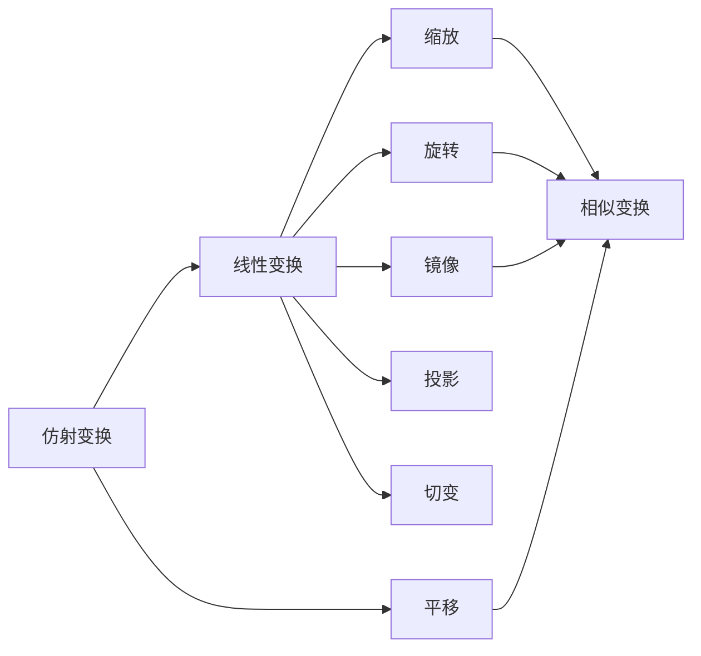
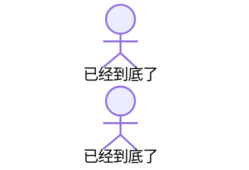

#  向量

## 点乘

​	也叫内积，结果为标量。计算向量夹角
$$
\begin{align*} 
\begin{pmatrix}  
a_{1} & b_{1} & c_{1}
\end{pmatrix}
\cdot
\begin{pmatrix}  
a_{2} \\  
b_{2} \\
c_{2}
\end{pmatrix}
&=a_{1}a_{2}+b_{1}b_{2}+c_{1}c_{2} \\
\\
\vec{a} \cdot \vec{b} &= \left| \vec{a} \right| \left| \vec{b} \right| \cos \theta \\
反余弦得到弧度值 \theta&=math.acos(...) \\
再计算角度值 &=
math.degrees(...)
\end{align*}
$$

## 叉乘

​	也叫外积，结果为向量。计算两个向量构成平面的法向量
$$
\left| \vec{a} \times \vec{b} \right| = \left| \vec{a} \right| \left| \vec{b} \right| \sin \theta \\
$$

$$
\begin{pmatrix}  
a_{1} & b_{1} & c_{1}
\end{pmatrix}
\times
\begin{pmatrix}  
a_{2} \\  
b_{2} \\
c_{2}
\end{pmatrix}
=\begin{pmatrix}  
b_{1}c_{2}-c_{1}b_{2} \\  
c_{1}a_{2}-a_{1}c_{2} \\
a_{1}b_{2}-b_{1}a_{2}
\end{pmatrix}
$$

​	简便记法：i，j，k为三维坐标系单位向量

<svg viewBox="0 0 250 100" height="150">
<rect width="100%" height="100%" fill="rgb(50,50,50)" />
<line x1="36" y1="30" x2="100" y2="82" style="stroke: green; stroke-width: 2;" />
<line x1="70" y1="30" x2="134" y2="82" style="stroke: green; stroke-width: 2;" />
<line x1="104" y1="30" x2="168" y2="82" style="stroke: green; stroke-width: 2;" />
<line x1="140" y1="30" x2="70" y2="82" style="stroke: Maroon; stroke-width: 2;" />
<line x1="174" y1="30" x2="104" y2="82" style="stroke: Maroon; stroke-width: 2;" />
<line x1="208" y1="30" x2="138" y2="82" style="stroke: Maroon; stroke-width: 2;" />
<text x="33" y="27" style="fill: grey;">i　　j　　k　　i　　j　　k</text>
<text x="33" y="60" style="fill: grey;">a1　b1　c1　a1　b1　c1</text>
<text x="33" y="90" style="fill: grey;">a2　b2　c2　a2　b2　c2</text>
</svg>

​	用右手法则计算叉乘向量的方向：

<svg width="400" height="200">
<!-- 绘制x轴和标签 -->
<line x1="200" y1="100" x2="320" y2="180" style="stroke: grey; stroke-width: 2; marker-end: url(#arrowhead);" />
<text x="330" y="170" style="fill: grey;">b</text>
<!-- 绘制y轴和标签 -->
<line x1="200" y1="100" x2="200" y2="4" style="stroke: grey; stroke-width: 2; marker-end: url(#arrowhead);" />  
<text x="150" y="14" style="fill: grey">a x b</text>
<!-- 绘制z轴和标签 -->
<line x1="200" y1="100" x2="80" y2="180" style="stroke: grey; stroke-width: 2; marker-end: url(#arrowhead);" />
<text x="65" y="180" style="fill: grey">a</text>
<!-- 手部分 -->
<ellipse cx="200" cy="120" rx="50" ry="40" fill="orange" />
<ellipse cx="230" cy="90" rx="18" ry="50" fill="orange" />
<ellipse cx="184" cy="146" rx="30" ry="10" style="stroke: white; stroke-width: 3; fill: orange" />
<ellipse cx="178" cy="130" rx="30" ry="12" style="stroke: white; stroke-width: 3; fill: orange" />
<ellipse cx="176" cy="110" rx="30" ry="12" style="stroke: white; stroke-width: 3; fill: orange" />
<ellipse cx="178" cy="92" rx="30" ry="12" style="stroke: white; stroke-width: 3; fill: orange" />
</svg>

## 哈达玛积

​	就是对应位置相乘，shader里两个向量相乘就是哈达玛积，矩阵也一样
$$
\displaylines{
A = \begin{pmatrix}  
a_{1} & a_{2}
\end{pmatrix}, \quad  
B = \begin{pmatrix}  
b_{1} & b_{2}
\end{pmatrix} \\  
A \circ B = \begin{pmatrix}  
a_{1}b_{1} & a_{2}b_{2}
\end{pmatrix}
}
$$

## 求点到平面距离

平面公式Ax+By+Cz+D=0，其中（A,B,C）为法向量，则点P（x' y' z'）到平面距离：
$$
\frac{\left|Ax'+By'+Cz'+D\right|}{\sqrt{A^2+B^2+C^2}}
$$

# 矩阵

## 行矩阵和列矩阵

$$
\begin{align*} 
行矩阵 M_{13}&=
\begin{bmatrix}
3 & 9 & 88
\end{bmatrix}\\
列矩阵 M_{31}&=
\begin{bmatrix}
3\\
9\\
88
\end{bmatrix}
\end{align*}
$$

## 矩阵转置

$$
\begin{align*} 
设原矩阵为M &= \begin{bmatrix}  
m_{11} & m_{12} & \cdots & m_{1n} \\  
m_{21} & m_{22} & \cdots & m_{2n} \\  
\vdots & \vdots & \ddots & \vdots \\  
m_{m1} & m_{m2} & \cdots & m_{mn}
\end{bmatrix}\\
\\
其转置矩阵M^T &= \begin{bmatrix}  
m_{11} & m_{21} & \cdots & m_{m1} \\  
m_{12} & m_{22} & \cdots & m_{m2} \\  
\vdots & \vdots & \ddots & \vdots \\  
m_{1n} & m_{2n} & \cdots & m_{mn}
\end{bmatrix}\\
\\
M^{TT} &= M
\end{align*}
$$

## 矩阵和标量的乘法

$$
\begin{align*} 
设矩阵A &= \begin{bmatrix}  
a_{11} & a_{12} & \cdots & a_{1n} \\  
a_{21} & a_{22} & \cdots & a_{2n} \\  
\vdots & \vdots & \ddots & \vdots \\  
a_{m1} & a_{m2} & \cdots & a_{mn} \\  
\end{bmatrix}\\
\\
标量k \times A &= \begin{bmatrix}  
ka_{11} & ka_{12} & \cdots & ka_{1n} \\  
ka_{21} & ka_{22} & \cdots & ka_{2n} \\  
\vdots & \vdots & \ddots & \vdots \\  
ka_{m1} & ka_{m2} & \cdots & ka_{mn} 
\end{bmatrix}
\end{align*}
$$

## 矩阵和矩阵的乘法

$$
\displaylines{
设矩阵 A 和 B 分别为：  
A_{mn} = \begin{bmatrix}  
a_{11} & a_{12} & \cdots & a_{1n} \\  
a_{21} & a_{22} & \cdots & a_{2n} \\  
\vdots & \vdots & \ddots & \vdots \\  
a_{m1} & a_{m2} & \cdots & a_{mn}  
\end{bmatrix},  
\quad  
B_{np} = \begin{bmatrix}  
b_{11} & b_{12} & \cdots & b_{1p} \\  
b_{21} & b_{22} & \cdots & b_{2p} \\  
\vdots & \vdots & \ddots & \vdots \\  
b_{n1} & b_{n2} & \cdots & b_{np}  
\end{bmatrix}\\ 
\\
则矩阵 A 和 B 相乘得到矩阵 C，其中 C = AB,具体为:\\
\\
C_{mp} = AB(或写作A \times B) = \begin{bmatrix}  
\sum_{k=1}^{n} a_{1k}b_{k1} & \sum_{k=1}^{n} a_{1k}b_{k2} & \cdots & \sum_{k=1}^{n} a_{1k}b_{kp} \\  
\sum_{k=1}^{n} a_{2k}b_{k1} & \sum_{k=1}^{n} a_{2k}b_{k2} & \cdots & \sum_{k=1}^{n} a_{2k}b_{kp} \\  
\vdots & \vdots & \ddots & \vdots \\  
\sum_{k=1}^{n} a_{mk}b_{k1} & \sum_{k=1}^{n} a_{mk}b_{k2} & \cdots & \sum_{k=1}^{n} a_{mk}b_{kp}  
\end{bmatrix}  
\\
\\
左矩阵列数=右矩阵行数\\
M_{mn} \times M_{nk} = M_{mk}\\
\\
矩阵相乘不满足交换律\\
M1 \times M2 \neq M2 \times M1\\
\\
矩阵相乘满足结合律\\
M1 \times M2 \times M3 = M1 \times (M2 \times M3)
}
$$

## 特殊矩阵

### 方阵

- 行数与列数相同的矩阵，常见2x2, 3x3, 4x4
- 对角线元素：方阵中行数与列数相同的元素
- 非对角线元素：方阵中除了对角线元素以外的元素

### 对角矩阵

$$
M=
\begin{bmatrix}
1 & 0 & 0 \\
0 & -3 & 0 \\
0 & 0 & 2
\end{bmatrix}
$$

### 数量矩阵

$$
M=
\begin{bmatrix}
3 & 0 & 0 \\
0 & 3 & 0 \\
0 & 0 & 3
\end{bmatrix}
$$

### 单位矩阵

$$
M=
\begin{bmatrix}
1 & 0 & 0 \\
0 & 1 & 0 \\
0 & 0 & 1
\end{bmatrix}
$$

## 求逆矩阵

### 行列式

仅方阵有行列式，标量，不为0则有逆矩阵
$$
\left|M_{22}\right| =\left | \begin{array}{cc}  
m_{11} & m_{12}\\  
m_{21} & m_{22}\\   
\end{array} \right |
=m_{11} m_{22}-m_{21} m_{12}\\
$$

<svg viewBox="0 0 130 80" height="130">
<rect width="100%" height="100%" fill="rgb(50,50,50)" />
<line x1="36" y1="27" x2="100" y2="50" style="stroke: green; stroke-width: 2;" />
<line x1="100" y1="27" x2="36" y2="50" style="stroke: Maroon; stroke-width: 2;" />
<text x="26" y="27" style="fill: grey;">m11　m12</text>
<text x="26" y="60" style="fill: grey;">m21　m22</text>
</svg>

$$
\displaylines{
\left|M_{33}\right| =\left | \begin{array}{ccc}  
m_{11} & m_{12} & m_{13}\\  
m_{21} & m_{22} & m_{23}\\  
m_{31} & m_{32} & m_{33}\\  
\end{array} \right |\\
=m_{11}m_{22}m_{33} + m_{21}m_{32}m_{13} + m_{31}m_{12}m_{23}\\
-m_{11}m_{32}m_{23} - m_{21}m_{12}m_{33} - m_{31}m_{22}m_{13}
}
$$

<svg viewBox="0 0 284 100" height="150">
<rect width="100%" height="100%" fill="rgb(50,50,50)" />
<line x1="36" y1="30" x2="100" y2="82" style="stroke: green; stroke-width: 2;" />
<line x1="80" y1="30" x2="148" y2="82" style="stroke: green; stroke-width: 2;" />
<line x1="128" y1="30" x2="196" y2="82" style="stroke: green; stroke-width: 2;" />
<line x1="148" y1="30" x2="70" y2="82" style="stroke: Maroon; stroke-width: 2;" />
<line x1="198" y1="30" x2="124" y2="82" style="stroke: Maroon; stroke-width: 2;" />
<line x1="244" y1="30" x2="170" y2="82" style="stroke: Maroon; stroke-width: 2;" />
<text x="5" y="27" style="fill: grey;">m11　m12　m13　m11　m12　m13</text>
<text x="5" y="60" style="fill: grey;">m21　m22　m23　m21　m22　m23</text>
<text x="5" y="90" style="fill: grey;">m31　m32　m33　m31　m32　m33</text>
</svg>

### 代数余子式

$$
c_{ij}=-1^{i+j}\times \left|去掉第i行第j列的矩阵\right|
$$

### 代数余子式矩阵

$$
C_{33}=
\begin{bmatrix}
c_{11} & c_{12} & c_{13} \\
c_{21} & c_{22} & c_{23} \\
c_{31} & c_{32} & c_{33}
\end{bmatrix}
$$

### 标准伴随矩阵

$$
即代数余子式矩阵的转置:\\
C^T
$$

### 逆矩阵

$$
\displaylines{
逆矩阵 = 标准伴随矩阵 / 行列式\\
M^{-1} = \frac{C^T}{\left|M\right|}\\
\\
逆矩阵特点:\\
M=(M^{-1})^{-1}\\
(M_{单位})^{-1}=M_{单位}\\
(M^T)^{-1}=(M^{-1})^T\\
(AB)^{-1} = B^{-1}A^{-1}\\
\\
几何意义: 还原矩阵变换
}
$$

## 矩阵变换

### Unity向量乘以矩阵的规则

Unity矩阵与向量运算，普遍采用列矩阵右乘（如果左乘，矩阵需做转置）
$$
\displaylines{
\begin{bmatrix}
c_{11} & c_{12} & c_{13}\\
c_{21} & c_{22} & c_{23}\\
c_{31} & c_{32} & c_{33}
\end{bmatrix}\times
\begin{bmatrix}
x\\
y\\
z
\end{bmatrix}=
\begin{bmatrix}
x'\\
y'\\
z'
\end{bmatrix}\\
（不做平移，三维足矣）
}
$$

### 线性变换 及 非线性变换

线性变换：保留矢量加和标量乘的计算
$$
\displaylines{
f(x)+f(y)=f(x+y)\\
kf(x) = f(kx)
}
$$

### 仿射变换 及 齐次矩阵

仿射变换：包含线性变换与平移变换，用4x4矩阵表示，即齐次矩阵。
$$
\displaylines{
齐次坐标列矩阵=
\begin{bmatrix}
x\\
y\\
z\\
w
\end{bmatrix},表示点则w=1,表示向量则w=0\\
齐次矩阵构成=\begin{bmatrix}
M_{33} & T_{31}\\
0_{13} & 1
\end{bmatrix}, M_{33}表示线性变换矩阵, T_{31}表示平移变换矩阵
}
$$

#### 平移变换

$$
\displaylines{
\begin{bmatrix}
1 & 0 & 0 & X平移量\\
0 & 1 & 0 & Y平移量\\
0 & 0 & 1 & Z平移量\\
0 & 0 & 0 & 1\\
\end{bmatrix}
}
$$

#### 缩放（伸缩）变换

$$
\displaylines{
\begin{bmatrix}
X_{s} & 0 & 0 & 0\\
0 & Y_{s} & 0 & 0\\
0 & 0 & Z_{s} & 0\\
0 & 0 & 0 & 1\\
\end{bmatrix}
}
$$

#### 旋转变换

属于正交矩阵，即 **M**−1=**M**T，且行向量和列向量都是单位向量
$$
\displaylines{
绕X轴顺时针旋转\theta角度\\
\begin{bmatrix}
1 & 0 & 0 & 0\\
0 & \cos\theta & -\sin\theta & 0\\
0 & \sin\theta & \cos\theta & 0\\
0 & 0 & 0 & 1\\
\end{bmatrix}\\
\\
绕Y轴顺时针旋转\theta角度\\
\begin{bmatrix}
\cos\theta & 0 & \sin\theta & 0\\
0 & 1 & 0 & 0\\
-\sin\theta & 0 & \cos\theta & 0\\
0 & 0 & 0 & 1\\
\end{bmatrix}\\
\\
绕Z轴顺时针旋转\theta角度\\
\begin{bmatrix}
\cos\theta & -\sin\theta & 0 & 0\\
\sin\theta & \cos\theta & 0 & 0\\
0 & 0 & 1 & 0\\
0 & 0 & 0 & 1\\
\end{bmatrix}\\
}
$$

#### 镜像（翻转）变换

在三维空间中，镜像变换（或称为反射变换）通常是通过一个镜像平面来定义的。镜像平面可以由一个法向量和一个点（通常选择原点）来确定。为了简化问题，我们通常考虑通过原点的镜像平面，这样只需要一个法向量就足够了。

假设我们有一个通过原点的镜像平面，其法向量为 **n**=(nx,ny,nz)。镜像矩阵 **M** 可以表示为：
$$
\displaylines{
M_镜=M_{单位}-2n^Tn\\
M_镜=\begin{bmatrix}
1&0&0\\
0&1&0\\
0&0&1
\end{bmatrix}-2
\begin{bmatrix}
n_x\\
n_y\\
n_z
\end{bmatrix}
\begin{bmatrix}
n_x & n_y & n_z
\end{bmatrix}=
\begin{bmatrix}
1-2n_x^2 & -2n_xn_y & -2n_xn_z\\
-2n_yn_x & 1-2n_y^2 & -2n_yn_z\\
-2n_zn_x & -2n_zn_y & 1-2n_z^2
\end{bmatrix}\\
具体举例，yz平面（n_y和n_z为0）水平镜像=
\begin{bmatrix}
-1 & 0 & 0 & 0\\
0 & 1 & 0 & 0\\
0 & 0 & 1 & 0\\
0 & 0 & 0 & 1
\end{bmatrix}
}
$$
注意：由于 **n** 是单位向量（即 ∣**n**∣=1），所以 nx2+ny2+nz2=1，这保证了 **M** 是一个正交矩阵（即 **M**−1=**M**T，且行向量和列向量都是单位向量）并且其行列式为 −1（即 det(**M**)=−1），这是镜像变换的典型特征。

#### 推移（错切）变换，简称切变

用来描述两个距离很近、大小相等、方向相反的平行力作用于同一物体上所引起的形变
$$
X轴切变矩阵=
\begin{bmatrix}
1 & \tan\theta & 0 & 0 \\
0 & 1 & 0 & 0\\
0 & 0 & 1 & 0\\
0 & 0 & 0 & 1
\end{bmatrix}
$$

  
<svg width="400" height="200"> 
<line x1="0" y1="170" x2="390" y2="170" style="stroke: grey; stroke-width: 2; marker-end: url(#arrowhead)" />  
<text x="390" y="188" style="fill: grey;">x</text>   
<line x1="100" y1="200" x2="100" y2="4" style="stroke: grey; stroke-width: 2; marker-end: url(#arrowhead)" />  
<text x="80" y="10" style="fill: grey">y</text> 
<path d="M100,170 100,90 180,90 180,170 z"
      style="stroke: blue; stroke-width: 2; fill: none;" />
<path d="M100,170 150,90 230,90 180,170 z"
      style="stroke: red; stroke-width: 2; fill: none;" />
<text x="105" y="140" style="fill: grey">θ</text>  
</svg>

$$
Y轴切变矩阵=
\begin{bmatrix}
1 & 0 & 0 & 0 \\
\tan\theta & 1 & 0 & 0\\
0 & 0 & 1 & 0\\
0 & 0 & 0 & 1
\end{bmatrix}
$$

  
<svg width="400" height="200"> 
<line x1="0" y1="170" x2="390" y2="170" style="stroke: grey; stroke-width: 2; marker-end: url(#arrowhead)" />  
<text x="390" y="188" style="fill: grey;">x</text>   
<line x1="100" y1="200" x2="100" y2="4" style="stroke: grey; stroke-width: 2; marker-end: url(#arrowhead)" />  
<text x="80" y="10" style="fill: grey">y</text> 
<path d="M100,170 100,90 180,90 180,170 z"
      style="stroke: blue; stroke-width: 2; fill: none;" />
<path d="M100,170 100,90 180,30 180,110 z"
      style="stroke: red; stroke-width: 2; fill: none;" />
<text x="126" y="165" style="fill: grey">θ</text>  
</svg>

$$
Z轴切变矩阵=
\begin{bmatrix}
1 & 0 & 0 & 0 \\
0 & 1 & 0 & 0\\
\tan\theta & 0 & 1 & 0\\
0 & 0 & 0 & 1
\end{bmatrix}\\
(函数图省略)
$$

#### 投影变换

投影变换是将向量投影到某个子空间上的操作。在图形学中，通常涉及到将三维对象投影到二维平面上，如透视投影或正交投影。常见矩阵比如投影矩阵 **UNITY_MATRIX_P**，用来描述透视投影的效果，完成从视图空间（View Space）到裁剪空间（Clip Space）的转换。

#### 复合变换

也叫级联变换，是所有矩阵变换的组合。

例如，一个点P(1,1,1)，绕Z轴旋转30度，平移(5,4,2)，缩放(3,2,1)，公式如下：
$$
\begin{bmatrix}
3 & 0 & 0 & 0\\
0 & 2 & 0 & 0\\
0 & 0 & 1 & 0\\
0 & 0 & 0 & 1
\end{bmatrix}\times
\begin{bmatrix}
1 & 0 & 0 & 5\\
0 & 1 & 0 & 4\\
0 & 0 & 1 & 2\\
0 & 0 & 0 & 1
\end{bmatrix}\times
\begin{bmatrix}
\cos30 & -\sin30 & 0 & 0\\
\sin30 & \cos30 & 0 & 0\\
0 & 0 & 1 & 0\\
0 & 0 & 0 & 1
\end{bmatrix}\times
\begin{bmatrix}
1\\
1\\
1\\
1
\end{bmatrix}=
\begin{bmatrix}
x\\
y\\
z\\
1
\end{bmatrix}
$$
注意，复合变换的顺序，满足结合律，不满足交换律。

### Unity常用变换矩阵

- UNITY_MATRIX_M：将点从模型空间（对象空间）下，转换到世界空间下。逆矩阵UNITY_MATRIX_I_M
- UNITY_MATRIX_V：将点从世界空间下，转换到观察空间（相机空间）下。逆矩阵UNITY_MATRIX_I_V
- UNITY_MATRIX_P：将点从观察空间（相机空间）下，转换到裁剪空间（投影空间）下。逆矩阵UNITY_MATRIX_I_P
- UNITY_MATRIX_MVP：以上步骤三合一。
- UNITY_MATRIX_VP：VP步骤二合一，逆矩阵UNITY_MATRIX_I_VP
- 裁剪空间到NDC空间没有内置矩阵，但计算过程有内置函数。
- 以上矩阵变换，在URP shader里基本不用自己写，顶点着色器里直接调用`VertexPositionInputs positionInputs = GetVertexPositionInputs(模型空间坐标)`即可。

