## Latex工具网址

[Online Visual Math Editor for Latex and MathML (math-editor.online)](https://math-editor.online/)


## 矩阵

$$
矩阵：
\begin{bmatrix}
	T_x & T_y & T_z \\
	B_x & B_y & B_z \\
	N_x & N_y & N_z
\end{bmatrix}
行列式：
\begin{array}{|}
	1 & 2 & 3 \\
	4 & 5 & 6 \\
	7 & 8 & 9
\end{array}
另一种：
  
\left | \begin{array}{ccc}  
1 & 6 & 9 \\  
7 & 90 & f(x) \\  
9 & \psi(x) & g(x)  
\end{array} \right |  

向量：
\begin{pmatrix}  
a_{11} & a_{12} \\  
a_{21} & a_{22}  
\end{pmatrix}
$$

### 向量点乘

$$
\begin{align*}  
\vec{a} &= (a_1, a_2, \ldots, a_n) \\  
\vec{b} &= (b_1, b_2, \ldots, b_n) \\  
\vec{a} \cdot \vec{b} &= a_1 \times b_1 + a_2 \times b_2 + \ldots + a_n \times b_n \\
\mathbf{a} \cdot \mathbf{b} &= \left| \mathbf{a} \right| \left| \mathbf{b} \right| \cos \theta
\end{align*}
$$


## 除法公式

$$
pixel= \frac{normal+1}{2}
$$

## 乘法公式

$$
normal = pixel\times 2-1
$$

## 开方公式

$$
x=\frac{-b\pm\sqrt{b^{2}-4ac}}{2a}
开n次方:\sqrt[n]{3}
$$

## SVG绘图

官网：[入门 - SVG：可缩放矢量图形 | MDN (mozilla.org)](https://developer.mozilla.org/zh-CN/docs/Web/SVG/Tutorial/Getting_Started)

Html的 svg 标签能够真正做到自由作图：

<div style="display: flex; justify-content: center; align-items: center; ">
<svg width="240" height="170">
<title>SVG Sample</title>
<desc>This is a sample to use SVG in markdown on the website cnblogs.</desc>
<circle cx="70" cy="95" r="50" style="stroke: grey; fill: none;"/>
<circle cx="170" cy="95" r="50" style="stroke: grey; fill: grey;"/>
</svg></div>


<div style="display: flex; justify-content: center; align-items: center; ">  
<svg version="1.1"
 baseProfile="full"
 width="300" height="200"
 xmlns="http://www.w3.org/2000/svg">
<rect width="100%" height="100%" fill="red" />
<circle cx="150" cy="100" r="80" fill="green" />
<text x="150" y="125" font-size="60" text-anchor="middle" fill="white">SVG</text>
</svg></div>


因为没有现成的绘制函数图的语言，所以可用SVG绘制函数图：


<div style="display: flex; justify-content: center; align-items: center; ">  
<svg width="400" height="200">
<!-- 定义箭头，但这段代码在Typora下无意义，而且有更简单方法，即文末放一个空的Mermaid时序图代码块
<defs>  
    <marker id="arrowhead" refX="5" refY="5" markerWidth="6" markerHeight="6" orient="auto" style="fill: grey;">  
        <path d="M 0 0 L 10 5 L 0 10 z" />  
    </marker>  
</defs> -->
<!-- 绘制x轴和标签 -->  
<line x1="0" y1="100" x2="390" y2="100" style="stroke: grey; stroke-width: 2; marker-end: url(#arrowhead);" />  
<text x="390" y="90" style="fill: grey;">x</text>  
<!-- 绘制y轴和标签 -->  
<line x1="200" y1="200" x2="200" y2="4" style="stroke: grey; stroke-width: 2; marker-end: url(#arrowhead);" />  
<text x="185" y="10" style="fill: grey; transform: rotate(-90 200 100);">y</text>
<!-- 其他类型的箭头 -->  
<line x1="0" y1="120" x2="390" y2="120" style="stroke: grey; stroke-width: 2; marker-end: url(#crosshead);" />
<line x1="0" y1="140" x2="390" y2="140" style="stroke: grey; stroke-width: 2; marker-end: url(#filled-head);" />
<line x1="0" y1="160" x2="390" y2="160" style="stroke: grey; stroke-width: 2; stroke-dasharray:10,5; marker-end: url(#sequencenumber);" />  
</svg></div>


<div style="display: flex; justify-content: center; align-items: center; ">  
<svg width="400" height="200">
<!-- 绘制x轴和标签 -->  
<line x1="0" y1="100" x2="390" y2="100" style="stroke: grey; stroke-width: 2; marker-end: url(#arrowhead);" />  
<text x="390" y="90" style="fill: grey;">x</text>  
<!-- 绘制y轴和标签 -->  
<line x1="200" y1="200" x2="200" y2="4" style="stroke: grey; stroke-width: 2; marker-end: url(#arrowhead);" />  
<text x="185" y="10" style="fill: grey; transform: rotate(-90 200 100);">y</text>  
<!-- 绘制sin(x)曲线（这里使用二次贝塞尔曲线近似） -->  
<path d="M50,100 C50,100 125,250 200,100 C200,100 275,-50 350,100"  
      style="stroke: blue; stroke-width: 2; fill: none;" />
<!-- 画点，以便确定曲线的参数，之后可以注释掉 --> 
<circle cx="6" cy="6" r="3" style="fill: green;"/>
<circle cx="50" cy="100" r="3" style="fill: red;"/>
<circle cx="125" cy="170" r="3" style="fill: pink;"/>
<circle cx="200" cy="100" r="3" style="fill: red;"/>
<circle cx="275" cy="30" r="3" style="fill: yellow;"/>
<circle cx="350" cy="100" r="3" style="fill: red;"/>
</svg></div>


右手定理

<div style="display: flex; justify-content: center; align-items: center; ">
<svg width="400" height="200">
<!-- 绘制x轴和标签 -->
<line x1="200" y1="100" x2="320" y2="180" style="stroke: grey; stroke-width: 2; marker-end: url(#arrowhead);" />
<text x="330" y="170" style="fill: grey;">x</text>
<!-- 绘制y轴和标签 -->
<line x1="200" y1="100" x2="200" y2="4" style="stroke: grey; stroke-width: 2; marker-end: url(#arrowhead);" />  
<text x="180" y="10" style="fill: grey; transform: rotate(-90 200 100);">y</text>
<!-- 绘制z轴和标签 -->
<line x1="200" y1="100" x2="80" y2="180" style="stroke: grey; stroke-width: 2; marker-end: url(#arrowhead);" />
<text x="65" y="180" style="fill: grey; transform: rotate(-90 200 100);">z</text>
<!-- 手部分 -->
<ellipse cx="200" cy="120" rx="50" ry="40" fill="orange" />
<ellipse cx="230" cy="90" rx="18" ry="50" fill="orange" />
<ellipse cx="184" cy="146" rx="30" ry="10" style="stroke: white; stroke-width: 3; fill: orange" />
<ellipse cx="178" cy="130" rx="30" ry="12" style="stroke: white; stroke-width: 3; fill: orange" />
<ellipse cx="176" cy="110" rx="30" ry="12" style="stroke: white; stroke-width: 3; fill: orange" />
<ellipse cx="178" cy="92" rx="30" ry="12" style="stroke: white; stroke-width: 3; fill: orange" />
</svg></div>


左手定理

<div style="display: flex; justify-content: center; align-items: center; "> 
<svg width="400" height="200"> 
<!-- 绘制x轴和标签 -->  
<line x1="200" y1="100" x2="320" y2="180" style="stroke: grey; stroke-width: 2; marker-end: url(#arrowhead);" />
<text x="330" y="170" style="fill: grey;">x</text>
<!-- 绘制y轴和标签 -->
<line x1="200" y1="100" x2="200" y2="4" style="stroke: grey; stroke-width: 2; marker-end: url(#arrowhead);" />
<text x="180" y="10" style="fill: grey; transform: rotate(-90 200 100);">y</text>
<!-- 绘制z轴和标签 -->
<line x1="200" y1="100" x2="80" y2="180" style="stroke: grey; stroke-width: 2; marker-end: url(#arrowhead);" />
<text x="65" y="180" style="fill: grey; transform: rotate(-90 200 100);">z</text>
<!-- 手部分 -->
<ellipse cx="200" cy="120" rx="50" ry="40" fill="orange" />
<ellipse cx="170" cy="90" rx="18" ry="50" fill="orange" />
<ellipse cx="216" cy="146" rx="30" ry="10" style="stroke: white; stroke-width: 3; fill: orange" />
<ellipse cx="222" cy="130" rx="30" ry="12" style="stroke: white; stroke-width: 3; fill: orange" />
<ellipse cx="224" cy="110" rx="30" ry="12" style="stroke: white; stroke-width: 3; fill: orange" />
<ellipse cx="222" cy="92" rx="30" ry="12" style="stroke: white; stroke-width: 3; fill: orange" />
</svg></div>


<div style="display: flex; justify-content: center; align-items: center; ">
<!--  绘画按照200*100，呈现扩大一倍400*200 -->
<svg viewBox="0 0 200 100" width="400" height="200">
  <rect width="100%" height="100%" fill="green" />
  <path
    fill="none"
    stroke="lightgrey"
    d="M20,50 C20,-50 180,150 180,50 C180-50 20,150 20,50 z" />
  <circle r="5" fill="red">
    <animateMotion
      dur="10s"
      repeatCount="indefinite"
      path="M20,50 C20,-50 180,150 180,50 C180-50 20,150 20,50 z" />
  </circle>
</svg></div>


题外话：[Desmos | 图形计算器](https://www.desmos.com/calculator?lang=zh-CN)


## Mermaid绘图

具体参见官网：[About Mermaid | Mermaid](https://mermaid.js.org/intro/)

### 流程图

节点样式，方向可以是LR、RL、TB或TD、BT

 ```mermaid
 graph TB  
 A  
 B[bname]  
 C(cname)  
 D((dname))  
 E>ename]  
 F{fname}
 ```

连线

 ```mermaid
 graph LR  
 A-->B
 B-->C
 C-->D
 D-->A
 ```

 连线样式

 ```mermaid
 graph TD
 A0--->B0
 A1-->B1
 A2---B2
 A3--text---B3
 A4--text-->B4
 A5-.-B5
 A6-.->B6
 A7-.text.-B7
 A8-.text.->B8
 A9===B9
 A10==>B10
 A11 o--o B11
 A12 x--x B12
 A13 <--> B13
 ```

节点名称可以包含转义字符

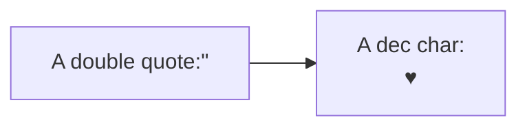

子图

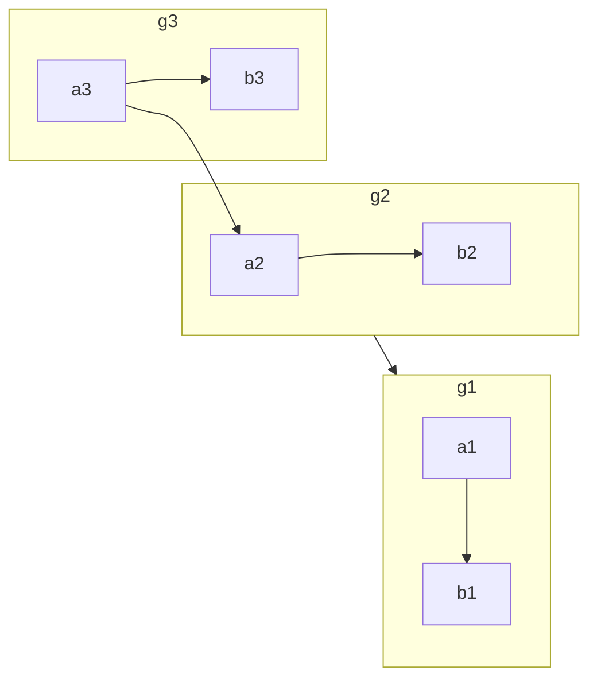

### 时序图

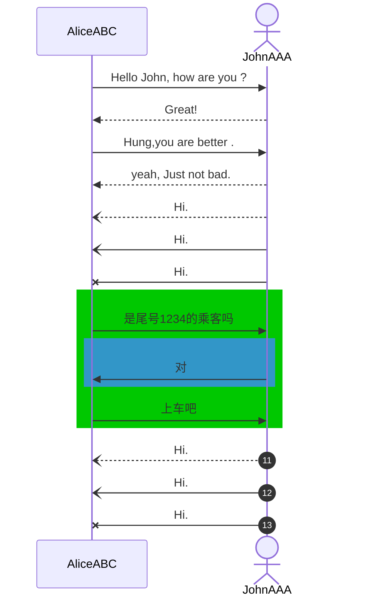

中等复杂时序图

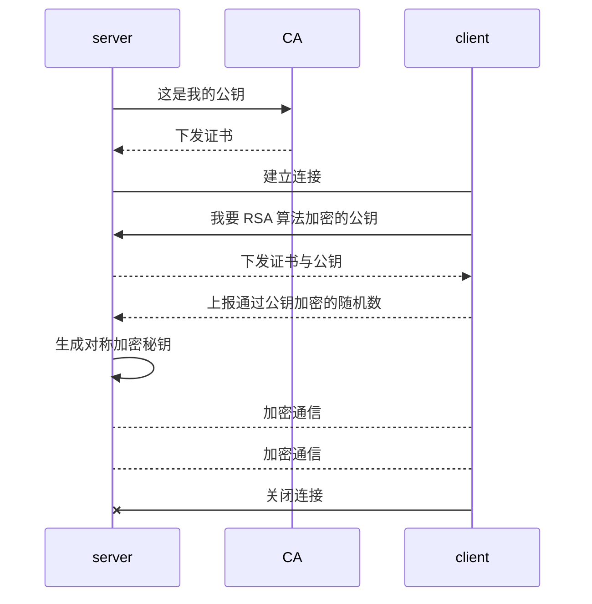

复杂时序图

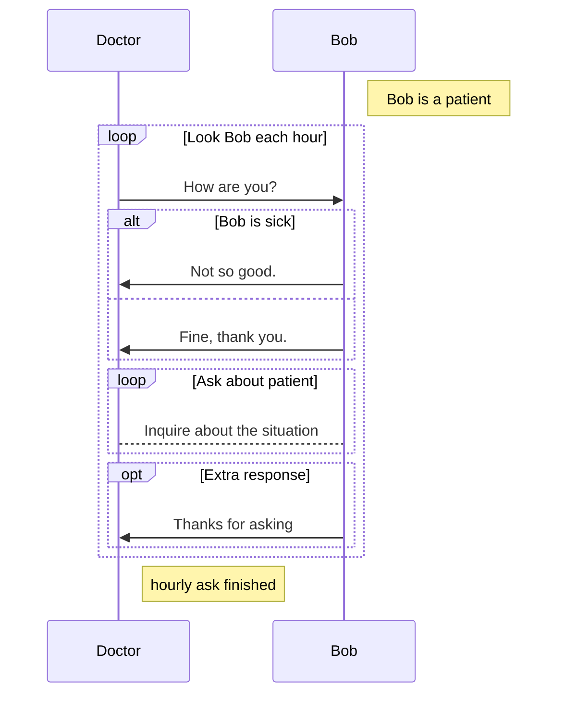

### 甘特图

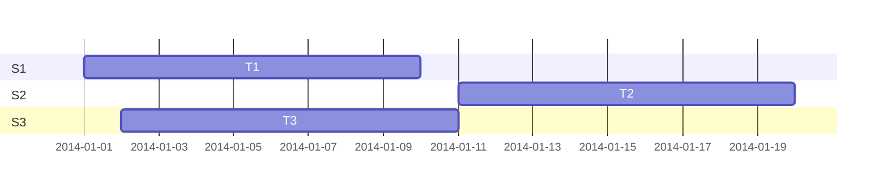

复杂甘特图

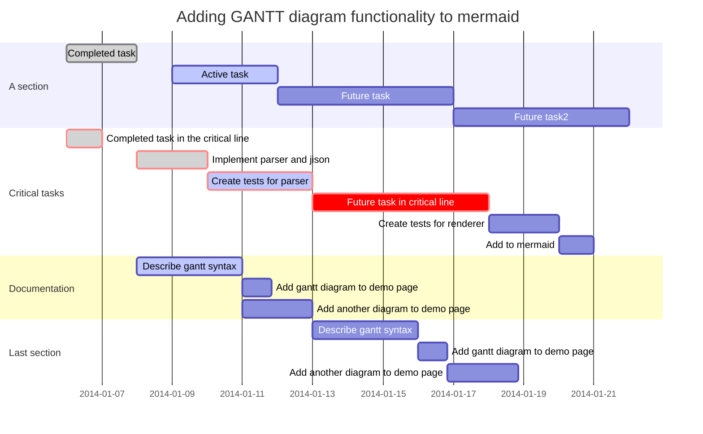

### 饼图

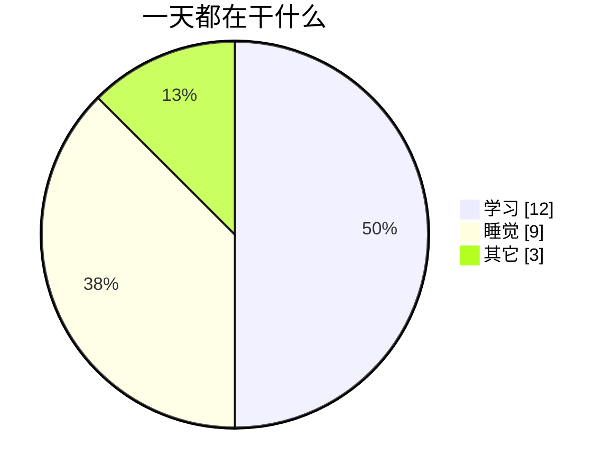

### 用户行程图

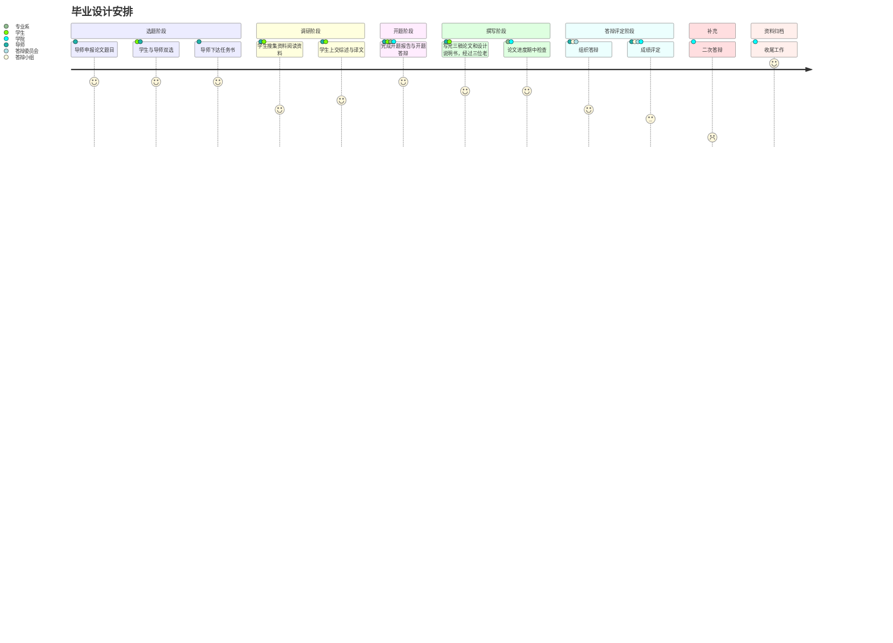

### 柱状图

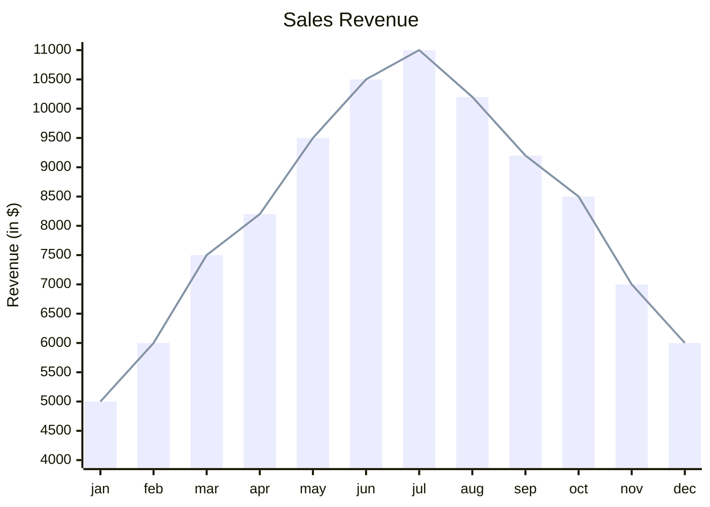

### 象限图

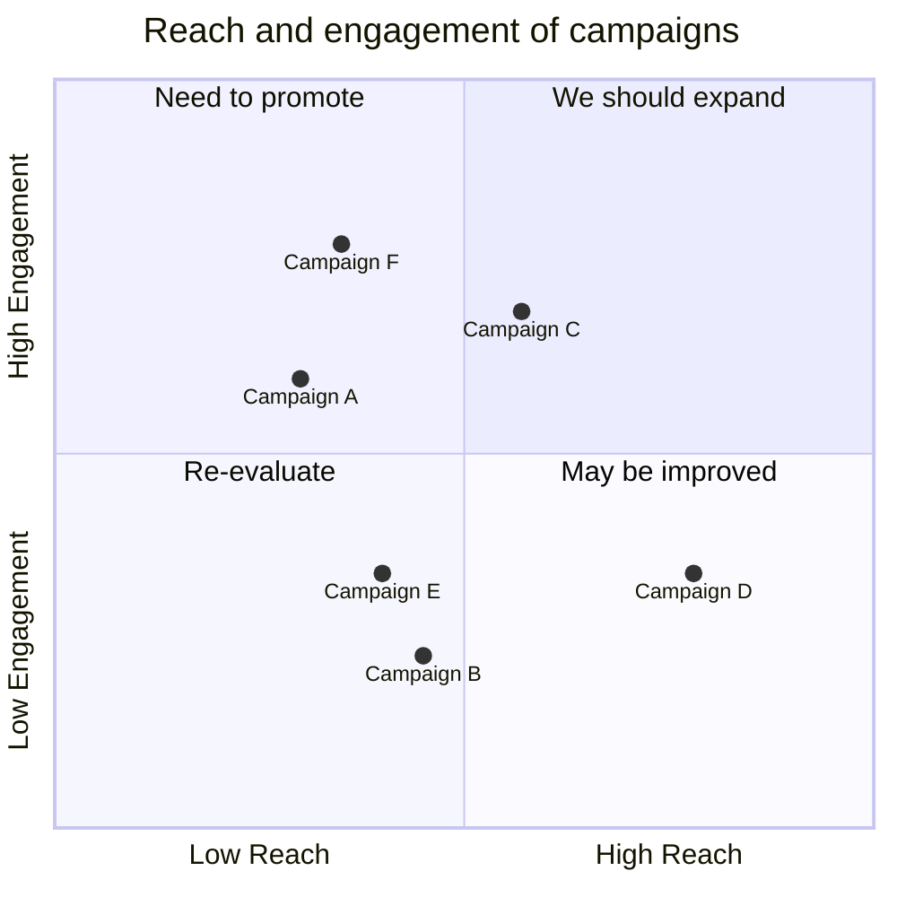

### 类视图

[保姆级教程--类图怎么画-CSDN博客](https://blog.csdn.net/q584401071/article/details/122201102)

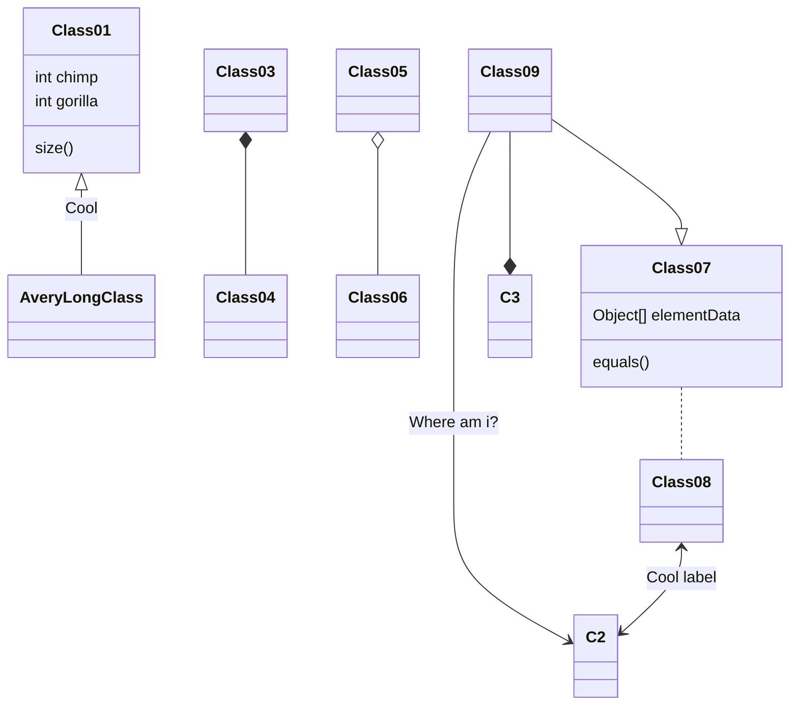

### Git分支图

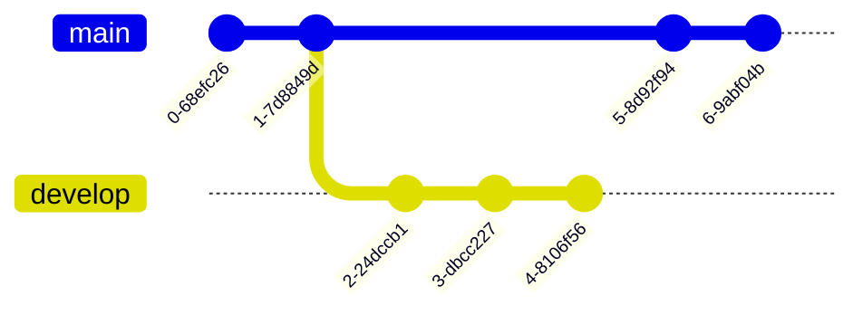

再复杂一点：

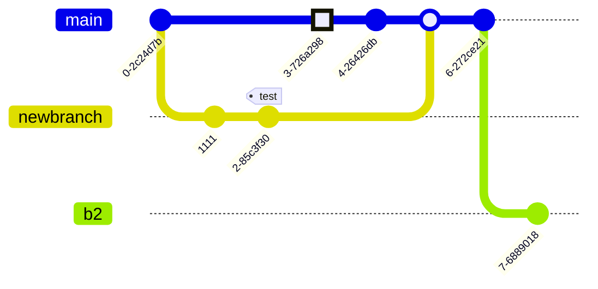

### 关系图

[实体关系图_百度百科 (baidu.com)](https://baike.baidu.com/item/实体关系图/9005309)

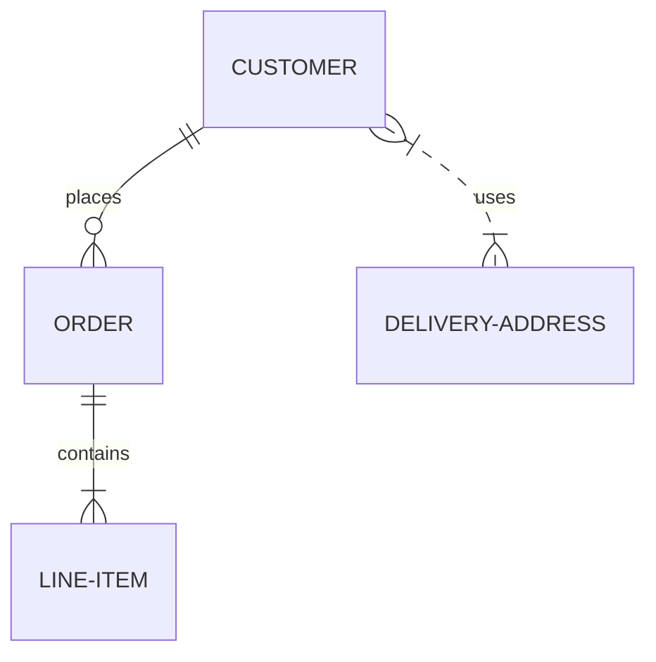


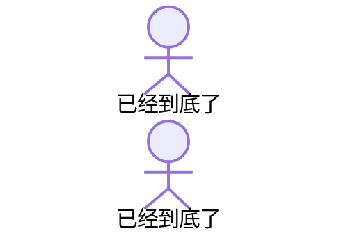

