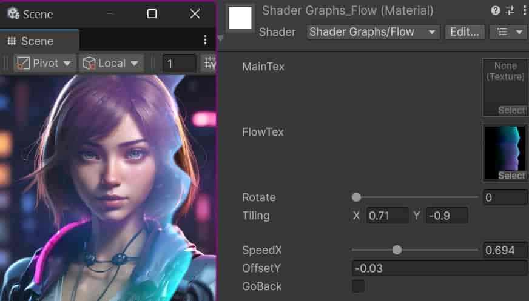
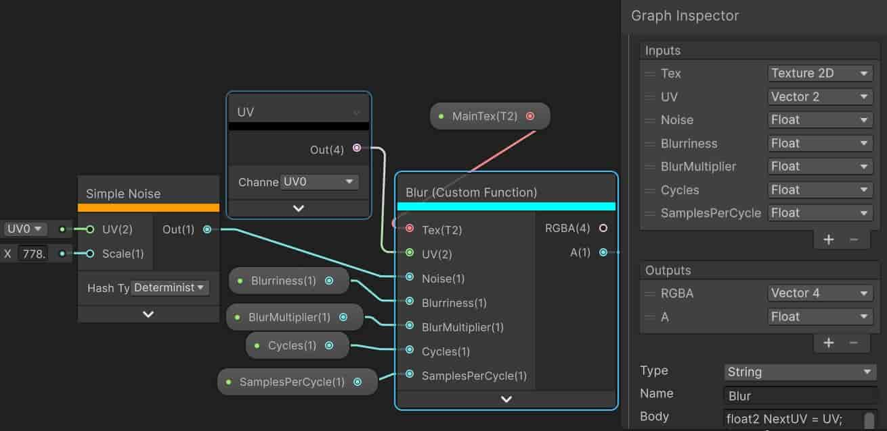

# 常用操作

- 查看所有快捷键：Edit > Shotcuts... > ShaderGraph分页

- 开关 BlackBoard 面板：Shift+1

- 开关 Inspector 面板：Shift+2

- 开关 Main Preview 浮窗：Shift+3

- 切换 Color Mode（比较喜欢 Heatmap，可以查看性能消耗，颜色越亮消耗越大）：Shift+4

- 建组：框选节点，Ctrl+G

- 取消建组：选中组，Ctrl+U

- 切换选中节点折叠（仅部分节点支持折叠）：Ctrl+P

- 切换预览折叠（若没有选中节点则切换所有节点）：Ctrl+T

- 添加 Redirect 折点（需选中边）：Ctrl+R

- 保存：Ctrl+S

- 另存为：Ctrl+Shift+S

- 建子图：框选节点，右键菜单

- 子图改路径：BlackBoard标题下方小字是可以双击改名的（对应序列化变量名：Path）

- 选中当前Graph文件：左上角箭头展开 > Show In Project


# 常用插件

## Debug调试（推荐）

[ShaderGraph Extensions Debug Value 1.0.2.unitypackage](./ShaderGraph Extensions Debug Value 1.0.2.unitypackage)

会多出一个节点可供使用：

 

## SGE 主体插件（非必需）

通过网盘分享的文件：[ShaderGraph Essentials 1.1.17.unitypackage](https://pan.baidu.com/s/13ZsiTzGnQzqW8SoVwURBiw?pwd=wx1j)

- 提供 SGE Noise节点，有些噪点样式是官方版没有的
- 提供 Bake Texture节点，可以把输入保存为图片
- 菜单栏 Assets >  Create > Shader Graph > ShaderGraphEssentials 新增三个选项（官方光照是两个：Lit 和 UnLit）：
  - SGE Unlit Shader Graph， 可做水等
  - SGE SimpleLit Shader Graph
  - SGE CustomLit Shader Graph， 可做Toon效果等


# 类似功能的第三方插件ASE

全称：Amplify Shader Editor

下载：见 [插件汇总](../../Unity/插件汇总.md#Amplify Shader Editor)

系列教程：[Cz_wang的个人空间-Cz_wang个人主页-哔哩哔哩视频](https://space.bilibili.com/15396626)

# UI效果注意事项

## 定义MainTex变量

这种做法便于让shader直接把Image的source图当作_MainTex。但会在开启ShaderGraph窗口的情况下报如下错误：

```
Two properties with the same reference name (_MainTex) produce different HLSL properties
UnityEditor.EditorApplication:Internal_CallUpdateFunctions ()
```

忽视这个报错即可。如果实在不想看到这个报错，那就把 _MainTex 暴露出来即可。

## 防编辑器运行污染材质球

在编辑器下可以使用这个组件： [MatFixInEditor.cs](../防止Unity运行时修改材质球文件.md#最终，制作组件：防编辑器运行时污染材质球)

# 彩色扫光UI（基于运算）

如图（Trangle Wave换成Sin也是可以的，为了性能和线性表现所以选了前者）：

 

使用效果（彩色光是循环流动的）：

 


# 彩色扫光UI（基于贴图）

如图：


# 流光

流光的逻辑和扫光类似，只是最后阶段变成了叠加

效果：

 

做法：

 

附流光效果原图（可下载自用）：

 


# 雪花

参考视频：[Unity Shader Graph 雪花_哔哩哔哩_bilibili](https://www.bilibili.com/video/BV1t5BRYiErU)

格子:

 

圆：

 

极坐标拆分两通道：

 

最终通过极坐标完成雪花：

 

额外扩展——漫画线：

 

# 溶解

参考视频：[VFX 分解和溶解效果教程](https://www.bilibili.com/video/BV1s4BmY5Eeh)

## UI版溶解

 

> 上图**用了两个Step**，这样做可以保证没被溶解的区域是完全不透明的。如果不需要做到这点也可以简化成**只用一个Step**：选中Fragment开启Alpha Clipping，然后把DissolveAmount连到Alpha Clip Threshold，把Step的输出连给 Alpha 即可。

效果如下：

 

如果觉得溶解的描边效果不够，可以做如下处理：

- 给Canvas分配UI相机，勾选UI相机的后处理选项。
- 把描边颜色改成HDR颜色
- 给描边乘上流动噪云效果，如图：

 

最终效果：

 


## 3D模型版溶解（Alpha Clip版 ）

参考教学：[【Shader Graph 教程】【074】VFX 分解和溶解效果教程_哔哩哔哩_bilibili](https://www.bilibili.com/video/BV1s4BmY5Eeh)

可进一步配合全身粒子效果：[蒙皮网格粒子效果](../VFX Graph粒子特效/VFX Graph做特效.md#蒙皮网格粒子效果)

效果：

 

图布局：

 

## 2&3D模型版溶解

参考教学：[unity溶解边缘发射粒子_哔哩哔哩_bilibili](https://www.bilibili.com/video/BV1DARYYHEc7)

可进一步配合边缘粒子效果（最终由vfx来控制自身及ShaderGraph材质）：[蒙皮网格粒子效果](../VFX Graph粒子特效/VFX Graph做特效.md#蒙皮网格粒子效果)

效果：

 

图布局：


## 水平定向溶解

**效果**：

 

**图布局**：

 

**变量定义说明**：

- CutEdge，类型Float，范围0到1，对应从头到脚的水平裁切
- MeshSize，类型Float，对应模型的高度，以此来作为水平裁切的范围上限
- WorldRootY，类型Float，从外界传入世界坐标Y值，以此来作为水平裁切的范围起点
- BolderColor，类型Color，开启HDR，作为溶解边缘的颜色（配合Bloom后处理使用更佳）

**注释事项**

- 应当开启双面渲染，即 Render Face 设为 Both，这样在溶解过程中不会丢失里侧细节。

**如果需要给边缘增加粒子效果，参见VFX篇**：

[水平定向溶解边缘粒子效果](../VFX Graph粒子特效/VFX Graph做特效.md#水平定向溶解边缘粒子效果)

**题外话**

参考油管EricWang视频  [Unity VFX Graph：Model Edges Bursts](https://www.youtube.com/watch?v=xxLg8Xw7S-c)


-----

# 毛玻璃UI底图

- 利用UGUI官方示例的 SceneColorBlurred 子图
- 把Canvas的Camera设置为MainCamera，Canvas的Plane Distance只比MainCamera大0.1。

> 毛玻璃效果用到的SceneColor节点使用的是 _CameraOpaqueTexture 全局纹理。目前在开启overlay相机的情况下，不支持Canvas Overlay或者Canvas的相机设为Overlay。所以为了各种情况毛玻璃效果都能生效，需要把Canvas的Camera设置为MainCamera（设为World也行但是不方便）。

ShaderGraph布局如下：

 

其中毛玻璃的坑洼效果可以在ScenecolorBlurred节点中更换Tex贴图（具体在 Packages/Universal RP/Textures/BlueNoise【数字】 中，数字越小颗粒越大）。

↓↓ *整理了一下模糊节点的算法和配置，坑洼效果可以用Noise节点代替：* ↓↓

 

↑↑ *Noise节点虽方便，但还是换成Texture更省性能* ↑↑

Body部分的代码：

```c
float2 NextUV = UV;
float StepSize = Blurriness / (int) Cycles;
float CurDistance=0;
float2 CurOffset;
float Substep;

if (Cycles<1)
{
	RGBA = SAMPLE_TEXTURE2D(Tex.tex,Tex.samplerstate,NextUV).rgba;
	A = RGBA.a;
}
else
{
	for (int i = 0; i < (int) Cycles; i++)
	{
		for (int j = 0; j < (int) SamplesPerCycle; j++)
		{
			sincos(6.283185*((Noise+Substep) / SamplesPerCycle), CurOffset.y, CurOffset.x);
			CurOffset *=BlurMultiplier;
                              NextUV = UV + (CurOffset * CurDistance+(Noise*StepSize));

							  RGBA += SAMPLE_TEXTURE2D(Tex.tex,Tex.samplerstate,NextUV).rgba;
			Substep++;
		}
		CurDistance+=StepSize;
		Substep+=0.618;

	}
	RGBA = RGBA / ((int)Cycles*(int)SamplesPerCycle);
	RGBA = saturate(RGBA);
	A = RGBA.a;
}
```

# 文字描边

文字渲染出来边缘总有一些半透区域，可利用这一点把透明区域当成描边区域

 

> 将 Border 拉满还能得到 块状描边 ，风格类似于《女神异闻录5》的文字。如果不需要这个效果就把Border范围改为0~0.85。
>
> 把第一个Step节点替换为 Smoothstep 可略微改善外轮廓锯齿。
>
> 如果把材质球TextColor调整为白色，通过Text的颜色来设置字色会导致色差（饱和度偏低），解决方法有二：
>
> 1. 设置Text颜色为白色，调整材质球TextColor颜色。此法较为影响材质球复用性。
> 2. （推荐）取消勾选Canvas的 ”Vertex Color Always In Gamma Color Space”，不过还是会干扰描边颜色，更适用于描边为深色的情况（比如纯黑描边完全不受影响），浅色描边可考虑增加亮度（描边颜色是HDR模式，增大亮度到7可以几乎抵消Text颜色的干扰）。
>
> 局限性：
>
> - 仅适合粗体
> - 以1080P游戏分辨率为参考，则字号不宜小于32。
> - 不同字号需要适度调整描边范围，不能通用一个固定值。
>
> 经过以上调整，效果还可以，而且不增加面数和Overdraw。但整体效果依然略弱于TextMeshPro（毕竟没用有向距离场）。仅当无法接受TextMeshPro庞大的中文体量时推荐使用。
