在第三章节中，我们探讨了 Shader Graph 中的透明渲染机制。本章将深入解析深度缓冲系统。下图是本节教程最终将实现的剪影效果：

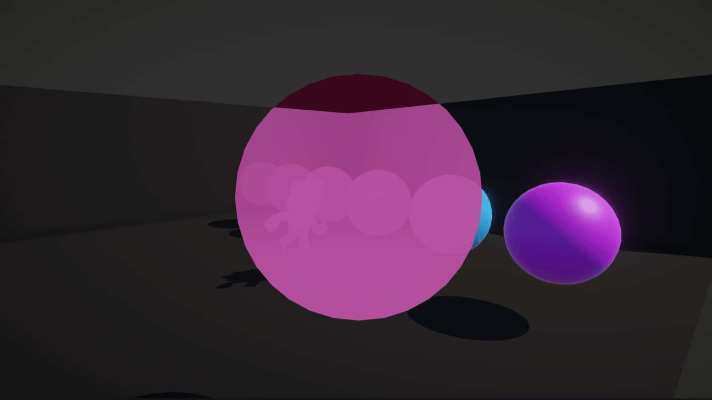

[Check out this tutorial over on YouTube too!](https://www.youtube.com/watch?v=MndZYDHB4zE)

# The Depth Buffer深度缓冲原理

第三部分曾提及，当确认物体部分被遮挡时，可跳过对应片元的渲染。但渲染管线如何判断物体的相对空间关系？如下图所示，立方体被墙体遮挡的阴影区域将不会被渲染：

 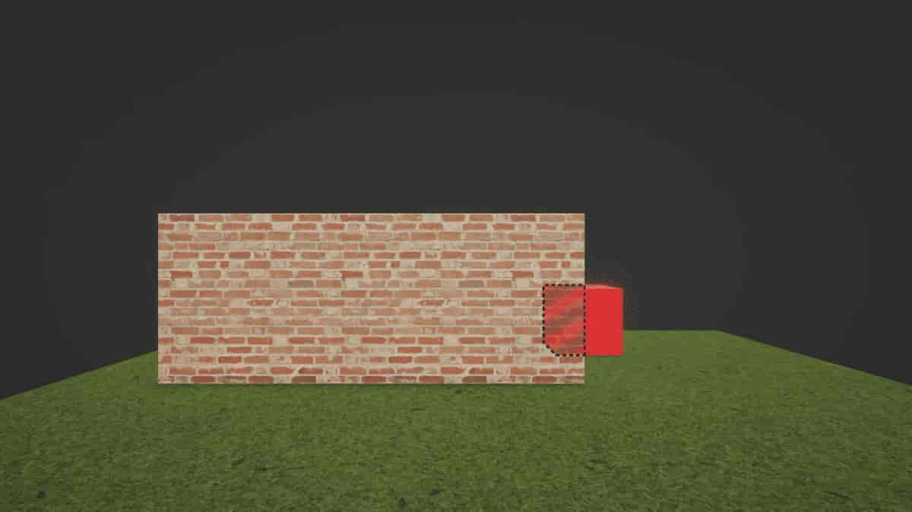

颜色数据写入帧缓冲（frame buffer）——这是一个与屏幕尺寸相同的图像缓冲区，着色器的核心任务就是填充该缓冲区的颜色值。仅凭帧缓冲数据无法判断当前像素是否应该被覆盖，因为它不包含空间位置信息。早期渲染器采用从后到前的物体排序渲染方案，但无法处理复杂网格或部分遮挡情况，因为整个网格使用同一 "深度" 值渲染，必然产生排序错误。

现代渲染器引入名为深度缓冲（depth buffer/z-buffer）的二级缓冲区。这个与帧缓冲同尺寸的图像，存储着物体像素到相机的 "距离" 值。实际上其存储机制较为复杂：深度缓冲通过 0 到 1 之间的非线性浮点值分布，更多比特位分配给近景物体以提升深度精度——这些区域最容易出现排序错误。不过无需深究 Unity 的具体存储算法，因为 Shader Graph 提供了深度值解码方案，后文将具体演示。

下图左侧为帧缓冲，右侧是对应的深度缓冲。虚线区域表示绿色球体未通过深度测试，因此未覆盖原有深度值：

 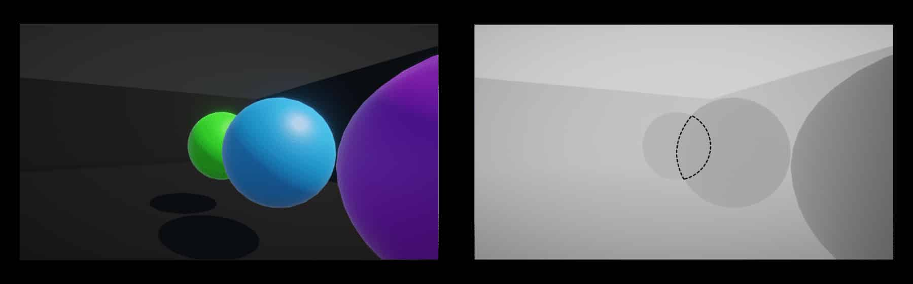

当前只需理解渲染时的核心流程：

1. 计算待渲染像素的深度值
2. 与深度缓冲中对应位置的存储值进行比较（深度测试）
3. 若新像素深度值 ≤ 现有值，则替换帧缓冲颜色
4. 对于不透明物体，同时更新深度缓冲值（透明物体通常不写入深度信息）

这些深度测试步骤在渲染过程中自动执行，无需额外编码。现在让我们更 "深入" 地探索深度系统。

------

**Unity 后处理特效套装**
[34 种全新效果：模糊、抖动、像素化、油画、合成波等！](https://assetstore.unity.com/packages/vfx/shaders/fullscreen-camera-effects/snapshot-shaders-pro-for-urp-hdrp-160556)

------

# Depth in Shader Graph 深度控制

本节演示基于第一部分 "ColorExample" 图新建的 "DepthExample" 图表（任何基础图表均可操作）。重点关注 Graph Settings 中的 Depth Write 与 Depth Test 选项：

 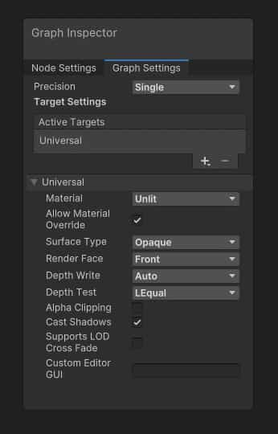

**深度写入（Depth Write）**
控制物体通过深度测试后是否更新深度缓冲。默认 Auto 模式下，不透明物体写入，透明物体不写入。除非特殊需求，通常不建议修改 ForceEnabled/ForceDisabled 选项。

**深度测试（Depth Test）**
此选项决定像素写入的比对方式。默认 LEqual（小于等于）表示：当新物体比现有像素更接近（或等距）相机时通过测试。

 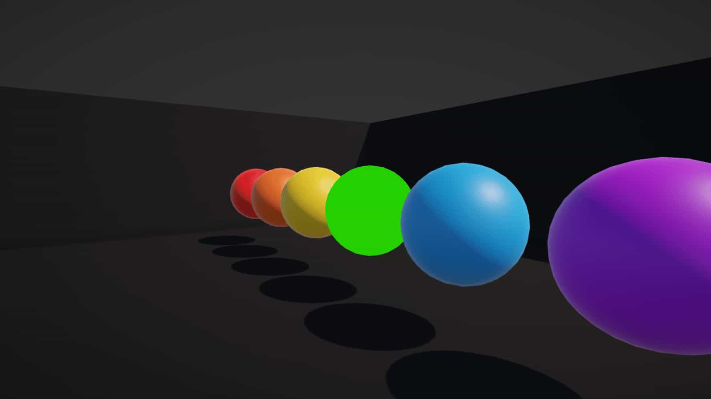

**Always**：始终通过测试（绿球置顶）

 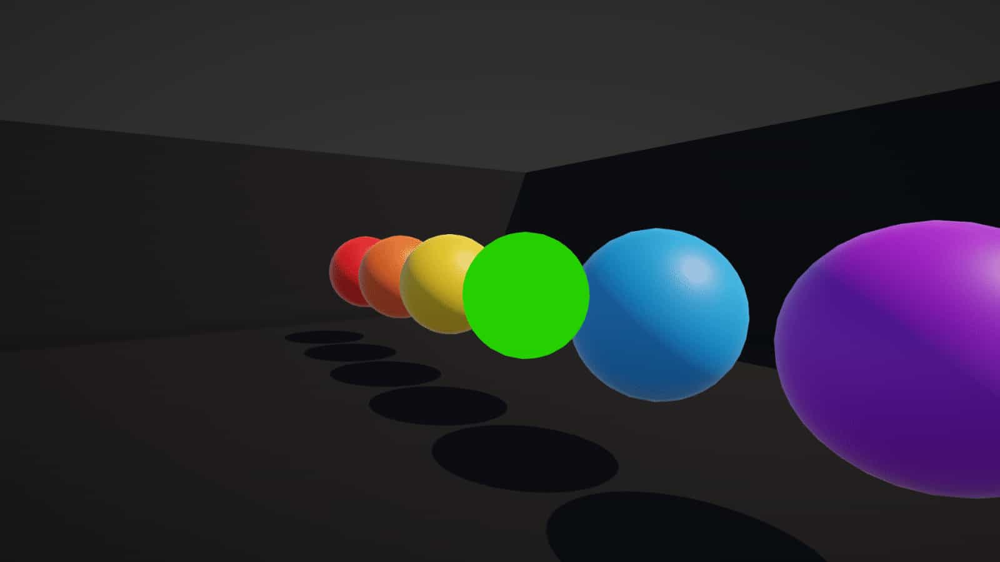

**Never**：始终拒绝（绿球隐藏）

 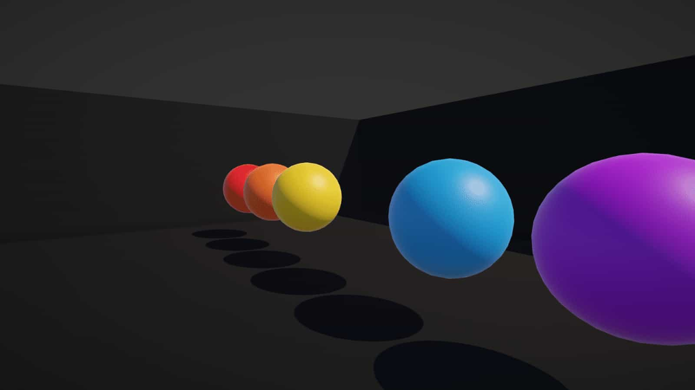

**Greater**：仅当新物体更远时通过（上图绿球只显示与蓝球相交的部分）

 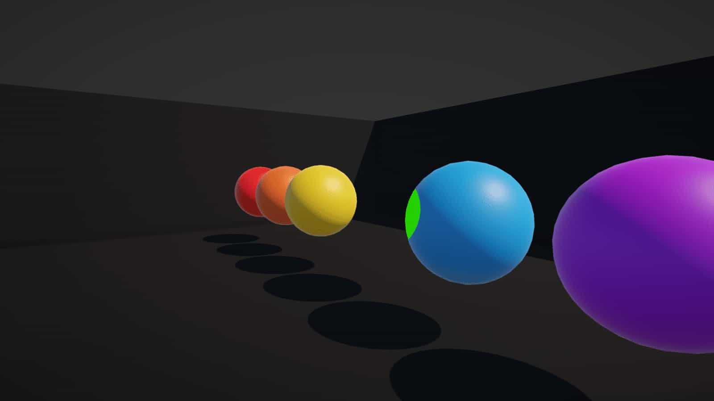

除了 *Less*（小于）、*Equal*（等于）、*NotEqual*（不等于）和 *GEqual*（大于等于）这些选项（我相信你可以理解它们的含义），我强烈建议你尝试不同的选项，看看它们各自的效果！图形设置中的 *Allow Material Override*（允许材质覆盖）勾选框在此特别有用，因为它允许你基于每个材质单独调整这些深度选项，而不仅仅是基于每个着色器。完成图表内的调整后，记得点击 *Save Asset*（保存资源）。

到目前为止，我们似乎还没有做太多“着色器相关”的工作，因此接下来让我们探索另一种处理深度的方法。

# The Depth Texture 深度图

由于我们将深度值存储在深度缓冲中，您可能会疑惑是否能在着色器中直接使用这些值。答案是肯定的，但需要注意以下限制：

**第一，着色器无法直接读取深度缓冲**：Unity会在所有不透明物体渲染完成后，将深度缓冲的当前状态复制到名为**相机深度纹理**（*camera depth texture*）的特殊纹理中，该纹理可通过着色器访问。

 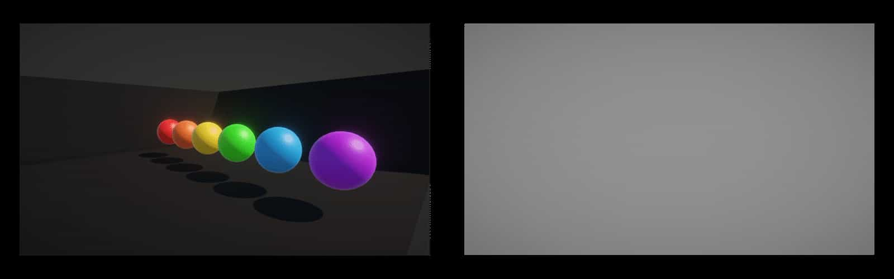

**第二，深度纹理不包含透明物体的深度信息**：透明物体（如半透明材质）的深度值不会写入深度缓冲，因此深度纹理中也不会有相关数据。这是因为透明物体通常使用**Alpha混合**（Alpha Blending）技术，其渲染发生在不透明物体之后，且默认关闭深度写入（`ZWrite Off`）以避免覆盖已绘制的像素。

 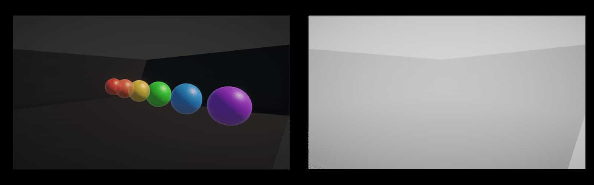

要在URP（通用渲染管线）中使用**深度纹理**，首先必须手动启用该功能。**务必牢记这一步骤**，因为在实际开发中，开发者经常会遗漏此配置（尤其是在新建项目时）。以下是具体操作流程：

1. **定位URP资源文件**：
   - 若项目是通过URP模板创建的，资源文件默认位于 `Assets/Settings` 目录下。
   - 注意：该目录下通常会存在**三个URP配置文件**（例如针对不同渲染层级的设置），需对所有文件执行以下操作。
2. **启用深度纹理**：
   - 选中每个URP配置文件 → 在**检视窗口（Inspector）**的顶部，勾选 `Depth Texture` 选项。
   - 此操作会强制URP生成 `_CameraDepthTexture`，供着色器通过该变量名访问深度数据。

 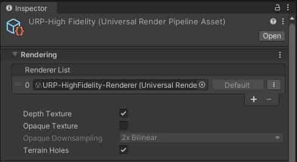

**当前配置已完成，接下来我们将从头创建轮廓着色器（Silhouette Shader）：**

1. 创建着色器文件：
   - 通过菜单栏 *创建 -> Shader Graph -> URP -> Unlit Shader Graph* 新建着色器，命名为 `SilhouetteExample`。
2. 配置表面类型：
   - 打开着色器后，在 *Graph Settings* 面板中将 **Surface Type** 修改为 **Transparent**（透明）。
3. 添加颜色属性：
   - 创建两个 `Color` 类型属性，分别命名为 `Foreground Color`（前景色）和 `Background Color`（背景色）。
   - **注意**：建议为两者设置明显不同的默认值（例如前景色红色、背景色蓝色），以便调试时快速区分效果。

 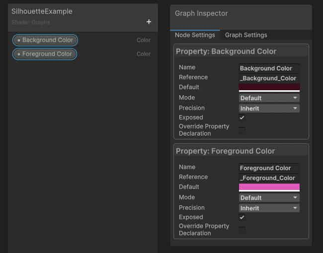

接下来，添加名为 `Scene Depth` 的节点。**默认情况下**，该节点会**使用当前渲染像素的屏幕坐标**对深度纹理进行采样，因此无需手动输入任何参数。此节点包含一个下拉菜单，提供以下三个选项：

- **Raw（原始值）**：直接获取深度缓冲中的原始数值。此值为**非线性分布**（范围在0到1之间），与我之前提到的“奇怪”特性一致（深度缓冲在透视投影下会以非线性方式编码深度，导致数值分布不均）。

 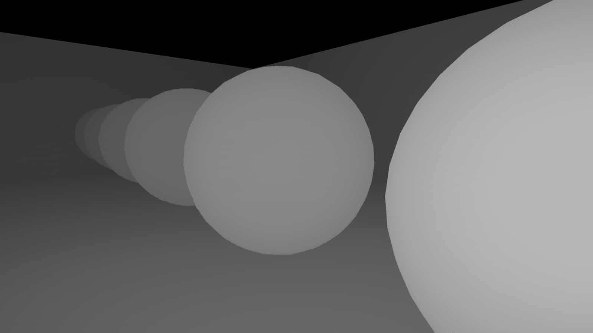

- **Linear01（线性化）**：此选项将深度值**线性化处理**，范围仍为0到1。线性化意味着物体深度值与其实际距离成比例（例如两倍距离对应两倍深度值），与 `Raw` 模式的非线性分布不同。**需注意**：此模式下数值方向与直觉相反（例如近处物体可能显示为高值），这是由深度缓冲存储逻辑决定的。

 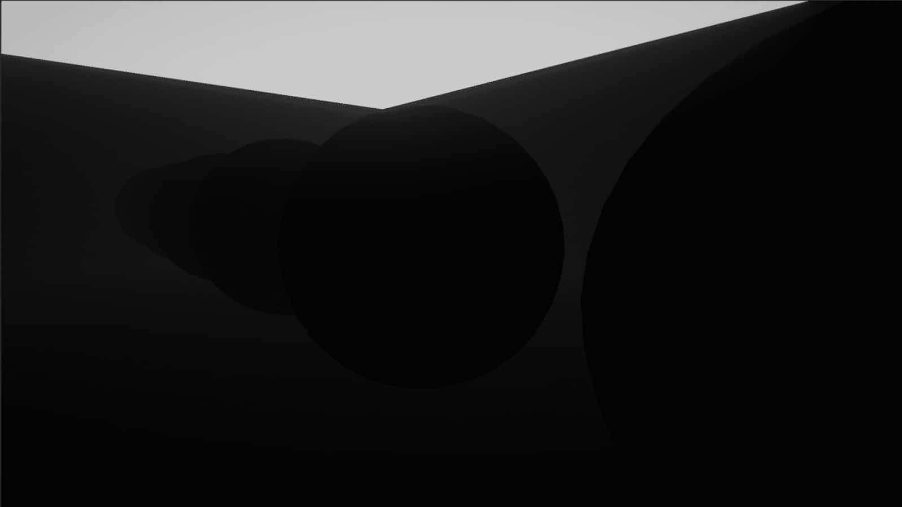

**Eye（相机空间）**：此选项将深度值转换为**以米为单位的世界空间实际距离**（即从摄像机到物体的物理长度），适用于需要真实空间测量的特效（如遮挡剔除、物理交互计算）。

 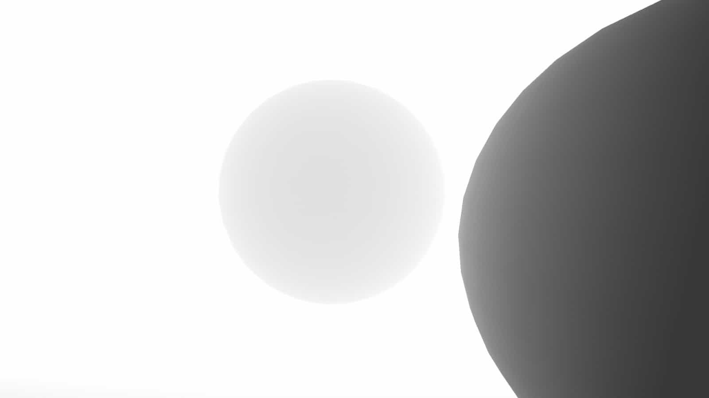

`Linear01` 模式是实现轮廓效果的理想选择。

接着在图中添加 `Lerp` 节点（全称 Linear Interpolation，即线性插值）。该节点通过 *T* 参数（范围0-1）混合输入值 *A* 和 *B*。例如 *T=0.25* 时，输出为75%的 *A* 和25%的 *B*。

 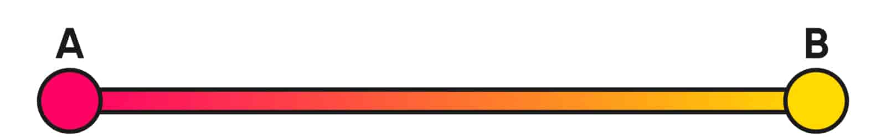

如下所示，您可以将 `Scene Depth` 的输出连接至 `Lerp` 节点的 *T* 插槽，将 `Foreground` 颜色和 `Background` 颜色分别接入 *A* 和 *B* 插槽。最后将 `Lerp` 的输出结果连接到着色器的 *Base Color*（基础颜色）输出块，保存资源后即可在场景视图中观察轮廓混合效果。

 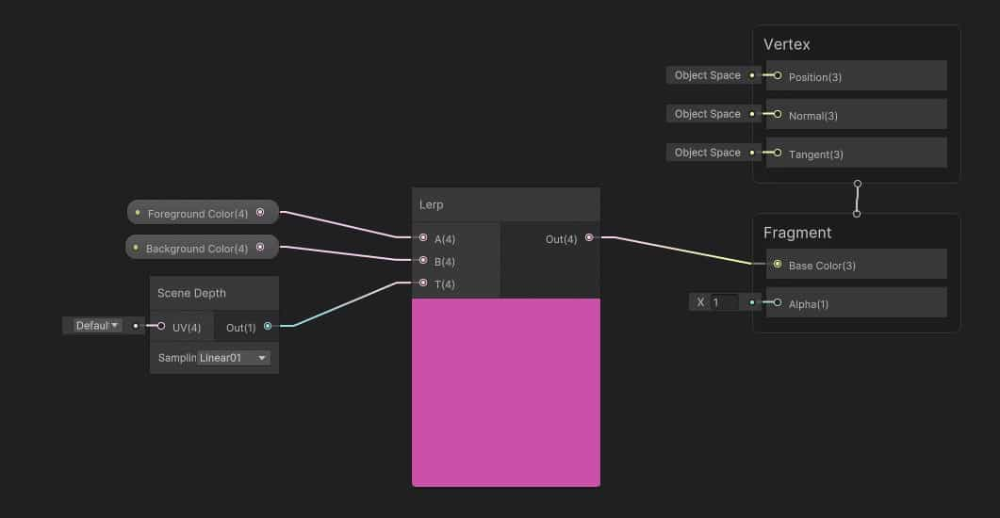

我将创建一个使用 **轮廓材质（Silhouette Material）** 的球体，将其放置于若干物体前方，并观察其在 **Game View（游戏视图）** 中的显示效果。

 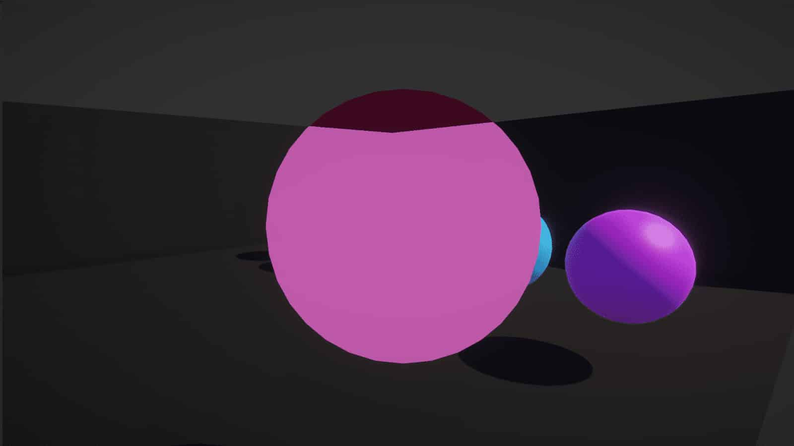

在此场景中，我无法清晰分辨部分物体，这是由于相机远剪裁平面（Far Clip Plane）默认值为 **1000**，导致深度缓冲的0-1范围被拉伸覆盖了 **1000个世界空间单位**（即实际距离范围过大，细节精度降低）。

 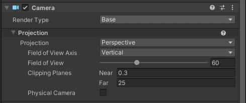

若将此值（远剪裁平面）大幅降低至20左右，我们应能更清晰地观察到深度差异（深度缓冲精度提升，近距离物体的深度梯度变化更为明显）。

 

# 结语

我们已了解深度缓冲（Depth Buffer）如何实现物体按正确顺序渲染7，并通过相机深度纹理（Camera Depth Texture）实现了轮廓效果。**下期预告**：探索如何利用顶点着色器（Vertex Shader）动态控制屏幕上物体的位置。感谢阅读！

- [YouTube](https://www.youtube.com/dilett07)
- [GitHub](https://github.com/daniel-ilett)
- [Twitter](https://twitter.com/daniel_ilett)
- [itch.io](https://danielilett.itch.io/)
- [Patreon](https://www.patreon.com/danielilett)

Daniel Ilett  • 2024

