# 如何使用 Unity Shader Graph 中的每个节点

**Posted on May 20, 2021**

- [YouTube视频： How To Use All 200+ Nodes in Unity Shader Graph](https://www.youtube.com/watch?v=84A1FcQt9v4)
- [文章：How To Use Every Node in Unity Shader Graph](https://danielilett.com/2021-05-20-every-shader-graph-node/)
- [ShaderGraph文件网页端显示：Shader Graph Viewer](https://shadergraph.stelabouras.com/)

Shader Graph 附带了很多节点。超过 200 个，截至 Shader Graph 10.2！有了如此广泛的功能供您使用，当您在寻找制作您心目中的着色器的完美方法时，很容易迷失方向。本教程向您展示了每个节点的运行情况，包括示例、每个输入和输出的解释，甚至是某些节点的最佳实践！

------

# 什么是 Shader Graph?

Shader Graph（着色器图表）是一种基于节点（node）的视觉化着色器创作工具，其核心目标是为非编程人员（如美术师）提供直观的材质构建方式。传统着色器（shader）完全依赖代码编写，这些运行于 GPU 上的小程序负责实现纹理映射、光照计算、颜色渲染等核心图形功能。Shader Graph 通过**节点图（graph）**革新了这一流程——用户可拖拽功能节点（如数学运算、纹理采样、光照模型）并连接其输入/输出端口，实时预览材质效果。这种交互方式大幅降低了技术门槛，因此常被开发者称为“代码的趣味表亲”。

我不会介绍 **高清渲染管线** 包中包含的节点 - 我只介绍基本 Shader Graph 包中包含的节点。在我们深入研究着色器之前，我还将介绍一些先决条件知识！

------

# Spaces 空间（理论知识）

在讨论节点之前，我们最好先简要讨论一下空间。许多节点希望它们的输入或输出位于特定空间中，这是一种表示位置或方向向量的方式。以下是 Shader Graph 中常见的空间。

## Object Space 对象空间

在 **对象空间** 中，模型的所有顶点的位置都相对于对象的中心点或枢轴点。


## World Space 世界空间

在**世界空间（world space）**中，场景可包含多个物体（object），此时所有模型的顶点（vertex）位置均相对于统一的世界坐标系原点（world origin point）确定。在Unity编辑器中，调整任意物体**Transform组件（变换组件）**的位置参数时，实质上是在修改该物体在世界空间中的坐标基准。

## Absolute World Space vs World Space 绝对世界空间vs世界空间

渲染管线在此存在概念分化：

- **绝对世界空间**在URP与HDRP中均指固定全局坐标系（传统定义）
- URP的**世界空间**与此定义完全一致
- HDRP引入**相机相对渲染**（camera-relative rendering）技术：
  - 世界空间坐标基于相机位置偏移（仅位置，不含旋转）
  - **absolute world space**仍保持全局基准

此设计使HDRP更适合大规模开放世界，而URP侧重通用场景优化。


## Tangent Space 切线空间

在**切线空间**（tangent space）中，物体的位置与方向是相对于单个顶点及其法线（normal）确定的。

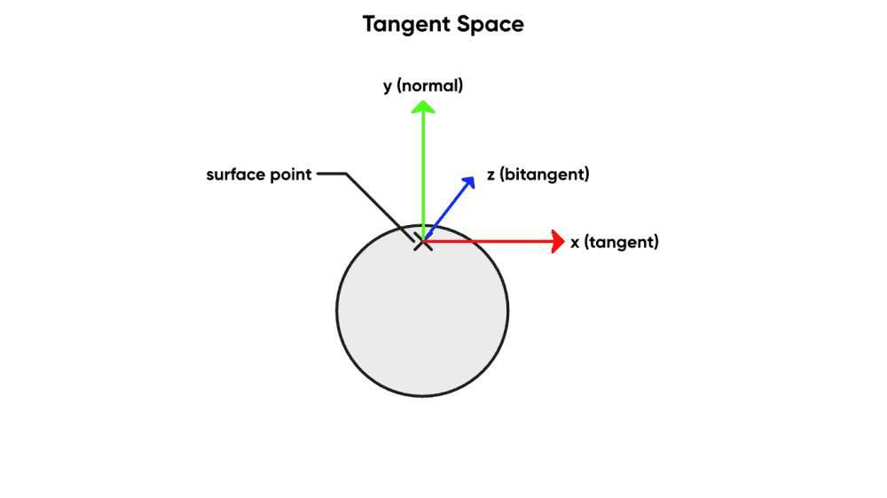

## View/Eye Space 视图空间

在**视图空间（view/eye space）**中，物体的空间关系是相对于相机及其朝向方向确定的。这与**相机相对渲染**技术存在本质差异——视图空间计算会包含相机的旋转参数

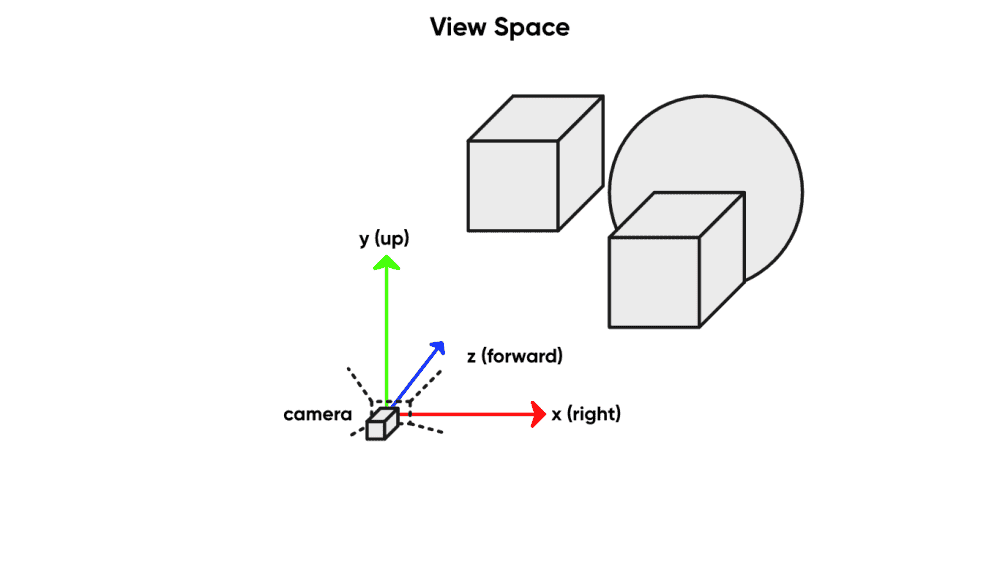

## Clip space 裁剪空间

在**裁剪空间**（clip space）中，物体的空间坐标已投影到屏幕坐标系范围内。该空间形成于视图空间经过投影变换之后，其范围由相机视场角（field-of-view）和近远裁剪平面（clipping planes）共同决定。通常，超出裁剪空间边界的物体会被裁剪（clipped，或称为剔除culled，本质是移出渲染流程），这正是其名称的由来。

------

# Block Nodes 块节点

所有着色器图均以**块节点（block nodes）**作为终端，这些节点位于**主堆栈区（Master Stack）**内。它们是着色器的输出端口，必须将其他节点的输出连线接入这些特殊块，才能驱动着色器执行具体功能。若您使用的Shader Graph版本低于9.0，则需要使用主节点（Master Nodes）——其功能本质相同，但模块化程度较低，因此本节内容仍大部分适用。部分节点仅适用于着色器的**顶点阶段（vertex stage）或片段阶段（fragment stage）**，相关内容中将明确标注适用范围。接下来我们将从**顶点阶段块（vertex stage blocks）**开始解析。

## Vertex Stage Blocks 顶点阶段块系列

顶点阶段

在**顶点阶段（vertex stage）**，着色器将网格中的每个顶点进行处理，将其移动至屏幕上的正确位置。开发者可通过调整顶点数据改变其空间分布或影响光照交互方式。以下各功能块均要求输入数据处于**对象空间（object space）**坐标系中。

### Position (Block) 位置坐标块

#### 核心功能

- **定义网格顶点在世界空间中的位置**
- 输入/输出为 `Vector3`，对应顶点的 **X/Y/Z 坐标**
- **仅作用于顶点着色器阶段**（无法直接修改像素/片段位置）

#### 默认行为

- 若未修改，顶点位置与建模软件（如 Blender/Maya）中的原始数据一致
- 受 **Model Matrix**（模型矩阵）影响，最终位置 = `Local Position × Model Matrix`

#### 可编程修改

- 通过数学运算（如 **Sin/Noise/Time**）动态调整顶点位置
- **典型应用**：
  - **动态变形**（如海浪、风吹草地）
  - **程序化动画**（如膨胀、扭曲、低多边形特效）
  - **顶点偏移（Vertex Offset）** 实现交互式形变

#### 重要限制

- **仅能修改顶点，不能直接移动片段（Fragment）**
  - 片段位置由 **光栅化阶段插值决定**
  - 若需影响像素位置，需通过 **顶点插值** 或 **曲面细分（Tessellation）** 间接实现

#### 性能优化建议

- **避免每帧全网格顶点更新**（可结合 **LOD** 或 **GPU Instancing** 优化）
- **复杂变形建议使用 Compute Shader**（如大规模流体模拟）

（注：在 **URP/HDRP** 中，`Position` 节点可能受 **相机相对渲染（Camera-Relative Rendering）** 影响，需注意世界空间坐标的转换。）

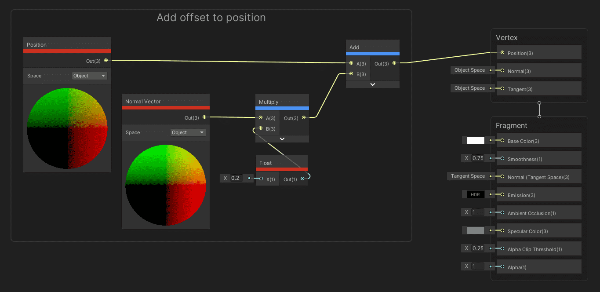
*Add an offset to the Position along the vertex normals to inflate a model.*
*沿顶点法线向“位置”添加偏移量以充气模型。*

### Normal (Block) 法线块

`Normal`（法线）块定义了顶点法线的方向。该方向对光照计算（如漫反射、镜面反射）至关重要，修改它会直接影响光线与物体的交互效果。与 `Position`（位置）块不同，法线方向可在片段着色阶段通过其他块节点进行逐像素调整（例如实现法线贴图效果）。此块数据以三维向量（Vector 3）格式存储，与物体表面几何朝向直接关联。

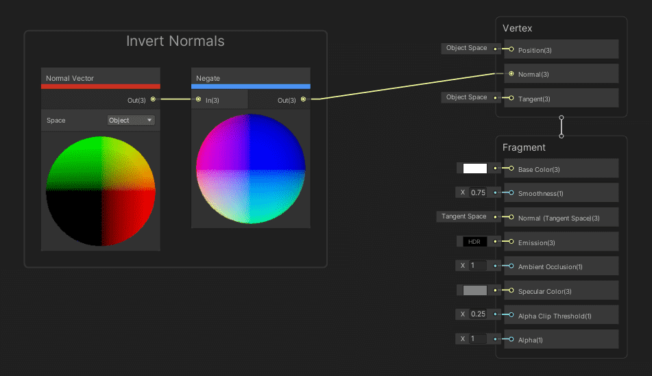
*This graph will invert lighting on your object.  此图将反转对象上的照明*

###  Tangent (Block) 切线块

`Tangent`（切线）向量始终与顶点法线（vertex normal）保持垂直。在平坦表面上，切线通常位于物体表面平面内。若修改了顶点法线方向，建议同步调整 `Tangent` 块中的切线向量以维持正交关系。此数据块同样以三维向量（Vector 3）形式表示。

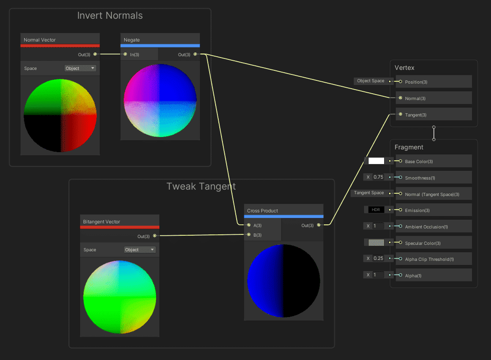
*If modifying the normals, it’s a good idea to modify the tangent too.*
*如果修改法线，最好也修改切线*

## Fragment Stage Blocks 片元阶段块系列

顶点着色阶段（vertex stage）完成顶点位置计算后，屏幕将进行**光栅化处理（rasterized）**，将几何图形转换为**片段（fragment）阵列**。通常情况下，每个片段对应一个像素（pixel），但在特定渲染技术（如抗锯齿或多重采样）中，片段可能具有亚像素级别尺寸（sub-pixel sized）。为简化描述，本文后续将默认片段与像素可互换。**片段着色阶段模块（fragment stage blocks）**将逐像素执行计算（如光照、纹理采样）。

### Base Color (Block) 基本颜色

这在某些版本的 Shader Graph 中叫做 Albeo。如果将所有照明、透明度和其他效果都排除在外，则 Base Color 将是对象的颜色。

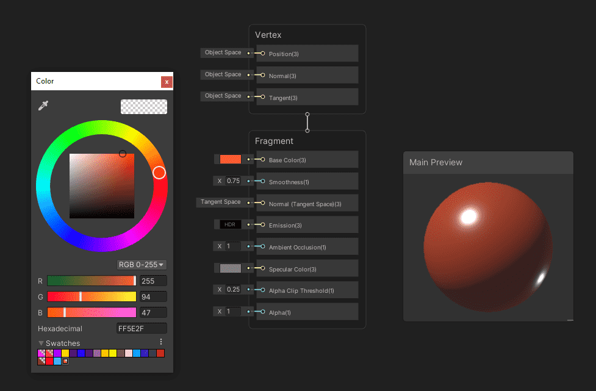
*Shader Graph uses the same Color window as other parts of Unity.* 
*Shader Graph 使用与 Unity 其他部分相同的颜色窗口。*

### Normal (Tangent/Object/World) (Block) 法线（三个空间）块

`Normal`（法线）块在顶点着色阶段定义了基础法线方向，我们可对此法线进行逐像素级调整（例如添加细节扰动），最终将修改后的法线向量传递给 Unity 内置光照计算系统。需注意存在三个同名 `Normal` 块，其区别在于法线数据所属空间坐标系：

- **切线空间（Tangent Space）**：适用于法线贴图等局部细节调整
- **对象空间（Object Space）**：基于模型自身坐标系的法线
- **世界空间（World Space）**：与场景全局坐标系对齐的法线

在 **Graph Settings**（图形设置）中，通过 **Fragment Normal Space**（片段法线空间）选项选择当前激活的 `Normal` 块（每次仅能启用一个）。坐标系的选择直接影响光照计算的准确性，需根据渲染需求匹配（例如使用法线贴图时应选择切线空间）。

###  Emission (Block) 自发光快

自发光非常适合在物体周围产生光晕。想想霓虹灯、炽热的火焰或魔法咒语。该色块接受 **HDR** 颜色，这使我们能够将光的强度提高到远远超过颜色通常允许的强度。

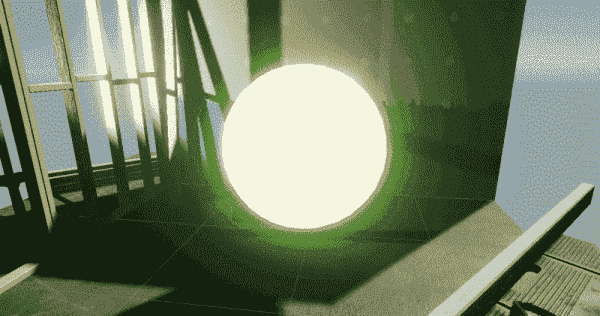
*Setting a high-intensity green emission gives objects an alien glow.*
*设置高强度的绿色发射会给物体带来外星光芒。*

### Metallic (Block) 金属度块

`Metallic`（金属度）块接收一个浮点数值（float）。当该值为 **0** 时，物体光照表现为完全非金属材质（如塑料、陶瓷）；当值为 **1** 时，则呈现全金属特性（如钢铁、黄金）。此功能仅在启用 **Metallic** 工作流程时生效——需在 **Graph Settings**（图形设置）的 **Workflow**（工作流）选项中切换 **Metallic** 或 **Specular**（高光）模式（注意：仅当材质为 **Lit** 类型时此选项可见）。

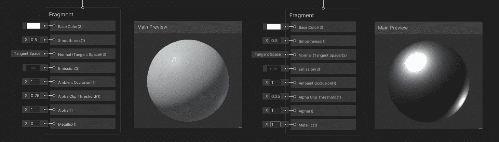
*The same material, with Metallic set to 0 and 1 respectively.*
*相同的材质，金属色分别设置为 0 和 1。*

### Specular (Block) 高光块

与 `Metallic`（金属度）块不同，`Specular`（高光）块需要输入颜色值，因为高光区域可被着色为不同颜色。输入颜色越亮（越接近白色），生成的高光区域范围越大。

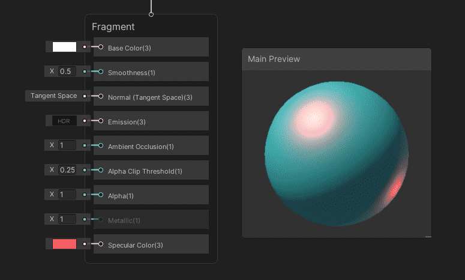
*Colored specular highlights can make the rest of the material look kind of strange!*
*彩色镜面高光可以使材料的其余部分看起来有点奇怪！*

### Smoothness (Block) 平滑块

对象越平滑，可见的照明高光就越多。当为 0 时，表面照明表现粗糙且哑光。当它为 1 时，表面就像被抛光成镜面光泽一样。

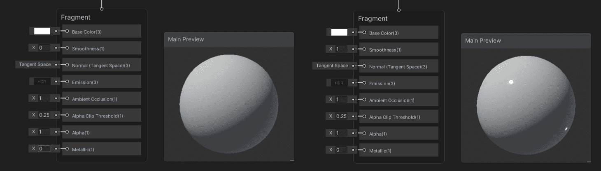
*Setting smoothness to 1 results in sharper highlights.*
*将平滑度设置为 1 可产生更清晰的高光。*

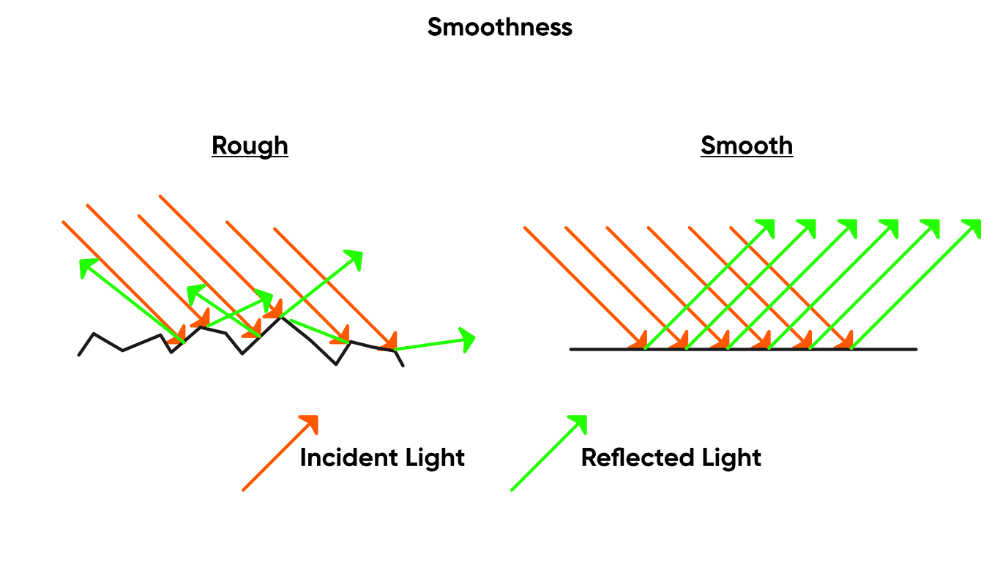
*Here’s how smoothness works under the hood.*
*平滑度工作原理。*

### Ambient Occlusion (Block) 环境光遮蔽

`Ambient Occlusion` is a measure of how obscured a pixel is from light sources by other objects in the scene, such as walls. This is a float - when it is 0, the pixel should be fully lit according to whatever lighting falls on it. When it is 1, the lighting is artificially reduced to the minimum amount.

`Ambient Occlusion`(环境光遮蔽)用于衡量像素被场景中其他对象（如墙壁）遮挡的光源程度。这是一个浮点数 - 当它为 0 时，像素应根据落在它上面的任何光线完全照亮。当它为 1 时，照明被人为地减少到最小量。

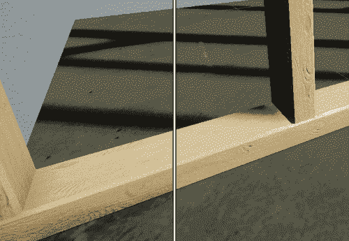
*Ambient Occlusion can be used to add slight shadows around object boundaries (see left).*
*环境光遮蔽可用于在对象边界周围添加轻微的阴影（见左图)。*

### Alpha (Block) 透明度块

`Alpha`（阿尔法值）用于衡量像素的透明度，与大多数参数模块类似，其取值范围为0到1。0表示完全透明，1表示完全不透明。渲染透明物体的计算开销远高于不透明物体，因此必须在Unity的**图形设置（Graph Settings）**中选择**透明表面（Transparent Surface）**选项，才能确保着色器被正确解析。

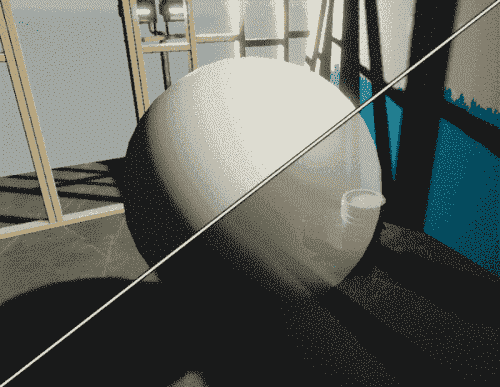
*Turning down alpha makes the object more transparent.*
*调低 alpha 会使对象更加透明。*

### Alpha Clip Threshold (Block)  透明度裁剪块

**Alpha裁剪（Alpha Clipping）**是一种通过特定阈值剔除低透明度像素的技术。通过在**图形设置（Graph Settings）**中勾选**Alpha裁剪（Alpha Clip）**选项，即可启用`Alpha裁剪阈值（Alpha Clip Threshold）`功能模块。该功能无论**表面（Surface）**类型设置为**透明（Transparent）**还是**不透明（Opaque）**均可生效，因此`Alpha`模块在不透明材质中并非完全失效。此技术常用于实现伪透明效果——使用不透明渲染时，通过特定模式剔除像素以模拟透明视觉效果。

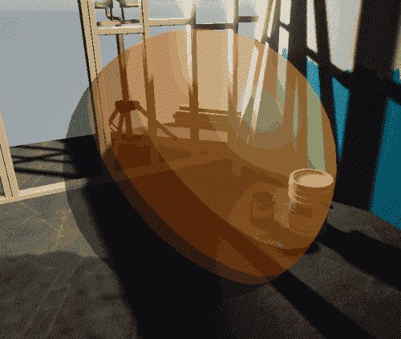
*Look closely - every pixel on the sphere is opaque, but the whole thing seems transparent.*
*仔细观察 - 球体上的每个像素都是不透明的，但整个东西似乎是透明的。*

------

# Properties & The Blackboard 属性深色面板

**属性（Properties）** 充当着色器与 Unity 编辑器之间的交互接口。

- **添加属性**
   - 点击 Blackboard 上的 **+** 按钮，选择需要的属性类型（如 `Color`、`Float`、`Texture` 等）
- **调用属性**
   - 在节点图中：
     - 通过 **Create Node** 菜单搜索属性名称
     - 直接从 **Blackboard** 拖拽属性到主编辑区域

> ⚠️ **注意**：修改 Blackboard 中的属性默认值会同步更新 Inspector 中的数值，反之亦然。

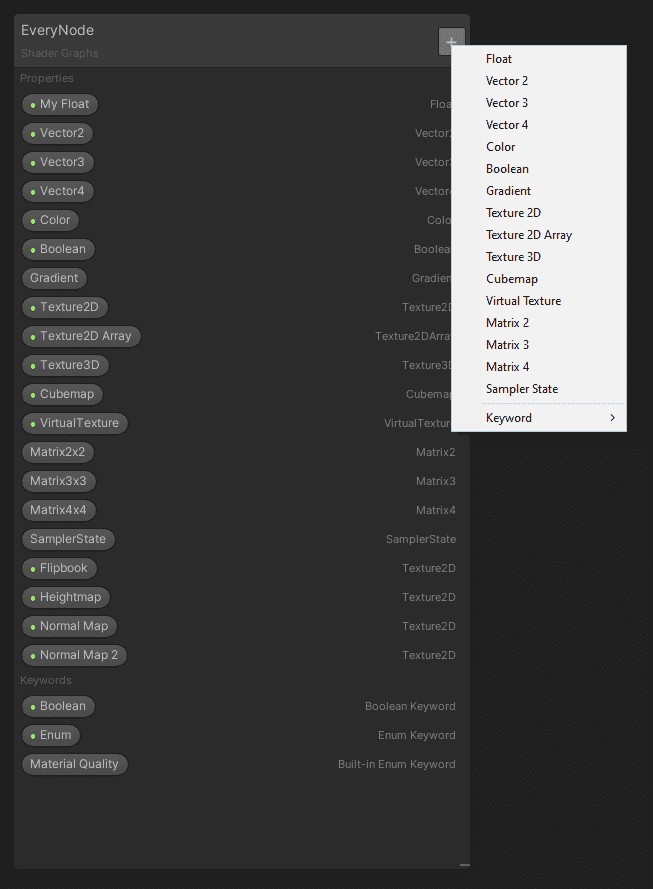
*Press the plus arrow to add new properties.*
*按加号箭头添加新属性。*

## Property Types 属性类型

###  Float/Vector 1 (Property)单浮点数

**`Float`（浮点数）**
（在早期版本的 Shader Graph 中也称为 `Vector 1`）表示一个单精度浮点数值。与其他变量类型类似，我们可以配置以下关键属性

1. **Name**（显示名称）
   - 在节点图中显示的易读名称（如 "Wind Speed"）
2. **Reference**（引用标识符）
   - 用于在 **C# 脚本** 中访问该变量的内部名称
   - **命名规范**：
     - 以 **下划线开头**（如 `_MainTex`）
     - 采用**大驼峰式**（无空格，单词首字母大写）
     - 示例：属性显示名为 "Main Texture" → 引用名为 `_MainTex`

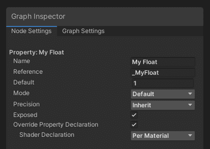
*This is the Node Settings window. There’s lots to tweak here!*
*这是“节点设置”窗口。这里有很多需要调整的地方！*

####  Float 变量的高级配置选项

除了基础的数值设定，`Float` 类型属性还支持多种 **Mode（模式）**，用于控制其在 Unity Inspector 中的交互方式：

**1.Default（默认模式）**

- **功能**：直接输入任意浮点数值（无限制）
- **适用场景**：需要完全自由调整的数值（如强度、系数等）

**2.Slider（滑块模式）**

- **功能**：通过 **Min** 和 **Max** 字段设定取值范围，在 Inspector 中显示为可拖拽的滑动条
- **示例**：
  - `Min = 0`, `Max = 1` → 将数值限制在 `[0, 1]` 范围内
- **适用场景**：规范化参数（如透明度、混合权重等）

**3.Integer（整数模式）**

- **功能**：强制输入值为**整数**（自动截断小数部分）
- **注意**：此模式仅限制输入显示，底层仍为浮点存储（无性能优化）
- **适用场景**：需要离散值的参数（如循环次数、枚举索引等）

**4. Enum（枚举模式）**

- **当前问题**：Unity 官方文档未明确说明其用法，实际测试中功能不稳定
- **推测用途**：可能用于将浮点数映射到预设的枚举选项（需脚本配合验证）
- **临时解决方案**：建议优先使用 `Integer` 模式替代

#### Float 属性的精度与可见性配置

**1. Precision（精度控制）**

- **可选模式**：
  - **Single（单精度，32-bit）**：高精度，适用于需要精细计算的参数（如坐标变换）
  - **Half（半精度，16-bit）**：低精度，性能更优，但可能损失细节（适合移动端或简单颜色值）
  - **Inherit（继承全局设置）**：默认选项，遵循 Shader Graph 的全局精度设定

**2. Exposed（暴露到 Inspector）**

- **勾选复选框**：在 Unity Inspector 中显示该属性，供非技术美术人员调整
- **取消勾选**：仅限 Shader Graph 内部使用（隐藏于 Inspector）

**3. Override Property Declaration（属性声明作用域）**

- **启用时**：属性定义为 **全局变量**（可在多个材质间共享）
-  **禁用时**：属性绑定到 **单个材质**（默认行为）

**为什么这些设置很重要？**

- **精度选择**直接影响着色器的性能与表现（尤其是移动设备）
- **Exposed** 选项决定了工作流中参数的可见性层级
- **作用域控制** 对材质实例化或跨材质复用参数至关重要

### Vector 2 (Property) 二维向量浮点数

`Vector 2` 就像两个用螺栓固定在一起的 Float - 它们有一个 X 和 Y 组件。它和Float一样具有与 相同的 Name、Reference、Default、Precision、Exposed 和 Override Property Declaration。

### Vector 3 (Property) 三维向量浮点数

`Vector 3` 属性具有要使用的附加 Z 组件。您可以使用 3D 空间中的位置或方向矢量表示，如果您为 3D 对象制作着色器，您最终会做很多事情。

###  Vector 4 (Property) 四维向量浮点数

Vector4添加了一个 W 组件。您可以使用它来将任意位的数据打包到同一个变量中。

### Color (Property) 颜色

颜色节点有两种模式：

**1. Default（默认模式）**

- **功能**：标准颜色选择器，支持常规 **sRGB 颜色空间**（0-1 范围）
- **适用场景**：普通材质颜色、非发光表面的基础着色

**2. HDR（高动态范围模式）**

- **功能**：启用后，颜色选择器将提供额外选项：
  - **Intensity（强度）**：允许颜色值超过 1.0，模拟强光源或自发光效果
  - **Exposure（曝光补偿）**：动态调整 HDR 颜色的可视范围
- **适用场景**：
  - 发光材质（如霓虹灯、火焰）
  - 需要 Bloom 后处理强化的特效

> 📌 **与 `Color` 节点的关联**
> HDR 的详细参数（如 Intensity 曲线控制）将在后续讲解 **`Color` 节点** 时深入展开。

**操作提示**

- 在 **Blackboard** 中选择 `Color` 属性后，通过 **Node Settings** 切换模式
- HDR 颜色需配合 **后期处理（如 Bloom）** 才能完全展现效果

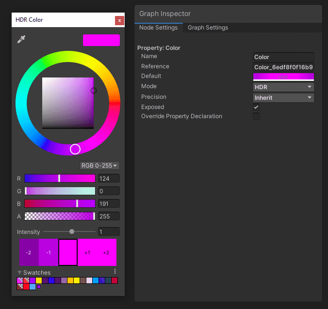
*Colors are the basic building blocks of shaders. You’ll be using them a lot.*
*颜色是着色器的基本构建块。你会经常使用它们。*

### Boolean (Property) 布尔

属性可以是 **True** 或 **False**，可使用复选框进行控制。有一组使用布尔逻辑的节点 - 我们将在文章末尾讨论这些节点。

###  Gradient (Property) 渐变条

**1. 基本操作**

- **颜色控制（底部色条）**：
  - 点击色条边缘可**添加/删除**颜色控制点
  - 拖动控制点调整位置，或双击修改颜色值
- **透明度控制（顶部色条）**：
  - 同颜色控制逻辑，但调整的是 Alpha 通道（0=透明，1=不透明）

**2. 关键限制**

- **不可暴露（Exposed 选项禁用）**：
  - 与其他属性不同，`Gradient` **无法** 在 Unity Inspector 中直接编辑
  - 必须通过 **Shader Graph 内部** 或 **脚本动态修改**

**3. 典型应用场景**

- 动态渐变效果（如能量盾、过渡动画）
- 混合复杂颜色序列（如地形高度渐变）

> ⚠️ **注意事项**
> 渐变数据以纹理形式烘焙到着色器中，过度复杂的渐变可能增加内存开销。

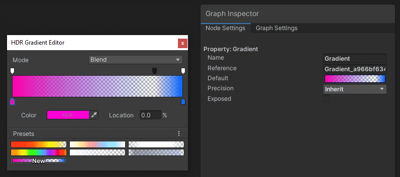
*Gradients are great ways to add a color ramp to your shaders.*
*渐变是向着色器添加色带的好方法。*

###  Texture 2D (Property) 2D纹理

`Texture 2D`属性类型允许在着色器图中声明需要使用的纹理资产。**模式（Mode）**下拉菜单提供三种无纹理时的默认颜色选项：**纯白（White）**、**中灰（Grey）**与**纯黑（Black）**，另有**凹凸（Bump）**模式可生成完全平坦的蓝色法线贴图。

###  Texture 2D Array (Property)  2D纹理数组

`纹理2D数组`是一组尺寸与格式相同的2D纹理的集合，这些纹理被打包在一起，以便GPU能像读取单个纹理一样高效地读取它们。我们可以使用特定节点对它们进行采样，具体方法将在后文详述。

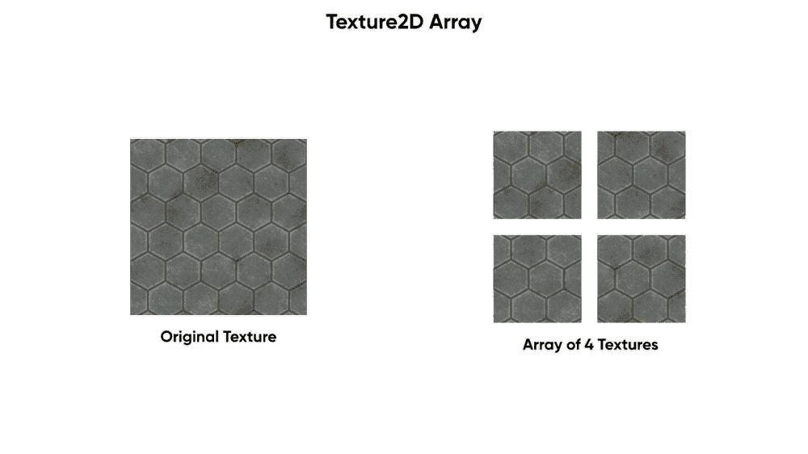
*You can create a Texture2D Array by slicing an existing Texture2D into sections.*
*您可以通过将现有 Texture2D 切成多个部分来创建 Texture2D 数组。*

### Texture 3D (Property) 3D纹理

3D纹理（Texture 3D）与2D纹理（Texture 2D）类似，但多了一个维度——它就像一个由颜色数据构成的三维数据块。与2D纹理不同，您无法使用**模式（Mode）**选项。

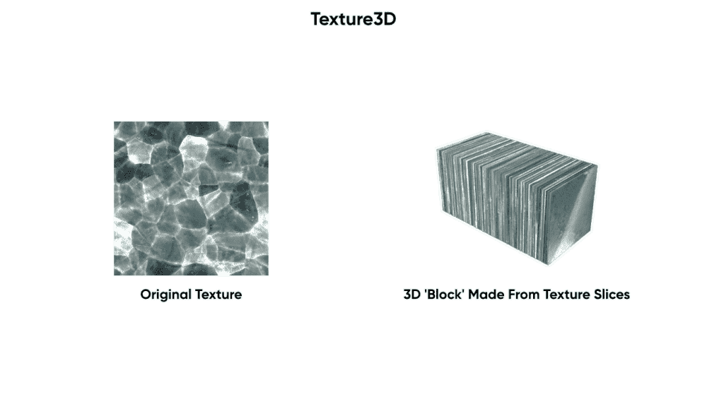
*You can generate Texture3D data in scripting or by slicing a Texture2D.*
*您可以在脚本中或通过对 Texture2D 进行切片来生成 Texture3D 数据。*

###  Cubemap (Property) 立方体贴图

`立方体贴图（Cubemap）`是一种特殊的纹理类型，其概念类似于立方体的展开图——可以理解为六个拼接在一起的纹理。它们常用于天空盒（Skybox）和反射映射（Reflection Mapping）。


*A Cubemap is a specially-imported Texture2D or collection of textures.*
*Cubemap 是专门导入的 Texture2D 或纹理集合。*

###  Virtual Texture (Property) 虚拟纹理

`虚拟纹理（Virtual Texture）`可用于减少内存占用（若使用了多个高分辨率纹理），但仅HDRP渲染管线支持该功能。在URP中使用时，其性能表现与常规纹理采样方式并无差异。我们可以从堆栈中添加或移除最多四个纹理，不过不确定这一数量是否会因硬件或其他设置而发生变化。

###  Matrix 2 (Property) 二维矩阵

1. **基本结构**

- 2×2 矩阵，包含 4 个浮点数（`00`, `01`, `10`, `11`）

- **默认值**：单位矩阵（Identity Matrix）

  ```
  [1, 0]  
  [0, 1]  
  ```

  - **对角线上为 1**（`00` 和 `11`）
  - **其余位置为 0**（`01` 和 `10`）

2. **数学特性**

- **单位矩阵作用**：向量乘以单位矩阵后保持不变（相当于 `×1`）
- **可自定义修改**：支持任意 2D 线性变换（如旋转、缩放、剪切）

​	**典型应用场景**

- **2D 变换计算**（如 UV 坐标旋转/缩放）

  ```
  // 示例：UV 旋转 90 度  
  [0, -1]  
  [1,  0]  
  ```

- **法线贴图的切线空间转换**（构造简化版 TBN 矩阵）

- **物理模拟**（如 2D 刚体变换矩阵）

3. **使用注意事项**

- 在 Shader Graph 中需手动连接至 `Matrix Operator` 节点运算
- 与 `Matrix 3`/`Matrix 4` 不同，**不直接支持坐标空间转换**（仅适用于 2D 向量操作）

（注：GPU 对 2×2 矩阵有特殊优化，适合轻量级计算）

###  Matrix 3 (Property) 三维矩阵

1. **基本结构**

- **3×3 矩阵**，包含 9 个浮点数（`00` 到 `22`）

- **默认值**：单位矩阵（Identity Matrix）

  ```
  [1, 0, 0]  
  [0, 1, 0]  
  [0, 0, 1]  
  ```

  - **主对角线为 1**（`00`, `11`, `22`）
  - **其余位置为 0**

2. **核心用途**

- **3D 线性变换**（适用于 **方向向量** 或 **切线空间计算**）：
  - **旋转**（绕任意轴）
  - **缩放**（非均匀缩放需谨慎）
  - **剪切**（Skew）
- **TBN 矩阵构造**（切线空间 → 世界空间的法线转换）

3. **与  Matrix 4  的关键区别**

| 特性         | `Matrix 3`        | `Matrix 4`              |
| :----------- | :---------------- | :---------------------- |
| **维度**     | 3×3               | 4×4                     |
| **位移支持** | ❌ 仅旋转/缩放     | ✅ 支持位移（通过第 4 行） |
| **性能开销** | 更低              | 略高                    |
| **典型用途** | 法线变换/方向计算 | 完整 MVP 矩阵变换       |

4. **使用示例**

```glsl
// 构造一个绕 Z 轴旋转 45 度的矩阵  
float angle = radians(45);  
float3x3 rotMatrix = {  
    cos(angle), -sin(angle), 0,  
    sin(angle),  cos(angle), 0,  
    0,           0,          1  
};  
```

5. **注意事项**


- **法线变换需用逆转置矩阵**（避免非均匀缩放导致错误）
- 在 Shader Graph 中通常通过 `Transform` 节点隐式使用，较少直接操作

（注：Unity 的 **表面着色器** 自动处理大部分 `Matrix 3` 运算，如 TBN 矩阵构建）

###  Matrix 4 (Property) 四维矩阵

1. **基本结构**

- **4×4 矩阵**，包含 16 个浮点数（`00` 到 `33`）

- **默认值**：单位矩阵（Identity Matrix）

  ```
  [1, 0, 0, 0]  
  [0, 1, 0, 0]  
  [0, 0, 1, 0]  
  [0, 0, 0, 1]  
  ```
  
  - **主对角线为 1**（`00`, `11`, `22`, `33`）
- **其余位置为 0**

2. **核心用途**

- **完整空间变换**（支持位移、旋转、缩放、透视投影）：
  - **MVP 矩阵**（Model-View-Projection）
  - **骨骼动画**（蒙皮矩阵）
  - **自定义坐标空间转换**
- **投影变换**（如实现镜头畸变、VR 扭曲效果）

3. **与 `Matrix 3` 的关键增强**

| 能力         | `Matrix 3` | `Matrix 4`                |
| :----------- | :--------- | :------------------------ |
| **位移支持** | ❌          | ✅（通过第 4 列 [03,13,23]） |
| **透视变换** | ❌          | ✅（通过 [30,31,32,33]）   |
| **齐次坐标** | ❌          | ✅（W 分量处理）           |

4. **使用限制**

- **不可直接暴露到 Inspector**（需通过代码或节点间接传参）
- **Shader Graph 隐式应用场景**：
  - `Transform` 节点内部使用
  - 渲染管线的内置矩阵（如 `UNITY_MATRIX_MVP`）

5. **经典运算示例**

```glsl
// 构造一个平移矩阵（沿X轴移动2单位）  
float4x4 translationMatrix = {  
    1, 0, 0, 2,  
    0, 1, 0, 0,  
    0, 0, 1, 0,  
    0, 0, 0, 1  
};  
```

6. **性能注意**

- **避免每帧动态构造大矩阵**（优先使用 Unity 内置矩阵）
- **移动平台警惕精度问题**（可改用 `half4x4` 节省带宽）

（注：在 **URP/HDRP** 中，摄像机矩阵会自动处理反向 Z 缓冲等优化逻辑）

### Sampler State (Property)  采样方式

1. **核心功能**

- **控制纹理采样方式**，影响渲染质量和性能
- **不可在 Inspector 中直接暴露**（需通过代码或 Shader Graph 内部设置）

2. **关键参数**

**① Filter（滤波模式）**

| 模式          | 效果                                   | 适用场景               |
| :------------ | :------------------------------------- | :--------------------- |
| **Point**     | 无平滑，直接取最近像素                 | 像素风/复古风格        |
| **Linear**    | 双线性插值，平滑相邻像素               | 通用高清纹理           |
| **Trilinear** | 在 Linear 基础上，额外平滑 Mipmap 层级 | 动态视角（如 3D 地形） |

**② Wrap（循环模式）**

| 模式           | 效果             | 数学表达                           |
| :------------- | :--------------- | :--------------------------------- |
| **Repeat**     | 平铺重复（默认） | `UV = frac(UV)`                    |
| **Clamp**      | 截取到边缘像素   | `UV = clamp(UV, 0, 1)`             |
| **Mirror**     | 镜像重复         | `UV = 1 - |frac(UV)×2 - 1|`        |
| **MirrorOnce** | 单次镜像后截取   | `UV = clamp(1 - |UV×2 - 1|, 0, 1)` |

3. **技术说明**

- **性能排序**：Point > Linear > Trilinear
- **Mipmap 依赖**：Trilinear 需启用纹理的 `Generate Mipmaps`
- **UV 越界行为**：
  - `Repeat` 可能导致纹理接缝问题
  - `Clamp` 适合遮罩/UI 纹理

4. **使用建议**

- **风格化渲染**：Point + Repeat（保留硬边缘）
- **写实材质**：Trilinear + Mirror（减少视觉重复）
- **性能敏感场景**：Linear + Clamp（平衡质量与开销）

（注：在 Shader Graph 中，`Sampler State` 需绑定到 `Sample Texture 2D` 节点生效）

## Keyword Types 关键字类型

我们还有用于Graph的关键字，以便根据关键字值将一个Graph拆分为多个变体。

### Boolean (Keyword) 布尔类型关键字

A `Boolean` keyword is either true or false, so using one will result in two shader variants. Depending on the **Definition**, the shader acts differently: **Shader Feature** will strip any unused shader variants at compile time, thus removing them; **Multi Compile** will always build all variants; and **Predefined** can be used when the current Render Pipeline has already defined the keyword, so it doesn’t get redefined in the generated shader code. That might otherwise cause a shader error.

关键字要么是 true 要么是 false，因此使用一个关键字将产生两个着色器变体。根据 **定义** 的不同，着色器的作用不同：**着色器功能** 将在编译时剥离任何未使用的着色器变体，从而删除它们; **Multi Compile** 将始终构建所有变体; 当当前渲染管线已经定义了关键字时，可以使用 **预定义**，因此它不会在生成的着色器代码中重新定义。否则，这可能会导致着色器错误。

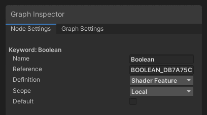
*Keywords give you an even bigger degree of control over your shaders.*
*关键字使您可以更大程度地控制着色器。*

我们也可以修改 **Scope**：**Local** 将关键字保留为此着色器图的私有，而 **Global** 定义整个项目中所有着色器的关键字。

### Enum (Keyword) 枚举类型关键字

The `Enum` keyword type lets us add a list of strings, which are values the enum can take, then set one of them as the default. We can choose to make our graph change behaviour based on the value of this enum, and we have the same **Definition** options as before.

关键字类型允许我们添加字符串列表，这些字符串是枚举可以采用的值，然后将其中一个设置为默认值。我们可以选择根据此枚举的值来更改图形的行为，并且我们具有与以前相同的 **定义** 选项。

### Material Quality (Keyword) 材质质量关键字

Unity, or a specific Render Pipeline, can add enums automatically. The `Material Quality` is a relatively new built-in enum keyword, which is just a built-in enum based on the quality level settings of your project. This allows you to change the behaviour of your graph based on the quality level of the game’s graphics. For example, you might choose to use a lower LOD level on certain nodes based on the material quality.

Unity 或特定的渲染管线可以自动添加枚举。这是一个相对较新的内置枚举关键字，它只是一个基于项目质量级别设置的内置枚举。这允许您根据游戏图形的质量级别更改图形的行为。例如，您可以根据材料质量选择在某些节点上使用较低的 LOD 级别。

------

# Input Nodes 输入节点系列

输入节点系列涵盖基本基元类型、采样纹理和获取有关输入网格的信息等。

## Basic Nodes 基础节点系列

###  Color 颜色节点

该节点带有一个矩形，我们可以单击该矩形来定义原始颜色。与 Unity 中的大多数颜色选择器窗口一样，我们可以在红-绿-蓝和色调饱和度值颜色空间之间切换、设置 alpha 或使用现有色板。或者，我们可以使用**吸管**在 Unity 窗口中选择任何颜色。通过将 **Mode（模式）** 下拉列表更改为 **HDR**，我们可以访问 HDR（高动态范围）颜色，从而将强度提高到 0 以上，这对于自发光材质特别有用。但是，并非每个接受颜色输入的节点都会考虑 HDR。它有一个输出，正是您定义的颜色。

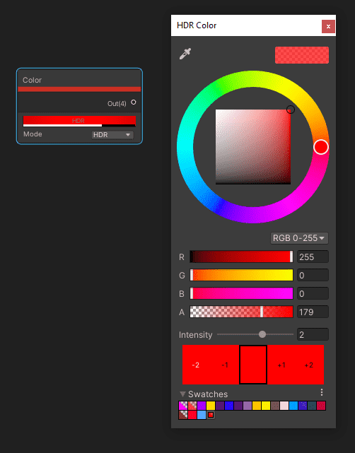
*Setting the Color node to HDR gives us an extra Intensity setting which we can use in emissive materials.*
*将“颜色”节点设置为 HDR 为我们提供了一个额外的“强度”设置，我们可以在自发光材质中使用该设置。*

### Vector 1 节点

Vector1节点（在更高版本的 Shader Graph 中称为Float节点）允许我们定义一个常量浮点值。它需要一个浮点输入，我们可以随意更改，以及一个输出，与输入相同。

### Vector 2 节点

`Vector 2` is similar to Vector 1, but we can define two floats as inputs. The output is a single `Vector 2`, with the first input in the X component and the second input in the Y component.

`Vector 2` 与向量 1 类似，但我们可以定义两个浮点数作为输入。输出是单个 Vector 2，第一个输入在 X 分量中，第二个输入在 Y 分量中。

### Vector 3 节点

`Vector 3` follows the same pattern, with three inputs labelled X, Y and Z, and one output which combines the three.

`Vector 3` 遵循相同的模式，三个输入标记为 X、Y 和 Z，一个输出将这三者组合在一起

### Vector 4 节点

And unsurprisingly, the `Vector 4` node has four inputs, X, Y, Z and W, and one output which combines all four into a `Vector 4`. All of these nodes act like the property types.

不出所料，该节点有四个输入，X、Y、Z 和 W，以及一个将所有四个组合成一个 .所有这些节点的行为都类似于属性类型。

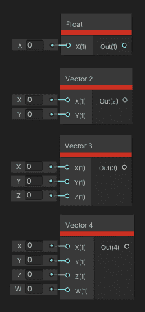
*Take note of the number of inputs and the size of the output of each node.*
*记下每个节点的输入数和输出大小。*

### Integer 整数节点

The `Integer` node is slightly different to the `Float` node, in that you use it to define integers, but it also doesn’t take any inputs. We just write the integer directly inside the node. The single output, of course, is that integer.

该节点与节点略有不同，因为您可以使用它来定义整数，但它也不接受任何输入。我们只是直接在节点内写入整数。当然，单个输出就是那个整数。

###  Boolean 布尔节点

The `Boolean` node is like the Integer node, insofar as it doesn’t take any inputs. If the box is ticked, the output is **True**, and if it’s unticked, the output is **False**.

该节点类似于 Integer 节点，因为它不接受任何输入。如果选中该框，则输出为 **True**，如果未选中，则输出为 **False**。

### Slider 滑动条节点

The `Slider` node is useful if you want to use a `Float` inside your graph, and you don’t want the user to modify the value from outside your shader, but you need some extra ease of use for testing purposes. We can define a minimum and maximum value, then, using the slider, we can output a value between those min and max values.

如果要在图形内部使用，并且不希望用户从着色器外部修改值，则该节点非常有用，但出于测试目的，您需要一些额外的易用性。我们可以定义最小值和最大值，然后使用滑块，我们可以输出这些最小值和最大值之间的值。

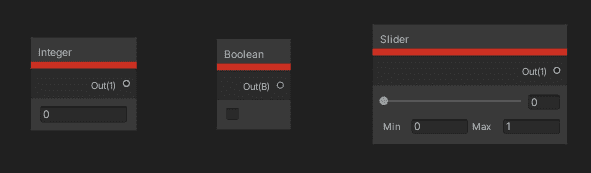
*Some nodes have special functions on the node body, not just inputs and outputs.*
*一些节点在节点主体上具有特殊功能，而不仅仅是输入和输出。*

###  Time 时间节点

`Time` 节点为我们提供了多个随时间变化的浮点数值。其中：

- **Time** 输出表示场景启动后经过的秒数；
- **Sine Time** 相当于将 **Time** 值输入正弦函数后的输出结果；
- **Cosine Time** 类似，但使用 **Time** 值作为余弦函数的输入；
- **Delta Time** 是上一帧到当前帧之间经过的时间（以秒为单位）；
- **Smooth Delta** 与 **Delta Time** 类似，但通过对多帧的增量值进行平均来平滑结果。

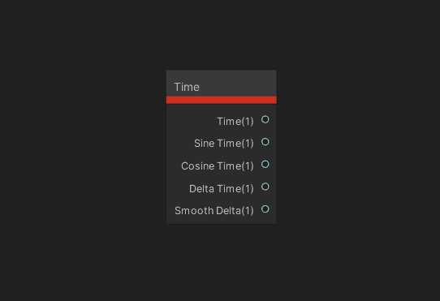
*Quite a few nodes are just for retrieving information, so they don’t have inputs, only outputs.*
*相当多的节点只是用于检索信息，所以它们没有输入，只有输出。*

### Constant 常数节点

常数节点允许您使用下拉菜单访问广泛使用的数学常数，并具有单个输出。这些常数是 pi、tau（等于 pi 的两倍）、phi（即黄金比例）、e（也称为欧拉数）和 2 的平方根（square root of 2）。

## Texture Nodes 纹理节点系列

Texture 系列节点：访问不同类型的纹理或对它们进行采样。

### Sample Texture 2D  采样2D纹理节点

`Sample Texture 2D` 节点是我几乎在每个着色器中都会高频使用的一个节点。它接收三个输入参数：

- **Texture**：需要采样的纹理；
- **UV**：纹理采样坐标（决定从纹理的哪个位置取样）；
- **Sampler State**：控制纹理采样方式的采样器状态（如过滤模式、寻址模式等）。

此外，该节点有两个关键选项：

- Type：

  - 当设置为 **Default** 时，节点输出纹理颜色值；

  - 当设置为 **Normal** 时，节点用于采样法线贴图（需配合特定空间模式使用）。

- **Space**：仅在 **Normal** 模式下生效，决定输出的法线信息所属的空间——**Object**（对象空间）或 **World**（世界空间）。

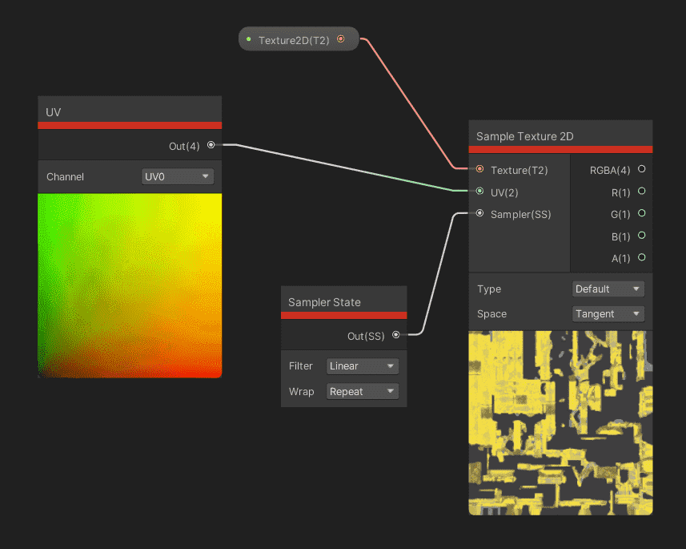
*This is one of the most important nodes. If you don’t fill the UV and Sampler inputs, default values are used.*
*这是最重要的节点之一。如果不填充 UV 和 Sampler 输入，则使用默认值。*

We have several outputs, which looks intimidating at first glance, but the first output is the red-green-blue-alpha color of the texture, and the next four outputs are those individual components. This node, as with many texture sampling nodes, can only be used in the fragment stage of a shader.

我们有几个输出，乍一看很吓人，但第一个输出是纹理的红-绿-蓝-alpha 颜色，接下来的四个输出是那些单独的组件。与许多纹理采样节点一样，此节点只能在着色器的片段阶段使用。

###  Sample Texture 2D Array 采样2D纹理数组节点

`Sample Texture 2D Array` 节点的功能与 `Sample Texture 2D` 节点类似，但移除了 **Type** 和 **Space** 选项，新增了一个 **Index** 输入参数，用于指定数组中需要采样的具体纹理（关于纹理数组的工作原理可参考属性部分说明）。

该节点的核心调整包括：

- **Index** 输入：通过数值索引控制采样的目标纹理（例如，索引 `0` 对应数组中的第一张纹理）；
- 移除的选项：不再支持颜色模式（**Default**）或法线贴图模式（**Normal**）的切换，也不区分输出空间（**Object**/**World**）。

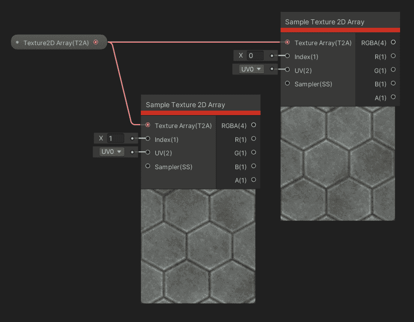
*Note the slightly different output on both nodes - they’re using different indices.*
*请注意，两个节点上的输出略有不同 - 它们使用不同的索引。*

### Sample Texture 2D LOD 采样2D纹理带LOD参节点

`Sample Texture 2D LOD` 节点的功能与 `Sample Texture 2D` 节点完全一致，但新增了一个 **LOD** 输入参数。通过该参数，我们可以手动指定采样时使用的 **mipmap 层级**（即纹理细节层级）。由于 LOD 值可直接控制，这意味着该节点甚至可以在着色器的 **顶点阶段** 使用——直到研究这些节点的功能前，我都未曾意识到这一点！

> 核心调整说明：
>
> 1. LOD 输入：
>    - 允许开发者直接设置 mipmap 层级（例如 `0` 表示最高分辨率，数值越大细节越简略）；
>    - 此功能使得纹理采样不再依赖自动的 mipmap 计算，适用于需要精确控制纹理细节的场景（如顶点着色器中的地形渲染）。
> 2. 跨阶段兼容性：
>    - 因移除了对屏幕空间导数（如 `ddx/ddy`）的依赖，该节点可在顶点着色器中运行（传统 `Sample Texture 2D` 依赖导数计算，仅限像素着色器使用）。

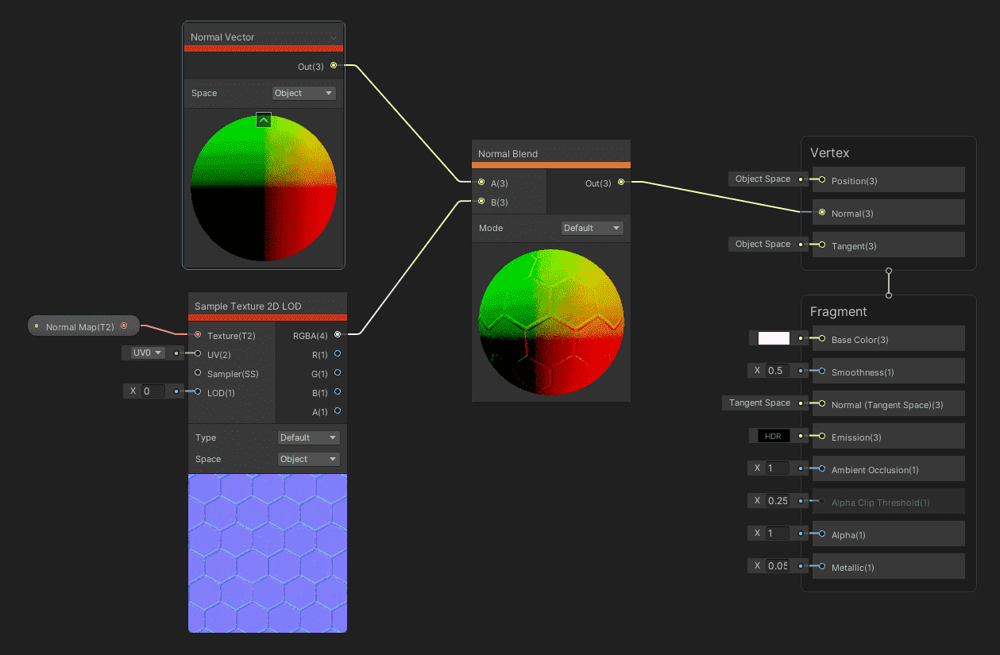
*Sampling a normal texture and adding it to the vertex normal vector.*
*对法线纹理进行采样并将其添加到顶点法线向量中。*

###  Sample Texture 3D  采样3D纹理节点

`Sample Texture 3D` 节点在概念上与 `Sample Texture 2D` 类似，但需注意以下关键差异：

- **输入类型**：需提供一个 **三维纹理**（Texture 3D），且 **UV 坐标**必须为三维坐标（而非二维）；
- 功能调整：
  - 仍可指定 **Sampler State**（采样器状态），但移除了模式切换的下拉选项；
  - 输出格式简化为单通道的 **Vector4** 值（不同于 `Sample Texture 2D` 的分通道输出）。

> 该节点适用于需要处理体积数据（如 3D 噪声纹理、体渲染）的场景，但由于三维纹理采样对硬件性能要求较高，需谨慎使用。

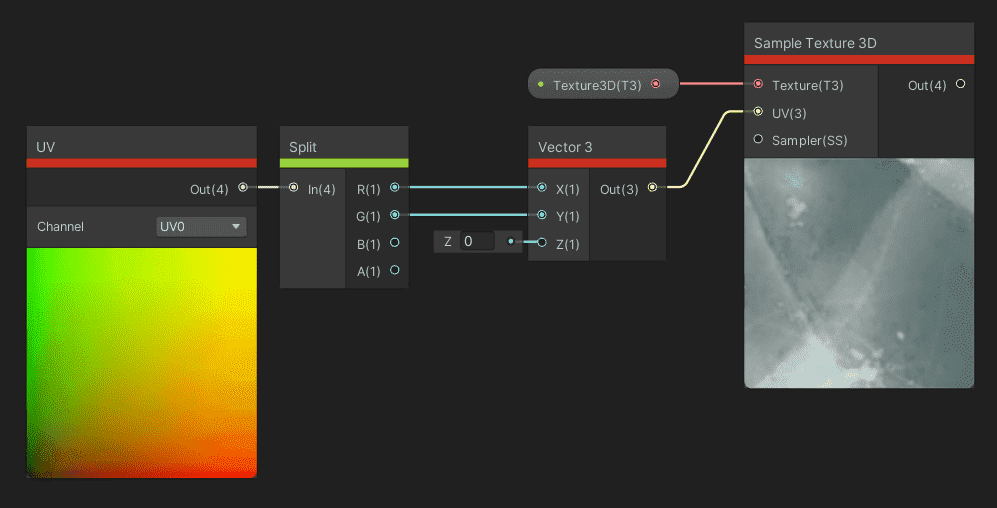
*This node tree is setup so we can tweak the Z value to scroll through the 3D texture data.*
*设置此节点树，以便我们可以调整 Z 值以滚动浏览 3D 纹理数据。*

### Sample Cubemap  采样立方体贴图节点

`Sample Cubemap` 节点接收一个 **立方体贴图（Cubemap）**、**采样状态（Sampler State）** 和 **细节层次（LOD）** 等输入（这些此前均已介绍），以及一个 **方向向量（Dir）**。该节点通过方向向量（而非UV坐标）确定在立方体贴图中采样的位置。可以将其概念化为一个带纹理的立方体，但膨胀成球体形状：**Dir** 输入是一个世界空间向量，从球心向外指向球面某点。节点唯一的输出是颜色。由于通过 **LOD** 输入指定 mipmap 层级，该节点既可用于着色器的片元阶段，也可用于顶点阶段（但如果 **方向（Dir）** 输入未连接，可能会遇到问题）。此节点非常适合用于天空盒效果。

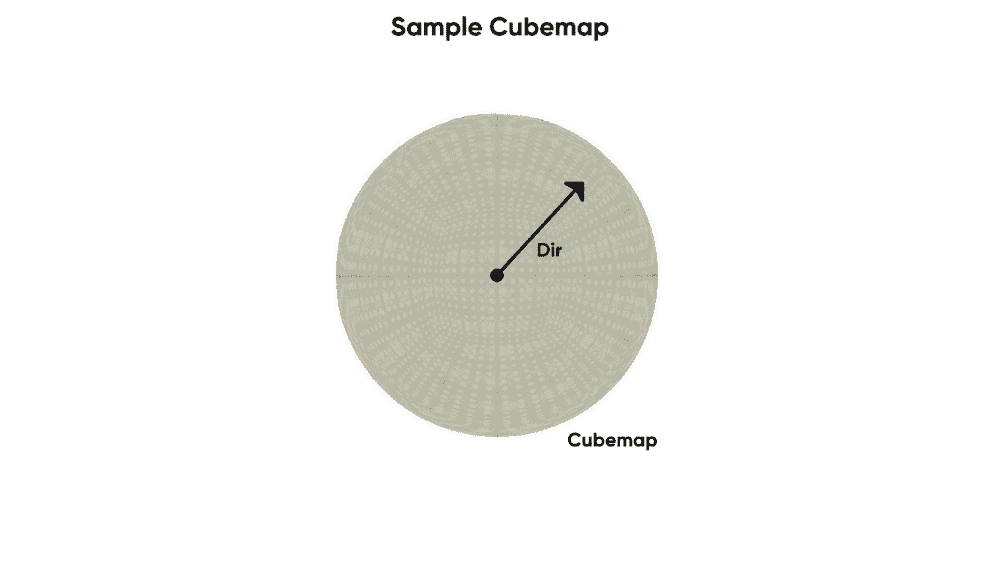
*Cubemaps are commonly used to create skybox textures to simulate the sky.*
*立方体贴图通常用于创建天空盒纹理以模拟天空。*

### Sample Reflected Cubemap 采样反射立方体贴图

`Sample Reflected Cubemap` 节点与 `Sample Cubemap` 节点类似，但额外包含一个 **法线（Normal）** 输入，且该输入与视角方向（View Direction）均需位于**对象空间（Object Space）**。从概念上讲，该节点的作用类似于：当观察场景中的物体时，通过物体表面法线将视角方向向量反射，再利用反射后的向量对立方体贴图进行采样。与 `Sample Cubemap` 不同，`Sample Reflected Cubemap` 节点非常适合为场景中的物体添加来自天空盒的反射光照效果。

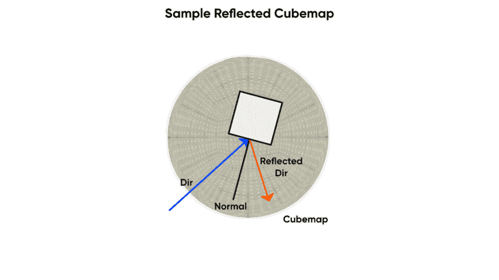
*A reflected cubemap, on the other hand, are used for reflection mapping.*
*反射立方体贴图（reflected cubemap）则专门用于**反射贴图（reflection mapping)**技术。*

###  Sample Virtual Texture 采样虚拟纹理

`Sample Virtual Texture` 节点默认包含两个输入：用于采样纹理的 **UV** 坐标，以及一个 **虚拟纹理（Virtual Texture）** 插槽。一旦连接了虚拟纹理，节点的输出数量会相应调整，以匹配该虚拟纹理对象的**层级（layers）**数量。我们可以根据需要使用其中任意输出。

值得注意的是，该节点在 **节点设置（Node Settings）** 窗口中还包含额外选项。我们可以将 **寻址模式（Address Mode）** 设为 **重复（Wrap）** 或 **钳制（Clamp）**（当UV坐标小于0或大于1时控制纹理行为），并在此调整 **细节层次（LOD）模式**：

- **自动（Automatic）**：根据项目设置自动使用LOD；
- **LOD层级（LOD Level）**：添加 **LOD** 输入，允许手动设置mipmap层级；
- **LOD偏移（LOD Bias）**：在自动LOD层级混合时，控制偏向高细节或低细节纹理；
- **导数（Derivative）**：添加 **Dx** 和 **Dy** 选项（但Unity官方未明确说明其具体作用）。

我们可以切换纹理的质量等级（低/高），并选择是否启用**自动流送（Automatic Streaming）**。若关闭自动流送并将**LOD模式（LOD Mode）**设为**LOD层级（LOD Level）**，该节点甚至可在顶点着色器阶段使用。据我所知，此节点取代了早期的`Sample VT Stack`节点，且仅适用于Shader Graph的较新版本。此外需注意：在非HDRP管线中，该节点并无特殊优势，其功能与常规的`Sample Texture 2D`节点无异。

###  Sampler State 采样状态节点

`Sampler State` 节点与 `Sampler State` 属性的工作方式完全相同：它允许我们定义**过滤（Filter）**模式和**环绕（Wrap）**模式来对纹理进行采样。我们可以将此节点附加到此前接触过的大部分纹理采样节点上。

###  Texture 2D Asset  2D纹理资源节点

`Texture 2D Asset` 节点允许我们查找**资源文件夹（Assets folder）**中定义的任何 `Texture 2D` 并在着色器图中使用它。如果该着色器始终使用同一纹理（无论使用哪个材质实例），且无需通过属性动态控制纹理选择，此功能非常实用。

### Texture 2D Array Asset  2D纹理数组资源

该节点与 `Texture 2D Asset` 相同，只不过是换成获取了“Texture 2D Array”。

### Texture 3D Asset  3D纹理资源节点

`Texture 3D Asset` 节点的功能与 `Texture 2D Asset` 类似，但专用于**3D纹理资源（Texture 3D）**。该节点允许我们在着色器图中直接访问项目资源中的3D纹理，而无需通过属性参数动态控制纹理选择。此功能适用于需要固定使用某个3D纹理的场景（例如科学可视化中的体数据渲染）。

### Cubemap Asset  立方体贴图资源

我们可以使用 `Cubemap Asset` 节点在着色器图中访问立方体贴图资源。此节点专用于加载项目中的立方体贴图文件（如环境反射贴图或天空盒），无需通过属性动态控制纹理选择。

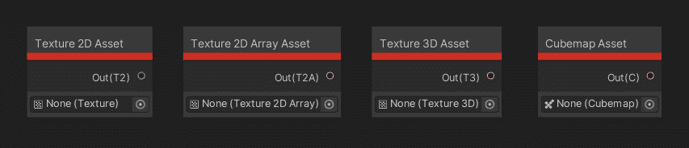
*We can grab textures directly within the shader without using properties.*
*我们可以直接在着色器中抓取纹理，而无需使用属性。*

### Texel Size  纹素尺寸节点

`Texel Size` 节点接收一个 **2D纹理** 作为输入，并输出其宽度与高度（单位为像素）。此处的 **"Texel"**（纹素）是 **"texture element"** 的缩写，可理解为与 **"Pixel"**（像素，即 **"picture element"**）类似的概念。
（注：纹素是纹理采样的最小单位，而像素是屏幕显示的最小单位，二者在概念层级和应用场景上存在本质差异。）

## Scene Nodes 场景节点系列

Scene 系列节点使我们能够访问有关场景的若干关键信息，包括渲染状态和用于渲染的相机的属性。

### Screen 屏幕节点

`Screen` 节点会获取屏幕的宽度与高度（以像素为单位），并返回这两个值作为输出。

### Scene Color 场景颜色节点

`Scene Color`（场景颜色）节点允许我们在当前帧渲染完成前访问帧缓冲区（Framebuffer）的内容，但该节点**仅能在片段着色器阶段（Fragment Shader Stage）使用**。在URP（通用渲染管线）中，此节点**仅适用于透明材质（Transparent Materials）**，并且显示的内容为场景中的不透明物体（Opaque Objects）。需要注意的是，该节点的行为可能因渲染管线不同而有所差异。

- **UV 输入**：控制需要采样的屏幕空间坐标（Screen Position UV）。默认情况下，它使用当前正在渲染的像素的屏幕坐标UV。关于其他选项的详细说明将在后续的 `Screen Position` 节点中讨论。
- **输出**：返回指定屏幕位置的颜色值。

> 注：
>
> - **性能限制**：频繁采样场景颜色可能导致性能下降（如屏幕空间反射或后期特效中需谨慎使用）。
> - **URP 限制**：在URP中，透明材质通过混合模式实现透明效果，因此该节点的输出通常用于模拟透明物体的背景交互（如玻璃折射）。
> - **跨管线差异**：在HDRP（高清渲染管线）中，此节点可能支持更多高级功能（如自定义采样模式），但需结合具体管线文档使用。

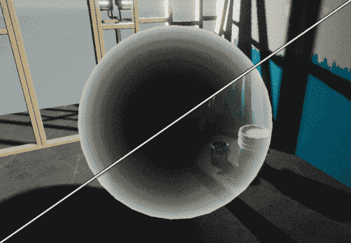
*How Scene Color appears for opaque (left) and transparent (right) shaders, with added Fresnel. All pixels are fully opaque.*
*不透明（左）和透明（右)着色器的场景颜色的显示方式，并添加了菲涅耳。所有像素都是完全不透明的。*

在URP中，你还需要找到项目中的**前向渲染器（Forward Renderer）**资产，并确保勾选**不透明纹理（Opaque Texture）**复选框，否则Unity根本不会生成该纹理，画面将一片漆黑。该节点非常适合用于玻璃或冰材质，需要让网格后的场景产生轻微扭曲效果时使用。

###  Scene Depth 场景深度节点

与 `Scene Color` 节点类似，`Scene Depth` 节点可用于访问**深度缓冲（Depth Buffer）**，该缓冲用于表示渲染像素到相机的距离。同样，在URP中，该节点仅适用于透明材质。其输入参数为 **UV** 坐标。

该节点还包含一个 **采样（Sampling）** 选项，提供三种设置。**Linear 01** 会将深度值归一化到 0 到 1 之间：值为 1 的像素位于相机的**近裁剪平面（near clip plane）**，值为 0 的像素位于**远裁剪平面（far clip plane）**（某些情况下可能相反），而位于两者之间的物体深度值为 0.5。

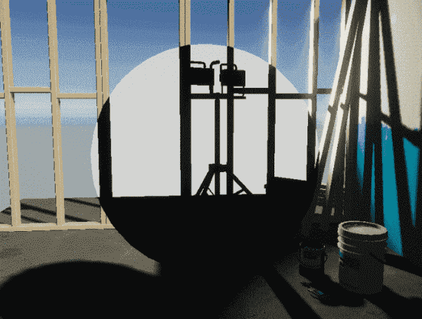
*This is the Scene Depth using Linear 01 mode.*
*这是使用 Linear 01 模式的场景深度。*

该节点还包含一个 **采样（Sampling）** 选项，提供三种设置。**Raw**（原始）模式会直接返回未经归一化的原始深度值。在此模式下，位于近裁剪平面（near clip plane）的像素深度值可能高于 0.5（例如，若物体位于近远裁剪平面中间，其深度值可能大于 0.5）。最后，**Eye**（眼空间）选项会将深度值转换为**眼空间坐标**，即表示像素相对于相机视图方向，距离相机中心点的单位长度。

###  Camera 相机节点

`Camera` 节点 **仅适用于通用渲染管线（Universal Render Pipeline）**。通过该节点，你可以获取当前渲染相机的多项属性，包括：

- **Position**（世界空间坐标）
- **Direction**（相机正前方的方向向量）
- **Orthographic**（是否为正交相机：是则输出 `1`，否则输出 `0`）
- **Near Plane** 与 **Far Plane**（两个裁剪平面的浮点数值）
- **Z Buffer Sign**（深度缓冲区符号：标准深度缓冲区返回 `1`，反向深度缓冲区返回 `-1`）

该节点适用于基于深度的特效（例如结合 `Scene Depth` 节点使用）。此外，**Width** 和 **Height** 输出可获取屏幕的宽高（以世界空间单位表示），但 **仅当相机为正交投影时生效**。

###  Fog 雾节点

`Fog` 节点同样不被 HDRP 支持。该节点会返回你在 **Lighting** 标签页的 **Environment Settings** 中定义的雾效信息。需要传入**对象空间坐标（Position）**，节点会返回该位置处雾的**颜色（Color）**及其**浓度（Density）**。此节点可用于着色器的顶点阶段和片段阶段。

###  Object 物体节点

`Object` 节点提供两个输出：物体在**世界坐标系（world space）**中的**位置（Position）**和**缩放（Scale）**，数据类型均为 `Vector3`。

## Lighting Nodes 光照节点系列

光照节点（Lighting Nodes）提供对影响特定顶点（Vertex）或片段（Fragment）的各类光照的访问接口。

> 注：顶点光照是基于顶点法线计算，片段光照是基于像素级法线计算（支持更复杂的光影效果如PBR）。光照类型包括但不限于环境光（Ambient）、漫反射（Diffuse）、镜面反射（Specular）及全局光照（Global Illumination）。

### Ambient 环境光节点

`Ambient`（环境光）节点返回三种不同类型的环境光颜色值，但这些功能仅在 **URP（通用渲染管线）** 中支持。这些值取决于项目 **光照设置面板（Lighting Tab）** 中 **环境光照（Environment Lighting）** 的配置。

- **Equator（赤道光）** 和 **Ground（地面光）** 输出：
  无论选择何种光源类型（如天空光或颜色填充），这两个通道始终返回环境光设置中的赤道光和地面光数值（即使这些参数仅在 ​**Gradient（渐变）​**​ 模式下生效）。
- **Color/Sky（颜色/天空）输出**：
  当环境光模式设为 ​**Gradient**​ 时，输出天空颜色；若光源类型设为 ​**Color**​（颜色填充），则输出环境光颜色（Ambient Color）。

> 注：
>
> - **URP 限制**：URP 简化了环境光逻辑，仅支持基础的环境光配置，而 HDRP（高清渲染管线）提供更复杂的光照模型（如天光、区域光等）。
> - **应用场景**：此节点通常用于全局光照的补充（如模拟天空散射光），但需注意其与阴影、反射等动态光照系统的兼容性。
> - **梯度模式（Gradient）**：通过赤道、地面、天空三色混合生成环境光，适合模拟自然光照（如日出日落效果）。

### Reflection Probe 反射探头节点

`Reflection Probe`（反射探头）节点专为 ​**通用渲染管线（URP）​**​ 设计，用于获取距离物体最近的反射探头的反射颜色。其输入需提供以下两项数据：

- **网格法线（Mesh Normal）**：物体表面的法线方向。
- **相机视角方向（Camera View Direction）**：摄像机朝向物体的方向（与 `Sample Reflected Cubemap` 节点的逻辑类似）。

此外，可通过 **LOD** 参数选择低精度采样，实现模糊反射效果。节点的唯一输出 **Out** 返回反射探头的反射颜色，数据类型为 **Vector3**（RGB颜色值）。

> 注：
>
> - **URP 限制**：URP 的反射探头逻辑简化了HDRP（高清渲染管线）的多级反射探针混合机制，仅支持基础反射探头采样。
> - **模糊反射实现**：通过降低 **LOD** 等级减少采样精度，间接模拟反射模糊（性能开销较低）。
> - **应用场景**：金属表面反光、光滑塑料材质、水面倒影等需要动态反射的场景。
> - **注意点**：若反射探头未正确布置或遮挡，可能导致反射结果不准确（需结合场景光照调试）。

### Baked GI 烘焙全局光照节点

`Baked GI` 节点用于获取 Unity **烘焙光照贴图生成器（Baked Lightmapper）** 生成的全局光照数据。使用时需提供以下输入：

1. **世界空间中的位置（Position）** 和 **法线（Normal）** 向量，用于定位光照贴图查询区域；
2. **UV 坐标集**，指导光照贴图如何映射到网格表面。

**光照贴图 UV 的两种形式**：

- **静态 UV（Static UVs）**：默认存储在 **UV1 槽**中，用于映射游戏中始终保持静止的光照（如静态环境光）；
- **动态 UV（Dynamic UVs）**：默认存储在 **UV2 槽**中，适用于可能动态开关或移动的光源（如实时开关的灯光或移动物体投影）。

**节点功能细节**：

- Unity 在烘焙光照时会自动生成这两套 UV，但用户也可手动创建（若不确定如何操作，保持默认即可）；
- 节点额外提供 **“应用光照贴图缩放”** 复选框：勾选后会自动调整光照贴图纹理的缩放比例（建议保持勾选）；
- 节点唯一输出为当前位置的光照或阴影颜色值。

> 注：这两组 UV 都可以由 Unity 在光照贴图过程中自动生成，但您也可以手动创建它们 - 但如果您不知道如何操作，那么无需担心。节点上有一个额外的复选框来应用光照贴图缩放，如果勾选，它将自动转换光照贴图纹理 - 通常最好保持勾选状态。唯一的输出是此位置的光照或阴影的颜色。

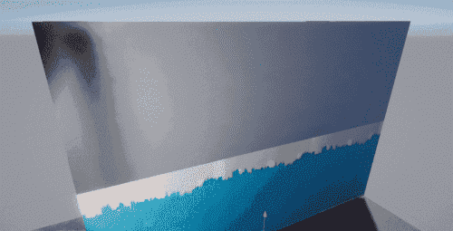
*The top-left corner of this wall still has baked shadows from a wall section that I’ve since disabled.*
*这面墙的左上角仍然有我禁用的墙面部分的阴影。*

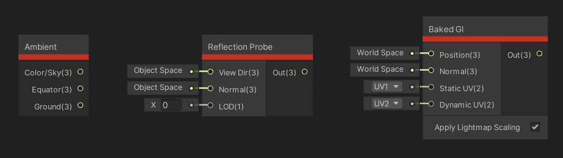
*These nodes work best on unlit materials, where you’re not using Unity’s automatic lighting systems.*
*这些节点在未使用 Unity 自动光照系统的未光照材质上效果最佳。*

## Matrix Nodes 矩阵节点系列

矩阵节点系列可用于创建新矩阵，或访问 Unity 的一些内置矩阵。

### Matrix 2x2 二维矩阵节点

二维矩阵可用于向量乘法等运算。我不会在这里详细介绍矩阵，因为说来话长——但你需要知道的是，我们可以在着色器中定义我们自己的矩阵常量。`Matrix 2x2` 节点允许我们定义一个具有两行和两列的方阵。

### Matrix 3x3 三维矩阵节点

同样， `Matrix 3x3` 节点允许我们定义具有三行和三列的矩阵。

### Matrix 4x4 四维矩阵节点

着色器支持的最大矩阵类型是 4x4 方形矩阵，我们可以用`Matrix 4x4` 节点创建它。

### Transformation Matrix 内置空间转换矩阵节点

矩阵在坐标变换中极为重要，Unity 内置了多种空间转换矩阵。虽然这些矩阵通常在后台运行，但我们可以通过 `Transformation Matrix` 节点直接调用它们。通过下拉菜单，我们可以选择以下矩阵类型：

- **Model 矩阵**：将物体从本地空间（Object Space）变换到世界空间（World Space）
- **InverseModel 矩阵**：执行相反的变换（世界空间 → 本地空间）
- **View 矩阵**：将世界空间坐标转换到相机相对视角的观察空间（View Space）
- **InverseView 矩阵**：执行观察空间 → 世界空间的逆变换
- **Projection 矩阵**：将观察空间坐标映射到裁剪空间（Clip Space），在此空间之外的对象将被裁切
- **InverseProjection 矩阵**：实现裁剪空间 → 观察空间的逆变换
- **ViewProjection 矩阵**：直接将世界空间坐标一步变换到裁剪空间
- **InverseViewProjection 矩阵**：执行裁剪空间 → 世界空间的完整逆变换

该节点的唯一输出即所选矩阵的完整变换数据。

（注：所有矩阵变换均遵循右手坐标系规则，且变换顺序对最终结果具有关键影响）

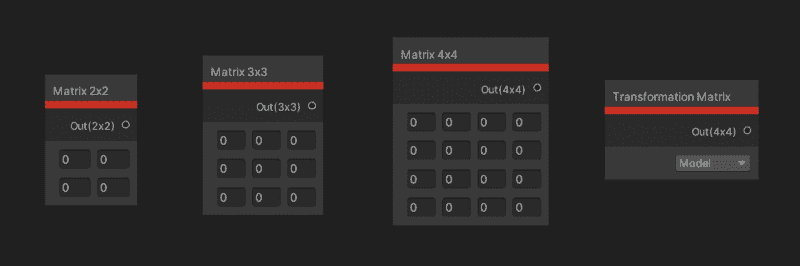
*Matrices are commonly used for transforming between spaces.*
*矩阵通常用于空间之间的转换。*

## Geometry Nodes 几何节点系列

Geometry 几何节点系列提供位置、UV、方向——都是各种各种的向量。

### Position 坐标节点

`Position` 节点用于获取当前着色器阶段（顶点或片段）的位置信息。该节点仅输出一个 `Vector 3` 向量表示位置坐标，但可通过下拉菜单选择不同的坐标空间：

- **Object**：物体本地空间（模型原始坐标系）
- **View**：观察空间（相对于相机位置）
- **Tangent**：切线空间（用于法线贴图等操作）
- **Absolute World**：绝对世界空间（全局坐标系，与之前定义的世界空间一致）
- **World**：渲染管线默认的世界空间（具体含义因管线而异）

**注意**：

- 在 URP 中，**World** 与 **Absolute World** 完全一致；
- 在 HDRP 中，由于默认采用相机相对渲染（Camera-Relative Rendering），**World** 空间坐标会相对于相机位置进行计算（即原点随相机移动）。

（该节点的空间转换规则与渲染管线紧密相关，使用时需注意目标平台差异）

### Screen Position 屏幕坐标

`Screen Position` 节点用于获取像素在屏幕上的位置信息，输出为一个 `Vector 4` 向量表示屏幕坐标。通过 **Mode** 选项可以精确控制所使用的屏幕位置类型：

- **Default（默认模式）**：
  返回经过透视除法（除以 W 分量）后的裁剪空间坐标。这是最常用的屏幕空间坐标形式。
- **Raw（原始模式）**：
  返回未进行透视除法的原始屏幕位置，适用于需要自定义投影计算的情况。
- **Center（居中模式）**：
  将屏幕坐标系原点 (0, 0) 置于屏幕中心（而非左下角），便于进行对称效果处理。
- **Tiled（平铺模式）**：
  同样以屏幕中心为原点，但仅保留坐标的小数部分（即取模运算后的结果），可实现平铺重复的视觉效果。

注：该节点的输出坐标格式与渲染管线密切相关，在使用不同渲染管线（如 URP/HDRP）时需注意坐标系差异。

### UV 纹理坐标节点

`UV` 节点用于获取顶点或片元的 UV 坐标。Unity 允许在网格数据中存储多组纹理坐标，因此我们可以通过 **Channel** 下拉菜单选择四组 UV 坐标中的任意一组（UV0 至 UV3）。

大多数情况下，网格仅使用 UV0，但其他通道（UV1、UV2、UV3）可用于存储额外的数据（如光照贴图坐标、自定义参数等）。需要注意的是：

- 必须通过外部工具（如建模软件）预先将 UV 数据烘焙到网格中。
- Shader Graph 目前仅支持访问 UV0 至 UV3，而直接编写着色器代码则可访问更多通道（UV4 至 UV7）。

（提示：UV1 常用于光照贴图，UV2/UV3 可用于程序化纹理混合或特效参数传递）

### Vertex Color 顶点颜色节点

`Vertex Color` 节点可用于获取网格顶点数据中存储的颜色信息。

**关键说明：**

1. **使用范围**：
   - 虽然名称中包含 "顶点"，但该节点实际上可在 **顶点着色器** 和 **片段着色器** 阶段同时使用。
2. **数据准备**：
   - 必须预先在建模软件（如 Blender/Maya）中为网格烘焙顶点颜色数据，或通过脚本程序化添加。
   - 未包含顶点颜色数据的网格将返回默认值（通常为黑色或白色，取决于渲染管线）。
3. **片段着色器特性**：
   - 在片段阶段，顶点颜色会基于 **重心坐标插值** 自动混合，形成平滑的渐变效果。

**典型应用场景**：

- 程序化植被着色（如树叶颜色变化）
- 顶点绘制特效（如腐蚀边缘、区域高亮）
- 低多边形风格化渲染（替代纹理贴图）

（注：在 URP/HDRP 中可能需要额外启用顶点颜色选项才能正确读取数据）

### View Direction 视线方向节点

`View Direction` 节点用于获取当前顶点或片元指向相机的方向向量，其特性如下：

**空间坐标系选项**（通过下拉菜单切换）：

1. **World Space**（世界空间）
   - 返回全局坐标系下的方向向量
   - 适用于需要与世界空间光照/特效交互的场景
2. **View Space**（观察空间）
   - 返回相对于相机视角的方向
   - 常用于屏幕空间效果计算
3. **Object Space**（物体本地空间）
   - 基于模型自身坐标系
   - 适用于物体局部变形特效
4. **Tangent Space**（切线空间）
   - 相对于表面法线坐标系
   - 主要用于法线贴图相关计算

**技术说明**：

- 输出向量始终指向相机位置（非归一化，需手动调用 Normalize 节点）
- 在 URP/HDRP 中的计算结果会自动适配相机的相对渲染模式
- 片段着色器中使用时会自动进行插值处理

**典型应用**：

- 边缘光(Rim Light)效果
- 基于视角的菲涅尔反射
- 视差遮蔽映射(Parallax Occlusion Mapping)

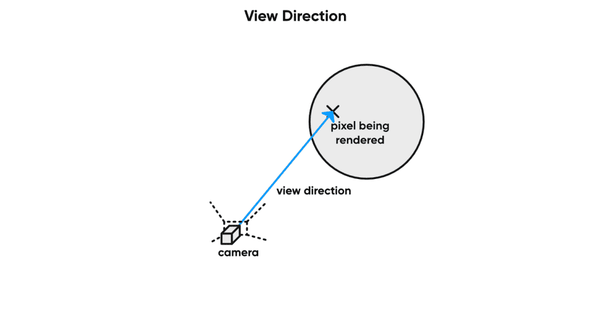
*Look at meeeee!*
*看着我！*

### Normal Vector 法线向量节点

`Normal Vector` 节点用于获取垂直于模型表面并指向外部的法线向量。

**核心特性：**

1. **空间转换支持**

- 与 `View Direction` 节点类似，可通过下拉菜单选择不同的坐标空间输出：
  - **Tangent Space**（切线空间，默认用于法线贴图）
  - **Object Space**（物体本地空间）
  - **World Space**（世界空间）
  - **View Space**（观察空间）

1. **数据输出**

- 仅输出单个 `Vector 3` 向量，表示当前着色阶段（顶点/片段）的法线方向

**技术细节：**

- 在片段着色器中，法线会经过插值处理，需通过 `Normalize` 节点重新归一化
- 当使用法线贴图时，通常需要配合 `Transform` 节点进行切线空间 → 目标空间的转换

**典型应用场景：**

- 光照计算（如兰伯特/Phong 着色）
- 基于法线的边缘检测
- 表面特效（如积雪/腐蚀效果）

（注：在 HDRP 中可能需要通过 `Normalize` 节点手动处理插值后的法线）

### Tangent Vector 切线向量节点

`Tangent Vector` 节点用于获取模型表面切线空间的基准向量，其特性如下：

**核心定义**：

- 该向量始终位于模型表面平面内
- 与 `Normal Vector`（法线向量）保持垂直关系
- 通常与 `Bitangent Vector`（副切线向量）共同构成切线空间坐标系

**空间坐标系选项**（通过下拉菜单切换）：

1. **Tangent Space**（切线空间）
   - 返回模型自带的原始切线方向
   - 这是默认且最常用的选项
2. **World Space**（世界空间）
   - 输出经世界矩阵变换后的切线方向
   - 适用于需要与世界空间光照交互的情况
3. **Object Space**（物体本地空间）
   - 基于模型自身坐标系
   - 用于物体局部空间计算
4. **View Space**（观察空间）
   - 相对于相机视角的切线方向
   - 常用于屏幕空间特效

**技术说明**：

- 切线方向通常由建模软件定义（如 Maya/Blender 中设置的 UV 方向）
- 在法线贴图计算中，切线向量用于构造 TBN 矩阵
- 片段着色器中使用时会自动插值，建议重新归一化

**典型应用**：

- 法线贴图坐标转换（TBN 矩阵构建）
- 各向异性高光计算（如头发/金属表面）
- 程序化纹理流动方向控制

（注：在导入模型时需确保勾选 "Import Tangents" 选项才能正确获取切线数据）

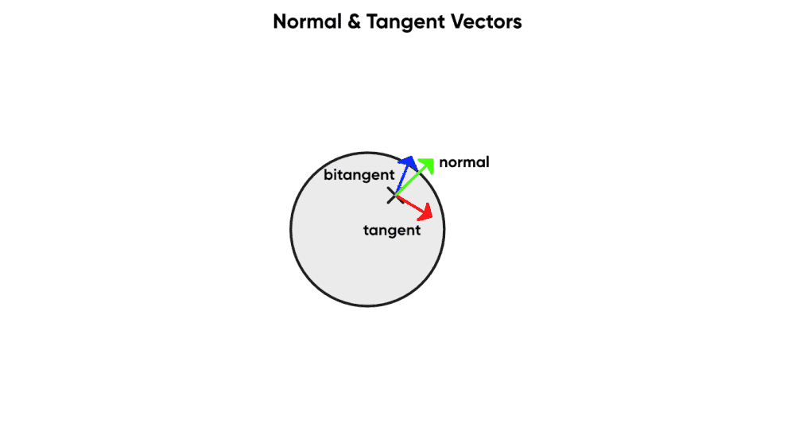
*The normal, tangent and bitangent vectors form a basis for tangent space.*
*法向量、切向量和双向向量构成了切向量的基础。*

### Bitangent Vector 副切线向量节点

`Bitangent Vector` 节点用于获取模型表面的副切线向量（又称副法线向量），其特性如下：

**数学定义**：

- 该向量与 `Tangent Vector`（切线向量）和 `Normal Vector`（法线向量）共同构成切线空间正交基
- 满足右手坐标系规则：`Bitangent = cross(Normal, Tangent)`
- 在标准 TBN 矩阵中通常对应 "B" 分量

**空间坐标系选项**（通过下拉菜单切换）：

1. **Tangent Space**（切线空间）
   - 返回模型自带的原始副切线方向
   - 默认与 UV 的 V 方向对齐
2. **World Space**（世界空间）
   - 输出经世界矩阵变换后的副切线方向
   - 适用于物理正确的各向异性光照
3. **Object Space**（物体本地空间）
   - 基于模型自身坐标系
   - 用于局部变形效果
4. **View Space**（观察空间）
   - 相对于相机视角的副切线方向
   - 用于屏幕空间特效

**技术说明**：

- 可通过节点运算验证：`Cross(Normal, Tangent) == Bitangent`
- 在法线贴图着色中，副切线方向决定纹理 Y 轴的影响强度
- Unity 会自动计算该向量，无需手动建模（除非使用自定义 TBN）

**典型应用**：

- 精确的法线贴图解码（构造完整 TBN 矩阵）
- 布料/毛发等各向异性材质
- 切线空间动态变形效果

（注：在 OpenGL/DirectX 不同平台下，副切线方向可能需要通过 `Sign` 节点校正）

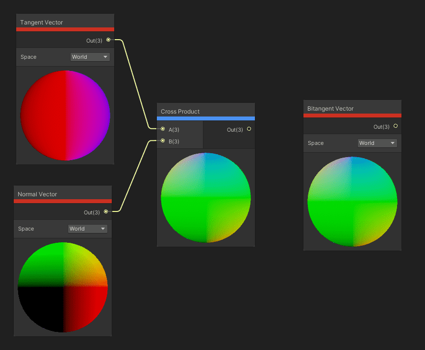
*We can take the cross between the Tangent and Normal to get the Bitangent (the order is important).*
*我们可以取切线和法线之间的交叉来得到双切线（阶数很重要)。*

## Gradient Nodes 渐变节点系列

“渐变”选项卡下有三个节点，我相信您可以猜到它们涉及创建和读取颜色渐变！

### Gradient 渐变节点

`Gradient`（渐变）节点允许我们在着色器中自定义渐变。通过单击节点上的矩形区域，可以打开与Unity编辑器其他部分一致的 **渐变编辑器窗口**。我们可以修改顶部的控制手柄以调整透明度（Alpha），底部的手柄则用于调整颜色。该节点唯一的输出就是定义好的渐变本身。

###  Sample Gradient 采样渐变节点

接下来是 **`Sample Gradient`**（采样渐变）节点，它是目前唯一一个以 **渐变（Gradient）** 作为输入的节点。它还有一个名为 **Time** 的输入参数，这是一个介于 0 到 1 之间的浮点数，用于确定在渐变中采样的位置。节点的输出是该位置对应的颜色值。

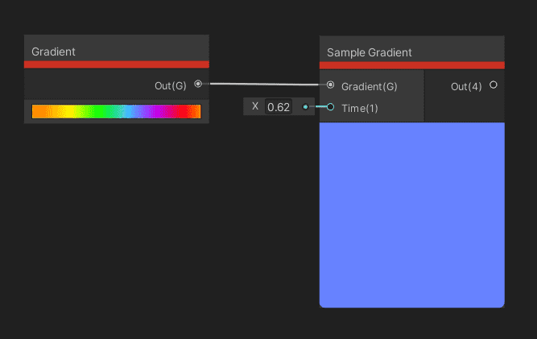
*These are the only nodes that utilise gradients. We can pass the output color to other nodes, though.*
*这些是唯一利用渐变的节点。不过，我们可以将输出颜色传递给其他节点。*

### Blackbody 黑体节点

`Blackbody`（黑体）节点非常有趣——它以开尔文温度（Kelvin）作为输入，并输出该温度下黑体的颜色。不知道什么是黑体？那你可能不是物理学家。黑体是一种理想化的完全不透明且无反射的物体，其热辐射仅由温度决定。随着温度逐渐升高，黑体会经历从黑色→红色→橙色→黄色→白色的颜色变化过程。

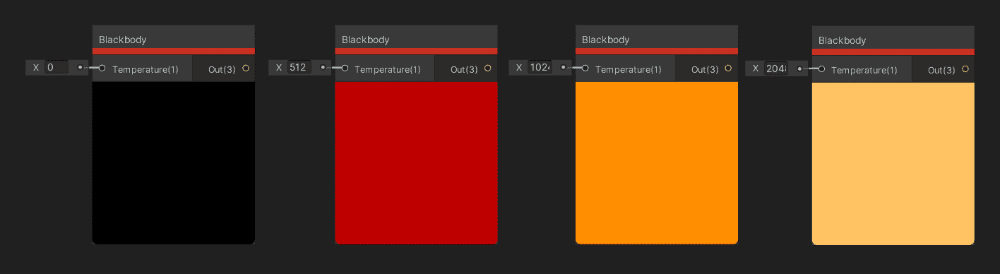
*The color moves from black to red to white as the temperature increases.*
*随着温度的升高，颜色从黑色变为红色再到白色。*

## PBR Nodes 基于物理渲染节点系列

两个 PBR 节点涉及用于基于物理的渲染的反射高亮。

### Dielectric Specular 绝缘体高光节点

对应 `高光反射/粗糙度工作流（Specular/Glossiness Workflow）`即高光（Specular）、粗糙度（Glossiness）、基础色（Diffuse）三要素组成。

1. **物理本质**

- 专为 **非金属材质**（电介质/绝缘体）设计
- 通过折射率(IOR)计算材质的基础高光强度
- 输出值范围：0-0.08（符合现实世界非金属反射率）

2. **材质预设选项**

- **常见材质**（Common Materials）：
  - 提供 0-8%的滑动条控制
  - 适用于：布料(3-5%)/塑料(4-6%)/木材(2-4%)等
- **特定物质**：
  - 生锈金属(8%) | 水(2%) | 冰(1.3098 IOR) | 玻璃(1.5 IOR)
- **自定义**（Custom）：
  - 手动输入折射率（需查阅物理资料）
  - 示例：钻石 = 2.417 | 橡胶 = 1.52

3. **技术说明**

- 计算遵循 Fresnel-Schlick 近似公式
- 与金属度工作流(Metallic Workflow)自动兼容
- 实际渲染效果受环境光遮蔽(AO)影响

4. **使用建议**

- 制作写实材质时优先使用物理准确参数
- 艺术化风格可适当突破物理限制
- 折射率参考网站：refractiveindex.info

（注：该节点在 URP/HDRP 中的实现存在精度差异）

### Metal Reflectance 金属反射率节点

对应`金属度/粗糙度工作流（Metallic/Roughness Workflow）`，即金属度（Metallic）、粗糙度（Roughness）、基础色（Base Color）三要素组成。

1. **核心特性**

- 专为 **金属材质** 设计，输出带颜色的高光反射值
- 与 `Dielectric Specular` 形成材质系统闭环
- 反射颜色源自金属表面的电子云共振效应

2. **预设金属库**

- 工业金属：
  - 铁(Fe) #5B5B5B | 铝(Al) #A6A6A6
  - 铬(Cr) #8A8A8A | 镍(Ni) #9D9D9D
- 贵金属：
  - 银(Ag) #E6E6E6 | 金(Au) #FFC862
  - 铜(Cu) #C47C4D | 铂(Pt) #C7C7C7
- 特种金属：
  - 钛(Ti) #B4B4B4 | 钴(Co) #8C8C8C

3. **物理原理**

- 遵循导体菲涅尔反射特性
- 颜色由复折射率的虚部决定
- 能量守恒：反射亮度自动匹配金属电导率

4. **使用规范**

- 必须配合 PBR 工作流中的 Metallic 参数（设为 1.0）
- 美术控制建议：
  - 贵金属可适当增强饱和度
  - 氧化金属需配合 Roughness 调整
- 不支持自定义参数（需通过 Color 参数手动模拟）

（注：HDRP 中金属反射会参与光线追踪计算）

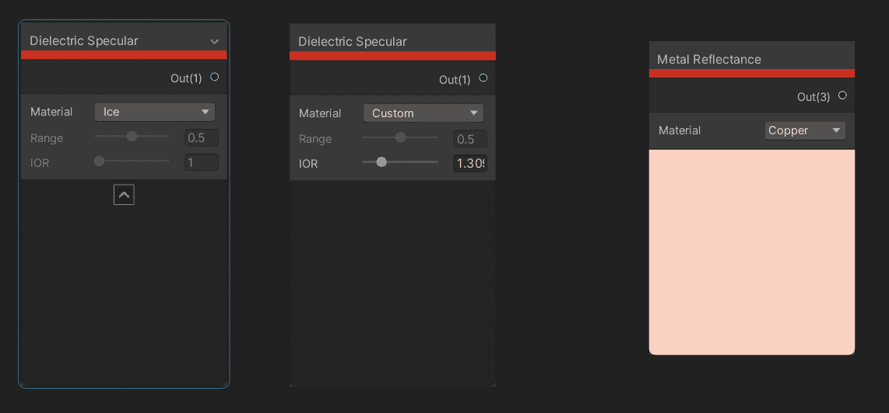
*We can use these presets to set specular values for common objects.*
*我们可以使用这些预设来设置常见对象的镜面反射值。*

## High Definition Render Pipeline Nodes 高清渲染管线节点系列

以下三个节点位于 “HDRP高清渲染管线” 组中，但它们包含在基本 Shader Graph 包中，因此我仍将在此处提及它们。

### Diffusion Profile  扩散配置节点

与高清渲染管线（High Definition Render Pipeline）组下的所有节点一样，`Diffusion Profile` 节点当然无法在通用渲染管线（Universal Render Pipeline）中使用。该节点用于采样**扩散配置文件（Diffusion Profile）**资源——这类资源是HDRP专属的，包含与次表面散射相关的参数设置。其输出为一个浮点数值，即用于选择正确扩散配置文件的**标识符（ID）**。该ID会作用于HDRP中对应的块节点（比如有大约上百万个额外块节点的HDRP自带功能模块，这部分内容我未展开说明）。

### Exposure 曝光节点

`Exposure` 节点是 HDRP 专属节点，可用于获取相机在当前帧或上一帧的曝光级别。该节点唯一的输出是一个表示该曝光级别的 **Vector3**。通过 **Type** 下拉菜单可选择四种曝光类型：标注为 **Current** 的两种类型获取当前帧的曝光值，而 **Previous** 类型则获取上一帧的曝光值；标注为 **Inverse** 的两种类型返回给定帧曝光值的倒数。

### HD Scene Color 高清场景颜色

`HD Scene Color` 是 HDRP 专属版本的常规 `Scene Color` 节点。与普通 `Scene Color` 不同，`HD Scene Color` 新增了一个 **LOD** 输入，允许我们选择访问颜色缓冲时使用的 mipmap 层级——该节点始终采用三线性过滤来平滑 mipmap 过渡。此外，节点还提供一个 **Exposure** 复选框用于控制是否应用曝光（默认禁用以避免双重曝光）。该节点唯一的输出即为采样得到的颜色。

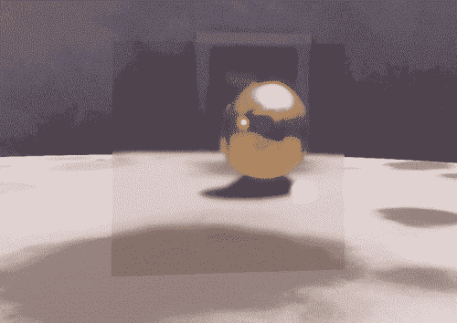
*We can change the LOD level of the HD Scene Color node to create blurry windows.*
*我们可以更改 HD Scene Color 节点的 LOD 级别以创建模糊窗口。*

## Mesh Deformation Nodes 采用DOTS混合渲染节点系列

接下来的两个节点与 DOTS 混合渲染器（DOTS Hybrid Renderer）一起使用。

### Compute Deformation 计算变形节点

`Compute Deformation` 节点专用于 DOTS 混合渲染器，可用于将变形后的顶点数据发送至此着色器。要使该功能正常工作，你需要对 DOTS 有一定了解——而我显然没有。三个输出分别为变形后的**顶点位置（Vertex Position）**、**法线（Normal）**和**切线（Tangent）**，这些数据通常会输出到顶点阶段的三个引脚。

### Linear Blend Skinning 线性混合蒙皮节点

`Linear Blend Skinning` 节点同样专属于 DOTS 混合渲染器。我们可以将这三个输入分别用于**位置（Position）**、**法线（Normal）**和**切线（Tangent）**向量，该节点会对每个向量应用顶点蒙皮处理，并将处理后的结果作为三个输出向量返回。

# Channel Nodes 通道节点系列

通道节点系列是关于打乱重组向量的每个分量的顺序和值。

## Split 分解节点

`Split`（分解）节点接收一个 **四维向量（Vector 4）** 作为输入，并将其四个通道（R、G、B、A）分别输出为独立的浮点数（Float）。若输入向量的分量少于四个（如二维或三维向量），则**多余的输出通道**会被填充为0。

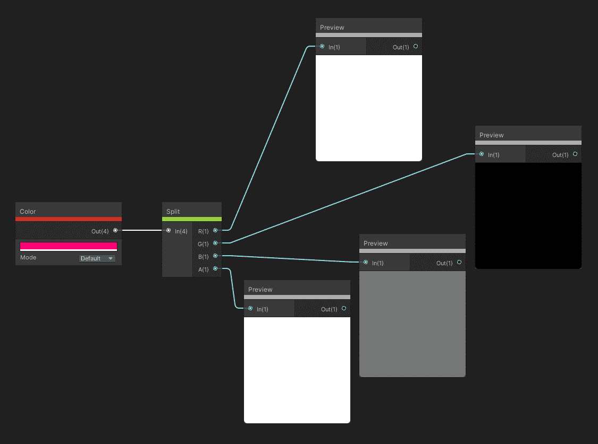
*We can separate out each channel of a color using Split.*
*我们可以使用拆分分离出颜色的每个通道。*

## Swizzle 重组节点

**重组（Swizzling）** 是指重新排列向量的分量顺序。`Swizzle` 节点接收最多包含四个分量的向量作为输入，并通过节点上的四个选项控制输出顺序。该节点的输出始终为 **四维向量（Vector 4）**，每个选项允许我们选择一个输入通道作为对应输出。例如，将“Green Out”下拉菜单设为 Blue，则第二个输出分量会取用第三个输入分量（即原 Z 轴值）。

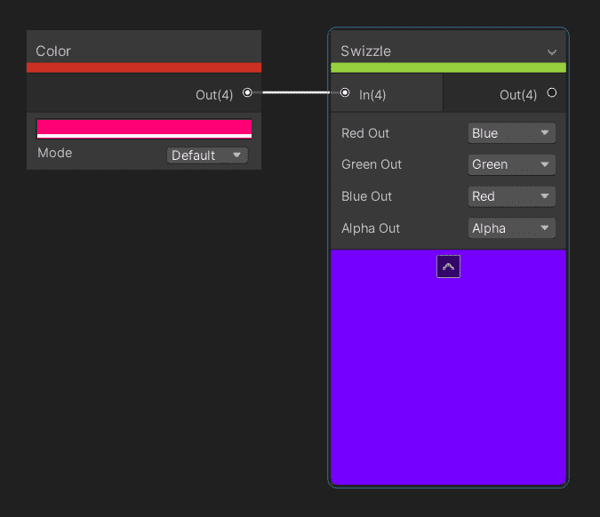
*With Swizzle, we can shuffle the order of, remove, or duplicate components of a vector.*
*使用 Swizzle（中译为鸡尾酒)，我们可以打乱向量的顺序、删除或复制向量的分量。*

## Flip 向量分量取反节点

`Flip` 节点详解（向量分量取反控制）

1. **核心功能**

- 支持 1D 到 4D 向量分量级取反操作
- 每个分量独立控制（通过复选框切换）
- 数学运算：Output = Input × (-1)^[ToggleState]

1. **参数配置**

- 输入端口：
  - 支持 `Float`/`Vector2`/`Vector3`/`Vector4`
- 控制界面：
  - 每个维度显示独立复选框
  - 标签显示为 X/Y/Z/W 对应坐标轴

1. **技术特性**

- 运行时零性能开销（编译为静态指令）
- 保持向量维度不变（输入/输出同维度）
- 分量级操作示例：
  - 输入(3,-2,1) + 勾选 Y → 输出(3,2,1)
  - 输入(0.5,4) + 勾选 XY → 输出(-0.5,-4)

1. **典型应用场景**

- 法线方向修正（反转 Y/Z 应对不同坐标系）
- 纹理坐标镜像（创建对称 UV 映射）
- 物理模拟反方向力（如反弹效果）
- 多通道数据编码/解码

（注：与 `Negate` 节点的区别在于可选择部分分量操作）

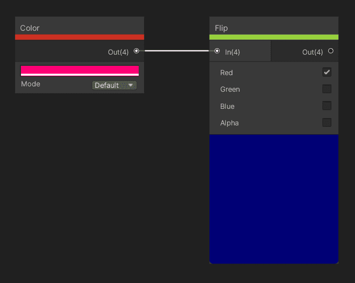
*Remember that values below 0 are preserved, so the red channel here outputs -1.*
*请记住，将保留低于 0 的值，因此此处的红色通道输出 -1。*

## Combine 组合节点

`Combine`（组合）节点允许我们将最多四个值分别输入到 **R**、**G**、**B** 和 **A** 输入端口，随后该节点会将这些独立的值组合成向量。该节点提供三种输出，分别对应四分量（Vector4）、三分量（Vector3）和双分量（Vector2）向量，具体取决于您希望生成的向量维度。

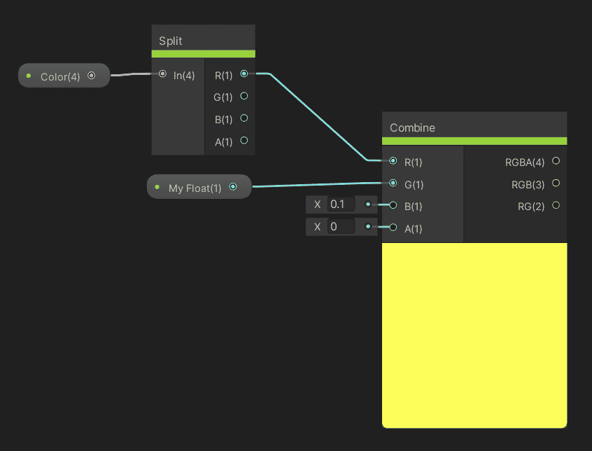
*We can build colors or other vectors by joining together components from other nodes.*
*我们可以通过将来自其他节点的组件连接在一起来构建颜色或其他向量。*

# UV Nodes 纹理坐标变换节点系列

对纹理采样的纹理坐标进行各种转换。

## Tiling And Offset 平铺和偏移节点

`Tiling And Offset`（平铺与偏移）是我在ShaderGraph中高频使用的节点之一。其功能是通过调整UV坐标的平铺次数和滑动偏移，实现纹理的重复铺设或动态滚动效果。

- **输入参数**：
  - **Tiling（平铺）**：`Vector2` 类型，控制纹理在X/Y轴方向的重复次数（如 `(2,3)` 表示横向平铺2次，纵向平铺3次）。
  - **Offset（偏移）**：`Vector2` 类型，控制纹理滑动的方向和距离（如 `(0.5, 0)` 表示向右滑动半个纹理宽度）。
  - **UVs**：原始UV坐标输入，用于接收需要处理的UV数据。
- **输出**：
  经过平铺和偏移计算后的新UV坐标，可直接用于采样纹理或其他需要UV输入的节点。

> **注释**：
>
> - 应用场景：
>   - 2D游戏中的精灵动画（通过偏移实现滚动背景）。
>   - 地形或墙面纹理的重复铺设（避免单张贴图拉伸变形）。
>   - 动态材质效果（如流水、火焰的循环纹理）。
> - 参数调整技巧：
>   - 若需无缝平铺，确保纹理边缘像素匹配（无缝贴图）。
>   - 偏移值超过 `1` 或低于 `0` 时会循环纹理（类似UV坐标的周期性）。
> - **性能提示**：高频修改偏移值可能增加渲染开销，建议通过Shader参数控制动态变化。

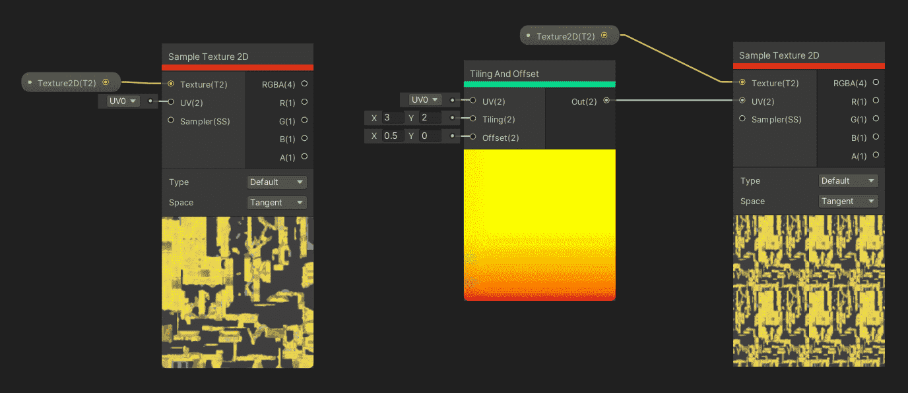
*Tiling And Offset is great for animating texture by scrolling over time.*
*平铺和偏移非常适合通过随时间滚动来制作纹理动画。*

## Rotate 旋转节点

The `Rotate` node takes in a **UV** as input and will rotate around the **Centre** point, which is another input `Vector 2`, by the rotation amount, which is a float input. This node also has a **Unit** dropdown, which determines whether the rotation is applied in radians or degrees. The single output is a new set of **UV** coordinates after the rotation has been applied.

旋转节点接收 **UV** 作为输入，并将围绕 **中心** 点（另一个输入 Vector2）旋转，旋转量为浮点输入。此节点还具有“**单位”** 下拉列表，用于确定是以弧度还是度为单位应用旋转。单个输出是应用旋转后的一组新的 **UV** 坐标。

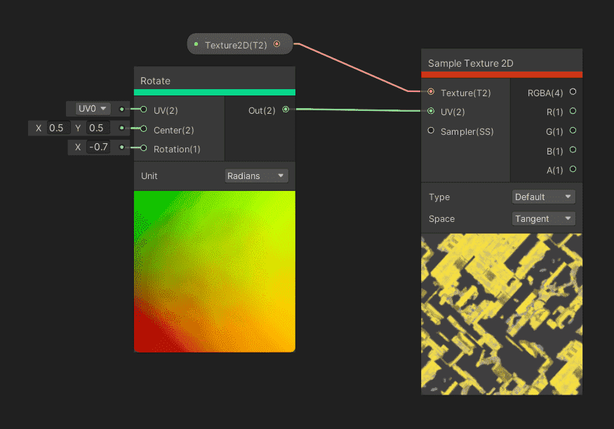
*You spin me right round baby, right round.*
*你把我转过来，宝贝，右转。*

## Spherize 球面化（鱼眼镜头）节点

`Spherize`（球形化）节点会将UV坐标扭曲，模拟其附着在球体表面的效果（类似鱼眼镜头的畸变）。

- **UV 输入**：提供变换前的基础UV坐标。
- **Centre（中心点）**：定义球形化效果的原点（类似 `Twirl` 节点的中心点）。
- **Strength（强度）**：控制球形化效果的强弱，值越大，UV偏移越明显。
- **Offset（偏移）**：在应用球形化前，滚动UV坐标（可用于动态效果或动画）。

节点的唯一输出是经过球形化处理后的新UV坐标。

> **注释**：
>
> - **应用场景**：模拟球形物体贴图（如地平仪、星球表面）、镜头畸变特效（如水下视角）或动态UV滚动（如雷达扫描效果）。
> - **与 `Twirl` 的区别**：`Twirl` 是旋转式扭曲，而 `Spherize` 是基于球面的径向位移。
> - 参数调整技巧：
>   - 负值的 **Strength** 可实现反向扭曲（凹陷效果）。
>   - 结合 **Offset** 可创建循环动画（如UV坐标周期性偏移+球形化）。

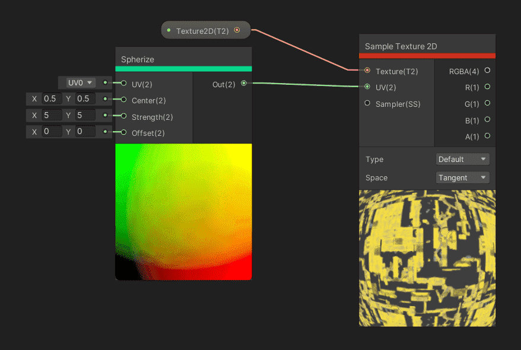
*The Spherize node is great for imitating a fisheye lens.*
*Spherize 节点非常适合模仿鱼眼镜头。*

## Twirl 外边缘螺旋节点

The `Twirl` node has the same four inputs as `Spherize`, except now the transformation is that the **UV** s spiral from the outer edge. The single output is the new set of **UV** s after the twirling.

转动节点具有与 Spherize 相同的四个输入，只不过现在的变换是 **UV** s 从外边缘螺旋。单输出是旋转后的新一组 **UV**。

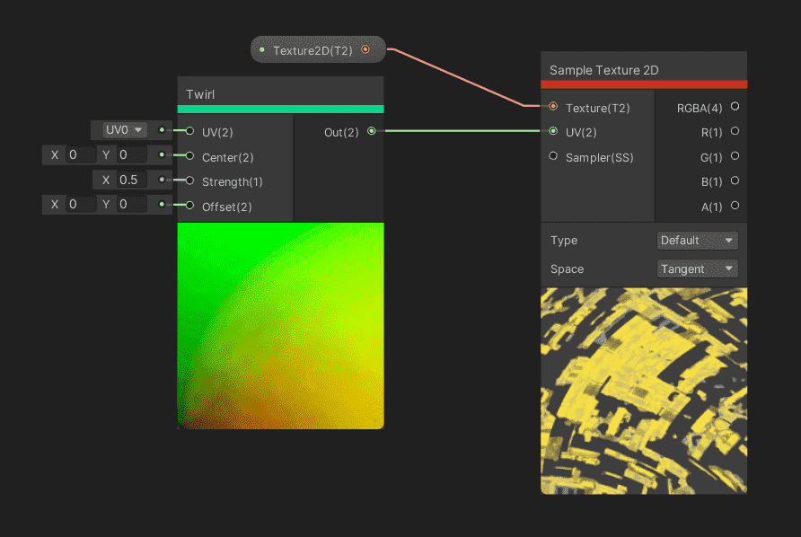
*Twirl is somewhere between Rotate and Spherize.*
*Twirl 介于 Rotate 和 Spherize 之间。*

## Radial Shear 径向剪切节点

`Radial Shear`（径向剪切）节点与 `Twirl`（旋转扭曲）和 `Spherize`（球形化）节点一样接收相同的四个输入端口，但此时的变换效果是以任意中心点为基础的波浪效果。输出的是应用变换后的一组新 **UV** 坐标。

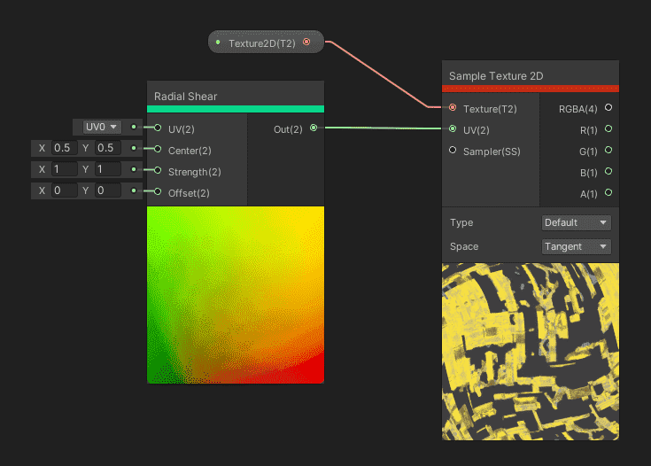
*This is like Twirl, but we have control over both axes.*
*这就像漩涡一样，但我们可以控制两个轴。*

## Triplanar 三平面节点

`Triplanar`（三平面）节点的解释稍显复杂。其核心原理是：沿世界坐标系的X、Y、Z轴分别对纹理进行三次采样，最终得到三组从不同方向应用效果都较为理想的映射结果。为此，我们需要输入一个**纹理（Texture）**和一个**纹理采样器（Sampler）**。随后，系统会根据模型表面的法线向量，将其中一组映射以平面投影（Planar Projection）的方式贴合到网格上，并选择形变最小的一组映射，同时通过**混合参数（Blend）**进行平滑过渡。该参数值越高，映射边缘越锐利。

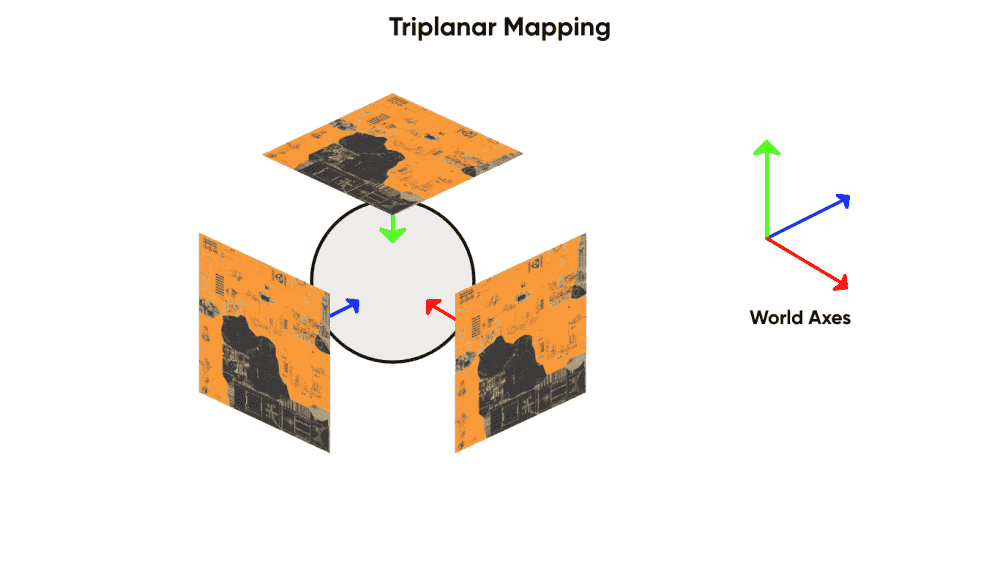
*Here’s the three axes used to apply the texture.*
*下面是用于应用纹理的三个轴。*

此外，我们还需输入 **位置（Position）** 和 **法线（Normal）** 向量，以及一个 **混合（Blend）** 参数，该参数控制边缘处三组采样之间的平滑过渡程度。该值越高，映射边缘越锐利。最后，我们通过 **平铺（Tile）** 浮点参数在映射应用到网格前对UV进行平铺控制。通过节点中间的**类型（Type）**设置（可选择**默认（Default）**或**法线（Normal）**），可指定Unity采样的纹理类型（如普通纹理或法线贴图）。

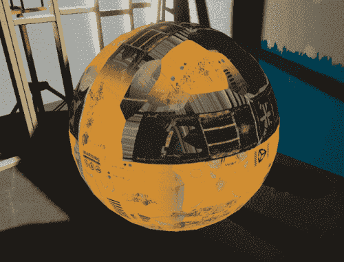
*Triplanar will map the same texture in three directions onto an object.*
*Triplanar 会在三个方向上将相同的纹理映射到一个对象上。*

## Polar Coordinates 极坐标节点

`Polar Coordinates`（极坐标）节点用于将一组 **UV** 坐标从 **笛卡尔坐标系**（即最常见的坐标系）转换为 **极坐标系**（每个点通过距离和角度相对于某个中心点来描述）。该节点的输入包括 **UV** 坐标和 **中心点（Centre）**，并通过 **径向缩放（Radial Scale）** 和 **长度缩放（Length Scale）** 两个浮点参数分别控制角度和长度的缩放比例。输出是一组新的极坐标系下的 **UV** 坐标。

某些类型的全景图像可以通过极坐标解码，这意味着我们可以将其用于天空盒或反射贴图。

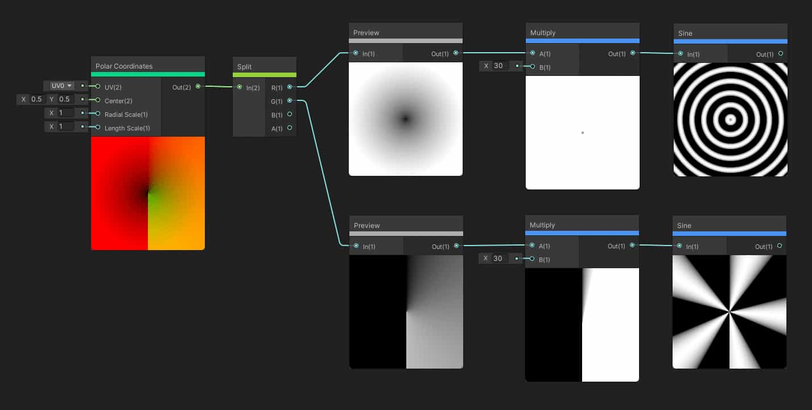
*We can use polar coordinates for several cool patterns, like these two.*
*我们可以将极坐标用于几种很酷的模式，比如这两个。*

## Flipbook 翻页节点

`Flipbook`（翻页动画）节点对于制作翻页动画（尤其是精灵图动画）非常有用。其 **UV** 输入与其他节点的UV输入一致，同时可通过 **Width** 和 **Height** 两个浮点参数指定纹理在X/Y方向的翻页贴图块数量（即平铺数）。**Tile** 输入用于选择要采样的贴图块索引，Unity会根据该值计算新的UV坐标，仅截取对应区域的纹理作为输出。

UV坐标的遍历方向（即贴图块的选取顺序）由 **Invert X** 和 **Invert Y** 选项控制。默认情况下，**Invert Y** 处于勾选状态，贴图块从左上角开始横向排列，随后纵向延伸。通常，需将输出的UV连接到 `Sample Texture 2D` 节点以实际采样目标纹理。

**注释**：

- **翻页动画（Flipbook Animation）**：一种通过逐帧切换纹理区域模拟动画效果的技术，常见于2D游戏精灵动画或UI动效。
- **贴图块（Tile）**：将完整纹理分割为N×M个小块（Tile），每个Tile对应动画的一帧。
- **应用场景**：逐帧播放的爆炸特效、角色表情切换、低多边形（Low-Poly）模型的动态贴图等。
- **注意点**：若动画播放方向异常，可尝试调整 **Invert X/Y** 的勾选状态以反转UV采样顺序。

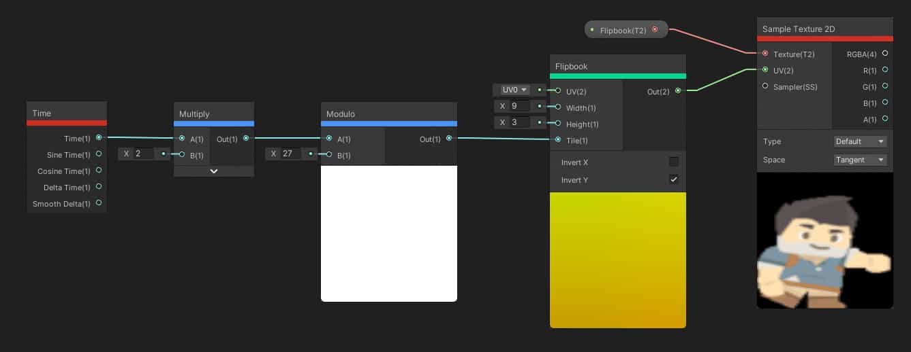
*This node tree will cycle through the whole sprite sheet for this character sprite.*
*此节点树将循环遍历此角色精灵的整个精灵表。*

## Parallax Mapping 视差映射节点

`Parallax Mapping`（视差映射）节点通过位移 **UV** 坐标来伪造材质表面的深度效果。其输入包括：

- **Heightmap**（高度图）：一张灰度纹理，定义表面各区域的凹凸高度（白色=高，黑色=低）。
- **Sampler State**（采样器状态）：控制纹理采样的过滤方式（如线性过滤、各向异性过滤）。
- **Amplitude**（振幅）：以厘米为单位的浮点参数，用于缩放高度图的凹凸强度。
- **UV**：用于采样高度图的原始UV坐标。

节点输出的 **Parallax UVs** 是经过视差位移修正后的UV坐标，可直接用于采样其他纹理（如基础色或法线贴图），从而实现表面深度的视觉增强效果。

**注释**：

- **视差映射原理**：通过偏移UV坐标模拟光线在凹凸表面的视差位移，无需额外几何体即可近似深度效果。
- **适用场景**：岩石、墙壁等需要表面细节增强的材质，尤其适合低多边形（Low-Poly）模型。
- **与法线贴图的区别**：视差映射更依赖视角变化，适合静态或低速运动的表面；法线贴图（Normal Mapping）则直接扰动光照计算，效果更通用。

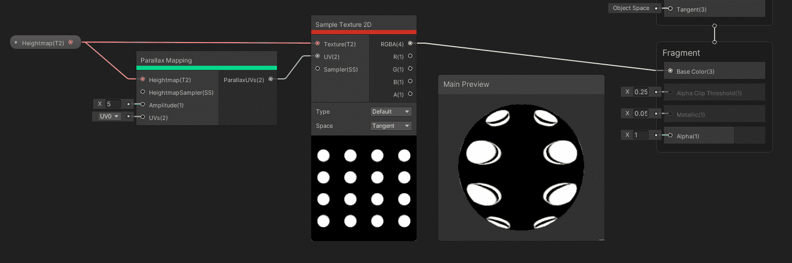
*Using the same texture for the base and the heightmap, you can see how the offset is applied.*
*对底座和高度贴图使用相同的纹理，您可以看到偏移是如何应用的。*

## Parallax Occlusion Mapping 视差遮挡映射节点

`Parallax Occlusion Mapping`（视差遮挡映射）节点的工作原理与 `Parallax Mapping`（视差映射）类似，但前者会考虑遮挡关系——高度图（Heightmap）中较高的区域会遮挡较低区域的光照。相较于基础版视差映射，新增了以下参数：

- **Steps**（步数）：控制内部算法检测遮挡时的迭代次数，数值越高结果越精确，但运行时开销也越大。
- **LOD**（细节等级）：用于在不同mipmap层级采样高度图，平衡精度与性能。
- **LOD Threshold**（LOD阈值）：低于此阈值的mipmap层级将禁用视差效果，以优化效率（适合为材质构建LOD系统）。

输出方面，除了与 `Parallax Mapping` 相同的 **Parallax UVs**（修正后的UV坐标），还新增了 **Pixel Depth Offset**（像素深度偏移）输出，可直接用于屏幕空间环境光遮蔽（SSAO）。若需在主着色器堆栈（Master Stack）中使用该值，可能需要额外添加一个节点连接。

**注释**：

- **遮挡检测原理**：通过多次采样高度图模拟光线在凹凸表面的穿透深度，精确计算高/低地形之间的视觉遮挡关系。
- **LOD优化**：通过动态调整mipmap层级减少高精度计算的消耗，尤其适用于远距离物体或移动端项目。
- **Pixel Depth Offset**：常用于增强屏幕空间效果的细节（如SSAO、水面反射），需注意其与屏幕空间算法的结合方式。
- **性能提示**：若目标平台性能有限，建议降低 **Steps** 数值或适当提高 **LOD Threshold**。

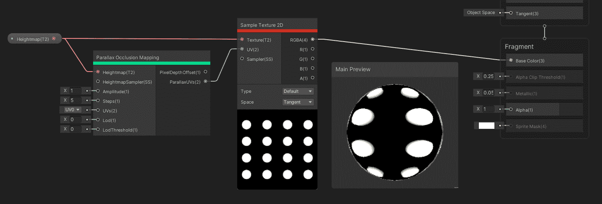
*Using the same texture for the base and the heightmap, you can see how the offset is applied.*
*对底座和高度贴图使用相同的纹理，您可以看到偏移是如何应用的。*

# Math Nodes 系列

数学节点都是关于基本数学运算的，从基本算术到向量代数。

## Basic Nodes 基础系列

### Add 加法

Now we can take a rest with some super simple nodes! I bet you can’t guess what the `Add` node does. It takes two float inputs, and the output is those two added together.

现在我们可以休息一下一些超级简单的节点了！我敢打赌你猜不到节点是做什么的。它需要两个浮点输入，输出是这两个相加。

### Subtract 减法

The `Subtract` node, on the other hand, takes the A input and subtracts the B input.

相减节点，节点接受 A 输入并减去 B 输入。

### Multiply 乘法

The `Multiply` node takes your two inputs and multiplies them together, although this is more in-depth than other basic maths nodes. If both inputs are floats, they are multiplied together, and if they’re both vectors, it’ll multiply them together element-wise, and return a new vector the same size as the smaller input. If both inputs are matrices, the node will truncate them so that they are the same size and perform matrix multiplication between the two, outputting a new matrix the same size as the smaller input. And if a vector and a matrix are input, the node will add elements to the vector until it is large enough, then multiply the two.

该节点接受您的两个输入并将它们相乘，尽管这比其他基本数学节点更深入。如果两个输入都是浮点数，则将它们相乘，如果它们都是向量，则按元素将它们相乘，并返回一个与较小输入大小相同的新向量。如果两个输入都是矩阵，节点将截断它们，使它们大小相同，并在两者之间执行矩阵乘法，输出一个与较小输入大小相同的新矩阵。如果输入向量和矩阵，节点会向向量添加元素，直到它足够大，然后将两者相乘。

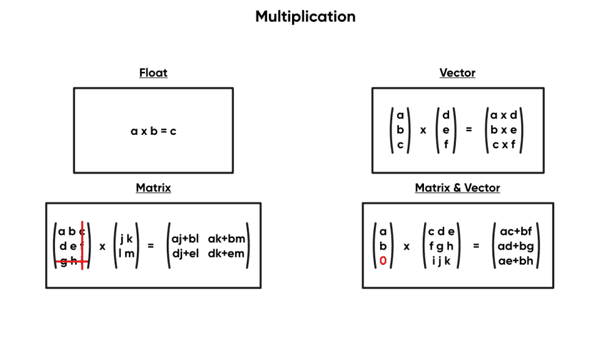
*Multiplying is more complex than expected depending on the inputs!*
*乘法比预期的要复杂，具体取决于输入！*

### Divide 除法

The `Divide` node also takes in two floats and returns the **A** input divided by the **B** input.

该节点还接受两个浮点数，并返回 **A** 输入除以 **B** 输入。

### Power 幂

The `Power` node takes in two floats and returns the first input raised to the power of the second input.

该节点接受两个浮点数，并返回第一个输入提升到第二个输入的幂。

### Square Root 平方根

And finally, the `Square Root` node takes in a single float and returns its square root.

最后，节点接受单个浮点数并返回其平方根。

## Interpolation Nodes 插值系列

Interpolation（插值） 系列节点都是关于在两个值之间平滑以获得新值的。

###  Lerp 线性插值

`Lerp`（线性插值）节点功能极为灵活。"Lerp"是"linear interpolation"的缩写——该节点接收两个输入值 **A** 和 **B**（最多支持四维向量）。若输入的向量维度不同，Unity将自动截断较大向量的多余通道。同时接收的 **T** 输入既可与向量同维度，亦可为单精度浮点数，其值会被限定在[0,1]区间内。

插值过程会在 **A** 和 **B** 之间绘制一条直线，并根据 **T** 值选取线上的点：例如当 **T=0.25** 时，选取 **A** 到 **B** 间25%位置处的值。若 **T** 为多分量向量，则逐分量执行插值；若为单浮点数，则统一应用于 **A** 和 **B** 的所有分量。最终输出即为所选取的插值结果。

###  Inverse Lerp 逆向线性插值

`Inverse Lerp`（逆向线性插值）节点执行与`Lerp`相反的过程。给定输入值 **A**、**B** 和 **T** 时，该节点将计算出：若要通过`Lerp`节点输出 **T** 值，原本需要使用的[0,1]区间内的插值系数是多少。希望这样解释能便于理解！

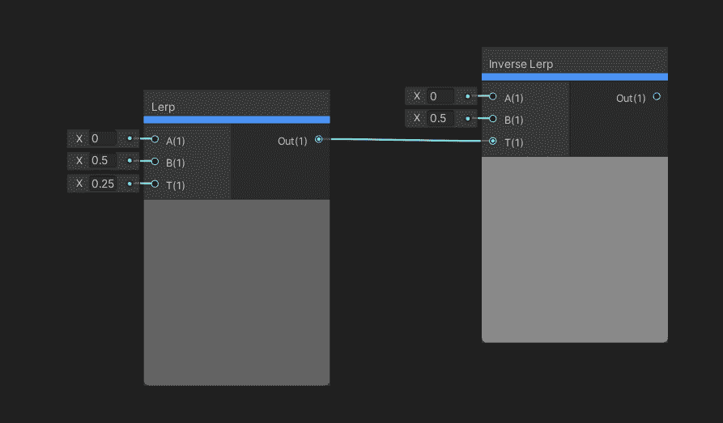
*The Lerp result is 25% between 0 and 0.5. The Inverse Lerp result is 0.25.*
*Inverse Lerp 结果为 0.25。*

### Smoothstep

`Smoothstep` is a special sigmoid function which can be used for creating a smooth but swift gradient when an input value crosses some threshold. The **In** parameter is your input value. The node takes two **Edge** parameters, which determine the lower and higher threshold values for the curve. When **In** is lower than **Edge 1**, the output is 0, and when **In** is above **Edge 2**, the output is 1. Between those thresholds, the output is a smooth curve between 0 and 1.

`Smoothstep` 是一个特殊的 S 形函数，可用于在输入值超过某个阈值时创建平滑但快速的梯度。**In** 参数是输入值。该节点采用两个 **Edge** 参数，用于确定曲线的下限和上限阈值。当 **In** 低于 **Edge 1** 时，输出为 0，当 **In** 高于 **Edge 2** 时，输出为 1。在这些阈值之间，输出是介于 0 和 1 之间的平滑曲线。

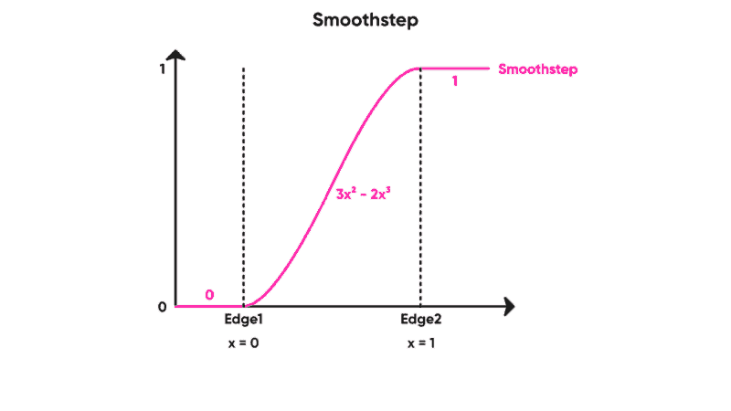
*Smoothstep is great for setting up thresholds with small amounts of blending.*
*Smoothstep 非常适合通过少量混合设置阈值。*

## Range Nodes 范围系列

The Range node family contains several nodes for modifying or working with the range between two values.

“范围”节点族包含多个节点，用于修改或处理两个值之间的范围。

### Clamp 钳制节点

The `Clamp` node takes in an input vector of up to four elements, and will clamp the values element-wise so that they never fall below the **Min** input and are never above the **Max** input. The output is the vector after clamping.

该节点（Clamp 译为夹子）接受最多四个元素的输入向量，并将逐个元素钳位值，以便它们永远不会低于 **最小** 值输入，也不会高于 **最大** 值输入。输出是箝位后的矢量。

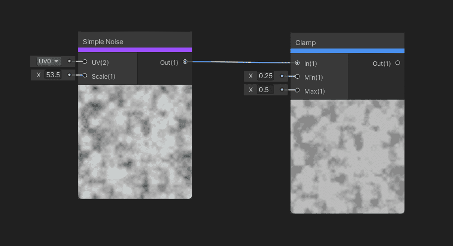
*Clamp is an easy way to remove values too high or too low for your needs.*
*Clamp 是一种简单的方法，可以去除过高或过低的值，以满足您的需求。*

###  Saturate 饱和节点

The `Saturate` node is like a `Clamp` node, except the min and max values are always 0 and 1.

该节点（Saturate 译为饱和，浸透）类似于 Clamp 节点，只是最小值和最大值始终为 0 和 1。

### Minimum 最小节点

The `Minimum` node takes in two vector inputs and outputs a vector of the same size where each element takes the lowest value from the corresponding elements on the two inputs. If you input two floats, it just takes the lower one.

该节点接受两个向量输入并输出一个相同大小的向量，其中每个元素从两个输入上的相应元素中获取最低值。如果您输入两个浮点数，则只取较低的浮点数。

### Maximum 最大节点

And the `Maximum` node does a similar thing, except it returns the higher number for each component of the input vectors.

节点也做类似的事情，只不过它为输入向量的每个分量返回较大的数字。

###  One Minus 一减节点

The `One Minus` node takes each component of the input vector and returns one, minus that value. Shocking, I know.

该节点获取输入向量的每个分量并返回一个减去该值。令人震惊，我知道。

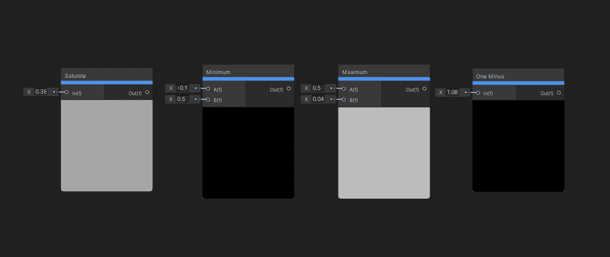
*It’s difficult to make these nodes look interesting in screenshots!*
*很难让这些节点在屏幕截图中看起来很有趣！*

### Remap 重映射节点

**`Remap`（重映射）节点**是一种特殊类型的插值运算。该节点接收一个最多四维的输入向量，以及两个`Vector 2`类型参数：

- **In Min Max**（输入范围）：定义输入值的最小/最大边界
- **Out Min Max**（输出范围）：定义输出值的最小/最大边界

其运算原理可分解为两个阶段：

1. 首先基于输入值和**In Min Max**执行`Inverse Lerp`（逆向线性插值），计算出[0,1]区间的插值系数
2. 随后用该系数在**Out Min Max**范围之间执行`Lerp`（线性插值）

最终输出重映射后的结果值。

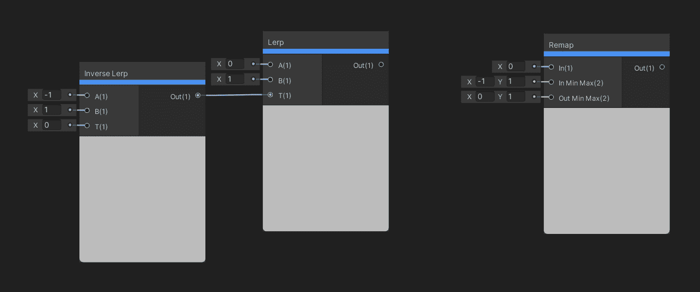
*The In input to the Remap is the same as the T input to the Inverse Lerp on this pair of nodes.*
*Remap 的 In 输入与此对节点上 Inverse Lerp 的 T 输入相同。*

### Random Range 有范围的随机

该节点可用于在 **Min** 和 **Max** 输入浮点数之间生成伪随机数。我们指定一个用作输入种子值，然后输出一个浮点数。此节点非常适合生成随机噪声，但由于我们指定了种子，因此您可以使用对象空间中片段的位置，以便输出值在帧之间保持一致。或者，您可以使用时间作为输入来随机化帧之间的值。

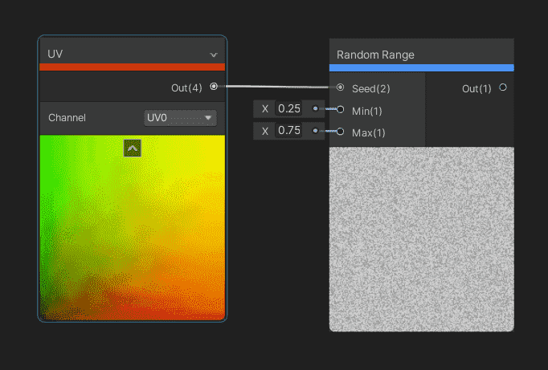
*The Random Range node gives random values depending on an input seed.*
*“随机范围”节点根据输入种子提供随机值。*

### Fraction  取无符号小数部分

The `Fraction` node takes an input vector, and for each component, returns a new vector where each value takes the portion after the decimal point. The output, therefore, is always between 0 and 1.

节点采用一个输入向量，对于每个组件，返回一个新向量，其中每个值取小数点后的部分。因此，输出始终介于 0 和 1 之间。

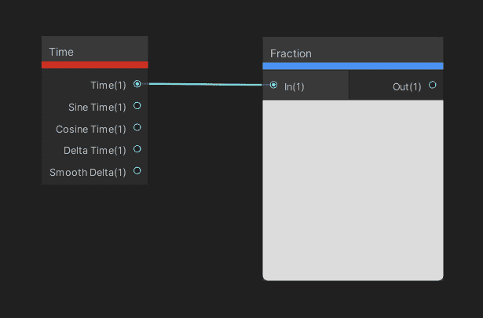
*This pair of nodes will rise from 0 to 1 then blink right back to 0 continually.*
*这对节点将从 0 上升到 1，然后不断闪烁回 0。*

## Round Nodes 舍入系列

`Round`（舍入）节点系列的核心功能是将数值对齐到指定基准值。

### Floor 向下取整节点

（地板节点）将向量作为输入，对于每个分量，返回小于或等于该值的最大整数。

###  Ceiling 向上取整节点

（天花板节点）与此类似，只是它采用大于或等于输入的下一个整数。

### Round 四舍五入取整节点

节点也是相似的，只是它向上或向下舍入到最接近的整数。

### Sign 符号节点

`Sign`（符号）节点接收一个向量输入，并对每个分量执行以下操作：

- 若分量值 **大于零**，则返回 `1`
- 若分量值 **等于零**，则返回 `0`
- 若分量值 **小于零**，则返回 `-1`

### Step 阶跃节点

`Step`（阶跃）节点是一个极其实用的功能节点，其工作逻辑如下：

1. 输入参数：
   - **In**（输入值）：待比较的标量或向量
   - **Edge**（阈值）：比较基准值
2. 输出规则：
   - 当 **In** < **Edge** 时，输出 `0`
   - 当 **In** ≥ **Edge** 时，输出 `1`
3. 向量处理：
   - 若输入为向量，则逐分量（per-element）执行上述比较

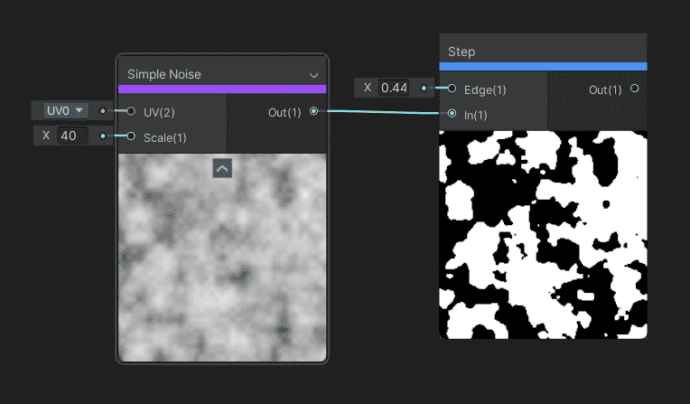
*Use Step as a threshold on a color or other value.*
*使用阶跃节点作为颜色或其他值的阈值。*

### Truncate 向零取整

该节点（截断）采用输入浮点数并删除小数部分。

## Wave Nodes 波形系列

The Wave node family is a very handy group of nodes used for generating different kinds of waves, which are great for creating different patterns for materials.

波形节点系列是一组非常方便的节点，用于生成不同种类的波，非常适合为材料创建不同的图案。

###  Noise Sine Wave 噪声正弦波节点

`Noise Sine Wave`（噪声正弦波）节点工作原理：

1. 核心运算：

   - 计算输入值的标准正弦函数（sin(x)）
   - 叠加伪随机噪声扰动，噪声幅度由`Vector 2`类型的 **Min Max** 参数定义随机范围

2. 特性说明

   ```
   输出 = sin(x) + noise \quad (noise ∈ [Min, Max])
   ```

   - 噪声为每帧/每采样点独立生成的伪随机值
   - 最终输出仍保持正弦波形，仅产生幅值扰动

3. 参数规范：

   - **Min Max**：噪声幅值上下界（建议范围通常为[-0.1, 0.1]量级）
   - 输入值单位默认为弧度制

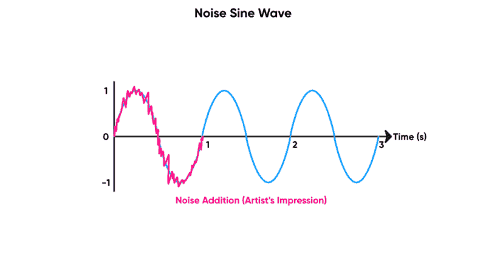
*The noise component adds variation to the usual sine wave.*
*噪声分量增加了通常的正弦波的变化。*

### Square Wave 方波节点

`Square Wave`（方波）节点技术规范：

1. 波形特性：
   - 在-1和1之间周期性跳变
   - 默认周期为1秒（当输入`Time`节点时）
   - 跳变瞬间完成（无过渡阶段）
2. 工程参数：
   - 输入值作为时间参数（建议单位：秒）
   - 50%占空比（正负半周持续时间相等）
   - 相位从正脉冲起始

**应用场景说明：**

- 数字电路时钟信号模拟
- 节拍器类音频合成
- 机械开关动画驱动（如LED闪烁）

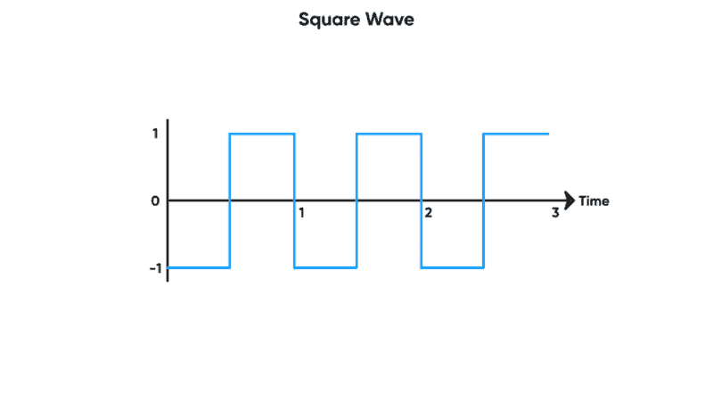
*Don’t be square, use the Square Wave today!*
*拒绝平庸，今天就用方波吧！*

### Triangle Wave 三角波节点

三角波从 -1 线性上升到 1，然后线性回落到 -1。曲线看起来像一系列三角形的山峰，因此得名。此节点在一秒钟的间隔内再次从 -1 变为 1 再到 -1。

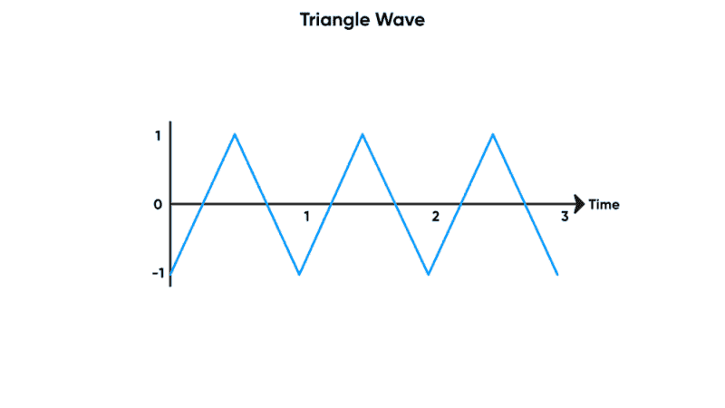
*Use a triangle wave if you need something sharper than a sine wave.*
*如果您需要比正弦波更尖锐的东西，请使用三角波。*

### Sawtooth Wave 锯齿波节点

 锯齿波，线性上升 -1 到 1，然后瞬间回落到 -1。曲线看起来像一系列尖锐的山峰，就像锯子一样。该节点在一秒钟内完成从 -1 到 1 的一个循环。

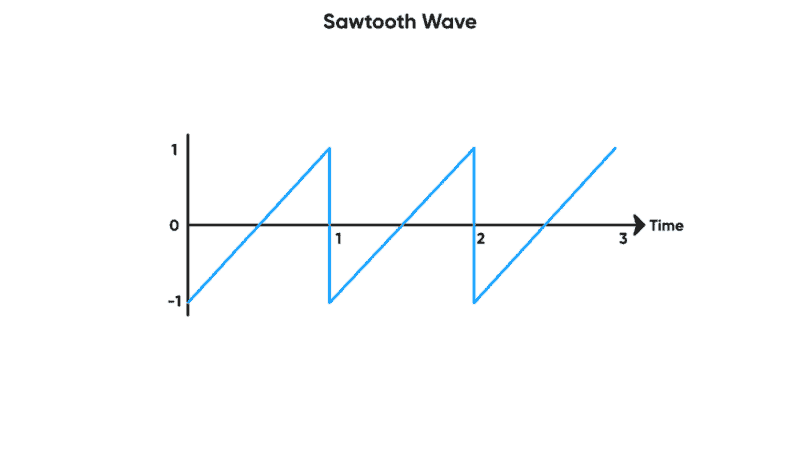
*A sawtooth wave is similar to a Time and Modulo combo, but it goes from -1 to 1 instead of 0 to 1.*
*锯齿波类似于时间和模量组合，但它从 -1 到 1，而不是 0 到 1。*

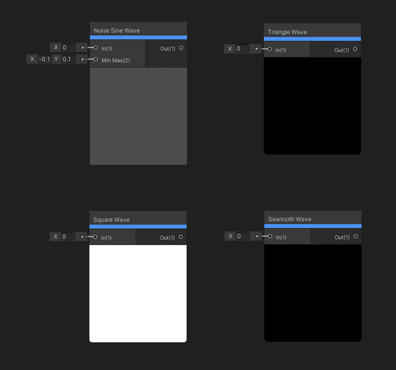
*These four nodes are great for looping material animations over time.*
*这四个节点非常适合随时间循环播放材质动画。*

## Trigonometry Nodes 三角学系列

三角学节点系列在各地的学生心中唤起了恐惧。如果您想知道什么时候会在以后的生活中使用 ，那么这里就用到了。

###  Sine, Cosine, Tangent 正弦、余弦、正切

`Sine`（正弦）、`Cosine`（余弦）和 `Tangent`（正切）节点分别对输入的角度（以弧度为单位）执行对应的三角函数运算。

- 输出范围：
  - `Sine` 和 `Cosine` 的返回值介于 `-1` 到 `1` 之间。
  - `Tangent` 的返回值可能从 `-∞` 到 `+∞`（需注意数值溢出风险）。
- **底层关联**：正弦和余弦函数会在叉积（Cross Product）等向量运算中被隐式调用。

> **注释**：
>
> - 应用场景：
>   - **周期性动画**：通过 `Time` + `Sine` 实现平滑的波浪运动（如水面起伏）。
>   - **法线贴图**：叉积计算法线方向时依赖正弦/余弦函数。
>   - **光栅化特效**：正切函数可用于生成非对称扭曲效果（如热浪折射）。
> - 注意事项：
>   - 正切函数在 `π/2 + kπ`（k为整数）处无定义，可能导致数值突变，建议通过 `Clamp` 或 `Fraction` 节点限制输入范围。
>   - 若需更高精度，可使用 `Half` 或 `Full` 精度浮点数节点。


### Arcsine,  Arccosine,  Arctangent 反正弦、反余弦、反正切

`Arcsine`（反正弦）、`Arccosine`（反余弦）和 `Arctangent`（反正切）节点是上述三角函数的逆运算。它们可将输入值（需为 `Sine`、`Cosine` 或 `Tangent` 的有效输出结果）**反向推导出对应的角度**，所有输出均以**弧度**为单位：

- **Arcsine**：输入值范围为 `-1` 至 `1`，输出角度范围为 `-π/2` 至 `π/2`。
- **Arccosine**：输入值范围为 `-1` 至 `1`，但输出角度范围为 `0` 至 `π`。
- **Arctangent**：输入值为任意浮点数（`Float`），输出角度范围为 `-π/2` 至 `π/2`（与 `Sine` 类似）。

> **注释**：
>
> - 应用场景：
>   - **向量角度计算**：通过坐标点反推方向角度（如光照反射方向）。
>   - **周期性逆运算**：将正弦/余弦结果还原为原始相位角（用于动态路径生成）。
>   - **材质参数修正**：根据颜色/亮度值反推纹理采样偏移量。
> - 注意事项：
>   - 输入值超出定义域时可能导致错误结果（如 `Arccosine` 输入 `1.5`）。
>   - 反三角函数常与 `Sine`/`Cosine` 配合使用，实现角度与数值的双向转换。

### Arctangent2 反正切双参数节点

`Arctangent2`（反正切双参数）是两参数反正切函数。给定输入 **A** 和 **B**，该函数会返回二维平面中x轴与点向量（**B**, **A**）之间的夹角（以弧度为单位）。

> **注释**：
>
> - 核心特性：
>   - 通过输入 **B**（对应x轴）和 **A**（对应y轴），可准确判断向量所在的象限，避免传统 `Arctangent` 函数因单一参数导致的象限模糊问题。
>   - 输出范围为 `-π` 至 `π`，覆盖完整圆周角度。
> - 典型应用：
>   - **向量方向计算**：根据坐标差计算运动方向或光照反射角。
>   - **极坐标转换**：将笛卡尔坐标转换为极坐标（角度+半径）。
>   - **动态旋转控制**：通过鼠标或触摸输入驱动物体旋转。
> - 注意事项：
>   - 输入参数顺序为（**B**, **A**），而非（**A**, **B**），需与坐标系定义一致。
>   - 当 **B** 为0时（垂直方向），角度为 `±π/2`。

### Degrees To Radians 角度转弧度节点

The `Degrees To Radians` node takes whatever the input float is, assumes it’s in degrees, and multiplies it by a constant such that the output is the same angle in radians.

输入任意以度为单位的浮点数，会默认将其乘以一个常数因子，输出以弧度为单位的角度。

### Radians To Degrees 弧度转角度节点

与前者相反，它将返回以度为单位的等效值。

### Hyperbolic Sine, Hyperbolic Cosine, Hyperbolic Tangent

And finally, the `Hyperbolic Sine`, `Hyperbolic Cosine` and `Hyperbolic Tangent` nodes perform the three hyperbolic trig functions on your input angle. The inputs and outputs are `Float` values.

最后，双曲正弦，双曲余弦，双曲正切  节点在输入角度上执行三个双曲三角函数。输入和输出是 Float 值。

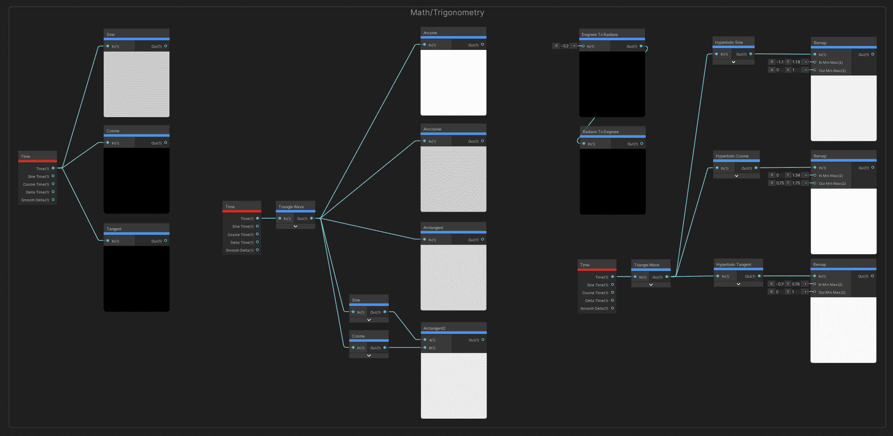
*It’s not easy to represent these nodes in screenshots.*
*在屏幕截图中表示这些节点并不容易。*

## Vector Nodes 向量系列

以下 Vector 系列节点可以为我们执行几个基本的线性代数运算。

### Distance  距离节点

`Distance`（距离）节点接收两个**向量**输入，并返回一个浮点值，表示这两个向量之间的欧几里得距离（即直线距离）。该运算本质上是基于勾股定理的三维空间投影计算，常用于计算光照衰减、粒子碰撞检测或动态纹理采样等需要量化空间间隔的场景。

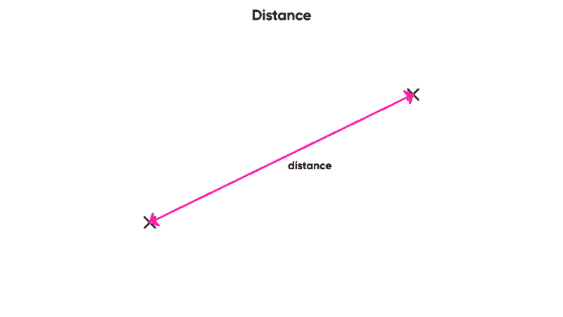
*I think we need a bit of distance.*
*我认为我们需要一点距离。*

### Dot Product 点积节点

`Dot Product`（点积）节点用于衡量两个向量之间的夹角关系。当两向量正交时，点积结果为零；若两向量同向，结果为1；反向则为-1。该节点接收两个向量输入，输出它们的点积值（浮点数）。数学上，点积等于两向量的模长相乘再乘以夹角的余弦值（*A*⋅*B*=∣*A*∣∣*B*∣cos*θ*），这使得它在光照计算（如漫反射强度）、法线方向比对等场景中具有重要应用价值。

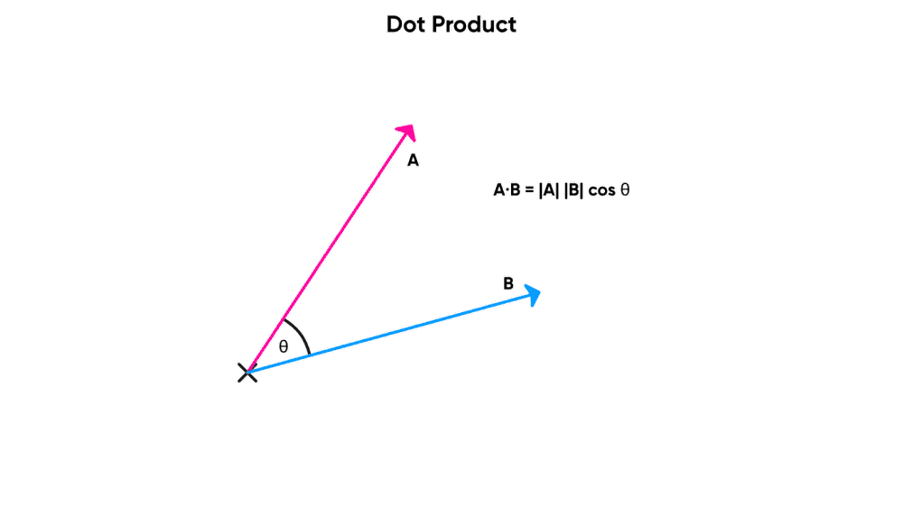
*When the dot product is 0, the two vectors are orthogonal.*
*当点积为 0 时，两个向量是正交的。*

### Cross Product 叉积节点

两个向量的**叉积（Cross Product）**会返回第三个向量，该向量垂直于原始两个向量所在的平面。叉积常用于获取方向信息，因此其模长（Magnitude）的实际数值可能不重要，但数学上，第三个向量的模长等于输入向量模长的乘积再乘以两向量夹角的正弦值（即 `|A × B| = |A||B|sinθ`）。

在ShaderGraph中，**叉积节点**接收两个 **Vector3** 类型的输入，并输出一个新的 **Vector3** 向量。其方向遵循**左手定则**：

- 若向量 **A** 指向“上方”，向量 **B** 指向“右侧”，则输出向量方向为“前方”。

> **注释**：
>
> - 典型用途：
>   - **法线计算**：通过两个切线向量生成表面法线（如顶点着色器中的切线空间法线）。
>   - **方向控制**：动态调整粒子发射方向或光照反射方向。
>   - **平面检测**：判断物体是否位于特定平面的某一侧（如地形碰撞检测）。
> - 注意事项：
>   - 输入向量需为三维向量（Vector3），二维向量需扩展为Z轴分量（如 `(X, Y, 0)`）。
>   - 叉积结果的方向与输入顺序相关：交换输入向量会反转输出方向（如 `A × B = - (B × A)`）。

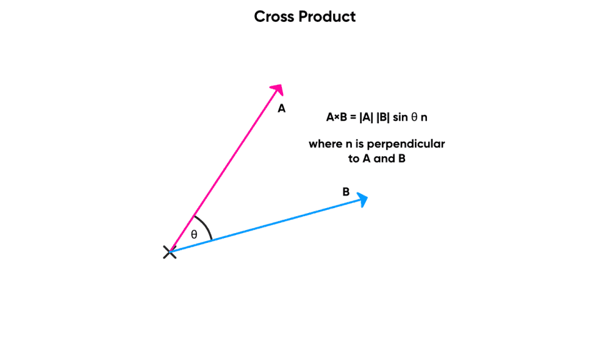
*Are you cross with me?*
*你是被‘叉积’搞懵了，还是真的在生我的气？*

### Transform 空间变换节点

`Transform`（变换）节点用于在不同坐标空间之间转换向量数据。其输入和输出均为 **Vector3** 类型，但输出结果会根据指定的空间变换规则进行调整。该节点本体上设有两个关键控件：

1. 空间选择（Space）：支持从多种预设空间中选择源空间和目标空间，包括：
   - **Object（对象空间）**
   - **View（视角空间）**
   - **World（世界空间）**
   - **Tangent（切线空间）**
   - **Absolute World（绝对世界空间）**
2. 变换类型（Type）：通过第三个控件可选择变换的类型：
   - **Position（位置）**：对位置向量进行空间变换。
   - **Direction（方向）**：对方向向量进行空间变换（不包含位置偏移）。

> **注释**：
>
> - 核心作用：
>   - 将光照计算、法线贴图等效果适配到正确的空间（如将法线从切线空间转换到世界空间）。
>   - 动态调整物体在视角空间中的运动轨迹（如UI元素的视差滚动）。
> - 注意事项：
>   - **方向向量变换**（Type: Direction）需避免平移干扰，通常用于光照方向或运动方向计算。
>   - **切线空间（Tangent）**常用于法线贴图采样，需配合切线向量（Tangent）和副切线向量（Bitangent）使用。

### Fresnel Effect 菲涅尔效应节点

`Fresnel Effect`（菲涅尔效应）节点是另一个强大的工具，可用于在**掠射角**（光线以接近表面的角度入射）时为物体添加额外光照效果。其核心功能是计算**表面法线（Normal）**与**视角方向（View Dir）**之间的夹角，并根据该夹角计算菲涅尔强度。若将该节点应用于球体，您会在节点预览中观察到边缘区域（如球体赤道附近）被高亮照亮的现象。

**输入参数**：

- **表面法线（Normal）**：物体的表面法线方向（三维向量，通常基于切线空间或世界空间）。
- **视角方向（View Dir）**：观察者视线方向（三维向量，需与法线空间一致）。
- **强度（Power）**：浮点参数，用于控制菲涅尔效应的锐利程度。值越大，高光区域越集中（边缘更明显）；值越小，高光过渡越平缓。

**输出**：

- 单个浮点值（Float），表示菲涅尔效应的总体强度（范围通常为 `0` 到 `1`）。

> **注释**：
>
> - 核心应用：
>   - **边缘光效**：为模型边缘添加发光效果（如金属武器反光、水面波纹高光）。
>   - **动态光照增强**：结合主光源方向，模拟真实世界中物体边缘因视角变化产生的明暗对比。
> - 参数调整建议：
>   - 若需强烈边缘光（如霓虹灯效果），可增大 **Power** 值；若需柔和过渡（如磨砂材质），则减小该值。
>   - 在移动端性能敏感场景中，建议将法线和视角方向归一化（使用 `Normalize` 节点）以避免计算开销。
> - 技术细节：
>   - 菲涅尔方程默认基于 **Schlick近似公式**，可通过修改幂参数模拟不同材质的反射特性（如玻璃、金属）。
>   - 若需完全自定义菲涅尔曲线，可替换为 `Power` 参数控制的 `Pow` 节点或曲线调节节点。

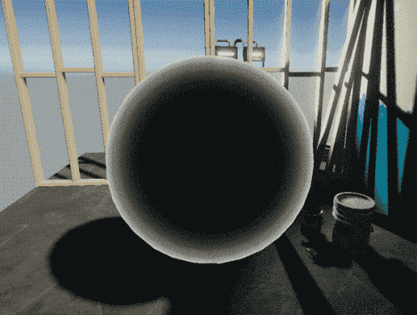
*Fresnel, also known as rim lighting, adds a glow at grazing angles.*
*菲涅耳，也称为边缘照明，在掠角处增加辉光。*

### Reflection 反射节点

`Reflection`（反射）节点接收两个输入参数：**入射方向向量**（表示光线撞击表面的方向）和**表面法线**（描述表面朝向的向量）。该节点通过镜面反射原理计算出反射光线方向——具体来说，它会以法线为对称轴，将入射方向向量进行镜像翻转，最终输出经过反射计算后的新向量。这一运算在实现动态环境反射（如金属材质的高光反射）、镜面贴图采样或屏幕空间反射效果时具有关键作用。

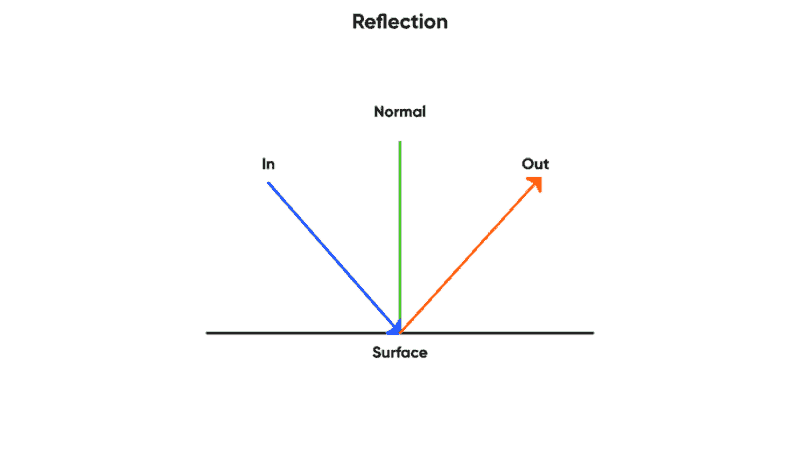
*Let’s reflect on the choices that brought us here.*
*让我们反思（反射双关语)一下所有成就我们现在的抉择。*

### Projection 投影节点

`Projection`（投影，或称为平行分量）节点接收两个向量输入 **A** 和 **B**，并将**A投影到B的方向**上生成输出向量。其几何意义是：输出向量与**B**方向平行，但模长可能根据**A**的原始长度被压缩或拉伸。这种运算在计算表面光照的切线方向、法线贴图空间转换等需要向量分解的场景中具有重要作用。

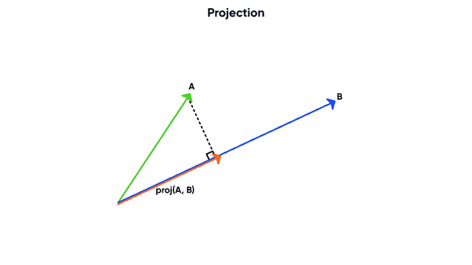
*Make sure vector B is non-zero!*
*确保向量 B 不为零！*

### Rejection 排斥向量节点

`Rejection`（排斥向量，或称为正交分量）节点同样接收两个向量输入 **A** 和 **B**，其输出结果是从 **B** 上距离 **A** 终点最近的点指向 **A** 终点的向量。该排斥向量始终垂直于 **B** 方向。数学上，其本质等价于 **A** 向量减去 **A** 在 **B** 方向上的投影分量（即 Rejection=*A*−Projection(*A* onto *B*)）。这种运算在分解向量方向（如分离表面法线与切线分量）或实现特定物理效果（如镜面反射遮蔽区域计算）时具有重要价值。

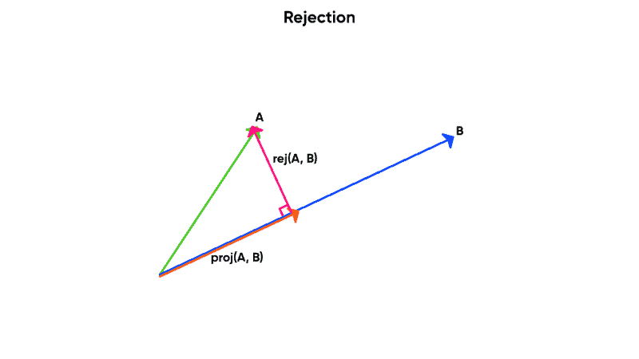
*We can define rejection in terms of projection. Neat!*
*我们可以用投影来定义排斥。巧妙！*

### Rotate About Axis 绕轴旋转节点

`Rotate About Axis`（绕轴旋转）节点接收三个输入参数：

- **Input**（输入向量）：类型为 `Vector 3`，表示待旋转的三维向量；
- **Axis**（旋转轴向）：类型为 `Vector 3`，定义旋转所围绕的轴线方向；
- **Rotation**（旋转角度）：类型为浮点数，支持通过节点控件选择以**度（Degrees）**或**弧度（Radians）**为单位。

该节点会将输入向量沿指定轴向旋转对应角度，并输出旋转后的新向量。此运算在实现材质动态效果（如螺旋纹理、旋转光照方向）或物理模拟（如刚体旋转）时具有重要作用。


*Not to be confused with the Rotation node.*
*不要与 Rotation 节点混淆。*

### Sphere Mask 球形遮罩节点

`Sphere Mask`（球形遮罩）节点接收一个 **坐标（Coordinate）**（任意空间中的位置），以及由 **中心点（Centre）** 和 **半径（Radius）** 定义的球体。若输入坐标位于球体内，则输出值为 `1`；否则为 `0`。此外，节点提供了一个 **硬度（Hardness）** 参数（取值范围 `0` 至 `1`），用于平滑 `0` 到 `1` 的过渡区域：

- **硬度越高**（如 `1`）：边缘越锐利（硬切边界）。
- **硬度越低**（如 `0.1`）：边缘渐变越柔和（模糊过渡）。

> **注释**：
>
> - 典型应用：
>   - **圆形范围效果**：如爆炸伤害区域、技能作用范围遮罩。
>   - **动态边缘渐变**：模拟水面波纹、粒子系统的衰减效果。
>   - **形状混合**：通过遮罩控制材质纹理的局部显示（如角色盔甲的圆形装饰）。
> - 注意事项：
>   - 输入坐标需与球体空间（如世界空间或局部空间）一致，否则可能导致遮罩错位。
>   - 若需更复杂的形状（如软硬边混合），可结合 `Lerp` 或 `Smoothstep` 节点进一步控制。
> - 参数调整技巧：
>   - 通过 `Hardness` 接近 `1` 实现“硬表面”效果（如岩石碰撞体积）。
>   - 通过 `Hardness` 接近 `0` 实现“软光晕”效果（如魔法粒子扩散）。

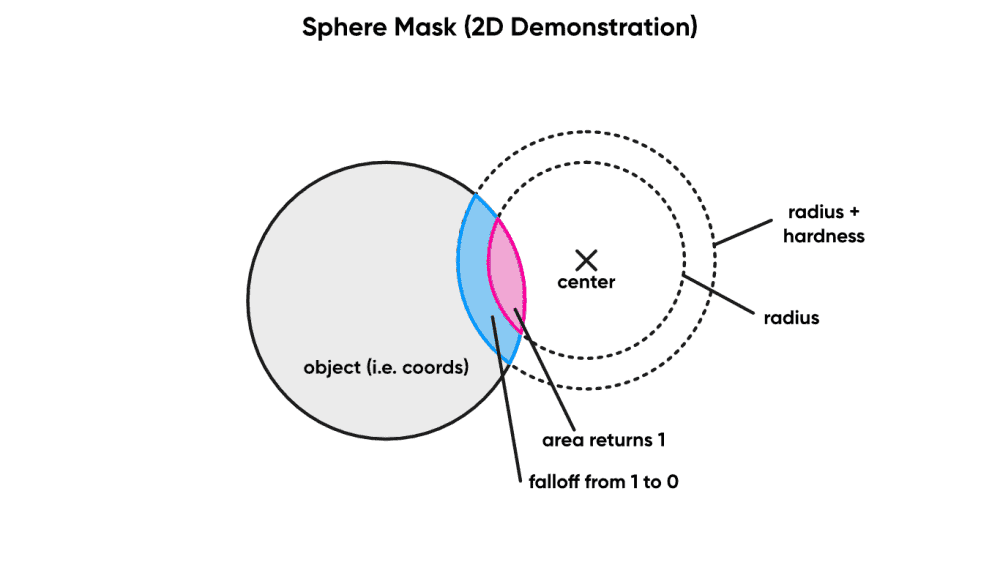
*Expand this to three dimensions, and you’ve got a sphere mask.*
*将其扩展到三维，你就得到了一个球体蒙版。*

## Derivative Nodes 导数系列

导数节点（Derivative Nodes）通过分析相邻像素上的节点组，量化其输出结果的差异程度。这类节点常用于捕捉纹理细节、边缘信息或高频变化，从而实现动态模糊、法线贴图增强或屏幕空间特效等效果。

> **注释**：
>
> - 核心功能：
>   - **差异度量**：计算当前像素与邻近像素（如水平/垂直方向）之间的数值差异，输出梯度值（Gradient）。
>   - 应用场景：
>     - **纹理过滤**：根据差异值调整采样精度（如各向异性过滤）。
>     - **边缘检测**：识别模型轮廓或材质撕裂区域（如轮廓描边特效）。
>     - **动态细节**：驱动视差贴图（Parallax Mapping）或细节贴图（Detail Mapping）的强度。
> - 技术细节：
>   - 导数运算通常依赖屏幕空间坐标（Screen Space），需确保节点输入与渲染管线分辨率匹配。
>   - 高差异值区域可能对应高频细节（如锐利边缘），低差异值区域则对应平滑过渡（如纯色表面）。

### DDX 沿x方向导数节点

`DDX`（沿x方向导数）节点用于计算输入值在水平方向（x轴）的**导数**。其工作原理是：

1. **像素对比**：获取当前渲染片段（Fragment）及其右侧相邻水平片段的输入值；
2. **差值计算**：输出两者的差值（即 ∂输入/∂x）；
3. **高效实现**：得益于光栅化过程中片段以**2x2区块**为单位处理，相邻片段的数据天然存储在GPU寄存器中，因此该计算无需额外开销即可完成。

此节点在实现动态边缘检测、法线贴图微分（如切线空间法线贴图采样）或屏幕空间反射等需要**局部变化率**的场景中至关重要，同时因其硬件级优化而具备极高运行效率。

### DDY 沿y方向导数节点

`DDY`（沿y方向导数）节点执行类似的导数运算，但方向为**垂直方向（y轴）**。其工作原理是：

1. **片段对比**：获取当前渲染片段（Fragment）及其**垂直相邻片段**（上方或下方）的输入值；
2. **差值计算**：输出两者的差值（即 ∂*y*∂输入）；
3. **高效实现**：与`DDX`节点类似，由于光栅化过程中片段以**2x2区块**为单位处理，相邻片段的数据天然存储在GPU寄存器中，因此该计算无需额外开销即可完成。

此节点在实现动态边缘检测（如垂直方向细节增强）、法线贴图微分（如切线空间法线贴图的垂直方向梯度）或屏幕空间反射（如水面波纹效果）等需要**垂直方向局部变化率**的场景中至关重要，同时保持了与`DDX`节点相当的运行效率。

### DDXY 对角线方向导数节点

`DDXY`（对角线方向导数）节点通过对水平方向（`DDX`）和垂直方向（`DDY`）的导数结果进行**向量求和**，实现对角线方向的导数计算。其数学本质等效于：

DDXY=DDX+DDY

（注：严格来说，该节点输出的是两者的矢量和，而非绝对值，此处表述可能存在简化）

**核心特性**：

1. **导数计算阶段限制**
   这三个导数节点（`DDX`、`DDY`、`DDXY`）​**仅能在片段着色器阶段（Fragment Shader）调用**，因为它们依赖光栅化过程中生成的相邻像素数据。
2. **硬件级优化实现**
   GPU通过**2x2渲染区块（Quad）​**并行处理像素，使得相邻像素的差值计算无需额外开销即可完成。

**典型应用场景**：

- **边缘检测**
  通过采样`Scene Color`（场景颜色）或`Scene Depth`（场景深度）纹理，计算相邻像素的导数绝对值，定位颜色/深度突变区域（如物体轮廓检测）。
- **动态细节增强**
  在法线贴图或视差贴图中，结合导数信息实现基于视角变化的动态效果（如边缘高光强化）。
- **屏幕空间特效**
  用于水面反射、烟雾模拟等需要感知局部变化的特效，通过导数计算确定扰动强度梯度。

此类节点为基于屏幕空间的高级渲染技术提供了底层数学支撑，但其使用需谨慎以避免性能开销。

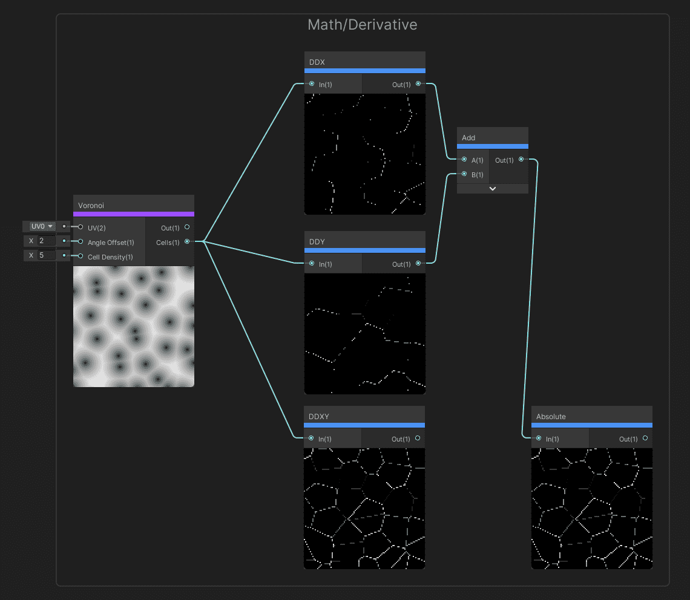
*You get these derivatives with an unexpectedly low overhead.*
*这些导数计算能够以极低且难以察觉的运算开销实现。其底层依赖于GPU的**2x2渲染区块（Quad)**并行架构——当处理相邻像素的导数时，硬件天然共享同一计算单元的中间结果，使得导数运算几乎不增加额外负担。这种设计巧妙地将微分计算的性能损耗压缩到近乎于零的水平。*

## Matrix Nodes 矩阵系列

使用 Matrix 节点系列创建矩阵或执行基本矩阵运算。

### Matrix Construction 矩阵构造节点

`Matrix Construction`（矩阵构造）节点允许通过向量构建矩阵。该节点包含四个`Vector4`输入端口，对应最大4x4矩阵的构造能力。其核心特性包括：

1. **行列模式配置**
   节点提供一个配置选项以决定输入向量被视为**行向量（Row-major）​**还是**列向量（Column-major）​**，这直接影响矩阵在着色器中的运算逻辑（如变换顺序）。
2. **灵活维度构造**
   通过启用前N个输入端口并设置对应维度（例如仅使用前3个端口构建3x3矩阵），可动态生成**2x2**、**3x3**或**4x4**矩阵。
3. **数学本质**
   矩阵的构造遵循线性代数规则：每个输入向量对应矩阵的一行或一列（由行列模式决定），最终形成的矩阵可用于顶点变换（如模型视图投影）、光照计算或自定义几何变形。

此节点在需要动态生成变换矩阵（如程序化动画或基于物理的材质形变）时尤为重要，其灵活性与Shader Graph的节点化编程范式高度契合。

### Matrix Split 矩阵分解节点

`Matrix Split`（矩阵分解）节点则执行逆向操作——将输入矩阵拆解为多个向量输出。其核心特性如下：

1. **输入矩阵范围**
   支持 ​**2x2 至 4x4**​ 矩阵的输入解构。若输入矩阵维度小于4x4（如3x3矩阵），则输出向量中未被原始数据填充的部分会以**零值补位**。

2. **行列模式继承**
   与`Matrix Construction`节点的设置**严格对应**——若构造时选择行向量模式，则分解时输出行向量；若为列向量模式，分解结果则为列向量。

3. **数学本质**
   该节点本质上是矩阵转置与向量提取的复合运算：

   - 对4x4矩阵，按行/列拆分为4个`Vector4`；

   - 对3x3矩阵，拆分后向量末位填充零：
     $$
     如
     \begin{bmatrix}
     	a & b & c \\
     	d & e & f \\
     	g & h & i
     \end{bmatrix}
     → 行向量模式输出 [a,b,c,0], [d,e,f,0], [g,h,i,0], [0,0,0,0]
     $$

此节点在解析复杂变换矩阵（如从动画数据中提取位移/旋转分量）或重构着色器运算中间结果时具有关键作用，其设计严格遵循线性代数中矩阵与向量的映射规则。

### Matrix Determinant 矩阵行列式节点

`Matrix Determinant`（矩阵行列式）节点用于计算矩阵的行列式值。其核心特性如下：

1. **输入范围**
   支持 ​**2x2 至 4x4**​ 矩阵的行列式计算。行列式本质上是矩阵线性变换对体积的缩放因子，常用于判断矩阵是否可逆或求解线性方程组。
2. **性能考量**
   行列式计算复杂度随矩阵维度呈指数级增长（4x4矩阵计算量约为2x2的24倍）。在实时渲染中，频繁计算大矩阵行列式可能导致性能瓶颈，需结合`Shader Graph`的节点调试工具分析其必要性。
3. **数学应用场景**
   - **逆矩阵计算**：行列式为逆矩阵公式的分母部分（若行列式为零则矩阵不可逆）。
   - **光照裁剪**：通过行列式判断视锥体裁剪平面与物体的相交状态。
   - **体积变形**：在程序化地形生成中，行列式可用于计算位移贴图对表面曲率的影响。

该节点为高级着色器编程提供底层数学支持，但需权衡其计算开销与视觉效果的优先级。

### Matrix Transpose 矩阵转置节点

`Matrix Transpose`（矩阵转置）节点通过主对角线镜像反射矩阵元素，实现行与列的互换。其核心特性如下：

1. **数学本质**
   将原矩阵中第i行第j列的元素移动至第j行第i列，使行向量与列向量角色互换。例如：
   $$
   \begin{bmatrix}
   	a & b & c \\
   	d & e & f \\
   	g & h & i
   \end{bmatrix}
   \xrightarrow{\text{转置}}
   \begin{bmatrix}
   	a & d & g \\
   	b & e & h \\
   	c & f & i
   \end{bmatrix}
   $$

2. **输入/输出约束**
   输入与输出矩阵的维度严格一致（均为2x2、3x3或4x4），仅元素排列发生改变，数值本身保持不变。

3. **应用场景**

   - **光照计算**：在法线贴图空间转换时，需转置切线空间矩阵以匹配世界空间坐标系。
   - **矩阵乘法优化**：转置后可利用GPU的缓存局部性提升运算效率（如将行优先存储转为列优先访问）。
   - **物理模拟**：在刚体动力学中，转置惯性张量用于坐标系变换。

该节点为矩阵运算提供了基础的转置功能，是着色器编程中坐标系统转换和线性代数计算的关键工具。

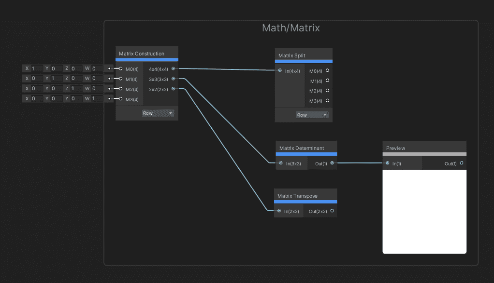
*Matrices are just arrays of numbers - and they’re great in combination with vectors.*
*矩阵只是数字数组 - 它们与向量结合使用非常有用。*

## Advanced Nodes 进阶版数学运算节点系列

这个系列虽然被称为进阶版，但其中许多节点依然是基本的数学运算。

### Absolute  绝对值节点

`Absolute`（绝对值）节点会返回输入值的绝对值——即如果输入值为负，则符号变为正。该节点的输入可以是向量，若输入为向量，此操作将对每个分量分别执行。这种处理方式适用于大多数此类节点，因此有时即使某些节点实际支持向量输入，我可能也只会提及浮点输入的情况。

### Length 长度节点

`Length`（长度）节点接收一个**向量**（二维/三维）作为输入，并返回该向量的模长——即通过勾股定理计算得出的几何长度。

### Modulo 模运算节点

`Modulo`（模运算）节点的工作原理是通过循环计数实现——当数值达到设定值后重置回零重新累加。具体来说，该节点会输出输入**A**除以输入**B**后的余数值（即 `A % B` 的数学运算结果）。这种运算在实现周期性效果（如循环纹理、UV坐标重置等）时具有重要价值。

### Negate 取反节点

`Negate`（取反）节点会反转输入浮点数的符号——若输入为正数则输出负数，反之亦然。该节点常用于需要反向数值的场景，例如抵消光照计算中的方向性影响或控制材质属性的反转效果。

### Normalize 归一化节点

`Normalize`（归一化）节点接收一个向量输入，并生成一个方向保持不变但模长为1的新向量。这种归一化处理在计算单位方向向量时非常关键，例如在光照方向或法线贴图中确保方向一致性。

### Posterize 色调分层节点

`Posterize`（色调分层）节点接收两个输入：**输入值**和**步骤数**。该节点会将输入值的范围限制在0到1之间，并对其进行量化处理——最终输出的数值只能是等于**步骤数+1**个离散值中的一个。例如，当设置步骤数为4时，输出会被向下取整至0、0.25、0.5、0.75或1这五个分级点。这种处理常用于创建像素化效果或限制颜色/数值的分段数量。

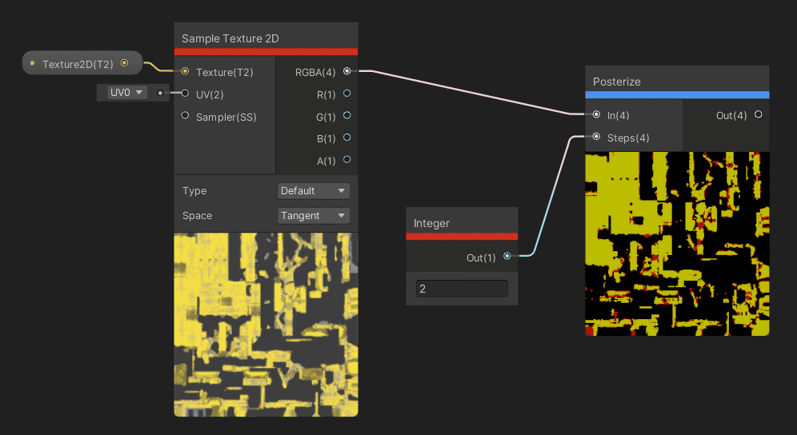
*Posterize doesn’t mean turning it into a poster, but that would’ve been cool too.*
*海报化并不意味着把它变成海报，但那也会很酷。*

### Reciprocal 倒数节点

`Reciprocal`（倒数）节点会对输入浮点数进行取倒数运算（即输出 `1 / 输入值`）。该节点提供算法选择选项——可选择**默认**算法或**快速**算法。其中快速算法精度稍低，但若您需要高频调用该节点（例如在复杂着色器中频繁计算倒数），还是推荐使用的。

### Reciprocal Square Root 倒数平方根节点

`Reciprocal Square Root`（倒数平方根）节点与`Reciprocal`节点类似，但它计算的是输入值的平方根的倒数（即输出 `1 / √输入值`）。与`Reciprocal`不同，该节点没有提供算法选择选项。若您对技术历史感兴趣，**快速反向平方根算法**（Fast Inverse Square Root）是一段著名的代码实现，最初由John Carmack推广但实际更早被发现，用于高效计算平方根倒数。如今这种算法已无需手动实现，因为现代GPU指令集已直接支持该功能，但它仍是计算机图形学发展史中一个有趣的注脚。

### Exponential 指数节点

`Exponential`（指数）节点将特定数字提高到浮点输入的幂。我们可以使用 **Base** 下拉列表来选择基数，这让我们可以在 **2** 和 **e** 之间进行选择。**e** 是欧拉数，约为 2.72。

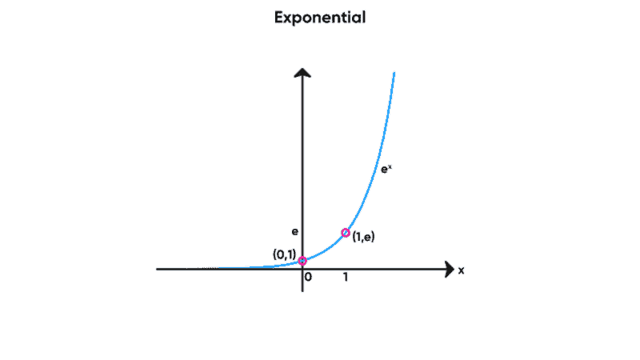
*Exponential nodes are quickly growing in popularity.*
*指数节点正在迅速飙涨。*

### Log 对数节点

`Log`（对数）节点与`Exponential`（指数）节点互为逆运算。例如，若 2^4=16，则 log2(16)=4。该节点接收一个浮点输入，并返回以指定基数计算的对数值。通过**Base**（基数）下拉菜单，可选择基数为 **2**、**e**（自然对数）或 **10**。这种运算在需要非线性数值映射（如亮度曲线调整或频域分析）的场景中非常有用。

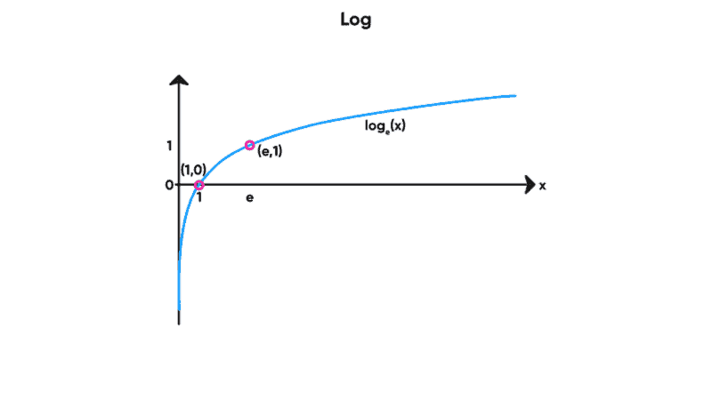
*Logarithms do the opposite of exponents. Compare the two highlighted points with those on Exponential!*
*对数与指数相反。将两个突出显示的点与指数上的点进行比较！*

# Artistic Nodes 艺术系列

Artistic nodes usually operate on colors, or individual color channels, or textures.
艺术节点通常对颜色、单个颜色通道或纹理进行操作。

## Blend Nodes 混合节点系列

### Blend 混合节点

`Blend`（混合）节点通常用于将两种颜色进行混合。在此场景中，我们将**基础颜色（Base Color）**和**混合颜色（Blend Color）**输入节点，并根据第三个输入参数——浮点数**不透明度（Opacity）**，将混合颜色应用到基础颜色上。当 **Opacity** 为 `0` 时，基础颜色保持不变；当 **Opacity** 为 `1` 时，混合效果最强。节点还提供了一个 **模式（Mode）** 下拉菜单，可选择不同的混合方法（如叠加、正片叠底等，具体选项较多，此处不逐一列举）。节点的唯一输出是混合完成后的最终颜色。

> **注释**：
>
> - 混合模式（Blend Mode）：
>   - **叠加（Overlay）**：保留基础色的高光与阴影细节，叠加混合色的对比度。
>   - **正片叠底（Multiply）**：将两颜色相乘，结果比原始颜色更暗（常用于阴影）。
>   - **滤色（Screen）**：反向正片叠底，结果更亮（模拟高光）。
>   - **线性插值（Linear Interpolate, Lerp）**：按比例混合两颜色（`Opacity=0` 时完全基础色，`Opacity=1` 时完全混合色）。
> - **应用场景**：材质过渡（如金属到塑料的渐变）、动态特效（如粒子颜色混合）、UI元素叠加（如半透明遮罩）等。
> - **扩展性**：可通过调整 **Opacity** 动态控制混合强度（如材质老化效果）。

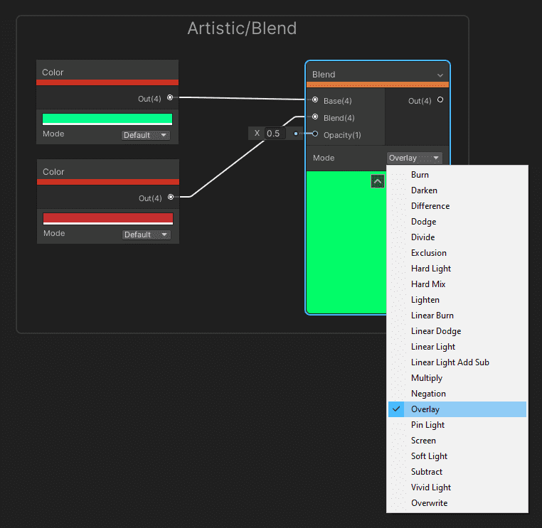
*There are plenty of blending options, similar to those found in graphics programs.*
*有很多混合选项，类似于图形程序中的选项。*

## Filter Nodes 滤镜节点系列

### Dither 抖动节点

`Dither`（抖动）是我最喜欢的节点之一。它在屏幕空间中以特定方式添加可控噪声——节点内部定义了一套精妙的噪声值模式作为阈值。输入一个多通道数值向量后，每个通道的值若低于抖动模式定义的阈值，则输出 `0`；否则输出 `1`。此外需输入 **Screen Position**（屏幕坐标），通过乘以缩放因子可调整抖动强度。

> **注释**：
>
> - **技术原理**：
>   抖动通过引入可控噪声掩盖颜色或亮度层级的不连续性，常用于减少低精度渲染时的带状伪影（如2D精灵的色带问题）。
> - 应用场景：
>   - 复古像素风格渲染（模拟CRT显示器扫描线效果）。
>   - 低多边形（Low-Poly）模型的表面细节增强。
>   - 动态模糊或运动模糊的替代方案（通过帧间抖动模拟运动感）。
> - 参数调整技巧：
>   - 缩放因子过大会导致过度抖动（如雪花噪点），建议从 `(0.1, 0.1)` 开始测试。
>   - 结合 `Multiply` 节点与透明度参数，可动态控制抖动强度（如UI元素的焦点状态变化）。

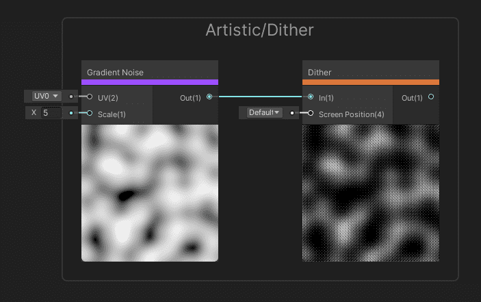
*Dither is one of my favourite nodes - it’s great for fake transparency effects.*
*抖动是我最喜欢的节点之一 - 它非常适合假透明效果。*

## Mask Nodes 蒙版节点系列

### Color Mask 颜色蒙版节点

`Color Mask`（颜色蒙版）节点接收一个 **输入颜色（Input）**、一个 **蒙版颜色（Mask Color）** 和一个 **范围（Range）** 浮点值。其逻辑为：若输入颜色等于蒙版颜色，或其值在蒙版颜色的 **范围** 内，则输出 `1`；否则输出 `0`。此外，通过 **模糊度（Fuzziness）** 输入可调整边缘过渡的柔和程度——当该值大于零时，范围边界的颜色会以渐变方式过渡（而非硬性切换）。节点的输出是一个代表蒙版强度的单通道浮点值（0或1，或介于两者之间的柔化值）。

> **注释**：
>
> - 典型应用：
>   - 选择性遮罩（如仅对特定颜色区域应用特效）。
>   - 动态材质切换（根据颜色范围触发不同效果）。
>   - 图像处理（如颜色范围选区的模糊化处理）。
> - 参数技巧：
>   - 提高 **Fuzziness** 值可实现边缘羽化（如模拟手绘效果）。
>   - 结合 `Multiply` 节点与透明度参数，可控制蒙版效果的强度。
> - 工作原理：通过计算输入颜色与蒙版颜色的欧氏距离（或阈值比较），判断是否属于目标范围。

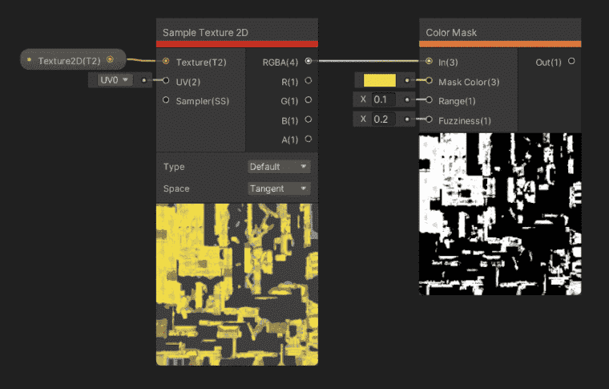
*I’ve picked all the yellow parts of this texture.*
*我已经挑选了这个纹理的所有黄色部分。*

### Channel Mask 通道遮罩节点

`Channel Mask`（通道遮罩）节点接收一个**颜色输入**，并通过其**Channels**（通道）选项控制输出颜色的通道组合。其核心功能如下：

1. **通道选择逻辑**

   - 用户可勾选任意通道组合（如仅保留红色通道 `R`，或同时选择 `R` 和 `B`）。
   - **选中通道**：保留原始颜色值。
   - **未选通道**：强制置零（如未选绿色通道 `G`，则输出中 `G` 分量始终为 `0`）。

2. **数学实现**
   输出颜色可表示为逐通道的掩码运算：
   $$
   \text{Output}_\text{R} = \begin{cases}  
   \text{Input}_\text{R} & (\text{若R被选中}) \\  
   0 & (\text{否则})  
   \end{cases}
   $$
   OutputR={InputR0(若R被选中)(否则)

   其他通道同理。

3. **应用场景**

   - **特效合成**：分离特定通道用于后期处理（如仅保留红色通道模拟老电影效果）。
   - **材质混合**：将不同通道分配到其他节点的输入接口（如将蓝色通道作为法线贴图的强度控制）。
   - **数据压缩**：通过遮罩减少冗余通道传输（例如在移动端渲染中优化带宽占用）。

该节点为颜色通道的灵活操控提供了原子级操作支持，是复杂着色器网络中通道重定向与混合的核心工具。

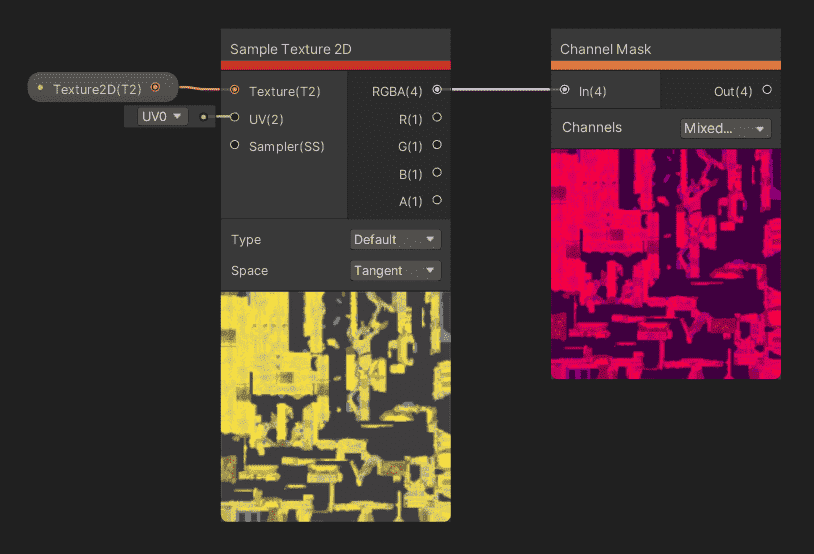
*If you decide you hate the green channel, now you can delete it.*
*如果您决定讨厌绿色频道，现在可以将其删除。*

## Adjustment Nodes 调整节点系列

以下“调整”节点用于调整颜色的属性。

### Hue 色相节点

`Hue`（色相）节点可通过**Offset**（偏移量）参数对输入颜色进行色相偏移。其核心特性如下：

1. **模式切换**

   - 节点提供**Degrees**（角度制）与**Normalized**（归一化）两种模式，但需注意：官方文档描述与节点实际控件存在差异（文档标注为**Degrees/Radians**，实际界面显示为**Degrees/Normalized**）。
   - **Degrees模式**：色相偏移范围覆盖完整的0°-360°色轮周期。
   - **Normalized模式**：偏移量映射至0-1区间（等效于0°-360°的浮点数表示）。

2. **数学实现**

   - 色相偏移本质为HSV色彩空间中的角度运算，公式为：
     $$
     \text{Hue}_{\text{output}} = (\text{Hue}_{\text{input}} + \text{Offset}) \mod 360^\circ
     $$

     $$
     \text{Hue}_{\text{output}} = (\text{Hue}_{\text{input}} + \text{Offset} \times 360) \mod 360^\circ
     $$

3. **应用场景**

   - **动态色调调整**：用于创建光照变化（如霓虹灯变色效果）或材质老化模拟。
   - **跨设备兼容**：归一化模式更适合程序化控制（如通过滑块实时调节色相偏移量）。

该节点为色彩校正与风格化渲染提供了直观的色相操控接口，但其模式命名需结合界面实际标注使用。

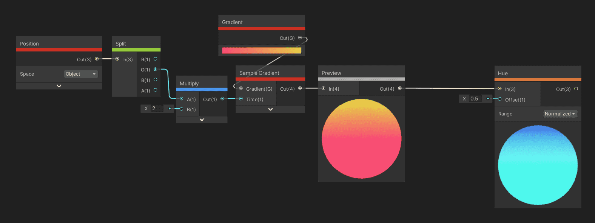
*Most people would call cycling through hues ‘changing color’.*
*大多数人会将不同色相间的循环切换称为「换色」*

### Saturation 饱和度节点

The `Saturation` node adjusts the amount of saturation in the input color by whatever amount is passed into the **Saturation** float input. When the saturation value is 1, the original color’s saturation is left alone, and when it is zero, the output color will have no saturation at all.

该（饱和度）节点通过传递到 **Saturation** 浮点数输入的任何量来调整输入颜色中的饱和度量。当饱和度值为 1 时，原始颜色的饱和度保持不变，当它为零时，输出颜色将完全没有饱和度。

`Saturation`（饱和度）节点通过**Saturation**（饱和度）浮点输入值调整输入颜色的饱和度强度。其核心特性如下：

1. **参数控制逻辑**

   - 当**Saturation = 1**时，输出颜色与输入颜色完全一致（饱和度不变）。
   - 当**Saturation = 0**时，输出颜色为灰度（完全去饱和）。
   - 中间值（如0.5）会按比例降低色彩饱和度。

2. **数学实现**
   饱和度调整可视为HSV色彩空间中对S（Saturation）通道的线性映射：
   $$
   \text{Saturation}_{\text{output}} = \text{Saturation}_{\text{input}} \times \text{Saturation\_Control}
   $$
   其中，Saturation_Control为节点的浮点输入值。

3. **应用场景**

   - **材质老化**：通过动态调节饱和度模拟物体褪色效果。
   - **视觉焦点控制**：降低背景饱和度以突出前景主体。
   - **风格化渲染**：配合色相（Hue）与明度（Value）节点实现艺术化色调。

该节点为色彩校正与风格化着色提供了核心的饱和度控制能力，是Shader Graph中实现动态色彩调整的基础工具。

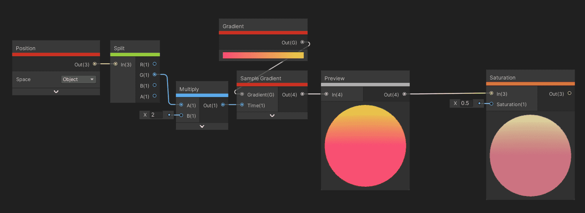
*Colors get closer to greyscale as saturation decreases to 0.*
*当饱和度降至 0 时，颜色会更接近灰度。*

### Contrast 对比度节点

`Contrast`（对比度）节点通过**Contrast**（对比度）浮点输入值调整输入颜色的对比度强度。其核心特性如下：

1. **参数控制逻辑**

   - 当**Contrast = 1**时，输出颜色与输入颜色完全一致（对比度不变）。
   - 当**Contrast = 0**时，输出颜色为灰度平均（完全去对比度）。
   - 大于1的值会增强对比度，小于1的值会减弱对比度。

2. **数学实现**
   对比度调整可视为对颜色值的非线性映射：
   $$
   \text{Color}_{\text{output}} = (\text{Color}_{\text{input}} - 0.5) \times \text{Contrast} + 0
   $$
   其中，0.5 表示灰度中间值，Contrast 控制拉伸或压缩的强度。

3. **应用场景**

   - **材质高光增强**：通过提高对比度突出金属反光区域。
   - **视觉风格化**：低对比度模拟复古滤镜，高对比度强化科幻质感。
   - **动态光照响应**：根据光照强度实时调整表面对比度。

该节点为色彩校正与艺术化渲染提供了关键的对比度控制能力，是Shader Graph中实现动态色调分级的基础工具。

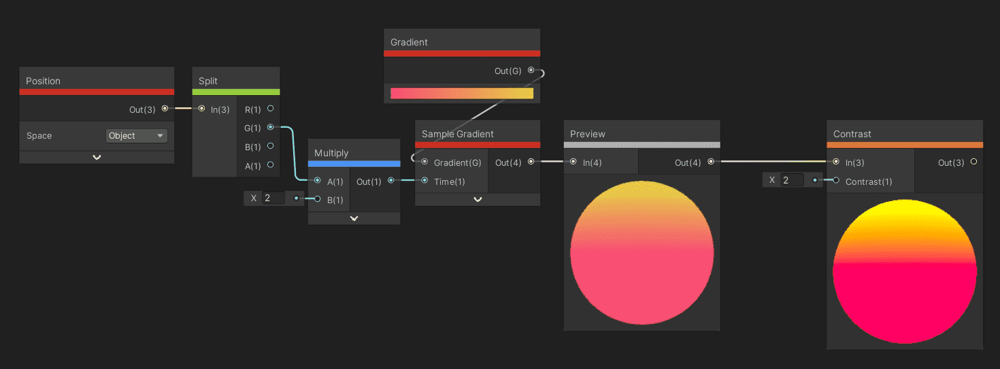
*Increasing contrast creates very vibrant images.*
*增加对比度可创建非常生动的图像。*

### White Balance 白平衡节点

`White Balance`（白平衡）节点用于调整输入颜色的**色温（Temperature）**与**色调（Tint）**。其核心特性如下：

1. **色温（Temperature）**
   - **低温（< 0）**：色彩趋向冷色调（偏蓝）。
   - **高温（> 0）**：色彩趋向暖色调（偏红）。
   - 该参数模拟真实相机白平衡调整，用于校正光源色偏或创造艺术化色彩倾向。
2. **色调（Tint）**
   - **正向调整**：向品红（Magenta）方向偏移。
   - **负向调整**：向绿色（Green）方向偏移。
   - 该参数用于微调色彩平衡，常用于消除色偏或实现特定风格化效果（如电影色调）。
3. **数学逻辑**
   白平衡调整通常基于**色相-饱和度-明度（HSV）模型**或**RGB色彩空间线性变换**，通过重新映射颜色通道实现色温与色调的精准控制。
4. **应用场景**
   - **自然场景渲染**：校正光照色温（如日光/阴天模式）。
   - **材质风格化**：通过色温偏移模拟金属氧化（蓝调锈蚀）或生物荧光（红调发光）。
   - **动态氛围控制**：结合参数化动画实现昼夜循环的色彩渐变。

该节点为色彩校正与艺术化渲染提供了完整的色温/色调控制方案，是Shader Graph中实现高级色彩分级的基础工具。

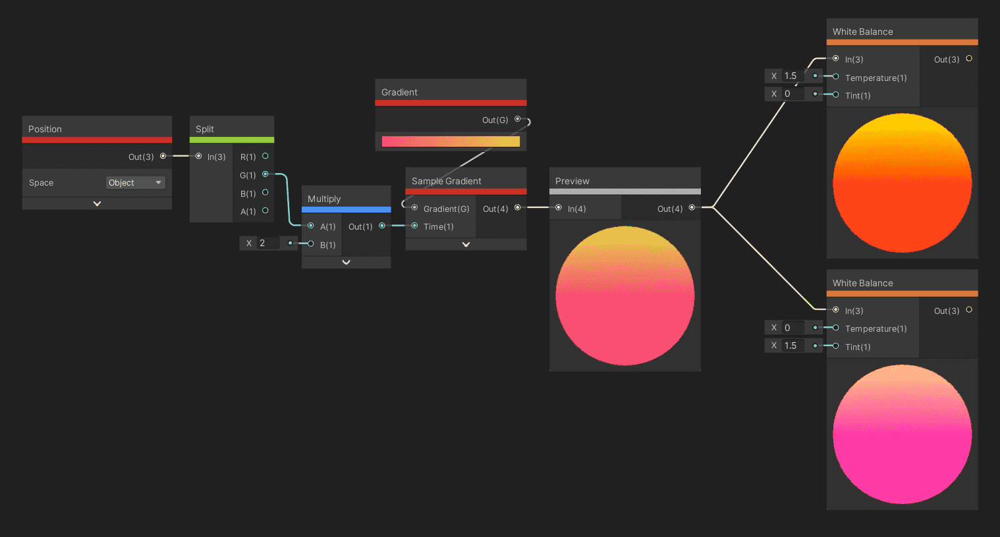
*White Balance does strange things to colors.*
*白平衡对颜色有奇怪的影响。*

### Replace Color 颜色替换节点

`Replace Color`（颜色替换）节点通过参数化规则实现颜色替换逻辑。其核心功能如下：

1. **基础替换规则**
   - **源颜色（From）**：需被替换的目标颜色（如将场景中的红色替换为蓝色）。
   - **目标颜色（To）**：用于替换的最终颜色。
   - **匹配逻辑**：当输入颜色与**From**完全匹配时，直接替换为**To**。
2. **容差范围控制**
   - **Range（容差范围）**：通过浮点值定义颜色匹配的敏感度。例如设置为0.2时，输入颜色与**From**的色差在±0.2范围内均会被替换。
   - **数学实现**：基于HSV或RGB色彩空间的欧氏距离计算，公式为： \text{Match} = \frac{1}{N}\sum_{i=R,G,B} |\text{Input}_i - \text{i| \leq \text{Range}
3. **平滑过渡控制**
   - **Fuzziness（模糊度）**：通过浮点值控制替换区域的渐变衰减。例如设置为0.5时，匹配颜色与目标颜色之间会形成0.5阶的平滑过渡。
   - **应用场景**：避免硬边缘（如材质边缘溢色），常用于水体反射强度渐变或天空盒色彩过渡。

该节点为动态材质编辑提供了精准且灵活的颜色控制方案，尤其适用于条件逻辑（如特定颜色触发特效）的着色器编程场景。

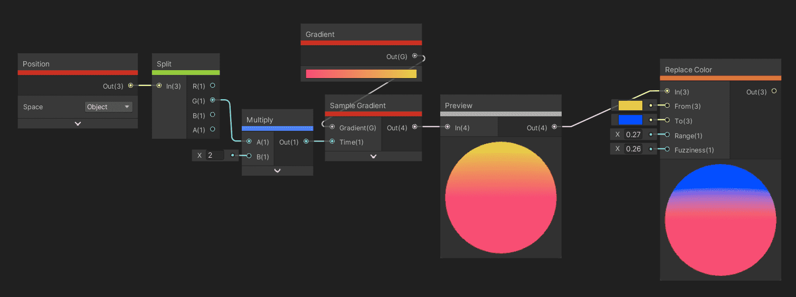
*We can swap out a range of colors easily like this.*
*我们可以像这样轻松更换一系列颜色。*

### Invert Colors 反色节点

`Invert Colors`（反色）节点通过对输入颜色的每个通道执行 **1 - 通道值** 的运算实现颜色反转。其核心特性如下：

1. **数学实现**
   对于输入颜色 Input=(*R*,*G*,*B*)，输出颜色为：

   Output=(1−*R*,1−*G*,1−*B*)

   该运算将每个通道值从 [0,1] 映射到 [0,1] 的反向区间（如黑色 0 变为白色 1）。

2. **输入范围限制**
   节点默认输入颜色通道值为 ​**0到1**​（如标准线性空间颜色），若输入HDR（高动态范围）颜色（通道值可能超过1），反色结果可能出现异常（如过曝区域反转后变为深色残留）。

3. **应用场景**

   - **材质调试**：快速预览颜色反转效果（如法线贴图方向检查）。
   - **特效生成**：通过反色实现胶片负片效果或边缘光晕。
   - **光照计算**：在屏幕空间反射中反转深度值以辅助边缘检测。

该节点为颜色操作提供了基础的数学反转功能，但在HDR渲染或非标准色彩空间中需谨慎使用。

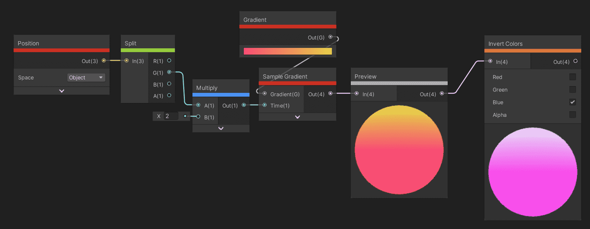
*Invert any combination of color channels easily.*
*轻松反转颜色通道的任意组合。*

### Channel Mixer 通道混合器节点

`Channel Mixer`（通道混合器）节点通过重新映射红、绿、蓝三个颜色通道对输出颜色的贡献比例，实现复杂的色彩叠加效果。其核心功能如下：

**参数控制逻辑**

1. **通道选择模式**

   - 点击 **R**、**G** 或 **B** 按钮，选择需要调整的**输入通道**（如选择红色通道时，仅修改红色通道对输出的影响）。
   - **滑块范围**：每个通道的贡献比例可调节范围为 **-2 到 2**，允许反向叠加（如负值表示颜色抵消）。

2. **数学实现**
   假设选择输入通道为红色（R），输出通道为蓝色（B），滑块值为 `[0, 0, 2]`，则混合公式为：
   $$
   \text{Output}_\text{B} = \text{Input}_\text{R} \times 2 + \text{Input}_\text{G} \times 0 + \text{Input}_\text{B} \times 0
   $$
   这表示输入红色的强度会被放大 200% 并完全输出到蓝色通道。

**典型应用场景**

1. **跨通道色彩叠加**

   - 将红色通道的 50% 贡献到绿色通道，模拟荧光效果（如霓虹灯边缘溢色）。

   - 公式示例：
     $$
     \text{Output}_\text{G} = \text{Input}_\text{R} \times 0.5 + \text{Input}_\text{G} \times 1.0 + \text{Input}_\text{B} \times 0
     $$
     

2. **反向色彩补偿**

   - 使用负值滑块消除色偏（如绿色通道溢色时，将红色通道的贡献设为负值抵消）。

3. **风格化渲染**

   - 将蓝色通道的 150% 输出到红色通道，实现科幻风格的冷色调高光。

**注意事项**

- **HDR兼容性**：若输入颜色包含高动态范围值（如HDR纹理），混合结果可能出现超出 `[0,1]` 的异常值，需配合 `Clamp` 节点限制范围。
- **非直观性**：负值与超限值的叠加效果需通过实时预览验证，建议结合 `Preview` 节点调试。

该节点为高级色彩操作提供了原子级控制能力，在材质特效（如腐蚀、发光）和后期处理（如色调映射）中具有重要价值。

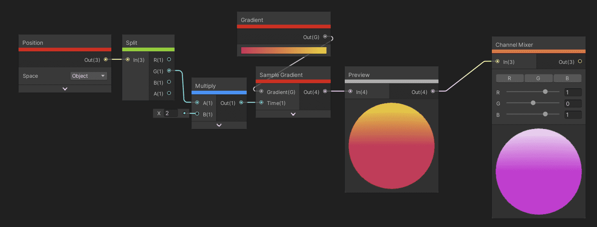
*In this image, both red and green contribute to output blue, weighted equally.*
*在此图像中，红色和绿色都有助于输出蓝色，权重相等。*

## Normal Nodes 法线节点系列

在使用法线贴图时，法线节点系列是不可替代的，无论您是从纹理中读取还是在 Shader Graph 中创建法线。

### Normal Unpack 法线解包节点

`Normal Unpack`（法线解包）节点用于将输入的颜色或向量数据转换为法线向量。其核心特性如下：

**功能解析**

1. **输入类型**
   - 支持 **颜色（Color）** 或 **向量（Vector）** 输入（如从纹理采样得到的RGB值）。
   - 对于常规法线贴图，通常可直接通过`Sample Texture 2D`节点采样，但此节点更适用于**程序化生成的法线数据**（如通过数学运算生成的伪法线贴图）。
2. **空间模式（Space）**
   - **Tangent Space（切线空间）**：法线方向基于模型切线坐标系（适用于动态光照计算）。
   - **Object Space（对象空间）**：法线方向基于模型自身坐标系（需后续转换至世界/视图空间）。
3. **输出结果**
   - 输出为 `Vector3` 类型的法线向量，范围通常为 [−1,1]（需注意HDR颜色值可能导致溢出）。

**典型应用场景**

1. **HDR颜色解码**
   当HDR颜色通道的值超出0,1范围时（如高光强度），可通过此节点将其映射为合法法线向量。
2. **自定义法线生成**
   在Shader Graph中通过数学运算（如噪声函数）生成伪法线贴图时，需解码为标准法线格式。
3. **跨空间兼容性**
   统一不同空间（如切线空间与对象空间）的法线数据，便于混合多通道材质效果。

**注意事项**

- **数值范围**：若输入颜色包含HDR值（如亮度超过1），需先通过`Clamp`或`Saturate`节点限制范围。
- **性能优化**：避免对已压缩的法线贴图（如BC5格式）重复解包，直接采样原生法线贴图更高效。

该节点为法线数据处理提供了灵活的转换接口，尤其在程序化材质生成与非标准贴图格式适配中具有关键作用。

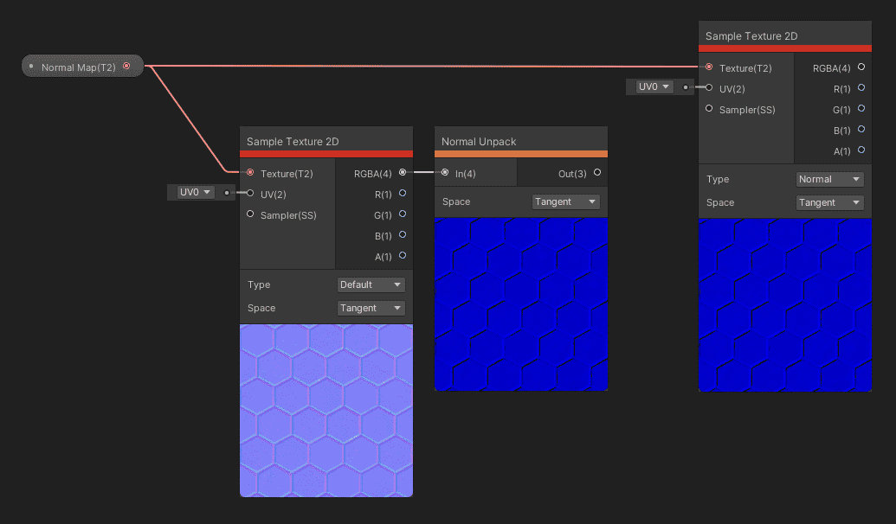
*You can use Normal Unpack, but Sample Texture 2D can do the same thing.*
*您可以使用“法线解包”，但“示例纹理 2D”也可以执行相同的操作。*

### Normal Strength 法线强度节点

`Normal Strength`（法线强度）节点通过**Strength**（强度）浮点参数调整输入法线向量的强度。其核心功能如下：

**功能解析**

1. **输入与输出**

   - **输入**：接收一个 `Vector3` 类型的法线向量（如从法线贴图采样的RGB值）。
   - **输出**：输出一个 `Vector3` 类型的法线向量，其方向与输入一致，但长度（强度）被缩放。

2. **强度控制逻辑**

   - **Strength = 1**：法线保持不变（单位向量）。
   - **Strength = 0**：输出所有方向朝上的平直法线（即 `(0, 0, 1)`），相当于移除表面凹凸细节。
   - **中间值**：按比例缩算法线强度（例如 `Strength = 0.5` 时，法线长度减半）。

3. **数学实现**
   法线缩放公式为：

   Output=Input×Strength

   （注：此操作不会改变法线方向，仅影响其“陡峭程度”）

**典型应用场景**

1. 材质细节控制
   - 通过动态调节法线强度，实现材质磨损（如金属划痕减弱法线强度）或高光增强（如塑料反光强化）。
2. 凹凸贴图修正
   - 修正压缩导致的法线失真（如BC5格式法线贴图需手动调整强度）。
3. 动态光照响应
   - 根据光照角度实时缩放法线强度，模拟表面粗糙度变化。

**注意事项**

- **HDR兼容性**：若输入法线包含HDR值（如亮度超过1），需先通过 `Clamp` 节点限制范围。
- **切线空间匹配**：确保法线强度调整与切线空间坐标系一致，避免光照计算错误。

该节点为法线数据提供了直观的强度控制接口，在材质编辑与光照优化中具有重要实用价值。

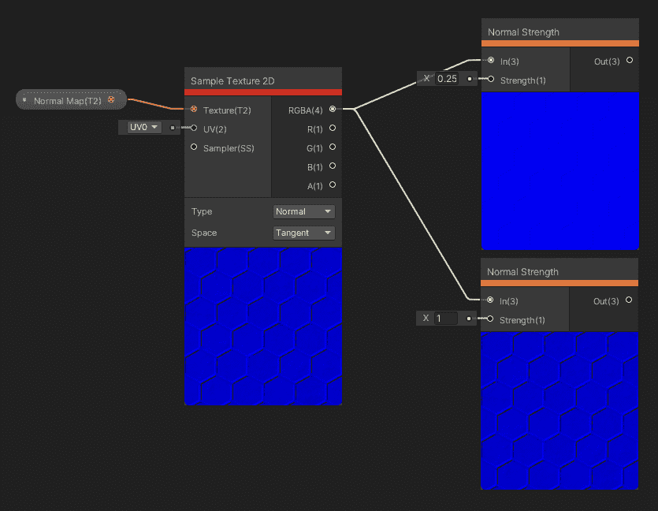
*If your normals are a bit too strong, we can tone them down a little.*
*如果你的法线有点太强了，我们可以把它们调低一点。*

### Normal From Texture 法线生成节点

`Normal From Texture`（法线生成）节点通过高度图（Heightmap）生成法线向量。其核心功能如下：

**输入参数**

1. **Texture**（纹理）
   输入的高度图纹理，通常为单通道（如R通道）存储高度信息。
2. **Sampler**（采样器）
   定义纹理采样方式（如过滤模式、各向异性等级）。
3. **UVs**（纹理坐标）
   输入的UV坐标用于映射高度图到模型表面。
4. **Offset**（偏移量）
   控制法线细节从表面延伸的距离强度（类似法线贴图的"高度缩放"参数）。
5. **Strength**（强度）
   对生成的法线结果进行整体缩放（如设置为0.5时，法线强度减半）。

**数学实现**

1. **高度梯度计算**
   通过采样高度图相邻像素的差值计算法线方向：

   Normal=∥∇Height∥∇Height×Strength
   $$
   \text{Normal} = \frac{
   ∇ \text{Height}}{\|
   ∇ \text{Height}\|} \times \text{Strength}
   $$
   

   - ∇Height：高度梯度（由`Offset`控制采样偏移量）
   - 归一化后乘以`Strength`得到最终法线向量

2. **输出格式**
   输出为切线空间法线（`Vector3`类型），默认范围为[−1,1]。

**典型应用场景**

1. **动态地形生成**
   结合程序化生成的高度图实时计算法线，实现无缝地形细节。
2. **材质磨损效果**
   通过修改高度图偏移量模拟金属划痕或风化痕迹。
3. **视差贴图增强**
   在视差遮蔽贴图（POM）中补充法线信息，提升表面凹凸细节。

**注意事项**

- **高度图归一化**：若输入高度图包含HDR值（如亮度超过1），需先通过`Clamp`节点限制范围。
- **切线空间匹配**：确保生成的法线与模型切线空间坐标系一致，避免光照计算错误。

该节点为程序化法线生成提供了高效解决方案，尤其适用于动态材质与实时地形渲染场景。

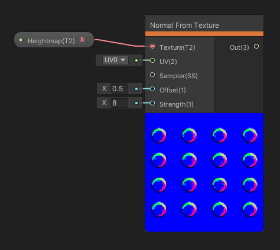
*This provides an easy way to convert heightmaps to normals.*
*这提供了一种将高度贴图转换为法线的简单方法。*

### Normal From Height 高度生成法线节点

`Normal From Height`（高度生成法线）节点通过单通道高度值生成法线向量。其核心特性如下：

**功能解析**

1. **输入差异**

   - **输入源**：接收单个浮点高度值（而非高度图纹理），通常来自程序化生成数据或特定通道采样。
   - **强度控制**：通过**Strength**浮点参数调节法线生成强度（类似`Normal Strength`节点）。

2. **空间模式（Space）**

   - **Tangent Space（切线空间）**：法线方向基于模型切线坐标系，适用于动态光照与纹理细节混合。
   - **World Space（世界空间）**：法线方向基于全局坐标系，适用于全局光照计算或物理模拟。

3. **数学逻辑**
   假设高度值为 *h*，法线生成公式为：
   $$
   \text{Normal} = \frac{\nabla h}{\|
   \nabla h\|} \times \text{Strength}
   $$

其中，$\nabla h$ 表示高度梯度（需通过数值差分估算）。 

**典型应用场景**

1. **程序化地形生成**：结合程序化生成的高度值（如噪声函数输出）实时计算法线，实现动态地貌细节。 
2. **材质参数化控制**：通过强度参数动态调整法线凹凸强度（如模拟金属氧化表面的磨损效果）。 
3. **光照优化**：在世界空间模式下，直接与全局光照系统交互，提升渲染效率。 

 **注意事项**

-  **梯度估算误差**：单高度值需依赖邻近采样点估算梯度，可能导致法线不平滑（建议配合低通滤波）。 
-  **空间一致性**：确保与光照计算使用的坐标系一致（如世界空间法线需与光源位置匹配）。 

该节点为程序化法线生成提供了轻量化解决方案，尤其适用于实时动态材质与简化光照管线场景。

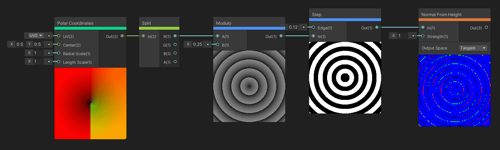
*We can generate height data in the shader and convert it to normals like this.*
*我们可以在着色器中生成高度数据并将其转换为法线，如下所示。*

### Normal Blend 法线混合节点

`Normal Blend`（法线混合）节点通过混合两个法线向量生成新的法线方向。其核心特性如下：

**功能解析**

1. **混合逻辑**
   - **输入**：接收两个 `Vector3` 类型的法线向量（如基础法线贴图 `A` 和细节法线贴图 `B`）。
   - **操作**：将两向量相加后归一化，输出结果为统一方向的法线。
   - **公式**：Output=∥Normal*A*+Normal*B*∥Normal*A*+Normal*B*
2. **模式选择**
   - **Default（默认模式）**：直接混合两法线向量，保留各自方向特征。
   - **Reoriented（重定向模式）**：将细节法线 `B` 的方向对齐至基础法线 `A` 的切线空间，确保细节贴图贴合基础表面形态。
3. **应用场景**
   - **材质细节增强**：混合基础法线（低频细节）与细节法线（高频凹凸），提升表面真实感。
   - **动态表面修复**：通过重定向模式修正法线方向不一致导致的渲染异常（如模型缝合处闪烁）。

**数学实现**

1. **归一化计算**
   混合后的法线需归一化为单位向量：

   Normalized=∥Sum∥Sum,其中 Sum=Normal*A*+Normal*B*

2. **Reoriented模式公式**
   将细节法线 `B` 投影至基础法线 `A` 的切线空间：

   Output=∥Normal*A*+(Normal*B*⋅Tangent*A*)∥Normal*A*+(Normal*B*⋅Tangent*A*)

   （Tangent*A* 为基础法线的切线方向）

**典型应用场景**

1. **地形渲染**
   混合高程贴图生成的法线与静态法线贴图，平衡性能与画质。
2. **角色材质**
   在角色皮肤上叠加毛孔细节法线，增强生物真实感。
3. **动态特效**
   实时混合粒子系统的法线与场景法线，提升光影交互效果。

**注意事项**

- **切线空间一致性**：在 `Reoriented` 模式下需确保基础法线与细节法线的切线空间对齐，否则可能导致细节扭曲。
- **HDR兼容性**：若输入法线包含HDR值（如亮度超过1），需先通过 `Clamp` 节点限制范围。

该节点为法线混合提供了灵活的控制方案，在提升渲染效率的同时增强了材质细节表现力。

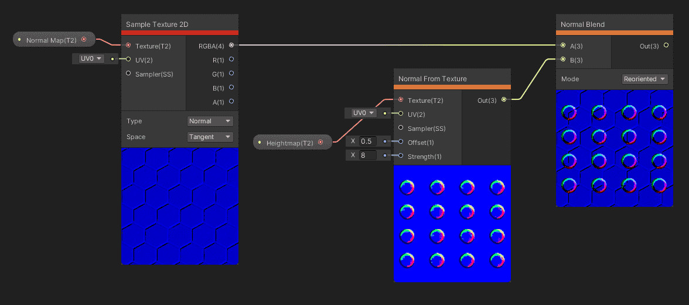
*Will it blend? Well normally, yes.*
*它会混合吗？嗯，通常，是的。*

### Normal Reconstruct Z 法线Z分量重建节点

`Normal Reconstruct Z`（法线Z分量重建）节点通过二维向量推导三维法线缺失的Z分量。其核心特性如下：

**功能解析**

1. **输入与输出**

   - **输入**：接收一个 `Vector2` 类型的法线数据（如存储在纹理RG通道的XY分量）。
   - **输出**：返回完整的 `Vector3` 法线向量，其中Z分量通过计算补全。

2. **数学逻辑**
   假设输入为 $Normal_{XY}=(X,Y)$ ，则Z分量计算公式为：
   $$
   Z = \sqrt{1 - X^2 - Y^2}
   $$
   （注：此为归一化后的结果，默认法线方向朝上）

3. **应用场景**

   - **纹理压缩**：将法线数据存储在纹理的RG通道，蓝色通道用于其他数据（如平滑度/金属度），减少内存占用。
   - **动态光照优化**：通过减少纹理采样次数提升渲染效率（如仅用两次采样代替三次）。

**典型应用场景**

1. **移动端渲染**
   在内存受限的设备上，通过RG通道存储法线XY分量，蓝色通道存储高光强度。
2. **延迟渲染管线**
   将法线数据与其他材质属性（如粗糙度）共享纹理通道，降低GBuffer带宽压力。

**注意事项**

- **法线方向约束**：此方法仅适用于法线方向朝上的情况（如切线空间法线），若法线可能翻转需额外处理。
- **精度损失**：压缩后的法线数据可能存在精度损失，需配合高精度纹理格式（如16位浮点纹理）。

该节点为法线数据压缩与跨通道复用提供了高效解决方案，尤其适用于性能敏感型渲染场景。

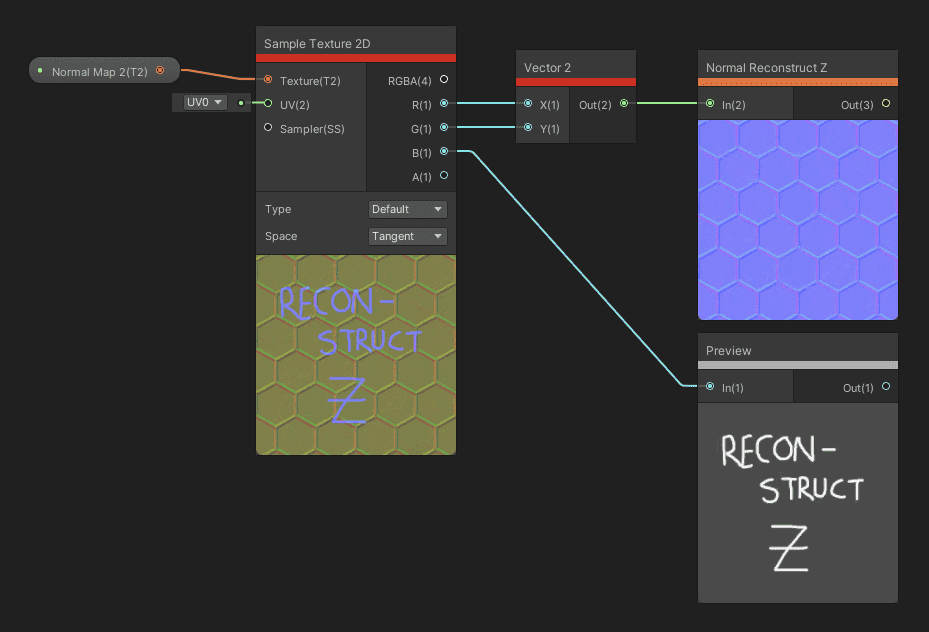
*We can hide extra data by using only two channels for normal data.*
*对于普通数据，我们可以通过仅使用两个通道来隐藏额外的数据。*

## Utility Nodes实用工具节点系列

### Colorspace Conversion 色彩空间转换节点

`Colorspace Conversion`（色彩空间转换）节点可在 **RGB**、**HSV** 和 **Linear** 色彩空间之间转换输入颜色。其核心特性如下：

**功能解析**

1. **输入/输出控制**
   - 通过两个下拉菜单分别选择输入和输出色彩空间（如将HSV颜色转换为线性空间）。
   - 支持模式：
     - **RGB ↔ HSV**：适用于色调调整（如动态改变颜色饱和度）。
     - **RGB ↔ Linear**：用于HDR渲染或光照计算（如将伽马空间颜色转为线性空间）。
2. **数学逻辑**
   - **RGB → HSV**：基于色相（Hue）、饱和度（Saturation）、明度（Value）的极坐标分解。
   - **HSV → RGB**：通过角度与半径反推RGB分量。
   - **RGB ↔ Linear**：通过伽马校正（Gamma Correction）曲线映射（如 *C*linear=*C*gamma2.2）。
3. **应用场景**
   - **材质编辑**：在HSV空间调整颜色属性（如金属氧化后的褪色效果）。
   - **光照计算**：在线性空间进行物理精确的光照积分（如BSDF计算）。
   - **后期处理**：将HDR渲染结果转回伽马空间显示。

**注意事项**

- **精度损失**：HSV空间对亮度值的线性操作可能导致颜色失真（如多次转换后累积误差）。
- **性能开销**：HSV转换涉及三角函数运算，高频调用可能影响性能（建议缓存中间结果）。

该节点为跨色彩空间的颜色操作提供了原子级支持，是高级着色器编程中动态色调控制与物理渲染的核心工具。

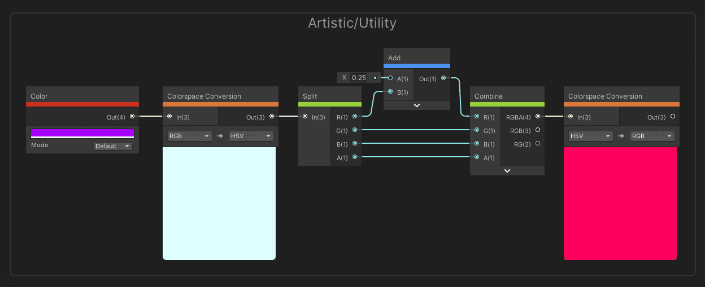
*This makes it easy to work in other color spaces, such as HSV.*
*这使得在其他颜色空间（如 HSV)中工作变得容易。*

# Procedural Nodes 程序化节点系列

在着色器编程或图形工具中，指通过算法生成的节点，常用于动态创建纹理、形状或效果，而非依赖预设资源

## Checkerboard 棋盘格节点

`Checkerboard`（棋盘格）节点用于生成由 **Color A** 和 **Color B** 交替组成的方格图案。其工作原理如下：

- **UV**：用于将棋盘格图案映射到物体表面
- **Frequency**（频率）：通过 `Vector 2` 类型输入分别控制 *X* 和 *Y* 轴方向的方格密度（数值越大，格子越密集）
- **输出**：实际输出为棋盘格颜色（`Vector 3` 类型，代表 RGB 值）

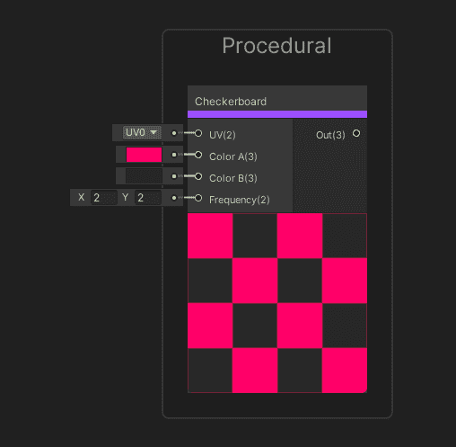
*Checkerboard patterns are great for prototyping especially.*
*棋盘图案特别适合原型设计。*

## Noise Nodes 噪声节点系列

**噪声（Noise）** 是着色器中实现程序化内容生成或材质高度自定义属性的最佳工具之一。
（通过噪声算法可动态生成复杂纹理、地形、运动效果等，同时支持对材质参数进行精细调控，例如颜色渐变、凹凸表面模拟等）

### Simple Noise 简单噪声节点

`Simple Noise` 节点生成一种名为**值噪声（Value Noise）**的基础噪声模式，其核心功能包括：

- **UV 坐标输入**：通过 UV 坐标将噪声映射到模型表面；
- **缩放因子（Scale）**：通过浮点数值控制噪声纹理在 U/V 方向的缩放比例（值越大，噪声细节越平缓）；
- **输出特性**：返回单一浮点值（范围 `0~1`），可直接用于颜色渐变、高度偏移等效果。

该节点适合快速生成平滑的程序化纹理（如云层、抽象表面），但因其为单通道输出，复杂效果需结合多层噪声叠加。

### Gradient Noise 梯度噪声节点

`Gradient Noise` 节点生成一种更为复杂的噪声类型——**Perlin 噪声**，其核心功能包括：

- **UV 坐标输入**：与 `Simple Noise` 节点一致，通过 UV 坐标将噪声映射到模型表面；
- **缩放因子（Scale）**：同样通过浮点数值控制噪声纹理在 U/V 方向的缩放比例（值越大，细节越平缓）；
- **输出特性**：返回单一浮点值（范围通常为 `0~1`），可直接用于颜色渐变、高度偏移或曲面变形等效果。

> **Perlin 噪声的特性与应用**
>
> Perlin 噪声是一种经典的梯度噪声算法，广泛应用于：
>
> 1. **程序化纹理生成**（如云层、岩石表面等有机纹理）；
> 2. **地形生成**（通过多层噪声叠加模拟自然地貌）；
> 3. **动态特效**（如烟雾、水体运动的随机扰动）。
>    其优势在于生成的噪声过渡平滑，适合需要自然随机性的场景。

### Voronoi 沃罗诺伊噪声节点

**`Voronoi` 节点** 是一种兼具视觉美感与功能性的噪声生成工具，其核心原理是通过 **网格点分布** 生成图案。以下是其核心机制与功能解析：

**核心参数与功能**

1. UV 坐标输入
   - 用于将噪声映射到模型表面的位置，控制噪声的平铺与分布。
2. 角度偏移（Angle Offset）
   - 通过浮点数值随机旋转网格点的方向，打破对称性，增加自然感。
3. 单元密度（Cell Density）
   - 控制网格中生成的点的数量（数值越大，点越密集，图案细节越复杂）。

**输出特性**

|       输出端口        |                           功能描述                           |                     应用场景                     |
| :-------------------: | :----------------------------------------------------------: | :----------------------------------------------: |
|   **Out**（主输出）   | 返回当前像素到最近网格点的 **距离值**（浮点数），直接生成经典的沃罗诺伊图案： - 距离越近 → 值越小（通常显示为深色） - 距离越远 → 值越大（通常显示为浅色） | 程序化材质（如裂纹、星云）、地形高度图、动态特效 |
| **Cells**（单元数据） | 输出网格点的原始分布信息（颜色基于每个单元的随机 X 轴偏移生成）。 - 可理解为“未处理”的噪声源数据 |          混合多层级噪声、控制随机化权重          |

**技术特点与用途**

- **自然纹理生成**：适用于模拟蜂窝、树叶脉络等有机结构。
- **动态变形**：结合 **UV 动画** 或 **参数控制**，可实现流动的腐蚀、能量扩散效果。
- **多层叠加**：与 `Simple Noise` 或 `Gradient Noise` 混合，增强细节层次（例如：`Out` 值控制主纹理强度，`Cells` 值调制边缘锐度）。

> 📌 **注意**：Unity 的 `Voronoi` 节点默认输出为单通道浮点值，若需多通道颜色输出，需通过数学节点（如 `Lerp` 或 `Component Mask`）二次处理。

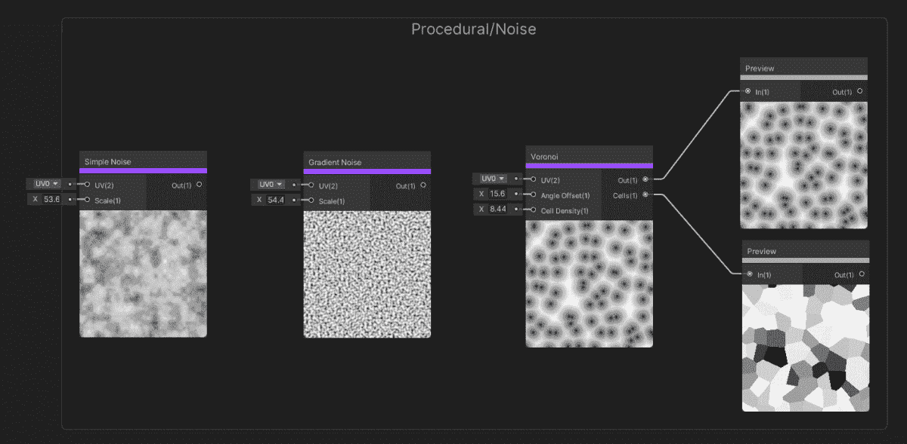
*Noise is your best friend when dealing with procedural materials.*
*在处理程序化材质时，噪音是您最好的朋友。*

## Shapes Nodes 形状节点系列

**形状节点族（Shapes Node Family）** 均基于 **有符号距离场（Signed Distance Field, SDF）** 技术实现，其核心特征如下：

- **SDF 原理**：
  通过数学函数描述形状的轮廓，将 ​**形状内部**​ 表示为白色（距离值为正），​**外部**​ 表示为黑色（距离值为负），灰度值则对应到表面的渐变距离。
- 应用特性：
  - 无锯齿边缘：SDF 的数学特性天然支持高清渲染；
  - 高效存储：复杂形状可通过简单函数快速生成；
  - 动态变形：通过修改输入参数（如半径、位置）实时调整形状。

### Rectangle 矩形节点

**`Rectangle（矩形节点）`** 通过输入 **UV（纹理坐标）** 及 **Width（宽度）**、**Height（高度）** 两个浮点参数，在着色器中生成矩形形状的遮罩。其核心特性如下：

- **参数范围**：宽度和高度需归一化至 `0~1`（与 UV 坐标系一致）。若两者数值相同，则生成正方形区域。
- **输出逻辑**：节点输出值为 **1（白色）** 表示当前像素位于矩形区域内，**0（黑色）** 则表示在区域外。
- **使用限制**：基于有符号距离场（Signed Distance Field, SDF）的形状生成节点，仅能在 **片段着色阶段（Fragment Stage）** 运行。

该节点常用于局部遮罩控制（如腐蚀效果、区域发光），或与其他节点（如 `Lerp（线性插值节点）`）结合实现动态混合效果。

###  Rounded Rectangle 圆角矩形节点

`Rounded Rectangle（圆角矩形节点）` 的功能与 `Rectangle（矩形节点）` 完全一致，但新增了 `Radius（半径）` 浮点参数，用于控制矩形边角的圆滑程度。通过调整 `Radius` 值，可以实现从尖锐直角到圆弧的过渡效果。

> **核心差异总结**
>
> 1. 相同点：
>    - 输入参数（`UV（纹理坐标）`、归一化宽高）与输出逻辑（区域内输出 `1`，区域外输出 `0`）与 `Rectangle（矩形节点）` 完全相同。
> 2. 新增功能：
>    - Radius（半径）决定边角圆滑度（数值越大，圆角越明显）。例如：
>      - `Radius=0.1` → 轻微圆角；
>      - `Radius=0.5` → 接近半圆的边角。


###  Ellipse 椭圆节点

`椭圆（Ellipse）` 节点通过输入 **宽度（Width）、** **高度（Height）** 两个浮点参数及 **纹理坐标（UV）**的 `Vector2` 值生成椭圆形状。若宽高值相等，则输出结果为标准的 **圆形（Circle）**。

> **补充说明**
>
> - 参数逻辑与 `矩形（Rectangle）` 类似，但宽高可独立控制比例，例如 `Width=0.8`、`Height=0.4` 可生成横向椭圆；
> - 当宽高相等时，算法自动简化为圆形，适用于需要动态切换椭圆/圆形的场景（如 UI 图标、粒子轮廓）。

###  Polygon 多边形节点

`Polygon` 节点使用相同的 **Width**（宽度）、**Height**（高度）和 **UV** 输入，并新增了一个 **Sides**（边数）输入，用于定义形状的边数。如果宽度和高度不同，结果将是一个被拉伸的正多边形。

### Rounded Polygon 圆角多边形节点

最后，`Rounded Polygon` 节点具有与 `Polygon` 节点相同的输入，并新增了一个 **Roundness**（圆角度）浮点选项，其作用类似于 `Rounded Rectangle` 的半径选项。

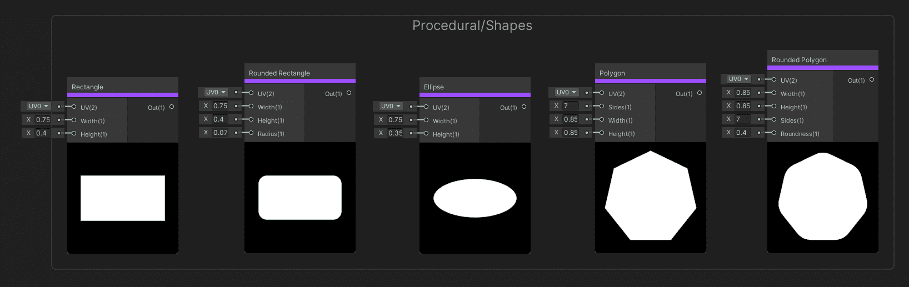
*These SDF-based shape nodes give you a good starting point for procedural materials.*
*这些基于 SDF 的形状节点为程序化材质提供了良好的起点。*

# Utility Nodes 实用工具节点系列

这些工具节点最初设计用于处理多种辅助功能，但实际应用中，其中三个节点功能尤为强大——它们能够从根本上重塑节点图的工作逻辑...此外还有 `Preview`（预览）和 `Redirect`（重定向）节点也值得关注。

## Preview 预览节点

`Preview`（预览）节点接收矢量输入并原样输出。使用此节点的目的是实时呈现当前着色器在此阶段的视觉效果，因此它在**视觉调试着色器**时极为实用。在早期未引入`Redirect`（重定向）节点（可通过双击边添加）的Shader Graph版本中，`Preview`节点还曾承担过一项附加功能——在特别杂乱的节点图中辅助重定向连接线。

双击任意节点输入/输出之间的连接线，即可在其间生成一个 `Redirect`（重定向）节点。该节点不会影响着色器输出，但你可以移动它来整理节点图——尤其在复杂布线中，这种操作能显著优化视觉布局。

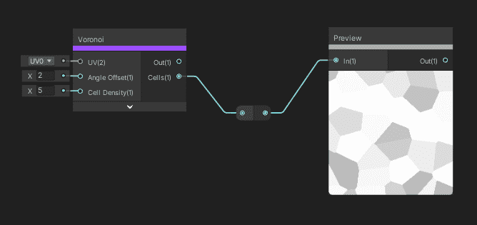
*Preview doesn’t work on every input - mostly just colors and vectors.*
*预览并不适用于每个输入 - 大多数情况下只适用于颜色和矢量。*

##  Keyword 关键字节点

这些节点在「创建节点」菜单中自成分类，但我选择在此集中讲解。当你在图中拖入某个`Keyword`（关键字）节点时——该节点类型取决于你已添加的材质**关键字属性**——它将呈现多个输入端口与一个输出端口。节点会根据**检视面板**中该材质对应关键字的当前取值，自动选择对应的关键字输入分支。例如使用**布尔型关键字**时，可将不同逻辑分支连接到**On**（开启）与**Off**（关闭）输入接口，最终输出由关键字的布尔状态决定。这种机制为材质分支逻辑提供了灵活的无缝切换方案。

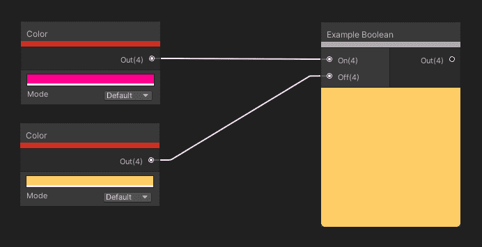
*Based on the value of the keyword, the output of the node will change.*
*根据关键字的值，节点的输出将发生变化。*

## Sub Graph 子图节点

这些节点与`Keyword`（关键字）节点类似，被归类在独立的菜单区域中。**子图（Sub Graph）**是一种可独立创建的特殊着色器图。每个子图拥有自己的输出节点（可自定义输出端口），当我们在子图中定义属性时，这些属性将转化为子图节点的输入接口。在子图内部，我们仍能以常规方式创建节点逻辑。完成子图设计后，即可在主图中通过搜索调用它——此时子图的属性会显示为节点左侧的输入端口，而子图内部的输出端则会统一整合到节点右侧的输出面板中。这种模块化设计大幅提升了复杂着色器网络的复用性和可维护性。

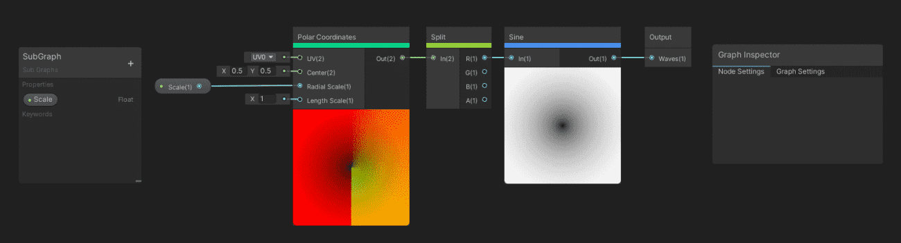
*Sub Graphs lets us condense lots of nodes into a single node.*
*子图允许我们将许多节点压缩到一个节点中。*

## Custom Function 自定义函数节点

`Custom Function`（自定义函数）节点允许我们在节点内部编写自定义着色器代码。此处不深入展开（该节点可能是所有节点中最复杂且高度定制化的类型之一），但通过点击**Node Settings**（节点设置），我们可以定义任意类型的输入/输出接口列表，随后既能附加外部着色器代码文件，也能直接在设置窗口内编写代码。此类自定义代码需采用HLSL语言编写，并可通过指定文件中的特定函数名称来调用该节点的功能。

详尽的中文介绍看这里：[自定义函数节点 | Shader Graph | 10.5.0](https://docs.unity3d.com/cn/Packages/com.unity.shadergraph@10.5/manual/Custom-Function-Node.html)

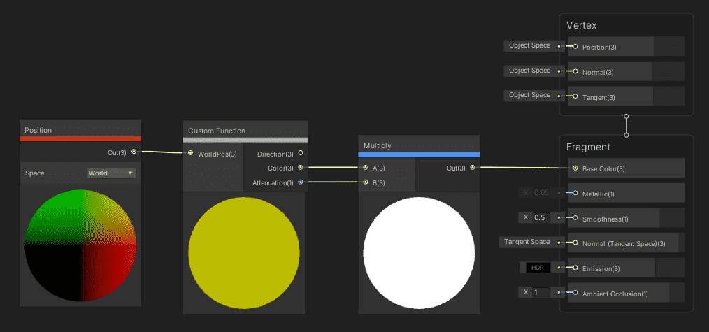
*A common operation with custom function nodes is to get information from lights in the scene.*
*自定义函数节点的一个常见操作是从场景中的灯光获取信息。*

## Logic Nodes 逻辑节点系列

为了转换一下心情，我们现在可以轻松切入**布尔逻辑（Boolean Logic）**节点的学习。这类节点专门用于处理真/假条件判断，为后续复杂逻辑组合奠定基础。

###  And 与节点

与节点采用两个布尔值，可以是 true 或 false、1 或 0。如果它们都为 true 或 1，则此节点返回 true。否则，节点将返回 false。

### Or 或节点

或节点还接受两个布尔输入。如果其中一个或两个都为 true，则节点输出 true。否则，它输出 false。

### Not 非节点

非节点采用单个输入并返回相反的值。换句话说，如果 true 是输入，则 false 是输出。

###  Nand 或非节点

`Nand` 节点的理论功能相当于先执行 `And` 运算，再将结果输入 `Not` 节点——即 **当两个输入均为 `true` 时输出 `false`，其他情况均输出 `true`**。

但实际测试发现，该节点的行为似乎更像 **`Nor` 运算**（两者均为 `false` 才输出 `true`），而非标准的 `Nand` 逻辑。这一差异可能需要进一步验证是否为引擎的特定实现或 Bug。

### All 无零节点

该节点接受值的向量。如果每个元素都不为零，则节点的输出为 true。

### Any 非全零节点

另一方面，`Any` 节点同样接收一个向量作为输入，但它的判断逻辑与 `All` 不同——**只要输入向量中任意一个分量不为零**，该节点就会返回 `true`。

### Comparison 比较节点

`Comparison`（比较）节点用于对两个浮点数输入值进行比较。通过节点中部下拉菜单选择具体的 **比较运算符** 后，该节点会输出对应的布尔值结果。

可用的比较运算包括：

- **Equal**（等于）
- **Not Equal**（不等于）
- **Less**（小于）
- **Less Or Equal**（小于或等于）
- **Greater**（大于）
- **Greater Or Equal**（大于或等于）

例如：当输入值分别为 **7** 和 **5**，且选择 **Greater**（大于）运算时，节点将输出 `True`。

### Branch 条件判断节点

`Branch` 节点可用于在着色器中实现条件判断，其功能类似于 C# 中的 `if` 语句。当 **Input** 条件为 `true` 时，该节点将输出 **True** 端连接的数值；反之则输出 **False** 端的数值。

需要注意的是，无论条件是否成立，**True** 和 **False** 两端的节点树都会 **完整执行计算**，无效分支的结果最终会被丢弃。因此，应避免在两端接入过于庞大的节点树。如果可能，尽量将条件判断 **提前** 至计算流程的早期，以减少两侧分支的运算负担。

###  Is NaN 非数字判断节点

`Is NaN` 节点的全称是 "Is not a number"（意为 "非数字"）。在浮点数运算中，**NaN** 是一个特殊值，用于表示无效的数值。当输入的浮点数为 **NaN** 时，该节点返回 `true`，否则返回 `false`。

###  Is Infinite 无限大判断节点

类似地，**Infinite**（无限大）是浮点数可以表示的一个特殊值。当输入值为无限大时，`Is Infinite`（是否为无限大）节点将返回 `true`。

### Is Front Face 网格正面判断节点

网格通过顶点的 **缠绕顺序**（即顶点在网格数据中的排列顺序）来定义面是正面还是背面。这意味着，除非在 **Graph Settings**（图形设置）中勾选了 **Two Sided**（双面）选项，否则 `Is Front Face`（是否为正面）节点将始终返回 `true`。而一旦启用该选项，我们就可以根据网格面的朝向动态调整着色器的表现。

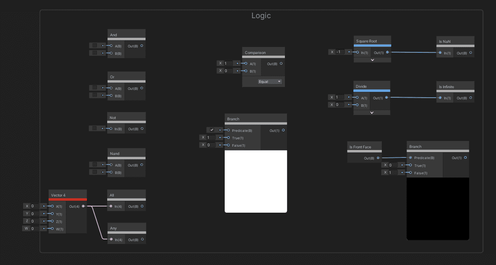
*There’s a lot of logic-based nodes - not much else accepts a Boolean.*
*大部分节点都是基于逻辑运算的——其他能接受布尔值输入的节点则相对较少。这种设计源于图形编程中布尔逻辑的强控制特性（如开关材质功能、动态分支选择），使得开发者需要通过显式转换（如`Boolean to Float`节点)将布尔值适配到其他需要数值输入的节点接口。*

------

# Conclusion 结语

Shader Graph 是一款用于构建着色器的出色可视化工具，虽然它尚未涵盖着色器的所有用例（最值得注意的是，它缺少对曲面细分和几何着色器以及模板的支持），但开箱即用的节点数量之多使其成为 Unity 的绝佳选择。

这篇文章花了很长时间才整理出来，YouTube 视频版本也是如此，所以感谢您的阅读和观看。如果您喜欢这个或学到了什么，我将不胜感激您查看我的 YouTube。那里发布的内容与我的网站上的内容相同，我需要尽可能多的支持来发展两者！看看我的 Patreon——订阅者可以抢购一堆好东西。下次再见，玩得开心制作着色器！

------

- [YouTube](https://www.youtube.com/dilett07)
- [GitHub](https://github.com/daniel-ilett)
- [Twitter](https://twitter.com/daniel_ilett)
- [itch.io](https://danielilett.itch.io/)
- [Patreon](https://www.patreon.com/danielilett)

Daniel Ilett  • 2023
丹尼尔·伊莱特