# 如何使用 Unity Shader Graph 中的每个节点

**Posted on May 20, 2021**

Shader Graph ships with a lot of nodes. Over 200, as of Shader Graph 10.2! With such a vast array of features at your disposal, it’s easy to get lost when you’re searching for the perfect way to make the shader you have in mind. This tutorial shows you every single node in action, complete with examples, explanations of every input and output, and even best practices for certain nodes!

Shader Graph 附带了很多节点。超过 200 个，截至 Shader Graph 10.2！有了如此广泛的功能供您使用，当您在寻找制作您心目中的着色器的完美方法时，很容易迷失方向。本教程向您展示了每个节点的运行情况，包括示例、每个输入和输出的解释，甚至是某些节点的最佳实践！

Health warning: you don’t have to read this all at once! Jump back in at your own leisure to check what a few nodes do if you need a refresher. A little bit of shader background is required, as some terms and concepts are only briefly explained.

健康警告：您不必一次阅读所有内容！如果您需要复习，请在闲暇时返回，检查几个节点的作用。需要一点着色器背景，因为一些术语和概念只是简要解释。

------

# What is Shader Graph?

Let’s start with a quick run-down of what Shader Graph is and why it exists. Shaders are mini programs that run on the GPU, and they do things like texture mapping, lighting or coloring your objects in fancy ways, but you probably already know that if you clicked on this article. Traditionally, shaders have existed solely in code, but that’s not very approachable or accessible for artists who don’t code. Enter Shader Graph: an alternative to code shaders which uses **nodes** representing different functions which users can plug into each other on a visual and interactive **graph**. I like to think of them as code’s fun cousin.

让我们先快速了解一下 Shader Graph 是什么以及它存在的原因。着色器是在 GPU 上运行的小程序，它们可以以花哨的方式执行纹理映射、照明或为对象着色等操作，但如果您单击本文，您可能已经知道了。传统上，着色器仅存在于代码中，但对于不编码的艺术家来说，这并不是很平易近人或易于访问。进入Shader Graph：代码着色器的替代品，它使用代表不同函数**的节点**，用户可以在可视化和交互**式图形**上相互插入。我喜欢把它们看作是代码的有趣表亲。

I won’t cover the nodes that are contained in the **High Definition Render Pipeline** package - I’ll only be covering those contained within the base Shader Graph package. I’ll also cover a bit of prerequisite knowledge before we dive into shaders!

我不会介绍**高清渲染管线**包中包含的节点 - 我只介绍基本 Shader Graph 包中包含的节点。在我们深入研究着色器之前，我还将介绍一些先决条件知识！

------

# Spaces

It’s best if we briefly talk about spaces before talking about nodes. Many nodes expect their inputs or outputs to be in a specific space, which is sort of a way of representing a position or direction vector. Here’s the spaces commonly seen in Shader Graph.

在讨论节点之前，我们最好先简要讨论一下空间。许多节点希望它们的输入或输出位于特定空间中，这是一种表示位置或方向向量的方式。以下是 Shader Graph 中常见的空间。

## Object Space

In **object space**, the position of all vertices of a model are relative to a centre point or pivot point of the object.

在**对象空间**中，模型的所有顶点的位置都相对于对象的中心点或枢轴点。

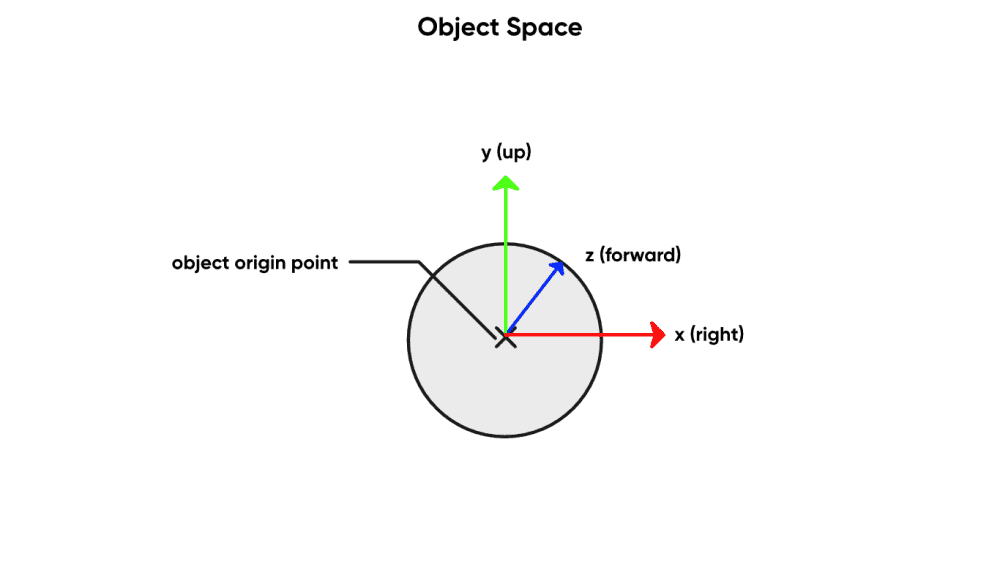

## World Space

In **world space**, we can have several objects, and now the positions of the vertices of every model are relative to a world origin point. In the Unity Editor, when you modify the position of any Transform, you are modifying the world space of an object.

在**世界空间**中，我们可以有多个对象，现在每个模型的顶点位置都相对于一个世界原点。在 Unity 编辑器中，当您修改任何变换的位置时，您正在修改对象的世界空间。

## Absolute World Space vs World Space

Here’s where render pipelines muddy the water a bit. In both URP and HDRP, **absolute world space** always uses the description I just used for world space. In URP, this definition is also used for **world space**. But HDRP uses **camera-relative rendering**, where the positions of objects in the scene become relative to the camera position (but not its rotation); **world space** in HDRP is camera-relative, whereas **absolute world space** is not.

这是渲染管道使水变得有点浑浊的地方。在 URP 和 HDRP 中，**绝对世界空间**总是使用我刚才对世界空间的描述。在URP中，这个定义也用于**世界空间**。但 HDRP 使用**相机相对渲染**，其中场景中对象的位置相对于相机位置（但不是其旋转）变为相对于摄像机位置;HDRP 中的**世界空间**是相对于相机的，而**绝对世界空间**则不是。

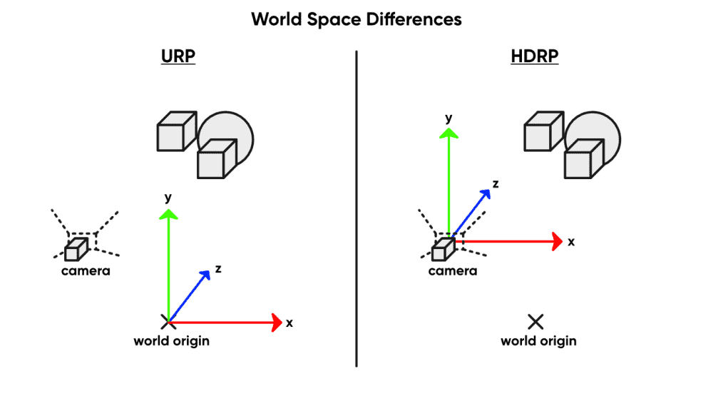

## Tangent Space

In **tangent space**, positions and directions are relative to an individual vertex and its normal.

在**切线空间**中，位置和方向相对于单个顶点及其法线。

## View/Eye Space

In **view/eye space**, objects are relative to the camera and its forward-facing direction. This differs from **camera-relative rendering** because the rotation of the camera is taken into account.

在**视图/眼睛空间**中，对象相对于相机及其前向方向。这与**相机相对渲染**不同，因为相机的旋转被考虑在内。

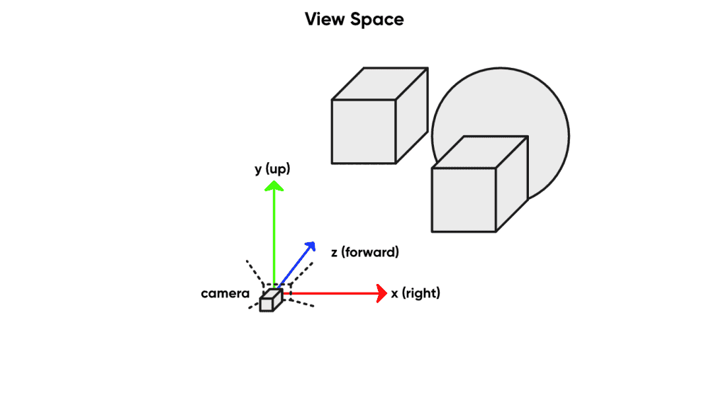

## Clip space

In **clip space**, objects are now relative to the screen. This space exists after view space has been projected, which depends on the camera field-of-view and clipping planes, and usually, objects outside of the clip space bounds get clipped (also called culled, but it basically means ‘deleted’), hence the name.

在**裁剪空间**中，对象现在相对于屏幕。这个空间在投影视图空间后存在，这取决于摄像机的视野和剪裁平面，通常，剪辑空间边界之外的对象会被剪裁（也称为剔除，但基本上意味着“删除”），因此得名。

------

# Block Nodes

All graphs end with the **block nodes**, which are found in the **Master Stack**. These are the outputs of the shader, and you must plug the outputs of other nodes into these special blocks in order for the shader to do anything. If you’re using a version of Shader Graph prior to Version 9.0, you’ll be using **Master Nodes** instead - they’re basically the same thing, but less modular, so this section still largely applies. Some nodes only work on the **vertex stage** or **fragment stage** of your shader, which I’ll make clear where relevant. Let’s start with the **vertex stage blocks**.

所有图形都以**块节点**结尾，这些节点位于**主堆栈**中。这些是着色器的输出，您必须将其他节点的输出插入到这些特殊块中，以便着色器执行任何操作。如果您使用的是 9.0 版之前的 Shader Graph 版本，则将改用**主节点** - 它们基本上是一回事，但模块化程度较低，因此本节在很大程度上仍然适用。某些节点仅在着色器的**顶点阶段**或**片段阶段**上工作，我会在相关的地方明确说明。让我们从**顶点阶段块**开始。

## Vertex Stage Blocks

顶点阶段

For the vertex stage, the shader takes every vertex on a mesh and moves them into the correct position on-screen. We can toy with the vertices to move them around or change the way lighting will interact with them. Each of the following blocks expects an input in **object space**.

对于顶点阶段，着色器获取网格上的每个顶点，并将它们移动到屏幕上的正确位置。我们可以玩弄顶点来移动它们或改变照明与它们交互的方式。以下每个块都需要**对象空间**中的输入。

### ₁ Position (Block)

The `Position` block defines the position of each vertex on a mesh. If left unchanged, each vertex position will be the same as they do in your modelling program, but we can modify this `Vector 3` to physically change the location of vertices in the world. You can use this for any effect which requires physically moving the mesh, such as ocean waves, but unfortunately, we can’t modify positions of individual pixels/fragments, only vertices.

该模块定义每个顶点在网格上的位置。如果保持不变，则每个顶点位置将与建模程序中的位置相同，但我们可以对这个Vector3进行修改以物理方式更改顶点在世界中的位置。您可以将其用于任何需要物理移动网格的效果，例如海浪，但不幸的是，我们无法修改单个像素/片段的位置，只能修改顶点。

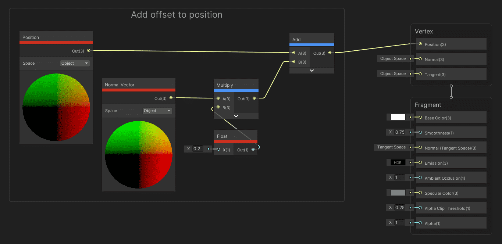*Add an offset to the Position along the vertex normals to inflate a model.*
*沿顶点法线向“位置”添加偏移量以充气模型。*

### ₂ Normal (Block)

The `Normal` block defines the direction the vertex normal points in. This direction is key to many lighting calculations, so changing this may change the way lighting interacts with the object. We can change this per-pixel in the fragment stage with another block node, unlike the `Position`. As with the `Position` block, this is a Vector 3.

该模块定义顶点法线指向的方向。这个方向是许多光照计算的关键，因此改变这个方向可能会改变光照与对象交互的方式。我们可以在片段阶段使用另一个块节点更改此每个像素，这与 Position一样，这是一个  Vector 3

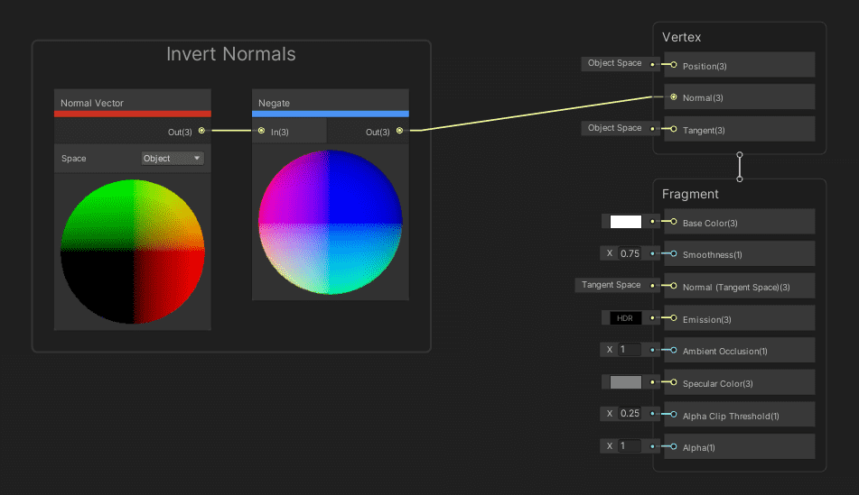*This graph will invert lighting on your object.  此图将反转对象上的照明*

### ₃ Tangent (Block)

The tangent vector lies perpendicular to the vertex normal, and for a flat surface, it usually rests on the surface of the object. We can modify the `Tangent` block to change the tangent vector - I recommend you change this if you change the vertex normal so that it is still perpendicular. This is also a  Vector 3.

切向量垂直于顶点法线，对于平面，它通常位于物体的表面上。我们可以修改块以更改切向量 - 如果您更改顶点法线以使其仍然垂直，我建议您更改此设置。这也是一个 Vector 3

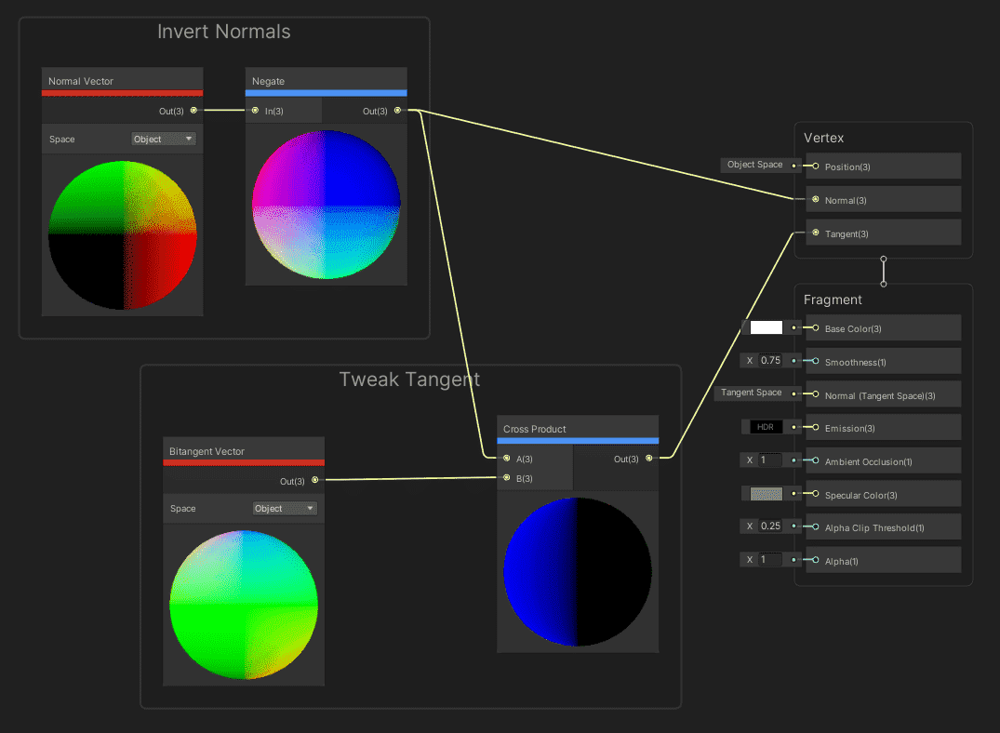*If modifying the normals, it’s a good idea to modify the tangent too.*
*如果修改法线，最好也修改切线*

## Fragment Stage Blocks

片元阶段

Once the vertex stage has finished translating the vertices to their new positions, the screen is **rasterized** and turned into an array of **fragments** - usually, each fragment is one pixel, although in certain circumstances, they can be sub-pixel sized. For simplicity, we’ll assume fragments and pixels are interchangeable from now on. The fragment stage blocks operate on each pixel.

一旦顶点阶段完成将顶点转换为其新位置，屏幕就会**栅格化**并变成**片段**数组 - 通常，每个片段都是一个像素，尽管在某些情况下，它们可以是亚像素大小。为简单起见，我们假设片段和像素从现在开始是可以互换的。片段阶段块对每个像素进行操作。

### ₄ Base Color (Block)

This was called `Albedo` in some versions of Shader Graph. The `Base Color` would be the color of the object if all lighting, transparency and other effects were taken out of the equation.

这在某些版本的 Shader Graph 中叫做 Albeo。如果将所有照明、透明度和其他效果都排除在外，则Base Color将是对象的颜色。

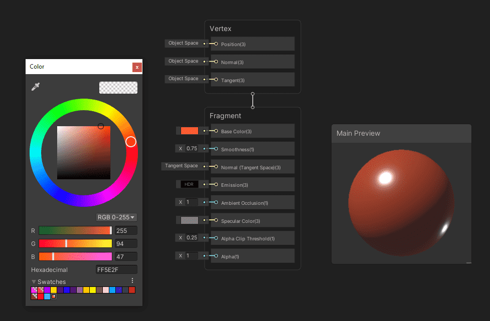*Shader Graph uses the same Color window as other parts of Unity.* 
*Shader Graph 使用与 Unity 其他部分相同的颜色窗口。*

### ₅ Normal (Tangent/Object/World) (Block)

As we saw, the vertex stage has its own normal block - we can access that normal, make further modifications per-pixel, and return a new normal vector for Unity’s built-in lighting calculations. There are three blocks called `Normal`, which is a bit confusing, but each one just expects a normal vector in a different space - tangent, object or world. Only one can be active at a time - select the one you want in the **Graph Settings** using the **Fragment Normal Space** option.

正如我们所看到的，顶点舞台有自己的法线块 - 我们可以访问该法线，对每个像素进行进一步的修改，并为 Unity 的内置光照计算返回一个新的法向量。有三个块称为 ，这有点令人困惑，但每个块都期望在不同的空间（切线、对象或世界）中有一个法向量。一次只能有一个处于活动状态 - 使用**“片段法线空间**”选项在**“图形设置**”中选择所需的一个。

### ₆ Emission (Block)

Emissive light is great for creating bloom around objects. Think neon lights, glowing flames, or magic spells. The `Emission` block accepts an **HDR** color, which gives us the ability to ramp up the intensity of a light far beyond what colors usually allow.

自发光非常适合在物体周围产生光晕。想想霓虹灯、炽热的火焰或魔法咒语。该色块接受 **HDR** 颜色，这使我们能够将光的强度提高到远远超过颜色通常允许的强度。

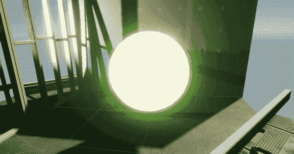*Setting a high-intensity green emission gives objects an alien glow.*
*设置高强度的绿色发射会给物体带来外星光芒。*

### ₇ Metallic (Block)

The `Metallic` block expects a float. When it is 0, the lighting on the objects acts as if it is completely non-metallic, and when it is 1, the object is totally metallic. This only has an effect when using a **Metallic** workflow - choose between this and **Specular** using the **Workflow** option in the **Graph Settings** (your material must be **Lit** for the option to appear).

”金属”块需要一个浮点数。当它为 0 时，物体上的照明就好像它完全是非金属的，当它为 1 时，物体是完全金属的。这仅在使用**金属**工作流程时才有效 - 使用**“图形设置**”中的**“工作流程**”选项在此工作流程和**“镜面反射**”之间进行选择（您的材质必须为**“点亮**”才能显示该选项）。

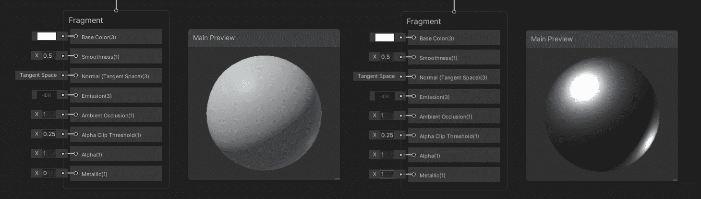*The same material, with Metallic set to 0 and 1 respectively.*
*相同的材质，金属色分别设置为 0 和 1。*

### ₈ Specular (Block)

Unlike `Metallic`, the `Specular` block expects a color as input, because specular highlights can be tinted different colors. The brighter the color, and the closer to white the color is, the larger the highlights.

与Metallic 不同，该块需要一种颜色作为输入，因为镜面高光可以着色不同的颜色。颜色越亮，颜色越接近白色，高光越大

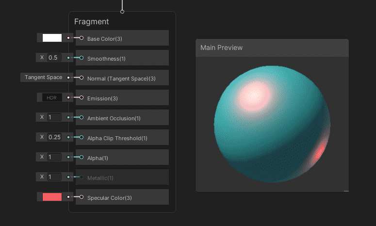*Colored specular highlights can make the rest of the material look kind of strange!*
*彩色镜面高光可以使材料的其余部分看起来有点奇怪！*

### ₉ Smoothness (Block)

The smoother an object, the more visible lighting highlights are. When `Smoothness` is 0, the surface lighting acts rough and matte. When it is 1, the surface acts like it’s polished to a mirror sheen.

对象越平滑，可见的照明高光就越多。当为 0 时，表面照明表现粗糙且哑光。当它为 1 时，表面就像被抛光成镜面光泽一样。

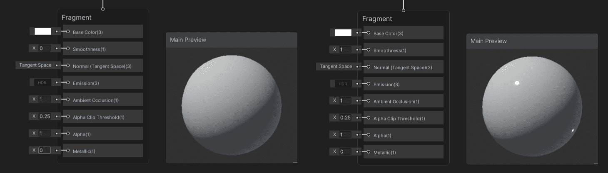*Setting smoothness to 1 results in sharper highlights.*
*将平滑度设置为 1 可产生更清晰的高光。*

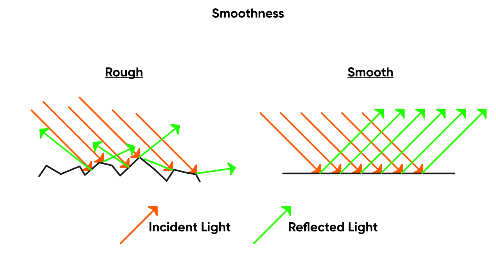*Here’s how smoothness works under the hood.*
*以下是引擎盖下的平滑度工作原理。*

### ₁₀ Ambient Occlusion (Block)

`Ambient Occlusion` is a measure of how obscured a pixel is from light sources by other objects in the scene, such as walls. This is a float - when it is 0, the pixel should be fully lit according to whatever lighting falls on it. When it is 1, the lighting is artificially reduced to the minimum amount.

`Ambient Occlusion`(环境光遮蔽)用于衡量像素被场景中其他对象（如墙壁）遮挡的光源程度。这是一个浮点数 - 当它为 0 时，像素应根据落在它上面的任何光线完全照亮。当它为 1 时，照明被人为地减少到最小量。

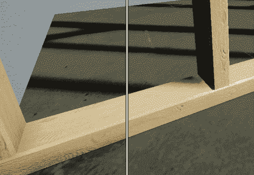*Ambient Occlusion can be used to add slight shadows around object boundaries (see left).*
*环境光遮蔽可用于在对象边界周围添加轻微的阴影（见左图)。*

### ₁₁ Alpha (Block)

`Alpha` is a measure of how transparent a pixel is, and like many other blocks, it runs from 0 to 1, where 0 is totally transparent and 1 is fully opaque. Rendering transparency is more computationally expensive than rendering opaque objects, so we need to pick the **Transparent** **Surface** option in the **Graph Settings** for Unity to treat this shader properly.

`Alpha`是衡量像素透明度的度量，与许多其他块一样，它从 0 到 1，其中 0 是完全透明的，1 是完全不透明的。渲染透明度比渲染不透明对象的计算成本更高，因此我们需要在 Unity 的图形**设置**中选择“**透明表面**”选项来正确处理此着色器。

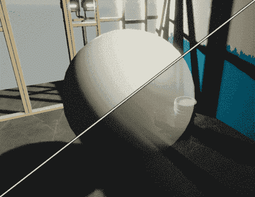*Turning down alpha makes the object more transparent.*
*调低 alpha 会使对象更加透明。*

### ₁₂ Alpha Clip Threshold (Block)

Alpha clipping is a technique where pixels with an alpha below a specific threshold get culled. We can enable the `Alpha Clip Threshold` block in the **Graph Settings** by ticking the **Alpha Clip** option. This works regardless of whether the **Surface** is set to **Transparent** or **Opaque**, so the `Alpha` block isn’t always completely useless on opaque materials! This is useful for fake-transparency effects where opaque rendering is used, but pixels are culled in a pattern to create the illusion of transparency.

Alpha 剪裁是一种技术，其中 Alpha 低于特定阈值的像素被剔除。我们可以通过勾选 **Alpha Clip** 选项在 **Graph Settings** 中启用该块。无论 **Surface** 是设置为**“透明**”还是**“不透明**”，这都有效，因此该块在不透明材质上并不总是完全无用！这对于使用不透明渲染的假透明效果很有用，但像素会以图案剔除以创建透明错觉。

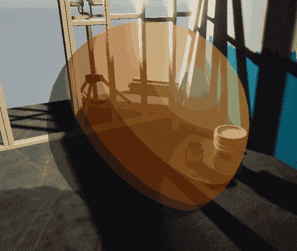*Look closely - every pixel on the sphere is opaque, but the whole thing seems transparent.*
*仔细观察 - 球体上的每个像素都是不透明的，但整个东西似乎是透明的。*

------

# Properties & The Blackboard

Properties provide an interface between the shader and the Unity Editor. We can expose variables, called properties, to the Editor’s Inspector window while also giving us a tidy place to store all the graph’s variables. You can search for them in the Create Node menu like any node, or drag them from the properties list - called the **Blackboard** - to the main graph surface. To add a new property, use the plus arrow on the Blackboard and select the property type you want.

属性在着色器和 Unity 编辑器之间提供接口。我们可以将称为属性的变量公开到编辑器的检查器窗口，同时还为我们提供了一个整洁的位置来存储图形的所有变量。您可以像搜索任何节点一样在“创建节点”菜单中搜索它们，或者将它们从属性列表（称为 **Blackboard**）拖到主图形表面。要添加新属性，请使用 Blackboard 上的加号箭头并选择所需的属性类型。

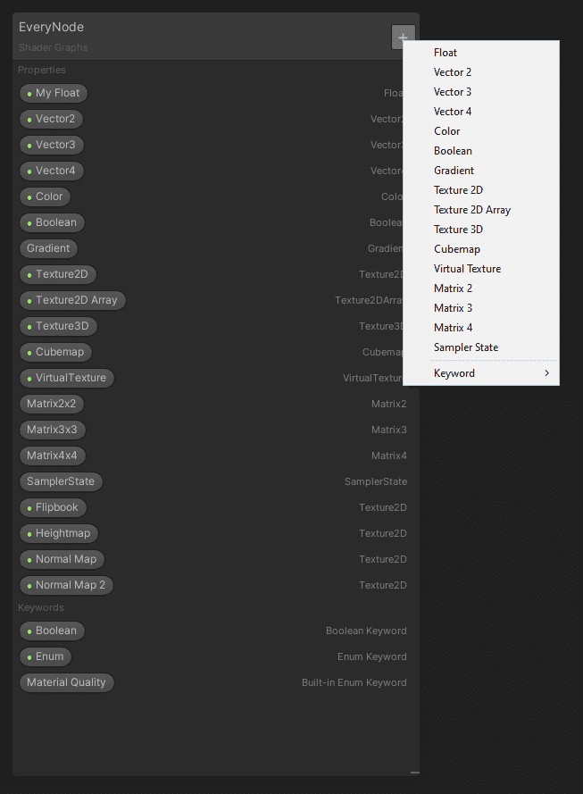*Press the plus arrow to add new properties.*
*按加号箭头添加新属性。*

## Property Types

### ₁₃ Float/Vector 1 (Property)

A `Float` (or `Vector 1` as they’re called in earlier versions of Shader Graph) is a single floating-point value. As with every variable type, we can change its **Name** - a human-readable name that will appear on the graph - and its **Reference** string, which is a different name we use to refer to shader variables inside C# scripts. The convention for reference strings is usually an underscore followed by words starting with capitals, with no spaces (such as `_MainTex` for a property called “Main Texture”).

一个Float（或在早期版本的 Shader Graph 中称为Vector 1）是单个浮点值。与每个变量类型一样，我们可以更改其**名称**（将出现在图形上的人类可读名称）及其**引用**字符串，这是我们用于引用 C# 脚本中的着色器变量的不同名称。引用字符串的约定通常是下划线，后跟以大写字母开头的单词，没有空格（例如，用_MainTex表示名为“Main Texture”的属性）。

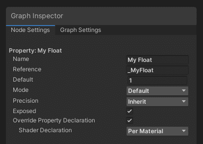*This is the Node Settings window. There’s lots to tweak here!*
*这是“节点设置”窗口。这里有很多需要调整的地方！*

`Float` variables have additional options. We can change the **Mode** between **Default**, which just lets us set the float directly; **Slider**, which lets us define minimum and maximum values to bound the value between; **Integer**, which locks the value to a whole number; and **Enum**, which I’m not sure what to do with, because it’s totally undocumented on Unity’s site.

`Float`变量具有其他选项。我们可以在 **Default** 之间更改 **Mode**，它只是让我们直接设置浮点数;**滑块**，它允许我们定义最小值和最大值以绑定两者之间的值;**整数**，将值锁定为整数;还有 **Enum**，我不确定该怎么做，因为它在 Unity 的网站上完全没有记录。

We can also set the **Precision** of the property to **Single** or **Half** precision, or inherit from the graph’s global settings. **Single** precision usually means 32 bits, while **Half** typically uses 16 bits, but this can differ by hardware. Since this setting is available in virtually every node’s settings, I’ll only mention it here once. We can toggle the property to be visible in the Inspector by ticking the **Exposed** checkbox, and we can decide whether this property is declared globally or per-material by tweaking the **Override Property Declaration** option.

我们还可以将属性的 **Precision** 设置为 **Single** 或 **Half** precision，或者继承图形的全局设置。**单**精度通常表示 32 位，而 **Half** 通常使用 16 位，但这可能因硬件而异。由于此设置几乎在每个节点的设置中都可用，因此我在这里只提及一次。我们可以通过勾选**“暴露**”复选框来切换属性在检查器中可见，并且可以通过调整“**覆盖属性声明**”选项来决定此属性是全局声明还是按材料声明。

### ₁₄ Vector 2 (Property)

`Vector 2` is like two `Float`s bolted together - they have an X and Y component. There’s no alternative modes like there were for `Float`, but we have the same Name, Reference, Default, Precision, Exposed and Override Property Declaration settings as `Float`.

`Vector 2`就像两个用螺栓固定在一起的 Float - 它们有一个 X 和 Y 组件。没有像 那样的替代模式，但我们具有与 相同的 Name、Reference、Default、Precision、Exposed 和 Override 属性声明设置为Float。

### ₁₅ Vector 3 (Property)

`Vector 3` properties have an added Z component to work with. You can use `Vector 3` to represent position or direction vectors within a 3D space, which you’ll end up doing a lot if you’re making shaders for 3D objects.

`Vector 3` 属性具有要使用的附加 Z 组件。您可以使用 3D 空间中的位置或方向矢量表示，如果您为 3D 对象制作着色器，您最终会做很多事情。

### ₁₆ Vector 4 (Property)

And `Vector 4` adds a W component. You could use this to pack arbitrary bits of data into the same variable.

并添加了一个 W 组件。您可以使用它来将任意位的数据打包到同一个变量中。

### ₁₇ Color (Property)

The `Color` property type has a **Mode** toggle between **Default** and **HDR**. If we pick HDR, then we get extra options in the color window - we will cover these more fully when we discuss the `Color` node.

属性类型在**“默认**”和**“HDR**”之间具有**“模式**”切换。如果我们选择 HDR，那么我们会在颜色窗口中获得额外的选项 - 当我们讨论节点时，我们将更全面地介绍这些选项。

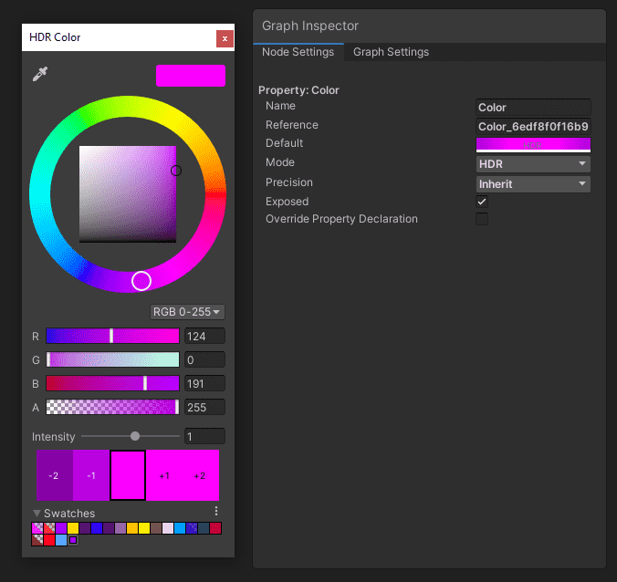*Colors are the basic building blocks of shaders. You’ll be using them a lot.*
*颜色是着色器的基本构建块。你会经常使用它们。*

### ₁₈ Boolean (Property)

A `Boolean` property can be either **True** or **False**, which is controlled using the tickbox. There’s a group of nodes which use Boolean logic - we will talk about those near the end of the article.

属性可以是 **True** 或 **False**，可使用复选框进行控制。有一组使用布尔逻辑的节点 - 我们将在文章末尾讨论这些节点。

### ₁₉ Gradient (Property)

`Gradient`s work similarly here as they do anywhere else in the Unity Editor - we can add or remove handles from the gradient window to set the color (bottom row) or alpha (top row) of the gradient at that point. The **Exposed** checkbox is greyed out, so this property type can’t be exposed to the Inspector.

`Gradient`在这里的工作方式与它们在 Unity 编辑器中的其他任何地方的工作方式类似 - 我们可以在渐变窗口中添加或删除手柄，以在该点设置渐变的颜色（底行）或 alpha（顶行）。**“公开**”复选框显示为灰色，因此此属性类型无法向检查器公开。

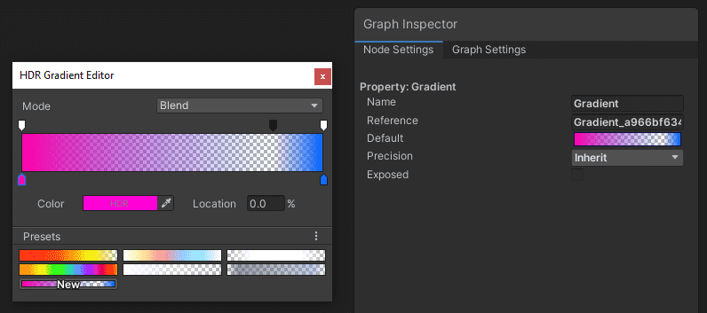*Gradients are great ways to add a color ramp to your shaders.*
*渐变是向着色器添加色带的好方法。*

### ₂₀ Texture 2D (Property)

The `Texture 2D` property type lets us declare a Texture 2D asset that we want to use in the graph. The **Mode** drop-down gives us three default color options for when no texture is selected: **White**, **Grey** or **Black**. There’s also a **Bump** option which can be used for completely flat normal maps, which are blue.

属性类型允许我们声明要在图形中使用的纹理 2D 资源。**“模式**”下拉列表为我们提供了三种默认颜色选项，用于未选择纹理时：**白色**、**灰色**或**黑色**。还有一个**凹凸**选项，可用于完全平坦的法线贴图，即蓝色。

### ₂₁ Texture 2D Array (Property)

A `Texture 2D Array` is a collection of 2D textures with the same size and format that have been packaged together so that the GPU can read them as if they are a single texture, for increased efficiency. We can sample them using special nodes, as we’ll see later.

`Texture 2d Array`是具有相同大小和格式的 2D 纹理的集合，这些纹理已打包在一起，以便 GPU 可以像读取单个纹理一样读取它们，以提高效率。我们可以使用特殊节点对它们进行采样，我们将在后面看到。

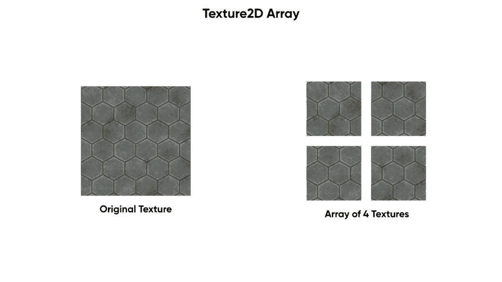*You can create a Texture2D Array by slicing an existing Texture2D into sections.*
*您可以通过将现有 Texture2D 切成多个部分来创建 Texture2D 数组。*

### ₂₂ Texture 3D (Property)

A `Texture 3D` is similar to Texture 2D, but we have an added dimension - it’s like a 3D block of color data. Unlike Texture 2D, don’t have access to a **Mode** option.

类似于 Texture 2D，但我们有一个额外的维度 - 它就像一个颜色数据的 3D 块。与 Texture 2D 不同，它无权访问**“模式**”选项。

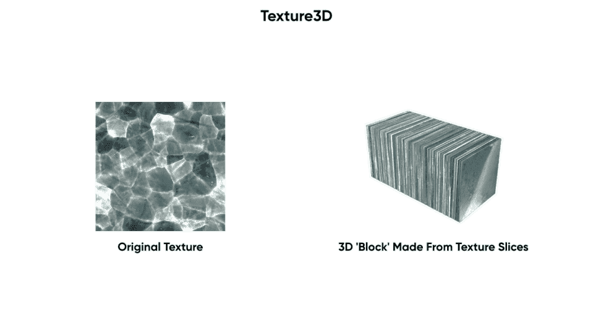*You can generate Texture3D data in scripting or by slicing a Texture2D.*
*您可以在脚本中或通过对 Texture2D 进行切片来生成 Texture3D 数据。*

### ₂₃ Cubemap (Property)

A `Cubemap` is a special texture type which is conceptually like the net of a cube - think of them as six textures which have been stitched together. They are useful for skyboxes and reflection mapping.

是一种特殊的纹理类型，在概念上类似于立方体的网 - 将它们视为拼接在一起的六个纹理。它们对于天空盒和反射映射很有用。

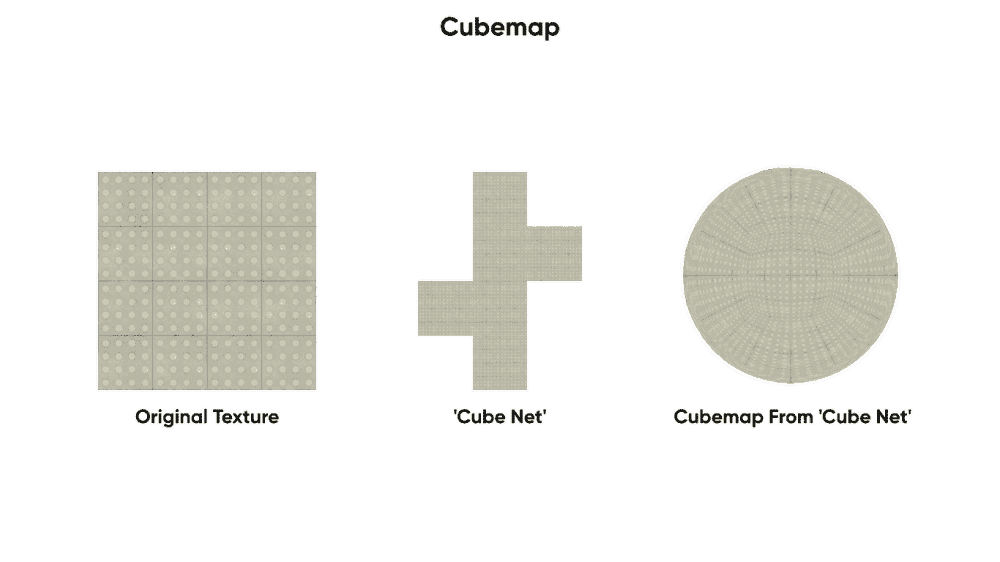*A Cubemap is a specially-imported Texture2D or collection of textures.*
*Cubemap 是专门导入的 Texture2D 或纹理集合。*

### ₂₄ Virtual Texture (Property)

`Virtual Texture`s can be used to reduce memory usage if you’re using several high-res textures, but they’re only supported by HDRP. On URP, using them won’t yield performance benefits over sampling those textures like usual. We can add or remove up to four textures from the stack, although I’m unsure if this number varies by hardware or other settings.

如果您使用多个高分辨率纹理，则可以使用VirturalTexture 来减少内存使用量，但仅 HDRP 支持它们。在 URP 上，使用它们不会比像往常一样对这些纹理进行采样产生性能优势。我们最多可以从堆栈中添加或删除四个纹理，尽管我不确定这个数字是否因硬件或其他设置而异。

### ₂₅ Matrix 2 (Property)

A `Matrix 2` is a 2x2 grid of floating-point numbers. When you create a new property of this type, its value will be the 2x2 identity matrix, which has ones down the leading diagonal and zeroes elsewhere.

是浮点数的 2x2 网格。创建此类型的新属性时，其值将是 2x2 标识矩阵，该矩阵在前导对角线下方有 1，在其他地方有零。

### ₂₆ Matrix 3 (Property)

A `Matrix 3` is slightly larger than a `Matrix 2` - it’s a 3x3 grid of numbers.

 比 Matrix2 略大 - 它是一个 3x3 的数字网格。

### ₂₇ Matrix 4 (Property)

And a `Matrix 4` is a 4x4 grid of floats. Matrices are useful for transforming vectors in your graph in interesting ways, but none of the three matrix types can be exposed to the Inspector.

是 4x4 的浮点网格。矩阵可用于以有趣的方式转换图形中的向量，但三种矩阵类型都不能向检查器公开。

### ₂₈ Sampler State (Property)

The final property type is `Sampler State`. You can use these to determine how a texture is sampled. The **Filter** determines how smoothing is applied to the texture: **Point** means no smoothing; **Linear** smooths between nearby pixels; and **Trilinear** will additionally smooth between mipmaps. The **Wrap** mode controls what happens if we supply UVs outside the texture bounds - **Repeat** copies the texture past the bounds; **Clamp** will round the UVs to the edge of the image; **Mirror** is similar to **Repeat**, but the texture gets reflected each time the image bound is crossed; and **MirrorOnce** is like **Mirror**, but gets clamped past the first reflection. `Sampler State` properties can’t be exposed to the Inspector.

最终属性类型为 。您可以使用这些来确定纹理的采样方式。**滤镜**确定如何将平滑应用于纹理：**点**表示没有平滑;附近像素之间的**线性**平滑;**和 Trilinear** 还将在 mipmap 之间平滑。**Wrap** 模式控制如果我们在纹理边界之外提供 UV 会发生什么 - **重复**复制纹理越过边界;**Clamp** 将 UV 倒圆到图像的边缘;**Mirror** 类似于 **Repeat**，但每次越过图像绑定时，纹理都会反射;**而 MirrorOnce** 就像 **Mirror**，但在第一次反射之后被夹住了。 属性不能向检查器公开。

## Keyword Types

We also have keywords to use with our graphs in order to split one graph into multiple variants based on the keyword value.

我们还有用于图表的关键字，以便根据关键字值将一个图表拆分为多个变体。

### ₂₉ Boolean (Keyword)

A `Boolean` keyword is either true or false, so using one will result in two shader variants. Depending on the **Definition**, the shader acts differently: **Shader Feature** will strip any unused shader variants at compile time, thus removing them; **Multi Compile** will always build all variants; and **Predefined** can be used when the current Render Pipeline has already defined the keyword, so it doesn’t get redefined in the generated shader code. That might otherwise cause a shader error.

关键字要么是 true 要么是 false，因此使用一个关键字将产生两个着色器变体。根据**定义**的不同，着色器的作用不同：**着色器功能**将在编译时剥离任何未使用的着色器变体，从而删除它们;**Multi Compile** 将始终构建所有变体;当当前渲染管线已经定义了关键字时，可以使用**预定义**，因此它不会在生成的着色器代码中重新定义。否则，这可能会导致着色器错误。

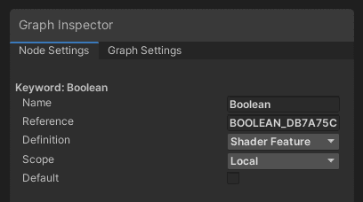*Keywords give you an even bigger degree of control over your shaders.*
*关键字使您可以更大程度地控制着色器。*

We can modify the **Scope** too: **Local** keeps the keyword private to this shader graph, while **Global** defines the keyword for all shaders in your entire project.

我们也可以修改 **Scope**：**Local** 将关键字保留为此着色器图的私有，而 **Global** 定义整个项目中所有着色器的关键字。

### ₃₀ Enum (Keyword)

The `Enum` keyword type lets us add a list of strings, which are values the enum can take, then set one of them as the default. We can choose to make our graph change behaviour based on the value of this enum, and we have the same **Definition** options as before.

关键字类型允许我们添加字符串列表，这些字符串是枚举可以采用的值，然后将其中一个设置为默认值。我们可以选择根据此枚举的值来更改图形的行为，并且我们具有与以前相同的**定义**选项。

### ₃₁ Material Quality (Keyword)

Unity, or a specific Render Pipeline, can add enums automatically. The `Material Quality` is a relatively new built-in enum keyword, which is just a built-in enum based on the quality level settings of your project. This allows you to change the behaviour of your graph based on the quality level of the game’s graphics. For example, you might choose to use a lower LOD level on certain nodes based on the material quality.

Unity 或特定的渲染管线可以自动添加枚举。这是一个相对较新的内置枚举关键字，它只是一个基于项目质量级别设置的内置枚举。这允许您根据游戏图形的质量级别更改图形的行为。例如，您可以根据材料质量选择在某些节点上使用较低的 LOD 级别。

------

# Nodes

Now we will talk about nodes that you can place on the main graph surface. By right-clicking on the graph outside the master stack, Unity will display a list of every node available in Shader Graph. I’m going to go through each subheading one by one and try to mention the most useful nodes within a heading first, although by no means will this entire list be totally ordered in that manner.

现在我们将讨论可以放置在主图表面上的节点。通过右键单击主堆栈外部的图形，Unity 将显示 Shader Graph 中每个可用节点的列表。我将逐一浏览每个子标题，并尝试首先提及标题中最有用的节点，尽管整个列表绝不会以这种方式完全排序。

# Input Nodes

The Input family of nodes cover basic primitive types, sampling textures and getting information about the input mesh, among other things.

Input 系列节点涵盖基本基元类型、采样纹理和获取有关输入网格的信息等。

## Input/Basic Nodes

### ₃₂ Color

The `Color` node comes with a rectangle which we can click to define a primitive color. As with most Color picker windows in Unity, we can switch between red-green-blue and hue-saturation-value color spaces, set the alpha, or use an existing swatch. Or we can use the color picker to select any color within the Unity window. By changing the **Mode** drop-down to **HDR**, we gain access to HDR (High Dynamic Range) colors which let us raise the intensity beyond 0, which is especially useful for emissive materials. Not every node which accepts a color input will take HDR into account, however. It has a single output, which is just the color you defined.

该节点带有一个矩形，我们可以单击该矩形来定义原始颜色。与 Unity 中的大多数颜色选择器窗口一样，我们可以在红-绿-蓝和色调饱和度值颜色空间之间切换，设置 alpha 或使用现有色板。或者，我们可以使用颜色选择器在Unity窗口中选择任何颜色。通过将**模式**下拉列表更改为 **HDR**，我们可以访问 HDR（高动态范围）颜色，从而将强度提高到 0 以上，这对于自发光材质特别有用。但是，并非每个接受颜色输入的节点都会考虑 HDR。它有一个输出，它只是您定义的颜色。

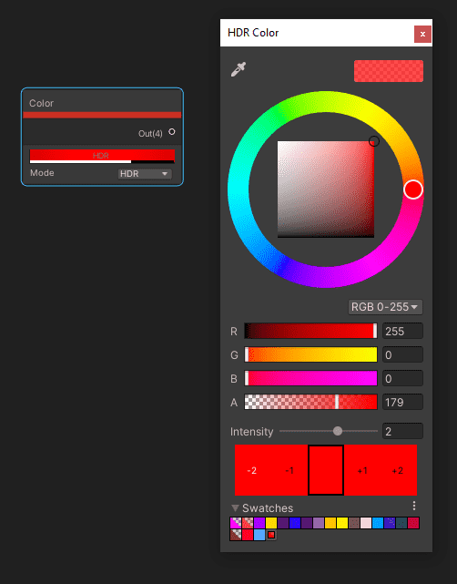*Setting the Color node to HDR gives us an extra Intensity setting which we can use in emissive materials.*
*将“颜色”节点设置为 HDR 为我们提供了一个额外的“强度”设置，我们可以在自发光材质中使用该设置。*

### ₃₃ Float/Vector 1

The `Vector 1` node, or `Float` as it’s called in later versions of Shader Graph, lets us define a constant floating-point value. It takes one float input, which we can change at will, and a single output, which is the same as the input.

该节点（在更高版本的 Shader Graph 中称为节点）允许我们定义一个常量浮点值。它需要一个浮点输入，我们可以随意更改，以及一个输出，与输入相同。

### ₃₄ Vector 2

`Vector 2` is similar to Vector 1, but we can define two floats as inputs. The output is a single `Vector 2`, with the first input in the X component and the second input in the Y component.

`Vector 2`与向量 1 类似，但我们可以定义两个浮点数作为输入。输出是单个 Vector 2，第一个输入在 X 分量中，第二个输入在 Y 分量中。

### ₃₅ Vector 3

`Vector 3` follows the same pattern, with three inputs labelled X, Y and Z, and one output which combines the three.

`Vector 3`遵循相同的模式，三个输入标记为 X、Y 和 Z，一个输出将这三者组合在一起

### ₃₆ Vector 4

And unsurprisingly, the `Vector 4` node has four inputs, X, Y, Z and W, and one output which combines all four into a `Vector 4`. All of these nodes act like the property types.

不出所料，该节点有四个输入，X、Y、Z 和 W，以及一个将所有四个组合成一个 .所有这些节点的行为都类似于属性类型。

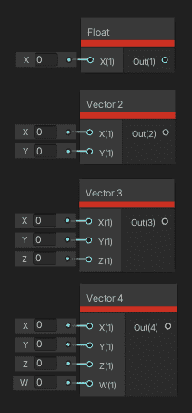*Take note of the number of inputs and the size of the output of each node.*
*记下每个节点的输入数和输出大小。*

### ₃₇ Integer

The `Integer` node is slightly different to the `Float` node, in that you use it to define integers, but it also doesn’t take any inputs. We just write the integer directly inside the node. The single output, of course, is that integer.

该节点与节点略有不同，因为您可以使用它来定义整数，但它也不接受任何输入。我们只是直接在节点内写入整数。当然，单个输出就是那个整数。

### ₃₈ Boolean

The `Boolean` node is like the Integer node, insofar as it doesn’t take any inputs. If the box is ticked, the output is **True**, and if it’s unticked, the output is **False**.

该节点类似于 Integer 节点，因为它不接受任何输入。如果选中该框，则输出为 **True**，如果未选中，则输出为 **False**。

### ₃₉ Slider

The `Slider` node is useful if you want to use a `Float` inside your graph, and you don’t want the user to modify the value from outside your shader, but you need some extra ease of use for testing purposes. We can define a minimum and maximum value, then, using the slider, we can output a value between those min and max values.

如果要在图形内部使用，并且不希望用户从着色器外部修改值，则该节点非常有用，但出于测试目的，您需要一些额外的易用性。我们可以定义最小值和最大值，然后使用滑块，我们可以输出这些最小值和最大值之间的值。

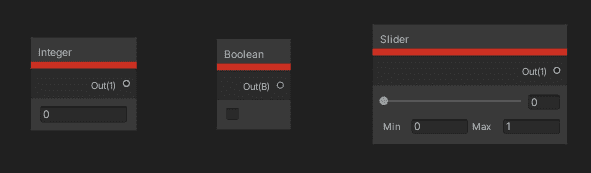*Some nodes have special functions on the node body, not just inputs and outputs.*
*一些节点在节点主体上具有特殊功能，而不仅仅是输入和输出。*

### ₄₀ Time

The `Time` node gives us access to several floats, all of which change over time. The **Time** output gives us the time in seconds since the scene started; **Sine Time** is the same as outputting **Time** into a sine function; **Cosine Time** is like using **Time** in a cosine function; **Delta Time** is the time elapsed in seconds since the previous frame; and **Smooth Delta** is like **Delta Time**, but it attempts to smooth out the values by averaging the delta over a few frames.

该节点允许我们访问多个浮点数，所有这些浮点数都会随时间而变化。**时间**输出为我们提供了自场景开始以来的时间（以秒为单位）;**正弦时间**与将**时间**输出到正弦函数中相同;**余弦时间**就像在余弦函数中使用**时间**;**Delta Time** 是自上一帧以来经过的时间（以秒为单位）;**平滑增量**类似于**增量时间**，但它试图通过在几帧内对增量进行平均来平滑值。

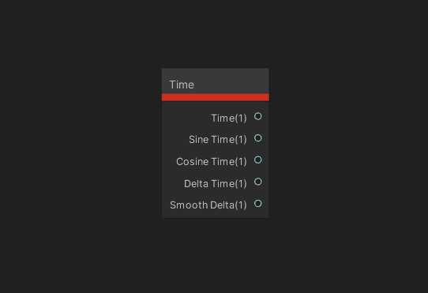*Quite a few nodes are just for retrieving information, so they don’t have inputs, only outputs.*
*相当多的节点只是用于检索信息，所以它们没有输入，只有输出。*

### ₄₁ Constant

The `Constant` node gives you access to widely-used mathematical constants using the dropdown menu, with a single output. Those constants are pi, tau (which is equal to two times pi), phi (which is the golden ratio), e (also known as Euler’s number), and the square root of two.

该节点允许您使用下拉菜单访问广泛使用的数学常数，并具有单个输出。这些常数是 pi、tau（等于 pi 的两倍）、phi（即黄金比例）、e（也称为欧拉数）和 2 的平方根。

## Input/Texture Nodes

The Texture family of nodes is all about accessing different types of textures or sampling them.

Texture 系列节点是关于访问不同类型的纹理或对它们进行采样的。

### ₄₂ Sample Texture 2D

The `Sample Texture 2D` node is one of the nodes I use the most, in almost every shader I build. It takes in three inputs: one is the **Texture** to sample, the second is the **UV** coordinate to sample the texture at, and the third is a **Sampler State** which determines how to sample the texture. The node provides two extra options. When the **Type** is **Default**, the node samples the texture’s colors, and when it’s set to **Normal**, we can use the node to sample normal maps. The **Space** is only relevant when sampling in **Normal** mode to determine which space to output normal information for - it’s either **Object** or **World**.

该节点是我使用最多的节点之一，几乎在我构建的每个着色器中。它包含三个输入：一个是要采样的**纹理**，第二个是要对纹理进行采样的 **UV** 坐标，第三个是确定如何对纹理进行采样的**采样器状态**。该节点提供了两个额外的选项。当 **Type** 为 **Default** 时，节点对纹理的颜色进行采样，当它设置为 **Normal** 时，我们可以使用该节点对法线贴图进行采样。只有在**正常**模式下采样以确定输出正常信息的空间时，**空间**才相关 - 它是**对象**或**世界**。

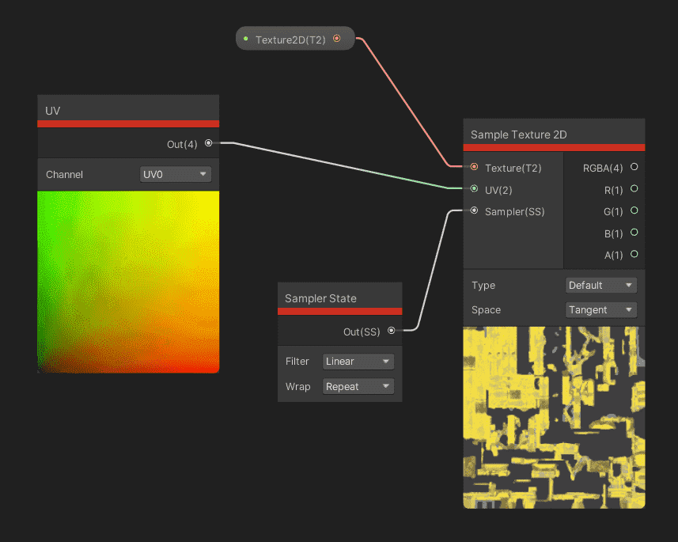*This is one of the most important nodes. If you don’t fill the UV and Sampler inputs, default values are used.*
*这是最重要的节点之一。如果不填充 UV 和 Sampler 输入，则使用默认值。*

We have several outputs, which looks intimidating at first glance, but the first output is the red-green-blue-alpha color of the texture, and the next four outputs are those individual components. This node, as with many texture sampling nodes, can only be used in the fragment stage of a shader.

我们有几个输出，乍一看很吓人，但第一个输出是纹理的红-绿-蓝-alpha 颜色，接下来的四个输出是那些单独的组件。与许多纹理采样节点一样，此节点只能在着色器的片段阶段使用。

### ₄₃ Sample Texture 2D Array

The `Sample Texture 2D Array` node acts much like the `Sample Texture 2D` node, but now we don’t have the **Type** or **Space** options. Instead, we now have an **Index** input to determine which texture in the array to sample - remember from the Properties section how these arrays work.

该节点的行为与节点非常相似，但现在我们没有**“类型**”或**“空间**”选项。取而代之的是，我们现在有一个 **Index** 输入来确定数组中的哪个纹理要采样 - 记住这些数组的工作原理。

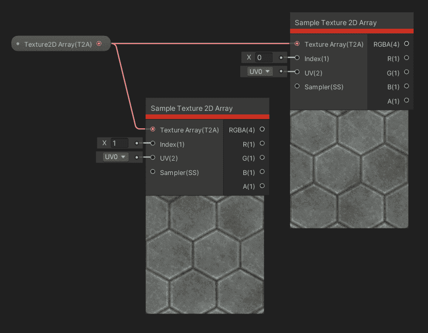*Note the slightly different output on both nodes - they’re using different indices.*
*请注意，两个节点上的输出略有不同 - 它们使用不同的索引。*

### ₄₄ Sample Texture 2D LOD

The `Sample Texture 2D LOD` node is the same as `Sample Texture 2D`, except we have an added **LOD** input. We can use this to set the mipmap level with which to sample the texture. Because we manually set the mipmap level, we can actually use this node in the vertex stage of a shader - I didn’t realise that before researching what these nodes do!

该节点与Sample Texture 2D 相同，只是我们添加了一个 **LOD** 输入。我们可以用它来设置对纹理进行采样的 mipmap 级别。因为我们手动设置了 mipmap 级别，所以我们实际上可以在着色器的顶点阶段使用这个节点 - 在研究这些节点的作用之前，我没有意识到这一点！

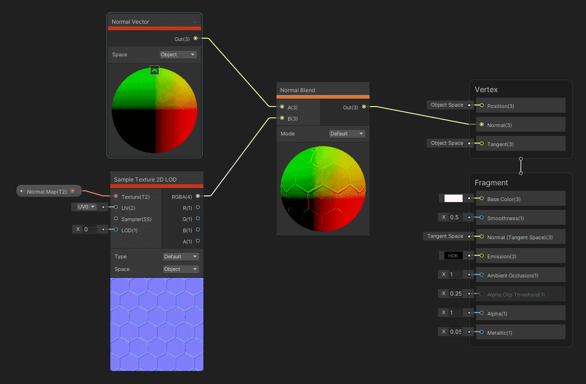*Sampling a normal texture and adding it to the vertex normal vector.*
*对法线纹理进行采样并将其添加到顶点法线向量中。*

### ₄₅ Sample Texture 3D

`Sample Texture 3D` is conceptually the same as `Sample Texture 2D`, except we provide a **Texture 3D** and the **UV** coordinate must be in three dimensions instead of just two. We can still supply a **Sampler State**, but we don’t have extra dropdown options, and for some reason we only have a single **Vector 4** output without the split-channel outputs found on `Sample Texture 2D`.

`Sample Texture 3D`在概念上与Sample Texture 2D 相同，只是我们提供了一个**纹理 3D**，**并且 UV** 坐标必须是三维的，而不仅仅是二维的。我们仍然可以提供**采样器状态**，但我们没有额外的下拉选项，并且由于某种原因，我们只有一个 **Vector 4** 输出，而没有在 上找到的分离通道输出。

*This node tree is setup so we can tweak the Z value to scroll through the 3D texture data.*
*设置此节点树，以便我们可以调整 Z 值以滚动浏览 3D 纹理数据。*

### ₄₆ Sample Cubemap

The `Sample Cubemap` node takes in a **Cubemap**, a **Sampler State** and an **LOD** level, all of which we’ve seen before, and a direction, **Dir**, which is used instead of UVs to determine where on the cubemap we should sample. Think of a cubemap conceptually as being a textured cube, but inflated into a sphere shape. The **Dir** input, a vector in world space, points from the centre of the sphere outwards to a point on this sphere. The only output is the color. Since we specify the mipmap level through the **LOD** input, we can use this in both the fragment and vertex stages of a shader, but beware that you might encounter issues if nothing is connected to the direction input. This would be great for use on a skybox.

Sample Cubemap节点采用一个**立方体贴图**、一个**采样器状态**和一个 **LOD** 级别，所有这些都是我们之前见过的，还有一个方向 **Dir**，它被用来代替 UV 来确定我们应该在立方体贴图上的位置进行采样。从概念上讲，将立方体贴图视为一个带纹理的立方体，但膨胀成球体形状。**Dir** 输入是世界空间中的一个向量，从球体的中心向外指向该球体上的一个点。唯一的输出是颜色。由于我们通过 **LOD** 输入指定 mipmap 级别，因此我们可以在着色器的片段和顶点阶段都使用它，但要注意，如果方向输入没有连接任何内容，您可能会遇到问题。这非常适合在天空盒上使用。

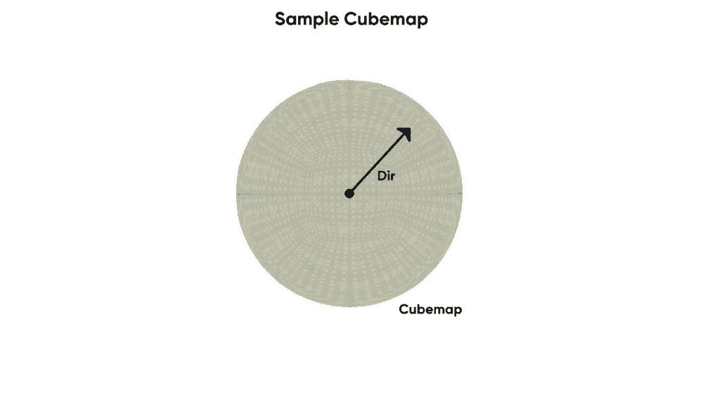*Cubemaps are commonly used to create skybox textures to simulate the sky.*
*立方体贴图通常用于创建天空盒纹理以模拟天空。*

### ₄₇ Sample Reflected Cubemap

The `Sample Reflected Cubemap` node is like the `Sample Cubemap` node, except we have an extra **Normal** input, and both that and the view direction need to be in object space. Conceptually, this node acts as if we are viewing an object in the world and reflecting the view direction vector off the object using its surface normal vector, then using the reflected vector to sample the cubemap. In contrast to `Sample Cubemap`, the `Sample Reflected Cubemap` node is great for adding reflected light from a skybox to an object in the scene.

与Sample Cubemap节点类似，只是我们有一个额外的 **Normal** 输入，并且该输入和视图方向都需要在对象空间中。从概念上讲，这个节点就像我们在观察世界中的对象，并使用其表面法向量从对象反射视图方向向量，然后使用反射向量对立方体贴图进行采样。与 Sample Cubemap不同在于，该节点非常适合将来自天空盒的反射光添加到场景中的对象。

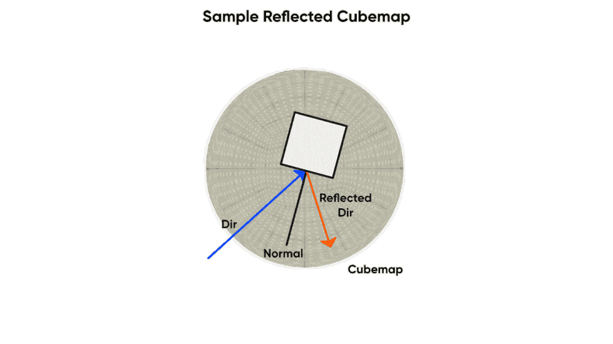*A reflected cubemap, on the other hand, are used for reflection mapping.*
*另一方面，反射立方体贴图用于反射映射。*

### ₄₈ Sample Virtual Texture

The `Sample Virtual Texture` node has two inputs by default: the **UV**s with which to sample the texture, and a **Virtual Texture** slot. Once you connect a virtual texture, the number of outputs from the node changes to match the number of layers on the **Virtual Texture** object. We can use any of those outputs we wish.

默认情况下，该节点有两个输入：用于对纹理进行采样的 **UV**s 和**虚拟纹理**槽。连接虚拟纹理后，节点的输出数将发生变化，以匹配**虚拟纹理**对象上的层数。我们可以使用我们想要的任何输出。

It’s worth noting that this node has extra options in the **Node Settings** window, too. We can change the **Address Mode** to **Wrap** or **Clamp** the texture when we use UVs below 0 or above 1, and we can change the **LOD Mode** here. **Automatic** will use LODs however you’ve set your project up to use them; **LOD Level** adds an **LOD** input and lets us set the mipmap level manually; **LOD Bias** lets us control whether to favour the more or less detailed texture when blending between LOD levels automatically; and **Derivative** adds **Dx** and **Dy** options, although Unity doesn’t document what these do anywhere.

值得注意的是，此节点在**“节点设置**”窗口中也有额外的选项。当我们使用低于 0 或高于 1 的 UV 时，我们可以将**地址模式**更改为**包裹**或**夹**紧纹理，我们可以在此处更改 **LOD 模式**。**自动**将使用 LOD，但您已将项目设置为使用它们;**LOD 级别**添加了**一个 LOD** 输入，并允许我们手动设置 mipmap 级别;**LOD 偏差**让我们可以控制在自动混合 LOD 级别时是否偏爱更多或更少的细节纹理;**Derivative** 添加了 **Dx** 和 **Dy** 选项，尽管 Unity 没有记录它们在任何地方的作用。

We can swap the quality between low and high, and we can choose whether to use **Automatic Streaming**. If we turn off automatic streaming and set the **LOD Mode** to **LOD Level**, we can even use this node in the vertex shader stage. As far as I can tell, this replaced an earlier node called `Sample VT Stack` and is only available on recent versions of Shader Graph. And as mentioned, outside of HDRP, this node provides no extra benefit and acts like a regular `Sample Texture 2D` node.

我们可以在低和高之间切换质量，我们可以选择是否使用**自动流。**如果我们关闭自动流式处理并将 **LOD 模式**设置为 **LOD 级别**，我们甚至可以在顶点着色器阶段使用此节点。据我所知，这取代了一个名为的早期节点，并且仅在最新版本的 Shader Graph 上可用。如前所述，在 HDRP 之外，此节点不提供任何额外好处，并且充当常规节点。

### ₄₉ Sampler State

The `Sampler State` node works just like a `Sampler State` property: it lets us define the **Filter** mode and **Wrap** mode to sample a texture with. We can attach one to most of the texture-sampling nodes we’ve seen so far.

该Sampler State节点的工作方式就像一个属性：它允许我们定义 **Filter** 模式和 **Wrap** 模式来对纹理进行采样。我们可以将一个附加到我们目前看到的大多数纹理采样节点上。

### ₅₀ Texture 2D Asset

The `Texture 2D Asset` node lets us find any `Texture 2D` defined in the Assets folder and use it in our graph. This is useful if this shader always uses the same texture, no matter which material instance is used, and we don’t want to use a property.

该节点允许我们查找 Assets 文件夹中定义的任何内容，并在我们的图形中使用它。如果此着色器始终使用相同的纹理，无论使用哪个材质实例，并且我们不想使用属性，这将非常有用。

### ₅₁ Texture 2D Array Asset

The `Texture 2D Array Asset` node is the same as `Texture 2D Asset`, except we grab hold of a `Texture 2D Array` instead.

该节点与 `Texture 2D Asset`相同，只不过是换成获取了“Texture 2D Array”。

### ₅₂ Texture 3D Asset

As you may expect, the `Texture 3D Asset` node can be used to access a `Texture 3D` asset within your graph without using a property.

如您所料，该节点可用于访问图形中的资产，而无需使用属性。

### ₅₃ Cubemap Asset

To finish off the set, we can use a `Cubemap Asset` node to access a cubemap texture in the graph.

为了完成这个集合，我们可以使用一个节点来访问图形中的立方体贴图纹理。

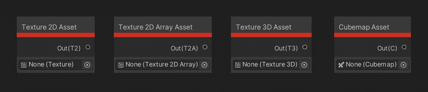*We can grab textures directly within the shader without using properties.*
*我们可以直接在着色器中抓取纹理，而无需使用属性。*

### ₅₄ Texel Size

The `Texel Size` node takes in a `Texture 2D` as input and outputs the width and height of the texture in pixels. “Texel” in this context is short for “texture element”, and can be thought of as analogous to “pixel”, which itself is short for “picture element”. The more you know!

节点接受 Texture 2D 作为输入，并以像素为单位输出纹理的宽度和高度。在这种情况下，“Texel”是“纹理元素”的缩写，可以被认为是类似于“像素”，而“像素”本身就是“图片元素”的缩写。涨知识了吧！

## Input/Scene Nodes

The Scene family of nodes gives us access to several pieces of key information about the scene, including the state of rendering up to this point and properties of the camera used for rendering.

Scene 系列节点使我们能够访问有关场景的几条关键信息，包括渲染状态和用于渲染的相机的属性。

### ₅₅ Screen

The `Screen` node gets the width and the height of the screen in pixels and returns those as its two outputs.

该节点获取屏幕的宽度和高度（以像素为单位），并将其作为其两个输出返回。

### ₅₆ Scene Color

The `Scene Color` node lets us access the framebuffer before rendering has finished this frame, and it can only be used in the fragment shader stage. In URP, we can only use this on **Transparent** materials and it will only show opaque objects, and the behaviour of the node can change between render pipelines. The **UV** input takes in the screen position you’d like to sample, and by default, it uses the same screen position UV as the pixel being rendered. I’ll talk about the other options on the drop-down when we get to the `Screen Position` node. The output is the color sampled at this position.

该节点允许我们在渲染完成此帧之前访问帧缓冲区，并且它只能在片段着色器阶段使用。在 URP 中，我们只能在**透明**材质上使用它，它只会显示不透明的对象，并且节点的行为可以在渲染管线之间更改。**UV** 输入采用您要采样的屏幕位置，默认情况下，它使用与正在渲染的像素相同的屏幕位置 UV。当我们到达节点时，我将讨论下拉列表中的其他选项。输出是在此位置采样的颜色。

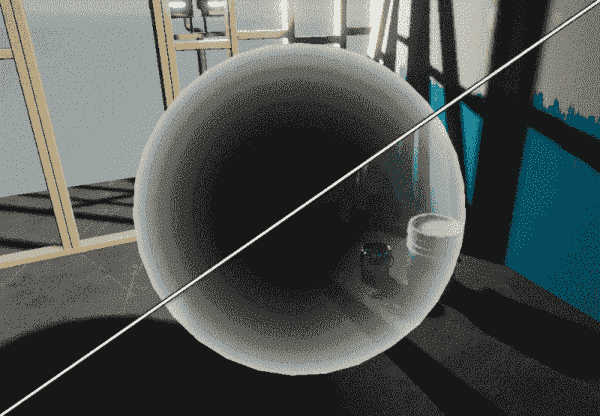*How Scene Color appears for opaque (left) and transparent (right) shaders, with added Fresnel. All pixels are fully opaque.*
*不透明（左）和透明（右)着色器的场景颜色的显示方式，并添加了菲涅耳。所有像素都是完全不透明的。*

In URP, you will also need to find your **Forward Renderer** asset and make sure the **Opaque Texture** checkbox is ticked, or else Unity won’t even generate the texture and you’ll only see black. This node is great for something like glass or ice, where you need to slightly distort the view behind the mesh.

在 URP 中，您还需要找到您的**正向渲染器**资源，并确保勾选了不**透明纹理**复选框，否则 Unity 甚至不会生成纹理，您只会看到黑色。此节点非常适合玻璃或冰之类的东西，在这些地方，您需要稍微扭曲网格后面的视图。

### ₅₇ Scene Depth

Similar to the `Scene Color` node, the `Scene Depth` node can be used to access the depth buffer, which is a measure of how far a rendered pixel is away from the camera. Again, in URP, this can only be used by transparent materials. The input it expects is a **UV** coordinate.

与节点类似，该节点可用于访问深度缓冲区，这是衡量渲染像素与相机距离的程度。同样，在 URP 中，这只能由透明材料使用。它期望的输入是 **UV** 坐标。

This node also contains a **Sampling** option with three settings. **Linear 01** will return a depth value normalized between 0 and 1, where a pixel with value 1 rests on the camera’s near clip plane and 0 is the far clip plane (although this might be reversed in some cases), and an object halfway between both planes is at a depth of 0.5.

此节点还包含具有三个设置的**“采样**”选项。**线性 01** 将返回一个介于 0 和 1 之间归一化的深度值，其中值为 1 的像素位于相机的近剪裁平面上，0 是远剪切平面（尽管在某些情况下可能会相反），并且两个平面之间的对象深度为 0.5。

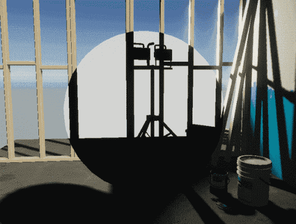*This is the Scene Depth using Linear 01 mode.*
*这是使用 Linear 01 模式的场景深度。*

The **Raw** option will return the raw depth value without converting to a linear value between 0 and 1, so a pixel halfway between the near and far clip planes may actually have a depth value higher than 0.5. And finally, the **Eye** option gives us the depth converted to eye space, which just means the number of units the pixel is away from the centre of the camera relative to the camera view direction.

**“原始**”选项将返回原始深度值，而不会转换为介于 0 和 1 之间的线性值，因此近剪裁平面和远剪裁平面之间的像素实际上可能具有高于 0.5 的深度值。最后，“**眼睛**”选项为我们提供了转换为眼睛空间的深度，这仅意味着像素相对于相机视图方向远离相机中心的单位数。

### ₅₈ Camera

The `Camera` node is only supported by the Universal Render Pipeline. It gives you access to a range of properties related to the camera that’s currently being used for rendering, such as the **Position** in world space, the forward **Direction** vector, and whether the camera is **Orthographic** – if so, 1 is output, otherwise 0 is output. We have access to the **Near Plane** and **Far Plane**, which are two clipping planes, represented as floats, as well as the **Z Buffer Sign**, which returns 1 or -1 depending on whether we are using the standard or reversed depth buffer. You might want to use this node if you are making depth-based effects, for example using the `Scene Depth` node. Finally, the **Width** and **Height** outputs get you the width and height of the screen in world space units, but only if your camera is orthographic.

该节点仅受通用渲染管线支持。它允许您访问与当前用于渲染的摄像机相关的一系列属性，例如世界空间中**的位置**、前进**方向**矢量以及摄像机是否为**正交** - 如果是，则输出 1，否则输出 0。我们可以访问**近平面**和**远平面**，它们是两个削波平面，表示为浮点数，以及 **Z 缓冲区符号**，它返回 1 或 -1，具体取决于我们使用的是标准深度缓冲区还是反向深度缓冲区。如果要制作基于深度的效果（例如，使用节点），则可能需要使用此节点。最后，“**宽度**”和**“高度**”输出以世界空间单位提供屏幕的宽度和高度，但前提是您的相机是正交的。

### ₅₉ Fog

The `Fog` node is also not supported by HDRP. It returns information about the fog you’ve defined in the **Lighting** tab’s **Environment Settings**. We need to pass in the **Position** in object space, and we get the **Color** of the fog and its **Density** at that position. We can use the node in the vertex and fragment stages of your shader.

HDRP 也不支持该节点。它返回有关您在**“照明**”选项卡的**“环境设置**”中定义的雾的信息。我们需要传入对象空间中**的位置**，然后我们得到雾的**颜色**及其在该位置的**密度**。我们可以在着色器的顶点和片段阶段使用该节点。

### ₆₀ Object

The `Object` node returns two outputs: the **Position** and **Scale** of your object in world space, as `Vector 3`s.

该节点返回两个输出：对象在世界空间中**的位置**和**比例**，类型为Vector 3

## Input/Lighting Nodes

The Lighting nodes give us access to different types of lighting impacting a given vertex or fragment.

“光照”节点使我们能够访问影响给定顶点或片段的不同类型的光照。

### ₆₁ Ambient

The `Ambient` node returns three color values, each of which is a different type of ambient light from the scene, but it is only supported by URP. These values depend on the values in the **Environment Lighting** section of the **Lighting** tab. The node’s **Equator** and **Ground** output always return the Environment Lighting **Equator** and **Ground** values, regardless of which **Source** type is picked, even though they only exist when **Gradient** is picked. The node’s **Color/Sky** outputs the **Sky** color when the mode is set to **Gradient**, or **Ambient Color** when the **Source** is set to **Color**.

该节点返回三个颜色值，每个颜色值都是来自场景的不同类型的环境光，但仅受 URP 支持。这些值取决于**“照明**”选项卡的**“环境照明**”部分中的值。节点的**“赤道”（Equator**） 和**“地面**”（Ground） 输出始终返回“环境照明**赤道”（Environment Lighting Equator**） 和**“地面**”（Ground） 值，无论选取哪种**源**类型，即使它们仅在选取**“渐变”（Gradient**） 时存在。当模式设置为**“渐变**”时，节点的**“颜色/天空**”输出**“天空**”颜色，当**“源**”设置为**“颜色**”时，节点的“**环境颜色**”输出。

### ₆₂ Reflection Probe

The `Reflection Probe` node is only defined for the Universal Render Pipeline. We can use this to access the nearest reflection probe to the object by passing in the surface normal of the mesh and the view direction of the camera – if you remember the way I described the `Sample Reflected Cubemap` node, it works in a similar way. We can also specify the **LOD** to sample at lower qualities if we want blurry reflections. The single output, just named **Out**, is the color of the reflection from the reflection probe as a `Vector 3`.

该节点仅针对通用渲染管线定义。我们可以使用它来访问离物体最近的反射探头，方法是通过网格的表面法线和相机的视图方向——如果你还记得我描述节点的方式，它的工作方式与此类似。如果我们想要模糊的反射，我们还可以指定 **LOD** 以较低的质量进行采样。单个输出，就命名为 **Out**，是反射探头反射的颜色为 Vector3类型.

### ₆₃ Baked GI

The `Baked GI` node can be used to retrieve lighting created by Unity’s baked lightmapper. We need to provide a **Position** and **Normal** vector in world space so that Unity knows where to access the lightmap information, and then we need to provide a set of **UV**s so Unity knows how to apply the lightmap to the mesh. Lightmap UVs come in two forms: the **Static UV**s, which occupy the **UV1** slot usually, are for mapping lights which stay stationary for the entire game, and **Dynamic UV**s, which are found in the **UV2** slot by default, are used for lights that might turn on or off, or even move during runtime.

该节点可用于检索由 Unity 烘焙的光照贴图器创建的光照。我们需要在世界空间中提供**一个位置**和**法线**向量，以便 Unity 知道在哪里访问光照贴图信息，然后我们需要提供一组 **UV**，以便 Unity 知道如何将光照贴图应用于网格。光照贴图 UV 有两种形式：**静态 UV**用于映射在整个游戏中保持静止的 **UV** 插槽，而默认位于 **UV2** 插槽中的**动态 UV**用于可能在运行时打开或关闭甚至移动的灯光。

Both sets of UVs can be generated automatically by Unity during the lightmapping process, but you can also create them manually – but if you don’t know how to do that, then it’s nothing to worry about. There’s an extra tickbox on the node to apply lightmap scaling, which will automatically transform the lightmap texture if ticked – it’s usually best to keep it ticked. The sole output is the color of the lighting or shadow at this location.

这两组UV都可以由Unity在光照贴图过程中自动生成，但您也可以手动创建它们 - 但如果您不知道如何操作，那么无需担心。节点上有一个额外的复选框来应用光照贴图缩放，如果勾选，它将自动转换光照贴图纹理 - 通常最好保持勾选状态。唯一的输出是此位置的光照或阴影的颜色。

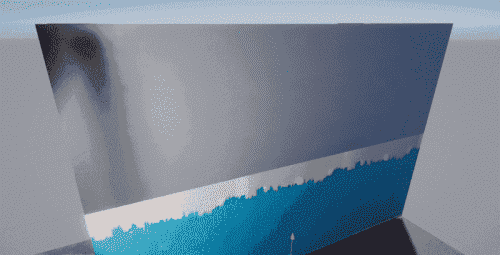*The top-left corner of this wall still has baked shadows from a wall section that I’ve since disabled.*
*这面墙的左上角仍然有我禁用的墙面部分的阴影。*

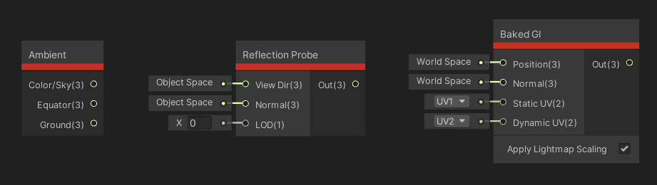*These nodes work best on unlit materials, where you’re not using Unity’s automatic lighting systems.*
*这些节点在未使用Unity自动光照系统的未光照材质上效果最佳。*

## Input/Matrix Nodes

The matrix family of nodes can be used to create new matrices, or to access some of Unity’s built-in matrices.

节点的矩阵系列可用于创建新矩阵，或访问 Unity 的一些内置矩阵。

### ₆₄ Matrix 2x2

Matrices can be used for operations such as multiplying vectors. I won’t go into much detail about matrices here, because it’s a very dense topic – but all you need to know here is that we can define our own matrix constants inside the shader. The `Matrix 2x2` node lets us define a square matrix with two rows and two columns.

矩阵可用于乘法向量等运算。我不会在这里详细介绍矩阵，因为这是一个非常密集的话题——但你需要知道的是，我们可以在着色器中定义我们自己的矩阵常量。该节点让我们定义一个具有两行和两列的方阵。

### ₆₅ Matrix 3x3

Similarly, the `Matrix 3x3` node lets us define matrices with three rows and three columns.

同样，该节点允许我们定义具有三行和三列的矩阵。

### ₆₆ Matrix 4x4

The largest type of matrix supported in shaders is the 4x4 square matrix, which we can create with a `Matrix 4x4` node.

着色器支持的最大矩阵类型是 4x4 方形矩阵，我们可以用节点创建它。

### ₆₇ Transformation Matrix

Matrices are super useful for transformations, and Unity defines many of matrices involved in transforming from one space to another. Sometimes, these matrices are used in the background, but we can access them using the `Transformation Matrix` node.

矩阵对于转换非常有用，Unity 定义了从一个空间转换到另一个空间所涉及的许多矩阵。有时，这些矩阵在后台使用，但我们可以使用节点访问它们。

Using the drop-down, we can pick between the following matrices: the **Model** matrix converts from object space to world space, whereas **InverseModel** converts the opposite way. The **View** matrix transforms from world space to view space, which is relative to a camera, and **InverseView** does the opposite. The **Projection** matrix transforms from view space to clip space, where parts of objects out of the camera’s view can be clipped. The **InverseProjection** matrix does the opposite. And finally, the **ViewProjection** matrix takes us straight from world space to clip space. **InverseViewProjection** does the opposite. The only output of the node is the selected matrix.

使用下拉列表，我们可以在以下矩阵之间进行选择：**模型**矩阵从对象空间转换为世界空间，而 **InverseModel** 则以相反的方式进行转换。**视图**矩阵从世界空间转换为相对于摄像机的视图空间，而 **InverseView** 则相反。**投影**矩阵从视图空间转换为剪辑空间，其中可以剪裁相机视图之外的对象部分。**InverseProjection** 矩阵则相反。最后，**ViewProjection** 矩阵将我们从世界空间直接带到剪辑空间。**InverseViewProjection** 则相反。节点的唯一输出是选定的矩阵。

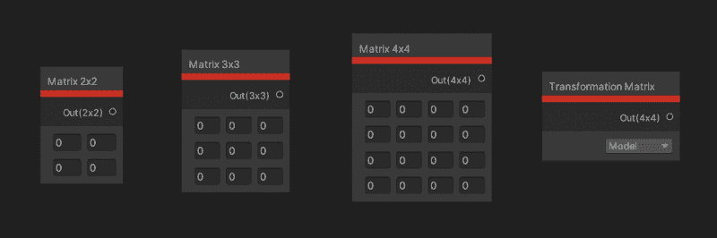*Matrices are commonly used for transforming between spaces.*
*矩阵通常用于空间之间的转换。*

## Input/Geometry Nodes

The Geometry node family provides positions, UVs, directions – basically, different kinds of vectors.

Geometry 几何节点系列提供位置、UV、方向 - 基本上是不同类型的矢量。

### ₆₈ Position

The `Position` node will grab the position of the vertex or fragment, whichever shader stage you’re using. Only one `Vector 3` output exists, and that will be the position, but there is a drop-down that lets us pick which space the position will be. We’ve talked about the **Object**, **View** and **Tangent** spaces previously, and **Absolute World** is the same world space of the vertex or fragment as we’ve described world space before. The **World** option differs by render pipeline and it uses the pipeline’s default world space. In URP, it’s the same as **Absolute World**, but HDRP uses camera-relative rendering by default, so the world space becomes relative to the camera position.

节点将获取顶点或片段的位置，无论您使用哪个着色器阶段。只有一个输出存在，那就是位置，但有一个下拉列表可以让我们选择位置所在的空间。我们之前已经讨论过**对象**空间、**视图**空间和**切线**空间，**而绝对世界**与我们之前描述的世界空间是顶点或片段的世界空间相同。**“世界**”选项因渲染管线而异，它使用管线的默认世界空间。在 URP 中，它与 **Absolute World** 相同，但 HDRP 默认使用摄像机相对渲染，因此世界空间相对于摄像机位置变为相对于摄像机位置。

### ₆₉ Screen Position

The `Screen Position` node gets the position of the pixel on the screen, with a single `Vector 4` output representing the screen position. The **Mode** influences exactly which screen position is used. By **Default**, we use the clip space after dividing by the W component – this is called the perspective divide. **Raw** mode, however, returns the screen position before the perspective divide, which is useful if you want to perform a projection of your own. **Center** will return the screen position such that (0, 0) is now in the centre of the screen instead of the bottom-left corner, and **Tiled** also puts (0, 0) in the centre of the screen, but takes only the fractional part of the position – the number past the decimal point - so you end up with tiles.

节点获取像素在屏幕上的位置，单个输出表示屏幕位置。**模式**会准确影响使用的屏幕位置。**默认**情况下，我们使用除以 W 分量后的剪辑空间——这称为透视分割。但是，**原始**模式会返回透视分割之前的屏幕位置，如果您想执行自己的投影，这很有用。**Center** 将返回屏幕位置，使 （0， 0） 现在位于屏幕的中心而不是左下角，**而 Tiled** 也将 （0， 0） 放在屏幕的中心，但只占用位置的小数部分 - 超过小数点的数字 - 所以你最终会得到平铺。

### ₇₀ UV

The `UV` node can be used to get the UV coordinates of a vertex or fragment. Unity allows you to bake more than one texture coordinate into your mesh’s data, so we can use the **Channel** drop down to retrieve one of four sets of UV coordinates. Most meshes will only use UV0, but you can use the other channels to hide more data.

该节点可用于获取顶点或片段的 UV 坐标。Unity 允许您将多个纹理坐标烘焙到网格的数据中，因此我们可以使用**通道**下拉列表来检索四组 UV 坐标中的一组。大多数网格将仅使用 UV0，但您可以使用其他通道来隐藏更多数据。

You will need to bake the UV data into a mesh yourself using external means. One unfortunate limitation of Shader Graph is that we can only access UV0 to UV3, although shader code can access UV4 to UV7.

您需要使用外部方式自行将 UV 数据烘焙到网格中。Shader Graph 的一个不幸限制是，我们只能访问 UV0 到 UV3，尽管着色器代码可以访问 UV4 到 UV7。

### ₇₁ Vertex Color

The `Vertex Color` node can be used to get the color attached to the mesh’s vertex data. Despite the name, this can be used in both the vertex and fragment shader stages – but you’ll have to set up your mesh beforehand to have vertex color data baked into it, which you can do inside your modelling program or via scripting. In the fragment stage, the colors between vertices get blended together.

该节点可用于获取附加到网格顶点数据的颜色。尽管有这个名字，但它可以在顶点和片段着色器阶段使用——但你必须事先设置你的网格，将顶点颜色数据烘焙到其中，你可以在建模程序中或通过脚本来完成。在片段阶段，顶点之间的颜色混合在一起。

### ₇₂ View Direction

The `View Direction` node gets the vector between the vertex or fragment and the camera. The drop-down lets us change the **Space** between **World**, **View**, **Object** or **Tangent** – we’ve talked about all of those before.

节点获取顶点或片段与相机之间的向量。下拉列表允许我们更改**“世界**”、“**视图**”、“**对象**”或**“切线**”之间的**空间**——我们之前已经讨论过所有这些。

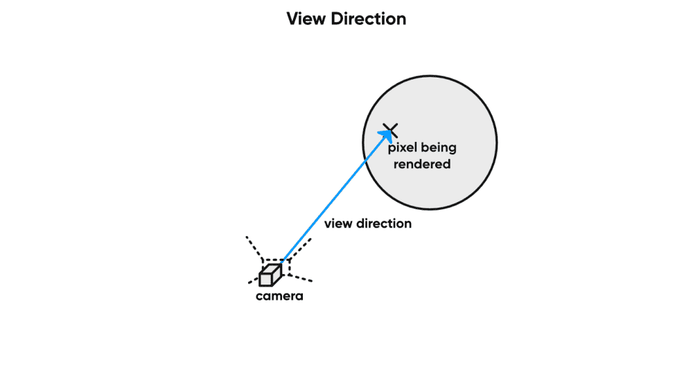*Look at meeeee!*
*看着我！*

### ₇₃ Normal Vector

The `Normal Vector` node gets the vector perpendicular to the surface pointing outwards away from the surface. Like `View Direction`, it gives us the option to pick different spaces and only outputs the single vector.

节点使向量垂直于向外指向远离表面的表面。就像 一样，它为我们提供了选择不同空间的选项，并且只输出单个向量。

### ₇₄ Tangent Vector

The `Tangent Vector` node gets a vector that lies on the surface. This vector is perpendicular to the `Normal Vector`, and like the `Normal Vector` node, we get four space options.

节点获取位于表面上的向量。这个向量垂直于 ，和节点一样，我们得到四个空间选项。

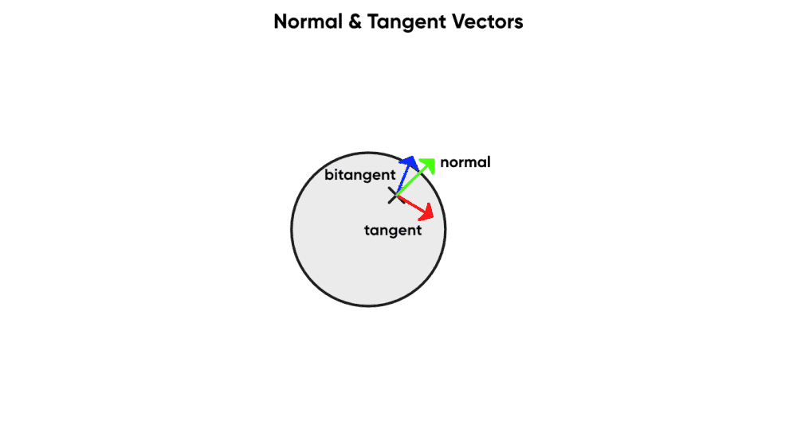*The normal, tangent and bitangent vectors form a basis for tangent space.*
*法向量、切向量和双向向量构成了切向量的基础。*

### ₇₅ Bitangent Vector

The `Bitangent Vector` node gets another vector that is parallel with the surface. If you take the cross product between the `Tangent Vector` and the `Normal Vector`, you will get the same result as the `Bitangent Vector` node. We’ll talk about the cross product shortly.

节点获取另一个与曲面平行的向量。如果取 和 之间的叉积，则得到与节点相同的结果。我们稍后将讨论交叉积。

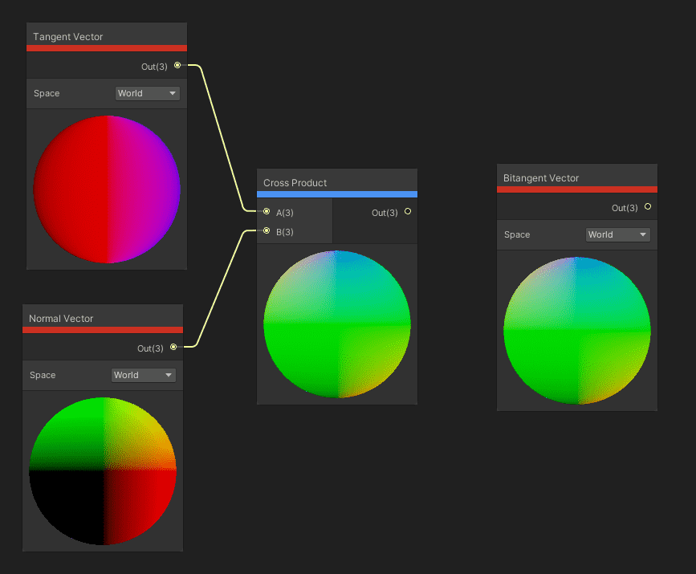*We can take the cross between the Tangent and Normal to get the Bitangent (the order is important).*
*我们可以取切线和法线之间的交叉来得到双切线（阶数很重要)。*

## Input/Gradient Nodes

There’s three nodes under the Gradient tab, and I’m sure you can guess that they involve creating and reading color gradients!

“渐变”选项卡下有三个节点，我相信您可以猜到它们涉及创建和读取颜色渐变！

### ₇₆ Gradient

The `Gradient` node lets us define a gradient of our own to use inside the shader. By clicking on the rectangle on the node, we get access to the Gradient Editor window, which is the same as the one used elsewhere in the Unity Editor. We can modify the top row of handles to change the alpha and use the bottom row to tweak colors. The only output is the gradient itself.

该节点允许我们定义自己的渐变，以便在着色器中使用。通过单击节点上的矩形，我们可以访问“渐变编辑器”窗口，该窗口与Unity编辑器中其他地方使用的窗口相同。我们可以修改最上面的一行手柄来改变 alpha，并使用最下面一行来调整颜色。唯一的输出是渐变本身。

### ₇₇ Sample Gradient

Which brings us to the `Sample Gradient` node, which is the only node that currently takes a **Gradient** as an input. It also uses an input called **Time**, which is a float between 0 and 1 which determines which position to sample the gradient at. The output is the color sampled at that point.

这将我们带到了节点，这是当前唯一将**梯度**作为输入的节点。它还使用一个名为 **Time** 的输入，它是介于 0 和 1 之间的浮点数，用于确定在哪个位置对梯度进行采样。输出是在该点采样的颜色。

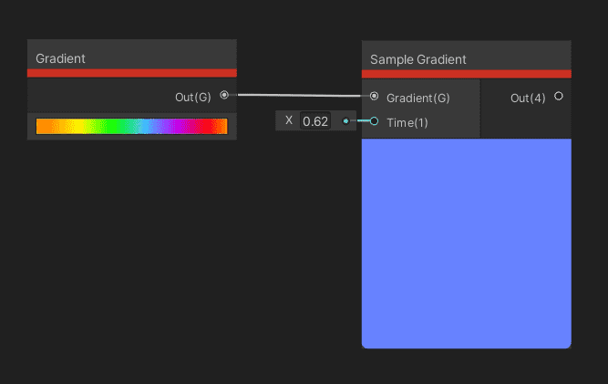*These are the only nodes that utilise gradients. We can pass the output color to other nodes, though.*
*这些是唯一利用梯度的节点。不过，我们可以将输出颜色传递给其他节点。*

### ₇₈ Blackbody

The `Blackbody` node is interesting – it takes in a temperature in Kelvin as input and outputs the color of a blackbody at that temperature. Don’t know what a blackbody is? Then you’re probably not a physicist. A blackbody is an idealised completely opaque, non-reflective object, so the thermal radiation emitted is a function of its temperature. They start off black, and cycle through red, orange, yellow and finally white as they increase in temperature.

这个节点很有意思——它以开尔文为单位的温度作为输入，并输出该温度下黑体的颜色。不知道什么是黑体？那么你可能不是物理学家。黑体是一种理想化的完全不透明、非反射的物体，因此发出的热辐射是其温度的函数。它们从黑色开始，随着温度的升高，在红色、橙色、黄色和最后白色之间循环。

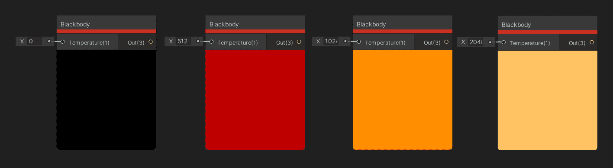*The color moves from black to red to white as the temperature increases.*
*随着温度的升高，颜色从黑色变为红色再到白色。*

## Input/PBR Nodes

The two PBR nodes involve reflection highlights for physically-based rendering.
两个 PBR 节点涉及用于基于物理的渲染的反射高亮。

### ₇₉ Dielectric Specular

The `Dielectric Specular` node requires a bit of explanation. Dielectric materials are electrical insulators, so in this context, think of them as non-metals. This node outputs the strength of specular highlights on certain types of material based on its refractive index. We can switch the **Material** type, and values are defined for rusted metal, water, ice and glass. There’s an option for common materials – which you would use for common materials like fabric, plastic or maybe wood – which gives us a range to pick between, and a **Custom** option, where the output is based on the index of refraction. If using the custom option, look up the refractive index of the material you want online. For example, the index of refraction for ice is 1.3098, which gives the same strength as the preset for ice.

`电介质镜面反射`节点需要一些解释。介电材料是电绝缘体，因此在这种情况下，将它们视为非金属。该节点根据其折射率输出某些类型材料上的镜面高光强度。我们可以切换**材料**类型，并为生锈的金属、水、冰和玻璃定义值。有一个用于常见材料的选项——您可以将其用于织物、塑料或木材等常见材料——这为我们提供了一个可供选择的范围，以及一个**自定义**选项，其中输出基于折射率。如果使用自定义选项，请在线查找所需材料的折射率。例如，冰的折射率为 1.3098，其强度与冰的预设相同。

### ₈₀ Metal Reflectance

The `Metal Reflectance` is similar to `Dielectric Specular`, but now it outputs the color of the specular highlights on certain metals. The key difference is that the specular highlights for metals are colored rather than greyscale, as they are for dielectric materials. Unity provides values for iron, silver, aluminium, gold, copper, chromium, nickel, titanium, cobalt and platinum, with no further options for custom metals.

`金属反射率` 与 Dielectric Specular 类似，但现在它输出某些金属上的镜面高光的颜色。主要区别在于，金属的镜面高光是彩色的，而不是灰度的，就像介电材料一样。Unity 提供铁、银、铝、金、铜、铬、镍、钛、钴和铂的值，没有更多定制金属选项。

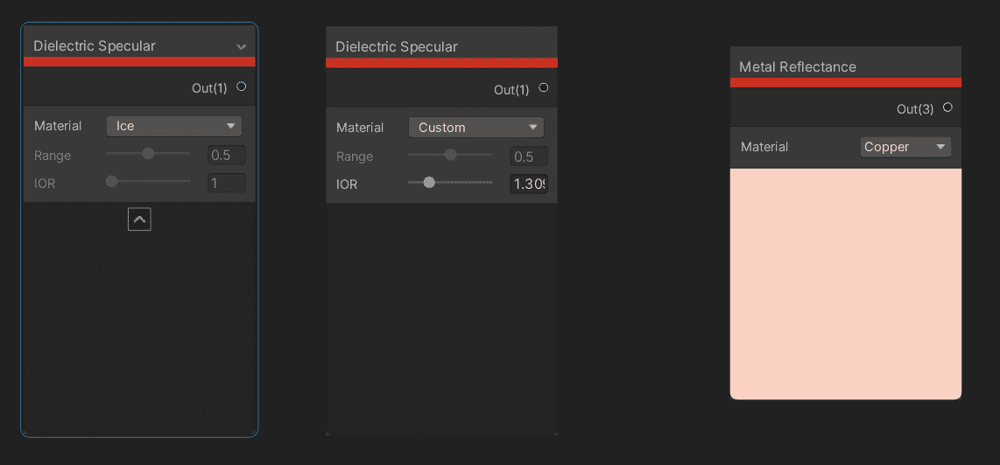*We can use these presets to set specular values for common objects.*
*我们可以使用这些预设来设置常见对象的镜面反射值。*

## Input/High Definition Render Pipeline Nodes

The following three nodes are in the High Definition Render Pipeline group, but they’re included in the base Shader Graph package, so I’ll still mention them here.

以下三个节点位于“高清渲染管线”组中，但它们包含在基本 Shader Graph 包中，因此我仍将在此处提及它们。

### ₈₁ Diffusion Profile

Like all nodes under the High Definition Render Pipeline group, the `Diffusion Profile` node is of course not available on Universal Render Pipeline. This node is used to sample a **Diffusion Profile** asset, which is exclusive to HDRP and contains settings related to subsurface scattering. The output is a float which is an **ID** used to pick the correct diffusion profile. The ID is used for the corresponding block node in HDRP (which I haven’t covered because HDRP ships with like, a million extra block nodes).

与“高清渲染管线”组下的所有节点一样，该节点当然在通用渲染管线上不可用。此节点用于对**扩散配置文件**资源进行采样，该资源是 HDRP 独有的，包含与次表面散射相关的设置。输出是一个浮点数，它是用于选择正确扩散曲线的 **ID**。该 ID 用于 HDRP 中相应的块节点（我没有介绍，因为 HDRP 附带了太多额外的块节点）。

### ₈₂ Exposure

The `Exposure` node is an HDRP-exclusive node that you can use to get the camera’s exposure level on the current or previous frame. The only output from the node is a Vector3 representing that exposure level. There are four exposure types you can pick from the **Type** dropdown. The two labelled **Current** get exposure from this frame, while the **Previous** ones get the exposure from last frame. The two called **Inverse** return the inverse of the exposure on a given frame.

该节点是 HDRP 独占节点，可用于获取相机在当前或上一帧上的曝光级别。节点的唯一输出是表示该曝光级别的 Vector3。您可以从**“类型**”下拉列表中选择四种曝光类型。两个标记为**“当前**”的帧从此帧获得曝光，而**“前**一个”从最后一帧获得曝光。两个称为 **Inverse** 返回给定帧上曝光的倒数。

### ₈₃ HD Scene Color

The `HD Scene Color` is the HDRP-exclusive counterpart of the regular `Scene Color` node. Unlike `Scene Color`, `HD Scene Color` has an extra **LOD** input which lets us pick the mipmap level we use to access the color buffer – this node always uses trilinear filtering to smooth between mipmaps. We also have an **Exposure** checkbox to choose whether to apply exposure – it’s disabled by default to avoid double exposure. The only output from the node is the color that gets sampled.

是常规节点的 HDRP 独占对应项。与 不同的是，它有一个额外的 **LOD** 输入，让我们可以选择用于访问颜色缓冲区的 mipmap 级别——此节点始终使用三线性滤波在 mipmap 之间平滑。我们还有一个**曝光**复选框来选择是否应用曝光 - 默认情况下，它被禁用以避免双重曝光。节点的唯一输出是采样的颜色。

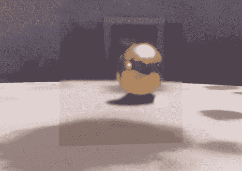*We can change the LOD level of the HD Scene Color node to create blurry windows.*
*我们可以更改 HD Scene Color 节点的 LOD 级别以创建模糊窗口。*

## Input/Mesh Deformation Nodes

The next two nodes are used with the DOTS Hybrid Renderer.
接下来的两个节点与 DOTS 混合渲染器一起使用。

### ₈₄ Compute Deformation

The `Compute Deformation` node is exclusive to the DOTS Hybrid Renderer and can be used to send deformed vertex data to this shader. You’ll need some knowledge of DOTS to get this working – and I certainly don’t. The three outputs are deformed **Vertex Position**, **Normal** and **Tangent**, which usually get output to the vertex stage’s three pins.

计算变形节点是 DOTS 混合渲染器独有的，可用于将变形的顶点数据发送到此着色器。您需要一些 DOTS 知识才能使其正常工作——我当然不需要。三个输出是变形的**顶点位置**、**法线**和**切线**，它们通常输出到顶点级的三个引脚。

### ₈₅ Linear Blend Skinning

The `Linear Blend Skinning` node is also exclusive to the DOTS Hybrid Renderer. We can use the three inputs for **Position**, **Normal** and **Tangent** vectors and this node will apply vertex skinning to each and give us the corresponding results as three output vectors.

“线性混合蒙皮”节点也是DOTS混合渲染器的专有节点。我们可以将这三个输入用于**位置**、**法线**和**切向**量，该节点将对每个节点应用顶点蒙皮，并作为三个输出向量为我们提供相应的结果。

# Channel Nodes

The Channel node family is all about messing with the order and value of each component of a vector.

通道节点系列是关于扰乱向量的每个分量的顺序和值。

### ₈₆ Split

The `Split` node takes in a `Vector 4` as input and output the four channels of the vector as separate floats. If you supplied a vector with fewer than 4 components, then the ‘extra’ outputs will be zero.

节点接受 Vector4 作为输入，并将向量的四个通道输出为单独的浮点数。如果您提供的向量少于 4 个分量，则“额外”输出将为零。

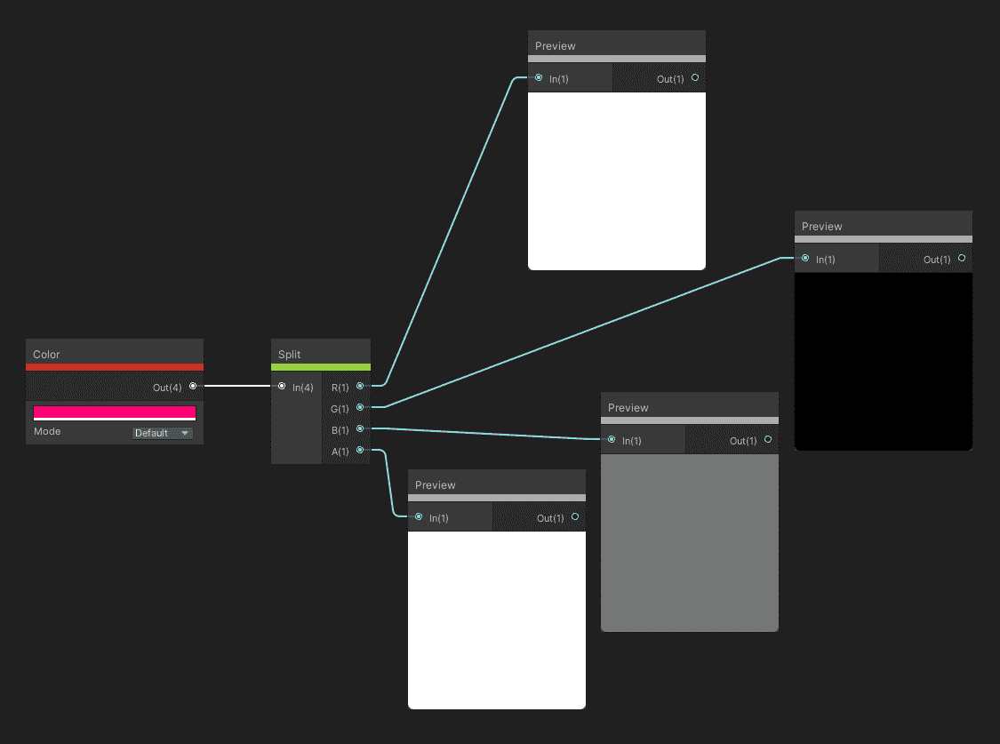*We can separate out each channel of a color using Split.*
*我们可以使用拆分分离出颜色的每个通道。*

### ₈₇ Swizzle

Swizzling is when you take the components of a vector and output them in a different order. The `Swizzle` node takes in a vector of up to four elements as input, and provides four options on the node to determine how to swizzle the input. This node always outputs a `Vector 4`, and each option lets us choose an input channel to use for the corresponding output. For example, changing the “Green Out” dropdown to Blue means the second output component takes the third input component.

Swizzling 是指获取向量的分量并以不同的顺序输出它们。该节点接受最多四个元素的向量作为输入，并在节点上提供四个选项来确定如何调整输入。这个节点总是输出一个 ，每个选项都允许我们选择一个输入通道来用于相应的输出。例如，将“Green Out”下拉列表更改为“蓝色”表示第二个输出分量采用第三个输入分量。

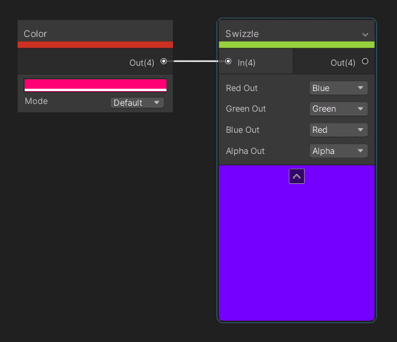*With Swizzle, we can shuffle the order of, remove, or duplicate components of a vector.*
*使用 Swizzle（中译为鸡尾酒)，我们可以打乱向量的顺序、删除或复制向量的分量。*

### ₈₈ Flip

The `Flip` node takes a vector of up to four elements as input, and for each input component, the node provides a checkbox to decide whether to flip that input. Flipping means that positive values become negative, and vice versa. The output vector has as many components as the input.

翻转节点将最多四个元素的向量作为输入，对于每个输入组件，节点都会提供一个复选框来决定是否翻转该输入。翻转意味着正值变为负值，反之亦然。输出向量的分量与输入一样多。

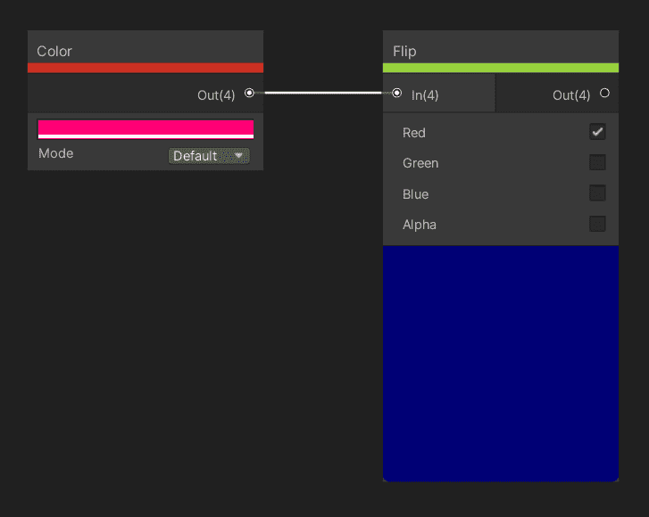*Remember that values below 0 are preserved, so the red channel here outputs -1.*
*请记住，将保留低于 0 的值，因此此处的红色通道输出 -1。*

### ₈₉ Combine

The `Combine` node lets us feed up to four values into the **R**, **G**, **B** and **A** inputs and the node will combine those individual elements into vectors. The node provides three outputs with four, three and two components respectively, depending on the size of the vector you want to create.

该节点允许我们向 **R**、**G**、**B** 和 **A** 输入输入最多四个值，节点将这些单独的元素组合成向量。该节点提供三个输出，分别包含四个、三个和两个分量，具体取决于要创建的向量的大小。

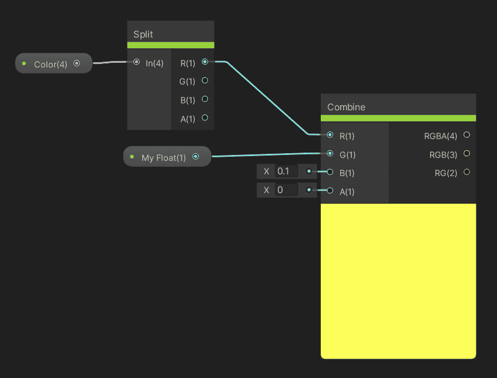*We can build colors or other vectors by joining together components from other nodes.*
*我们可以通过将来自其他节点的组件连接在一起来构建颜色或其他向量。*

# UV Nodes

The UV family of nodes can all be used to transform the UVs we use to sample textures.
UV 系列节点都可用于转换我们用于对纹理进行采样的 UV。

### ₉₀ Tiling And Offset

`Tiling And Offset` is another node you’ll see me use often. As the name suggests, you can use this node to tile and offset your UVs, which is especially helpful for texturing – the **Tiling** input is a `Vector 2` which controls how many times the texture is copied across an object, and the **Offset** `Vector 2` input can be used to scroll the texture in whichever direction you want. The other input is the set of **UV**s which the tiling and offset is applied to. The output is a new set of **UV**s after the tiling and offset have been applied.

`平铺和偏移`是你会看到我经常使用的另一个节点。顾名思义，您可以使用此节点来平铺和偏移 UV，这对纹理特别有用 - **平铺**输入是控制纹理在对象上复制的次数，**而 Offset** 输入可用于将纹理滚动到您想要的任何方向。另一个输入是应用平铺和偏移的 **UV**s 集。输出是应用平铺和偏移后的一组新 **UV**。

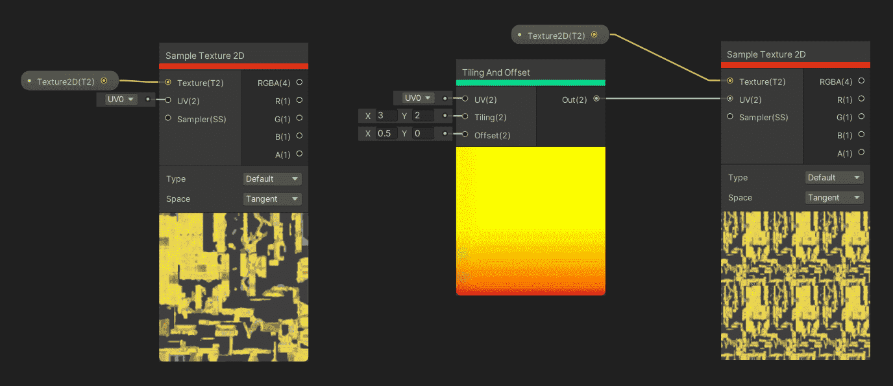*Tiling And Offset is great for animating texture by scrolling over time.*
*平铺和偏移非常适合通过随时间滚动来制作纹理动画。*

### ₉₁ Rotate

The `Rotate` node takes in a **UV** as input and will rotate around the **Centre** point, which is another input `Vector 2`, by the rotation amount, which is a float input. This node also has a **Unit** dropdown, which determines whether the rotation is applied in radians or degrees. The single output is a new set of **UV** coordinates after the rotation has been applied.

旋转节点接收**UV**作为输入，并将围绕**中心**点（另一个输入Vector2）旋转，旋转量为浮点输入。此节点还具有**“单位”**下拉列表，用于确定是以弧度还是度为单位应用旋转。单个输出是应用旋转后的一组新的 **UV** 坐标。

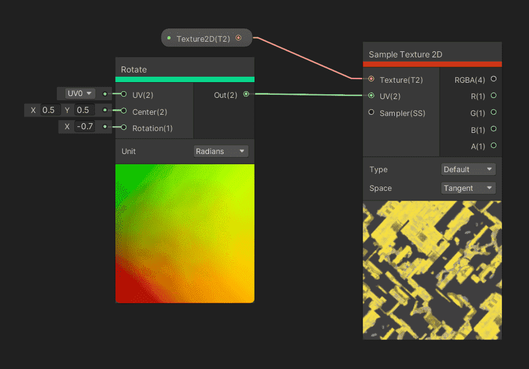*You spin me right round baby, right round.*
*你把我转过来，宝贝，右转。*

### ₉₂ Spherize

The `Spherize` node distorts the UVs as if they’re being applied to a sphere instead of a flat surface – the Unity documentation describes it like a fisheye lens. The **UV** input gives us the base UVs before the transformation, and like `Rotate`, the **Centre** gives us the origin point of the effect. The **Strength** determines how strongly the effect is applied, and the **Offset** is used to scroll the UVs before the transformation has been applied. The only output is the **UV**s after being spherized.

球面化节点扭曲了UV，就好像它们被应用于球体而不是平面一样——Unity 文档将其描述为鱼眼镜头。**UV** 输入为我们提供了转换前的基本 UV，并且像 **一样，中心**为我们提供了效果的原点。**“强度**”（Strength） 决定了效果的强度，**而“偏移”（Offset**） 用于在应用变换之前滚动 UV。唯一的输出是球形后的**UV**。

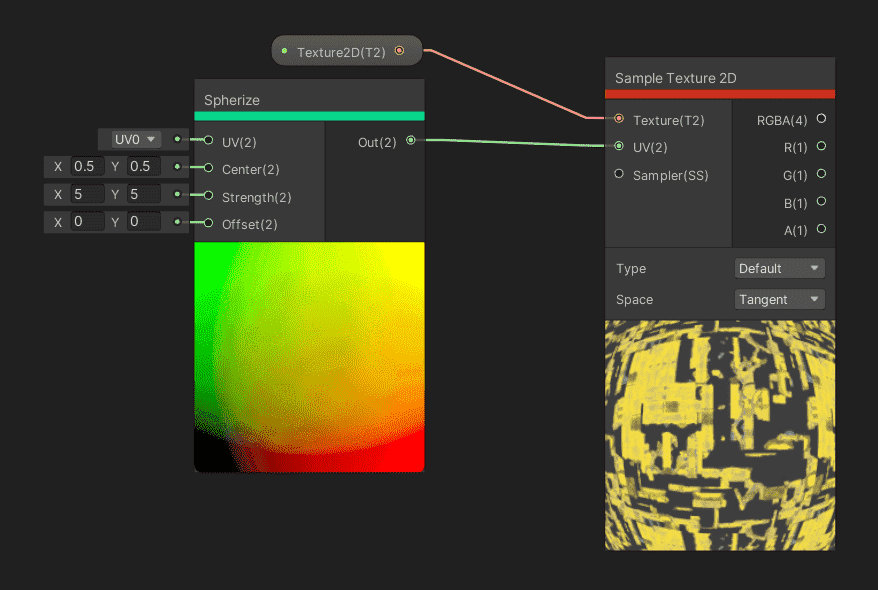*The Spherize node is great for imitating a fisheye lens.*
*Spherize 节点非常适合模仿鱼眼镜头。*

### ₉₃ Twirl

The `Twirl` node has the same four inputs as `Spherize`, except now the transformation is that the **UV**s spiral from the outer edge. The single output is the new set of **UV**s after the twirling.

转动节点具有与Spherize 相同的四个输入，只不过现在的变换是 **UV**s 从外边缘螺旋。单输出是旋转后的新一组**UV**。

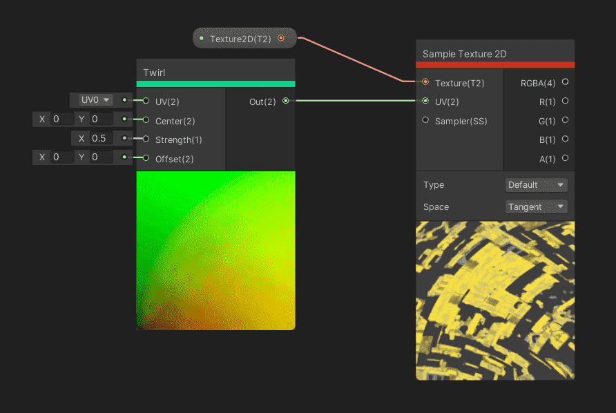*Twirl is somewhere between Rotate and Spherize.*
*Twirl 介于 Rotate 和 Spherize 之间。*

### ₉₄ Radial Shear

The `Radial Shear` node also takes those same four inputs as `Twirl` and `Spherize`, but now the transformation is a wave effect from whatever the centre point is. The output is a new set of **UV**s after the transformation is applied.

径向剪切节点也接受像Twirl 和 Spherize 一样的四连输入，但现在变换是来自任何中心点的波效应。输出是应用变换后的一组新 **UV**。

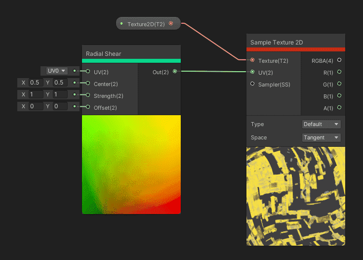*This is like Twirl, but we have control over both axes.*
*这就像漩涡一样，但我们可以控制两个轴。*

### ₉₅ Triplanar

The `Triplanar` node is a bit more complicated to explain. The idea is that we sample the texture three times along the world-space X, Y and Z axes, which ends up with three mappings that look great applied from those three directions. For that, we supply a **Texture** and a **Sampler** as input. Then, one of those mappings is planar-projected onto the mesh based on the normal vector on the surface. The one that results in the least amount of distortion is picked, with some amount of blending.

该“三平面”节点的解释有点复杂。我们的想法是，我们沿着世界空间 X、Y 和 Z 轴对纹理进行三次采样，最终得到三个从这三个方向应用看起来很棒的映射。为此，我们提供了一个**纹理**和一个**采样器**作为输入。然后，根据曲面上的法向量将其中一个映射平面投影到网格上。选择失真最少的那个，并进行一定量的混合。

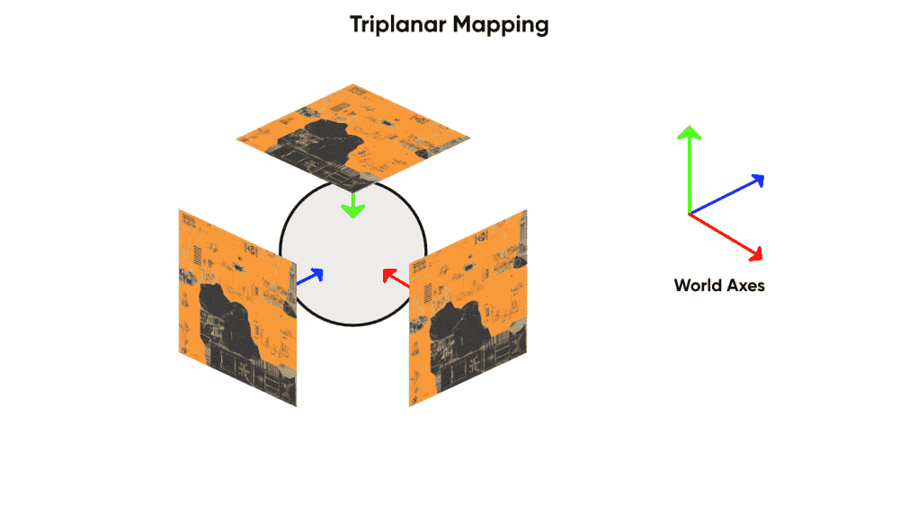*Here’s the three axes used to apply the texture.*
*下面是用于应用纹理的三个轴。*

We supply the **Position** and **Normal** vectors for the mapping as inputs too, as well as a **Blend** parameter which controls how much we smooth between the three samples at edges. The higher this parameter is, the sharper the mapping is. Finally, we supply a **Tile** float parameter to tile the UVs before the mapping is applied to the mesh. The output is the color after blending has taken place. We can use the **Type** setting in the middle of the node to switch between **Default** and **Normal**, which tells Unity which type of texture we’re expecting to sample.

我们还提供了用于映射的 **Position** 和 **Normal** 向量作为输入，以及一个 **Blend** 参数，用于控制我们在边缘的三个样本之间的平滑程度。此参数越高，映射越清晰。最后，我们提供了一个 **Tile** float 参数，用于在将映射应用于网格之前对 UV 进行平铺。输出是混合后的颜色。我们可以使用节点中间的 **Type** 设置在 **Default** 和 **Normal** 之间切换，它告诉 Unity 我们期望采样哪种类型的纹理。

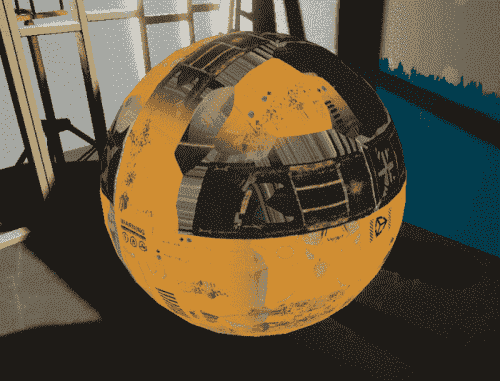*Triplanar will map the same texture in three directions onto an object.*
*Triplanar 会在三个方向上将相同的纹理映射到一个对象上。*

### ₉₆ Polar Coordinates

The `Polar Coordinates` node is used to transform a set of **UV**s from a **Cartesian** coordinate system, which is the coordinate system you’re likely most familiar with, to a **Polar** coordinate system, where each point is described by a distance and an angle away from some centre point. The **UV**s and **Centre** point are both inputs, and we can set how much to scale the angle and length using the **Radial Scale** and **Length Scale** float inputs respectively. The output is a new set of **UV**s in this polar coordinate system.

该节点（极坐标）用于将一组 **UV**从**笛卡尔**坐标系（您可能最熟悉的坐标系）转换为**极坐**标系，其中每个点都由距某个中心点的距离和角度来描述。**UV**s 和**中心**点都是输入，我们可以分别使用**径向刻度**和**长度刻度**浮点输入来设置角度和长度的缩放幅度。输出是此极坐标系中的一组新 **UV**s。

Certain kinds of panoramic images can be decoded using polar coordinates, which means we can use them for skyboxes or reflection maps.

某些类型的全景图像可以使用极坐标进行解码，这意味着我们可以将它们用于天空盒或反射图。

*We can use polar coordinates for several cool patterns, like these two.*
*我们可以将极坐标用于几种很酷的模式，比如这两个。*

### ₉₇ Flipbook

The `Flipbook` node is very useful if you’re trying to make a flipbook animation, especially for sprites. The **UV** input is the same as the UV input on any of these nodes so far, and we can also supply the **Width** and **Height** as floats, which should be the number of flipbook tiles on your texture in the x- and y-direction. The **Tile** input will determine which tile you want to sample, and Unity will calculate new UVs which pick only that part of the texture, which becomes the output. The direction of the UVs, in other words the order in which the Tile input picks tiles, is determined by the **Invert X** and **Invert Y** options. By default, **Invert Y** is ticked, and tiles are picked starting from the top-left and moving horizontally first. Typically, you would use the output UVs in a `Sample Texture 2D` node to sample whatever texture you had in mind.

如果您尝试制作翻书动画，该节点非常有用，尤其是对于精灵。到目前为止**，UV** 输入与这些节点上的 UV 输入相同，我们还可以提供 **Width** 和 **Height** 作为浮点数，这应该是纹理上 x 和 y 方向的翻书图块的数量。Tile 输入将确定要采样的 **Tile，Unity** 将计算新的 UV，这些 UV 仅选取纹理的那部分，从而成为输出。UV 的方向，换言之，Tile 输入拾取图块的顺序，由 **Invert X** 和 **Invert Y** 选项确定。默认情况下，勾选 **Invert Y**，并从左上角开始拾取图块并首先水平移动。通常，您将使用节点中的输出 UV 来采样您想到的任何纹理。

*This node tree will cycle through the whole sprite sheet for this character sprite.*
*此节点树将循环遍历此角色精灵的整个精灵表。*

### ₉₈ Parallax Mapping

The `Parallax Mapping` node can be used to fake depth inside your material by displacing the UVs. We can supply a **Heightmap**, which is a greyscale texture controlling how high or low each part of the surface should be. Together with that, we can add a **Sampler State**. The **Amplitude** float is a multiplier, in centimetres, for the heights read from the heightmap, and the **UV**s are used for sampling the heightmap. The output **Parallax UV**s are the modified UVs which can be used to sample another texture with parallax applied.

该节点（视差映射）可用于通过置换 UV 来伪造材料内部的深度。我们可以提供一个**高度贴图**，它是一种灰度纹理，用于控制表面每个部分的高度或高度。除此之外，我们还可以添加一个**采样器状态**。**振幅**浮点数是一个乘数，以厘米为单位，用于从高度图中读取的高度，**UV**s 用于对高度图进行采样。输出的**视差UV**是修改后的UV，可用于对应用视差的另一种纹理进行采样。

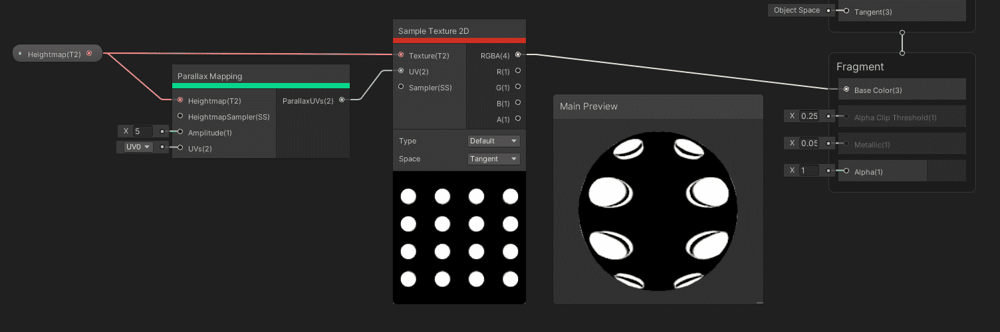*Using the same texture for the base and the heightmap, you can see how the offset is applied.*
*对底座和高度贴图使用相同的纹理，您可以看到偏移是如何应用的。*

### ₉₉ Parallax Occlusion Mapping

The `Parallax Occlusion Mapping` node acts the same way as the `Parallax Mapping` node, except the latter doesn’t take occlusion into account – higher parts of the heightmap can obscure lighting on lower parts. Now we have three added parameters: the **Steps** parameter controls how many times the internal algorithm runs in order to detect occlusion – higher values means more accuracy, but slower runtime.

该节点（视差遮挡映射）的作用方式与`Parallax Mapping` node节点相同，只是后者不考虑遮挡 - 高度贴图的较高部分可能会遮挡较低部分的照明。现在我们增加了三个参数：**Steps** 参数控制内部算法运行多少次以检测遮挡 - 值越高意味着精度越高，但运行时间越慢。

We also now have an **LOD** parameter to sample the heightmap at different mipmaps, and an **LOD Threshold** parameter – mipmap levels below this will not apply the parallax effect for efficiency, which is useful for building an LOD system for your materials. The **Parallax UV**s are a similar output, and now we have an extra **Pixel Depth Offset** output which can be used for screen-space ambient occlusion. You might need to add that as an block node on your Master Stack.

我们现在还有一个 **LOD** 参数，用于在不同的 mipmap 下对高度贴图进行采样，以及一个 **LOD 阈值**参数 – 低于此值的 mipmap 级别将不会应用视差效应以提高效率，这对于为您的材质构建 LOD 系统很有用。**视差UV**是类似的输出，现在我们有一个额外的**像素深度偏移**输出，可用于屏幕空间环境光遮蔽。您可能需要将其添加为主堆栈上的块节点。

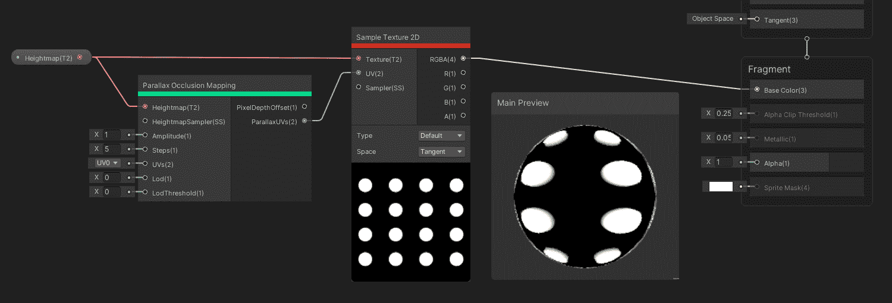*Using the same texture for the base and the heightmap, you can see how the offset is applied.*
*对底座和高度贴图使用相同的纹理，您可以看到偏移是如何应用的。*

# Math Nodes

Math nodes, as you can imagine, are all about basic math operations, ranging from basic arithmetic to vector algebra.
可以想象，数学节点都是关于基本数学运算的，从基本算术到向量代数。

## Math/Basic Nodes

### ₁₀₀ Add

Now we can take a rest with some super simple nodes! I bet you can’t guess what the `Add` node does. It takes two float inputs, and the output is those two added together.

现在我们可以休息一下一些超级简单的节点了！我敢打赌你猜不到节点是做什么的。它需要两个浮点输入，输出是这两个相加。

### ₁₀₁ Subtract

The `Subtract` node, on the other hand, takes the A input and subtracts the B input.

相减节点，节点接受 A 输入并减去 B 输入。

### ₁₀₂ Multiply

The `Multiply` node takes your two inputs and multiplies them together, although this is more in-depth than other basic maths nodes. If both inputs are floats, they are multiplied together, and if they’re both vectors, it’ll multiply them together element-wise, and return a new vector the same size as the smaller input. If both inputs are matrices, the node will truncate them so that they are the same size and perform matrix multiplication between the two, outputting a new matrix the same size as the smaller input. And if a vector and a matrix are input, the node will add elements to the vector until it is large enough, then multiply the two.

该节点接受您的两个输入并将它们相乘，尽管这比其他基本数学节点更深入。如果两个输入都是浮点数，则将它们相乘，如果它们都是向量，则按元素将它们相乘，并返回一个与较小输入大小相同的新向量。如果两个输入都是矩阵，节点将截断它们，使它们大小相同，并在两者之间执行矩阵乘法，输出一个与较小输入大小相同的新矩阵。如果输入向量和矩阵，节点会向向量添加元素，直到它足够大，然后将两者相乘。

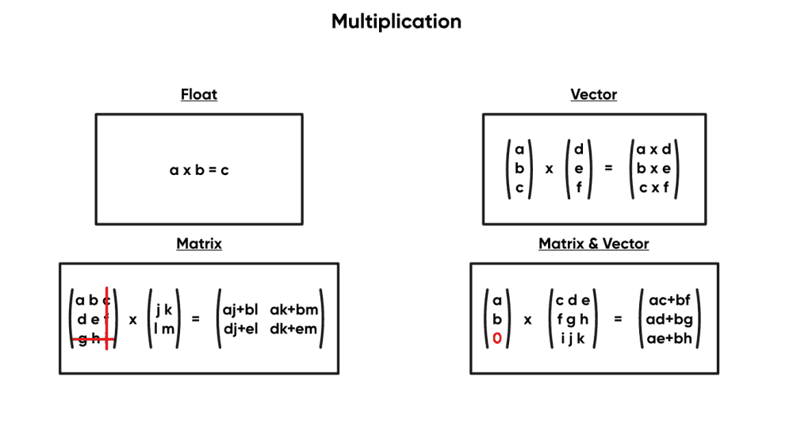*Multiplying is more complex than expected depending on the inputs!*
*乘法比预期的要复杂，具体取决于输入！*

### ₁₀₃ Divide

The `Divide` node also takes in two floats and returns the **A** input divided by the **B** input.

该节点还接受两个浮点数，并返回 **A** 输入除以 **B** 输入。

### ₁₀₄ Power

The `Power` node takes in two floats and returns the first input raised to the power of the second input.

该节点接受两个浮点数，并返回第一个输入提升到第二个输入的幂。

### ₁₀₅ Square Root

And finally, the `Square Root` node takes in a single float and returns its square root.

最后，节点接受单个浮点数并返回其平方根。

## Math/Interpolation Nodes

The Interpolation family of nodes are all about smoothing between two values to get a new value.

Interpolation（插值） 系列节点都是关于在两个值之间平滑以获得新值的。

### ₁₀₆ Lerp

The `Lerp` node is extremely versatile. `Lerp` is short for “linear interpolation” – we take in two inputs, **A** and **B**, which can be vectors of up to four components. If you supply vectors of different sizes, Unity will discard the extra channels from the larger one. We also take a **T** input, which can be the same size as those input vectors, or it can be a single float. **T** is clamped between 0 and 1. Interpolation draws a straight line between the **A** and **B** inputs and picks a point on the line based on **T** – if **T** is 0.25, the point is 25% between **A** and **B**, for example. If **T** has more than one component, the interpolation is applied per-component, but if it is a single float, then that same value is used for each of **A** and **B**’s components. The output is the value that got picked.

该节点用途广泛。 是“线性插值”的缩写——我们接受两个输入，**A** 和 **B**，它们可以是最多四个分量的向量。如果提供不同大小的向量，Unity 将丢弃较大通道中的额外通道。我们还采用**一个 T** 输入，它可以与这些输入向量的大小相同，也可以是单个浮点数。**T** 被夹在 0 和 1 之间。插值在 **A** 和 **B** 输入之间画一条直线，并根据 **T** 在直线上选取一个点 - 例如，如果 **T** 为 0.25，**则该**点在 A 和 **B** 之间为 25%。如果 **T** 具有多个分量，则按分量应用插值，但如果它是单个浮点数，则对 **A** 和 **B** 的每个分量使用相同的值。输出是选取的值。

### ₁₀₇ Inverse Lerp

The `Inverse Lerp` node does the inverse process to `Lerp`. Given input values **A**, **B** and **T**, `Inverse Lerp` will work out what interpolation factor between 0 and 1 would have been required in a `Lerp` node to output **T**. I hope that makes sense!

节点对 Lerp 执行逆过程。给定输入值 **A**、**B** 和 **T**，将计算出节点中输出 **T** 所需的 0 和 1 之间的插值因子。我希望这是有道理的！

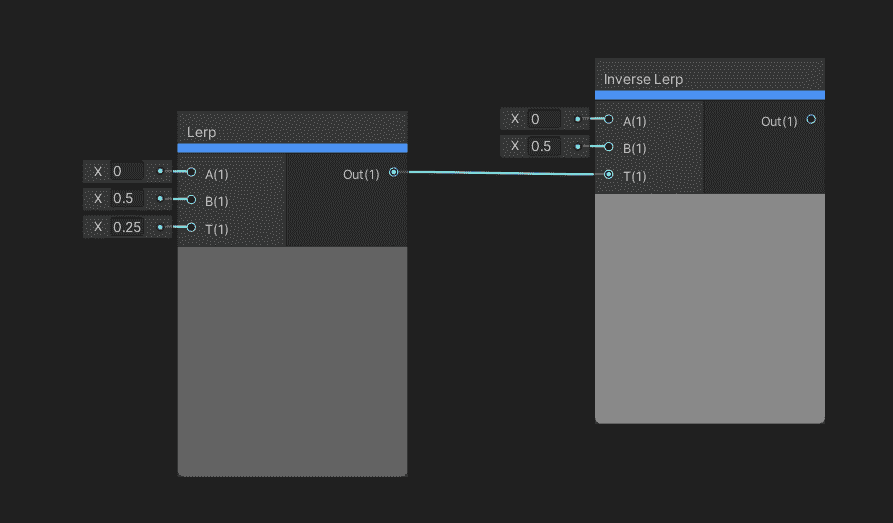*The Lerp result is 25% between 0 and 0.5. The Inverse Lerp result is 0.25.*
*Lerp 结果在 0 到 0.5 之间为 25%。Inverse Lerp 结果为 0.25。*

### ₁₀₈ Smoothstep

`Smoothstep` is a special sigmoid function which can be used for creating a smooth but swift gradient when an input value crosses some threshold. The **In** parameter is your input value. The node takes two **Edge** parameters, which determine the lower and higher threshold values for the curve. When **In** is lower than **Edge 1**, the output is 0, and when **In** is above **Edge 2**, the output is 1. Between those thresholds, the output is a smooth curve between 0 and 1.

`Smoothstep`是一个特殊的S形函数，可用于在输入值超过某个阈值时创建平滑但快速的梯度。**In** 参数是输入值。该节点采用两个 **Edge** 参数，用于确定曲线的下限和上限阈值。当 **In** 低于 **Edge 1** 时，输出为 0，当 **In** 高于 **Edge 2** 时，输出为 1。在这些阈值之间，输出是介于 0 和 1 之间的平滑曲线。

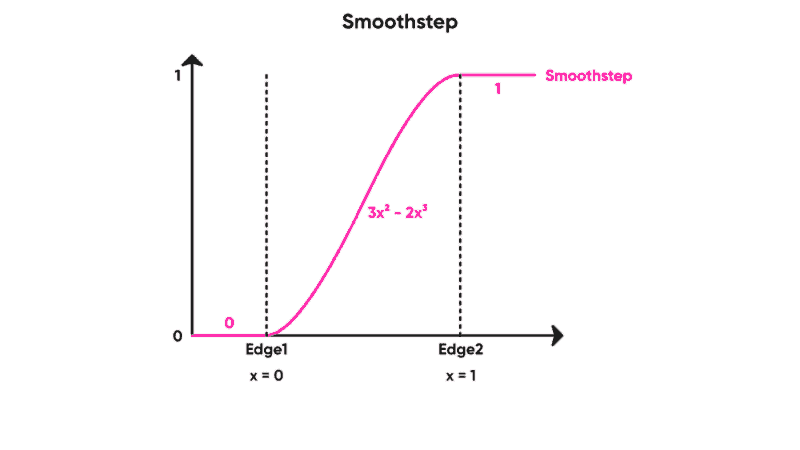*Smoothstep is great for setting up thresholds with small amounts of blending.*
*Smoothstep 非常适合通过少量混合设置阈值。*

## Math/Range Nodes

The Range node family contains several nodes for modifying or working with the range between two values.

“范围”节点族包含多个节点，用于修改或处理两个值之间的范围。

### ₁₀₉ Clamp

The `Clamp` node takes in an input vector of up to four elements, and will clamp the values element-wise so that they never fall below the **Min** input and are never above the **Max** input. The output is the vector after clamping.

该节点（Clamp译为夹子）接受最多四个元素的输入向量，并将逐个元素钳位值，以便它们永远不会低于**最小**值输入，也不会高于**最大**值输入。输出是箝位后的矢量。

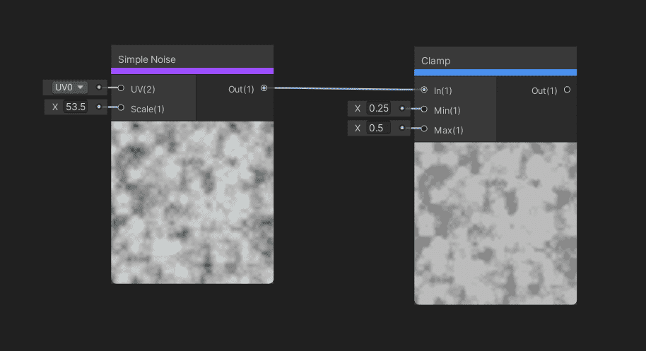*Clamp is an easy way to remove values too high or too low for your needs.*
*Clamp 是一种简单的方法，可以去除过高或过低的值，以满足您的需求。*

### ₁₁₀ Saturate

The `Saturate` node is like a `Clamp` node, except the min and max values are always 0 and 1.

该节点（Saturate译为饱和，浸透）类似于Clamp节点，只是最小值和最大值始终为 0 和 1。

### ₁₁₁ Minimum

The `Minimum` node takes in two vector inputs and outputs a vector of the same size where each element takes the lowest value from the corresponding elements on the two inputs. If you input two floats, it just takes the lower one.

该节点接受两个向量输入并输出一个相同大小的向量，其中每个元素从两个输入上的相应元素中获取最低值。如果您输入两个浮点数，则只取较低的浮点数。

### ₁₁₂ Maximum

And the `Maximum` node does a similar thing, except it returns the higher number for each component of the input vectors.

节点也做类似的事情，只不过它为输入向量的每个分量返回较大的数字。

### ₁₁₃ One Minus

The `One Minus` node takes each component of the input vector and returns one, minus that value. Shocking, I know.

该节点获取输入向量的每个分量并返回一个减去该值。令人震惊，我知道。

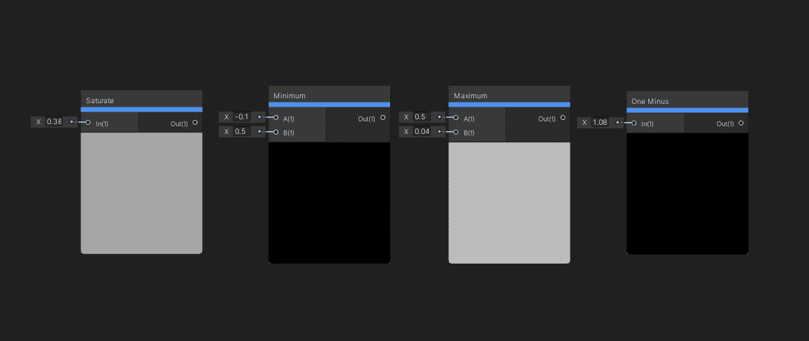*It’s difficult to make these nodes look interesting in screenshots!*
*很难让这些节点在屏幕截图中看起来很有趣！*

### ₁₁₄ Remap

The `Remap` node is a special type of interpolation. We take an input vector of up to four elements. Then we take two `Vector 2` inputs: one is the **In Min Max** vector which specifies the minimum and maximum values that the input should have. The **Out Min Max** vector specifies the minimum and maximum value the output should have. So this node ends up, essentially, performing an `Inverse Lerp` with the input value and **In Min Max** to determine the interpolation factor, then does a `Lerp` using that interpolation factor between the **Out Min Max** values. The results are then output.

“重映射”节点是一种特殊类型的插值。我们采用最多四个元素的输入向量。然后我们采用两个Vector2输入：一个是**最小最大**值向量，它指定输入应具有的最小值和最大值。**Out Min Max** 向量指定输出应具有的最小值和最大值。因此，该节点最终基本上会使用输入值和 **In Min Max** 执行 Inverse Lerp以确定插值因子，然后在 **Out Min Max** 值之间使用该插值因子执行Lerp。然后输出结果。

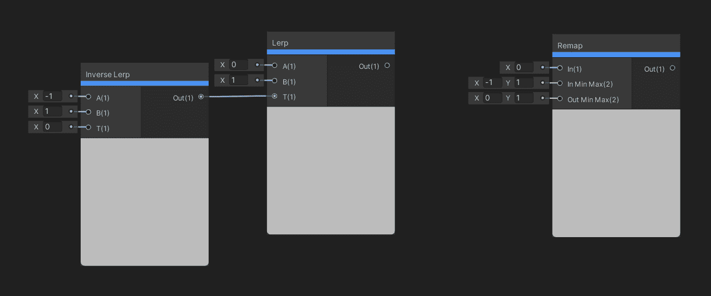*The In input to the Remap is the same as the T input to the Inverse Lerp on this pair of nodes.*
*Remap 的 In 输入与此对节点上 Inverse Lerp 的 T 输入相同。*

### ₁₁₅ Random Range

The `Random Range` node can be used to generate pseudo-random numbers between the **Min** and **Max** input floats. We specify a `Vector 2` to use as the input seed value, and then a single float is output. This node is great for generating random noise, but since we specify the seed, you can use the position of, for example, fragments in object space so that your output values stay consistent between frames. Or you could use time as an input to randomise values between frames.

该节点可用于在 **Min** 和 **Max** 输入浮点数之间生成伪随机数。我们指定一个用作输入种子值，然后输出一个浮点数。此节点非常适合生成随机噪声，但由于我们指定了种子，因此您可以使用对象空间中片段的位置，以便输出值在帧之间保持一致。或者，您可以使用时间作为输入来随机化帧之间的值。

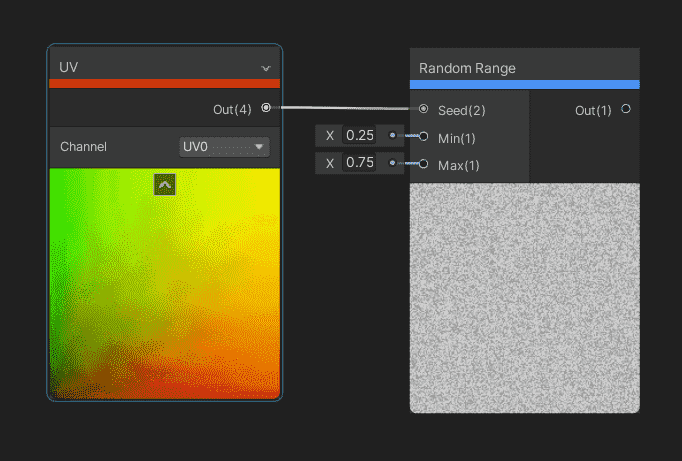*The Random Range node gives random values depending on an input seed.*
*“随机范围”节点根据输入种子提供随机值。*

### ₁₁₆ Fraction

The `Fraction` node takes an input vector, and for each component, returns a new vector where each value takes the portion after the decimal point. The output, therefore, is always between 0 and 1.

节点采用一个输入向量，对于每个组件，返回一个新向量，其中每个值取小数点后的部分。因此，输出始终介于 0 和 1 之间。

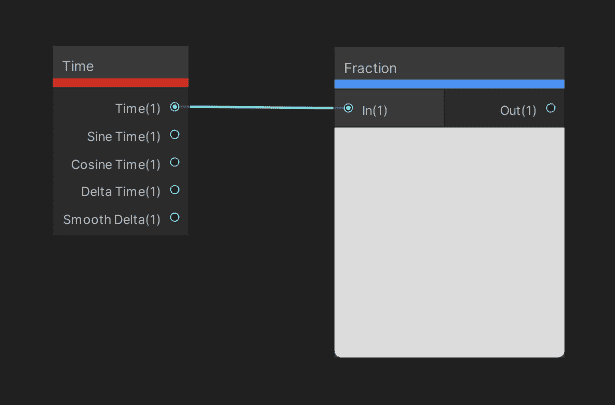*This pair of nodes will rise from 0 to 1 then blink right back to 0 continually.*
*这对节点将从 0 上升到 1，然后不断闪烁回 0。*

## Math/Round Nodes

The Round node family is all about snapping values to some other value.

Round 节点系列是关于将值捕捉到其他值。

### ₁₁₇ Floor

The `Floor` node takes a vector as input, and for each component, returns the largest whole number lower or equal to that value.

节点（地板）将向量作为输入，对于每个分量，返回小于或等于该值的最大整数。

### ₁₁₈ Ceiling

The `Ceiling` node is similar, except it takes the next whole number greater than or equal to the input.

该节点（天花板）与此类似，只是它采用大于或等于输入的下一个整数。

### ₁₁₉ Round

And the `Round` node is also similar, except it rounds up or down to the nearest whole number.

节点也是相似的，只是它向上或向下舍入到最接近的整数。

### ₁₂₀ Sign

The `Sign` node takes in a vector and for each component, returns 1 if the value is greater than zero, 0 if it is zero, and -1 if it is below zero.

该节点接受一个向量，对于每个分量，如果值大于零，则返回 1，如果值为零，则返回 0，如果值低于零，则返回 -1。

### ₁₂₁ Step

The `Step` node is a very useful function that takes in an input called **In**, and if that is below the **Edge** input, the output is 0. Else, if **In** is above the **Edge** input, the output becomes 1. If a vector input is used, it operates per-element.

该节点是一个非常有用的函数，它接受一个名为 **In** 的输入，如果该输入低于 **Edge** 输入，则输出为 0。否则，如果 **In** 高于 **Edge** 输入，则输出变为 1。如果使用向量输入，则它按元素进行操作。

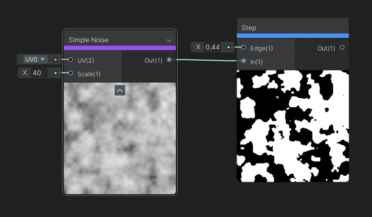*Use Step as a threshold on a color or other value.*
*使用“步长”作为颜色或其他值的阈值。*

### ₁₂₂ Truncate

The `Truncate` node takes an input float and removes the fractional part. It seemingly works the same as `Floor`, except it works differently on negative numbers. For instance, -0.3 will floor to -1, but it truncates to 0.

该节点（截断）采用输入浮点数并删除小数部分。它的工作原理似乎与 相同，只是它对负数的工作方式不同。例如，-0.3 将降至 -1，但它会截断为 0。

## Math/Wave Nodes

The Wave node family is a very handy group of nodes used for generating different kinds of waves, which are great for creating different patterns for materials.

波形节点系列是一组非常方便的节点，用于生成不同种类的波，非常适合为材料创建不同的图案。

### ₁₂₃ Noise Sine Wave

The `Noise Sine Wave` node will return the sine of the input value, but will apply a small pseudorandom noise to the value. The size of the noise is random between the min and max values specified in the **Min Max** `Vector 2`. The output is just the sine wave value.

该节点将返回输入值的正弦值，但将对该值应用一个小的伪随机噪声。噪声的大小在 **Min Max** 中指定的最小值和最大值之间是随机的。输出只是正弦波值。

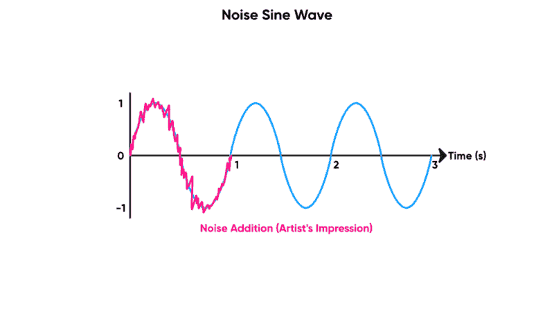*The noise component adds variation to the usual sine wave.*
*噪声分量增加了通常的正弦波的变化。*

### ₁₂₄ Square Wave

A `Square Wave` is one that constantly switches between the values -1 and 1 at a regular interval. The `Square Wave` node takes in an input value and returns a square wave using that as the time parameter. If you connect a `Time` node, then it will complete a cycle each second.

方波是定期在值 -1 和 1 之间不断切换的值。节点接受一个输入值，并使用该值作为时间参数返回一个方波。如果你连接一个节点，那么它将每秒完成一个循环。

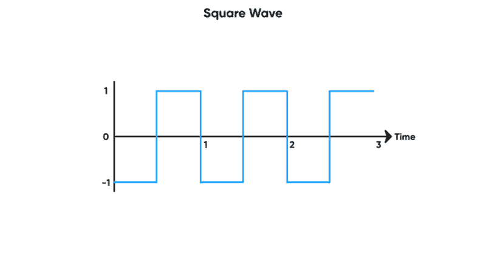*Don’t be square, use the Square Wave today!*
*不要正方形，今天就用方波吧！*

### ₁₂₅ Triangle Wave

A `Triangle Wave` rises from -1 to 1 linearly, then falls back to -1 linearly. The curve looks like a series of triangular peaks, hence the name. This node goes from -1 to 1 to -1 again over an interval of one second.

三角波从 -1 线性上升到 1，然后线性回落到 -1。曲线看起来像一系列三角形的山峰，因此得名。此节点在一秒钟的间隔内再次从 -1 变为 1 再到 -1。

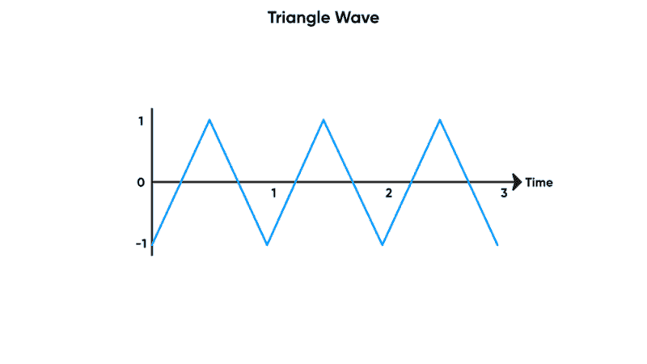*Use a triangle wave if you need something sharper than a sine wave.*
*如果您需要比正弦波更尖锐的东西，请使用三角波。*

### ₁₂₆ Sawtooth Wave

A `Sawtooth Wave` rises -1 to 1 linearly, then instantaneously drops back down to -1. The curve looks like a series of sharp peaks, like a saw. This node completes one cycle of going from -1 to 1 within a second.

 锯齿波，线性上升 -1 到 1，然后瞬间回落到 -1。曲线看起来像一系列尖锐的山峰，就像锯子一样。该节点在一秒钟内完成从 -1 到 1 的一个循环。

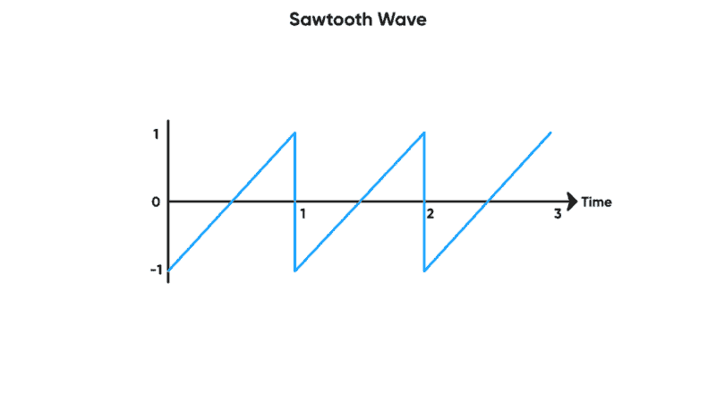*A sawtooth wave is similar to a Time and Modulo combo, but it goes from -1 to 1 instead of 0 to 1.*
*锯齿波类似于时间和模量组合，但它从 -1 到 1，而不是 0 到 1。*

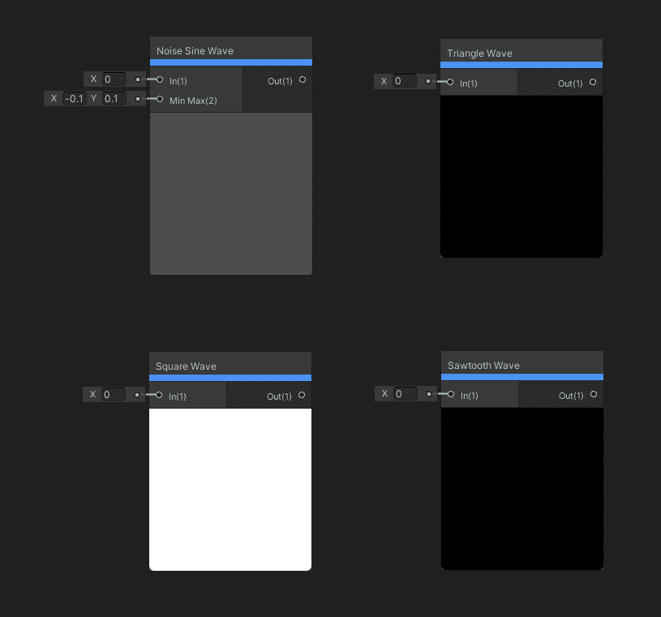*These four nodes are great for looping material animations over time.*
*这四个节点非常适合随时间循环播放材质动画。*

## Math/Trigonometry Nodes

The Trigonometry node family invokes fear in the hearts of school students everywhere. If you ever wondered when you’ll ever use trig in later life, this is where.

三角学节点家族在各地的学生心中唤起了恐惧。如果您想知道什么时候会在以后的生活中使用 ，那么这里就是您所在的地方。

### ₁₂₇ Sine, ₁₂₈ Cosine, ₁₂₉ Tangent

The `Sine`, `Cosine` and `Tangent` nodes perform the corresponding basic trig function on the input, which is an angle in radians. `Sine` and `Cosine` return values between -1 and 1, where `Tangent` may return values from -Infinity to Infinity. Sine and cosine functions are used under the hood during cross product calculations.

正弦，余弦和 正切 节点在输入上执行相应的基本三角函数，即弧度角。 sine和cosine返回介于 -1 和 1 之间的值，tangent返回从 -Infinity 到 Infinity 的值。正弦和余弦函数在交叉乘积计算过程中使用。

### ₁₃₀ Arcsine, ₁₃₁ Arccosine, ₁₃₂ Arctangent

The `Arcsine`, `Arccosine` and `Arctangent` nodes do the opposite - these are the inverse trig functions, and we can use them to get back the angle from our input value (where the input is a valid output value from one of `Sine`, `Cosine` or `Tangent`). All the outputs are in radians: `Arcsine` accepts values between -1 and 1 and will return an angle between minus pi over 2 and pi over 2; `Arccosine` accepts inputs from -1 to 1, but this time returns the angle between 0 and pi; and the `Arctangent` node takes any `Float` value as input and returns an angle between minus pi over 2 and pi over 2, like `Sine`.

反正弦，反余弦 和 反正切 节点则相反 - 这些是逆三角函数，我们可以使用它们从我们的输入值（其中输入是“正弦”、“余弦”或“切线”之一的有效输出值）返回角度。所有输出均以弧度为单位：反正弦接受 -1 和 1 之间的值，并将返回 负二分之π到正二分之 π之间的角度; 反余弦接受从 -1 到 1 的输入，但这次返回 0 和 pi 之间的角度;反正切节点将任何值作为输入，并返回一个负二分之π到正二分之 π之间的角度，如 Sine 。

### ₁₃₃ Arctangent2

`Arctangent2` is the two-argument arctangent function. Given inputs **A** and **B**, it gives the angle between the x-axis of a two-dimensional plane and the point vector (**B**, **A**).

`Arctangent2`是双参数反正切函数。给定输入 **A** 和 **B**，它给出了二维平面的 x 轴与点向量 （**B**， **A**） 之间的角度。

### ₁₃₄ Degrees To Radians

The `Degrees To Radians` node takes whatever the input float is, assumes it’s in degrees, and multiplies it by a constant such that the output is the same angle in radians.

角度转弧度  节点取输入浮点数的任何值，假设它以度为单位，并将其乘以一个常数，使输出以弧度为单位的角度相同。

### ₁₃₅ Radians To Degrees

The `Radians To Degrees` node does the opposite of `Degrees To Radians` - give it a radian value, and it’ll return the equivalent value in degrees.

弧度转角度 节点，与前者相反，它将返回以度为单位的等效值。

### ₁₃₆ Hyperbolic Sine, ₁₃₇ Hyperbolic Cosine, ₁₃₈ Hyperbolic Tangent

And finally, the `Hyperbolic Sine`, `Hyperbolic Cosine` and `Hyperbolic Tangent` nodes perform the three hyperbolic trig functions on your input angle. The inputs and outputs are `Float` values.

最后，双曲正弦，双曲余弦，双曲正切  节点在输入角度上执行三个双曲三角函数。输入和输出是Float值。

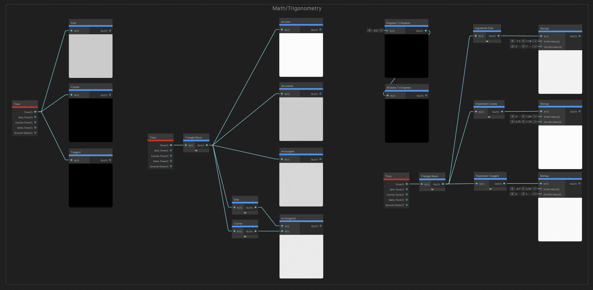*It’s not easy to represent these nodes in screenshots.*
*在屏幕截图中表示这些节点并不容易。*

## Math/Vector Nodes

The following Vector nodes can do several basic linear algebra operations for us.
以下 Vector 节点可以为我们执行几个基本的线性代数运算。

### ₁₃₉ Distance

The `Distance` node takes in two vectors and returns, as a float, the Euclidean distance between the two vectors. That’s the straight-line distance between the two.

该节点接受两个向量，并以浮点形式返回两个向量之间的欧几里得距离。这是两者之间的直线距离。

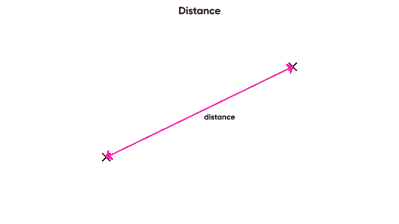*I think we need a bit of distance.*
*我认为我们需要一点距离。*

### ₁₄₀ Dot Product

The `Dot Product` is a measure of the angle between two vectors. When two vectors are perpendicular, the dot product is zero, and when they are parallel, it is either 1 or minus 1 depending on whether they point in the same or the opposite direction respectively. The dot product node takes in two vectors and returns the dot product between them as a `Float`.

是两个向量之间角度的量度。当两个向量垂直时，点积为零，当它们平行时，它是 1 或负 1，具体取决于它们分别指向相同还是相反的方向。点积节点接收两个向量，并将它们之间的点积作为Float 返回。

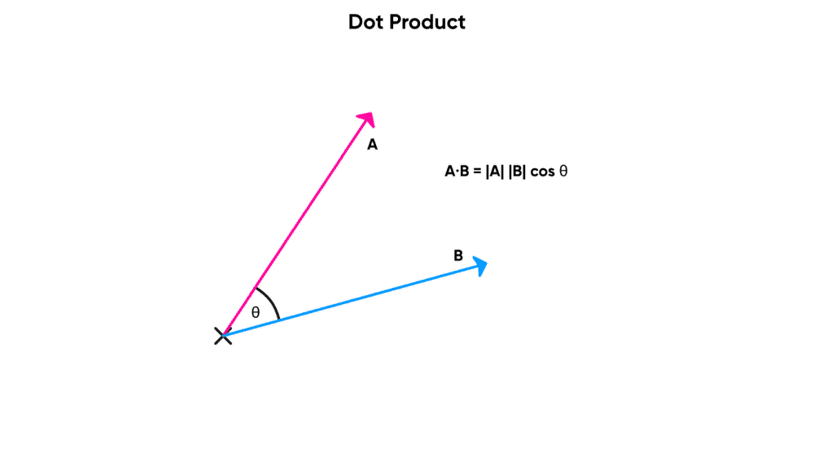*When the dot product is 0, the two vectors are orthogonal.*
*当点积为 0 时，两个向量是正交的。*

### ₁₄₁ Cross Product

The `Cross Product` between two vectors returns a third vector which is perpendicular to both. You will probably use the cross product to get directions, so magnitude doesn’t matter as much, but for clarity, the magnitude of the third vector is equal to the magnitude of the two inputs multiplied by the sine of the angle between them. The cross product node performs the cross product on the two inputs, which must be `Vector 3`s, and outputs a new `Vector 3` – the direction is based on the left-hand rule for vectors. In other words, if vector **A** points up and vector **B** points right, the output vector points forward.

两个向量之间返回第三个向量，该向量垂直于两者。您可能会使用叉积来获取方向，因此幅度并不重要，但为了清楚起见，第三个向量的幅度等于两个输入的幅度乘以它们之间角度的正弦。叉积节点在两个输入上执行叉积，该输入必须是 Vector3们，并输出一个新的Vector3 – 方向基于向量的左手法则。换言之，如果向量 **A** 指向上方，而向量 **B** 指向右侧，则输出向量指向前方。

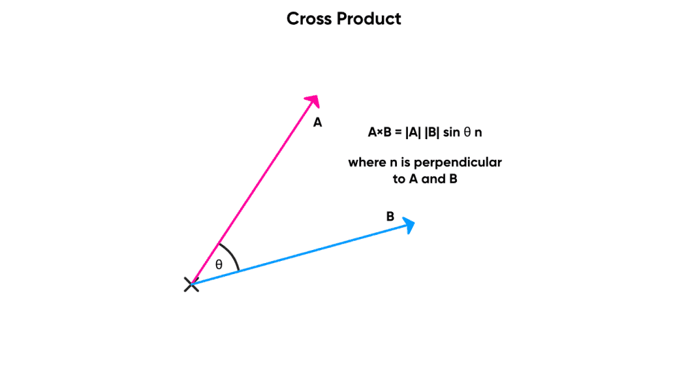*Are you cross with me?*
*你和我一起穿越吗？*

### ₁₄₂ Transform

The `Transform` node can be used to convert from one space to another. The input is a `Vector 3` and the output is another `Vector 3` after the transform has taken place. The node has two controls on its body which you can use to pick the **Space** you want to convert from and to – you can pick between many of the spaces we’ve mentioned before: **Object**, **View**, **World**, **Tangent** and **Absolute World**. You can also choose the **Type** with a third control option, which lets you pick between **Position** and **Direction**.

该节点可用于从一个空间转换为另一个空间。转换发生后，输入是 一个Vector3，输出是 另一个Vector3。该节点的主体上有两个控件，您可以使用它们来选择要从中转换的空间和转换到的空间 - 您可以在我们之前提到的许多空间之间进行选择：**对象**、**视图**、**世界**、**切线**和**绝对世界**。您也可以使用第三个控制选项选择**类型**，该选项允许您在“**位置**”（Position） 和“**方向**”（Direction） 之间进行选择。

### ₁₄₃ Fresnel Effect

The `Fresnel Effect` node is another great node which can be used for adding extra lighting to objects at a grazing angle – specifically, it calculates the angle between the surface normal and the view direction. If applied to a sphere, you’ll see light applied to the ‘edge’, which is easy to see on the node preview. The inputs to the node are the surface **Normal** and **View Dir**, both of which are `Vector 3`s assumed to be in world space, and a float called **Power**, which can be used to sharpen the Fresnel effect. The output is a single float which represents the overall strength of the Fresnel.

该（菲涅尔效应）节点是另一个很棒的节点，可用于以掠过角度为对象添加额外的照明 - 具体来说，它计算表面法线和视图方向之间的角度。如果应用于球体，您将看到应用于“边缘”的光源，这在节点预览中很容易看到。节点的输入是曲面 **Normal** 和 **View Dir**，两者（Vector3）都假定位于世界空间中，以及一个名为 **Power** 的浮点，可用于锐化菲涅耳效应。输出是一个单一的浮点数，代表菲涅耳的整体强度。

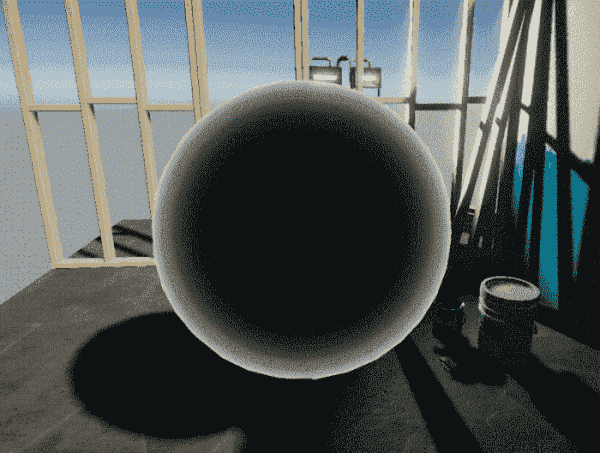*Fresnel, also known as rim lighting, adds a glow at grazing angles.*
*菲涅耳，也称为边缘照明，在掠角处增加辉光。*

### ₁₄₄ Reflection

The `Reflection` node takes in an incident direction vector and a surface normal as the two inputs, and outputs a new vector which is the reflection of the incident vector using the normal vector as the mirror line.

该（反射）节点将入射方向矢量和曲面法线作为两个输入，并输出一个新向量，该向量是使用法向量作为镜像线的入射向量的反射。

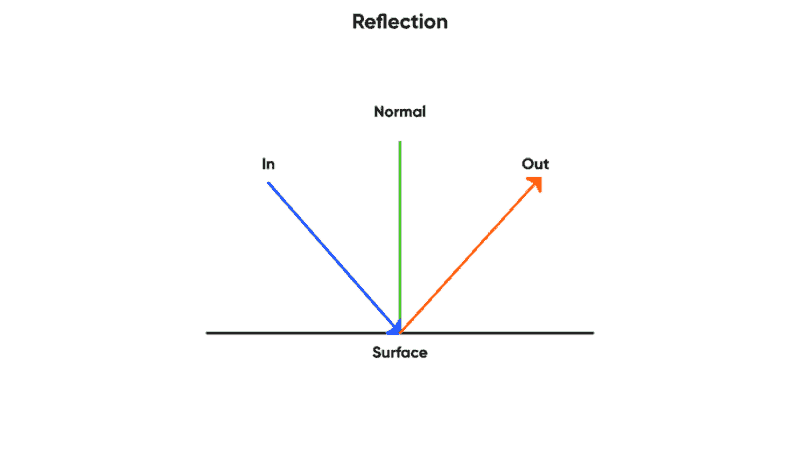*Let’s reflect on the choices that brought us here.*
*让我们反思一下将我们带到这里的选择。*

### ₁₄₅ Projection

The `Projection` node takes two vectors, **A** and **B**, and projects **A** onto **B** to create the output vector. What this means is that we end up with a vector parallel to **B**, but possibly longer or shorter, depending on the length of **A**.

投影节点采用两个向量 **A** 和 **B**，并将 **A** 投影到 **B** 上以创建输出向量。这意味着我们最终会得到一个平行于 **B** 的向量，但可能更长或更短，具体取决于 **A** 的长度。

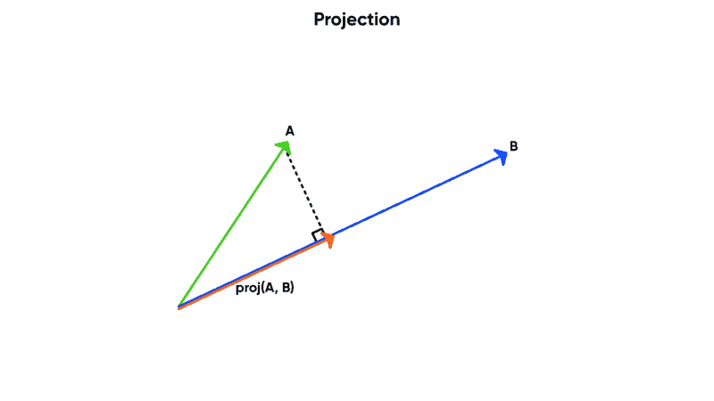*Make sure vector B is non-zero!*
*确保向量 B 不为零！*

### ₁₄₆ Rejection

The `Rejection` node also takes two vectors, **A** and **B**, and returns a new vector pointing from the point on **B** closest to the endpoint of **A**, to the endpoint of **A** itself. The rejection vector is perpendicular to **B**. In fact, the rejection vector is equal to **A** minus the projection of **A** onto **B**.

该（直译为排斥，数学上译为余部）节点还采用两个向量 **A** 和 **B**，并返回一个新向量，该向量从 **B** 上最接近 **A** 端点的点指向 **A** 本身的端点。余部向量垂直于 **B**。事实上，余部向量等于 **A** 减去 **A** 对 **B** 的投影。

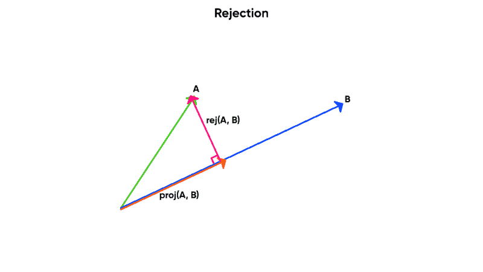*We can define rejection in terms of projection. Neat!*
*我们可以用投射来定义余部。整洁！*

### ₁₄₇ Rotate About Axis

The `Rotate About Axis` node takes a `Vector 3` **Input** and a second `Vector 3` representing the **Axis** to rotate around, as well as a **Rotation** angle as a float. We also have a control on the node that lets us choose between degrees and radians for the rotation input. The node outputs the original vector rotated around the rotation axis by that amount.

该（绕轴旋转）节点采用一个 **Input** 和一个表示轴旋转的第二个，以及一个 **Rotation** 角度作为浮点数。我们在节点上还有一个控件，让我们可以在旋转输入的度数和弧度之间进行选择。节点输出绕旋转轴旋转的原始向量。

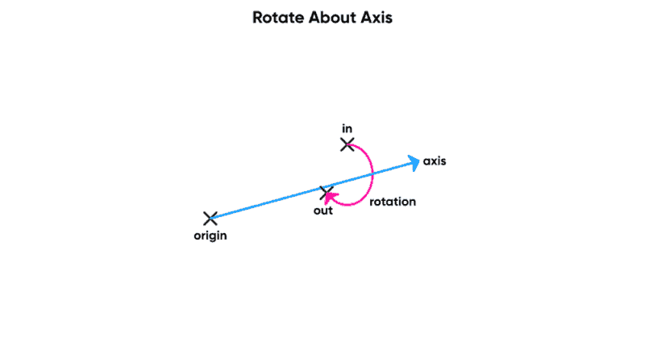*Not to be confused with the Rotation node.*
*不要与 Rotation 节点混淆。*

### ₁₄₈ Sphere Mask

The `Sphere Mask` takes a **Coordinate**, a position in any arbitrary space, and a sphere represented by a **Centre** point and a **Radius**. If the original position is within the sphere, the output is 1. Else, it is zero. Although, there’s also a **Hardness** parameter, which is designed to be between 0 and 1, which you can use to smoothen the falloff between 0 and 1 outputs. The higher the hardness parameter, the sharper the transition. If you want it to be a hard border, set it to 1.

球形遮罩采用**坐标**、任意空间中的位置以及由**中心**点和**半径**表示的球体。如果原始位置在球体内，则输出为 1。否则，它为零。虽然，还有一个**硬度**参数，它被设计为介于 0 和 1 之间，您可以使用它来平滑 0 和 1 输出之间的衰减。硬度参数越高，过渡越清晰。如果希望它成为硬边框，请将其设置为 1。

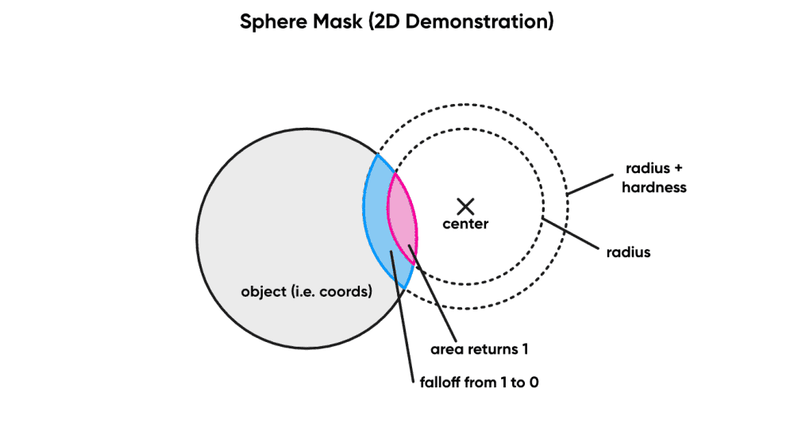*Expand this to three dimensions, and you’ve got a sphere mask.*
*将其扩展到三维，你就得到了一个球体蒙版。*

## Math/Derivative Nodes

These Derivative nodes evaluate a set of nodes on adjacent pixels and provide a measure of how different the results are between pixels.

这些导数节点计算相邻像素上的一组节点，并提供像素之间结果差异的度量。

### ₁₄₉ DDX

The `DDX` node can be used to take a derivative in the x-direction. This works by calculating the input to the node for this pixel and the adjacent horizontal pixel and taking the difference between them. The output is that difference. You can do this without sacrificing efficiency because during the rasterization process, fragments get processed in 2x2 tiles, so it’s very easy for a shader to calculate values on adjacent pixels in this group of tiles.

该节点可用于在 x 方向上取导数。其工作原理是计算此像素和相邻水平像素的节点输入，并取它们之间的差值。输出就是这种差异。您可以在不牺牲效率的情况下执行此操作，因为在栅格化过程中，片段会在 2x2 图块中进行处理，因此着色器很容易计算这组图块中相邻像素的值。

### ₁₅₀ DDY

The `DDY` node does a similar derivative, except vertically. It takes this pixel and the adjacent pixel vertically and returns the difference between their inputs to this node.

该节点执行类似的导数，但垂直导数除外。它垂直获取此像素和相邻像素，并返回它们输入到此节点之间的差值

### ₁₅₁ DDXY

And finally, `DDXY` takes the derivative diagonally by returning the sum of the two derivatives horizontally and vertically. In effect, it’s like adding `DDX` and `DDY` on the same input and taking the absolute value. All three derivative nodes are only available in the fragment shader stage. You might use them for something like edge detection by reading the values from `Scene Color` or `Scene Depth` and detecting where there’s a massive difference between adjacent pixels.

最后，DDXY通过水平和垂直返回两个导数的总和来对角线取导数。实际上，这就像在同一个输入上相加并取绝对值。所有三个派生节点仅在片段着色器阶段可用。您可以将它们用于边缘检测等操作，方法是读取 OR 中的值并检测相邻像素之间存在巨大差异的位置。

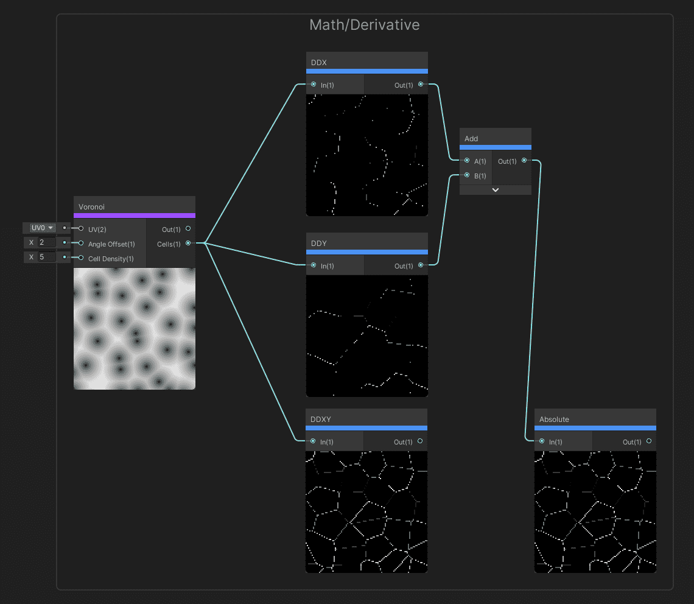*You get these derivatives with an unexpectedly low overhead.*

## Math/Matrix Nodes

Use the Matrix node family to create matrices or carry out basic matrix operations.
使用 Matrix 节点系列创建矩阵或执行基本矩阵运算。

### ₁₅₂ Matrix Construction

The `Matrix Construction` node can be used to create new matrices using vectors. The node has four inputs, each of which is a `Vector 4`, corresponding to the maximum matrix size of 4x4. The node has a setting to determine whether the inputs are row or column vectors, and three inputs of varying size – so you can use this node to construct a 2x2, 3x3 or 4x4 matrix.

该（矩阵构造）节点可用于使用向量创建新矩阵。该节点有四个输入，每个输入都是Vector4 ，对应于 4x4 的最大矩阵大小。该节点有一个设置，用于确定输入是行向量还是列向量，以及三个不同大小的输入，因此您可以使用此节点构造 2x2、3x3 或 4x4 矩阵。

### ₁₅₃ Matrix Split

The `Matrix Split` node, on the other hand, takes in a matrix and lets us split the matrix into several vectors. The input matrix can be between 2x2 and 4x4, and the output `Vector 4`s will be partially filled with zeroes if the matrix is smaller than 4x4. As with the `Matrix Construction` node, we can choose whether the output vectors are row or column vectors.

矩阵拆分节点，另一方面，让我们将矩阵拆分为几个向量。输入矩阵可以介于 2x2 和 4x4 之间，如果矩阵小于 4x4，则输出 Vector4s 将部分填充零。与Matrix Construction节点一样，我们可以选择输出向量是行向量还是列向量。

### ₁₅₄ Matrix Determinant

The determinant of a matrix is a common operation in maths, and the `Matrix Determinant` node calculates it for you. The input is a matrix of any size between 2x2 and 4x4, and the output is its determinant. This can be a bit costly for large matrices, so use it sparingly.

矩阵的行列式是数学中的常见运算，节点为您计算。输入是介于 2x2 和 4x4 之间的任意大小的矩阵，输出是其行列式。对于大型矩阵来说，这可能有点昂贵，因此请谨慎使用。

### ₁₅₅ Matrix Transpose

The `Matrix Transpose` node reflects the elements of the matrix in its leading diagonal, such that the rows become columns and vice versa. The input and output are both matrices of the same size.

矩阵转置节点在其前导对角线中反映矩阵的元素，使行成为列，反之亦然。输入和输出都是相同大小的矩阵。

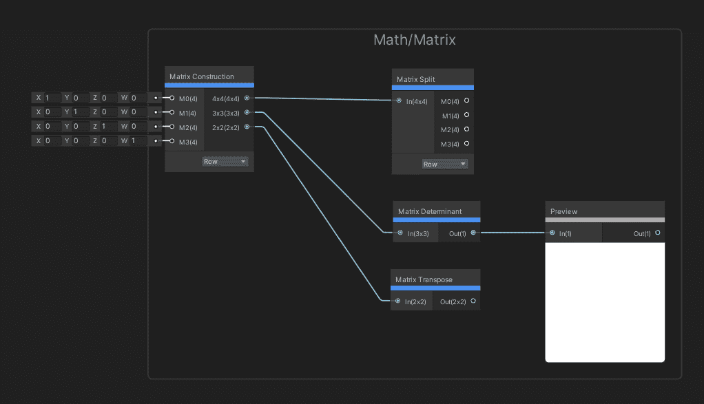*Matrices are just arrays of numbers - and they’re great in combination with vectors.*
*矩阵只是数字数组 - 它们与向量结合使用非常有用。*

## Math/Advanced Nodes

This group might be called Advanced, but many of these nodes are basic maths operations.
这个组可能被称为高级，但其中许多节点都是基本的数学运算。

### ₁₅₆ Absolute

The `Absolute` node returns the absolute value of the input – in other words, if the input value is negative, the sign becomes positive. The input can be a vector, and if so, the operation is performed to each element. That applies to a lot of these nodes, so sometimes I’ll just mention a float input even if it can take a vector.

Absolute节点返回输入的绝对值——换句话说，如果输入值为负数，则符号变为正数。输入可以是向量，如果是这样，则对每个元素执行操作。这适用于很多这样的节点，所以有时我只会提到一个浮点输入，即使它可以接受一个向量。

### ₁₅₇ Length

The `Length` node takes a vector as input and returns its length, which is calculated using Pythagoras’ Theorem.

节点将向量作为输入并返回其长度，该长度使用毕达哥拉斯定理计算。

### ₁₅₈ Modulo

`Modulo` arithmetic works by counting up until you reach some value, at which point you start counting from zero again. In other words, the `Modulo` node gives the remainder after dividing input **A** by input **B**.

`Modulo`算术的工作原理是向上计数，直到达到某个值，此时您再次从零开始计数。换句话说，节点在将输入 **A** 除以输入 **B** 后给出余数。

### ₁₅₉ Negate

The `Negate` node flips the sign of the input float.

Negate节点翻转输入浮点数的符号。

### ₁₆₀ Normalize

The `Normalize` node takes in a vector and returns a new vector pointing in the same direction, but with length 1.

归一化节点接受一个向量并返回一个指向同一方向但长度为 1 的新向量。

### ₁₆₁ Posterize

The `Posterize` node takes in an input value and a step value. This node will clamp the range of the input between 0 and 1 and quantise its value so that it can only take a number of values equal to the number of steps supplied, plus one. For example, if the number of steps is 4, then the output is rounded down to the values 0, 0.25, 0.5, 0.75 or 1.

海报化节点接受输入值和步长值。该节点将把输入的范围限制在 0 和 1 之间，并量化其值，以便它只能采用等于提供的步数加 1 的值。例如，如果步数为 4，则输出将向下舍入为值 0、0.25、0.5、0.75 或 1。

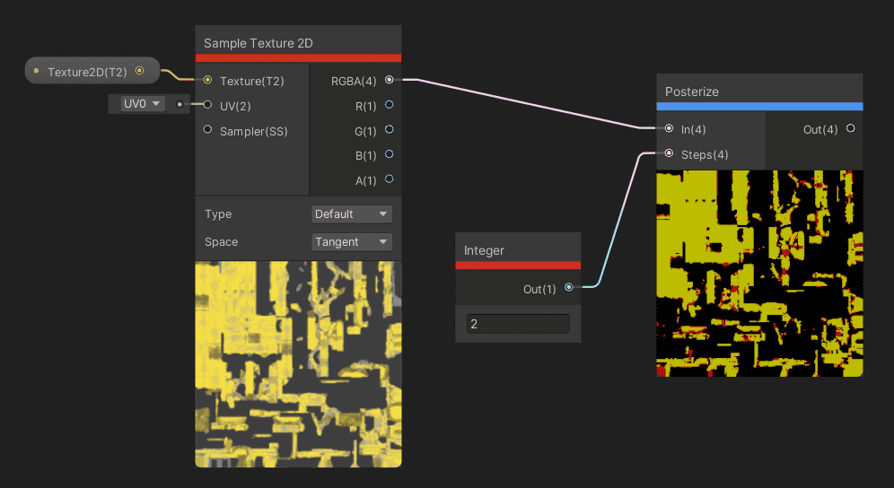*Posterize doesn’t mean turning it into a poster, but that would’ve been cool too.*
*海报化并不意味着把它变成海报，但那也会很酷。*

### ₁₆₂ Reciprocal

The `Reciprocal` node divides one by the input float. We have an option to pick the algorithm used for the calculation – either **Default**, or **Fast**, which is less accurate, but good if you’re using `Reciprocal` a lot.

倒数节点将 1 除以输入浮点数。我们可以选择用于计算的算法 - **默认**或**快速**，这不太准确，但如果您使用很多，则很好。

### ₁₆₃ Reciprocal Square Root

The `Reciprocal Square Root` node is similar to `Reciprocal`, except it calculates 1 divided by the square root of the input. Unlike `Reciprocal`, there’s no extra option to choose different methods. If you’re interested in a bit of history, the **Fast Inverse Square Root** method is a famous piece of code, pioneered by John Carmack but discovered earlier, for calculating the reciprocal square root of a number. It’s no longer necessary because this functionality is provided at the instruction set level, but it’s an interesting footnote.

倒数平方根节点 类似于Reciprocal倒数节点 ，只不过它计算 1 除以输入的平方根。与 不同，没有额外的选项来选择不同的方法。如果你对一些历史感兴趣，**快速反平方根**方法是一段著名的代码，由约翰·卡马克（John Carmack）开创，但更早被发现，用于计算一个数字的倒数平方根。它不再是必需的，因为此功能是在指令集级别提供的，但这是一个有趣的脚注。

### ₁₆₄ Exponential

The `Exponential` node raises a particular number to the power of the float input. We can pick what the base number is by using the **Base** dropdown, which lets us choose between **2** and **e**. **e** is Euler’s number, which is approximately 2.72.

指数节点将特定数字提高到浮点输入的幂。我们可以使用 **Base** 下拉列表来选择基数，这让我们可以在 **2** 和 **e** 之间进行选择。**e** 是欧拉数，约为 2.72。

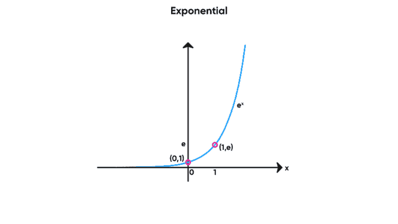*Exponential nodes are quickly growing in popularity.*
*指数节点正在迅速飙涨。*

### ₁₆₅ Log

The `Log` node does the opposite process as the `Exponential` node. If 2 to the power of 4 equals 16, then the log base 2 of 16 equals 4. We take in a float and return its log under a particular base. We can choose the base using the **Base** drop-down, except now we have the choice of **2**, **e** or **10**.

对数节点执行与节点相反的过程。如果 2 的 4 次方等于 16，则 16 的对数基数 2 等于 4。我们接收一个浮点数，并在特定基数下返回其日志。我们可以使用 **Base** 下拉列表选择基数，但现在我们可以选择 **2**、**e** 或 **10**。

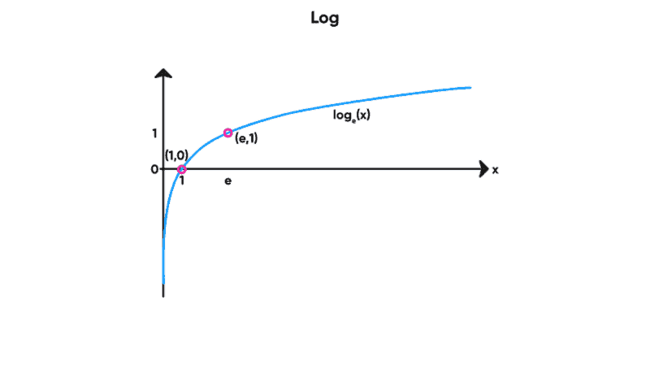*Logarithms do the opposite of exponents. Compare the two highlighted points with those on Exponential!*
*对数与指数相反。将两个突出显示的点与指数上的点进行比较！*

# Artistic Nodes

Artistic nodes usually operate on colors, or individual color channels, or textures.
艺术节点通常对颜色、单个颜色通道或纹理进行操作。

## Artistic/Blend Nodes

### ₁₆₆ Blend

The `Blend` node is normally used to blend one color into another. In this case, we pass a base color and a blend color into the node and we blend the **Blend** input onto the Base in put according to a third input, which is a float called **Opacity**. When **Opacity** is 0, the base is unaltered, and when **Opacity** is 1, the blending is at its strongest. There is also a **Mode** dropdown which lets us choose the method used for blending – there are a lot of options so I won’t go over every one. The only output is the color after the blending has been completed.

该（混合）节点通常用于将一种颜色混合到另一种颜色中。在本例中，我们将基色和混合色传递到节点中，然后根据第三个输入将 **Blend** 输入混合到 Base in put 上，这是一个称为 **Opacity** 的浮点数。当 **Opacity** 为 0 时，基数保持不变，当 **Opacity** 为 1 时，混合最强。还有一个**模式**下拉列表，让我们可以选择用于混合的方法——有很多选项，所以我不会一一列举。唯一的输出是混合完成后的颜色

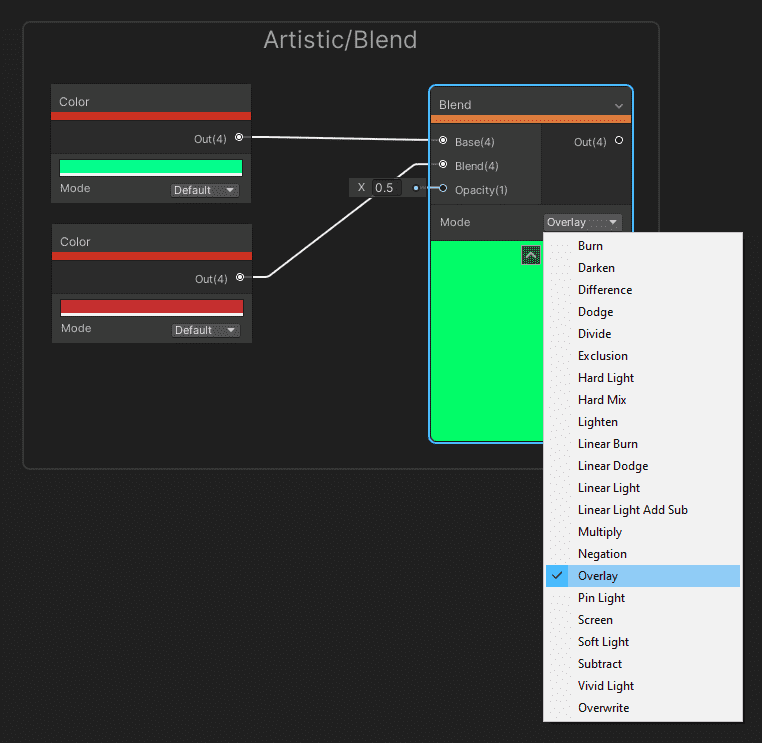*There are plenty of blending options, similar to those found in graphics programs.*
*有很多混合选项，类似于图形程序中的选项。*

## Artistic/Filter Nodes

### ₁₆₇ Dither

`Dither` is another of my favourite nodes. We use it in screen-space to apply intentional noise in some way – internally, the node defines a neat pattern of noise values which are used as thresholds. The input is a vector of values, and for each element, if its value is below the threshold defined by the dithering pattern, then the output is 0. Otherwise, it’s 1. We also require the `Screen Position` as input, and we can multiply this to scale the dithering effect.

`Dither`是我最喜欢的另一个节点。我们在屏幕空间中使用它以某种方式应用有意的噪声——在内部，节点定义了一个整洁的噪声值模式，用作阈值。输入是值的向量，对于每个元素，如果其值低于抖动模式定义的阈值，则输出为 0。否则，它是 1。我们还需要 as 输入，我们可以将其相乘以缩放抖动效果。

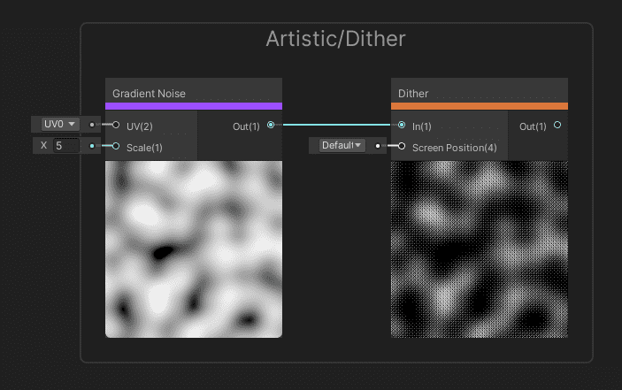*Dither is one of my favourite nodes - it’s great for fake transparency effects.*
*抖动是我最喜欢的节点之一 - 它非常适合假透明效果。*

## Artistic/Mask Nodes

### ₁₆₈ Color Mask

The `Color Mask` node takes in an **Input** color, a **Mask Color**, and a **Range** float. If the input color is equal to the mask color, or within the range specified, then the output of the node is 1. Else, it is zero. However, there’s also a **Fuzziness** input. If we raise this above zero, then there will be a soft transition between 1 and 0 for values on the edge of the range. The output is a single float representing the mask value.

该节点（颜色掩模）采用**输入**颜色、**掩码颜色**和**范围**浮点数。如果输入颜色等于蒙版颜色，或在指定的范围内，则节点的输出为 1。否则，它为零。但是，还有一个**模糊性**输入。如果我们将其提高到零以上，则范围边缘的值将在 1 和 0 之间出现软过渡。输出是表示掩码值的单个浮点数。

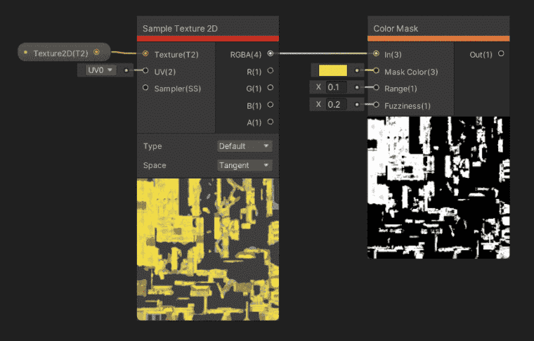*I’ve picked all the yellow parts of this texture.*
*我已经挑选了这个纹理的所有黄色部分。*

### ₁₆₉ Channel Mask

The `Channel Mask` node takes in a color as input. The **Channel**s option on the node lets us pick any combination of channels. For each one that is selected, this node keeps colors in that channel, but discards color channels that are not picked by setting their values to zero. The output is the masked color.

通道掩模节点接受颜色作为输入。节点上的**通道**选项允许我们选择通道的任意组合。对于选择的每个颜色通道，此节点将颜色保留在该通道中，但通过将其值设置为零来丢弃未选择的颜色通道。输出是蒙版颜色。

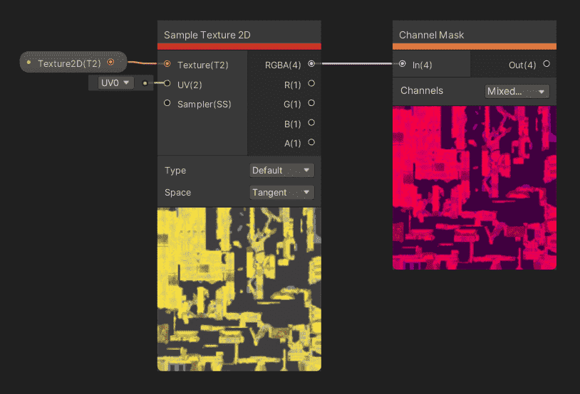*If you decide you hate the green channel, now you can delete it.*
*如果您决定讨厌绿色频道，现在可以将其删除。*

## Artistic/Adjustment Nodes

The following Adjustment nodes are used to tweak the properties of colors.
以下“调整”节点用于调整颜色的属性。

### ₁₇₀ Hue

The `Hue` node can be used to offset the hue of whatever color is passed as an input, using the amount specified by the **Offset** input. This node comes with a toggle between different **Mode**s – for some reason, the documentation lists the options as **Degrees** and **Radians**, but on the node the options seem to be **Degrees** and **Normalized**. When **Degrees** is picked, you cycle through the entire range of hues between 0 and 360. And when **Normalized** is picked, the hue range is covered between an offset of 0 and 1.

该（色相）节点可用于使用 **Offset** 输入指定的量来偏移作为输入传递的任何颜色的色调。该节点带有不同**模式**之间的切换 - 出于某种原因，文档将选项列为**度**数和**弧度**，但在节点上，选项似乎是**度**数和**归一化**。选择**度**数时，可在 0 到 360 之间的整个色调范围内循环。当选择**归一化**时，色调范围覆盖在 0 和 1 之间的偏移量之间。

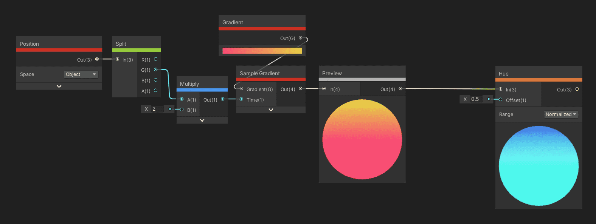*Most people would call cycling through hues ‘changing color’.*
*大多数人会把循环穿色称为“变色”。*

### ₁₇₁ Saturation

The `Saturation` node adjusts the amount of saturation in the input color by whatever amount is passed into the **Saturation** float input. When the saturation value is 1, the original color’s saturation is left alone, and when it is zero, the output color will have no saturation at all.

该（饱和度）节点通过传递到 **Saturation** 浮点数输入的任何量来调整输入颜色中的饱和度量。当饱和度值为 1 时，原始颜色的饱和度保持不变，当它为零时，输出颜色将完全没有饱和度。

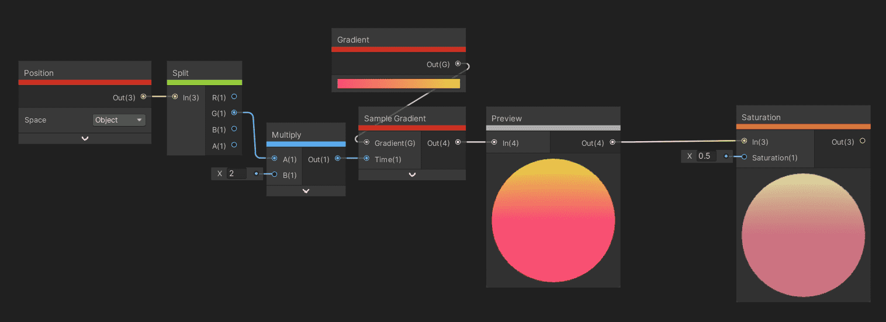*Colors get closer to greyscale as saturation decreases to 0.*
*当饱和度降至 0 时，颜色会更接近灰度。*

### ₁₇₂ Contrast

The `Contrast` node does a similar thing, except it adjusts the amount of contrast of the input color by whatever amount is used for the **Contrast** input float.

对比度节点执行类似操作，只不过它通过用于**对比度**输入浮点数的任何量来调整输入颜色的对比度。

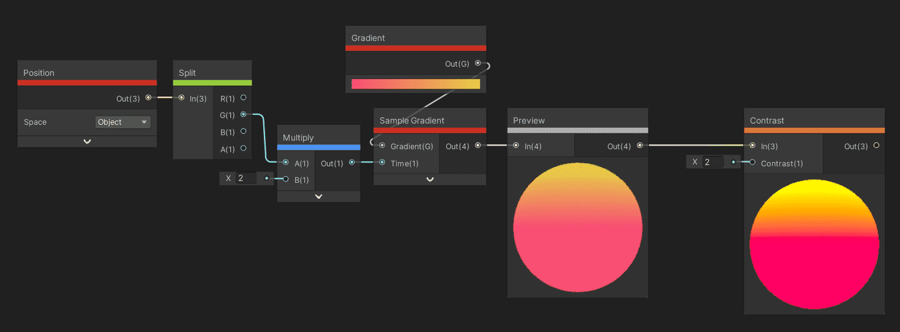*Increasing contrast creates very vibrant images.*
*增加对比度可创建非常生动的图像。*

### ₁₇₃ White Balance

The `White Balance` node is used for modifying the **Tint** and **Temperature** of an input color. **Temperature** is a bit hard to pin down, but generally speaking, cold colors are more blue and warm colors are more red, so reducing the temperature below 0 makes the color more blue and raising it above 0 makes things redder. **Tint**, on the other hand, tends to offset a color towards pink or green when it’s increased.

该（白平衡）节点用于修改输入颜色的**色调**和**温度**。**温度**有点难以确定，但一般来说，冷色更蓝，暖色更红，所以将温度降低到 0 以下会使颜色更蓝，将其提高到 0 以上会使颜色更红。另一方面，当**色调**增加时，色调往往会偏移为粉红色或绿色。

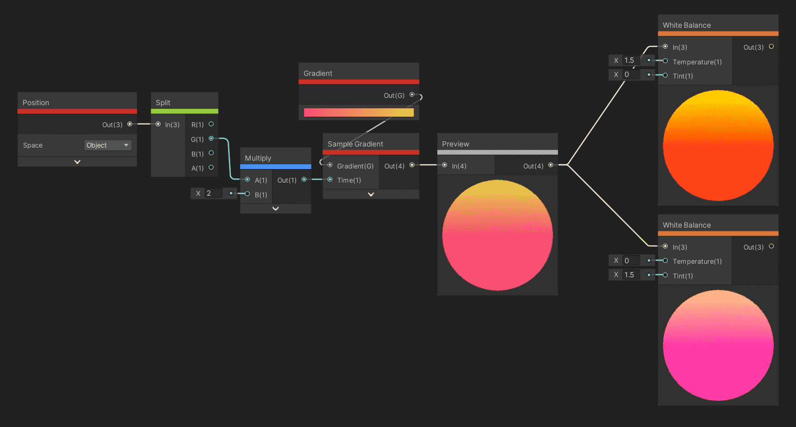*White Balance does strange things to colors.*
*白平衡对颜色有奇怪的影响。*

### ₁₇₄ Replace Color

The `Replace Color` node takes a color input, and we can define a color to replace, called **From**, and a color to replace it with, called **To**. Whenever the **From** color appears, it’s replaced with the **To** color. We also define a float called **Range**, which means that if any input color is within that range of **From**, it will also be replaced. And finally, increasing the **Fuzziness** input means there will be a smooth falloff between the original colors and the **To** color.

该替换颜色节点接受颜色输入，我们可以定义要替换的颜色（**称为 From**）和要替换它的颜色（**称为 To**）。每当**出现“从**”颜色时，它就会替换为**“到**”颜色。我们还定义了一个名为 **Range** 的浮点数，这意味着如果任何输入颜色在 **From** 的范围内，它也将被替换。最后，增加**模糊性**输入意味着原始颜色和 **To** 颜色之间将出现平滑衰减。

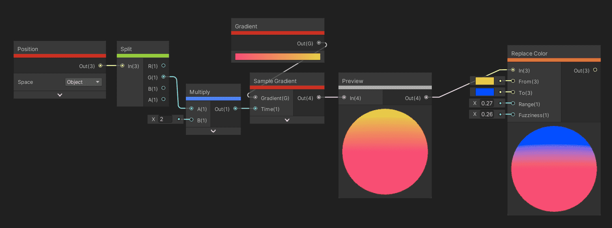*We can swap out a range of colors easily like this.*
*我们可以像这样轻松更换一系列颜色。*

### ₁₇₅ Invert Colors

The `Invert Colors` node takes an input color, and for each channel, returns one minus the channel. This node assumes the input colors are between 0 and 1 for each color channel, so this might act strange for HDR colors with high intensity.

反转颜色节点采用输入颜色，对于每个通道，返回 1 减去通道。此节点假定每个颜色通道的输入颜色介于 0 和 1 之间，因此对于高强度的 HDR 颜色来说，这可能会显得很奇怪。

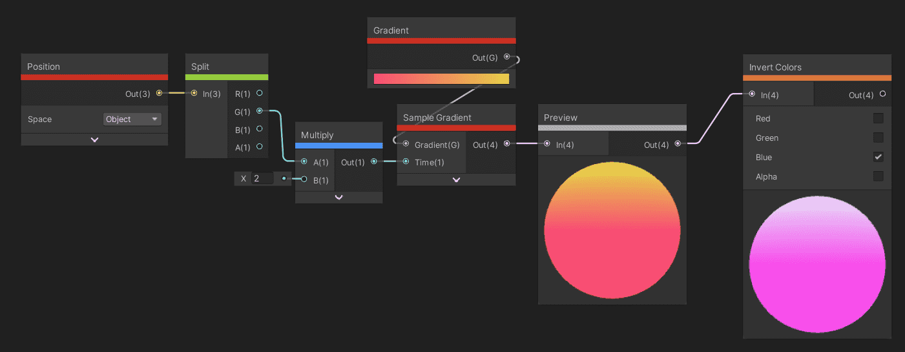*Invert any combination of color channels easily.*
*轻松反转颜色通道的任意组合。*

### ₁₇₆ Channel Mixer

The `Channel Mixer` node takes in a color input, and for each of the red, green and blue color channels, we can remap the amount they contribute to the output color’s red, green and blue channels. We do this by clicking one of the three buttons labelled **R**, **G** and **B**. When one is selected, modifying the sliders, which can run between -2 and 2, changes how much that input channel contributes to the three output channels. For example, if we select **R**, then make the sliders 0, 0 and 2, that means the input red contributes 200% to the output blue.

该（通道混合）节点接受颜色输入，对于每个红色、绿色和蓝色通道，我们可以重新映射它们对输出颜色的红色、绿色和蓝色通道的贡献量。我们通过单击标有 **R**、**G** 和 **B** 的三个按钮之一来执行此操作。选择其中一个时，修改滑块（可以在 -2 和 2 之间运行）会更改输入通道对三个输出通道的贡献程度。例如，如果我们选择 **R**，则使滑块为 0、0 和 2，这意味着输入红色对输出蓝色的贡献率为 200%。

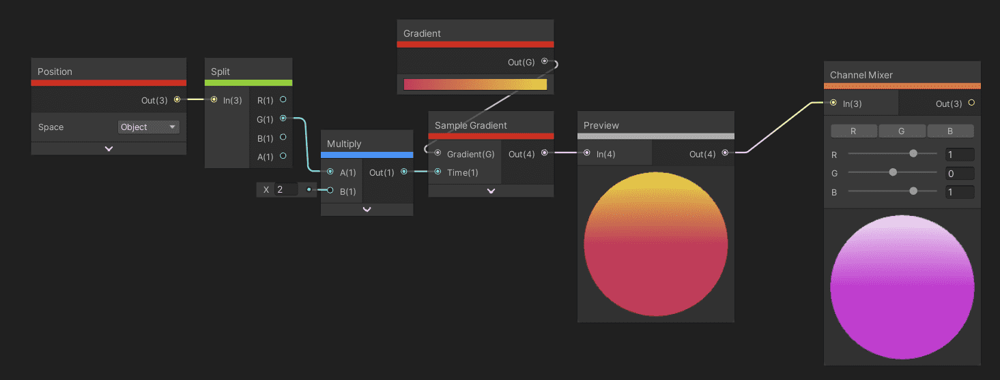*In this image, both red and green contribute to output blue, weighted equally.*
*在此图像中，红色和绿色都有助于输出蓝色，权重相等。*

## Artistic/Normal Nodes

The Normal node family is irreplaceable when working with normal mapping, whether you’re reading from a texture or creating the normals within Shader Graph.

在使用法线贴图时，法线节点系列是不可替代的，无论您是从纹理中读取还是在 Shader Graph 中创建法线。

### ₁₇₇ Normal Unpack

The `Normal Unpack` node takes a color or vector as input and unpacks it into a normal vector. That said, for textures, you can usually sample it as a normal map anyway, so this node is more useful if you’ve generated a normal texture within the graph somehow and you need to convert from colors to normal vectors. You can choose the **Space** of the input between **Tangent** or **Object** space using the dropdown. The output normal vector is a `Vector 3`.

Normal Unpack节点将颜色或向量作为输入，并将其解压缩为法线向量。也就是说，对于纹理，您通常可以将其作为法线贴图进行采样，因此，如果您以某种方式在图形中生成了法线纹理，并且需要从颜色转换为法线向量，则此节点更有用。您可以使用下拉列表在**“切线**”或**“对象**”空间之间选择输入**的空间**。输出法向量是Vector3 。

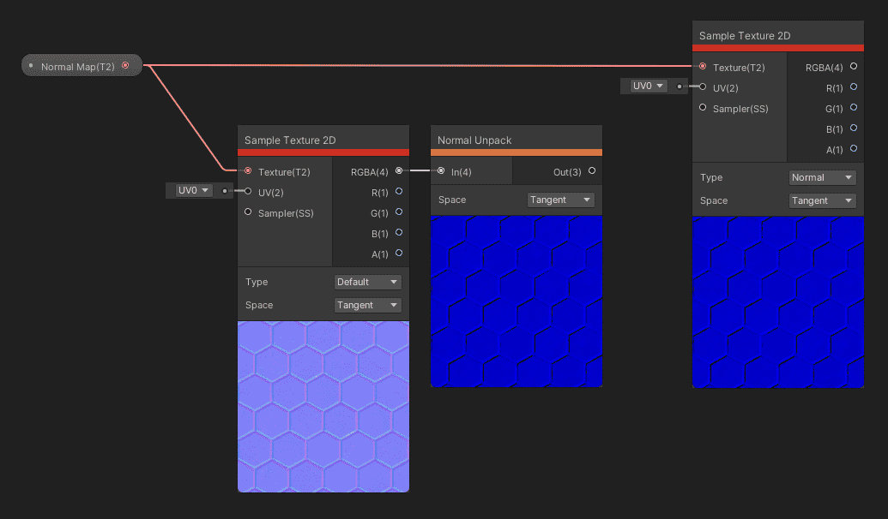*You can use Normal Unpack, but Sample Texture 2D can do the same thing.*
*您可以使用“法线解包”，但“示例纹理 2D”也可以执行相同的操作。*

### ₁₇₈ Normal Strength

The `Normal Strength` node takes a set of normals as input as a `Vector 3` and scales their strength via the **Strength** float input. A strength of 1 leaves the normals unaltered, while 0 will return a completely flat normal map with all the normals pointing upwards.

法线强度节点将一组法线作为Vector3输入，并通过**强度**浮点数输入缩放其强度。强度为 1 时法线保持不变，而 0 将返回完全平坦的法线贴图，所有法线都指向上方。

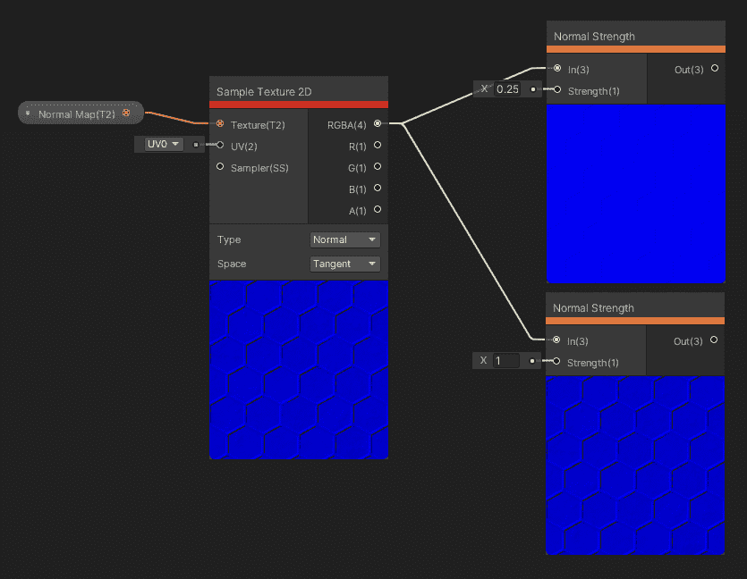*If your normals are a bit too strong, we can tone them down a little.*
*如果你的法线有点太强了，我们可以把它们调低一点。*

### ₁₇₉ Normal From Texture

The `Normal From Texture` node takes a **Texture**, a **Sampler** and a set of **UV**s as input and uses that as a heightmap, from which it will generate normals. The **Offset** float input defines how far away the normal details extend from the surface, and the **Strength** float input multiplies the size of the result. The output is a `Vector 3` representing the calculated normal vector.

该节点将一个 **Texture**、一个 **Sampler** 和一组 **UV**s 作为输入，并将其用作高度图，从中生成法线。**“偏移”**浮点数输入定义法线细节与曲面的距离，**而“强度**”浮点数输入则使结果的大小相乘。输出是Vector3表示计算出的法向量。

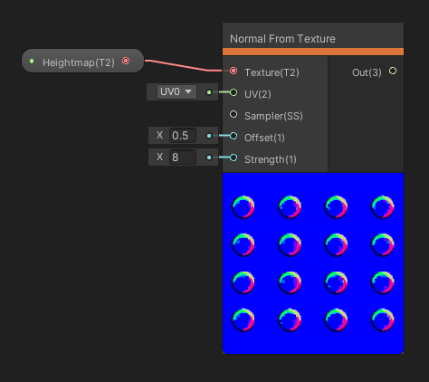*This provides an easy way to convert heightmaps to normals.*
*这提供了一种将高度贴图转换为法线的简单方法。*

### ₁₈₀ Normal From Height

The `Normal From Height` node is similar, except it takes in a singular height value and generates a normal vector based on the that and the input **Strength** float. We can change the **Space** used for the output normals between **Tangent** and **World**. **Tangent** is useful for working with textures, whereas **World** is great for working with lighting.

“Normal From Height”节点类似，只是它采用奇异的高度值，并基于该值和输入**Strength强度**浮点生成法向向量。我们可以在 **Tangent** 和 **World** 之间更改用于输出法线**的空间**。**Tangent** 对于处理纹理很有用，而 **World** 非常适合处理光照。

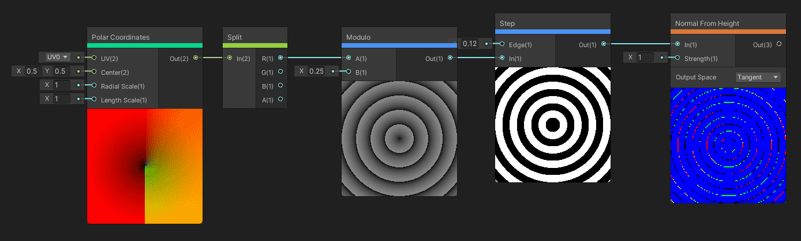*We can generate height data in the shader and convert it to normals like this.*
*我们可以在着色器中生成高度数据并将其转换为法线，如下所示。*

### ₁₈₁ Normal Blend

The `Normal Blend` node takes in two normals, adds them together, normalises them and returns the result. This is great for combining a base normal texture, **A**, and a detail normal texture, **B**, together. We have the choice of two modes here: **Default** does what I just described, and **Reoriented** will rotate the normal by the angle between the first and second map. By doing that, the detail normal texture isn’t just layered on top of the base normal texture – it acts as if the detail normal texture is mapped onto the surface described by the base normal.

法线混合节点接收两个法线，将它们相加，对它们进行归一化并返回结果。这非常适合将基本法线纹理 **A** 和细节法线纹理 **B** 组合在一起。我们在这里有两种模式可供选择：**默认**执行我刚才描述的操作，**而重新定向**将法线旋转第一个和第二个地图之间的角度。这样一来，细节法线纹理就不仅仅是在基础法线纹理之上分层，而是将细节法线纹理映射到基础法线所描述的表面上。

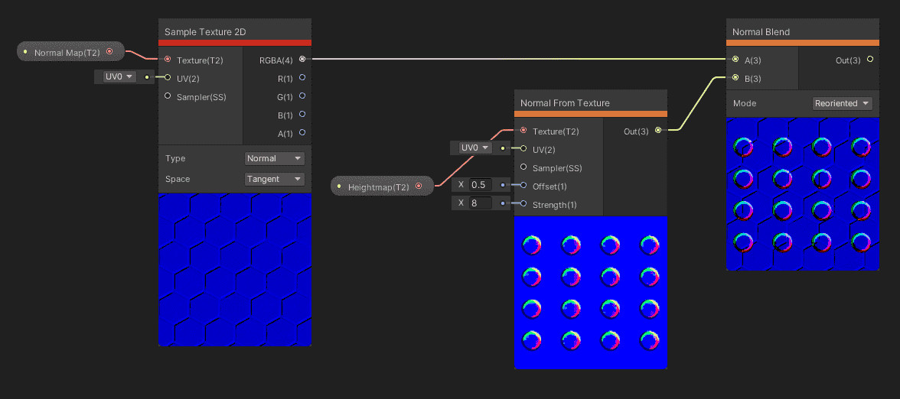*Will it blend? Well normally, yes.*
*它会混合吗？嗯，通常，是的。*

### ₁₈₂ Normal Reconstruct Z

The `Normal Reconstruct Z` node takes in a generated normal vector as a `Vector 2` and calculates what the Z component should be for the output `Vector 3`.

该（法线重构Z）节点将生成的法向量作为 一个Vector2 进行，并计算输出的 Z 分量应构成Vector3。

This lets you package your normal data into the red and green channels of the texture, so long as you know the normals always point in the positive direction, freeing up the blue and alpha channels for other uses to reduce the number of texture samples and texture memory your shader requires. For example, you could include a smoothness map in the blue channel, since it only requires greyscale data, but you’ll need to create these packed textures externally.

这样一来，只要您知道法线始终指向正方向，就可以将法线数据打包到纹理的红色和绿色通道中，从而释放蓝色和 Alpha 通道用于其他用途，从而减少着色器所需的纹理样本和纹理内存的数量。例如，您可以在蓝色通道中包含平滑度贴图，因为它只需要灰度数据，但您需要在外部创建这些填充纹理。

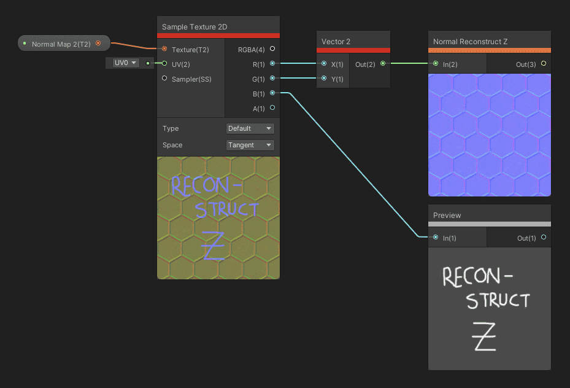*We can hide extra data by using only two channels for normal data.*
*对于普通数据，我们可以通过仅使用两个通道来隐藏额外的数据。*

## Artistic/Utility Nodes

艺术/实用程序节点

### ₁₈₃ Colorspace Conversion

The `Colorspace Conversion` node can be used to convert an input color between the **RGB**, **HSV** and **Linear** color spaces. We have two dropdown options to pick the **Input** and **Output** color spaces.

该色彩空间转换节点可用于在 **RGB**、**HSV** 和**线性**色彩空间之间转换输入颜色。我们有两个下拉选项来选择**输入**和**输出**色彩空间。

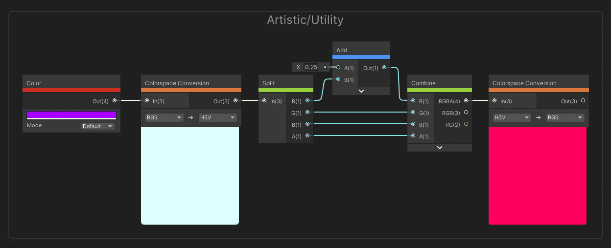*This makes it easy to work in other color spaces, such as HSV.*
*这使得在其他颜色空间（如 HSV)中工作变得容易。*

# Procedural Nodes

过程节点

### ₁₈₄ Checkerboard

The `Checkerboard` node creates an alternating pattern of tiles, colored according to the **Color A** and **Color B** inputs. The **UV** is used for mapping the pattern onto objects and the **Frequency** `Vector 2` is used for scaling the checkboard in those respective axes. The output is the checkerboard color as a `Vector 3`, although as of this article, the documentation accidentally lists the output as a **UV** `Vector 2`.

该（棋盘格）节点创建图块的交替图案，根据**颜色 A** 和**颜色 B** 输入进行着色。**UV** 用于将图案映射到对象上，**频率**用于缩放这些轴上的检查板。输出是棋盘格颜色，尽管在本文中，文档意外地将输出列为 **UV** 。

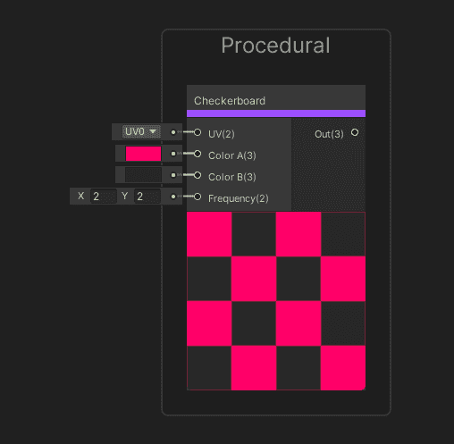*Checkerboard patterns are great for prototyping especially.*
*棋盘图案特别适合原型设计。*

## Procedural/Noise Nodes

Noise is one of the best tools to use within shaders if you want to create procedural content or if you want highly customisable properties on your materials.

如果您想创建程序内容，或者想要在材质上具有高度可定制的属性，则噪点是在着色器中使用的最佳工具之一。

### ₁₈₅ Simple Noise

The `Simple Noise` node generates a basic type of noise pattern called “value noise”, using a **UV** input to map the noise onto your mesh and a **Scale** input float to rescale the noise texture in both directions. The output is a single float representing a noise value between 0 and 1.

该节点生成一种称为“值噪声”的基本类型的噪声模式，使用 **UV** 输入将噪声映射到网格上，并使用 **Scale** 输入浮点数在两个方向上重新缩放噪声纹理。输出是一个单浮点数，表示介于 0 和 1 之间的噪声值。

### ₁₈₆ Gradient Noise

The `Gradient Noise` node generates a slightly more sophisticated type of noise called **Perlin Noise** using the same **UV** and **Scale** inputs as `Simple Noise`, and a single float output once again. Perlin Noise is a very common type of noise used in random generation, particularly for textures and terrains.

该梯度噪声节点使用与 相同的 **UV** 和 **Scale** 输入生成一种稍微复杂一点的噪声类型，称为 **Perlin 噪声**，并再次使用单个浮点输出。Perlin 噪声是随机生成中非常常见的噪声类型，尤其是纹理和地形。

### ₁₈₇ Voronoi

The `Voronoi` node is a very pretty and versatile type of noise. It works by generating points on a grid, repositioning them in random directions, then coloring each pixel in the grid based on distance from a point – the closer to a point we are, the darker the pixel is. We supply a **UV** for mapping the texture, plus an **Angle Offset** float for randomly moving the points and a **Cell Density** float to decide the number of points that are added. The **Out** output just gives the distance from the closest point as a float, which is usually used as the Voronoi pattern. The **Cells** output gives us what Unity calls the “raw cell data”, although reading the autogenerated code in the documentation, it seems to be colored based on the random x offset for each cell.

沃罗诺伊节点是一种非常漂亮且用途广泛的噪声类型。它的工作原理是在网格上生成点，将它们沿随机方向重新定位，然后根据与点的距离为网格中的每个像素着色——我们离点越近，像素越暗。我们提供了一个用于映射纹理的 **UV**，以及一个用于随机移动点的角度**偏移**浮点和一个单元**密度**浮点，以决定添加的点数。**Out** 输出仅以浮点数形式给出与最近点的距离，通常用作 Voronoi 模式。**Cells** 输出为我们提供了 Unity 所谓的“原始单元格数据”，尽管在文档中读取自动生成的代码，但它似乎是根据每个单元格的随机 x 偏移量着色的。

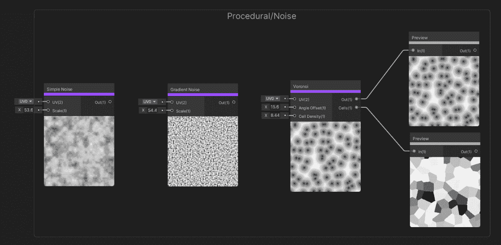*Noise is your best friend when dealing with procedural materials.*
*在处理程序材料时，噪音是您最好的朋友。*

## Procedural/Shapes Nodes

过程/状态

The Shapes node family are all Signed Distance Fields, or SDFs, representing different shapes as either white inside the shape, or black outside it.

“形状”节点系列都是“有符号距离字段”（SDF），它们将不同的形状表示为形状内部的白色或形状外部的黑色。

### ₁₈₈ Rectangle

The `Rectangle` node takes an input **UV** and a **Width** and **Height** float, then generates a rectangle with that width and height. The width and height should be between 0 and 1, and if you use the same value for both, you should get a square texture. The output of the node is 1 if the pixel is within the rectangle, and 0 otherwise. These shapes can only be generated in the fragment stage.

矩形节点采用输入 **UV** 和 **Width** 和 **Height** 浮点数，然后生成具有该宽度和高度的矩形。宽度和高度应介于 0 和 1 之间，如果对两者使用相同的值，则应获得正方形纹理。如果像素在矩形内，则节点的输出为 1，否则为 0。这些形状只能在片段阶段生成。

### ₁₈₉ Rounded Rectangle

The `Rounded Rectangle` node is exactly the same as `Rectangle`, except it adds a **Radius** float option to specify how much the corners of the rectangle shape should be rounded.

该圆角矩阵节点与 Rectangle节点 完全相同，只是它添加了一个 **Radius** float 选项来指定矩形形状的角应圆角的程度。

### ₁₉₀ Ellipse

The `Ellipse` node similarly takes a **Width** and **Height** float and a **UV** `Vector 2` and will generate an ellipse. If you give it an equal width and height, you’ll end up with a circle.

该（椭圆）节点同样采用 **Width** 和 **Height** 浮点数以及 **UV**，并将生成一个椭圆。如果你给它一个相等的宽度和高度，你最终会得到一个圆。

### ₁₉₁ Polygon

The `Polygon` node uses those same **Width**, **Height** and **UV** inputs, and also adds a **Sides** input which defines how many edges the shape has. The result will be a regular polygon that’s been stretched if the width and height are different.

该多边形节点使用相同的 **Width**、**Height** 和 **UV** 输入，并添加一个 **Sides** 输入，用于定义形状的边数。如果宽度和高度不同，结果将是一个被拉伸的正多边形。

### ₁₉₂ Rounded Polygon

And finally, the `Rounded Polygon` node has the same inputs as `Polygon`, plus a **Roundness** float option which acts like the radius option on `Rounded Rectangle`.

最后，圆角多边形节点具有与 相同的输入，外加一个**圆度**浮点选项，其作用类似于 上的半径选项。

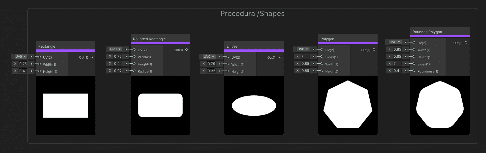*These SDF-based shape nodes give you a good starting point for procedural materials.*
*这些基于 SDF 的形状节点为程序化材质提供了良好的起点。*

# Utility Nodes

These Utility nodes are for miscellaneous things, but as it turns out, three of them are extremely powerful nodes which can transform the way your graph fundamentally works… plus the `Preview` and `Redirect` nodes.

这些实用程序节点用于其他事物，但事实证明，其中三个是非常强大的节点，可以从根本上改变图形的工作方式......加上“预览”和“重定向”节点。

### ₁₉₃ Preview

The `Preview` node takes in a vector input and outputs precisely the same thing. The reason for using this node is that it displays what your shader looks like at this point, so it’s extremely useful for visually debugging your shaders. In previous versions of Shader Graph which didn’t feature `Redirect` Nodes, which you can add by double-clicking an edge, `Preview` nodes used to have a secondary use for redirecting edges in particularly messy graphs.

预览节点接收向量输入并输出完全相同的内容。使用此节点的原因是，它显示着色器此时的样子，因此它对于直观地调试着色器非常有用。在以前版本的 Shader Graph 中，节点不具有节点（可以通过双击边缘来添加节点），节点过去用于在特别凌乱的图形中重定向边缘。

### ₁₉₄ Redirect

Double-click on any wire between node inputs/outputs and you’ll create a `Redirect` node between them. It has no effect on the shader output, but you can move the `Redirect` node around clean up your graph.

双击节点输入/输出之间的任何连接线，您将在它们之间创建一个重定向节点。它对着色器输出没有影响，但您可以移动节点来清理图形。

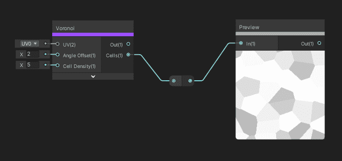*Preview doesn’t work on every input - mostly just colors and vectors.*
*预览并不适用于每个输入 - 大多数情况下只适用于颜色和矢量。*

### ₁₉₅ Keyword

These are listed in their own section in the Create Node menu, but I’ll talk about them here. Whenever you drag a `Keyword` node onto the graph, which are based on whatever `Keyword` properties you’ve added, it will have a number of inputs and a single output. Depending on the value of the keyword defined on this material in the Inspector, a keyword node will pick whatever was input to the corresponding keyword option. For example, if we use a `Boolean` keyword, we can connect a range of nodes to both the **On** and **Off** inputs and the output is chosen based on the value of the keyword.

它们在“创建节点”菜单的单独部分中列出，但我将在这里讨论它们。每当您将节点拖动到图形上时，该节点基于您添加的任何属性，它将具有多个输入和一个输出。根据在检查器中在此材料上定义的关键字的值，关键字节点将选择输入到相应关键字选项的任何内容。例如，如果我们使用一个关键字，我们可以将一系列节点连接到 **On** 和 **Off** 输入，并根据关键字的值选择输出。

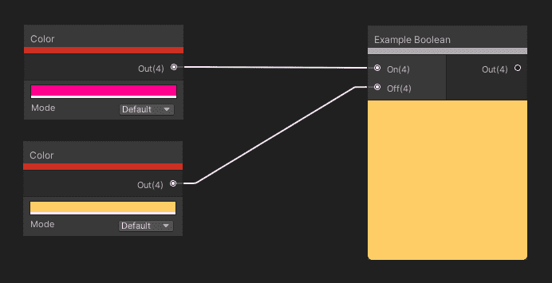*Based on the value of the keyword, the output of the node will change.*
*根据关键字的值，节点的输出将发生变化。*

### ₁₉₆ Sub Graph

These are also in a separate section like `Keyword` nodes. A `Sub Graph` is a separate kind of Shader Graph we can create. They have their own output nodes, which we can add outputs to, and when we add properties to a sub graph, they become the inputs to the resulting `Sub Graph` node. Then we can create nodes in the usual way on the graph. Once we’ve created a sub graph, we can search for them in our main graph and use them like any other node – the properties of the sub graph appear as the inputs on the left, and the outputs inside the sub graph appear as the outputs on the right of the node.

这些也像节点一样在单独的部分中。A 是我们可以创建的一种单独的着色器图。它们有自己的输出节点，我们可以向这些节点添加输出，当我们向子图添加属性时，它们将成为结果节点的输入。然后，我们可以在图形上以通常的方式创建节点。一旦我们创建了一个子图，我们就可以在主图中搜索它们，并像使用任何其他节点一样使用它们——子图的属性显示为左侧的输入，子图中的输出显示为节点右侧的输出。

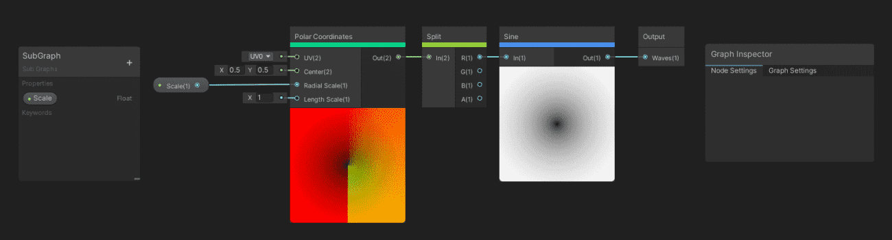*Sub Graphs lets us condense lots of nodes into a single node.*
*子图允许我们将许多节点压缩到一个节点中。*

### ₁₉₇ Custom Function

The `Custom Function` node lets us write custom shader code to run inside the node. I won’t go into detail here because this node is probably one of the most complicated and bespoke of them all, but if we click on the **Node Settings**, we can define a list of inputs and outputs of whatever types we like, and then we can attach a shader code file or write code directly into the settings window. That custom code is written in HLSL and we can write the name of the specific function from the file to use for this node.

该节点允许我们编写自定义着色器代码以在节点内运行。我不会在这里详细介绍，因为这个节点可能是其中最复杂和最定制的节点之一，但是如果我们单击**节点设置**，我们可以定义我们喜欢的任何类型的输入和输出列表，然后我们可以附加着色器代码文件或直接将代码写入设置窗口。该自定义代码是用 HLSL 编写的，我们可以从文件中写出特定函数的名称以用于此节点。

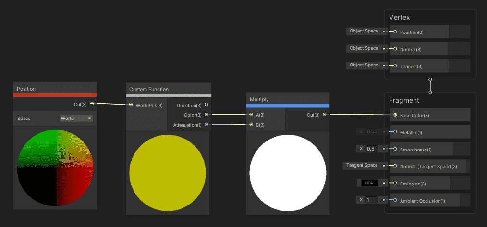*A common operation with custom function nodes is to get information from lights in the scene.*
*自定义函数节点的一个常见操作是从场景中的灯光获取信息。*

## Utility/Logic Nodes

As a palate cleanser, we can deal with some Boolean logic nodes.
实用程序/逻辑节点作为味觉清洁剂，我们可以处理一些布尔逻辑节点。

### ₁₉₈ And

The `And` node takes two Boolean values which can be true or false, 1 or 0. If they are both true, or 1, then this node returns true. Else, the node returns false.

与节点采用两个布尔值，可以是 true 或 false、1 或 0。如果它们都为 true 或 1，则此节点返回 true。否则，节点将返回 false。

### ₁₉₉ Or

The `Or` node also takes two Boolean inputs. If either or both of them is true, then the node outputs true. Else, it outputs false.

或节点还接受两个布尔输入。如果其中一个或两个都为 true，则节点输出 true。否则，它输出 false。

### ₂₀₀ Not

The `Not` node takes a single input and returns the opposite value. In other words, if true is input, false is output.

非节点采用单个输入并返回相反的值。换句话说，如果 true 是输入，则 false 是输出。

### ₂₀₁ Nand

The `Nand` node is equivalent to doing `And`, then passing the result into a `Not` node. If both inputs are true, the output is false. Else the output is true. At least, in theory - the actual outputs of this node seem to act like a *Nor* operation, not `Nand`. Strange.

与非节点 `!(A&&B)` 等价于做 And，然后将结果传递到节点中。如果两个输入都为 true，则输出为 false。否则，输出为 true。至少，从理论上讲 - 这个节点的实际输出似乎就像一个 *Nor* 操作，而不是 .奇怪。

### ₂₀₂ All

The `All` node takes in a vector of values. If every element is non-zero, the output of the node is true.

该节点接受值的向量。如果每个元素都不为零，则节点的输出为 true。

### ₂₀₃ Any

On the other hand, the `Any` node also takes in a vector, and returns true if any of the input elements are non-zero.

另一方面，节点也接受一个向量，如果任何输入元素不为零，则返回 true。

### ₂₀₄ Comparison

The `Comparison` node is used to compare the values of two input floats. Based on the **Comparison** operator chosen from the dropdown in the middle of the node, a Boolean value is output. Those operations are **Equal**, **Not Equal**, **Less**, **Less Or Equal**, **Greater**, **Greater Or Equal**. For instance, if the two inputs are 7 and 5 and your operation is **Greater**, then the output is True.

该节点用于比较两个输入浮点数的值。根据从节点中间的下拉列表中选择的**比较**运算符，将输出一个布尔值。这些操作是**相等**、**不相等**、**小**、**小或等**、**大**、**大或等**。例如，如果两个输入分别为 7 和 5，并且您的操作为 **Greater**，则输出为 True。

### ₂₀₅ Branch

The `Branch` node can be used to take decisions in your shader, similar to an if-statement in C#. If the **Input** predicate is true, this node takes the value of whatever is plugged into the **True** input. Otherwise, it outputs whatever is in the **False** input. Beware that both sides will be fully calculated and the invalid branch is discarded, so it’s not a good idea to have huge node trees plugged into both **True** and **False**. If possible, move this check as early on in the graph as you can to minimise the size of the node tree plugged into both sides.

分支节点可用于在着色器中做出决策，类似于 C# 中的 if 语句。如果 **Input** 谓词为 true，则此节点将获取插入**到 True** 输入中的任何内容的值。否则，它将输出 **False** 输入中的任何内容。请注意，两边都会被完全计算，无效的分支将被丢弃，因此将巨大的节点树插入 **True** 和 **False** 并不是一个好主意。如果可能，请尽可能在图形的早期移动此检查，以最小化插入两侧的节点树的大小。

### ₂₀₆ Is NaN

The `Is NaN` node is shorts for “Is not a number”. In floating-point arithmetic, **NaN** is a special value representing an invalid number. This node returns true if the input float is **NaN**, and false otherwise.

该节点是“Is not a number”的缩写。在浮点运算中，**NaN** 是一个表示无效数字的特殊值。如果输入浮点数为 **NaN**，则此节点返回 true，否则返回 false。

### ₂₀₇ Is Infinite

Similarly, **Infinite** is a special value that floating points can take. The `Is Infinite` node returns true if the input is infinite.

同样，**Infinite** 是浮点可以采用的特殊值。如果输入为无限，则节点返回 true。

### ₂₀₈ Is Front Face

A mesh defines whether faces are front-facing or back-facing based on the winding order of its vertices. That means the order the vertices are listed in the mesh data. The `Is Front Face` node will always return true unless the **Two Sided** option is ticked in the **Graph Settings**. But when it is ticked, we can decide to change the behaviour of the shader based on the facing direction of the mesh.

网格根据其顶点的缠绕顺序定义面是正面还是背面。这意味着顶点在网格数据中列出的顺序。除非在**“图形设置**”中勾选“**双面**”选项，否则该节点将始终返回 true。但是当它被勾选时，我们可以决定根据网格的朝向来改变着色器的行为。

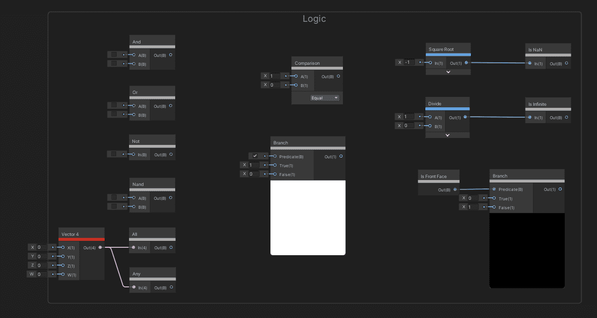*There’s a lot of logic-based nodes - not much else accepts a Boolean.*
*有很多基于逻辑的节点 - 没有多少其他节点接受布尔值*

------

# Conclusion 结论

And that’s every node covered! Shader Graph is an amazing visual tool for building shaders, and while it doesn’t yet cover every use case for shaders – most notably, it’s missing support for tessellation and geometry shaders, as well as stencils – the sheer number of nodes included out of the box make it a fantastic inclusion for Unity.

这就是覆盖的每个节点！Shader Graph 是一款用于构建着色器的出色可视化工具，虽然它尚未涵盖着色器的所有用例（最值得注意的是，它缺少对曲面细分和几何着色器以及模板的支持），但开箱即用的节点数量之多使其成为 Unity 的绝佳选择。

This article took a long time to put together, as did the YouTube video version, so thanks for reading and watching. If you enjoyed this or learned something, I’d appreciate you checking out my YouTube. The same content gets posted there as on my website, and I need as much support as I can to grow both! And check out my Patreon – there’s a bunch of goodies up for grabs for subscribers. Until next time, have fun making shaders!

这篇文章花了很长时间才整理出来，YouTube视频版本也是如此，所以感谢您的阅读和观看。如果您喜欢这个或学到了什么，我将不胜感激您查看我的 YouTube。那里发布的内容与我的网站上的内容相同，我需要尽可能多的支持来发展两者！看看我的 Patreon——订阅者可以抢购一堆好东西。下次再见，玩得开心制作着色器！

------

- [YouTube](https://www.youtube.com/dilett07)
- [GitHub](https://github.com/daniel-ilett)
- [Twitter](https://twitter.com/daniel_ilett)
- [itch.io](https://danielilett.itch.io/)
- [Patreon](https://www.patreon.com/danielilett)

Daniel Ilett  • 2023
丹尼尔·伊莱特