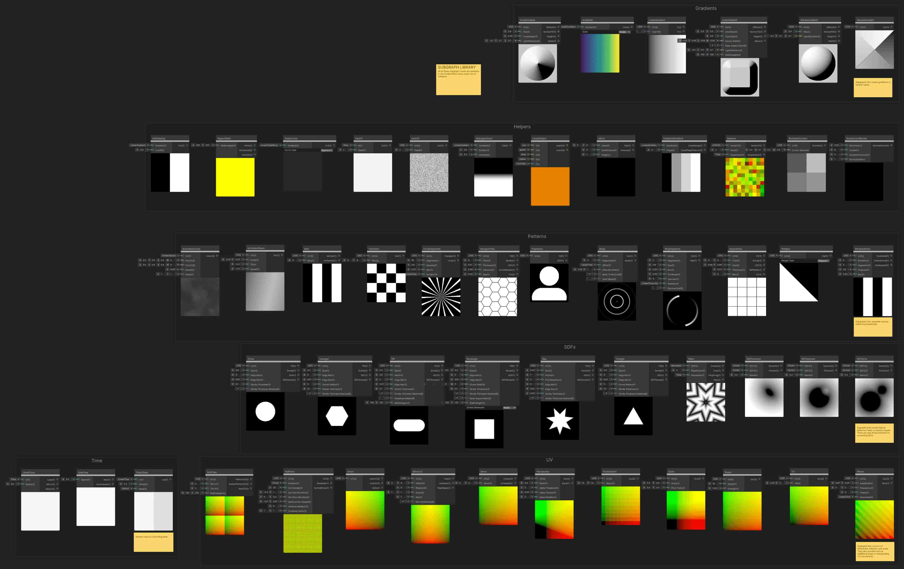
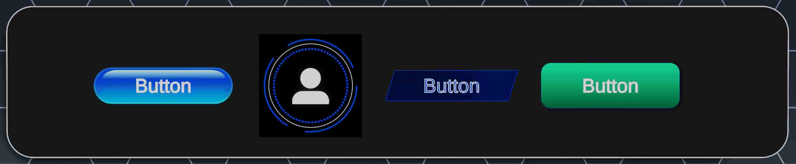
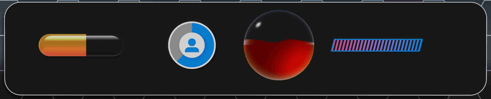
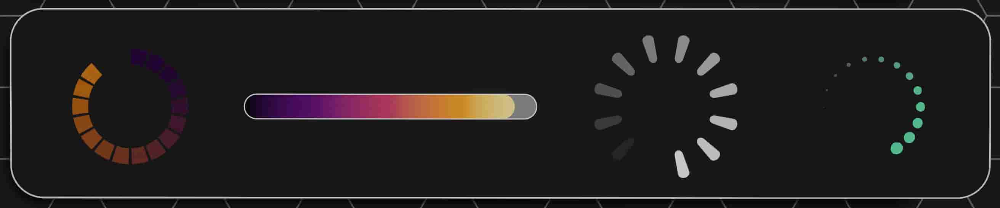

# Unity6 ShaderGraph 实现 UI 效果

- [【油管】Shader Graph: UGUI Shaders Sample](https://www.youtube.com/watch?v=LuS-TDTI8mU)
- [网盘备份：油管Unity官方教学](https://pan.baidu.com/s/1uHQO1zUSWdwCyRB_LYcFmg?pwd=at8k)
- **官方文档**：[UGUI Shader Graph |17.0.4](https://docs.unity3d.com/Packages/com.unity.shadergraph@17.0/manual/Shader-Graph-Sample-UGUI-Shaders-Getting-Started.html)
- **官方文档2**：[Create Custom UI Effects With Shader Graph | Unity UI | 2.0.0](https://docs.unity3d.com/Packages/com.unity.ugui@2.0/manual/HOWTO-ShaderGraph.html)
- [Unity Shader Graph：为UI组件编写自定义shader graph - 知乎](https://zhuanlan.zhihu.com/p/374188097)
- [【Unity教程】使用ShaderGraph让贴图中指定部分发光, 做出炫酷的效果_哔哩哔哩_bilibili](https://www.bilibili.com/video/BV17x4y1d7om)


使用方法：升级到 Unity 6000.0.40f1 (或更高版本) 然后在 window > package manager  > shader graph（版本 17.0.4 及以上）中载入 Sample："UGUI Shaders"。其中包含了超过 50 种 UI 常用效果，并且不会增加图片内存开销。

其中毛玻璃效果需要开启 `Render Pipeline Asset`（管线配置文件）设置里的 `Opaque Texture`
关于 Opaque Texture 的介绍：[通用渲染管线资源 | Universal RP | 12.1.1](https://docs.unity3d.com/cn/Packages/com.unity.render-pipelines.universal@12.1/manual/universalrp-asset.html)

另外，在编辑器运行时为了避免污染原始材质文件，可搭配 [ **UGUIMatFixInEditor 组件**](./防止Unity运行时修改材质球文件.md) 使用。

## 官方文档摘抄翻译

### 开始

- **示例场景**
  - `Assets\Samples\Shader Graph\<version number>\UGUI Shaders\Scenes\UISampleScene.unity`
  - 在这里，您可以看到一些示例按钮、仪表盘和背景。所有这些 UI 元素都是使用此示例中的子图在 Shader Graph 中构建的。
- **查看库中的子图**
  - `Assets/Samples/Shader Graph/<version number>/UGUI Shaders/Subgraphs/SubgraphLibrary.shadergraph`
  - 在这里，您将看到根据它们所在的类别分组的所有子图。您可以双击其中任何一个以跳转到子图以查看其作用。 您还可以在任何 Shader Graph 着色器中右键单击，然后在 Add Node 窗口的 UI 类别中找到子图。
- **查看使用子图的示例**
  - `Assets/Samples/Shader Graph/17.0.3/UGUI Shaders/Examples/SimpleExamples.shadergraph`
  - 此文件包含几个简单的示例，这些示例展示了如何结合使用 UI 子图来创建有趣的效果。它很好地演示了 subgraph 节点的功能。
- **查看如何创建 UI 按钮和仪表盘的示例**
  - `Assets/Samples/Shader Graph/17.0.3/UGUI Shaders/Examples/ButtonsAndIndicators.shadergraph`
  - 此文件包含多个示例按钮和仪表盘。您可以双击其中任何一个以打开 Shader Graph 资源并查看它们的构造方式。


### 自定义 UI 组件

该示例包含一些自定义 UI 组件，用于重现某些元素（如按钮、切换和滑块）的行为，并将数据传递给分配的材质。 您可以从主菜单 **Component** > **UI** > **Shader Graph Samples** 中添加这些组件。

| 元件                   | 描述                                                         |
| :--------------------- | :----------------------------------------------------------- |
| **RectTransform Size** | 将游戏对象的 RectTransform 尺寸以 _RectTransformSize（Vector2类型属性）形式传递给图形的材质。在 Shader Graph 或 Subgraph 中，需使用 RectTransform Size 自定义节点获取该值（见下文）。 |
| **Button**             | 模拟 UI 按钮组件的行为。按钮状态是通过 Selectable State 自定义节点在 Shader Graph 或 Subgraph 中获取的（见下文）。 |
| **Toggle**             | 模拟 UI Toggle 组件的行为。使用 Toggle State 自定义节点在 Shader Graph 或 Subgraph 中获取其开关状态（见下文）。通过使用 Selectable State 自定义节点在 Shader Graph 或 Subgraph 中获取其作为可选元素的状态（见下文）。 |
| **Meter**              | 一个用作进度指示器或计量表的被动式仪表。它会将归一化后的数值以浮点数属性“_MeterValue”的形式传递给图形材质。在着色器图表或子图表中，请使用MeterValue节点来获取该数值。 |
| **RangeBar**           | 一个被动范围条，用作进度条，或与 Range Slider 结合使用。     |
| **Slider**             | 一个自定义滑块，用于处理拖动事件。其值是通过 Slider Value 自定义节点在 Shader Graph 或 Subgraph 中获取的（见下文）。通过使用 Selectable State 自定义节点在 Shader Graph 或 Subgraph 中获取其作为可选元素的状态（见下文）。 |


### 自定义节点

该示例包含一些自定义 Shader Graph 节点，以方便设置。 自定义节点分为两类：

- **Inline Properties** - 这些节点会自动将隐藏属性添加到着色器图表并获取其值。
- **Branch** - 这些节点支持对特定输入（如 Button 状态）的值进行分支。

#### Inline Property Nodes（内联属性节点）

这些节点会自动将隐藏属性添加到着色器关系图并获取其值。 您也可以手动将属性添加到 Shader Graph 中，但这些自定义节点允许您将它们嵌套在子图中。

| 节点                   | 描述                                                         |
| :--------------------- | :----------------------------------------------------------- |
| **RectTransform Size** | 将 _RectTransformSize Vector2 hidden 属性添加到图形并输出其值。这是由某些子图执行基于长宽比的数学运算所需的 RectTransformSize 组件提供的。 |
| **Selectable State**   | 将 _State float hidden 属性添加到图形中并输出其值。这是由 Selectable 组件（CustomButton、CustomToggle 和 Slider）提供的。该值表示互斥状态，例如：**0 - 正常**、**1 - 高亮**、**2 - 按下**、**3 - 选定**、**4 - 禁用** |
| **Toggle State**       | 将 _isOn 布尔 hidden 属性添加到图形并输出其值。这是由 CustomToggle 组件提供的。 |
| **Meter Value**        | 将 _MeterValue float hidden 属性添加到图形并输出其值。它由 Meter 组件提供，并允许创建进度、运行状况或其他仪表盘。 |
| **Slider Value**       | 将 _SliderValue Vector3 hidden 属性添加到图形中，并将其值输出为：**值** - 将标准化的 Slider 值作为浮点数。**Direction** - 将 Slider Direction 标准化为 Vector2。它由 Slider 组件提供，并允许创建滑块，其方向和值可以从组件中设置。 |
| **Range Bar**          | 将 _RangeBar Vector4 hidden 属性添加到图表中，并将其值输出为：**Min** - 将规格化的 Slider Min 值作为浮点型。**Max** - 将 Slider Max 值标准化为浮点型。**Direction** - 将 Slider Direction 标准化为 Vector2。它由 RangeBar 组件提供，并允许创建范围条，其中方向和最小/最大值可以从组件中设置。 |

#### Branch Nodes（分支节点）

这些节点允许您根据特定输入（例如 Button state）的值进行分支操作。采用自定义节点而非子图实现的主要考量是为了具备动态端口功能。

#### SelectableBranch（可选分支节点）

此节点允许您根据 Selectable 元素（如 CustomButton）的状态执行条件分支。


### 子图节点

创建子图是为了帮助加快创建用户界面元素的过程。它们是可以快速串在一起以实现各种外观和功能的构建块。通过打开此着色器文件，您可以查看集合中的所有子图节点： assets/samples/shader graph/UGUI Shaders/subgraphs/subgraphLibrary

子图分为以下几类：

- **Inputs （输入）** - 这些子图提供输入数据。
- **Utilities（实用程序）** - 这些子图具有简单的实用程序来帮助输入数据。
- **Gradients（渐变）** - 这些节点生成各种形状的渐变，包括线性、球形、方形和自定义。
- **Helpers（助手）** - 这些子图提供了构建 UI 元素的常用作
- **Patterns（图案）** - 这些节点生成可用作背景或蒙版的程序图案。这些图案包括云、条形、棋盘格、环形片段、六边形图块、玩家图标、圆环、圆环段、方形图块、楔形和百叶窗。
- **SDF（有向距离场）** - 有序距离场形状是 UI 元素的基础。SDF 中每个像素的值表示到形状边缘的距离。可以使用 SDF 数据创建与分辨率无关的清晰或模糊的形状。该集中的形状包括圆形、六边形、胶囊形、矩形、星形和三角形。此集合还包含用于组合 SDF 形状的作符。
- **Time（时间）** - 这些节点以各种形式输出时间 - 循环、镜像、正弦波等。
- **UV（纹理坐标）** - 这些节点纵 UV 坐标，包括移动、缩放、倾斜、镜像、反转等。可以通过使用这些节点调整形状和元素的 UV 坐标来变换形状和元素。



#### Inputs （输入）

##### CanvasColor（画布颜色）

此子图输出线性空间中的 UI 元素颜色，如果 Canvas 设置为在 Gamma 空间中存储顶点颜色，则对顶点颜色执行颜色空间转换。 使用 Canvas Color 节点时，请确保在 Graph Settings 中选中 “Disable Color Tint”（禁用颜色着色），以便不对最终输出进行着色。

#### Utilities（实用程序）

##### SelectableStateCompare（可选状态比较）

此子图将 Selectable State 作为浮点数，并输出布尔值以通知状态。

##### SelectableStatePreview（可选状态预览）

此子图将 Selectable State 作为浮点输入，并具有一个下拉列表，以仅在 Shader Graph 中覆盖其值。这允许预览处于给定状态时的情况。 这对将始终使用提供的输入的最终着色器没有影响。

##### SliderDirectionCompare（滑块方向比较）

此子图将 Direction 作为 Vector2 并输出布尔值以通知基数。

##### SliderDirectionPreview（滑块方向预览）

此子图将 Direction 作为 Vector2 输入，并具有一个下拉列表，以仅在 Shader Graph 中覆盖其值。这允许预览使用不同方向的事物的外观。 这对将始终使用提供的输入的最终着色器没有影响。

#### Gradients（渐变）

此节点是常用渐变的集合。您可以从 Style 下拉菜单中选择要使用的渐变。默认情况下，水平 LinearGradient 用作输入，但您可以传入所需的任何输入渐变。

##### Cone Gradient（圆锥渐变）

为程序生成的圆锥体创建 Gradient、Normals、Height 和 Mask 。这允许您在 2D 环境中创建 3D 效果。Size （大小） 输入端口控制生成的圆锥体相对于 UV 空间的大小。ConeHeight 输入控制圆锥体中心点底部上方的高度。LightDirection 输入端口是一个向量，用于确定 Diffuse 渐变输出的光线来自的方向。Diffuse （漫反射） 输出使用圆锥体的法线和传入的 LightDirection 来计算漫反射光照。Diffuse （漫反射） 渐变中背对 LightDirection 的区域将具有负值，因此您可能需要使用 Saturate （饱和度） 节点将输出范围限制为 0 到 1。NormalTS 输出是一个标准化向量，指示圆锥体表面上每个像素的朝向。Height 输出是圆锥体的高度贴图。Mask 输出在圆锥体内部为白色，在圆锥体外部为黑色。

使用示例：

- Examples / Backgrounds / 80 年代日落
- Examples / Indicators（仪表盘） / FantasyMeter

##### Linear Gradient（线性渐变）

此节点使用 UV 坐标创建从黑色到白色的垂直或水平渐变。默认情况下，该节点使用 UI 元素中的 UV 坐标，但您也可以将自己的坐标传递到 UV 输入端口。U 输出端口创建水平渐变，V 输出端口创建垂直渐变。

使用示例：

- Examples / Backgrounds / 80 年代日落
- Examples / ProgressBars / GradientBar

##### Cube Gradient（立方体渐变）

为程序生成的立方体创建渐变、法线、高度和蒙版。这允许您在 2D 环境中创建 3D 效果。InnerSize 和 OuterSize 输入端口控制生成的立方体相对于 UV 空间的大小。LightDirection 输入端口是一个向量，用于确定 Diffuse 渐变输出的光线来自的方向。Diffuse （漫反射） 输出使用立方体的法线和传入的 LightDirection 来计算漫反射光照。Diffuse （漫反射） 渐变中背对 LightDirection 的区域将具有负值，因此您可能需要使用 Saturate （饱和度） 节点将输出范围限制为 0 到 1。NormalTS 输出是一个标准化向量，指示球体表面上每个像素的朝向。Mask 输出在球体内部为白色，在球体外部为黑色。

##### Sphere Gradient（球体渐变）

为程序生成的球体创建渐变、法线、高度和蒙版。这允许您在 2D 环境中创建 3D 效果。Size （大小） 输入端口控制生成的球体相对于 UV 空间的大小。LightDirection 输入端口是一个向量，用于确定 Diffuse 渐变输出的光线来自的方向。Diffuse （漫反射） 输出使用球体的法线和传入的 LightDirection 来计算漫反射光照。Diffuse （漫反射） 渐变中背对 LightDirection 的区域将具有负值，因此您可能需要使用 Saturate （饱和度） 节点将输出范围限制为 0 到 1。NormalTS 输出是一个标准化向量，指示球体表面上每个像素的朝向。Mask 输出在球体内部为白色，在球体外部为黑色。

使用示例：

- Examples / Indicators仪表盘 / FantasyMeter

#### Helpers（助手）

##### Anti Aliasing（抗锯齿）

您可以使用此节点从任何 SDF 形状或渐变创建完美的消除锯齿边缘，而不管形状的大小或相机与 UI 元素的距离如何。您可以使用它来创建与分辨率无关的 UI 元素。Cutoff （截止） 输入控制沿输入渐变的硬边缘应位于的点。有关使用此节点的说明，请参阅标题为“如何创建与分辨率无关的形状”的文档部分。

使用示例：

- Examples / Indicators仪表盘 / FantasyMeter
- Examples / Backgrounds / LavaLamp

##### Aspect Ratio（长宽比）

给定 UI 元素的 Width 和 Height，此节点将计算 UI 元素的长宽比。它可用于创建正确适应已分配 UI 元素的宽度或高度变化的按钮和小组件。当 WidthHeight 输入端口连接到分配的 UI 元素的 Width 和 Height 参数时，它效果最佳。有关详细信息，请参阅标题为“如何制作适应 UI 元素长宽比的形状”的文档部分。

使用示例：

- Examples / Indicators（仪表盘） / AquaMeter
- 子图 / SDF / Pill

##### Ease Curves（缓动曲线）

此节点调整输入渐变的衰减曲线。有 9 条可用的衰减曲线。有关衰减曲线的更多信息，请访问：https://easings.net/ 默认情况下，输入 Gradient 是 LinearTimeMirror，但您可以使用所需的任何类型的渐变。

##### Hash11（哈希11）

给定输入值 In 和 Seed，此节点将生成 0 到 1 范围内的确定性随机值作为输出。时间 （Time） 用作默认输入，但您可以使用所需的任何输入值。

使用示例：

- Examples / Indicators（仪表盘） / FantasyMeter

##### Hash21（哈希21）

给定 vector2 值 UV（例如 UV 坐标）和 Seed，此节点将生成确定性随机值作为输出。UV0 是默认的 UV 输入，但您可以使用所需的任何向量 2 值。

##### Histogram Scan（直方图扫描）

此节点允许您将渐变或 SDF 转换为纯色形状。您可以使用 Contrast （对比度） 输入控制沿渐变形成实心边缘的位置以及边缘的硬度。Contrast 值越低，边缘越柔和。

使用示例：

- Examples / ProgressBars / ProgressCircle
- Examples / Indicators（仪表盘） / DialMeter

##### Lerp Multiple（插值倍数）

此节点的工作方式与 Lerp 节点类似，但允许你在 3 个或 4 个值之间混合，而不仅仅是 2 个值。FracTime 用作 T 值的默认值，但您可以使用所需的任何值。

##### Mirror（镜子）

此节点来回翻转输入值。重复来回模式的次数由 Subdivisions 输入决定。

使用示例：

- 子图 / SDF / Wave

##### PosterizeGradient（色调分离渐变）

此节点将渐变量化为离散步骤。步数由 Steps 输入控制。可以划分步长划分以保留整体范围或保留步长距离。

使用示例：

- Examples / ProgressBars / ProgressCircle
- Examples / Indicators（仪表盘） / SciFiMeter

##### Random（随机）

给定 UV 坐标和 Seed，此节点将生成随机值 - Vector 2 或 Float。由于用于生成值的方法使用 sine 函数，因此它是非确定性的，在各种硬件平台上可能会有所不同（取决于 sine 的硬件实现），并且在给定较大的输入值时可能会表现出重复模式。如果您看到这些问题，请改用 Hash11 或 Hash21 节点。

使用示例：

- 子图 / UV / Shake.shadersubgraph

##### RoundedCorners（圆角）

这是 SDF 矩形节点使用的辅助节点。它有助于生成矩形的圆角。

使用示例：

- 子图 / SDF / 矩形

##### Scene Color Blurred（场景颜色模糊）

此节点以螺旋模式对 Scene Color 节点进行采样，并对结果进行平均，以创建模糊 UI 元素后面的场景背景的外观。Cycles 是螺旋线的环数。使用 Samples Per Cycle 来控制每个循环中的采样数。样本总数为 Cycles （循环次数） x Samples Per Cycle （每个周期的样本数）。样本数越多，模糊外观越平滑，但成本越高。样本数量越少，性能越好，但结果颗粒感越强。有关更多信息，请参阅子图内的 Sticky Notes。

使用示例：

- Examples / Backgrounds / BlurredHexagon

#### Patterns（图案）

##### Animated Clouds（动态云噪）

生成动态云噪图案。默认情况下，云是在屏幕空间中生成的，但您也可以传入自己的 UV 坐标。您可以使用 Color1 和 Color2 输入来控制云的颜色。云移动的速度由 Speed 输入控制。云的大小可以通过 Scale 输入来控制。

使用示例：

- Examples / Backgrounds / TechGrid
- Examples / Buttons / SciFiButton2

##### Animated Sheen（动画光泽）

此节点创建滚动高光渐变。它旨在创建按钮上的动画光泽 - 尤其是当按钮被选中或用户的鼠标悬停在按钮上时。您可以使用 Scale （缩放） 输入来控制效果的大小。倾斜角度可以使用 Tilt 输入值进行调整。您可以使用 Speed 输入来控制效果滚动的 Speed。

使用示例：

- Examples / Buttons / AquaButton
- Examples / Buttons / SciFiButton2

##### Bars（条纹）

该节点可根据使用的输出端口生成垂直或水平的黑白相间条纹。您可以通过 **Bars** 输入参数来控制条纹的数量。

##### Checkers（跳棋）

此节点生成一个简单的棋盘图案。您可以使用 Tiles （平铺） 输入来控制图案的缩放。

##### Circle Segments（环形片段）

此节点将一个圆划分为给定数量的段，并在黑色和白色之间交替。段落的宽度和模糊度可以通过 Spacing 和 Blur 输入来控制。这些线段可以输出为三角形或线条。您还可以使用 Rotation 输入来旋转模式。

使用示例：

- Examples / Buttons / SciFiButton

##### Hexagon Tiles（六边形瓦片）

此节点将创建一个六边形网格。Tiles 输入控制六边形图块的缩放比例。Thickness （粗细） 输入控制 Stroke 轮廓的宽度。Distance （距离） 输入控制图块的白色部分相对于黑线的大小。Blur （模糊） 输入控制平铺轮廓的模糊度。通过将 Distance （距离） 输入设置为 0 并将 Blur （模糊） 输入设置为 0.5 ，可以实现有趣且有用的反向 SDF 效果。

使用示例：

- Examples / Backgrounds / BlurredHexagon

##### Player Icon（玩家图标）

此节点将创建一个头像图标。它结合了 Circle 和 Pill SDF 节点。这是如何组合 SDF 以创建其他形状的一个很好的示例。

使用示例：

- Examples / Buttons / SciFiButton
- Examples / Indicators（仪表盘） / DialMeter

##### Rings（环）

此子图生成一系列同心环。您可以使用 Segments 输入选择环数。你可以使用 Glow Min Max （辉光最小最大值） 输入来控制圆环的锐度或模糊度。您可以使用 Mask To Bounds （遮罩到边界） 输入裁剪边缘的环。Offset （偏移） 输入将环移向或远离中心。默认情况下，它设置为 LinearTime，但你可以使用任何输入值。

##### Ring Segments（环段）

此节点生成一组旋转的环段。您可以使用 Segments （分段） 输入来控制分段的数量。Size （大小） 输入控制线段与中心的距离。Blur （模糊） 输入控制线段边缘的锐化或模糊程度。Thickness （厚度） 输入控制线段的宽度。Contrast （对比度） 输入控制线段尾部的衰减。Rotation 输入控制线段圆环周围的移动或位置。

##### Square Tiles（方形瓦片）

此节点生成方形图块的网格模式。Tiles （平铺） 输入控制每个维度中的平铺数量。Size 控制两个维度中白色方块与黑色线条的大小。这些值越低，黑色轮廓就越粗。Blur 控制白色方块的锐度/模糊度。您很可能需要调低 Size 值，以便为模糊的边缘腾出空间。

使用示例：

- Examples / Backgrounds / TechGrid
- Examples / Buttons / SciFiButton2

##### Wedges（楔）

此节点生成各种类型的楔形阵列。可以使用下拉框选择类型。

使用示例：

- 子图 / 渐变 / SquareGradient

##### Window Blinds（百叶窗）

此节点生成一个条形图，该条形图可以扩展或收缩，以提供打开和关闭百叶窗的外观。Rotation （旋转） 输入以度为单位控制百叶窗的方向。Segments input 控制盲注的数量。Progress （进度） 输入控制黑色和白色之间的平衡。值越高，白条越大，值越低，黑条越大。Blur 控制吟游诗人边缘的锐度/模糊度。

使用示例：

- Examples / Indicators（仪表盘） / SciFiMeter

#### SDF（有向距离场）

SDF 有向距离场是表示程序生成形状的一种非常有用的方法。SDF 中每个像素的值表示到最近的形状边缘的距离。形状内部的像素具有负值 - 也表示到最近边缘的距离。

SDF 可用于使用 SDF 节点的 Fill 输出、Histogram Scan 节点或 AntiAliasing 节点创建最终形状。AntiAliasing 节点将专门创建完美抗锯齿的形状，而不管比例、摄像机距离或分辨率如何。

每个 SDF 形状节点都会输出填充输出中的形状。Stroke 端口输出形状的轮廓。Stroke Thickness 输入参数控制 Stroke 轮廓的宽度。这些节点还输出 SDF 本身以及 Stroke SDF。

您可以使用 Edge Min 和 Edge Max 控件来控制填充形状的锐度或模糊度。值越接近，形状的边缘就越清晰。值相距越远，边缘就越柔和/越模糊。模糊的 SDF 形状可以产生很好的投影。

##### Circle（环）

创建圆形。

- 使用示例：
- Examples / Buttons / SciFiButton
- Examples / Indicators（仪表盘） / FantasyMeter
- Examples / Indicators（仪表盘） / DialMeter

##### Hexagon（六角形）

创建六边形。可以使用 Corner Radius 输入参数对六边形的角进行圆角处理。

##### Pill（胶囊）

生成胶囊形状。您可以使用 Size 参数控制胶囊的高度。您可以使用 Width 参数控制胶囊的宽度。若要控制胶囊的长宽比，请使用 WidthHeight 参数输入 UI 元素的尺寸。

使用示例：

- Examples / Buttons / AquaButton
- Examples / ProgressBars / GradientBar

##### Rectangle（矩形）

创建矩形形状。您可以使用四个 Corner Radii （圆角半径） 输入值对矩形的角进行圆角处理。要控制矩形的长宽比，请使用 WidthHeight 参数输入 UI 元素的尺寸。

使用示例：

- Examples / Buttons / SimpleButton
- Examples / Backgrounds / RoundedRectangleBubble

##### Star（星）

创建星形。您可以控制点的数量和点的距离。

##### Triangle（三角形）

创建三角形。可以使用 Corner Radius 输入参数对三角形的角进行圆角处理。

##### Waves（波）

从任何 SDF 生成动画波形。您可以使用 Repetitions 和 Movement 参数来控制波形的数量和波形的移动。

使用示例：

- Examples / Indicators（仪表盘） / FantasyMeter

##### SDF Intersect（SDF 相交）

这是两个 SDF 之间的基本布尔交集作。结果是两个形状重叠的交集。使用 Smooth 输出可以使结果具有软混合，而不是硬边缘。

##### SDF Subtract（SDF 减去）

这是两个 SDF 之间的基本布尔交集作。结果是从第一个 SDF 中减去第二个 SDF。使用 Smooth 输出可以使结果具有软混合，而不是硬边缘。

##### SDF Unite（SDF 联合）

这是两个 SDF 之间的基本布尔交集作。结果是两个 SDF 形状组合在一起。使用 Smooth 输出可以使结果具有软混合，而不是硬边缘。

使用示例：

- Examples / Backgrounds / LavaLamp

#### Time（时间）

##### LinearTime（线性时间）

输出线性增加的时间值。Loop 输出从 0 到 1 线性增加，然后跳回到零。Mirror （镜像） 输出从 0 到 1 线性增加，然后线性减少回 0 并重复这个来回循环。Switch 输出从 0 直接跳到 1，然后再次跳回到 0。

使用示例：

- Examples / Backgrounds / 80 年代日落
- Examples / Buttons / SciFiButton2
- Examples / Indicators（仪表盘） / FantasyMeter

##### SineTime（正弦时间）

Raw （原始） 输出以从 -1 到 1 再返回的平滑曲线流动。Normalized （标准化） 输出在 0 和 1 之间以平滑曲线流动。

使用示例：

- Examples / ProgressBars / FancyLoading
- Examples / Backgrounds / LavaLamp

##### TimeOffset （时间偏移）

允许您使用蒙版来确定时间偏移的区域。最大偏移值由 Offset 输入定义。Mask （遮罩） 为 1 的区域将按最大量进行时间偏移。Mask （遮罩） 为 0 的区域不是时间偏移。


#### UV（纹理坐标）

##### GridTiles（网格瓦片）

将 UV 空间划分为由 Tile U 和 Tile V 定义的瓦片数。可以通过在 WidthHeight 中输入正确的值来保持长宽比

使用示例：

- Examples / Indicators（仪表盘） / FantasyMeter
- Examples / ProgressBars / FancyLoading

##### Halftone（半色调）

将 UV 空间划分为半调空间，或根据输入渐变输出半调图案，其中点的大小由输入渐变中的阴影决定。输入渐变为白色的区域具有最大的半调点。

使用示例：

- Examples / Backgrounds / 半调

##### Invert（转化）

翻转 U 坐标和/或 V 坐标。

使用示例：

- 示例/仪表盘/DialMeter
- 示例/ProgressBars/GradientBar
- 示例/ProgressBars/ProgressCircle

##### MirrorUV（镜像UV）

获取 0 到 1 范围内的 UV 坐标，并将它们再次转换为 0 到 1 再到 0。您可以控制要镜像的偏移、旋转、缩放和轴。

##### Move（移动）

移动 UV 坐标由 Move （移动） 输入指定的量。

使用示例：

- Examples / Backgrounds / 80 年代日落
- Examples / Backgrounds / LavaLamp
- Examples / Backgrounds / WarpedGradient
- Examples / Buttons / SimpleButton

##### Perspective（透视）

扭曲 UV 坐标，使其看起来像是应用了透视，就好像对象已旋转离开摄像机一样。由于透视变形，会在边缘周围创建一些空白区域。此空白区域在 Alpha 输出中为黑色。Alpha Threshold 和 Alpha Feather 输入控制空白区域的边缘。

使用示例：

- Examples / ProgressBars / FancyLoading
- Examples / Backgrounds / 80 年代日落

##### PosterizeUV（色调分离 UV）

将平滑的 UV 坐标划分为离散的量化单元。可以使用 Steps 输入指定单位数。此节点非常适合将高分辨率图像转换为低分辨率图像。

使用示例：

- Examples / Backgrounds / 像素化

##### Scale（缩放）

按在 Scale around the point specified point （围绕 Pivot Point） 指定的点缩放 （Scale around the point specified point） 中指定的量缩放纹理坐标。

使用示例：

- Examples / Backgrounds / RoundedRectangleBubble
- Examples / Buttons / SciFiButton
- Examples / Indicators（仪表盘） / DialMeter

##### Shake（摇）

使用 Speed 和 Strength 输入以随机量快速来回振荡 UV 坐标。

使用示例：

- Examples / Indicators（仪表盘） / SciFiMeter

##### Tilt（倾斜）

倾斜 UV 坐标，使生成的对象向左或向右倾斜。

使用示例：

- Examples / Indicators（仪表盘） / SciFiMeter
- Examples / ProgressBars / SimpleLoading

##### Waves（波）

扭曲波形中的 UV 坐标。波的强度和大小可以通过 Amplitude 和 Frequency 输入来控制。

使用示例：

- Examples / Indicators（仪表盘） / FantasyMeter

### 例子

这些示例着色器是使用 subgraph 节点构建的。它们显示了子图节点的工作原理，以及如何将它们组合起来以创建背景、按钮和仪表。

#### Backgrounds 背景

背景示例是可以分配给 Canvas Image 对象的着色器，这些对象用作其他 UI 元素的背景。

##### 80sSunset（80 年代日落）

此示例将 LinearTime、Perspective、Move、SquareTiles、Bars 和 AntiAliasing 节点组合在一起，以生成滚动到远处的透视网格。

此示例中使用的 Library Subgraph 节点：

- Perspective（透视）
- LinearTime（线性时间）
- Move（移动）
- SquareTiles （方形瓦片）
- LinearGradient 线性渐变
- Bars（条纹）
- AntiAliasing（抗锯齿）
- Gradients（渐变）

##### Animated Clouds（动态云噪）

此示例将动画程序杂色组合在一起，以创建有趣的动态图案。

##### Blurred Hexagon（模糊的六边形）

此示例使用 SceneColorBlurred 节点在用户界面后面创建场景的模糊版本。它还使用 HexagonTiles 节点生成六边形网格图案。您可以使用 HexagonDisolve 参数来缩小和增大六边形的大小，从而使图案看起来溶解。

此示例中使用的 Library Subgraph 节点：

- SceneColorBlurred （场景颜色模糊）
- HexagonTiles （六边形瓦片）

##### Halftone（半色调）

此示例使用 Halftone 节点将 UI 元素后面的渲染场景转换为半调图案。它将三个通道（红色、绿色和蓝色）中的每一个都转换为半调点图案，然后重新组合它们以创建最终图像。

此示例中使用的 Library Subgraph 节点：

- Halftone（半色调）

##### LavaLamp（熔岩灯）

该示例展示了如何通过扭曲的圆形进行随机方向运动动画，并利用 **SDFUnite** 节点的 **Smooth** 输出功能，将有向距离场（SDF）形状平滑融合在一起，从而实现形状的无缝合并。

此示例中使用的 Library Subgraph 节点：

- SineTime（正弦时间）
- Move（移动）
- Circle（环）
- SDFUnite（SDF联合）

##### Pixelation（像素化）

此示例说明如何使用 PosterizeUV 节点量化用于对场景进行采样的 UV 坐标。结果是场景的某个版本似乎由较大的像素组成。

此示例中使用的 Library Subgraph Nodes （库子图节点）：

- PosterizeUV（色调分离 UV）

##### RoundedRectangleBubble（圆角矩形气泡）

此示例说明如何为其他 UI 元素创建圆角框架作为背景，包括轮廓和投影。要保持此着色器中圆角的正确长宽比，请将此着色器的公开 WidthHeight 参数连接到 UI Image 元素的 Width 和 Height 参数。您可以使用 ImageSize 脚本执行此作。有关如何完成此作的详细信息，请参阅[如何制作适应 UI 元素长宽比的形状](https://docs.unity3d.com/Packages/com.unity.shadergraph@17.0/manual/Shader-Graph-Sample-UGUI-Shaders-How-tos-aspect-ratio.html)。

此示例中使用的 Library Subgraph Nodes （库子图节点）：

- Scale（缩放）
- LinearGradient（线性渐变）
- Move（移动）
- Rectangle（矩形）

##### TechGrid（技术网格）

此示例使用 **SquareTiles** 节点生成网格图案，并通过 **AnimatedClouds** 节点创建平滑噪波效果。这些效果共同构成了一个适合作为背景的科技感网格。

此示例中使用的 Library Subgraph Nodes （库子图节点）：

- AnimatedClouds（动态云噪）
- SquareTiles （方形瓦片）

##### WarpedGradient （扭曲渐变）

本示例展示了如何通过程序化噪点扭曲 UV 坐标，并利用这些变形后的坐标生成一个模糊且扭曲的圆形。同时，使用 **Vignette（暗角）** 节点使屏幕四角变暗，以增强视觉效果。

此示例中使用的 Library Subgraph Nodes （库子图节点）：

- Move（移动）
- Circle（环）
- Vignette（暗角）

#### Buttons 按钮

[](https://docs.unity3d.com/Packages/com.unity.shadergraph@17.0/manual/images/UITools-buttons.png)这些示例演示如何创建各种视觉样式的按钮。每个按钮都有公开的参数，用于控制按钮的视觉状态 - selected、pressed 和 active。在示例场景中，您可以了解这些材质参数如何连接到按钮的状态事件以驱动按钮的外观。

按钮的许多形状元素都使用“抗锯齿”节点，该节点将 SDF 和渐变转换为完美的抗锯齿形状，而不管缩放或摄像机位置如何。有关如何完成此作的更多详细信息，请参阅[如何创建与分辨率无关的形状](#如何创建与分辨率无关的形状)。

##### AquaButton（水流按钮）

此示例说明如何创建浅绿色风格的按钮，并包括镜面高光、渐变阴影、菲涅尔轮廓和彩色投影。它使用 WidthHeight 参数调整为分配给它的按钮对象的长宽比。在示例场景中，请注意，此材质参数使用 ImageSize 脚本连接到 UI 对象的宽度和高度值。

此示例中使用的 Library Subgraph Nodes （库子图节点）：

- Move（移动）
- AspectRatio（长宽比）
- AnimatedSheen（动画光泽）
- Pill（胶囊）

##### SciFiButton （科幻按钮）

此示例使用多个圆形元素，并说明了如何将多个元素与 subtract、maximum、lerp 和 multiply 组合在一起。

此示例中使用的 Library Subgraph Nodes （库子图节点）：

- Circle（环）
- Move（移动）
- AntiAliasing（抗锯齿）
- Scale（缩放）
- PlayerIcon （玩家图标）

##### SciFiButton2（科幻按钮2）

此按钮示例类似于 TechGrid 背景。它使用 SquareTiles 节点创建网格，并使用 AnimatedClouds 节点创建平滑的噪声背景。它还说明了如何使用 Tilt 节点将矩形形状转换为平行四边形。

此示例中使用的 Library Subgraph Nodes （库子图节点）：

- AspectRatio （长宽比）
- LinearTime（线性时间）
- CircleSegments（环形片段）
- Rectangle（矩形）
- AntiAliasing（抗锯齿）
- AnimatedSheen（动画光泽）
- SquareTiles（方形瓦片）

##### SimpleButton（简单按钮）

这是一个示例，说明如何创建具有平滑渐变颜色、投影以及 Selected、Pressed 和 Active 状态的简单按钮。

此示例中使用的 Library Subgraph Nodes （库子图节点）：

- Move（移动）
- Scale（缩放）
- LinearGradient （线性渐变）
- Rectangle（矩形）
- AntiAliasing（抗锯齿）

#### Indicators 仪表盘

[](https://docs.unity3d.com/Packages/com.unity.shadergraph@17.0/manual/images/UITools-meters2.png)这些 UI 元素直观地向玩家指示内容，例如生命值、弹药数量、护盾强度等。它们都有一个公开的材质参数，称为“Health（健康）”。使用脚本，您可以将此参数连接到工程中的任何值，以向玩家指示其级别。

##### AquaMeter（水仪表盘）

此仪表的样式与 AquaButton 示例相匹配 - 但它没有公开按钮状态，而是具有可控的填充仪表。

此示例中使用的 Library Subgraph Nodes （库子图节点）：

- AspectRatio（长宽比）
- Pill（胶囊）
- AntiAliasing（抗锯齿）
- HistogramScan（直方图扫描）

##### DialMeter （圆形仪表盘）

本示例采用极坐标系构建环形仪表盘，并在内圈与外圈上应用了阴影效果。中心的玩家图标可替换为纹理贴图或其他SDF（有向距离场）形状。

此示例中使用的 Library Subgraph Nodes （库子图节点）：

- AspectRatio（长宽比）
- Pill（胶囊）
- AntiAliasing（抗锯齿）
- HistogramScan（直方图扫描）

##### FantasyMeter （奇幻仪表盘）

此示例可以用作奇幻游戏的生命值或法力仪表盘。它使用 SphereGradient 节点根据程序生成的球体形状生成虚假照明和反射。球体默认填充红色液体，但您可以使用公开的 Color 参数轻松地将颜色更改为您喜欢的任何颜色。

此示例中使用的 Library Subgraph Nodes （库子图节点）：

- LinearGradient （线性渐变）
- PosterizeGradient（色调分离渐变）
- Hash11（哈希11）
- LinearTime（线性时间）
- GridTiles（网格瓦片）
- Move（移动）
- Circle（环）
- HistogramScan（直方图扫描）
- Waves（波）
- AntiAliasing（抗锯齿）
- Gradients（渐变）
- SphereGradient （球体渐变）

##### SciFiMeter（科幻仪表盘）

这个仪表盘可以用来在科幻主题的游戏中指示弹药或盾牌等级。这个很酷的地方在于，当指示数值变低时它会开始晃动 - 以强调低弹药或护盾的紧迫性。

此示例中使用的 Library Subgraph Nodes （库子图节点）：

- Shake（摇）
- AspectRatio （长宽比）
- Tilt（倾斜）
- Rectangle（矩形）
- AntiAliasing（抗锯齿）
- WindowBlinds（百叶窗）
- PosterizeGradient（色调分离渐变）
- HistogramScan（直方图扫描）

#### Progress Bars 进度条

[](https://docs.unity3d.com/Packages/com.unity.shadergraph@17.0/manual/images/UITools-meters.png)

##### FancyLoading（花式加载）

这是一个由圆环组成的圆环。每个圆环开始时都很大，然后随着时间的推移变小，并且效果是偏移的，因此它以波浪模式发生。较大的圆形图案似乎也会随着时间的推移而移动和改变视角，就像它在 3D 空间中倾斜一样。这些效果都是通过将 Subgraph Library 中的各种节点链接在一起来实现的。

此示例中使用的 Library Subgraph Nodes （库子图节点）：

- SineTime（正弦时间）
- Perspective（透视）
- Scale（缩放）
- Move（移动）
- LinearTime（线性时间）
- GridTiles（网格瓦片）
- Circle（环）
- AntiAliasing（抗锯齿）

##### GradientBar（渐变进度条）

这是一个胶囊形状的进度条，会随着进度参数从 0 增加到 1 而逐渐填充。如果正确关联到所属 Canvas Image 元素的宽度和高度参数，其宽高比将自动适配。

此示例中使用的 Library Subgraph Nodes （库子图节点）：

- Move（移动）
- Pill（胶囊）
- AntiAliasing（抗锯齿）
- Invert（转化）
- LinearGradient（线性渐变）
- Scale（缩放）
- Gradients（渐变）

##### ProgressCircle（进度环）

这是一个圆形刻度盘，当进度参数从 0 增加到 1 时，它会填充成圆形。起始颜色和结束颜色作为参数显示，可以进行调整以创建不同的外观。

此示例中使用的 Library Subgraph Nodes （库子图节点）：

- Invert（转化）
- PosteriaeGradient（色调分离渐变）
- PosteriaeGradient（直方图扫描）
- Circle（环）
- AntiAliasing（抗锯齿）
- CircleSegments（环形片段）

##### SimpleLoading（简单加载）

这是一个由胶囊状元素组成的圆环，随着时间的推移，这些元素会从白色淡化为黑色。每个元素都以波浪状图案淡出，似乎围绕圆环。这种类型的动画非常常用作加载仪表盘。

此示例中使用的 Library Subgraph Nodes （库子图节点）：

- Tilt（倾斜）
- Scale（缩放）
- LinearTime（线性时间）
- GridTiles（网格瓦片）
- Pill（胶囊）
- AntiAliasing（抗锯齿）


### 如何创建与分辨率无关的形状

在创建 UI 元素时，能够使其与分辨率无关非常有用，这意味着无论它是以非常高的分辨率还是非常低的分辨率渲染，它看起来都清晰锐利。基于纹理的 UI 元素取决于分辨率。纹理本身具有特定的分辨率 - 因此，如果 UI 元素的渲染分辨率高于纹理，则结果将变得模糊，如果纹理的分辨率高于 UI 元素的渲染分辨率，则会出现筛选瑕疵并浪费纹理内存。

使用此示例集中包含的库中的节点，您可以按程序生成形状，而不是使用纹理生成形状。您可以以任何分辨率渲染这些形状，并且它们看起来总是非常清晰且平滑地消除锯齿。这是如何做到的：

1. 将其中一个 SDF 形状节点（圆形、六边形、胶囊形、矩形、星形或三角形）添加到图形中。您可以在 UI/SDF 下的 Add Node 菜单中找到它们。这些节点使用有序距离字段生成形状。如果从 Fill 输出端口获取输出，则会获得一个形状，但也可以从 SDF 输出端口获取原始 SDF 输出。SDF 中的每个像素都是一个值，表示到形状的最近边缘的距离。形状内部的像素具有负值以指示这一点。
2. 将 AntiAliasing 节点添加到图表中。您可以在 UI/Helpers 下的 Add Node 菜单中找到它。AntiAliasing 节点旨在以与分辨率无关的方式将 SDF “解析”为抗锯齿形状。
3. 将 SDF 形状节点的 SDF 输出端口连接到 AntiAliasing 节点的 Gradient 输入端口。
4. 将 Cutoff port （截止端口） 设置为默认值零。AntiAliasing 节点将使用一种正确适应屏幕上像素数的方法将形状的 SDF 转换为纯色。
5. 要使形状变白，使背景变黑，请将 AntiAliasing 节点的 **Out** 端口连接到 One Minus 节点以反转结果。

现在，您拥有了一个与分辨率无关的形状。你可以用这个形状填充整个屏幕并以 8k 渲染它，或者把它缩小到屏幕的一小部分，然后在低端智能手机上渲染它，它在所有情况下都会有一个尖锐的、抗锯齿的边缘。


### 如何创建功能按钮

按钮具有多种状态，具体取决于用户与它们的交互。当用户的鼠标悬停在按钮上时，按钮的外观可能会发生变化。当按下时，按钮也可能会发生变化以指示按下。这意味着着色器需要创建各种视觉样式并公开参数以触发它们。然后，您需要将这些公开的参数连接到按钮的事件。请按照以下步骤了解如何执行此作。

1. 创建新的 Shader Graph 资产。
2. 在 Graph Inspector 中，确保 Shader Graph 的 Material 设置设置为 **Canvas**。
3. 打开着色器的 Blackboard 并添加两个布尔参数。
4. 将参数命名为 **Selected** 和 **Pressed**。
5. 将这些参数拖动到图表中，并使用它们创建一个着色器，该着色器根据值是 true 还是 false 而变化。SimpleButton Shader Graph 资源就是一个很好的示例。在这里找到它：`Assets/Samples/Shader Graph/<your version>/UGUI Shaders/Examples/Buttons/SimpleButton`
6. 在您的场景中，在 **Hierarchy （层次结构**） 面板中创建一个新的 Canvas 元素（如果还没有）。（在 Hierarchy 面板中单击鼠标右键，然后选择 **UI** > **Canvas**）。
7. 将 Button 元素添加到 Canvas。（右键单击 Canvas 元素，然后选择 **UI** > **按钮 - TextMeshPro**）然后选择 Button 元素。
8. 在 Project （项目） 面板中选择与着色器关联的材质，然后将其拖放到 Image UI 元素的 Inspector （检查器） 中的 Material （材质） 槽中。现在，着色器的材质已分配给 UI 元素。
9. 将按钮的 **Source Image** 和 **Transition** 设置为 None。着色器提供这些。

- 现在，单击 Inspector 底部的 **Add Component** 按钮，并添加名为 **UI Material** 的脚本。此脚本公开 Selected 和 Pressed 参数，以便其他脚本可以使用它们。

1. 再次单击 **Add Component** 并添加名为 **ButtonMaterial** 的脚本。此脚本将材质的公开按钮参数连接到按钮的事件。

现在，您有一个按钮，当鼠标指针悬停在按钮上、按下按钮、停止按下按钮并离开按钮时，它可以正确地将信息传递给其材料。您可以设置着色器，以对样式有意义的任何方式直观地响应这些事件。例如，按下按钮时，您可能会将按钮稍微向下移动、反转其颜色或变暗。当鼠标悬停在按钮上时，可以在按钮周围显示轮廓，或打开动画光泽效果。


### 如何制作适应 UI 元素长宽比的形状

按钮和其他 UI 元素有各种形状和大小。通常，相同样式的按钮或背景元素需要与许多不同的形状一起使用，或者适应不断变化的宽度和高度。此示例中的许多 UI 元素都旨在适应不断变化的尺寸。按照以下步骤创建可以执行此作的 UI 元素。

1. 创建新的 Shader Graph 资产。
2. 在 Graph Inspector 中，将 Shader Graph 的 Material 设置设置为 **Canvas**。
3. 将 SDF Pill 节点添加到新的 Shader Graph 文件中。（您可以在 **UI/SDF** 下的 **Add Node** 菜单中找到此节点。
4. 将 Pill 节点的 **Fill** 输出端口连接到 **Master Stack** 的 **Base Color** 输入端口。现在，您已经为一个 UI 元素创建了一个方形着色器。如果将此着色器分配给非方形 UI 元素，它将拉伸，看起来不像合适的胶囊形状。 请注意，Pill 节点的最后一个输入端口称为 **WidthHeight**。这是着色器将分配到的 UI 元素的宽度和高度数据的输入。默认情况下，Pill 节点假定 UI 元素为方形，但如果您计划使用不同的长宽比，则可以输入其他值。最好将它们连接到实际的 UI 元素值，而不是手动输入值。这就是我们接下来要做的事情。
5. 打开 **Blackboard** 并添加新的 Vector2 参数。
6. 将参数命名为 **WidthHeight**。
7. 将参数拖动到图形中，并将其连接到 Pill 节点上的 **WidthHeight** 输入端口。现在，您已经公开了 **WidthHeight** 参数，因此可以在着色器外部连接该参数。
8. 在您的场景中，在 **Hierarchy （层次结构**） 面板中创建一个新的 **Canvas** 元素（如果还没有）。（在 **Hierarchy** 面板中单击鼠标右键，然后选择 **UI** > **Canvas**）。
9. 然后将 Image 元素添加到 Canvas。（右键单击 **Canvas** 元素，然后选择 **UI** > **Image**）选择 Image 元素。
10. 在 Project （项目） 面板中选择与着色器关联的材质，然后将其拖放到 Image UI 元素的 Inspector （检查器） 中的 Material （材质） 槽中。现在，着色器的材质已分配给 UI 元素。
11. 单击 Inspector 底部的 **Add Component** 按钮。
12. 选择 **Image Size** 脚本并将其分配给 Image 元素。此脚本将 Image 元素的 Width 和 Height 参数连接到着色器的 WidthHeight 参数，因此当 Width 或 Height 值发生变化时，着色器会进行调整。

现在，您有一个着色器，它将适应它所分配到的 UI 元素的长宽比。您可以调整 Image 元素的 Width 和 Height 参数，Pill 形状将保持其圆形。节点库中的许多其他节点也提供了相同的功能。您可以用同样的方式控制任何具有 WidthHeight 输入端口的子图节点。


### 性能说明

这些示例着色器中展示的技术使用纯数学来生成视觉效果（程序生成），而不是对纹理贴图进行采样。虽然很明显，这些方法比基于纹理贴图的方法使用更少的内存，但主要问题是对纹理贴图进行采样还是按程序生成视觉效果哪种更划算。

在我们的内部测试中，渲染基于纹理的按钮和程序生成的按钮之间的性能差异小于 0.01 毫秒，因此差异非常小，几乎无法测量。当然，可以创建一个比纹理样本更昂贵的复杂着色器，但在我们创建的示例的复杂程度上，这些元素与传统的基于纹理的 UI 元素之间几乎没有性能差异。

根据这种理解，除了这些技术的其他好处（如本文档顶部所述）之外，很明显这是创建 UI 元素的一种非常高效且有效的方法。


## 油管视频翻译

### **Shader Graph 团队隆重推出全新示例内容包：UGUI Shaders 示例集**

我们兴奋地宣布发布包含 50+子图(Sub-graph)的 UI 着色器构建模块库。该资源包提供：

- **预制组件**：数十种按钮(buttons)、背景(backgrounds)、仪表盘(indicators)和进度条(progress bars)范例
- **核心优势**：
  - 分辨率无关(resolution independent)的 UI 元素
  - 零纹理内存占用(zero texture memory)
  - 完全在 Unity 的 Shader Graph 中创作编辑
  - 自动适配宽高比(aspect ratio)
  - 集成所有视觉状态(visual states)与交互行为(behaviors)

#### **技术解析**

1. **分辨率无关性**
   通过程序化生成(procedurally generated)实现，从智能手机到 100 英寸 8K 电视均可保持清晰锐利(crisp and clear)。
2. **无纹理工作流**
   基于数学运算构建视觉效果，彻底消除：
   - 外部图像编辑往返工作流(back-and-forth workflow)
   - 纹理切割(chopping into textures)与重复导入(reimporting)
     调整仅需修改着色器参数(shader parameters)或节点连线(rewiring nodes)。
3. **动态适配**
   通过传入 UI 元素的宽高值，自动适配显示比例，无需：
   - 制作多尺寸按钮变体
   - 九宫格缩放(nine slicing)
4. **全状态集成**
   单个着色器可包含悬停(hover)、激活(active)/禁用(inactive)、按下(press down)等所有交互状态。

------

### **示例内容导航**

1. **导入路径**
   `Package Manager > Shader Graph > Samples > UGUI Shaders`
   版本目录：`Samples/Shader Graph/[版本号]/UGUI Shaders`
2. **示例场景(UI Sample Scene)**
   - **背景页(Background)**：实时调整饱和度(saturation)、色调(color tint)与模糊度(blur)
   - **矩形变换页(RectTransform Size)**：宽高比自适应演示
   - **计量仪表盘页(Meters)**：血量(health)/魔法值(magic level)等动态仪表
   - **交互页(Interactables)**：可操作按钮与滑动条
   - **指示仪表盘页(Indicators)**：加载/保存动画特效

------

### **子图库(Sub-graph Library)应用实例**

以创建 80 年代风格动画背景为例：

1. **基础网格**
   使用 `Square Tiles` 节点生成网格，通过 `Move`+`Linear Time` 实现 Y 轴滚动

2. **透视处理**
   添加 `Perspective Warp` 节点，设置：

   ```
   Skew Rotation = -90°  
   Skew = 0.9  
   Tiling = 32
   ```

3. **抗锯齿输出**
   将 SDF(有向距离场)传入 `Anti-Aliasing` 节点，确保多分辨率下边缘锐利

4. **视觉增强**

   - 使用 `Bars` 节点创建顶部遮罩
   - 通过 `Gradients` 库加载 80 年代落日渐变
   - 最终混合输出(blend mask)

------

### **获取与反馈**

- **适用版本**：Unity 6+
- **论坛交流**：Shader Graph 官方论坛欢迎分享使用体验

> 通过此子图库，开发者可在数分钟内构建复杂 UI 效果，大幅提升创作效率。所有示例均采用模块化节点组合实现。

# UIEffect

将 UI 相关的效果实现的非常完整，应有尽有（UI 软遮罩看我另一篇文章 [UI 软遮罩](../Unity/插件汇总.md)）

github 版本：[wangbenchong/UIEffect: UIEffect is an effect component for uGUI element in Unity. Let's decorate your UI with effects! (github.com)](https://github.com/wangbenchong/UIEffect)

gittee 仓库备份：[UIEffect: 在 github 上看到一个日本人写的各种 ui 效果，我把它从 built-in 扩展到支持 urp，并在最新版 Unity6 上测试运行通过 (gitee.com)](https://gitee.com/wangbenchong/uieffect)

原作者：[https://github.com/mob-sakai/UIEffect](https://github.com/mob-sakai/UIEffect)

截至目前 2024/8/7，原作者还在弄 4.0 的预览版（里面有些 TMPro 插件支持的代码还没写完，但也鸽了一年多了）可持续关注。

# ParticleEffectForUGUI

[mob-sakai/ParticleEffectForUGUI: Render particle effect in UnityUI(uGUI). Maskable, sortable, and no extra Camera/RenderTexture/Canvas.](https://github.com/mob-sakai/ParticleEffectForUGUI)

备注：mob-sakai 很多仓库都是 UGUI 效果

# FancyScrollView

酷炫的 ScrollView 效果：https://github.com/setchi/FancyScrollView

# uGUI-Hypertext

老式 Text 实现超链接效果：https://github.com/setchi/uGUI-Hypertext
