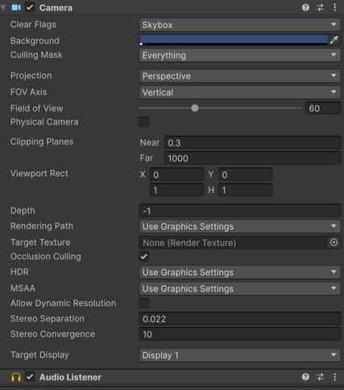
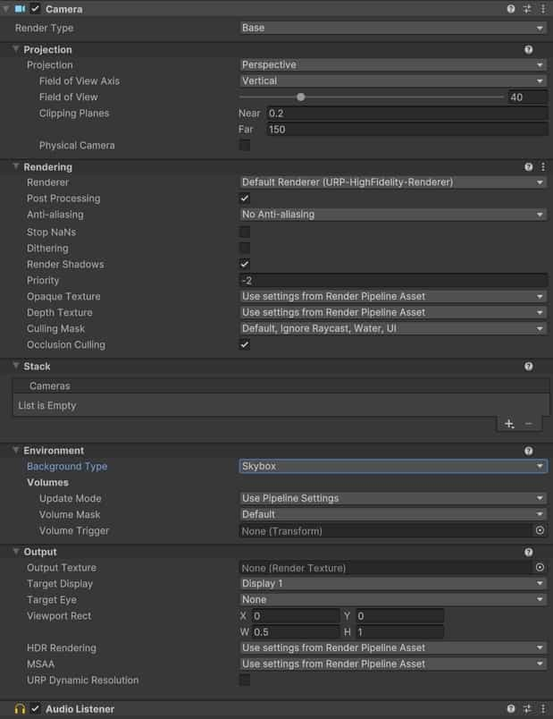

# 官方提供的切换工具

[Unity - Manual: Convert assets using the Render Pipeline Converter](https://docs.unity3d.com/6000.0/Documentation/Manual/urp/features/rp-converter.html)

# 相机的变化

Built-In相机：

 

URP相机：

 

# 内置升级URP

- 转自文章：[Unity Built-in转URP速查表 | Alex Technical Art](https://cuihongzhi1991.github.io/blog/2020/05/27/builtinttourp/)
- 扩展阅读：[Unity项目从built-in升级到URP（包含早期版本和2023版本）_unity built-in转urp-CSDN博客](https://blog.csdn.net/lizijie7471619/article/details/136009257)
- *基于7.3版本的URP，有些暂时还不支持的内容可能已在后续版本更新迭代。*

##  结构 

首先要在SubShader的Tags中添加"RenderPipeline" = "UniversalPipeline"，并且使用HLSL的宏代替旧版的CG语言宏。

| Built-in                | URP         |
| ----------------------- | ----------- |
| CGPROGRAM / HLSLPROGRAM | HLSLPROGRAM |
| ENDCG / ENDHLSL         | ENDHLSL     |
| CGINCLUDE / HLSLINCLUDE | HLSLINCLUDE |


##  Include文件的改动 

| Content         | Built-in        | URP                                                          |
| --------------- | --------------- | ------------------------------------------------------------ |
| Core            | Unity.cginc     | Packages/com.unity.render-pipelines.universal/ShaderLibrary/Core.hlsl |
| Light           | AutoLight.cginc | Packages/com.unity.render-pipelines.universal/ShaderLibrary/Lighting.hlsl |
| Shadows         | AutoLight.cginc | Packages/com.unity.render-pipelines.universal/ShaderLibrary/Shadows.hlsl |
| Surface shaders | Lighting.cginc  | 无                                                           |


其他常用的include文件:

- Packages/com.unity.render-pipelines.core/ShaderLibrary/SpaceTransforms.hlsl

- Packages/com.unity.render-pipelines.universal/ShaderLibrary/ShaderVariablesFunctions.hlsl

- Packages/com.unity.render-pipelines.core/ShaderLibrary/Common.hlsl

- Packages/com.unity.render-pipelines.universal/ShaderLibrary/Input.hlsl

- Packages/com.unity.render-pipelines.core/ShaderLibrary/Color.hlsl

- Packages/com.unity.render-pipelines.universal/ShaderLibrary/DeclareDepthTexture.hlsl

- Packages/com.unity.render-pipelines.universal/ShaderLibrary/DeclareOpaqueTextue.hlsl


##  光照模式 

| Built-in             | URP                                                   |
| -------------------- | ----------------------------------------------------- |
| ForwardBase          | UniversalForward                                      |
| ForwardAdd           | 无                                                    |
| Deferred and related | UniversalGBuffer seems to have just been added to URP |
| Vertex and related   | 无                                                    |
| ShadowCaster         | ShadowCaster                                          |
| MotionVectors        | 暂不支持                                              |


URP其他支持的光照模式：

- DepthOnly

- Meta (用于烘焙光照贴图)

- Universal2D


##  变体(Variants) 


URP支持着色器的变体，可以使用#pragma multi_compile宏实现编译不同需求下的着色器，常见的内置关键字有：


- _MAIN_LIGHT_SHADOWS

- _MAIN_LIGHT_SHADOWS_CASCADE

- _ADDITIONAL_LIGHTS_VERTEX

- _ADDITIONAL_LIGHTS

- _ADDITIONAL_LIGHT_SHADOWS

- _SHADOWS_SOFT

- _MIXED_LIGHTING_SUBTRACTIVE


##  预定义的着色器预处理宏 


###  辅助宏(Helpers) 

| Built-in                            | URP                         |
| ----------------------------------- | --------------------------- |
| UNITY_PROJ_COORD(a)                 | 无，使用 a.xy/a.w 来代替    |
| UNITY_INITIALIZE_OUTPUT(type, name) | ZERO_INITIALIZE(type, name) |


###  阴影贴图 

需要包含 Packages/com.unity.render-pipelines.universal/ShaderLibrary/Shadows.hlsl

| Built-in                          | URP                                                          |
| --------------------------------- | ------------------------------------------------------------ |
| UNITY_DECLARE_SHADOWMAP(tex)      | TEXTURE2D_SHADOW_PARAM(textureName, samplerName)             |
| UNITY_SAMPLE_SHADOW(tex, uv)      | SAMPLE_TEXTURE2D_SHADOW(textureName, samplerName, coord3)    |
| UNITY_SAMPLE_SHADOW_PROJ(tex, uv) | SAMPLE_TEXTURE2D_SHADOW(textureName, samplerName, coord4.xyz/coord4.w) |


###  纹理/采样器的声明宏 

| Built-in                                          | URP                                                          |
| ------------------------------------------------- | ------------------------------------------------------------ |
| UNITY_DECLARE_TEX2D(name)                         | TEXTURE2D(textureName); SAMPLER(samplerName);                |
| UNITY_DECLARE_TEX2D_NOSAMPLER(name)               | TEXTURE2D(textureName);                                      |
| UNITY_DECLARE_TEX2DARRAY(name)                    | TEXTURE2D_ARRAY(textureName); SAMPLER(samplerName);          |
| UNITY_SAMPLE_TEX2D(name, uv)                      | SAMPLE_TEXTURE2D(textureName, samplerName, coord2)           |
| UNITY_SAMPLE_TEX2D_SAMPLER(name, samplername, uv) | SAMPLE_TEXTURE2D(textureName, samplerName, coord2)           |
| UNITY_SAMPLE_TEX2DARRAY(name, uv)                 | SAMPLE_TEXTURE2D_ARRAY(textureName, samplerName, coord2, index) |
| UNITY_SAMPLE_TEX2DARRAY_LOD(name, uv, lod)        | SAMPLE_TEXTURE2D_ARRAY_LOD(textureName, samplerName, coord2, index, lod) |
|                                                   | SAMPLE_TEXTURE2D_X(textureName, samplerName, coord2)，酌情对应2D或ARRAY |
|                                                   | SAMPLE_TEXTURE2D_X_LOD(textureName, samplerName, coord2, lod) |


##  内置的着色器辅助函数 

可以在 Packages/com.unity.render-pipelines.core/ShaderLibrary/SpaceTransforms.hlsl 看到下方的所有函数


###  顶点变换函数 

| Built-in                                | URP                                                      |
| --------------------------------------- | -------------------------------------------------------- |
| float4 UnityObjectToClipPos(float3 pos) | float4 TransformObjectToHClip(float3 positionOS)         |
| float3 UnityObjectToViewPos(float3 pos) | TransformWorldToView(TransformObjectToWorld(positionOS)) |


###  泛用的辅助函数 

| Built-in                                                   | URP                                                          | Include                                                      |
| ---------------------------------------------------------- | ------------------------------------------------------------ | ------------------------------------------------------------ |
| float3 WorldSpaceViewDir (float4 v)                        | float3 GetWorldSpaceViewDir(float3 positionWS)               | Include "Packages/com.unity.render-pipelines.universal/ShaderLibrary/ShaderVariablesFunctions.hlsl" |
| float3 ObjSpaceViewDir (float4 v)                          | 无，使用 TransformWorldToObject(GetCameraPositionWS()) - objectSpacePosition; |                                                              |
| float2 ParallaxOffset (half h, half height, half3 viewDir) | 可能没有，从 UnityCG.cginc 复制                              |                                                              |
| fixed Luminance (fixed3 c)                                 | real Luminance(real3 linearRgb)                              | Include "Packages/com.unity.render-pipelines.core/ShaderLibrary/Color.hlsl" |
| fixed3 DecodeLightmap (fixed4 color)                       | real3 DecodeLightmap(real4 encodedIlluminance, real4 decodeInstructions) | Include "Packages/com.unity.render-pipelines.core/ShaderLibrary/EntityLighting.hlsl" URP中decodeInstructions 为 half4(LIGHTMAP_HDR_MULTIPLIER, LIGHTMAP_HDR_EXPONENT, 0.0h, 0.0h) |
| float4 EncodeFloatRGBA (float v)                           | 可能没有， 从 UnityCG.cginc 复制                             |                                                              |
| float DecodeFloatRGBA (float4 enc)                         | 可能没有， 从 UnityCG.cginc 复制                             |                                                              |
| float2 EncodeFloatRG (float v)                             | 可能没有， 从 UnityCG.cginc 复制                             |                                                              |
| float DecodeFloatRG (float2 enc)                           | 可能没有， 从 UnityCG.cginc 复制                             |                                                              |
| float2 EncodeViewNormalStereo (float3 n)                   | 可能没有， 从 UnityCG.cginc 复制                             |                                                              |
| float3 DecodeViewNormalStereo (float4 enc4)                | 可能没有， 从 UnityCG.cginc 复制                             |                                                              |


###  前向渲染辅助函数 

| Built-in                             | URP                                                          | Include                                                      |
| ------------------------------------ | ------------------------------------------------------------ | ------------------------------------------------------------ |
| float3 WorldSpaceLightDir (float4 v) | _MainLightPosition.xyz - TransformObjectToWorld(objectSpacePosition) | Include "Packages/com.unity.render-pipelines.universal/ShaderLibrary/Input.hlsl" |
| float3 ObjSpaceLightDir (float4 v)   | TransformWorldToObject(_MainLightPosition.xyz) - objectSpacePosition | Include "Packages/com.unity.render-pipelines.universal/ShaderLibrary/Input.hlsl" |
| float3 Shade4PointLights (…)         | 无，可尝试用half3 VertexLighting(float3 positionWS, half3 normalWS) | include "Packages/com.unity.render-pipelines.universal/ShaderLibrary/Lighting.hlsl" |


###  屏幕空间辅助函数 

| Built-in                                     | URP                                        | Include                                                      |
| -------------------------------------------- | ------------------------------------------ | ------------------------------------------------------------ |
| float4 ComputeScreenPos (float4 clipPos)     | float4 ComputeScreenPos(float4 positionCS) | Include "Packages/com.unity.render-pipelines.universal/ShaderLibrary/ShaderVariablesFunctions.hlsl" |
| float4 ComputeGrabScreenPos (float4 clipPos) | 无                                         |                                                              |


###  顶点光照的辅助函数 

| Built-in                                                | URP                                                          | Include                                                      |
| ------------------------------------------------------- | ------------------------------------------------------------ | ------------------------------------------------------------ |
| float3 ShadeVertexLights (float4 vertex, float3 normal) | 无，可尝试用 UNITY_LIGHTMODEL_AMBIENT.xyz + VertexLighting(…) | include "Packages/com.unity.render-pipelines.universal/ShaderLibrary/Lighting.hlsl" |


可以在 Packages/com.unity.render-pipelines.core/ShaderLibrary/Common.hlsl 中找到一些通用函数


##  内置的着色器变量 

| Built-in                                                | URP                                                          | Include                                                      |
| ------------------------------------------------------- | ------------------------------------------------------------ | ------------------------------------------------------------ |
| _LightColor0                                            | _MainLightColor                                              | Include "Packages/com.unity.render-pipelines.universal/ShaderLibrary/Input.hlsl" |
| _WorldSpaceLightPos0                                    | _MainLightPosition                                           | Include "Packages/com.unity.render-pipelines.universal/ShaderLibrary/Input.hlsl" |
| _LightMatrix0                                           | 可能还不支持                                                 |                                                              |
| unity_4LightPosX0, unity_4LightPosY0, unity_4LightPosZ0 | URP中，额外的灯光存储在一个数组或缓冲中(取决于平台),使用Light GetAdditionalLight(uint i, float3 positionWS)获取光照信息 | Include "Packages/com.unity.render-pipelines.universal/ShaderLibrary/Lighting.hlsl" |
| unity_4LightAtten0                                      | URP中，额外的灯光存储在一个数组或缓冲中(取决于平台),使用Light GetAdditionalLight(uint i, float3 positionWS)获取光照信息 | Include "Packages/com.unity.render-pipelines.universal/ShaderLibrary/Lighting.hlsl" |
| unity_LightColor                                        | URP中，额外的灯光存储在一个数组或缓冲中(取决于平台),使用Light GetAdditionalLight(uint i, float3 positionWS)获取光照信息 | Include "Packages/com.unity.render-pipelines.universal/ShaderLibrary/Lighting.hlsl" |
| unity_WorldToShadow                                     | float4x4 MainLightWorldToShadow[MAX_SHADOW_CASCADES + 1] or AdditionalLightsWorldToShadow[MAX_VISIBLE_LIGHTS] | Include "Packages/com.unity.render-pipelines.universal/ShaderLibrary/Shadows.hlsl" |


可以使用GetAdditionalLight(…)获取额外的光源，也可以使用GetAdditionalLightsCount()查询额外的光源数量。


##  其他方法 


###  阴影 

更多阴影相关函数可以查看 Packages/com.unity.render-pipelines.universal/ShaderLibrary/Shadows.hlsl

| Built-in               | URP                                                          |
| ---------------------- | ------------------------------------------------------------ |
| UNITY_SHADOW_COORDS(x) | 可能没有，可以写作float4 shadowCoord : TEXCOORD0;            |
| TRANSFER_SHADOW(a)     | a.shadowCoord = TransformWorldToShadowCoord(worldSpacePosition) |
| SHADOWS_SCREEN         | 暂不支持                                                     |


###  雾 

更多雾相关的函数可以查看 Packages/com.unity.render-pipelines.universal/ShaderLibrary/ShaderVariablesFunctions.hlsl

| Built-in                      | URP                                                 |
| ----------------------------- | --------------------------------------------------- |
| UNITY_FOG_COORDS(x)           | 可能没有，可以写作float fogCoord : TEXCOORD0;       |
| UNITY_TRANSFER_FOG(o, outpos) | o.fogCoord = ComputeFogFactor(clipSpacePosition.z); |
| UNITY_APPLY_FOG(coord, col)   | color = MixFog(color, i.fogCoord);                  |


###  深度 

可以包含 "Packages/com.unity.render-pipelines.universal/ShaderLibrary/DeclareDepthTexture.hlsl" 并使用 _CameraDepthTexture来调用深度纹理。也可以使用SampleSceneDepth(…) 和 LoadSceneDepth(…)。

| Built-in               | URP                                    | Include                                                      |
| ---------------------- | -------------------------------------- | ------------------------------------------------------------ |
| LinearEyeDepth(sceneZ) | LinearEyeDepth(sceneZ, _ZBufferParams) | Include "Packages/com.unity.render-pipelines.core/ShaderLibrary/Common.hlsl" |
| Linear01Depth(sceneZ)  | Linear01Depth(sceneZ, _ZBufferParams)  | Include "Packages/com.unity.render-pipelines.core/ShaderLibrary/Common.hlsl" |


###  其他 

| Built-in                  | URP                 | Include                                                      |
| ------------------------- | ------------------- | ------------------------------------------------------------ |
| ShadeSH9(normal)          | SampleSH(normal)    | Include "Packages/com.unity.render-pipelines.universal/ShaderLibrary/Lighting.hlsl" |
| unity_ColorSpaceLuminance | 无，使用Luminance() | Include "Packages/com.unity.render-pipelines.core/ShaderLibrary/Color.hlsl" |


##  后期/特效 


URP不支持OnPreCull, OnPreRender, OnPostRender 和 OnRenderImage. 支持 OnRenderObject 和 OnWillRenderObject。RenderPipelineManager提供了渲染管线中注入的位置：


- beginCameraRendering(ScriptableRenderContext context, Camera camera)

- endCameraRendering(ScriptableRenderContext context, Camera camera)

- beginFrameRendering(ScriptableRenderContext context,Camera[] cameras)

- endFrameRendering(ScriptableRenderContext context,Camera[] cameras)


例如：

```c#
void OnEnable()
{
    RenderPipelineManager.beginCameraRenering += MyCameraRendering;
}
void OnDisable()
{
    RenderPipelineManager.beginCameraRendering -= MyCameraRendering;
}
void MyCameraRendering(ScriptableRenderContext context, Camera camera)
{
    //...
    if(camera == myEffectCamera)
    {
        //...
        UniversalRenderPipeline.RenderSingleCamera(context, camera);
    }
    //...
}
```


另外，可以创建ScriptableRendererFeature来实现后期处理效果。可以在管线的不同阶段注入ScriptableRenderPasses：


- BeforeRendering
- BeforeRenderingShadows
- AfterRenderingShadows
- BeforeRenderingPrepasses
- AfterRenderingPrePasses
- BeforeRenderingOpaques
- AfterRenderingOpaques
- BeforeRenderingSkybox
- AfterRenderingSkybox
- BeforeRenderingTransparents
- AfterRenderingTransparents
- BeforeRenderingPostProcessing
- AfterRenderingPostProcessing
- AfterRendering


下面是一个示例：

```c#
public class CustomRenderPassFeature : ScriptableRendererFeature
{
    class CustomRenderPass : ScriptableRenderPass
    {
        CustomRPSettings _CustomRPSettings;
        RenderTargetHandle _TemporaryColorTexture;
        private RenderTargetIdentifier _Source;
        private RenderTargetHandle _Destination;
        
        public CustomRenderPass(CustomRPSettings settings)
        {
            _CustomRPSettings = settings;
        }
        public void Setup(RenderTargetIdentifier source, RenderTargetHandle destination)
        {
            _Source = source;
            _Destination = destination;
        }
        public override void Configure(CommandBuffer cmdd, RenderTextureDescriptor cameraTextureDescriptor)
        {
            _TemporaryColorTexture.Init("_TemporaryColorTexture");
        } 
        public override void Execute(ScriptableRenderContext context, ref RenderingData renderingData)
        {
            CommandBuffer cmd = CommandBufferPool.Get("My Pass");
            if(_Destination == RenderTargetHandle.CameraTarget)
            {
            	cmd.GetTemporaryRT(_TemporaryColorTexture.id, renderingData.cameraData.cameraTargetDescriptor, FilterMode.Point);
            cmd.Blit(_Source, _TemporaryColorTexture.Identifier());
            cmd.Blit(_TemporaryColorTexture.Identifier(), _Source, _CustomRPSettings.m_Material);    
            }
            else
            {
                cmd.Blit(_Source, _Destination.Identifier(), _CustomRPSettings.m_Material, 0);
            }
            context.ExecuteCommandBuffer(cmd);
            CommandBufferPool.Release(cmd);
        }
        public override void FrameCleanup(CommandBuffer cmd)
        {
            if(_Destination == RenderTargetHandle.CameraTarget)
            {
                cmd.ReleaseTemporaryRT(_TemporaryColorTexture.id);
            }
        }
    }
    [System.Serializable]
    public class CustomRPSettings
    {
        public Material m_Material;
    }
    public CustomRPSettings m_CustomRPSettings  = new CUstomRPSettings();
    CustomRenderPass _ScriptablePass;

    public override void Create()
    {
        _ScriptablePass.renderPassEvent = RenderPassEvent.AfterRenderingOpaques;
    }
    public override void AddRenderPasses(ScriptableRenderer renderer, ref RenderingData rdnderingData)
    {
        _ScriptablePass.Setup(renderer.cameraColorTarget, RenderTargetHandle.CameraTarget);
        renderer.EnqueuePass(_ScriptablePass);
    }
}
```

