摘抄自：[Unite 2018 | Lightmap烘焙最佳实践 - 技术专栏 - Unity官方开发者社区](https://developer.unity.cn/projects/5b2b05a703b002001bb8b93c)

从Unity 5.0版本我们推出了Enlighten烘焙系统，在Unity 5.6版本开始增加了Progressive烘焙系统作为备选，但是直到Unity 2018.1正式版本才脱离Preview状态。现在国内大部分开发者主要都使用Enlighten系统进行Lightmap烘焙。作为Progressive系统极大优势的GPU加速还需要到今年年底才会推出，因此接下来一段时间内大部分国内游戏开发者应该还会继续使用Enlighten系统。

今天我们将由Unity技术支持工程师柳振东就针对Enlighten系统，和大家分享在GPU加速来临之前，如何加速Lightmap烘焙速度。

Lightmap烘焙主要考虑二点：时间消耗与烘焙质量。首先我们先想办法减少烘焙时间。

## Reduce the Quality of Indirect Globally

通过调节Indirect Resolution来，我们可以降低全局间接光的质量。如下图所示，Indirect Resolution位于Lighting窗口的全局设置内，应该是大家最熟悉的参数之一了。

Indirect Resolution与Lightmap Resolution不同，并不会影响最终Lightmap中的像素密度，而是影响烘焙中间过程中生成的一张间接光Lightmap（对用户不可见）的像素密度。Indirect Resolution对于烘焙的时间影响需要了解下烘焙的过程。

Enlighten在计算场景的间接光分布时会先把场景按一定粒度体素化，然后把Mesh离散为称作Cluster的小块，然后再以Cluster为单位发射光线收集光强信息，因此Cluster的数量直接影响了烘焙过程中间接光部分的计算时间。而Indirect Resolution是决定Cluster数量的最直接参数，因此Indirect Resolution的大小会很大程度上影响烘焙的总体时间。

Indirect Resolution:

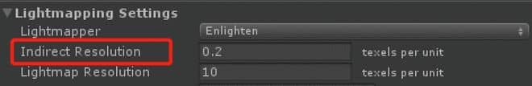

Indirect Resolution因为是决定间接光质量的，并不会影响最后出图的阴影效果，因此在保证间接光质量OK的情况下尽量调小这个值即可。

下图是我们对于不同场合下的建议值。场景中有多种场合的情况下可以统一设置一个参数后再对单独Mesh Renderer进行微调。

Indirect Resolution建议值:

| Scenario | Realtime Resolution       |
| -------- | ------------------------- |
| Indoor   | 2 - 3 texels per unit     |
| Outdoor  | 0.5 -1 texels per unit    |
| Terrains | 0.1 - 0.5 texels per unit |

## Reduce the Lightmap Resolution

因为能直接影响最后Lightmap的像素密度，Lightmap Resolution应该是Lighting窗口中大家调整最频繁的参数了。降低这个值可以直接减少烘焙时间以及lightmap占用内存，而质量降低的代价以阴影质量的降低最为显著。一般建议设为Indirect Resolution的10倍大小。

## Reduce the Amount of Object Calculated

减少需要参与烘焙的物体数量，光照质量不重要的物体使用Lightprobe或者LPPV进行着色。极端需求下可以全场景使用Lightprobe着色。

这里大概说下方案。因为Unity本身不会给Ligtmap static的物体传输Lightprobe数据到GPU，我们可以利用LightProbes.GetInterpolatedProbe(), SphericalHarmonicsL2.Evaluate() API来得到指定位置的插值LightProbe并得到颜色信息，这样我们可以序列化好这些数据（比如用texture）然后在shader中使用。

## Reduce the Reflection Resolution

降低Reflection Probe以及Environment Reflections的分辨率。减少烘焙时间的同时极大降低内存占用。一般建议不要超过256，可以先设置为64，然后再根据效果适当往上调整。

Reflection Resolution memory usage:

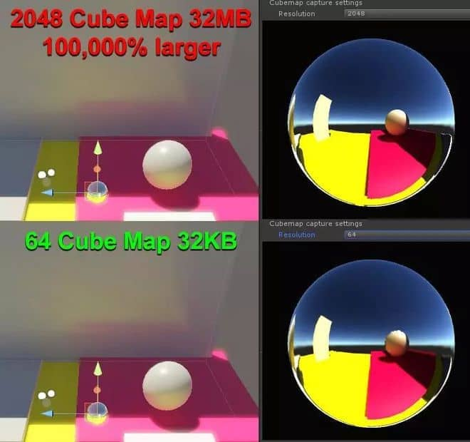

## Reduce Realtime UV Charts

减少Realtime UV Charts的数量，这里说的UV Charts不是最终lightmap的UV Charts，而是烘焙过程中生成的间接光Lightmap的UV Charts。

因为Enlighten的限制，每个Chart至少需要4*4=16个像素填充，因此Chart的数量越多总像素就越多，Cluster的数量也就越多了。所以对于一些形状不规则导致难以用较少的UV chart来展开的物体，例如碎石就应该不参与烘焙过程，使用Lightprobe进行着色。而对于Charts的数量，我们可以通过Scene view中的Global illumination->UV Charts模式来观察。如下图所示，颜色相同的表面使用同一个UV chart。

Realtime UV Charts SceneView:

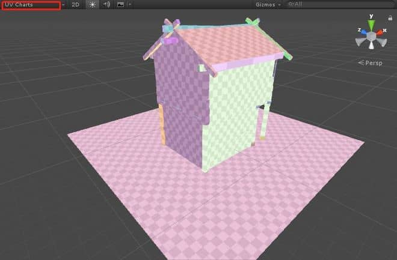

对于那些明显UV Charts太散的Mesh Renderer，我们可以通过勾选Mesh Renderer组件上的Optimize Realtime UVS后调整Max Distance和Max Angle进行修正。这个过程我们需要保证Lighting窗口中的Auto Generate处于勾选状态，Scene view中的可视化才会同步更新。

Adjust Realtime UV Charts:

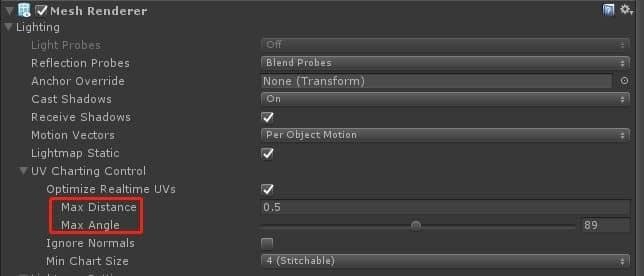

## Reduce Clusters

前面我们做的事情归根究底就是为了减少Cluster的数量，除了上面提到的，我们可以通过Lightmap Parameters中的Cluster Resolution直接控制Cluster的密度。

Cluster Resolution的意思是烘焙中间过程的间接光Lightmap里一个texel可以容纳多少个Cluster。这个值一般建议设为0.3-0.6，同样我们可以通过Scene view中的Clustering模式来可视化Cluster的分布情况，如下图所示，方形的色块就是一个Cluster。

Cluster Scene View:

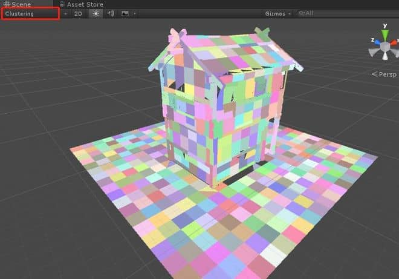

对于场景中间接光照不理想的物体，我们可以在这个模式下观察Cluster的密度是否过低，从而通过对物体的Mesh Renderer单独赋予Lightmap Parameters来调高Cluster Resolution。同理对于Cluster密度过大的地方，我们可以调低其Cluster Resolution。

通过以上所述手段我们尽可能把烘焙的时间流程缩短后，可能会发现某些地方的烘焙质量不够，我们可以通过下面列举的方法进行微调。

## Selective Lightmap Scale

通过Mesh Renderer上的Scale in Lightmap调整特定物体在最终Lightmap中的像素密度。这个选项大家应该经常用到，需要提醒是：这个值并不能影响间接光的质量。因此在感觉物体接收到的间接光质量太差的情况下，调整这个值并不能起作用，这个时候需要调整间接光Lightmap的分辨率，后面会提到这个参数。

物体在最终Lightmap上的像素密度可以通过Scene view中的Baked Lightmap模式并勾选列表最下方的Show Lightmap Resolution来可视化，如下图所示。

Baked Lightmap Resolution:

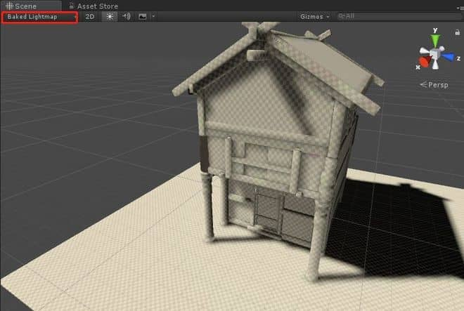

## Increase Indirect Quality Per Object

上面提到对特定物体提高间接光质量不能通过Scale In Lightmap参数，这时需要调整Lightmap Parameters中的Resolution参数。虽然Resolution参数位于Precomputed Realtime GI分类下，但是因为Baked GI也需要使用同一个系统计算间接光分布，因此这些参数直接影响Baked GI中的间接光计算过程。

我们可以通过Scene view中的Global Illumination->UV Charts并勾选列表最下方的Show Lightmap Resolution可视化物体在间接光Lightmap上的像素分布，如下图所示。

间接光Lightmap Resolution:

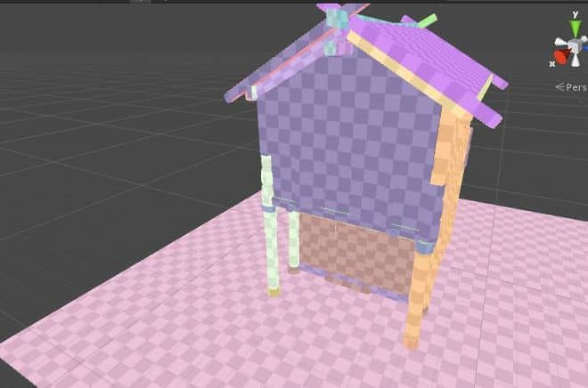

## Play Around With UV Padding(Baked UV)

调整UV Chart间的Padding基本都是为了消除Chart之间的Color bleeding。Padding有二种类型，一种是同一个Mesh Render内的UV Chart间的Padding，一种是不同Mesh Render间Chart的Padding。前者需要通过模型制作软件调整，如果Lightmap UV让Unity生成的话也可以在模型导入选项中通过Pack Margin参数调整。后者通过Lighting窗口中的Lightmap Padding参数调整。

Pack Margin:

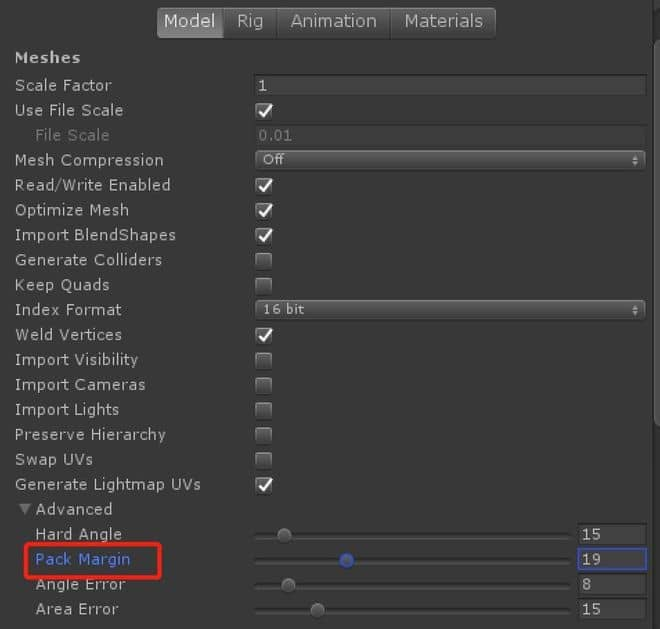

Lightmap Padding:

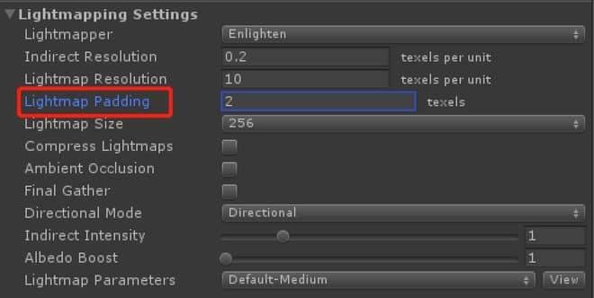

Lightmap Padding

##  Remove the Compress Lightmaps Option

出于优化内存的考虑，一般开发者都会勾选Lighting窗口中的Compress Lightmaps选项。Lightmap压缩会让着色质量下降，反过来我们可以在Lightmap Resolution不高的情况下不勾选这个选项，有可能就能达到我们想要的质量。因为提高Lightmap Resolution的方式对于Lightmap大小的增加量并不可控，可能最后得到的Lightmap size比一开始不压缩的size还要大。因此在微调质量的时候可以尝试反勾选这个选项，也许会有意外的发现。

## Play Around with Baked Shadow Angle

在阴影质量不佳而决定提高Lightmap Resolution之前，我们还可以尝试调整灯光上的Baked Shadow Angle对其烘焙阴影进行一定程度的模糊。参数如下图。

Baked Shadow Angle:

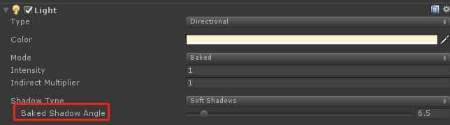

## Blur the Lightmap

除了对阴影进行模糊，我们还能通过调整Lightmap Parameters中的Blur Radius参数对指定物体的lightmap进行整体模糊。在低lightmap精度要求下需要改善质量的时候不妨尝试下调整这个参数。一般建议设置在2-4之间。

Blur Radius:

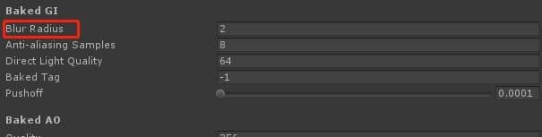

## 小结

最后建议大家看下官方优化Precomputed GI的教程，对于理解烘焙中各种参数的概念比较有帮助。教程地址：

https://unity3d.com/cn/learn/tutorials/topics/graphics/introduction-precomputed-realtime-gi?playlist=17102

更多Unity技术分享尽在Unity官方中文论坛(UnityChina.cn)！