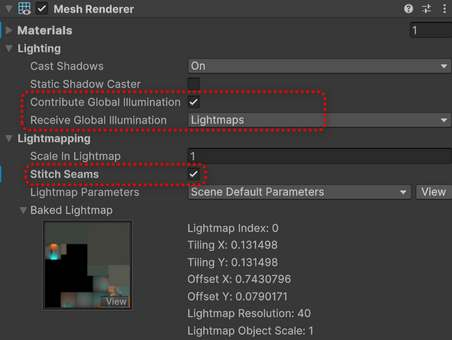

# 视频教程链接

[unity灯光烘焙教程~LIGHTING in Unity_哔哩哔哩_bilibili](https://www.bilibili.com/video/BV1Cb41137Me)

# 全局光照

在灯光烘焙中，GI是指全局光照（Global Illumination），它是一种**模拟光线在场景中传播和反弹**的技术，旨在实现更逼真的光照效果。GI既考虑来自光源的**直接光照**(direct illumination)，也考虑光线在场景中其他物体表面反射后的**间接光照**(indirect illumination)。Unity等3D游戏引擎中，GI的实现方式主要有**预计算实时GI**和**烘焙GI**两种。烘焙GI会将光照信息提前烘焙到光照贴图中，以节省运行时的计算资源。

直接光与间接光：

光线的传播有以下几种情况：

- **Transmission**：传输，指光线的输送过程，如光信号从一种介质传到另一种介质。
- **Reflection**：反射，指光线遇到障碍物后，按一定规律返回的现象。
- **Refraction**：折射，指光线从一种介质进入另一种介质时，由于两种介质的密度或光速不同，光线的传播方向会发生改变的现象。
- **Diffraction**：衍射，指光波在遇到障碍物或通过孔洞时，偏离直线传播路径的现象。
- **Adsorption**：吸附，指物质在固体或液体表面上积聚的过程，与光线传播不直接相关，但在材料科学中常涉及。
- **Scattering**：散射，指光线遇到障碍物后，向四面八方分散的现象。

 

# ENLIGHTEN

Unity中的Enlighten是一套**实时**全局光照解决方案。它不仅能够处理直接来自光源的光照，还能模拟光线在物体表面之间的反弹，从而增加场景的细节和真实感。Enlighten将场景划分为小的表面片段，并确定这些片段对彼此的可见程度。在运行时，它使用**预计算**的可视性信息来近似实时光在场景中的反弹，将结果保存在一组**光照贴图**中，然后使用这些光照贴图将间接光照应用到场景中。适用于**静态**物体、光线复杂度低的场景。支持在实时、烘焙（Baking）、混合三种模式间切换。在Unity 2019.4中，Enlighten系统已被弃用，并由更先进的光照解决方案所替代：渐进式GPU光照贴图（Progressive GPU Lightmapper）和渐进式CPU光照贴图（Progressive CPU Lightmapper）。Progressive Lightmapper（等于baked）就是基于光追的光映射器。

# 静态物体烘焙示例

以下是根据文章开头的教学视频的个人实践。视频教程里是旧版Unity并且采用BuiltIn渲染管线，而下面采用的是Unity6中的URP渲染管线，思路相同只是操作细节有些区别。先展示最终效果（之后是具体流程）：

## 搭建

首先在场景中导入两个模型——围墙和猴头（围墙在Blender里用Cube挤压即可，不能直接删面否则烘焙的时候无法被计算到即便修改材质为双面也不行；猴头可以用Blender自带的低模加上表面细分修改器并应用得到高模并导出），删除默认方向光；然后在墙壁两侧做两个自发光的Plane平面，把除相机外所有GameObject（包括自发光面片）都设为static静态物体。
 

## 模型的设置

猴头和墙壁的模型要勾选Generate Lightmap UVs

 

## 选材

围墙和猴头的材质球可使用URP的BakeLit，默认设置即可；两个自发光面片材质球可以使用URP的SimpleLit，分别给黄色光和蓝色光如下：

 参数解析：

- 自发光面片不需要考虑接受阴影和外界光线，所以用SimpleLit足够。
- 勾选Emission开启自发光，颜色用HDR这样可以让强度Intensity突破1达到发光的效果（后期配上Bloom后处理可以很好的放大这个效果）
- Global Illumination这里用的是Realtime，视频教程里用的是Baked否则墙壁和猴头无法照亮，试了一下其实都可以没区别。

## MeshRenderer设置

猴头和墙壁的MeshRenderer组件设置如下：

 

参数解析：

- 勾选Contribute Global Illumination这样才会加入GI计算
- 视频教程里说勾选了Stitch Seams，可避免猴头左右两边过渡不自然有分界线的现象；试了一下新版中默认是勾选的，而且取消勾选也不会出问题。

## Lighting面板设置

先把环境光设为纯黑，避免其他光线对烘焙的干扰：
 

然后给烘焙调整合适的参数，最后点击Generate Lighting执行烘焙，要等一段时间：

 参数解析：

- Max Lightmap Size视频中建议从1024改成512，这样可以显著减小baked lightmap的大小，提速烘焙
- Lightmap Compression是图片压缩，压缩越明显图片越会有瑕疵。
- Lightmap Padding：如果间距不够大可能出现一个区域被多个lightmap影响导致色彩出问题（视频教程中是猴子耳朵里）可以加大这个值来避免。视频中用的12，实际测试用默认的2也没什么问题。
- Direct Samples和Indirect Samples：样本，即射线ray的数量。越大越费。
- Max Bounces：光线弹跳次数。越大越费。
- Ambient Occlusion：环境光遮蔽，开启之后会有较为明显的缝隙的阴影，默认Max Distance是1，视频里降到0.7；Indirect Contribution也由默认的1降为0.1;Direct Contribute则维持默认的0。总之就是开了也要节省成本。
- Filtering：适当的设置可以减少画面的噪点。
- Indirect Intensity：间接光强度，如果暗就提高这个。
- Albedo Boost：反照率，如果暗也可以提高这个。

## 相机的设置

烘焙之后可以加个Bloom泛光、ToneMapping颜色修正等后处理效果来增加真实感，这需要一些相机的设置：

 

参数解析：

- 勾选Post Processing来开启后处理。
- 开启后处理最好同时开启Anti-aliasing抗锯齿，否则锯齿会有点点穿帮，FXAA性能最好一般都用这个，若追求更好效果可以换TAA。
- 后处理组件Volume添加一下，默认就是Global全局模式，添加Bloom和Tonemapping两个效果，Bloom的默认效果太强可以降一点数值。

