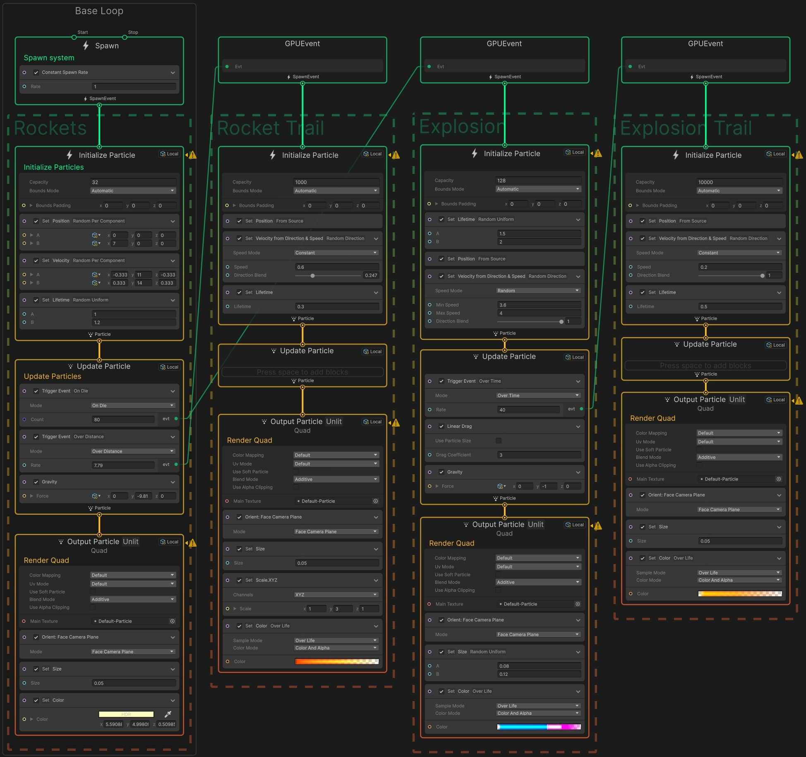

# VFX 设置

在 Edit > Preference > Visual Effect Graph 分页有以下设置：

| 名称                                     | 功能                                                         |
| ---------------------------------------- | ------------------------------------------------------------ |
| Experimental Operators/Blocks            | 启用后，允许在 **VFX Graph** 中使用标记为“实验性”的操作符和模块（如未正式发布的节点）。实验性功能可能不稳定，需谨慎使用。 |
| Show Additional Debug Info               | 在 **Inspector** 中显示 VFX 节点的额外调试信息（例如属性使用和着色器代码）。选中 VFX 节点时，Inspector 会实时更新显示附加信息。 |
| Verbose Mode for Compilation             | 编译 VFX Graph 时，在控制台输出 **详细日志**（包括数据、表达式和生成的着色器信息）。用于排查编译错误或分析着色器生成逻辑。 |
| Experimental Shader Externalization      | 将生成的着色器代码保存为独立文件（与 `.vfx` 资源同级目录），便于直接修改。 风险：外置着色器版本不一致导致失效；需手动维护外置文件，可能破坏 Unity 的自动资源管理。 |
| Generate Shaders with Debug Symbols      | 在生成的着色器中保留调试符号（如 `#line` 指令），支持在 **RenderDoc** 等工具中调试。  修改此选项后，若用户确认（通过 `DisplayReimportPopup()`），会触发 `ForEachVFXInProject` 重新导入所有 VFX 资源，确保调试符号生效。 重新导入可能耗时，尤其是项目中有大量 VFX 资源时。 |
| Force Compilation in Edition Mode        | 强制在非编辑状态下（如播放模式或运行游戏时）使用 **未优化的编辑器版本着色器**，而非优化后的运行时版本。 **用途**: 确保在非编辑模式下也能实时调试 VFX Graph 的修改。代价：编辑器版本着色器性能较差，可能导致帧率下降 |
| Main Camera Fallback                     | 定义在编辑器中使用 `MainCamera` 操作符或模块时的 **后备摄像机来源**（如场景中的主摄像机或默认编辑器摄像机）。 **类型**: 枚举 (`VFXMainCameraBufferFallback`)，支持多种后备策略。 |
| Show Target in Shader Graph (Deprecated) | 在 Shader Graph 的 `Active Targets` 下拉列表中显示 `VisualEffect` 目标。 **现状**: 官方标记为废弃，未来版本可能移除。 |
| Authoring Prewarm Step Count Per Second  | 定义在编辑器中预览 VFX 时，每秒模拟的 **预热步数**（用于加速粒子系统初始状态的生成）。  **输入类型**: 整数（`IntField`）。 **建议值**: 通常设置为 30-60（匹配常见帧率），过高可能导致编辑器卡顿。 |
| Authoring Prewarm Maximum Time           | 限制 VFX 在编辑器中的 **最大预热时间**（单位：秒），防止复杂粒子系统无限预热。 **输入类型**: 浮点数（`FloatField`）。 **建议值**: 通常设置为 1-5 秒，根据粒子复杂度调整。 |

**使用建议**

- **调试阶段**: 启用 `Verbose Mode` 和 `Debug Symbols`，但发布前关闭。
- **实验性功能**: 仅在独立测试项目中使用 `Experimental Operators/Blocks` 和 `Shader Externalization`。
- **性能敏感场景**: 关闭 `Force Compilation in Edition Mode` 和多线程/实例化（除非已验证稳定性）。

# Unity6 官方教学示例（油管视频）

- 官方示例模板介绍：[VFX Graph Learning Templates | Tutorial](https://www.youtube.com/watch?v=DKVdg8DsIVY)
- 视频已备份到网盘：[油管 Unity 官方教学](https://pan.baidu.com/s/1uHQO1zUSWdwCyRB_LYcFmg?pwd=at8k)


## 视频字幕翻译（请结合视频阅读）

**概述**
本学习模板是一套专为探索 VFX Graph 核心概念设计的资产集合。我们已同步更新 Unity 6 版本的《VFX 艺术家手册》，涵盖这些新增的示例图表（可通过描述区链接获取免费指南）。本视频将带您深入解析这些模板，演示如何运用它们构建下一代视觉特效。

### 项目初始化

- **管线兼容性**
   VFX Graph 同时支持：

   - Universal Render Pipeline (URP)
   - High Definition Render Pipeline (HDRP)
     *适用场景*：
     ✓ 主机/PC 平台的 3A 级特效
     ✓ 支持 Compute Shader 的移动设备（如《Happy Harvest》和《Gem Hunter》匹配示例）

- **模板导入流程**

   a. 通过 Unity Hub 创建 URP 模板项目  
   b. Package Manager 中安装 VFX Graph 包  
   c. 在 Samples 选项卡导入 Learning Templates  
   d. 项目 Assets 目录下自动生成 "Samples" 文件夹

### 场景导航系统

- **基础操作**
   - 打开对应渲染管线的场景文件（如 URP_VFX_LearningTemplates）
   - 导入时需同步加载 TextMesh Pro 资源
   - 层级视图(Hierarchy)将加载特效展示系统
- **交互控制**
   - 播放模式：使用 WASD 键控制摄像机移动  
   - 快速浏览：  
     - 选中 "Samples Showcase" 对象  
     - 在 Inspector 面板使用导航控件  
     - 通过下拉菜单直接选择特定特效

### 核心模板解析

#### 上下文数据流系统

*工作流*：

- **Spawn Context**

   - 接收 OnPlay/OnStop 事件控制粒子生成
   - Spawn State Operator 提供当前状态参数（仅限本上下文使用）

- **Initialize Context**

   ```c
   // 示例：设置粒子初始属性
   Set Attribute("lifetime", spawnState.duration + loopDelay);
   ```

- **Update Context**

   - 每帧处理粒子物理运算
   - 可通过 Set Angle Block 实现轴向旋转（如示例中的硬币翻转特效）

- **Output Context**

   - 支持多渲染器并行输出（Mesh/Quad/Decal）

####  跨管线适配方案

- 同时导入 URP 和 HDRP 包  
- 右键输出上下文选择 "Duplicate with Edges"  
- 转换输出类型：  
   - URP Lit Quad ↔ HDRP Lit Quad

*注意*：运行时仅渲染当前管线兼容的上下文

### 高级功能实现

### 精灵表动画系统

*配置步骤*：

- 指定主纹理及行列数（Flipbook Size）
- 输出上下文选择 Flipbook 模式
- 控制方案对比：

| 控制方式     | 实现方案                           | 适用场景           |
| :----------- | :--------------------------------- | :----------------- |
| **手动控制** | 通过 VFX Time Operator 递增 textIndex | 数字计数等离散动画 |
| **自动播放** | 使用 Flipbook Player Block 设置帧率  | 连续火焰动画       |
| **运动增强** | 启用 Flipbook Motion Vectors        | 烟雾等平滑过渡     |

####  蒙皮网格交互系统

- 定义自定义属性：  
   vector3 skinCoord = (triangleID, barycentricX, barycentricY)  
- 初始化阶段：  
   - Set Position Skin Mesh 节点分布羽毛  
   - Sample Skin Mesh 按 UV 区域剔除粒子  
- 更新阶段：  
   - Set Position Skin Mesh 使粒子跟随骨骼变形

#### SDF 碰撞系统

*配置流程*：

- 使用 SDF Bake Tool 烘焙手部网格
- 在 Collision Shape Block 选择 Signed Distance Field 类型
- 引用烘焙好的 SDF 资源
- 调整反弹系数(Bounce)和粗糙度(Roughness)

*实时效果*：粒子沿动画手部表面碰撞，触发 GPU 事件生成次级特效

### 性能优化策略

- **边界剔除**

   - 在 Initialize Context 设置 Bounds
   - 通过 Gizmo 预览影响范围

- **容量控制**

   ```c#
   // 粒子系统容量设置
   capacity = 1024;  // 平衡视觉效果与内存占用
   ```

- **LOD 策略**

   - 根据摄像机距离动态切换输出质量
   - 通过 GPU Event 触发简化版特效

### 完整特效案例

#### 粒子轨迹带系统

蘑菇生长特效实现：

- 菌盖：Mesh 粒子输出
- 菌柄：Particle Strips 专用上下文链
- 动态控制：
   - Strip Capacity = 8
   - Particles Per Strip = 32

#### 耳机线物理模拟

1. 插头部分使用标准 Mesh 粒子
2. 线缆部分：
   - 应用 Spline 路径跟随
   - Update Strip Context 添加抖动噪声(Noise)
   - 通过 Set Angular Velocity 实现自然摆动

### 扩展资源

- 官方文档：https://unity.com/vfx-graph

  提示：所有学习模板持续更新，建议通过 Package Manager 定期检查版本更新。遇到技术问题可提交 Bug Reporter 并附加 VFX Graph 日志文件。


# 烟花效果

视频已备份到网盘：[油管 Unity 官方教学](https://pan.baidu.com/s/1uHQO1zUSWdwCyRB_LYcFmg?pwd=at8k)

效果如图：

 

布置如下（还要开启 Bloom 后处理）：

 
