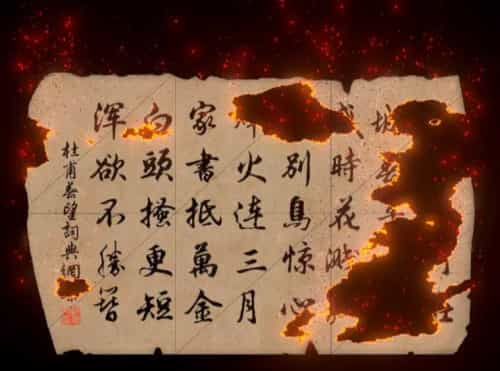

# 油管/B站相关

海量教程：

油管EricWang：[Unity VFX Graph：Collision Edge Line(SDF)](https://www.youtube.com/@EricWang0110/videos?view=0&sort=dd&shelf_id=1)

B站搬运：[漂游的秋叶视频专辑-漂游的秋叶视频合集-哔哩哔哩视频](https://space.bilibili.com/355702951/lists?sid=4568646&spm_id_from=333.788.0.0)

# VFX常用操作

1. 拖拽线+Alt 会生成Property。
2. 双击节点标题头，可以最小化节点。

# VFX 设置

在 Edit > Preference > Visual Effect Graph 分页有以下设置：

| 名称                                     | 功能                                                         |
| ---------------------------------------- | ------------------------------------------------------------ |
| Experimental Operators/Blocks            | 启用后，允许在 **VFX Graph** 中使用标记为“实验性”的操作符和模块（如未正式发布的节点）。实验性功能可能不稳定，需谨慎使用。 |
| Show Additional Debug Info               | 在 **Inspector** 中显示 VFX 节点的额外调试信息（例如属性使用和着色器代码）。选中 VFX 节点时，Inspector 会实时更新显示附加信息。 |
| Verbose Mode for Compilation             | 编译 VFX Graph 时，在控制台输出 **详细日志**（包括数据、表达式和生成的着色器信息）。用于排查编译错误或分析着色器生成逻辑。 |
| Experimental Shader Externalization      | 将生成的着色器代码保存为独立文件（与 `.vfx` 资源同级目录），便于直接修改。 风险：外置着色器版本不一致导致失效；需手动维护外置文件，可能破坏 Unity 的自动资源管理。 |
| Generate Shaders with Debug Symbols      | 在生成的着色器中保留调试符号（如 `#line` 指令），支持在 **RenderDoc** 等工具中调试。  修改此选项后，若用户确认（通过 `DisplayReimportPopup()`），会触发 `ForEachVFXInProject` 重新导入所有 VFX 资源，确保调试符号生效。 重新导入可能耗时，尤其是项目中有大量 VFX 资源时。 |
| Force Compilation in Edition Mode        | 强制在非编辑状态下（如播放模式或运行游戏时）使用 **未优化的编辑器版本着色器**，而非优化后的运行时版本。 **用途**: 确保在非编辑模式下也能实时调试 VFX Graph 的修改。代价：编辑器版本着色器性能较差，可能导致帧率下降 |
| Main Camera Fallback                     | 定义在编辑器中使用 `MainCamera` 操作符或模块时的 **后备摄像机来源**（如场景中的主摄像机或默认编辑器摄像机）。 **类型**: 枚举 (`VFXMainCameraBufferFallback`)，支持多种后备策略。 |
| Show Target in Shader Graph (Deprecated) | 在 Shader Graph 的 `Active Targets` 下拉列表中显示 `VisualEffect` 目标。 **现状**: 官方标记为废弃，未来版本可能移除。 |
| Authoring Prewarm Step Count Per Second  | 定义在编辑器中预览 VFX 时，每秒模拟的 **预热步数**（用于加速粒子系统初始状态的生成）。  **输入类型**: 整数（`IntField`）。 **建议值**: 通常设置为 30-60（匹配常见帧率），过高可能导致编辑器卡顿。 |
| Authoring Prewarm Maximum Time           | 限制 VFX 在编辑器中的 **最大预热时间**（单位：秒），防止复杂粒子系统无限预热。 **输入类型**: 浮点数（`FloatField`）。 **建议值**: 通常设置为 1-5 秒，根据粒子复杂度调整。 |

**使用建议**

- **调试阶段**: 启用 `Verbose Mode` 和 `Debug Symbols`，但发布前关闭。
- **实验性功能**: 仅在独立测试项目中使用 `Experimental Operators/Blocks` 和 `Shader Externalization`。
- **性能敏感场景**: 关闭 `Force Compilation in Edition Mode` 和多线程/实例化（除非已验证稳定性）。

# Unity6 官方教学示例（油管视频）

- 官方示例模板介绍：[VFX Graph Learning Templates | Tutorial](https://www.youtube.com/watch?v=DKVdg8DsIVY)
- 视频已备份到网盘：[油管 Unity 官方教学](https://pan.baidu.com/s/1uHQO1zUSWdwCyRB_LYcFmg?pwd=at8k)
- 示例场景的汉化补丁（放到场景根目录即可）：[VFX_Templates_ChinesePack.prefab](./VFX_Templates_ChinesePack.prefab)


## 视频字幕翻译（请结合视频阅读）

**概述**
本学习模板是一套专为探索 VFX Graph 核心概念设计的资产集合。我们已同步更新 Unity 6 版本的《VFX 艺术家手册》，涵盖这些新增的示例图表（可通过描述区链接获取免费指南）。本视频将带您深入解析这些模板，演示如何运用它们构建下一代视觉特效。

### 项目初始化

- **管线兼容性**
   VFX Graph 同时支持：

   - Universal Render Pipeline (URP)
   - High Definition Render Pipeline (HDRP)
     *适用场景*：
     ✓ 主机/PC 平台的 3A 级特效
     ✓ 支持 Compute Shader 的移动设备（如《Happy Harvest》和《Gem Hunter》匹配示例）

- **模板导入流程**

   a. 通过 Unity Hub 创建 URP 模板项目  
   b. Package Manager 中安装 VFX Graph 包  
   c. 在 Samples 选项卡导入 Learning Templates  
   d. 项目 Assets 目录下自动生成 "Samples" 文件夹

### 场景导航系统

- **基础操作**
   - 打开对应渲染管线的场景文件（如 URP_VFX_LearningTemplates）
   - 导入时需同步加载 TextMesh Pro 资源
   - 层级视图(Hierarchy)将加载特效展示系统
- **交互控制**
   - 播放模式：使用 WASD 键控制摄像机移动  
   - 快速浏览：  
     - 选中 "Samples Showcase" 对象  
     - 在 Inspector 面板使用导航控件  
     - 通过下拉菜单直接选择特定特效

### 核心模板解析

#### 上下文数据流系统

*工作流*：

- **Spawn Context**

   - 接收 OnPlay/OnStop 事件控制粒子生成
   - Spawn State Operator 提供当前状态参数（仅限本上下文使用）

- **Initialize Context**

   ```c
   // 示例：设置粒子初始属性
   Set Attribute("lifetime", spawnState.duration + loopDelay);
   ```

- **Update Context**

   - 每帧处理粒子物理运算
   - 可通过 Set Angle Block 实现轴向旋转（如示例中的硬币翻转特效）

- **Output Context**

   - 支持多渲染器并行输出（Mesh/Quad/Decal）

####  跨管线适配方案

- 同时导入 URP 和 HDRP 包  
- 右键输出上下文选择 "Duplicate with Edges"  
- 转换输出类型：  
   - URP Lit Quad ↔ HDRP Lit Quad

*注意*：运行时仅渲染当前管线兼容的上下文

### 高级功能实现

### 精灵表动画系统

*配置步骤*：

- 指定主纹理及行列数（Flipbook Size）
- 输出上下文选择 Flipbook 模式
- 控制方案对比：

| 控制方式     | 实现方案                           | 适用场景           |
| :----------- | :--------------------------------- | :----------------- |
| **手动控制** | 通过 VFX Time Operator 递增 textIndex | 数字计数等离散动画 |
| **自动播放** | 使用 Flipbook Player Block 设置帧率  | 连续火焰动画       |
| **运动增强** | 启用 Flipbook Motion Vectors        | 烟雾等平滑过渡     |

####  蒙皮网格交互系统

- 定义自定义属性：  
   vector3 skinCoord = (triangleID, barycentricX, barycentricY)  
- 初始化阶段：  
   - Set Position Skin Mesh 节点分布羽毛  
   - Sample Skin Mesh 按 UV 区域剔除粒子  
- 更新阶段：  
   - Set Position Skin Mesh 使粒子跟随骨骼变形

#### SDF 碰撞系统

*配置流程*：

- 使用 SDF Bake Tool 烘焙手部网格
- 在 Collision Shape Block 选择 Signed Distance Field 类型
- 引用烘焙好的 SDF 资源
- 调整反弹系数(Bounce)和粗糙度(Roughness)

*实时效果*：粒子沿动画手部表面碰撞，触发 GPU 事件生成次级特效

### 性能优化策略

- **边界剔除**

   - 在 Initialize Context 设置 Bounds
   - 通过 Gizmo 预览影响范围

- **容量控制**

   ```c#
   // 粒子系统容量设置
   capacity = 1024;  // 平衡视觉效果与内存占用
   ```

- **LOD 策略**

   - 根据摄像机距离动态切换输出质量
   - 通过 GPU Event 触发简化版特效

### 完整特效案例

#### 粒子轨迹带系统

蘑菇生长特效实现：

- 菌盖：Mesh 粒子输出
- 菌柄：Particle Strips 专用上下文链
- 动态控制：
   - Strip Capacity = 8
   - Particles Per Strip = 32

#### 耳机线物理模拟

1. 插头部分使用标准 Mesh 粒子
2. 线缆部分：
   - 应用 Spline 路径跟随
   - Update Strip Context 添加抖动噪声(Noise)
   - 通过 Set Angular Velocity 实现自然摆动

### 扩展资源

- 官方文档：[What's new in version 17 / Unity 6 | Visual Effect Graph | 17.0.4](https://docs.unity3d.com/Packages/com.unity.visualeffectgraph@17.0/manual/whats-new-17.html)

  提示：所有学习模板持续更新，建议通过 Package Manager 定期检查版本更新。遇到技术问题可提交 Bug Reporter 并附加 VFX Graph 日志文件。


# 烟花效果

视频已备份到网盘：[油管 Unity 官方教学](https://pan.baidu.com/s/1uHQO1zUSWdwCyRB_LYcFmg?pwd=at8k)

## 效果如图

 

## 图布局如下

注意：还要开启 Bloom 全局后处理 


# 蒙皮网格粒子效果

参考自：[VFX 分解和溶解效果教程_哔哩哔哩_bilibili](https://www.bilibili.com/video/BV1s4BmY5Eeh)

（非必需）ShaderGraph部分的进一步溶解效果：[3D模型版溶解（Alpha Clip版 ）](../Shader Graph示例汇总/Shader Graph示例汇总.md#3D模型版溶解（Alpha Clip版 ）)

## 效果

 

## 图布局

注意：要**开启Mesh的读权限**（勾选read/write），否则粒子不会按网格分布来生成，只会从一个点生成。

 

> 如果 Block ：`Set Position Mesh Skinned Mesh` 的 `Skinned Transform` 选 `Apply Local Root Transform` ，那么可以省略 Properties：`Transform` ，但效果经测试有偏差，不够精准。还是推荐使用 Properties定义 + VFX Property Binder组件（见后文）来做。
>
> 可以把图中上下文复制一份，形成新的Output，降一下颜色亮度透明度和速度来营造燃烧烟雾效果，控制一下渲染顺序（见后文）。
>
> 延迟与循环次数：可以选择在效果开始前加入延迟，选中Spawn（Content），将其Delay Mode设为Before Loop，然后设定一个数值即可。另外Loop Count可酌情由Infinite（无限）改为Constant（常数）并设为1，这样特效就会从持续特效变成单次特效。
>
> Update Particle：可以进一步添加湍流Block：Turbulence，可以增加粒子运动的变化。

## Inspector设置

### Component

 

### Asset

如果有多个Output可调整渲染顺序

 


# 溶解边缘燃烧粒子效果

参考教学：[unity溶解边缘发射粒子_哔哩哔哩_bilibili](https://www.bilibili.com/video/BV1DARYYHEc7)

（必需）ShaderGraph部分的设置：[2&3D模型版溶解](../Shader Graph示例汇总/Shader Graph示例汇总.md#2&3D模型版溶解)

Blender制作高面数平面 (目前已不需要高面数计算点位)：[制作均匀的细分平面](../../工具/Blender学习/Blender学习.md#制作均匀的细分平面)

效果及面数（优化后）展示：

 

图布局：

 

> 注意模型开启读取权限
>
> 该粒子特效会自己创建Mesh使用指定shader（利用了Output Mesh上下文节点）
>
> 利用了湍流Attribute节点（Turbulence）来做扰动

# 水平定向溶解边缘粒子效果

**效果**：

 

**图布局**：

 

**Property变量**：

- Mesh，类型Mesh
- Transform， 类型Transform
- Force，类型Vector3
- MaxY， 类型float，代表模型高度，默认2.6，范围0到10
- DissolveAmount，类型float，范围0到1，从脚底到头顶
- EdgeThin，类型float，范围0.01到0.2，代表水平裁切边缘厚度

**ShaderGraph的部分参见**：

[水平定向溶解](../Shader Graph示例汇总/Shader Graph示例汇总.md#水平定向溶解)

**题外话**

参考油管EricWang视频  [Unity VFX Graph：Model Edges Bursts](https://www.youtube.com/watch?v=xxLg8Xw7S-c)

# 数值Debug调试

有时想在运行过程中查看某个节点的输出数值，但无法直接看到，所以我设计了 **在游戏场景显示特效数字** 的子图（基于 Flipbook 效果），效果如下：

 

> 会在游戏场景显示白色的 “12”

- Enable ：控制调式开关。
- InputFloat：输入数字，支持显示十位、个位数字，正数为白色，负数为粉色。
- Tex5x2：用于显示数字的贴图，默认尺寸 512*256，会按照 **5列2行** 来做切分，可自行切换样式。
- YOffset：可以纵向偏移显示数字，防止文字被粒子效果本身遮挡。
- Size：调整文字大小，区间0.03到3

具体布局如下（也可以直接下载 [VfxDebug_Unity6000_0_47.unitypackage](VfxDebug_Unity6000_0_47.unitypackage) )：

 

# 获取UI的Mesh来做UI粒子特效

 

让粒子特效附着在UI上展示，其实和前文提到的方法是一样的，都是利用 SampleMesh 节点，难点就在于**Mesh怎么获取，以及三角面数量的计算**。

Text组件（和Image、RawImage组件同理）无法直接拿到Mesh，但可以做派生类覆写OnPopulateMesh方法，构建一份Mesh副本给粒子系统使用。

TextMeshPro 组件的Mesh可以直接通过公有属性拿到，但是它只会随文字增多重构Mesh，文字减少它通常是不做重构的（而是控制网格显隐），这是一种减少Mesh重构的优化。然而对于粒子系统，不能及时重构会影响三角面数量的实时获取，导致部分粒子不能附着于Mesh表面。解决方法：需要监听 TMPro_EventManager 的 TEXT_CHANGED_EVENT 事件，从C#端告知粒子系统端当前可见网格的粒子数。

**以下是代码展示**：

**TextParticle.cs**（类似的还可以派生Image、RawImage）:

```csharp
using UnityEngine;
using UnityEngine.UI;
[DisallowMultipleComponent]
[RequireComponent(typeof(SyncUIMesh))]
public class TextParticle : Text
{
    private SyncUIMesh _syncUIMesh;
    public SyncUIMesh syncUIMesh
    {
        get
        {
            if (_syncUIMesh == null)
            {
                _syncUIMesh = GetComponent<SyncUIMesh>();
            }
            return _syncUIMesh;
        }
    }

    protected override void OnPopulateMesh(VertexHelper vh)
    {
        base.OnPopulateMesh(vh);
        syncUIMesh.RefreshMeshData(vh);
    }
}
```

**SyncUIMesh.cs **同步组件：

```csharp
using TMPro;
using UnityEngine;
using UnityEngine.UI;
using UnityEngine.VFX;
[DisallowMultipleComponent]
public class SyncUIMesh : MonoBehaviour
{
    [Tooltip("粒子特效，建议做成子物体")]
    public VisualEffect visualEffect;
    [Tooltip("粒子密度")]
    public float ParticleRate = 5;
    int propertyID_Mesh = -1;
    int propertyID_Rate = -1;
    int propertyID_Triangle = -1;
    private Mesh _cachedMesh;
    public Mesh UIMesh => _cachedMesh;

    /// <summary>
    /// 拷贝源头Mesh数据到本地
    /// <param name="vh"></param>
    public void RefreshMeshData(VertexHelper vh)
    {
        if(_cachedMesh == null)
        {
            _cachedMesh = new Mesh();
            _cachedMesh.name = "DynamicTextMesh";
        }
        vh.FillMesh(_cachedMesh);
        ExcuteSync();
    }

    [ContextMenu("Sync OnStart")]
    void Start()
    {
        OnStart_TextMeshPro();
        ExcuteSync();
    }
    void OnDestroy()
    {
        if(_cachedMesh != null)
        {
            _cachedMesh.Clear();
            DestroyImmediate(_cachedMesh);
            _cachedMesh = null;
        }
        OnDestroy_TextMeshPro();
    }

    private void ExcuteSync()
    {
        if(UIMesh == null)return;

        if(propertyID_Mesh == -1)
        {
            propertyID_Mesh = Shader.PropertyToID("UIMesh");
        }
        if(propertyID_Rate == -1)
        {
            propertyID_Rate = Shader.PropertyToID("UIRate");
        }
        
        if(visualEffect != null)
        {
            visualEffect.SetMesh(propertyID_Mesh, UIMesh);
            visualEffect.SetFloat(propertyID_Rate, ParticleRate);
        }
    }

    #region TextMeshPro相关
    private TextMeshProUGUI textMeshPro;
    bool isRegTMPEvent = false;
    private void OnStart_TextMeshPro()
    {
        textMeshPro = GetComponent<TextMeshProUGUI>();
        if(textMeshPro != null)
        {
            _cachedMesh = textMeshPro.mesh;
            TMPro_EventManager.TEXT_CHANGED_EVENT.Remove(TextMeshProHandler);
            TMPro_EventManager.TEXT_CHANGED_EVENT.Add(TextMeshProHandler);
            isRegTMPEvent = true;
        }
    }
    private void OnDestroy_TextMeshPro()
    {
        if(isRegTMPEvent)
        {
            TMPro_EventManager.TEXT_CHANGED_EVENT.Remove(TextMeshProHandler);
            isRegTMPEvent = false;
        }
    }
    private void TextMeshProHandler(Object obj)
    {
        if(textMeshPro == null)return;
        if(obj != textMeshPro)return;
        ExcuteSync();
        if(propertyID_Triangle == -1)
        {
            propertyID_Triangle = Shader.PropertyToID("UITriangle");
        }
        if(visualEffect != null)
        {
            visualEffect.SetFloat(propertyID_Triangle, textMeshPro.textInfo.characterCount * 2);
        }
    }
    #endregion
}
```

而**粒子系统**可以作为UI元素的子物体，Transform做一下Reset，布局如下：


- UIMesh 是获取到的网格，由 Csharp端传值。
- UITriangle 仅控制TextMeshPro时需要使用，从Csharp端传值。
- TextMeshPro 是个 bool 值，用来表示要走**TMP获取Mesh逻辑**还是**其他组件获取Mesh逻辑**。
- 像以往那样，Square两个值（上图左下角）都是 0~1 的随机范围，不曾改变。
