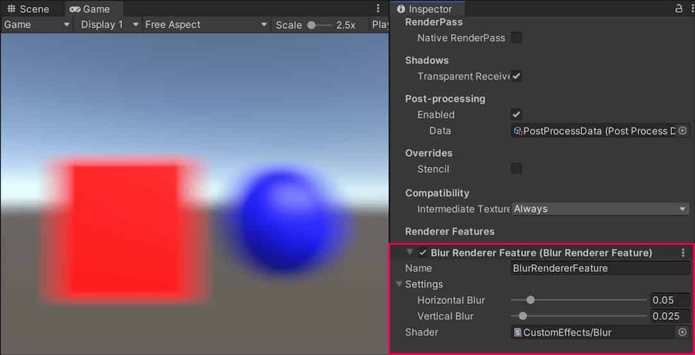
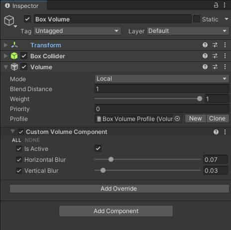
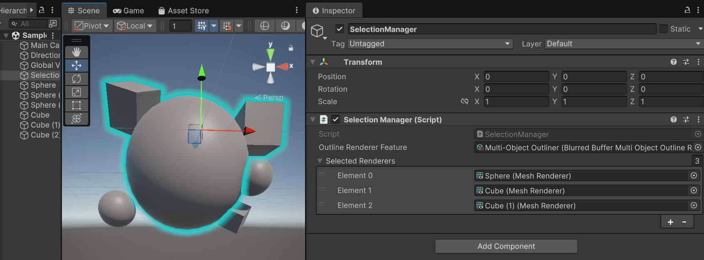
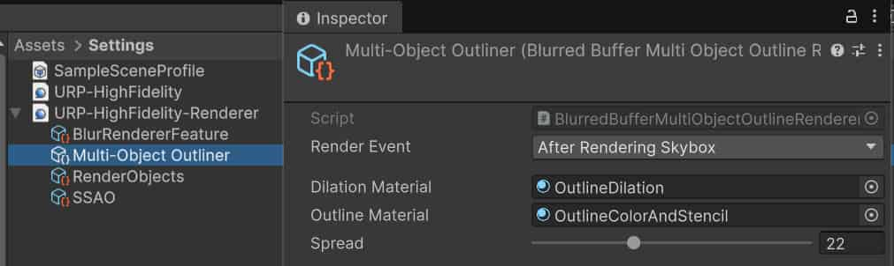

# Unity6（URP17）的一个完整的 Scriptable Renderer Feature模糊示例

本文介绍了如何给URP渲染管线创建一个完整的 [Scriptable Renderer Feature](https://docs.unity3d.com/Packages/com.unity.render-pipelines.universal@17.0/manual/renderer-features/scriptable-renderer-features/intro-to-scriptable-renderer-features.html) 。注意：相比于兼容模式，这个方式在Unity6中更为推荐，兼容模式已过时停止维护。

兼容模式的开启方式：**Compatibility Mode (Render Graph Disabled)** in URP graphics settings (**Project Settings** > **Graphics**), 关闭兼容模式（默认关闭）即相当于打开Render Graph。当开启Render Graph功能时，菜单栏 Window>Analysis>Render Graph Viewer菜单选项就会出现，它可以打开一个可视化渲染流程图，是Unity6 的新特色。自定义Renderer Feature也都开始用Render Graph的API，具体示例工程可见：[Unity-Technologies/Per-Object_Outline_RenderGraph_RendererFeature_Example: Demonstration of creating an Outline Effect for Render Graph using Unity 6, which allows per-object renderer selection. (github.com)](https://github.com/Unity-Technologies/Per-Object_Outline_RenderGraph_RendererFeature_Example)

本文的另一个解释：[Introduction of Render Graph in the Universal Render Pipeline (URP) - Unity Engine - Unity Discussions](https://discussions.unity.com/t/introduction-of-render-graph-in-the-universal-render-pipeline-urp/930355)

里面提到，创建新的后处理renderFeature和Volume只需：Assets菜单栏*Create > Rendering > URP Post-processing Effect (Renderer Feature with Volume)* 

## 示例实现概述

本文实现了一个custom Renderer Feature，它使用 [自定义 Render Passes](https://docs.unity3d.com/Packages/com.unity.render-pipelines.universal@17.0/manual/renderer-features/intro-to-scriptable-render-passes.html) 来添加一个输出到相机的模糊效果

该实现由以下部分组成:

- 每帧都会排入队列执行的 ScriptableRendererFeature实例 及 ScriptableRenderPass 实例
- 一个ScriptableRenderPass实例执行以下步骤：
  - 使用RenderTextureDescriptor API创建一个临时渲染纹理（英文叫temporary render texture）
  - 使用TextureHandle和Blitter API将自定义shader里的两个通道应用到相机输出

## 创建示例场景和游戏对象

请以如下方式设置项目：

1. 创建一个新场景。
2. 创建两个3D物体: 一个立方体叫 cube, 一个球叫sphere。
3. 用Lit Shader创建两个材质球，分别设置颜色为蓝色和红色。
4. 将这两个材质分配给cube和sphere。
5. 放置一个相机，使其视野中有cube和sphere
6. 在URP Asset（universal render pipeline asset）上, 把 **Quality** > **Anti Aliasing (MSAA)** 设为 **Disabled**. 此步骤仅为了简化示例实现。

示例场景应该像下图这个样子：


## 创建一个scriptable Renderer Feature 并添加给Universal Renderer

1. 创建一个C#脚本并命名为 BlurRendererFeature.cs
2. 写成如下样子：

```C#
using System.Collections;
using System.Collections.Generic;
using UnityEngine;
using UnityEngine.Rendering.Universal;

public class BlurRendererFeature : ScriptableRendererFeature
{
    //Create: Unity calls this method on the following events:
    //When the Renderer Feature loads the first time.
    //When you enable or disable the Renderer Feature.
    //When you change a property in the inspector of the Renderer Feature.
    public override void Create()
    {

    }
	//Unity calls this method every frame, once for each camera. This method lets you inject instances into the scriptable Renderer.`ScriptableRenderPass`
    public override void AddRenderPasses(ScriptableRenderer renderer,
        ref RenderingData renderingData)
    {

    }
}
```

### 把Renderer Feature 添加给 Universal Renderer asset

选中Universal Renderer asset，点击Add Renderer Feature按钮，选择 BlurRendererFeature即可。参考自 [How to add a Renderer Feature to a Renderer](https://docs.unity3d.com/Packages/com.unity.render-pipelines.universal@17.0/manual/urp-renderer-feature-how-to-add.html).

## 创建scriptable Render Pass

下面详细讲解如何创建一个 scriptable Render Pass 并且把它的实例插入到 scriptable Renderer中.

1. 创建一个C#脚本并命名为BlurRenderPass.cs。
2. 写成如下样子：

```C#
using UnityEngine.Rendering;
using UnityEngine.Rendering.RenderGraphModule;
using UnityEngine.Rendering.Universal;

public class BlurRenderPass : ScriptableRenderPass
{
    //This method adds and configures render passes in the render graph. This process includes declaring render pass inputs and outputs, but does not include adding commands to command buffers. Unity calls this method every frame, once for each camera.
    public override void RecordRenderGraph(RenderGraph renderGraph,
    ContextContainer frameData)
    {
        
    }
}
```

## 实现自定义render pass的settings

下面演示如何实现自定义模糊 render pass的 settings

1. 此示例的 Renderer Feature 使用的 [shader](https://docs.unity3d.com/Packages/com.unity.render-pipelines.universal@17.0/manual/renderer-features/create-custom-renderer-feature.html#example-shader) 用了横向、纵向两个Pass来处理模糊。要让用户控制每个通道的模糊值，BlurRendererFeature.cs要添加如下代码：

   ```C#
   [Serializable]
   public class BlurSettings
   {
       [Range(0,0.4f)] public float horizontalBlur;
       [Range(0,0.4f)] public float verticalBlur;
   }
   ```

2. 并在BlurRendererFeature类中声明如下字段：

   ```C#
   [SerializeField] private BlurSettings settings;
   [SerializeField] private Shader shader;
   private Material material;
   private BlurRenderPass blurRenderPass;
   ```

3. 在BlurRenderPass类中,同样地添加settings、material字段，以及BlurRenderPass构造函数。

   ```C#
   private BlurSettings defaultSettings;
   private Material material;
   
   public BlurRenderPass(Material material, BlurSettings defaultSettings)
   {
       this.material = material;
       this.defaultSettings = defaultSettings;
   }
   ```

4. BlurRenderPass的构造函数中允许您指定渲染纹理的属性，例如宽度、高度和格式。存储到RenderTextureDescriptor中。

   ```C#
   using UnityEngine;
   
   private RenderTextureDescriptor blurTextureDescriptor;
   
   public BlurRenderPass(Material material, BlurSettings defaultSettings)
   {
       this.material = material;
       this.defaultSettings = defaultSettings;
   
       blurTextureDescriptor = new RenderTextureDescriptor(Screen.width, Screen.height,
       RenderTextureFormat.Default, 0);
   }
   ```

5. 在BlurRenderPass类中，声明用于存储render pass 输入数据的类PassData。render graph用此类做数据当作参数传递给渲染函数。 该字段存储对临时输入纹理的引用。

   ```C#
   private class PassData
   {
       internal TextureHandle src;
       internal Material material;
   }
   ```

6. 在RecordRenderGraph方法中, 从参数创建用于存储实例的变量。包含URP使用的所有纹理引用，包括camera的active color和depth texture。

   ```C#
   UniversalResourceData resourceData = frameData.Get<UniversalResourceData>();
   ```

7. 声明与shader properties所对应的C#变量。

   ```C#
   private static readonly int horizontalBlurId = Shader.PropertyToID("_HorizontalBlur");
   private static readonly int verticalBlurId = Shader.PropertyToID("_VerticalBlur");
   private const string k_BlurTextureName = "_BlurTexture";
   private const string k_VerticalPassName = "VerticalBlurRenderPass";
   private const string k_HorizontalPassName = "HorizontalBlurRenderPass";
   ```

8. 在RecordRenderGraph方法中，声明TextureHandle类型字段以存储输入&输出纹理的引用。

   ```C#
   TextureHandle srcCamColor = resourceData.activeColorTexture;
   TextureHandle dst = UniversalRenderer.CreateRenderGraphTexture(renderGraph, blurTextureDescriptor, k_BlurTextureName, false);
   ```

9. 在BlurRenderPass类中实现UpdateBlurSettings方法，来更新shader的数值。

   ```C#
   private void UpdateBlurSettings()
   {
       if (material == null) return;
   
       // Use the Volume settings or the default settings if no Volume is set.
       var volumeComponent =
           VolumeManager.instance.stack.GetComponent<CustomVolumeComponent>();
       float horizontalBlur = volumeComponent.horizontalBlur.overrideState ?
           volumeComponent.horizontalBlur.value : defaultSettings.horizontalBlur;
       float verticalBlur = volumeComponent.verticalBlur.overrideState ?
           volumeComponent.verticalBlur.value : defaultSettings.verticalBlur;
       material.SetFloat(horizontalBlurId, horizontalBlur);
       material.SetFloat(verticalBlurId, verticalBlur);
   }
   ```

10. 在RecordRenderGraph方法中, 添加用于存储数据的变量，并使用该数据设置值。

    ```C#
    UniversalCameraData cameraData = frameData.Get<UniversalCameraData>();
    
    // The following line ensures that the render pass doesn't blit
    // from the back buffer.
    if (resourceData.isActiveTargetBackBuffer)
        return;
    
    // Set the blur texture size to be the same as the camera target size.
    blurTextureDescriptor.width = cameraData.cameraTargetDescriptor.width;
    blurTextureDescriptor.height = cameraData.cameraTargetDescriptor.height;
    blurTextureDescriptor.depthBufferBits = 0;
    ```

11. 在RecordRenderGraph方法中，添加功能以持续更新材质中的模糊设置。

    ```C#
    // Update the blur settings in the material
    UpdateBlurSettings();
    
    // This check is to avoid an error from the material preview in the scene
    if (!srcCamColor.IsValid() || !dst.IsValid())
        return;
    ```

## 实现the render passes

1. 在RecordRenderGraph方法中，使用变量为垂直模糊添加渲染通道。该方法为渲染通道设置渲染函数。在此示例中，该函数使用第一个着色器通道将相机颜色传送（即blit）到渲染图纹理（即render graph texture）。
   
   ```C#
   // Vertical blur pass
   using (var builder = renderGraph.AddRasterRenderPass<PassData>(k_VerticalPassName,
           out var passData))
   {
       // Configure pass data
       passData.src = srcCamColor;
       passData.material = material;
   
       // Configure render graph input and output
       builder.UseTexture(passData.src);
       builder.SetRenderAttachment(dst, 0);
   
       // Blit from the camera color to the render graph texture,
       // using the first shader pass.
       builder.SetRenderFunc((PassData data, RasterGraphContext context) => ExecutePass(data, context, 0));
   }
   ```
   
   The method uses the argument. add it in the class.该方法使用参数。将其添加到类中。`BlitTexture``m_ScaleBias``BlurRenderPass`
   
   ```C#
   private Vector4 m_ScaleBias = new Vector4(1f, 1f, 0f, 0f);
   ```
   
2. 在RecordRenderGraph方法中，使用变量为水平模糊添加渲染通道。此阶段使用前一次阶段的输出作为其输入。有关实现详细信息，请参阅完整的着色器代码。

   ```C#
   // Horizontal blur pass
   using (var builder = renderGraph.AddRasterRenderPass<PassData>(k_HorizontalPassName, out var passData))
   {
       // Configure pass data
       passData.src = dst;
       passData.material = material;
   
       // Use the output of the previous pass as the input
       builder.UseTexture(passData.src);
   
       // Use the input texture of the previous pass as the output
       builder.SetRenderAttachment(srcCamColor, 0);
   
       // Blit from the render graph texture to the camera color,
       // using the second shader pass.
       builder.SetRenderFunc((PassData data, RasterGraphContext context) => ExecutePass(data, context, 1));
   }
   ```

此部分的完整代码位于 [自定义 render pass 代码](https://docs.unity3d.com/Packages/com.unity.render-pipelines.universal@17.0/manual/renderer-features/create-custom-renderer-feature.html#code-render-pass).

##  在自定义renderer feature中把render pass加入队列

下面您将在BlurRendererFeature类的方法中实例化 render pass，并将其加入到方法中。

1. 在BlurRendererFeature类的Create方法中,实例化 BlurRenderPass类。

   ```C#
   public override void Create()
   {
       if (shader == null)
       {
           return;
       }
       material = new Material(shader);
       blurRenderPass = new BlurRenderPass(material, settings);
   
       blurRenderPass.renderPassEvent = RenderPassEvent.AfterRenderingSkybox;
   }
   ```
   
2. 在BlurRendererFeature类的AddRenderPasses方法中, 安排render pass入队列。

   ```C#
   public override void AddRenderPasses(ScriptableRenderer renderer, ref RenderingData renderingData)
   {
       if (renderingData.cameraData.cameraType == CameraType.Game)
       {
           renderer.EnqueuePass(blurRenderPass);
       }
   }
   ```

3. 实现一个Dispose方法，用来销毁由Renderer Feature创建的材质实例。

   ```C#
   protected override void Dispose(bool disposing)
   {
       #if UNITY_EDITOR
           if (EditorApplication.isPlaying)
           {
               Destroy(material);
           }
           else
           {
               DestroyImmediate(material);
           }
       #else
               Destroy(material);
       #endif
   }
   ```

有关完整的 Renderer Feature 代码, 参见 [自定义 Renderer Feature 代码](https://docs.unity3d.com/Packages/com.unity.render-pipelines.universal@17.0/manual/renderer-features/create-custom-renderer-feature.html#code-renderer-feature).

Scriptable Renderer Feature现已完成. 下图显示了该功能在Game视图中的效果和示例设置。


*“Scriptable Renderer Feature”（可编程渲染器功能)在“游戏”视图中的效果。*

## 实现 volume 组件

下面演示如何实现一个 volume 组件，该组件允许您控制自定义renderer feature的输入值。

1. 创建一个新C#脚本名为CustomVolumeComponent.cs

2. 继承自VolumeComponent，代码如下：

   ```C#
   using System;
   using UnityEngine.Rendering;
   
   [Serializable]
   public class CustomVolumeComponent : VolumeComponent
   {
   
   }
   ```

3. 添加isActive字段。允许您启用或禁止此自定义renderer

   ```C#
   public class CustomVolumeComponent : VolumeComponent
   {
       public BoolParameter isActive = new BoolParameter(true);
   }
   ```

4. Add the fields to control the blur settings defined in the custom renderer feature.

   ```C#
   [Serializable]
   public class CustomVolumeComponent : VolumeComponent
   {
       public BoolParameter isActive = new BoolParameter(true);
       public ClampedFloatParameter horizontalBlur =
           new ClampedFloatParameter(0.05f, 0, 0.5f);
       public ClampedFloatParameter verticalBlur =
           new ClampedFloatParameter(0.05f, 0, 0.5f);
   }
   ```

5. In the script, change the method so that it uses the settings defined in a Volume or the default settings if no Volume is set.`BlurRenderPass``UpdateBlurSettings`

   ```C#
   private void UpdateBlurSettings()
   {
       if (material == null) return;
   
       // Use the Volume settings or the default settings if no Volume is set.
       var volumeComponent =
           VolumeManager.instance.stack.GetComponent<CustomVolumeComponent>();
       float horizontalBlur = volumeComponent.horizontalBlur.overrideState ?
           volumeComponent.horizontalBlur.value : defaultSettings.horizontalBlur;
       float verticalBlur = volumeComponent.verticalBlur.overrideState ?
           volumeComponent.verticalBlur.value : defaultSettings.verticalBlur;
       material.SetFloat(horizontalBlurId, horizontalBlur);
       material.SetFloat(verticalBlurId, verticalBlur);
   }
   ```

6. 在场景中, 创建一个 [local Box Volume](https://docs.unity3d.com/Packages/com.unity.render-pipelines.universal@17.0/manual/Volumes.html). 如果 [Volume Profile](https://docs.unity3d.com/Packages/com.unity.render-pipelines.universal@17.0/manual/Volume-Profile.html) 丢失, 可通过点击一旁的 **New** 按钮来创建一个新的profile. 点击 Add  [override](https://docs.unity3d.com/Packages/com.unity.render-pipelines.universal@17.0/manual/VolumeOverrides.html) 来给 Volume组件增加效果。

   

7. 通过移动Volume组件位置让相机在其包围盒中来触发效果。Volume中的设置将覆盖默认设置。

## 本示例中所有完整C#代码

### 完整的自定义Renderer Feature 代码

完整的自定义Renderer Feature代码如下：

```C#
using System;
using UnityEditor;
using UnityEngine;
using UnityEngine.Rendering.Universal;

public class BlurRendererFeature : ScriptableRendererFeature
{
    [SerializeField] private BlurSettings settings;
    [SerializeField] private Shader shader;
    private Material material;
    private BlurRenderPass blurRenderPass;

    public override void Create()
    {
        if (shader == null)
        {
            return;
        }
        material = new Material(shader);
        blurRenderPass = new BlurRenderPass(material, settings);
        
        blurRenderPass.renderPassEvent = RenderPassEvent.BeforeRenderingPostProcessing;
    }

    public override void AddRenderPasses(ScriptableRenderer renderer,
        ref RenderingData renderingData)
    {
        if (renderingData.cameraData.cameraType == CameraType.Game)
        {
            renderer.EnqueuePass(blurRenderPass);
        }
    }

    protected override void Dispose(bool disposing)
    {
        #if UNITY_EDITOR
            if (EditorApplication.isPlaying)
            {
                Destroy(material);
            }
            else
            {
                DestroyImmediate(material);
            }
        #else
                Destroy(material);
        #endif
    }
}

[Serializable]
public class BlurSettings
{
    [Range(0, 0.4f)] public float horizontalBlur;
    [Range(0, 0.4f)] public float verticalBlur;
}
```

### 完整的自定义render pass 代码

完整的自定义Render Pass 代码如下：

```C#
using UnityEditor;
using UnityEngine;
using UnityEngine.Rendering;
using UnityEngine.Rendering.RenderGraphModule;
using UnityEngine.Rendering.Universal;

public class BlurRenderPass : ScriptableRenderPass
{
    private static readonly int horizontalBlurId = Shader.PropertyToID("_HorizontalBlur");
    private static readonly int verticalBlurId = Shader.PropertyToID("_VerticalBlur");
    private const string k_BlurTextureName = "_BlurTexture";
    private const string k_VerticalPassName = "VerticalBlurRenderPass";
    private const string k_HorizontalPassName = "HorizontalBlurRenderPass";

    private static Vector4 m_ScaleBias = new Vector4(1f, 1f, 0f, 0f);

    private BlurSettings defaultSettings;
    private Material material;

    private RenderTextureDescriptor blurTextureDescriptor;

    public BlurRenderPass(Material material, BlurSettings defaultSettings)
    {
        this.material = material;
        this.defaultSettings = defaultSettings;

        blurTextureDescriptor = new RenderTextureDescriptor(Screen.width, Screen.height,
            RenderTextureFormat.Default, 0);
    }

    private void UpdateBlurSettings()
    {
        if (material == null) return;

        // Use the Volume settings or the default settings if no Volume is set.
        var volumeComponent =
            VolumeManager.instance.stack.GetComponent<CustomVolumeComponent>();
        float horizontalBlur = volumeComponent.horizontalBlur.overrideState ?
            volumeComponent.horizontalBlur.value : defaultSettings.horizontalBlur;
        float verticalBlur = volumeComponent.verticalBlur.overrideState ?
            volumeComponent.verticalBlur.value : defaultSettings.verticalBlur;
        material.SetFloat(horizontalBlurId, horizontalBlur);
        material.SetFloat(verticalBlurId, verticalBlur);
    }

    private class PassData
    {
        internal TextureHandle src;
        internal Material material;
    }

    private static void ExecutePass(PassData data, RasterGraphContext context, int pass)
    {
        Blitter.BlitTexture(context.cmd, data.src, m_ScaleBias, data.material, pass);
    }

    public override void RecordRenderGraph(RenderGraph renderGraph,
    ContextContainer frameData)
    {
        UniversalResourceData resourceData = frameData.Get<UniversalResourceData>();

        UniversalCameraData cameraData = frameData.Get<UniversalCameraData>();

        // The following line ensures that the render pass doesn't blit
        // from the back buffer.
        if (resourceData.isActiveTargetBackBuffer)
            return;

        // Set the blur texture size to be the same as the camera target size.
        blurTextureDescriptor.width = cameraData.cameraTargetDescriptor.width;
        blurTextureDescriptor.height = cameraData.cameraTargetDescriptor.height;
        blurTextureDescriptor.depthBufferBits = 0;

        TextureHandle srcCamColor = resourceData.activeColorTexture;
        TextureHandle dst = UniversalRenderer.CreateRenderGraphTexture(renderGraph,
            blurTextureDescriptor, k_BlurTextureName, false);

        // Update the blur settings in the material
        UpdateBlurSettings();

        // This check is to avoid an error from the material preview in the scene
        if (!srcCamColor.IsValid() || !dst.IsValid())
            return;

        // Vertical blur pass
        using (var builder = renderGraph.AddRasterRenderPass<PassData>(k_VerticalPassName,
            out var passData))
        {
            // Configure pass data
            passData.src = srcCamColor;
            passData.material = material;

            // Configure render graph input and output
            builder.UseTexture(passData.src);
            builder.SetRenderAttachment(dst, 0);

            // Blit from the camera color to the render graph texture,
            // using the first shader pass.
            builder.SetRenderFunc((PassData data, RasterGraphContext context) => ExecutePass(data, context, 0));
        }
        
        // Horizontal blur pass
        using (var builder = renderGraph.AddRasterRenderPass<PassData>(k_HorizontalPassName, out var passData))
        {
            // Configure pass data
            passData.src = dst;
            passData.material = material;

            // Use the output of the previous pass as the input
            builder.UseTexture(passData.src);
            
            // Use the input texture of the previous pass as the output
            builder.SetRenderAttachment(srcCamColor, 0);

            // Blit from the render graph texture to the camera color,
            // using the second shader pass.
            builder.SetRenderFunc((PassData data, RasterGraphContext context) => ExecutePass(data, context, 1));
        }
    }
}
```

### Volume组件代码

完整的Volume组件代码如下：

```C#
using System;
using UnityEngine.Rendering;

[Serializable]
public class CustomVolumeComponent : VolumeComponent
{
    public BoolParameter isActive = new BoolParameter(true);
    public ClampedFloatParameter horizontalBlur =
        new ClampedFloatParameter(0.05f, 0, 0.5f);
    public ClampedFloatParameter verticalBlur =
        new ClampedFloatParameter(0.05f, 0, 0.5f);
}
```

## 自定义模糊效果shader脚本

完整的shader脚本如下：

```c++
Shader "CustomEffects/Blur"
{
    HLSLINCLUDE
    
        #include "Packages/com.unity.render-pipelines.universal/ShaderLibrary/Core.hlsl"
        // The Blit.hlsl file provides the vertex shader (Vert),
        // the input structure (Attributes), and the output structure (Varyings)
        #include "Packages/com.unity.render-pipelines.core/Runtime/Utilities/Blit.hlsl"

        float _VerticalBlur;
        float _HorizontalBlur;
    
        float4 BlurVertical (Varyings input) : SV_Target
        {
            const float BLUR_SAMPLES = 64;
            const float BLUR_SAMPLES_RANGE = BLUR_SAMPLES / 2;
            
            float3 color = 0;
            float blurPixels = _VerticalBlur * _ScreenParams.y;
            
            for(float i = -BLUR_SAMPLES_RANGE; i <= BLUR_SAMPLES_RANGE; i++)
            {
                float2 sampleOffset = float2 (0, (blurPixels / _BlitTexture_TexelSize.w) * (i / BLUR_SAMPLES_RANGE));
                color += SAMPLE_TEXTURE2D(_BlitTexture, sampler_LinearClamp, input.texcoord + sampleOffset).rgb;
            }
            
            return float4(color.rgb / (BLUR_SAMPLES + 1), 1);
        }

        float4 BlurHorizontal (Varyings input) : SV_Target
        {
            const float BLUR_SAMPLES = 64;
            const float BLUR_SAMPLES_RANGE = BLUR_SAMPLES / 2;
            
            UNITY_SETUP_STEREO_EYE_INDEX_POST_VERTEX(input);
            float3 color = 0;
            float blurPixels = _HorizontalBlur * _ScreenParams.x;
            for(float i = -BLUR_SAMPLES_RANGE; i <= BLUR_SAMPLES_RANGE; i++)
            {
                float2 sampleOffset =
                    float2 ((blurPixels / _BlitTexture_TexelSize.z) * (i / BLUR_SAMPLES_RANGE), 0);
                color += SAMPLE_TEXTURE2D(_BlitTexture, sampler_LinearClamp, input.texcoord + sampleOffset).rgb;
            }
            return float4(color / (BLUR_SAMPLES + 1), 1);
        }
    
    ENDHLSL
    
    SubShader
    {
        Tags { "RenderType"="Opaque" "RenderPipeline" = "UniversalPipeline"}
        LOD 100
        ZWrite Off Cull Off
        Pass
        {
            Name "BlurPassVertical"

            HLSLPROGRAM
            
            #pragma vertex Vert
            #pragma fragment BlurVertical
            
            ENDHLSL
        }
        
        Pass
        {
            Name "BlurPassHorizontal"

            HLSLPROGRAM
            
            #pragma vertex Vert
            #pragma fragment BlurHorizontal
            
            ENDHLSL
        }
    }
}
```

# 描边示例

*效果及SelectionManager设置*

## SelectionManager.cs

```c#
using UnityEngine;

[ExecuteInEditMode]
public class SelectionManager : MonoBehaviour
{
    [SerializeField] private BlurredBufferMultiObjectOutlineRendererFeature outlineRendererFeature;
    [SerializeField] private Renderer[] selectedRenderers;

    [ContextMenu("Reassign Renderers Now")]
    private void OnValidate()
    {
        if (outlineRendererFeature)
            outlineRendererFeature.SetRenderers(selectedRenderers);
    }
}
```

*RendererFeature设置*

## BlurredBufferMultiObjectOutlineRendererFeature.cs

```c#
using UnityEngine;
using UnityEngine.Rendering.Universal;

public class BlurredBufferMultiObjectOutlineRendererFeature : ScriptableRendererFeature
{
    private static readonly int SpreadId = Shader.PropertyToID("_Spread");

    [SerializeField] private RenderPassEvent renderEvent = RenderPassEvent.AfterRenderingTransparents;
    [Space, SerializeField] private Material dilationMaterial;
    [SerializeField] private Material outlineMaterial;
    [SerializeField, Range(1, 60)] private int spread = 15;

    private BlurredBufferMultiObjectOutlinePass _outlinePass;

    private Renderer[] _targetRenderers;

    public void SetRenderers(Renderer[] targetRenderers)
    {
        _targetRenderers = targetRenderers;

        if (_outlinePass != null)
            _outlinePass.Renderers = _targetRenderers;
    }

    public override void Create()
    {
        name = "Multi-Object Outliner";

        // Pass in constructor variables which don't/shouldn't need to be updated every frame.
        _outlinePass = new BlurredBufferMultiObjectOutlinePass();
    }

    public override void AddRenderPasses(ScriptableRenderer renderer, ref RenderingData renderingData)
    {
        if (_outlinePass == null)
            return;

        if (!dilationMaterial ||
            !outlineMaterial ||
            _targetRenderers == null ||
            _targetRenderers.Length == 0)
        {
            // Don't render the effect if there's nothing to render
            return;
        }

        // Any variables you may want to update every frame should be set here.
        _outlinePass.RenderEvent = renderEvent;
        _outlinePass.DilationMaterial = dilationMaterial;
        dilationMaterial.SetInteger("_Spread", spread);
        _outlinePass.OutlineMaterial = outlineMaterial;
        _outlinePass.Renderers = _targetRenderers;

        renderer.EnqueuePass(_outlinePass);
    }
}
```

## BlurredBufferMultiObjectOutlinePass.cs

```c#
using UnityEngine;
using UnityEngine.Rendering;
using UnityEngine.Rendering.RenderGraphModule;
using UnityEngine.Rendering.Universal;

public class BlurredBufferMultiObjectOutlinePass : ScriptableRenderPass
{
    private const string DilationTex0Name = "_DilationTexture0";
    private const string DilationTex1Name = "_DilationTexture1";
    private const string DrawOutlineObjectsPassName = "DrawOutlineObjectsPass";
    private const string HorizontalPassName = "HorizontalDilationPass";
    private const string VerticalPassName = "VerticalDilationPass";

    public RenderPassEvent RenderEvent { private get; set; }
    public Material DilationMaterial { private get; set; }
    public Material OutlineMaterial { private get; set; }
    public Renderer[] Renderers { get; set; }

    private RenderTextureDescriptor _dilationDescriptor;

    public BlurredBufferMultiObjectOutlinePass()
    {
        _dilationDescriptor = new RenderTextureDescriptor(
            Screen.width,
            Screen.height,
            RenderTextureFormat.Default,
            depthBufferBits: 0);
    }

    public override void RecordRenderGraph(RenderGraph renderGraph,
        ContextContainer frameData)
    {
        var resourceData = frameData.Get<UniversalResourceData>();

        // The following line ensures that the render pass doesn't blit
        // from the back buffer.
        if (resourceData.isActiveTargetBackBuffer)
            return;

        UniversalCameraData cameraData = frameData.Get<UniversalCameraData>();

        // Update Settings
        renderPassEvent = RenderEvent;

        // Set the dilation texture size to be the same as the camera target size.
        // depthBufferBits must be zero for color textures, and non-zero for depth textures
        // (it determines the texture format)
        _dilationDescriptor.width = cameraData.cameraTargetDescriptor.width;
        _dilationDescriptor.height = cameraData.cameraTargetDescriptor.height;
        _dilationDescriptor.msaaSamples = cameraData.cameraTargetDescriptor.msaaSamples;

        var dilation0Handle = UniversalRenderer.CreateRenderGraphTexture(
            renderGraph,
            _dilationDescriptor,
            DilationTex0Name,
            clear: false);
        var dilation1Handle = UniversalRenderer.CreateRenderGraphTexture(
            renderGraph,
            _dilationDescriptor,
            DilationTex1Name,
            clear: false);

        var screenColorHandle = resourceData.activeColorTexture;
        var screenDepthStencilHandle = resourceData.activeDepthTexture;

        // This check is to avoid an error from the material preview in the scene
        if (!screenColorHandle.IsValid() ||
            !screenDepthStencilHandle.IsValid() ||
            !dilation0Handle.IsValid() ||
            !dilation1Handle.IsValid())
            return;

        // Draw objects-to-outline pass
        using (var builder = renderGraph.AddRasterRenderPass<RenderObjectsPassData>(DrawOutlineObjectsPassName,
                   out var passData))
        {
            // Configure pass data
            passData.Renderers = Renderers;
            passData.Material = OutlineMaterial;

            // Draw to dilation0Handle
            builder.SetRenderAttachment(dilation0Handle, 0);

            // Blit from the source color to destination color,
            // using the first shader pass.
            builder.SetRenderFunc((RenderObjectsPassData data, RasterGraphContext context) =>
                ExecuteDrawOutlineObjects(data, context));
        }

        // Horizontal dilation pass
        using (var builder = renderGraph.AddRasterRenderPass<BlitPassData>(HorizontalPassName,
                   out var passData))
        {
            // Configure pass data
            passData.Source = dilation0Handle;
            passData.Material = DilationMaterial;

            // From dilation0Handle to dilation1Handle
            builder.UseTexture(passData.Source);
            builder.SetRenderAttachment(dilation1Handle, 0);

            // Blit from the source color to destination color,
            // using the first shader pass.
            builder.SetRenderFunc((BlitPassData data, RasterGraphContext context) =>
                ExecuteBlit(data, context, 0));
        }

        // Vertical dilation pass
        using (var builder = renderGraph.AddRasterRenderPass<BlitPassData>(VerticalPassName, out var passData))
        {
            // Configure pass data
            passData.Source = dilation1Handle;
            passData.Material = DilationMaterial;

            // From dilation1Handle to screenColorHandle
            builder.UseTexture(passData.Source);
            builder.SetRenderAttachment(screenColorHandle, 0);

            // Make sure we also read from the active stencil buffer,
            // which was written to in the Draw objects-to-outline pass
            // and is used here to cut out the inside of the outline.
            builder.SetRenderAttachmentDepth(screenDepthStencilHandle, AccessFlags.Read);

            // Blit from the source color to destination (camera) color,
            // using the second shader pass.
            builder.SetRenderFunc((BlitPassData data, RasterGraphContext context) =>
                ExecuteBlit(data, context, 1));
        }
    }

    private static void ExecuteDrawOutlineObjects(
        RenderObjectsPassData data,
        RasterGraphContext context)
    {
        // Render all the outlined objects to the temp texture
        foreach (Renderer objectRenderer in data.Renderers)
        {
            // Skip null renderers
            if (objectRenderer)
            {
                int materialCount = objectRenderer.sharedMaterials.Length;
                for (int i = 0; i < materialCount; i++)
                {
                    context.cmd.DrawRenderer(objectRenderer, data.Material, i, 0);
                }
            }
        }
    }

    private static void ExecuteBlit(BlitPassData data, RasterGraphContext context, int pass)
    {
        Blitter.BlitTexture(context.cmd, data.Source, new Vector4(1f, 1f, 0f, 0f), data.Material, pass);
    }

    private class RenderObjectsPassData
    {
        internal Renderer[] Renderers;
        internal Material Material;
    }

    private class BlitPassData
    {
        internal TextureHandle Source;
        internal Material Material;
    }
}
```

## OutlineColorAndStencil.shader

```c
Shader "Hidden/Outline Color And Stencil"
{
    // The _BaseColor variable is visible in the Material's Inspector, as a field 
    // called Base Color. You can use it to select a custom color. This variable
    // has the default value (1, 1, 1, 1).
    Properties
    {
        [MainColor][HDR]_BaseColor("Base Color", Color) = (0, 1, 0, 1)
    }

    SubShader
    {
        Name "Draw Solid Color"
        
        Tags
        {
            "RenderType" = "Opaque" "RenderPipeline" = "UniversalRenderPipeline"
        }

        Pass
        {
            Stencil
            {
                Ref 15
                Comp Always
                Pass Replace
                Fail Keep
                ZFail Keep
            }
            
            ZTest LEqual

            HLSLPROGRAM
            #pragma vertex vert
            #pragma fragment frag

            #include "Packages/com.unity.render-pipelines.universal/ShaderLibrary/Core.hlsl"

            struct Attributes
            {
                float4 positionOS : POSITION;
            };

            struct Varyings
            {
                float4 positionHCS : SV_POSITION;
            };

            // To make the Unity shader SRP Batcher compatible, declare all
            // properties related to a Material in a a single CBUFFER block with 
            // the name UnityPerMaterial.
            CBUFFER_START(UnityPerMaterial)
                // The following line declares the _BaseColor variable, so that you
                // can use it in the fragment shader.
                half4 _BaseColor;
            CBUFFER_END

            Varyings vert(Attributes IN)
            {
                Varyings OUT;
                OUT.positionHCS = TransformObjectToHClip(IN.positionOS.xyz);
                return OUT;
            }

            half4 frag() : SV_Target
            {
                // Returning the _BaseColor value.                
                return _BaseColor;
            }
            ENDHLSL
        }
    }
}
```

## OutlineDilation.shader

```c
Shader "Hidden/Dilation"
{
    Properties
    {
        _Spread("Spread", Integer) = 0
    }

    SubShader
    {
        Tags
        {
            "RenderType"="Opaque" "RenderPipeline" = "UniversalPipeline"
        }
        LOD 100
        ZWrite Off Cull Off

        HLSLINCLUDE
        #include "Packages/com.unity.render-pipelines.universal/ShaderLibrary/Core.hlsl"
        #include "Packages/com.unity.render-pipelines.core/Runtime/Utilities/Blit.hlsl"

        SAMPLER(sampler_BlitTexture);

        float _Spread;
        ENDHLSL

        Pass
        {
            Name "HorizontalDilation"
            ZTest Always

            HLSLPROGRAM
            #pragma vertex Vert
            #pragma fragment frag_vertical

            float4 frag_vertical(Varyings i) : SV_Target
            {
                UNITY_SETUP_STEREO_EYE_INDEX_POST_VERTEX(input);

                // Dilate
                float totalWeightedValues = 0;
                int shortestActivePixelDistance = _Spread + 1;
                float3 nearestActivePixelColor = float3(0, 0, 0);
                for (int x = -_Spread; x <= _Spread; x++)
                {
                    float2 uv = i.texcoord + float2(_BlitTexture_TexelSize.x * x, 0.0f);
                    float4 buffer = SAMPLE_TEXTURE2D_X(_BlitTexture, sampler_BlitTexture, uv);

                    // Check if this is the nearest occupied pixel
                    // (Occupied means non-black here)
                    int distance = abs(x);
                    float falloff = 1.0f - distance / _Spread;
                    totalWeightedValues += buffer.a * falloff;

                    if (distance < shortestActivePixelDistance &&
                        buffer.a >= 1.0)
                    {
                        shortestActivePixelDistance = distance;
                        nearestActivePixelColor = buffer.xyz;
                    }
                }

                return float4(nearestActivePixelColor, 1 - saturate(shortestActivePixelDistance / _Spread));
            }
            ENDHLSL
        }

        Pass
        {
            Name "VerticalDilation"
            ZTest Always
            Blend SrcAlpha OneMinusSrcAlpha

            Stencil
            {
                Ref 15
                Comp NotEqual
                Pass Zero
                Fail Zero
                ZFail Zero
            }

            HLSLPROGRAM
            #pragma vertex Vert
            #pragma fragment frag_horizontal

            float4 frag_horizontal(Varyings i) : SV_Target
            {
                UNITY_SETUP_STEREO_EYE_INDEX_POST_VERTEX(input);

                // Dilate
                float totalWeightedValues = 0;
                float3 brightestActivePixelColor = float3(0, 0, 0);
                float brightestWeightedAlpha = 0;
                for (int y = -_Spread; y <= _Spread; y++)
                {
                    float2 uv = i.texcoord + float2(0.0f, _BlitTexture_TexelSize.y * y);
                    float4 buffer = SAMPLE_TEXTURE2D_X(_BlitTexture, sampler_BlitTexture, uv);

                    // Check if this is the nearest occupied pixel
                    // (Occupied means non-black here)
                    int distance = abs(y);
                    float falloff = 1.0f - distance / _Spread;
                    float weightedValue = buffer.a * falloff;
                    totalWeightedValues += weightedValue;

                    // favor the brightest, nearest alpha
                    if (weightedValue > brightestWeightedAlpha)
                    {
                        brightestWeightedAlpha = weightedValue;
                        brightestActivePixelColor = buffer.xyz;
                    }
                }

                return float4(brightestActivePixelColor, Smoothstep01(brightestWeightedAlpha));
            }
            ENDHLSL
        }
    }
}
```

# 空模板

前文提到，通过Assets菜单栏*Create > Rendering > URP Post-processing Effect (Renderer Feature with Volume)* 可以创建Feature+Volume的空模板，那么下面就是两个模板代码：

## NewPostProcessEffectRendererFeature.cs

```c#
using UnityEngine;
using UnityEngine.Rendering;
using UnityEngine.Rendering.RenderGraphModule;
using UnityEngine.Rendering.Universal;

// This is the script template for creating a ScriptableRendererFeature meant for a post-processing effect
//
// To see how this feature is made to work with on a custom VolumeComponent observe the "AddRenderPasses" and "ExecuteMainPass" methods
//
// For a general guide on how to create custom ScriptableRendererFeatures see the following URP documentation page:
// https://docs.unity3d.com/Packages/com.unity.render-pipelines.universal@latest/index.html?subfolder=/manual/renderer-features/create-custom-renderer-feature.html
public sealed class NewPostProcessEffectRendererFeature : ScriptableRendererFeature
{
    #region FEATURE_FIELDS

    // * The material used to render the post-processing effect
    // * The 'SerializeField' attribute makes sure that the private material reference we assign in the "Create" method
    //   while in the editor will be serialised and the referenced material will be included in the player build
    // * To not clutter the renderer feature UI we're keeping this field hidden, but if you'd like to be able to change
    //   the material in the editor UI you could just make this field public and remove the current attributes
    [SerializeField]
    [HideInInspector]
    private Material m_Material;

    // The user defined ScriptableRenderPass that is responsible for the actual rendering of the effect
    private CustomPostRenderPass m_FullScreenPass;

    #endregion

    #region FEATURE_METHODS

    public override void Create()
    {
#if UNITY_EDITOR
        // * This assigns a material asset reference while in the editor and the "[SerializeField]" attribute on the
        //   private `m_Material` field will make sure that the referenced material will be included in player builds
        // * Alternatively, you could create a material from the shader at runtime e.g.:
        //     'm_Material = new Material(m_Shader);'
        //   In this case for the shader referenced by 'm_Shader' to be included in builds you will have to either:
        //     1) Assign 'm_Shader = Shader.Find("Shader Graphs/FullscreenInvertColors")' behind UNITY_EDITOR only and make sure 'm_Shader' is a "[SerializedField]"
        //     2) Or add "Shader Graphs/FullscreenInvertColors" to the "Always Included Shaders List" under "ProjectSettings"-> "Graphics" -> "Shader Settings"
        //        and call 'm_Shader = Shader.Find("Shader Graphs/FullscreenInvertColors")' outside of the UNITY_EDITOR section
        if (m_Material == null)
            m_Material = UnityEditor.AssetDatabase.LoadAssetAtPath<Material>("Packages/com.unity.render-pipelines.universal/Runtime/Materials/FullscreenInvertColors.mat");
#endif

        if(m_Material)
            m_FullScreenPass = new CustomPostRenderPass(name, m_Material);
    }

    // Here you can inject one or multiple render passes in the renderer.
    // This method is called when setting up the renderer once per-camera.
    public override void AddRenderPasses(ScriptableRenderer renderer, ref RenderingData renderingData)
    {
        // Skip rendering if m_Material or the pass instance are null for whatever reason
        if (m_Material == null || m_FullScreenPass == null)
            return;

        // This check makes sure to not render the effect to reflection probes or preview cameras as post-processing is typically not desired there
        if (renderingData.cameraData.cameraType == CameraType.Preview || renderingData.cameraData.cameraType == CameraType.Reflection)
            return;

        // You can control the rendering of your feature using custom post-processing VolumeComponents
        //
        // E.g. when controlling rendering with a VolumeComponent you will typically want to skip rendering as an optimization when the component
        // has settings which would make it imperceptible (e.g. the implementation of IsActive() might return false when some "intensity" value is 0).
        //
        // N.B. if your volume component type is actually defined in C# it is unlikely that VolumeManager would return a "null" instance of it as
        // GlobalSettings should always contain an instance of all VolumeComponents in the project even if if they're not overriden in the scene
        NewPostProcessEffectVolumeComponent myVolume = VolumeManager.instance.stack?.GetComponent<NewPostProcessEffectVolumeComponent>();
        if (myVolume == null || !myVolume.IsActive())
            return;

        // Here you specify at which part of the frame the effect will execute
        //
        // When creating post-processing effects you will almost always want to use on of the following injection points:
        // BeforeRenderingTransparents - in cases you want your effect to be visible behind transparent objects
        // BeforeRenderingPostProcessing - in cases where your effect is supposed to run before the URP post-processing stack
        // AfterRenderingPostProcessing - in cases where your effect is supposed to run after the URP post-processing stack, but before FXAA, upscaling or color grading
        m_FullScreenPass.renderPassEvent = RenderPassEvent.AfterRenderingPostProcessing;

        // You can specify if your effect needs scene depth, normals, motion vectors or a downscaled opaque color as input
        //
        // You specify them as a mask e.g. ScriptableRenderPassInput.Normals | ScriptableRenderPassInput.Motion and URP
        // will either reuse these if they've been generated earlier in the frame or will add passes to generate them.
        //
        // The inputs will get bound as global shader texture properties and can be sampled in the shader using using the following:
        // * Depth  - use "SampleSceneDepth" after including "Packages/com.unity.render-pipelines.universal/ShaderLibrary/DeclareNormalsTexture.hlsl"
        // * Normal - use "SampleSceneNormals" after including "Packages/com.unity.render-pipelines.universal/ShaderLibrary/DeclareNormalsTexture.hlsl"
        // * Opaque Scene Color - use "SampleSceneColor" after including "Packages/com.unity.render-pipelines.universal/ShaderLibrary/DeclareOpaqueTexture.hlsl".
        //   Note that "OpaqueSceneColor" is a texture containing a possibly downscaled copy of the framebuffer from before rendering transparent objects which
        //   should not be your first choice when wanting to do a post-processing effect, for that this template will copy the active texture for sampling which is more expensive
        // * Motion Vectors - you currently need to declare and sample the texture as follows:
        //     TEXTURE2D_X(_MotionVectorTexture);
        //     ...
        //     LOAD_TEXTURE2D_X_LOD(_MotionVectorTexture, pixelCoords, 0).xy
        //
        // N.B. when using the FullScreenPass Shader Graph target you should simply use the "URP Sample Buffer" node which will handle the above for you
        m_FullScreenPass.ConfigureInput(ScriptableRenderPassInput.None);

        renderer.EnqueuePass(m_FullScreenPass);
    }

    protected override void Dispose(bool disposing)
    {
        // We dispose the pass we created to free the resources it might be holding onto
        m_FullScreenPass.Dispose();
    }

    #endregion

    private class CustomPostRenderPass : ScriptableRenderPass
    {
        #region PASS_FIELDS

        // The material used to render the post-processing effect
        private Material m_Material;

        // The handle to the temporary color copy texture (only used in the non-render graph path)
        private RTHandle m_CopiedColor;

        // The property block used to set additional properties for the material
        private static MaterialPropertyBlock s_SharedPropertyBlock = new MaterialPropertyBlock();

        // This constant is meant to showcase how to create a copy color pass that is needed for most post-processing effects
        private static readonly bool kCopyActiveColor = true;

        // This constant is meant to showcase how you can add dept-stencil support to your main pass
        private static readonly bool kBindDepthStencilAttachment = false;

        // Creating some shader properties in advance as this is slightly more efficient than referencing them by string
        private static readonly int kBlitTexturePropertyId = Shader.PropertyToID("_BlitTexture");
        private static readonly int kBlitScaleBiasPropertyId = Shader.PropertyToID("_BlitScaleBias");

        #endregion

        public CustomPostRenderPass(string passName, Material material)
        {
            profilingSampler = new ProfilingSampler(passName);
            m_Material = material;

            // * The 'requiresIntermediateTexture' field needs to be set to 'true' when a ScriptableRenderPass intends to sample
            //   the active color buffer
            // * This will make sure that URP will not apply the optimization of rendering the entire frame to the write-only backbuffer,
            //   but will instead render to intermediate textures that can be sampled, which is typically needed for post-processing
            requiresIntermediateTexture = kCopyActiveColor;
        }

        #region PASS_SHARED_RENDERING_CODE

        // This method contains the shared rendering logic for doing the temporary color copy pass (used by both the non-render graph and render graph paths)
        private static void ExecuteCopyColorPass(RasterCommandBuffer cmd, RTHandle sourceTexture)
        {
            Blitter.BlitTexture(cmd, sourceTexture, new Vector4(1, 1, 0, 0), 0.0f, false);
        }

        // This method contains the shared rendering logic for doing the main post-processing pass (used by both the non-render graph and render graph paths)
        private static void ExecuteMainPass(RasterCommandBuffer cmd, RTHandle sourceTexture, Material material)
        {
            s_SharedPropertyBlock.Clear();
            if(sourceTexture != null)
                s_SharedPropertyBlock.SetTexture(kBlitTexturePropertyId, sourceTexture);

            // This uniform needs to be set for user materials with shaders relying on core Blit.hlsl to work as expected
            s_SharedPropertyBlock.SetVector(kBlitScaleBiasPropertyId, new Vector4(1, 1, 0, 0));

            // USING A CUSTOM VOLUME COMPONENT:
            //
            // To control the rendering of your effect using a custom VolumeComponent you can set the material's properties
            // based on the blended values of your VolumeComponent by querying them with the core VolumeManager API e.g.:
            NewPostProcessEffectVolumeComponent myVolume = VolumeManager.instance.stack?.GetComponent<NewPostProcessEffectVolumeComponent>();
            if (myVolume != null)
                s_SharedPropertyBlock.SetFloat("_Intensity", myVolume.intensity.value);

            cmd.DrawProcedural(Matrix4x4.identity, material, 0, MeshTopology.Triangles, 3, 1, s_SharedPropertyBlock);
        }

        // This method is used to get the descriptor used for creating the temporary color copy texture that will enable the main pass to sample the screen color
        private static RenderTextureDescriptor GetCopyPassTextureDescriptor(RenderTextureDescriptor desc)
        {
            // Unless 'desc.bindMS = true' for an MSAA texture a resolve pass will be inserted before it is bound for sampling.
            // Since our main pass shader does not expect to sample an MSAA target we will leave 'bindMS = false'.
            // If the camera target has MSAA enabled an MSAA resolve will still happen before our copy-color pass but
            // with this change we will avoid an unnecessary MSAA resolve before our main pass.
            desc.msaaSamples = 1;

            // This avoids copying the depth buffer tied to the current descriptor as the main pass in this example does not use it
            desc.depthBufferBits = (int)DepthBits.None;

            return desc;
        }

        #endregion

        #region PASS_NON_RENDER_GRAPH_PATH

        // This method is called before executing the render pass (non-render graph path only).
        // It can be used to configure render targets and their clear state. Also to create temporary render target textures.
        // When empty this render pass will render to the active camera render target.
        // You should never call CommandBuffer.SetRenderTarget. Instead call <c>ConfigureTarget</c> and <c>ConfigureClear</c>.
        // The render pipeline will ensure target setup and clearing happens in a performant manner.
        [System.Obsolete("This rendering path is for compatibility mode only (when Render Graph is disabled). Use Render Graph API instead.", false)]
        public override void OnCameraSetup(CommandBuffer cmd, ref RenderingData renderingData)
        {
            // This ScriptableRenderPass manages its own RenderTarget.
            // ResetTarget here so that ScriptableRenderer's active attachment can be invalidated when processing this ScriptableRenderPass.
            ResetTarget();

            // This allocates our intermediate texture for the non-RG path and makes sure it's reallocated if some settings on the camera target change (e.g. resolution)
            if (kCopyActiveColor)
                RenderingUtils.ReAllocateHandleIfNeeded(ref m_CopiedColor, GetCopyPassTextureDescriptor(renderingData.cameraData.cameraTargetDescriptor), name: "_CustomPostPassCopyColor");
        }

        // Here you can implement the rendering logic (non-render graph path only).
        // Use <c>ScriptableRenderContext</c> to issue drawing commands or execute command buffers
        // https://docs.unity3d.com/ScriptReference/Rendering.ScriptableRenderContext.html
        // You don't have to call ScriptableRenderContext.submit, the render pipeline will call it at specific points in the pipeline.
        [System.Obsolete("This rendering path is for compatibility mode only (when Render Graph is disabled). Use Render Graph API instead.", false)]
        public override void Execute(ScriptableRenderContext context, ref RenderingData renderingData)
        {
            ref var cameraData = ref renderingData.cameraData;
            var cmd = CommandBufferPool.Get();

            using (new ProfilingScope(cmd, profilingSampler))
            {
                RasterCommandBuffer rasterCmd = CommandBufferHelpers.GetRasterCommandBuffer(cmd);
                if (kCopyActiveColor)
                {
                    CoreUtils.SetRenderTarget(cmd, m_CopiedColor);
                    ExecuteCopyColorPass(rasterCmd, cameraData.renderer.cameraColorTargetHandle);
                }

                if(kBindDepthStencilAttachment)
                    CoreUtils.SetRenderTarget(cmd, cameraData.renderer.cameraColorTargetHandle, cameraData.renderer.cameraDepthTargetHandle);
                else
                    CoreUtils.SetRenderTarget(cmd, cameraData.renderer.cameraColorTargetHandle);

                ExecuteMainPass(rasterCmd, kCopyActiveColor ? m_CopiedColor : null, m_Material);
            }

            context.ExecuteCommandBuffer(cmd);
            cmd.Clear();

            CommandBufferPool.Release(cmd);
        }

        // Cleanup any allocated resources that were created during the execution of this render pass (non-render graph path only)
        public override void OnCameraCleanup(CommandBuffer cmd)
        {
        }

        public void Dispose()
        {
            m_CopiedColor?.Release();
        }

        #endregion

        #region PASS_RENDER_GRAPH_PATH

        // The custom copy color pass data that will be passed at render graph execution to the lambda we set with "SetRenderFunc" during render graph setup
        private class CopyPassData
        {
            public TextureHandle inputTexture;
        }

        // The custom main pass data that will be passed at render graph execution to the lambda we set with "SetRenderFunc" during render graph setup
        private class MainPassData
        {
            public Material material;
            public TextureHandle inputTexture;
        }

        private static void ExecuteCopyColorPass(CopyPassData data, RasterGraphContext context)
        {
            ExecuteCopyColorPass(context.cmd, data.inputTexture);
        }

        private static void ExecuteMainPass(MainPassData data, RasterGraphContext context)
        {
            ExecuteMainPass(context.cmd, data.inputTexture.IsValid() ? data.inputTexture : null, data.material);
        }

        // Here you can implement the rendering logic for the render graph path
        public override void RecordRenderGraph(RenderGraph renderGraph, ContextContainer frameData)
        {
            UniversalResourceData resourcesData = frameData.Get<UniversalResourceData>();
            UniversalCameraData cameraData = frameData.Get<UniversalCameraData>();

            UniversalRenderer renderer = (UniversalRenderer) cameraData.renderer;
            var colorCopyDescriptor = GetCopyPassTextureDescriptor(cameraData.cameraTargetDescriptor);
            TextureHandle copiedColor = TextureHandle.nullHandle;

            // Below is an example of a typical post-processing effect which first copies the active color and uses it as input in the second pass.
            // Feel free modify/rename/add additional or remove the existing passes based on the needs of your custom post-processing effect

            // Intermediate color copy pass
            // * This pass makes a temporary copy of the active color target for sampling
            // * This is needed as GPU graphics pipelines don't allow to sample the texture bound as the active color target
            // * This copy can be avoided if you won't need to sample the color target or will only need to render/blend on top of it
            if (kCopyActiveColor)
            {
                copiedColor = UniversalRenderer.CreateRenderGraphTexture(renderGraph, colorCopyDescriptor, "_CustomPostPassColorCopy", false);

                using (var builder = renderGraph.AddRasterRenderPass<CopyPassData>("CustomPostPass_CopyColor", out var passData, profilingSampler))
                {
                    passData.inputTexture = resourcesData.activeColorTexture;
                    builder.UseTexture(resourcesData.activeColorTexture, AccessFlags.Read);
                    builder.SetRenderAttachment(copiedColor, 0, AccessFlags.Write);
                    builder.SetRenderFunc((CopyPassData data, RasterGraphContext context) => ExecuteCopyColorPass(data, context));
                }
            }

            // Main pass
            // * This pass samples the previously created screen color texture and applies the example post-processing effect to it
            using (var builder = renderGraph.AddRasterRenderPass<MainPassData>("CustomPostPass", out var passData, profilingSampler))
            {
                passData.material = m_Material;

                // You must declare the intent to sample the previously generated color copy texture explicitly for render graph to know
                if (kCopyActiveColor)
                {
                    passData.inputTexture = copiedColor;
                    builder.UseTexture(copiedColor, AccessFlags.Read);
                }

                builder.SetRenderAttachment(resourcesData.activeColorTexture, 0, AccessFlags.Write);

                // This branch is currently not taken, but if your main pass needed the depth and/or stencil buffer to be bound this is how you would do it
                if(kBindDepthStencilAttachment)
                    builder.SetRenderAttachmentDepth(resourcesData.activeDepthTexture, AccessFlags.Write);

                builder.SetRenderFunc((MainPassData data, RasterGraphContext context) => ExecuteMainPass(data, context));
            }
        }

        #endregion
    }
}

```

## NewPostProcessEffectVolumeComponent.cs

```c#
using UnityEngine;
using UnityEngine.Rendering;
using UnityEngine.Rendering.Universal;

// This defines a custom VolumeComponent to be used with the Core VolumeFramework
// (see core API docs https://docs.unity3d.com/Packages/com.unity.render-pipelines.core@latest/index.html?subfolder=/api/UnityEngine.Rendering.VolumeComponent.html)
// (see URP docs https://docs.unity3d.com/Packages/com.unity.render-pipelines.universal@latest/index.html?subfolder=/manual/Volumes.html)
//
// After implementing this class you can:
// * Tweak the default values for this VolumeComponent in the URP GlobalSettings
// * Add overrides for this VolumeComponent to any local or global scene volume profiles
//   (see URP docs https://docs.unity3d.com/Packages/com.unity.render-pipelines.universal@latest/index.html?subfolder=/manual/Volume-Profile.html)
//   (see URP docs https://docs.unity3d.com/Packages/com.unity.render-pipelines.universal@latest/index.html?subfolder=/manual/VolumeOverrides.html)
// * Access the blended values of this VolumeComponent from your ScriptableRenderPasses or scripts using the VolumeManager API
//   (see core API docs https://docs.unity3d.com/Packages/com.unity.render-pipelines.core@latest/index.html?subfolder=/api/UnityEngine.Rendering.VolumeManager.html)
// * Override the values for this volume per-camera by placing a VolumeProfile in a dedicated layer and setting the camera's "Volume Mask" to that layer
//
// Things to keep in mind:
// * Be careful when renaming, changing types or removing public fields to not break existing instances of this class (note that this class inherits from ScriptableObject so the same serialization rules apply)
// * The 'IPostProcessComponent' interface adds the 'IsActive()' method, which is currently not strictly necessary and is for your own convenience
// * It is recommended to only expose fields that are expected to change. Fields which are constant such as shaders, materials or LUT textures
//   should likely be in AssetBundles or referenced by serialized fields of your custom ScriptableRendererFeatures on used renderers so they would not get stripped during builds
[VolumeComponentMenu("Post-processing Custom/NewPostProcessEffect")]
[VolumeRequiresRendererFeatures(typeof(NewPostProcessEffectRendererFeature))]
[SupportedOnRenderPipeline(typeof(UniversalRenderPipelineAsset))]
public sealed class NewPostProcessEffectVolumeComponent : VolumeComponent, IPostProcessComponent
{
    public NewPostProcessEffectVolumeComponent()
    {
        displayName = "NewPostProcessEffect";
    }

    [Tooltip("Enter the description for the property that is shown when hovered")]
    public ClampedFloatParameter intensity = new ClampedFloatParameter(1f, 0f, 1f);

    public bool IsActive()
    {
        return intensity.GetValue<float>() > 0.0f;
    }
}

```

# 不带Volume的空模板

通过Assets菜单栏*Create > Rendering > URP Renderer Feature* 可以创建Feature的空模板，那么下面就是代码：

```c#
using UnityEngine;
using UnityEngine.Rendering;
using UnityEngine.Rendering.Universal;
using UnityEngine.Rendering.RenderGraphModule;

public class CustomRenderPassFeature : ScriptableRendererFeature
{
    class CustomRenderPass : ScriptableRenderPass
    {
        // This class stores the data needed by the RenderGraph pass.
        // It is passed as a parameter to the delegate function that executes the RenderGraph pass.
        private class PassData
        {
        }

        // This static method is passed as the RenderFunc delegate to the RenderGraph render pass.
        // It is used to execute draw commands.
        static void ExecutePass(PassData data, RasterGraphContext context)
        {
        }

        // RecordRenderGraph is where the RenderGraph handle can be accessed, through which render passes can be added to the graph.
        // FrameData is a context container through which URP resources can be accessed and managed.
        public override void RecordRenderGraph(RenderGraph renderGraph, ContextContainer frameData)
        {
            const string passName = "Render Custom Pass";

            // This adds a raster render pass to the graph, specifying the name and the data type that will be passed to the ExecutePass function.
            using (var builder = renderGraph.AddRasterRenderPass<PassData>(passName, out var passData))
            {
                // Use this scope to set the required inputs and outputs of the pass and to
                // setup the passData with the required properties needed at pass execution time.

                // Make use of frameData to access resources and camera data through the dedicated containers.
                // Eg:
                // UniversalCameraData cameraData = frameData.Get<UniversalCameraData>();
                UniversalResourceData resourceData = frameData.Get<UniversalResourceData>();

                // Setup pass inputs and outputs through the builder interface.
                // Eg:
                // builder.UseTexture(sourceTexture);
                // TextureHandle destination = UniversalRenderer.CreateRenderGraphTexture(renderGraph, cameraData.cameraTargetDescriptor, "Destination Texture", false);
                
                // This sets the render target of the pass to the active color texture. Change it to your own render target as needed.
                builder.SetRenderAttachment(resourceData.activeColorTexture, 0);

                // Assigns the ExecutePass function to the render pass delegate. This will be called by the render graph when executing the pass.
                builder.SetRenderFunc((PassData data, RasterGraphContext context) => ExecutePass(data, context));
            }
        }

        // NOTE: This method is part of the compatibility rendering path, please use the Render Graph API above instead.
        // This method is called before executing the render pass.
        // It can be used to configure render targets and their clear state. Also to create temporary render target textures.
        // When empty this render pass will render to the active camera render target.
        // You should never call CommandBuffer.SetRenderTarget. Instead call <c>ConfigureTarget</c> and <c>ConfigureClear</c>.
        // The render pipeline will ensure target setup and clearing happens in a performant manner.
        public override void OnCameraSetup(CommandBuffer cmd, ref RenderingData renderingData)
        {
        }

        // NOTE: This method is part of the compatibility rendering path, please use the Render Graph API above instead.
        // Here you can implement the rendering logic.
        // Use <c>ScriptableRenderContext</c> to issue drawing commands or execute command buffers
        // https://docs.unity3d.com/ScriptReference/Rendering.ScriptableRenderContext.html
        // You don't have to call ScriptableRenderContext.submit, the render pipeline will call it at specific points in the pipeline.
        public override void Execute(ScriptableRenderContext context, ref RenderingData renderingData)
        {
        }

        // NOTE: This method is part of the compatibility rendering path, please use the Render Graph API above instead.
        // Cleanup any allocated resources that were created during the execution of this render pass.
        public override void OnCameraCleanup(CommandBuffer cmd)
        {
        }
    }

    CustomRenderPass m_ScriptablePass;

    /// <inheritdoc/>
    public override void Create()
    {
        m_ScriptablePass = new CustomRenderPass();

        // Configures where the render pass should be injected.
        m_ScriptablePass.renderPassEvent = RenderPassEvent.AfterRenderingOpaques;
    }

    // Here you can inject one or multiple render passes in the renderer.
    // This method is called when setting up the renderer once per-camera.
    public override void AddRenderPasses(ScriptableRenderer renderer, ref RenderingData renderingData)
    {
        renderer.EnqueuePass(m_ScriptablePass);
    }
}

```

